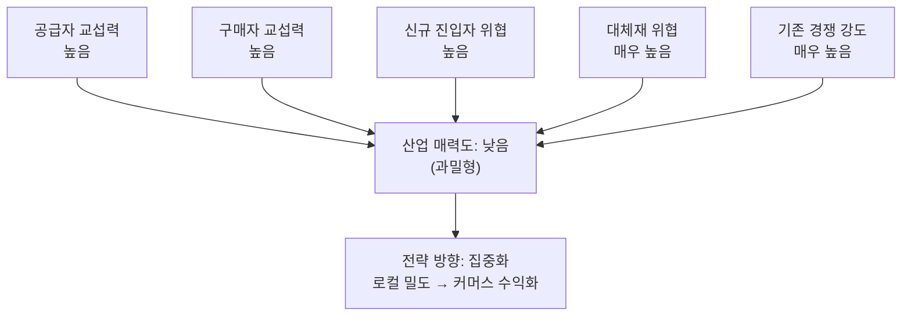

# 분석 ① — 이미지 & 숏폼 영상 중심의 위치기반 SNS

> [분석 방법론](./분석-방법론.md)에 따른 Porter's Five Forces 분석

## 0. 분석 단위 설정

5가지 힘은 **"우리"가 누구냐**에 따라 결과가 완전히 달라진다. 먼저 못을 박고 시작한다.

| 항목 | 설정 |
|---|---|
| 분석 주체 | 위치정보(지도·체크인·주변)를 핵심 축으로 이미지·숏폼 영상을 공유하는 **플랫폼 사업자** |
| 수익 모델 | 지역 타깃 광고 중심, 일부 구독·커머스 |
| 지역·시점 | 국내 시장, 2026년 현재 |
| 참고 사례 | Snapchat(Snap Map), Zenly(2023 종료), BeReal, Instagram 지도·릴스 |

⚠️ 여기서 "고객"은 두 종류다. **돈을 내는 광고주**와 **돈을 안 내는 사용자**. 구매자 교섭력을 분석할 때 이 둘을 섞으면 분석이 무너진다.

---

## 1) 공급자의 힘 — **높음**

공급자를 한 덩어리로 보면 안 되고 네 층으로 쪼개야 한다.

| 공급자 층 | 힘 | 근거 |
|---|---|---|
| **OS 게이트키퍼** (Apple / Google) | 매우 강함 | 인앱결제 수수료도 문제지만, 진짜 급소는 **위치 권한 정책**. iOS의 앱 추적 투명성(ATT, 2021)과 정밀위치 권한 축소는 이 산업의 광고 타게팅 정확도를 직접 깎아냈다. 협상 자체가 불가능한 상대. |
| **지도·위치 데이터** (Google Maps, Mapbox, 네이버·카카오 지도 API) | 강함 | 위치기반이 제품의 핵심이라 이 API가 곧 원재료. 가격 정책이 한 번 바뀌면 원가 구조가 흔들린다. **일반 SNS와 위치기반 SNS를 가르는 결정적 차이가 바로 이 공급자의 존재.** |
| **클라우드·CDN** (AWS, GCP) | 강함 | 영상 트래픽 비용이 원가의 큰 몫. Snap이 Google Cloud와 수조 원대 장기 계약을 맺은 것이 대표 사례. 방법론의 두 조건 — *원가 비중이 크다* + *바꾸는 데 큰 추가 비용이 든다* — 를 동시에 충족한다. |
| **크리에이터** (콘텐츠 공급자) | 강함 | 숏폼은 상위 크리에이터에 트래픽이 쏠린다. 이들은 인스타·틱톡·유튜브를 **동시 운영(멀티호밍)** 하는 게 기본이라 전환비용이 사실상 0. 붙잡으려면 크리에이터 펀드·수익 배분으로 돈을 써야 하고, 이는 곧 마진 압박이다. |

> 📌 **전방 통합의 위협도 실재한다.** 지도 사업자(네이버·카카오)와 OS 사업자가 직접 로컬 소셜 기능을 붙이면 우리를 건너뛴다. 방법론 1)의 마지막 항목이 그대로 적용된다.

---

## 2) 구매자의 힘 — **높음**

### 광고주 (실제 지불자)
- 메타·구글·틱톡이라는 대안이 항상 있고, 성과(ROAS)로 즉시 비교당한다.
- 파는 물건이 임프레션·클릭이라는 **표준화된 상품**이다. 방법론의 *"제품이 너무 흔해서 고객이 다른 곳에서 쉽게 사 올 수 있다"* 에 정확히 해당.
- → **매우 강함**

### 사용자 (돈은 안 내지만 이탈이 곧 재고 소멸)
- 앱 전환비용 거의 0. 삭제하고 다른 앱 깔면 끝.
- 유일한 락인은 **친구 그래프**인데, Zenly 종료 당시 사용자가 특정 대안으로 통째로 이동하지 않고 흩어진 것을 보면 생각보다 약하다.
- → **강함**

---

## 3) 신규 진입자의 위협 — **높음**

진입 장벽을 방법론의 3요소로 점검하면:

| 장벽 요소 | 평가 |
|---|---|
| 규모의 경제 | **약함** — 클라우드·지도 API·추천 모델을 전부 사서 조립할 수 있다. 초기 자본이 크지 않다. |
| 기술적 우위·특허 | **약함** — 핵심 기술이 대부분 상용화·오픈소스화되어 있다. |
| 채널·브랜드 선점 | **중간** — 앱스토어는 누구에게나 열려 있으나, 인지도 확보에는 비용이 든다. |

**이 산업의 진짜 장벽은 네트워크 효과인데, 위치기반에서는 그 성격이 다르다.** 전국 1,000만 명보다 *내 반경 2km 안의 친구 50명*이 중요하다. 네트워크 효과가 **로컬로 쪼개져 있다**는 뜻이고, 이건 양날의 검이다.

- 방어자에게 불리 → 기존 강자를 전국 단위로 이길 필요가 없다. **특정 대학·지역·연령대만 뚫으면 교두보가 생긴다.** Facebook이 하버드에서, Snapchat이 미국 고등학생에서 시작한 경로가 이것.
- 게다가 더 무서운 건 신생 스타트업이 아니라 **인접한 거인의 기능 복제**다. 인스타그램이 릴스로 틱톡을, 지도 기능으로 Zenly를 흡수했다. 이들은 이미 사용자와 광고주를 다 갖고 들어온다.

---

## 4) 대체재의 위협 — **매우 높음**

고객의 욕구를 세 갈래로 분해하면 대체재가 사방에 있다.

| 충족하려는 욕구 | 대체재 |
|---|---|
| 친구와 근황 공유 | 카카오톡 오픈채팅, 디스코드, 그냥 1:1 메신저 |
| 시간 때우기 | 유튜브 쇼츠, 넷플릭스, 모바일 게임 |
| 주변 정보 탐색 | 네이버 지도, 카카오맵, 구글맵 리뷰, 당근 |

특히 두 번째가 치명적이다. 이건 **가처분 시간 전쟁**이라 업종을 가리지 않고 모든 콘텐츠 산업이 대체재가 된다. 그리고 전환비용은 0 — 방법론의 *"쉽게 갈아탈 수 있다면 이 위협은 더욱 커진다"* 에 그대로 부합한다.

---

## 5) 산업 내 경쟁 강도 — **매우 높음**

- 인스타그램, 틱톡, 유튜브 쇼츠, 스냅챗이 같은 '숏폼 + 소셜' 자원을 놓고 이미 싸우고 있다.
- 경쟁 수단이 **가격 인하가 아니라 콘텐츠 보조금과 기능 복제**로 나타난다. 크리에이터 펀드, 추천 알고리즘 투자 — 즉 가격을 깎는 대신 **비용이 올라가는** 형태의 경쟁이다. 결과는 같다: 마진 잠식.
- 국내 스마트폰 보급은 포화라 사용자 수 성장은 정체. 이제는 **서로의 시간을 뺏는 제로섬**이다. 방법론이 지목한 *"시장이 성장 정체기에 접어들었을 때"* 조건에 해당.

---

## 종합: 산업 매력도 **낮음** — 과밀형

다섯 가지 힘이 **전부 강하다.** 방법론의 명제 — *다섯 가지 힘이 강할수록 돈 벌기 어렵다* — 를 가장 교과서적으로 보여주는 사례다. 승자독식으로 소수만 살아남고, 살아남은 소수도 광고 시장 규모라는 천장에 걸린다.

## 전략 시사점

| 방향 | 내용 |
|---|---|
| **집중화** (권장) | 전국 단위 정면 승부는 자살. 특정 맥락(대학가, 러닝 크루, 여행지)에 **로컬 밀도**를 먼저 만들고 확장. 로컬 네트워크 효과가 방어자에게 불리하다는 점을 공격자 입장에서 역이용. |
| **차별화** (비권장) | 기능 차별화는 즉시 복제당한다. 인스타그램이 릴스로 틱톡을, 지도 기능으로 Zenly를 흡수한 것이 그 증거다. 거인이 이미 사용자와 광고주를 다 갖고 들어오므로, 기능 우위만으로는 방어 시간을 벌지 못한다. |
| **저비용** (비권장) | 원가의 핵심인 클라우드·지도 API 공급자 교섭력이 강해 원가 우위 확보가 어렵다. |
| *(보조) 수익원 이동* | 위 셋과 별개의 축. 광고는 구매자(광고주) 교섭력이 너무 강하므로, 위치 데이터를 **커머스·예약 전환**으로 연결하면 구매자 구조 자체가 바뀐다. 단, 이는 사실상 다른 산업으로 이동하는 것이므로 5가지 힘을 다시 그려야 한다. |
