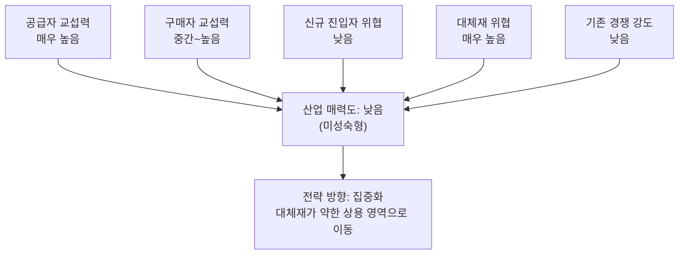

# 분석 ② — 미래형 수소(연료전지) 전기 승용차 산업

> [분석 방법론](./분석-방법론.md)에 따른 Porter's Five Forces 분석

## 0. 분석 단위 설정 및 용어 정리

### 용어 정리 — '수소 배터리'는 없다

수업 자료로 쓸 것이므로 짚어둔다. **수소를 저장했다가 쓰는 배터리라는 부품은 존재하지 않는다.** 정확한 명칭은 **수소연료전지(Fuel Cell)** 로, 수소와 산소를 반응시켜 **그 자리에서 전기를 만들어내는 발전기**다. 배터리는 전기를 *저장*하고, 연료전지는 전기를 *생산*한다.

| 구분 | BEV (배터리 전기차) | FCEV (수소연료전지차) |
|---|---|---|
| 전기의 출처 | 외부에서 충전해 **저장** | 차 안에서 수소로 **생산** |
| 에너지 보급 | 충전(充電), 수십 분~수 시간 | 충전(充塡), 5분 내외 |
| 대표 모델 | 테슬라, 아이오닉 | 현대 넥쏘, 토요타 미라이 |

둘 다 모터로 굴러가는 **전기차**라는 점은 같다. 이 구분이 4)번 힘(대체재)에서 결정적으로 작용한다.

### 분석 단위

| 항목 | 설정 |
|---|---|
| 분석 주체 | 수소연료전지 **승용차 완성차 제조사** |
| 지역·시점 | 국내 시장, 2026년 현재 |
| 참고 사례 | 현대차 넥쏘, 토요타 미라이, 혼다 |

⚠️ **분석을 무너뜨리는 함정 — 승용차와 상용차를 섞지 말 것.** 같은 수소연료전지 기술이라도 **승용차**와 **상용차(버스·트럭·건설기계)** 는 5가지 힘이 정반대로 나온다. 승용차에서는 BEV라는 대체재가 압도적이지만, 무거운 짐과 긴 주행거리, 정해진 노선을 도는 상용차에서는 BEV가 오히려 불리하다. 이 분석은 **승용차로 범위를 한정**한다. 상용차를 섞으면 대체재 위협 판정이 뒤집히고 결론 전체가 달라진다.

---

## 1) 공급자의 힘 — **매우 높음**

| 공급자 | 힘 | 근거 |
|---|---|---|
| **백금(Platinum)** | 매우 강함 | 연료전지 촉매의 필수재. 세계 생산이 남아공에 크게 편중되어 있어 지정학적 리스크에 노출. 원가 비중이 크고 대체가 어려워 방법론의 두 조건을 동시에 충족한다. |
| **연료전지 스택 부품** (막전극접합체 MEA, 분리판) | 강함 | 공급 가능한 업체가 소수. 기술 난도가 높아 대안 확보가 어렵다. |
| **고압 수소탱크** (탄소섬유) | 강함 | 700bar 고압 저장용 탄소섬유는 일본 소수 업체가 과점. |
| **수소 연료 자체** | ⚠️ 특수 | 완성차사가 파는 게 아니라 **고객이 따로 사야 하는 것**인데, 공급망이 미성숙하다. 충전소가 적고 적자 운영이 일반적이며 수소 가격도 안정적이지 않다. |

> 📌 **이 산업 특유의 뒤틀림.** 마지막 항목이 중요하다. 보통 공급자의 힘은 *"가격을 후려친다"* 는 형태로 나타나는데, 여기서는 **"공급자가 아예 부실해서 시장이 열리지 않는다"** 는 형태로 나타난다. 완성차사가 아무리 좋은 차를 만들어도 충전소가 없으면 팔 수 없다. 힘의 방향이 아니라 **존재 여부**가 문제인 셈이다.

---

## 2) 구매자의 힘 — **중간~높음**

교과서적 판단과 실질이 갈리는 지점이라 나눠 본다.

### 개인 승용차 구매자
- 개별 구매자는 파편화되어 있어 가격 협상력이 없다 → 형식적으로는 **약함**.
- 그러나 실질적으로 **"사지 않을 힘"** 이 있다. 충전 인프라 부족을 이유로 그냥 BEV나 하이브리드를 산다. 이건 엄밀히는 교섭력이 아니라 **대체재 선택권**이며, 4)번 힘으로 넘어간다.

### 정부·공공 (진짜 대형 구매자)
- 보조금이 실구매가의 상당 부분을 좌우하므로, **정부가 가격 결정에 직접 개입**한다.
- 수소버스·관용차 등 대량 구매 주체도 정부다.
- 방법론의 *"큰 손님이 소수라면 가격 협상에서 우위를 점하기 쉽다"* 에 정확히 부합. → **매우 강함**

**전환비용**: 소비자가 BEV·내연기관으로 갈아타는 데 드는 비용은 낮다. 어차피 차는 새로 사는 것이다. 방법론의 *"전환 비용이 크다면 구매자의 힘은 약해진다"* 가 여기서는 작동하지 않는다.

> 📌 산업의 수요가 정부 정책에 크게 묶여 있다는 것은 구조적 취약점이다. 정책이 바뀌면 수요가 바뀐다.

---

## 3) 신규 진입자의 위협 — **낮음**

방법론의 진입장벽 3요소가 **전부 높다.**

| 장벽 요소 | 평가 |
|---|---|
| 규모의 경제 | **매우 강함** — 연료전지 스택 양산 라인 + 완성차 생산 설비. 초기 투자 규모가 조 단위. |
| 기술적 우위·특허 | **매우 강함** — 현대차·토요타가 연료전지 관련 특허를 대량 보유. 수십 년 누적된 기술. |
| 채널·브랜드 | **강함** — 승용차는 전국 서비스망과 안전 인증 없이는 판매 자체가 불가능. |

### ⚠️ 여기서 5가지 힘 모델의 함정을 짚고 가야 한다

신규 진입자가 없는 이유가 **"장벽이 높아서"** 만은 아니다. 더 큰 이유는 **"시장이 작아서 아무도 들어오고 싶어 하지 않는다"** 는 것이다.

같은 자동차 산업이라도 BEV에서는 이 장벽이 크게 낮아졌다 — 테슬라와 중국 신생 업체들이 실제로 진입에 성공했다. **장벽의 높이는 산업의 매력이 클 때만 의미가 있다.** 매력이 없으면 장벽은 측정되지 않는다.

이 구분은 6)번 챕터(기회점수 분석)와 4)번 챕터(TAM-SAM-SOM)로 넘어가는 다리가 된다.

---

## 4) 대체재의 위협 — **매우 높음** (이 산업의 급소)

고객의 욕구를 **"탄소 배출 없이 이동한다"** 로 정의하면, 이 욕구를 채우는 다른 수단들이 이미 앞서 있다.

| 대체재 | 위협 수준 | 근거 |
|---|---|---|
| **BEV (배터리 전기차)** | 치명적 | 충전 인프라가 압도적으로 우위, 가격은 계속 하락, 그리고 **에너지 효율(well-to-wheel)도 FCEV보다 높다.** 수소는 생산·압축·운송·재발전 단계마다 손실이 누적되기 때문. 정면 대체재이자 사실상 이미 승기를 잡았다. |
| **하이브리드 / PHEV** | 높음 | 인프라 걱정 없이 배출을 줄이는 현실적 타협안. 소비자 저항이 가장 적다. |
| **내연기관 존속 · e-fuel** | 중간 | 규제 완화 시나리오에서 살아남는 선택지. |

방법론의 *"대체재가 너무 좋거나 싸게 등장하면 우리 제품 가격을 올리기 힘들어진다"* 의 극단적 사례다. 여기에 전환비용까지 낮으니 위협을 완화할 장치가 없다.

**이 힘 하나가 산업 전체를 누르고 있다.**

---

## 5) 산업 내 경쟁 강도 — **낮음** (좋은 의미가 아니다)

- FCEV 승용차 플레이어가 사실상 현대차·토요타·혼다 정도로 극소수다.
- 서로 가격 전쟁을 벌이지 않는다. 오히려 **협력**해서 수소 생태계를 함께 키우려 한다(수소 얼라이언스, 충전 인프라 공동 투자).
- 경쟁이 약한 이유가 *우리가 강해서* 가 아니라 **시장이 작아서**다. 나눠 가질 파이가 없으니 싸울 일이 없다.

> ⚠️ **해석 주의.** 방법론에는 *"힘이 약할수록 수익성이 높다"* 고 되어 있지만, 그건 **파이가 이미 존재할 때**의 이야기다. 경쟁자가 없는 이유가 시장이 없어서라면, 낮은 경쟁 강도는 매력 신호가 아니라 **경고 신호**다.

---

## 종합: 산업 매력도 **낮음** — 미성숙형

다섯 힘 중 두 개(진입자·경쟁 강도)가 **낮은데도** 매력도가 낮다. 이유는 단순하다 — 그 둘이 낮은 것이 **시장이 아직 열리지 않았다는 증상**이기 때문이다.

## 전략 시사점

| 방향 | 내용 |
|---|---|
| **집중화** (권장) | 승용차 정면 승부는 BEV에 진다. **대체재가 약한 영역으로 이동**해야 한다 — 상용차, 장거리 트럭, 버스, 건설기계, 선박. 무거운 짐과 긴 주행거리에서는 배터리 무게가 불리하고, 정해진 노선을 도니 충전소도 거점 몇 개면 충분하다. **BEV의 약점이 곧 FCEV의 진지다.** |
| **차별화** | 5분 충전과 긴 주행거리라는 강점은 실재하나, 충전소가 없으면 강점이 성립하지 않는다. 인프라 문제 해결 없이는 차별화 소구가 작동하지 않는다. |
| **저비용** (비권장) | 백금 등 공급자 교섭력이 강하고 생산량이 적어 규모의 경제가 작동하지 않는다. 단기 원가 우위는 불가능. |

> 📌 ①번 분석과 결정적으로 다른 점: 이 산업은 **정부 정책과 인프라 투자로 힘의 구도 자체를 바꿀 수 있다.** 5가지 힘을 주어진 조건으로 받아들이는 게 아니라 만들어가는 게임이다. 자세한 비교는 [비교 분석](./비교-01-vs-02.md) 참고.
