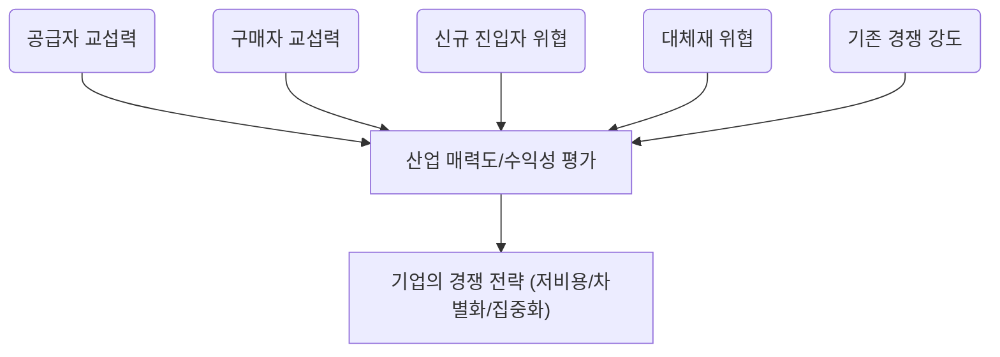
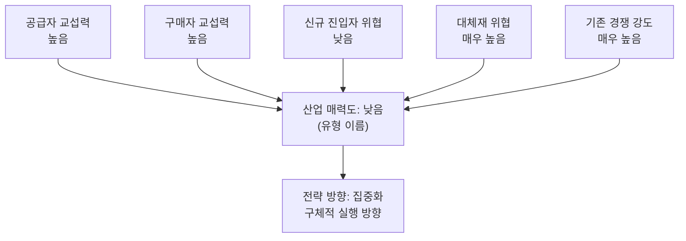

# 01 — Porter's Five Forces 모델 : 분석 방법론

> 본 챕터의 분석은 이 문서에 정의된 방법론을 따른다.

---

## 1. 포터의 5가지 힘: 비즈니스의 '주변 환경' 탐색

- 이 분석은 단순히 우리 회사 내부만 보는 게 아니라, 우리가 속한 **산업 전체**의 매력을 평가하는 도구예요.
- 마치 부동산을 살 때 집의 내부뿐만 아니라 동네의 치안, 교통, 학군을 모두 살펴보는 것과 비슷하죠.
- 핵심은 **산업 자체가 얼마나 돈이 잘 되는 구조인지**를 다섯 가지 관점으로 쪼개보는 것입니다.
- 이 분석을 통해 기업은 어떤 시장에서 싸워야 할지, 그리고 어떻게 자리를 잡아야 할지 **전략적 판단**을 내릴 수 있게 됩니다.

> 🖼️ *(이미지 자리)* A simple diagram showing the five forces surrounding a central industry: Supplier Power, Buyer Power, Threat of New Entrants, Threat of Substitutes, and Rivalry Among Existing Competitors.

## 2. 경쟁의 5가지 근원: 이들을 파악해야 성공한다

- 포터 교수는 산업 내 경쟁이 일어나는 근본적인 이유가 딱 다섯 가지라고 정리했어요.
- 이 다섯 가지 힘이 **강할수록** 그 산업은 돈 벌기가 어렵고, **약할수록** 수익성이 높다는 뜻입니다.
- 이 다섯 가지 힘을 이해하면 기업은 시장의 **경쟁 강도**와 **매력도**를 한눈에 파악할 수 있어요.
- 다섯 가지 힘은 공급자의 힘, 구매자의 힘, 신규 진입자의 위협, 대체재의 위협, 그리고 **기존 경쟁자** 간의 싸움입니다.

### 1) 공급자의 힘: 재료 수급 물목의 보유자들

- 공급자(원재료나 부품을 주는 사람)가 우리에게 콧대를 세울 수 있는지를 보는 힘이에요.
- 만약 우리 제품 원가의 **대부분을 그들의 재료**가 차지한다면 그들은 갑이 될 수밖에 없죠.
- 또, 그들이 파는 물건을 다른 회사에서 구하기 **너무 어렵거나** 바꿀 때마다 큰 **추가 비용**이 든다면 힘이 세집니다.
- 이들은 우리 회사를 건너뛰고 우리 고객에게 직접 팔 수도(전방 통합) 있어서 더 무섭죠.

### 2) 구매자의 힘: 가격 흥정의 달인들

- 구매자(우리가 만든 물건을 사주는 고객)가 가격을 마구 깎아내리거나 품질을 높이 요구할 수 있는지 분석하는 거예요.
- 만약 우리 회사 제품을 사는 **큰 손님**이 소수라면, 그들은 가격 협상에서 우위를 점하기 쉽습니다.
- 우리가 만든 제품이 **너무 흔해서** (표준화되어 있어서) 고객이 다른 곳에서 쉽게 사 올 수 있다면 힘이 강해지죠.
- 반대로, 고객이 우리 회사를 **바꾸는 데 드는 노력(전환 비용)** 이 크다면 그들의 힘은 약해집니다.

### 3) 신규 진입자의 위협: 시장을 노리는 잠재적 경쟁자들

- 아직 우리 시장에 들어오지 않았지만, 언제든 **문 부수고 들어와서** 시장 파이를 뺏어갈 수 있는 잠재적 경쟁자에 대한 경계심입니다.
- 이들의 위협 수준은 **진입 장벽(Barrier to Entry)** 이 얼마나 높은가에 달려 있어요.
    - 규모의 경제: 회사가 커질수록 물건 하나 만드는 단가가 싸지면, 작은 신규 업체는 따라오기 힘들어요.
    - 기술적 우위나 특허: 독점 기술이 있으면 남들이 따라 하기 어렵습니다.
    - 채널 확보: 이미 좋은 유통망이나 브랜드 평판을 선점했다면 신규 업체가 비집고 들어오기 어렵습니다.

> 🖼️ *(이미지 자리)* A simple conceptual diagram showing high barriers to entry (like a tall wall) protecting an established industry from new entrants.

### 4) 대체재의 위협: '완전히 다른 것'의 습격

- 대체재는 우리 제품과 **완전히 다른 종류**이지만, 고객의 **같은 욕구**를 채워줄 수 있는 것을 말해요.
- 예를 들어, KTX의 대체재는 비행기일 수도 있지만, '빨리 이동하고 싶다'는 욕구 충족에서는 자동차도 넓은 의미의 대체재가 될 수 있어요.
- 대체재가 너무 좋거나 싸게 등장하면, 우리 제품 가격을 올리기 힘들어지거나 품질 개선 압박을 받게 됩니다.
- 고객이 **쉽게 대체재로 갈아탈 수 있다면** (전환 비용이 낮다면) 이 위협은 더욱 커집니다.

### 5) 산업 내 경쟁 강도: 치열한 내부 싸움

- 같은 시장에서 이미 활동 중인 경쟁사들끼리 피 튀기는 싸움을 하는 정도를 의미해요.
- 이 경쟁은 주로 **가격 인하, 광고, 신제품 출시** 등으로 나타나며 서로의 이익을 깎아내리죠.
- 경쟁이 심해지는 주된 이유는 시장이 성장 정체기에 접어들었거나, 경쟁사들이 너무 많을 때 발생합니다.
- 결국 이 내부 경쟁이 치열하면, **산업 전체의 평균 수익률**은 낮아지게 됩니다.

## 3. 5가지 힘의 관계 - 전체 구조도로 파악하기

- 이 다섯 가지 힘은 서로 분리된 것이 아니라, 복잡하게 얽혀 산업의 수익성을 결정해요.
- 이 모델은 **"우리가 어느 산업에서 싸울지"** 를 결정하는 데 최적화된 도구입니다.
- 분석 후에는 우리 회사의 **자원**과 산업의 매력도를 비교하여 전략을 짜야 해요.
- 전략은 고정된 것이 아니라 시장 변화에 따라 **유연하게 조정**되어야 하므로, 이 분석은 주기적인 피드백 과정이 필요합니다.



---

# 분석 결과물 포맷 규격

> ⚠️ 위 5가지 힘을 설명하는 것만으로는 분석이 완성되지 않는다.
> **아래 골격을 모두 채워야 분석이 끝난 것으로 본다.** 이 절은 누가 언제 이 방법론을 쓰더라도 같은 수준의 결과물이 나오도록 하기 위한 규격이다.

## 4. 산출물 구성

| 분석 대상 수 | 산출 파일 |
| --- | --- |
| 1개 | `분석-01-<대상명>.md` |
| 2개 이상 | `분석-01-<대상명>.md`, `분석-02-<대상명>.md` … **+ `비교-01-vs-02.md` (필수)** |

- 대상이 둘 이상이면 **비교 문서를 반드시 별도 파일로** 만든다. 개별 분석 문서 안에 비교를 섞지 않는다.
- 파일은 챕터 디렉터리(`01-porters-five-forces/`) 아래에 둔다.

## 5. 개별 분석 문서 골격

각 항목의 `[필수]`는 생략할 수 없다.

```
# 분석 ① — <대상 시장/산업명>

> [분석 방법론](./분석-방법론.md) 에 따른 Porter's Five Forces 분석

## 0. 분석 단위 설정
    [필수] 분석 단위 표 — 분석 주체 / 수익 모델 / 지역·시점 / 참고 사례
    [필수] ⚠️ 분석을 무너뜨릴 수 있는 함정을 먼저 명시
           (예: "이 산업에서 고객은 광고주와 사용자 둘이다. 섞으면 분석이 무너진다")
    [선택] 용어 정리 — 통념과 다르거나 혼동되는 용어가 있을 때만

## 1) 공급자의 힘 — <강도>
## 2) 구매자의 힘 — <강도>
## 3) 신규 진입자의 위협 — <강도>
## 4) 대체재의 위협 — <강도>
## 5) 산업 내 경쟁 강도 — <강도>
    [필수] 각 힘의 제목 줄에 강도 판정을 함께 적는다
    [필수] 근거를 표 또는 항목으로 제시 — 판정만 쓰지 않는다
    [필수] 3)번은 진입장벽 3요소(규모의 경제 / 기술·특허 / 채널·브랜드)를 표로 점검
    [선택] 📌 인사이트 · ⚠️ 해석 주의 블록 — 그 힘에 결정적 특징이 있을 때만

## 종합: 산업 매력도 <높음/중간/낮음> — <유형 이름>
    [필수] 5개 힘 → 매력도 → 전략 방향을 잇는 mermaid (규칙은 7절)
    [필수] 매력도에 **유형 이름**을 붙인다 (예: 과밀형 / 미성숙형 / 요새형)
    [필수] 그 판정에 이른 한 문단 설명

## 전략 시사점
    [필수] 저비용 · 차별화 · 집중화 **세 가지 모두**에 대입한 표
           — 방향 / 내용 / 권장·비권장 판정과 이유
```

## 6. 힘 강도 판정 척도 (고정)

척도를 임의로 늘리거나 바꾸지 않는다. 문서 간 비교 가능성이 깨진다.

| 판정 | 의미 |
| --- | --- |
| **낮음** | 이 힘은 산업 수익성을 거의 깎지 않는다 |
| **중간** | 압박은 있으나 기업이 대응할 여지가 있다 |
| **높음** | 수익성을 실질적으로 잠식한다 |
| **매우 높음** | 이 힘 하나로 산업의 구조가 사실상 결정된다 |

- 경계가 애매하면 `중간~높음` 처럼 **범위로 표기**할 수 있다. 억지로 하나를 고르지 않는다.
- 종합 매력도는 `높음 / 중간 / 낮음` 3단계로 쓰되, **반드시 유형 이름을 함께 붙인다.**

> **왜 유형 이름이 필수인가.** 매력도가 '낮음'인 이유는 산업마다 다르다. *힘이 모두 강해서 이익이 깎이는 과밀형* 과 *시장이 아직 열리지 않은 미성숙형* 은 같은 '낮음'이지만 처방이 정반대다. 유형을 붙이지 않으면 다음 단계에서 잘못된 전략이 나온다.

## 7. 종합 다이어그램 규칙

종합 절에 넣는 mermaid는 아래 형식을 따른다.

- `graph TD` 로 그린다.
- 5개 힘 노드를 각각 매력도 노드 `A` 로 연결한다.
- 각 힘 노드는 `힘 이름<br/>강도` 2줄로 쓴다.
- 매력도 노드에는 `산업 매력도: <판정><br/>(<유형 이름>)` 을 넣는다.
- 매력도 노드에서 전략 방향 노드로 화살표 하나를 더 긋는다.



## 8. 비교 문서 골격

분석 대상이 둘 이상일 때만 작성한다.

```
# 비교 분석 — A ↔ B

> 개별 분석 문서 링크

## 왜 이 두 시장을 나란히 놓는가
    [필수] 이 비교에서만 드러나는 것이 무엇인지 한 문단

## 1. 힘별 대조표
    [필수] 5개 힘 전부를 한 표에, 각 칸에 강도 + 한 줄 근거
    [필수] 마지막 행에 매력도와 유형 이름
    [필수] 두 산업의 저매력 구조를 대비하는 mermaid 1개

## 2. 핵심 대비 N가지                 (3~5개 권장)
    [필수] 각 항목 = 소제목 + 대조표 또는 설명 + 📌 정리 문장
    [필수] 최소 1개는 "같은 판정인데 원인이 다른 지점"을 다룰 것

## 3. 전략 결론
    [필수] 대상별 전략 대조표 — 집중 방향 / 구체적 진지 / 왜 통하는가 / 저비용·차별화 가능성

## 4. 이 비교에서 남는 교훈
    [필수] 번호 목록 4~5개
    [필수] 마지막 항목은 모델의 한계와 다음 챕터로 넘어가는 질문으로 마무리
```

## 9. 작성 품질 기준

1. **5가지 힘을 하나도 빠뜨리지 않는다.** 해당 산업에서 의미가 약한 힘이라도 *"낮음"* 과 그 이유를 명시한다. 조용히 생략하지 않는다.
2. **모든 강도 판정에 근거를 붙인다.** 판정만 적힌 절은 미완성으로 본다.
3. **공급자와 구매자는 층으로 쪼개서 본다.** 한 덩어리로 보면 분석이 무너진다. 공급자는 원재료·인프라·플랫폼 게이트키퍼 등으로, 구매자는 실제 지불자와 사용자로 나눈다.
4. **대체재는 '같은 욕구를 채우는 다른 종류'로 정의한다.** 같은 종류의 경쟁 제품은 5)번 경쟁 강도이지 대체재가 아니다. 이 둘을 섞는 것이 가장 흔한 실수다.
5. **'경쟁 강도 낮음'을 자동으로 매력 신호로 읽지 않는다.** 경쟁자가 없는 이유가 *우리가 강해서* 인지 *시장이 작아서* 인지 구분한다. 후자라면 낮은 경쟁 강도는 매력이 아니라 경고다.
6. **진입장벽의 높이는 산업의 매력이 있을 때만 의미가 있다.** 아무도 들어오지 않는 이유가 장벽 때문인지 매력이 없어서인지 밝힌다.
7. **확인되지 않은 수치는 쓰지 않는다.** 정성적으로 서술하거나 *"확인 필요"* 로 표시한다. 그럴듯한 숫자를 지어내는 것이 가장 흔한 실패다.
8. **분석 단위를 0절에서 못 박는다.** 분석 주체가 누구냐에 따라 결과가 완전히 뒤집힌다. 이것을 정하지 않고 시작한 분석은 무효로 본다.
9. **전략 시사점은 세 가지 본원적 전략 모두에 대입한다.** 권장하는 하나만 쓰지 말고, 나머지 둘이 왜 안 되는지도 판정한다.
