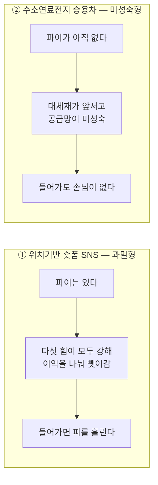

# 비교 분석 — 위치기반 숏폼 SNS ↔ 수소연료전지 승용차

> [① 위치기반 숏폼 SNS](./분석-01-위치기반-숏폼-SNS.md) · [② 수소연료전지 승용차](./분석-02-수소연료전지-승용차.md)

## 왜 이 두 시장을 나란히 놓는가

두 산업은 **결론이 같고 이유가 정반대**다. 5가지 힘 평가를 단순 합산하면 둘 다 "매력도 낮음"이 나오는데, 처방은 완전히 다르다. 이 대비가 모델을 제대로 쓰는 법을 가르쳐준다.

**5가지 힘 분석의 결과는 점수가 아니라 진단이다.**

---

## 1. 힘별 대조표

| 힘 | ① 위치기반 숏폼 SNS | ② 수소연료전지 승용차 |
|---|---|---|
| **공급자 교섭력** | **높음** OS 게이트키퍼 · 지도 API · 클라우드 · 크리에이터 | **매우 높음** 백금 · 고압탱크 · 그리고 *부실한* 수소 공급망 |
| **구매자 교섭력** | **높음** 광고주는 대안이 풍부, 사용자는 이탈 자유 | **중간~높음** 개인은 약하나 정부가 대형 구매자 |
| **신규 진입자 위협** | **높음** 기술 장벽 낮고, 거인이 기능을 복제해 들어옴 | **낮음** 자본 · 특허 · 채널 3중 장벽 |
| **대체재 위협** | **매우 높음** 가처분 시간을 놓고 전 콘텐츠 산업과 경쟁 | **매우 높음** BEV가 인프라 · 가격 · 효율 모두 우위 |
| **기존 경쟁 강도** | **매우 높음** 보조금 · 기능 복제로 마진 잠식 | **낮음** 플레이어 3곳, 오히려 협력 관계 |
| **매력도** | **낮음 — 과밀형** | **낮음 — 미성숙형** |

---

## 2. 핵심 대비 네 가지

### ① 저매력의 원인이 정반대다

- **SNS는 힘이 강해서** 이익이 깎인다. 파이는 크지만 사방에서 뜯어간다.
- **수소차는 시장이 안 열려서** 이익이 없다. 뜯어갈 사람도 없지만 나눌 파이도 없다.

전자는 *"들어가면 피 흘린다"*, 후자는 *"들어가도 손님이 없다"*. 대응이 같을 수 없다.

### ② '경쟁 강도 낮음'을 매력 신호로 읽으면 오독이다

방법론에는 *"힘이 약할수록 수익성이 높다"* 고 적혀 있다. 그런데 ②의 경쟁 강도가 낮은 것은 매력이 아니라 **경고**다.

> 5가지 힘은 **"지금 있는 파이를 누가 나눠 갖는가"** 를 보는 모델이다.
> 파이 자체가 아직 없는 산업에는 그대로 적용할 수 없다.

이 한계를 메우려면 **시장의 크기와 성장 속도**를 따로 봐야 한다. → 챕터 04(TAM-SAM-SOM), 챕터 06(기회점수)으로 이어지는 지점.

### ③ 재분석 주기가 다르다

| | ① SNS | ② 수소차 |
|---|---|---|
| 힘이 바뀌는 속도 | **분기 단위** — OS 정책 변경 하나에 수익 모델이 흔들림 | **10년 단위** — 충전 인프라 구축, 백금 대체 촉매 개발 |
| 필요한 분석 주기 | 잦게, 얕게 | 드물게, 깊게 |

방법론 3절의 *"주기적인 피드백 과정이 필요하다"* 는 대목이 두 산업에서 완전히 다른 의미를 갖는다.

### ④ 힘을 바꿀 수 있느냐 — 통제 가능성

- **①의 사업자는 힘을 바꿀 수단이 거의 없다.** 애플의 위치 권한 정책도, 광고주가 가진 대안도 우리가 어쩌지 못한다. 주어진 판에서 자리를 잡는 수밖에 없다.
- **②는 힘의 구도 자체를 바꿀 수 있다.** 정부 정책, 인프라 투자, 산업 얼라이언스로 충전소를 깔면 대체재의 우위가 줄어든다. **산업 매력도를 만들어가는 게임**이다.

> 📌 5가지 힘을 *주어진 환경*으로 볼 것인가, *바꿀 수 있는 대상*으로 볼 것인가. 이 질문에 대한 답이 두 산업에서 갈린다.

---

## 3. 전략 결론 — 둘 다 '집중화', 그러나 다른 집중화

방법론 3절의 세 가지 본원적 전략(저비용 / 차별화 / 집중화)에 대입하면 두 산업 모두 **집중화**로 수렴한다. 하지만 집중화의 성격이 다르다.

| | ① 위치기반 숏폼 SNS | ② 수소연료전지 승용차 |
|---|---|---|
| **집중화 방향** | 작게 쪼개서 **밀도**를 얻는다 | 대체재가 **못 오는 곳**으로 옮긴다 |
| **구체적 진지** | 대학가 · 러닝 크루 · 여행지 등 특정 맥락에서 로컬 네트워크 밀도 확보 | 상용차 · 장거리 트럭 · 버스 · 건설기계 · 선박 |
| **왜 통하는가** | 위치기반의 네트워크 효과는 **로컬로 쪼개져 있다.** 전국에서 이길 필요가 없다 | 무거운 짐 · 긴 주행거리 · 정해진 노선에서는 배터리가 불리하다. **BEV의 약점이 FCEV의 진지다** |
| **저비용 가능성** | ✗ 클라우드 · 지도 API 원가를 통제할 수 없음 | ✗ 백금 의존 + 규모의 경제 미달 |
| **차별화 가능성** | △ 기능은 즉시 복제당함 | △ 5분 충전은 실재하는 강점이나 인프라 없이는 성립 안 함 |

---

## 4. 이 비교에서 남는 교훈

1. **분석 단위를 먼저 못 박아라.** ①에서 "고객"이 광고주인지 사용자인지 정하지 않으면 구매자 교섭력 분석이 무너진다. ②에서 승용차인지 상용차인지에 따라 결론이 뒤집힌다.
2. **힘의 방향뿐 아니라 원인을 보라.** '낮음'이 강해서인지 시장이 없어서인지 구분해야 한다.
3. **다섯 힘의 합계는 의미가 없다.** 어떤 힘이 급소인지가 중요하다. ①의 급소는 대체재+경쟁 강도, ②의 급소는 대체재 단 하나다.
4. **모델의 한계를 알고 써라.** 5가지 힘은 **현재 산업 구조**의 스냅샷이다. 시장 크기(챕터 04), 고객의 실제 상황(챕터 05·07), 기회의 우선순위(챕터 06)는 다른 도구로 봐야 한다.
