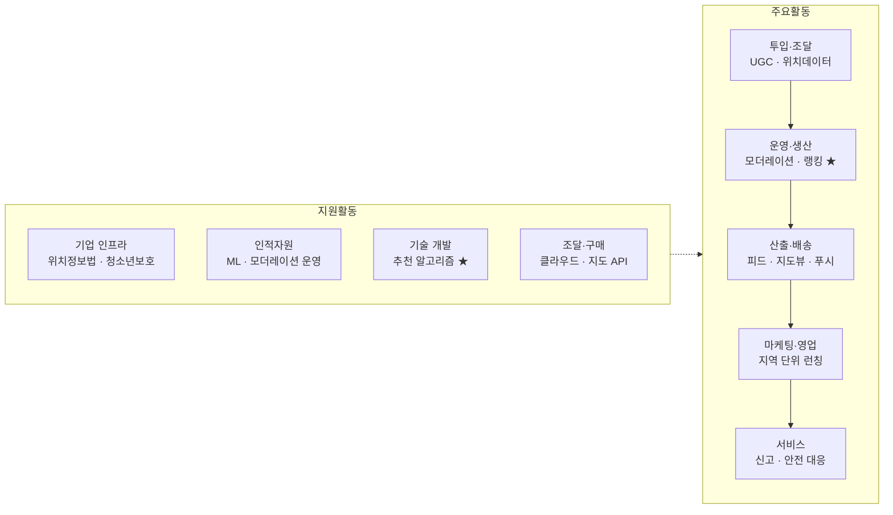

# 가치사슬 분석 ① — 이미지 & 숏폼 영상 중심의 위치기반 SNS

> [분석 방법론](./분석-방법론.md) · 선행 분석 [Five Forces ①](../01-porters-five-forces/분석-01-위치기반-숏폼-SNS.md)

## 0. 분석 단위와 방법론 적용 방식

| 항목 | 설정 |
|---|---|
| 분석 주체 | 위치정보를 핵심 축으로 이미지·숏폼 영상을 공유하는 **플랫폼 사업자** |
| 수익 모델 | 지역 타깃 광고 중심, 일부 커머스·구독 |
| 지역·시점 | 국내, 2026년 현재 |

> 📎 **방법론 적용 메모.** 방법론의 질문표는 산업 중립적으로 쓰여 있다. 여기서는 각 질문의 추상적 표현을 이 산업의 구체적 언어로 바꿔 답한다. 예: *"핵심 투입자원은 무엇인가"* → **사용자 생성 콘텐츠·위치 데이터·컴퓨팅 용량**, *"검수·정제·표준화"* → **모더레이션과 위치 태그 정규화**.

### 전체 가치사슬 개요

★ = 차별화가 만들어지는 활동

---

## 1. 주요활동 분석

### 1-1. 투입·조달 물류 (Inbound Logistics)
**핵심 콘텐츠·위치데이터·인프라 자원 확보**

| 가치사슬 **설계**를 위한 질문 🏗️ | 가치사슬 **개선**을 위한 질문 🚀 |
| --- | --- |
| • 서비스 제공에 필요한 핵심 투입자원은 무엇인가? → **사용자 생성 콘텐츠(UGC), 위치·POI 데이터, 컴퓨팅 용량** 세 가지 • 고객 동의 기반 위치데이터를 어떻게 확보할 것인가? (OS 권한 모델, 정밀위치 vs 대략위치, 백그라운드 수집 범위) • 지도 사업자·POI 제공자·광고 네트워크와 어떤 방식으로 연결할 것인가? • 무엇을 자체 확보하고 무엇을 외부 API로 살 것인가? → 지도 렌더링·POI는 구매, **추천 모델은 자체**가 기본선 • 콘텐츠를 어떻게 수집·정제·표준화할 것인가? (해상도·코덱·위치 태그 정규화) • 크리에이터와 지역 상점이 우리 플랫폼에 올릴 유인은 무엇인가? | • 외부에서 수신하는 위치·POI 데이터의 정확성·최신성을 어떻게 높일 것인가? (폐업 상점, 신규 장소 반영 지연) • 지도 API·클라우드 공급자에 대한 의존도를 줄일 수 있는가? (OSM 기반 자체 타일 검토) • **OS 위치 권한이 더 축소될 때의 대체 시그널이 있는가?** (Wi-Fi 핑거프린팅, 수동 체크인, 사용자 입력) • 축적된 콘텐츠·행동 데이터를 추천 모델 개선에 어떻게 되먹일 것인가? • 상위 크리에이터 소수에 콘텐츠 수급이 편중되어 있지 않은가? • 개인정보 최소수집과 위치 개인화 사이의 균형을 어떻게 설계할 것인가? |

> 📌 **Five Forces 연결.** ①번 분석에서 공급자 교섭력이 높다고 판단한 원인(OS 게이트키퍼·지도 API·클라우드·크리에이터)이 **전부 이 한 활동에 몰려 있다.** 가치사슬의 가장 앞단이 가장 취약한 구조다.

### 1-2. 운영·생산 (Operations)
**콘텐츠를 '볼 만한 피드'로 변환**

| 설계 🏗️ | 개선 🚀 |
| --- | --- |
| • 사용자 요청을 실제 가치로 바꾸는 핵심 처리 과정은 무엇인가? → **업로드 → 트랜스코딩 → 위치 태깅 → 모더레이션 → 인덱싱 → 랭킹 → 피드 조립** • 가입→위치 권한 획득→친구 연결→콘텐츠 소비→업로드 흐름을 어떻게 설계할 것인가? • 실시간성(지금 근처)과 품질(볼 만한 것)의 우선순위를 어떻게 둘 것인가? • 모더레이션·미성년자 보호·스토킹 방지를 어떻게 수행할 것인가? • 특정 지역·시간대에 트래픽이 급증해도 안정적으로 처리할 수 있는가? (축제·재난 상황) • 자동 필터링과 사람 검수의 경계를 어떻게 정할 것인가? | • 추천 만족도, 업로드 완료율, 위치 권한 허용률을 어떻게 높일 것인가? • 사용자가 이탈하는 단계와 원인은 무엇인가? (권한 요청 단계 이탈이 특히 크다) • 트랜스코딩 비용과 피드 응답 지연을 줄일 수 있는가? (코덱, 적응형 비트레이트) • **모더레이션 미탐을 줄이면서 오탐도 줄일 수 있는가?** • 신규 지역·신규 사용자의 콜드스타트 문제를 어떻게 풀 것인가? • 빠른 배포와 서비스 안정성을 동시에 확보할 수 있는가? |

> ⚠️ **위치기반 특유의 부담.** 일반 SNS의 모더레이션은 '부적절한 콘텐츠'만 보면 되지만, 위치기반은 **콘텐츠 자체는 멀쩡한데 위치가 결합되면 위험해지는** 경우를 잡아야 한다(스토킹, 미성년자 소재 노출, 자택 위치 추정). 자동 필터로 잡히지 않으므로 운영 비용이 구조적으로 높다.

### 1-3. 산출·배송 물류 (Outbound Logistics)
**피드·지도뷰·알림 전달**

| 설계 🏗️ | 개선 🚀 |
| --- | --- |
| • 사용자는 콘텐츠를 어떤 채널로 전달받는가? → 인앱 피드, 지도 뷰, 스토리, 푸시 • '지금 근처에서 일어나는 일'을 어떤 형식으로 보여줄 것인가? • 사용자가 위치 맥락과 다음 행동을 즉시 이해할 수 있는가? • 앱·푸시·위젯·파트너 API의 역할을 어떻게 구분할 것인가? • 광고주에게 성과 리포트를 어떤 방식으로 제공할 것인가? | • 지도 렌더링과 영상 재생 시작 시간을 줄일 수 있는가? • 핵심 정보와 부가정보의 우선순위가 명확한가? • **중복되거나 과도한 알림을 줄일 수 있는가?** (위치 기반 푸시는 피로도가 특히 빠르게 쌓인다) • 저사양 기기·저대역폭 환경에서도 동작하는가? • 정보 접근성(시각·청각 보조)을 높일 수 있는가? |

### 1-4. 마케팅 및 영업 (Marketing & Sales)

| 설계 🏗️ | 개선 🚀 |
| --- | --- |
| • 사용자·광고주·크리에이터·지역 상점 중 핵심 고객은 누구인가? → **돈은 광고주가 내고, 가치는 사용자가 만든다** • 사용자가 이 앱을 써야 하는 핵심 이유는 무엇인가? • **로컬 밀도 없이는 서비스 가치가 0이다. 지역 단위 런칭 전략을 어떻게 설계할 것인가?** • 재미뿐 아니라 안전·프라이버시 신뢰를 어떻게 전달할 것인가? • 지역 상점과 크리에이터를 어떤 방식으로 유치할 것인가? | • CAC를 낮추고 LTV를 높일 수 있는가? → **광고 ARPU가 낮아 CAC 회수가 구조적으로 어렵다** • 프로모션 종료 이후에도 사용자가 남는가? • 한 지역에서 만든 밀도를 다음 지역으로 어떻게 복제할 것인가? • 개인화 추천이 실제 사용자 편익으로 이어지는가? • 광고와 진짜 콘텐츠의 구분이 명확한가? (지역 광고는 특히 혼동되기 쉽다) • 친구 초대가 장기 사용자로 전환되는가? |

### 1-5. 서비스 (Service)
**이용 이후 지원과 사용자 보호**

| 설계 🏗️ | 개선 🚀 |
| --- | --- |
| • 신고, 계정 도용, 괴롭힘, 스토킹, 명예훼손을 어떻게 처리할 것인가? • 사용자가 스스로 해결할 수 있는 기능은 무엇인가? (차단, 위치 숨김, 고스트 모드) • 자동 처리와 사람 검수의 역할을 어떻게 구분할 것인가? • **오프라인 위해 사고 발생 시 조사·신고·수사협조·재발방지를 어떻게 수행할 것인가?** • 광고주에게 어떤 기술·정산 지원을 제공할 것인가? • 신고 데이터를 제품 개선으로 연결하는 체계가 있는가? | • 반복 신고 유형을 제품 설계 자체로 제거할 수 있는가? • 이상 행동(반복 추적, 대량 팔로우)을 신고 전에 탐지할 수 있는가? • 신고 처리 건수가 아니라 **실제 재발률**을 측정하고 있는가? • 신고 원인을 콘텐츠·UX·정책·시스템 문제로 분류할 수 있는가? • 처리 결과를 신고자에게 납득 가능하게 설명하는가? |

> 📌 다른 산업에서 '서비스'는 부수 활동이지만, 위치기반 SNS에서는 **사고 한 건이 서비스 종료로 이어질 수 있다.** Zenly가 정리된 배경에도 위치 공유의 안전 논란이 있었다.

---

## 2. 지원활동 분석

| 활동 | 설계 🏗️ | 개선 🚀 |
| --- | --- | --- |
| **기업 인프라** Firm Infrastructure | • **국내에서 위치정보 사업은 「위치정보의 보호 및 이용 등에 관한 법률」 적용 대상이다.** 위치정보사업·위치기반서비스사업 신고·허가 요건을 어떤 법인이 담당할 것인가? • 개인정보보호법, 청소년보호법, 광고 심의 요구를 어떻게 반영할 것인가? • 신고·안전 대응의 지휘체계와 최종 책임자는 누구인가? • 신규 기능의 법률·프라이버시 검토 절차는 무엇인가? | • 성장지표(체류시간)와 안전지표(신고율)가 충돌할 때 무엇을 우선하는가? • 프라이버시·안전 조직이 기능 설계 초기부터 참여하는가? • 위치 데이터 보관 기간과 파기 절차가 실제로 지켜지는가? • 해외 진출 시 각국 위치·개인정보 규제를 일관되게 관리하는가? |
| **인적자원 관리** HRM | • 추천 ML 엔지니어, 지도·영상 인프라 엔지니어, **24/7 모더레이션 운영조직**, 커뮤니티 매니저, 프라이버시 법무 인재가 필요하다 • 빠른 기능 실험과 안전·규제 준수를 어떻게 조정할 것인가? • 지역별 커뮤니티 운영을 본사 조직으로 할 것인가, 현지 채용으로 할 것인가? | • 모더레이션 인력의 **정신적 소진**을 어떻게 관리하는가? (이 직군의 이직률은 구조적으로 높다) • 성과평가가 지표 성장뿐 아니라 사용자 안전을 반영하는가? • 추천 모델 지식이 소수 인력에 집중되어 있지 않은가? |
| **기술 개발** Technology Development | • **핵심 경쟁력을 만드는 기술은 추천 랭킹 모델이다.** 나머지는 대부분 구매 가능 • 지도 렌더링·영상 트랜스코딩은 자체 개발할 것인가 구매할 것인가? • 온디바이스 처리로 위치 프라이버시를 어디까지 확보할 수 있는가? • 모델·데이터·피처 파이프라인을 어떻게 기술자산으로 관리할 것인가? | • 추천 모델의 **편향과 필터버블**을 관리하는가? (특정 지역·크리에이터 쏠림) • 지역별 A/B 테스트가 통계적으로 유의한 규모를 확보하는가? (로컬은 표본이 작다) • 생성형 AI 콘텐츠와 실제 촬영 콘텐츠를 구분할 수 있는가? • API 변경 시 파트너 부담을 최소화할 수 있는가? |
| **조달·구매** Procurement | • 필요한 자원은 클라우드·CDN·지도 API·모더레이션 벤더·광고 SDK·본인확인 서비스 • 공급자를 가격뿐 아니라 가용성·데이터 처리 조건으로 평가하는가? • 지도 사업자에 대한 협상력을 어떻게 확보할 것인가? (사실상 없다는 것이 현실적 진단) • 공급자 장애 시 서비스를 지속할 수 있는가? | • **특정 클라우드·지도 API에 과도하게 종속되어 있지 않은가?** • 트래픽 증가에 따라 단가와 SLA를 개선할 수 있는가? • 모더레이션 외주 업체의 처리 품질과 데이터 보안을 통제하는가? • 계약에 데이터 반환·삭제 조건이 포함되는가? |

---

## 3. 종합 진단 — 가치는 어디서 만들어지고 어디서 새는가

| 구간 | 판정 | 근거 |
|---|---|---|
| 투입·조달 | 🔴 **가치 유출** | 지도 API·클라우드·크리에이터 보상이 모두 원가. 협상력 없음 |
| 운영·생산 | 🟢 **가치 창출** | 추천 랭킹이 유일한 차별화 지점 |
| 산출·배송 | 🟡 중립 | 잘해야 본전, 못하면 이탈 |
| 마케팅·영업 | 🔴 **가치 유출** | CAC > 광고 ARPU 구조 |
| 서비스 | 🔴 **비용 중심** | 안전 대응은 필수지만 매출로 연결되지 않음 |

**핵심 진단 세 가지**

1. **사슬의 양 끝단에서 돈이 새고, 가운데에서만 가치가 만들어진다.** 앞(투입 원가)과 뒤(CAC)가 마진을 갉아먹고, 유일하게 가치를 만드는 활동은 운영 단계의 추천 알고리즘뿐이다.

2. **그런데 그 추천 알고리즘조차 복제 가능하다.** 논문·오픈소스·인력 이동으로 확산된다. Five Forces에서 '신규 진입자 위협 높음'으로 판정한 근거가 가치사슬 관점에서 다시 확인된다.

3. **복제하기 어려운 활동은 오히려 사람이 하는 일이다.** 지역 커뮤니티 운영, 모더레이션 노하우, 지역 상점과의 관계는 코드로 복사되지 않는다. 역설적으로 **비용 중심 활동으로 분류했던 곳에 방어선이 있다.**

## 4. 개선 우선순위

| 순위 | 활동 | 조치 | 근거 |
|---|---|---|---|
| 1 | 마케팅·영업 | **지역 단위 집중 런칭으로 전환** | 전국 CAC는 회수 불가. 로컬 밀도가 곧 제품 가치 |
| 2 | 서비스 | **커뮤니티 운영을 비용이 아닌 방어자산으로 재정의** | 유일하게 복제 어려운 활동 |
| 3 | 투입·조달 | **지도 API 의존도 축소, 위치 권한 축소 대비 대체 시그널 확보** | 공급자 리스크가 가장 큰 단일 취약점 |
| 4 | 운영·생산 | 트랜스코딩 원가 절감, 콜드스타트 개선 | 원가와 신규 지역 확장 속도에 직결 |

> Five Forces가 내린 결론(**집중화**)을 가치사슬로 옮기면, 실행은 **마케팅·영업 활동의 지역 단위 재설계 + 서비스 활동의 자산화**로 구체화된다.
