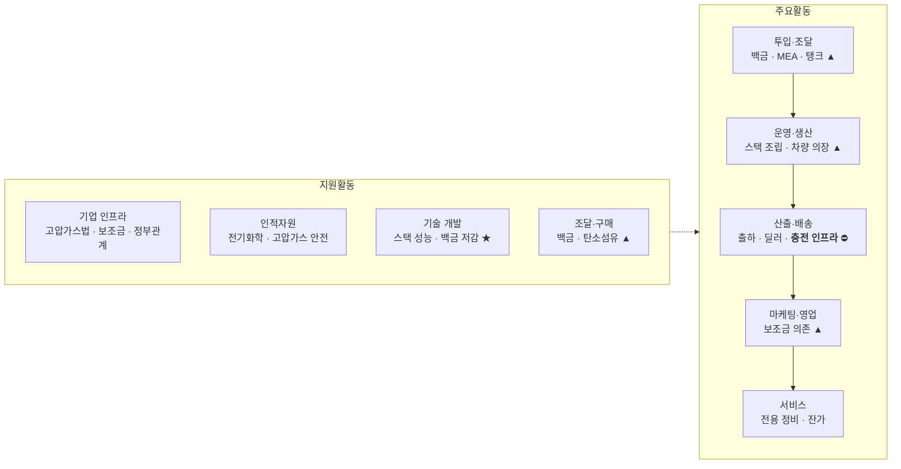

# 가치사슬 분석 ② — 미래형 수소(연료전지) 전기 승용차

> [분석 방법론](./분석-방법론.md) · 선행 분석 [Five Forces ②](../01-porters-five-forces/분석-02-수소연료전지-승용차.md)

## 0. 분석 단위와 방법론 적용 방식

| 항목 | 설정 |
|---|---|
| 분석 주체 | 수소연료전지 **승용차 완성차 제조사** |
| 지역·시점 | 국내, 2026년 현재 |
| 용어 | '수소 배터리'가 아니라 **수소연료전지(Fuel Cell)** — 전기를 저장하는 장치가 아니라 만들어내는 발전기. [상세](../01-porters-five-forces/분석-02-수소연료전지-승용차.md#0-분석-단위-설정-및-용어-정리) |

> 📎 **방법론 적용 메모.** 방법론의 질문표는 산업 중립적으로 쓰여 있다. 여기서는 각 질문을 제조업의 구체적 언어로 바꿔 답한다. 예: *"핵심 투입자원은 무엇인가"* → **백금·MEA·고압탱크**, *"검수·정제·표준화"* → **입고 검사와 부품 규격 관리**. 특히 이 산업에서는 **투입·산출 물류가 은유가 아니라 실제 물류**라는 점이 ①번 분석과 크게 다르다.

### 전체 가치사슬 개요

★ 차별화 · ▲ 원가 압박 · ⛔ 사슬 단절 지점

---

## 1. 주요활동 분석

### 1-1. 투입·조달 물류 (Inbound Logistics)
**핵심 소재·부품 확보와 실물 입고**

| 설계 🏗️ | 개선 🚀 |
| --- | --- |
| • 핵심 투입자원은 무엇인가? → **백금(촉매), 막전극접합체(MEA), 분리판, 탄소섬유 고압탱크, 보조 배터리, 모터, 차체 부품** • 백금을 장기계약으로 확보할 것인가, 스팟 시장에서 조달할 것인가? • 소재·부품사와 어떤 방식으로 연결할 것인가? (지분 투자 / 장기공급계약 / 합작) • 어떤 부품을 내재화하고 어떤 것을 외부에서 살 것인가? → **스택은 내재화, 탱크·탄소섬유는 구매**가 일반적 • 부품 품질 규격과 입고 검사 기준을 어떻게 표준화할 것인가? • 소재사가 소량 생산에 응할 유인은 무엇인가? | • 백금 등 소재의 가격 변동성과 조달 리드타임을 어떻게 관리할 것인가? • **특정 국가·업체에 대한 소재 의존도를 줄일 수 있는가?** (백금은 남아공 편중, 탄소섬유는 일본 편중) • 공급 중단에 대비한 대체 공급선이 있는가? • **폐차·교체 스택에서 백금을 회수해 재투입하는 순환 고리를 만들 수 있는가?** • 승용차와 상용차가 부품을 공유해 조달 물량을 키울 수 있는가? • 소량 생산으로 인한 부품 단가 페널티를 줄일 수 있는가? |

> 📌 **Five Forces 연결.** 공급자 교섭력을 '매우 높음'으로 판정한 근거가 이 활동에 집중된다. 그런데 ①번 SNS와 결정적으로 다른 점이 있다 — **여기서는 회사가 손쓸 수단이 있다.** 백금 사용량 저감, 재활용 루프, 부품 공용화는 모두 사내 활동으로 공급자의 힘을 실제로 줄인다.

### 1-2. 운영·생산 (Operations)
**소재를 작동하는 차량으로 변환**

| 설계 🏗️ | 개선 🚀 |
| --- | --- |
| • 핵심 처리 과정은 무엇인가? → **셀 제조 → 스택 적층·체결 → 탱크 성형·내압 검사 → 파워트레인 통합 → 차량 의장 → 최종 검사** • 스택 조립의 정밀도 관리를 어떻게 할 것인가? (적층 정렬 오차가 수율을 좌우한다) • 고압 수소 취급 공정의 안전 기준을 어떻게 설계할 것인가? • 생산 라인을 FCEV 전용으로 할 것인가, BEV·내연기관과 혼류할 것인가? • 자동화와 수작업의 경계를 어디에 둘 것인가? (생산량이 적으면 자동화 투자 회수가 안 된다) • 안전 인증과 형식 승인을 생산 공정에 어떻게 반영할 것인가? | • **스택 수율을 어떻게 높일 것인가?** — 이 산업 원가의 가장 큰 단일 레버 • 생산량이 적어 규모의 경제가 작동하지 않는 문제를 어떻게 우회할 것인가? • **혼류 생산으로 라인 가동률을 높일 수 있는가?** • 스택 모듈을 표준화해 승용차·버스·트럭·건설기계에 공통 적용할 수 있는가? • 검사 공정의 시간과 불량 유출률을 줄일 수 있는가? • 설계 변경 반영 속도와 품질 안정성을 함께 확보할 수 있는가? |

> ⚠️ **이 산업의 핵심 병목.** 생산량이 적어 단위 원가가 내려가지 않고, 원가가 높아 안 팔리고, 안 팔려서 생산량이 늘지 않는다. **가치사슬 내부의 자기강화 악순환**이며, 이를 끊는 유일한 사내 수단이 *스택 모듈 공용화* 다.

### 1-3. 산출·배송 물류 (Outbound Logistics)
**완성차 전달 — 그리고 이 산업이 끊어지는 지점**

| 설계 🏗️ | 개선 🚀 |
| --- | --- |
| • 고객은 제품을 어떤 경로로 전달받는가? → 출하 → 탁송 → 딜러 → 인도 • **⛔ 그런데 차를 인도해도 수소가 없으면 제품이 작동하지 않는다. 연료 공급망을 누가 책임지는가?** • 충전소 분포를 고려해 판매 지역을 제한할 것인가? • 고객에게 충전소 위치·가동 상태를 어떤 형식으로 안내할 것인가? • 딜러망에 어떤 교육과 시설을 갖출 것인가? • 인도 시점에 충전 크레딧·보증 조건을 어떻게 구성할 것인가? | • 충전소 실시간 가동 정보를 차량·앱에서 제공할 수 있는가? • **충전 인프라 사업자와 공동 투자로 거점을 늘릴 수 있는가?** • 출고 리드타임과 탁송 비용을 줄일 수 있는가? • 충전소가 없는 지역 고객에게 어떤 대안을 줄 것인가? • 충전 실패·대기 경험을 어떻게 개선할 것인가? |

> 🔴 **이것이 이 가치사슬의 결정적 특이점이다.** 일반 완성차는 인도 시점에 가치 전달이 끝난다. FCEV는 **연료 인프라가 제품 가치의 일부**여서, 사슬이 회사 경계 밖에서 끊어진다. BEV는 가정용 콘센트라는 최소 대안이 있지만 수소는 없다. 사내 활동을 아무리 최적화해도 이 고리가 없으면 고객 가치가 완성되지 않는다.

### 1-4. 마케팅 및 영업 (Marketing & Sales)

| 설계 🏗️ | 개선 🚀 |
| --- | --- |
| • 핵심 고객은 누구인가? → **개인 얼리어답터 / 정부·공공 관용차 / 법인 플릿** 세 갈래 • 고객이 FCEV를 선택해야 하는 핵심 이유는 무엇인가? (5분 충전, 긴 주행거리, 물만 배출) • **보조금이 실구매가의 상당 부분을 좌우하는데, 이를 소구의 중심에 둘 것인가?** • 딜러·전시장·시승 프로그램의 역할은 무엇인가? • 공공기관 조달 채널을 어떻게 확보할 것인가? • BEV 대비 우위를 어떤 언어로 설명할 것인가? | • **보조금 의존도를 낮출 수 있는가?** 정책이 바뀌면 수요가 사라지는 구조 • 구매가가 아닌 **총소유비용(TCO)** 으로 설득할 수 있는가? • 충전소가 있는 지역에 마케팅을 집중해 전환율을 높일 수 있는가? • 시승 경험이 실제 구매로 이어지는가? • 법인 플릿 고객의 재구매율은 어떠한가? • 환경 가치 소구가 실구매 동기로 작동하는가? |

### 1-5. 서비스 (Service)
**판매 이후 지원과 잔존가치 보호**

| 설계 🏗️ | 개선 🚀 |
| --- | --- |
| • **고압 수소 시스템은 일반 정비소에서 다룰 수 없다. 인증 정비 네트워크를 어떻게 구축할 것인가?** • 스택 수명 종료 시 교체 비용과 절차를 어떻게 안내할 것인가? • 수소 누출·화재 등 안전 사고 대응 체계는 무엇인가? • 고객이 스스로 확인할 수 있는 진단 기능은 무엇인가? • 보증 범위(스택, 탱크, 시스템)를 어떻게 설계할 것인가? • 필드 데이터를 다음 세대 설계로 어떻게 되먹일 것인가? | • **중고 잔존가치 불안을 어떻게 완화할 것인가?** (스택 열화 우려로 중고 시세가 낮다) • 원격 진단으로 고장을 사전에 예측할 수 있는가? • 정비 가능 거점까지의 평균 거리를 줄일 수 있는가? • 스택 교체 비용을 낮추거나 리퍼비시 옵션을 제공할 수 있는가? • 고객 불만 원인을 차량·인프라·정책 문제로 분류할 수 있는가? |

> 📌 서비스 활동에서 특이한 점: **불만의 상당 부분이 차량이 아니라 인프라에서 나온다.** 회사가 통제하지 못하는 원인 때문에 브랜드 만족도가 깎인다.

---

## 2. 지원활동 분석

| 활동 | 설계 🏗️ | 개선 🚀 |
| --- | --- | --- |
| **기업 인프라** Firm Infrastructure | • 자동차관리법·고압가스안전관리법·환경부 보조금 체계를 어떤 조직이 담당할 것인가? • **정부·지자체 관계 관리 자체가 핵심 인프라 활동이다.** 전담 조직을 둘 것인가? • 수소 사업(생산·유통·충전)을 계열사로 둘 것인가, 외부 제휴로 갈 것인가? • 안전 사고 발생 시 지휘체계와 대외 커뮤니케이션은 누가 담당하는가? • 승용·상용 사업부 간 자원 배분 기준은 무엇인가? | • 정책 변화 시나리오별 대응 계획이 있는가? • 성장 목표와 안전 기준이 충돌할 때 어떤 기준으로 판단하는가? • **적자 사업을 언제까지 유지할 것인지에 대한 판단 기준이 있는가?** • 계열사 간 수소 밸류체인 투자 의사결정이 일관되는가? |
| **인적자원 관리** HRM | • 전기화학·촉매 연구인력, 고압가스 안전 인력, 인증 정비사, 정책·대관 인력이 필요하다 • 내연기관 인력을 어떻게 재교육·전환할 것인가? • 소수 시장을 담당하는 조직의 동기를 어떻게 유지할 것인가? • 최종 사업 책임자와 의사결정권은 누구에게 있는가? | • **인증 정비사를 충분한 속도로 양성하고 있는가?** (정비망이 판매 지역을 제한한다) • 성과평가가 판매량만이 아니라 기술 축적을 반영하는가? • 연료전지 지식이 소수 인력에 집중되어 있지 않은가? • 시장이 정체된 사업부의 인재 이탈을 관리하는가? |
| **기술 개발** Technology Development | • **핵심 경쟁력은 스택의 출력밀도·내구성·저온 시동성** • 백금 저감 촉매와 대체 촉매를 자체 개발할 것인가 공동 개발할 것인가? • 탱크 경량화와 저장 밀도를 어떻게 높일 것인가? • 특허를 방어용으로 쓸 것인가, 개방해 생태계를 키울 것인가? • 스택 플랫폼을 어떻게 기술자산으로 관리할 것인가? | • **R&D 투자가 판매량으로 회수되지 않는 구조를 어떻게 견딜 것인가?** • 스택 기술을 승용차 밖(건설기계·선박·발전)으로 이전해 회수처를 넓힐 수 있는가? • 내구 시험 기간을 단축할 수 있는가? • BEV 기술과 공유 가능한 영역(모터, 인버터, 열관리)을 최대화하고 있는가? |
| **조달·구매** Procurement | • 필요 자원은 백금·탄소섬유·MEA·분리판·검사 장비·물류 • 공급자를 가격뿐 아니라 안정성·품질·지속가능성 기준으로 평가하는가? • **생산량이 적어 협상력이 약한 문제를 어떻게 보완할 것인가?** (상용차와 통합 구매, 얼라이언스 공동 구매) • 공급 중단 시 생산을 지속할 수 있는가? • 소재 원산지의 인권·환경 리스크를 어떻게 관리하는가? | • 그룹 차원 통합 구매로 단가를 개선할 수 있는가? • **백금 재활용 비율을 높여 신규 구매량 자체를 줄일 수 있는가?** • 핵심 소재의 대체 공급선과 전환 계획이 있는가? • 장기계약과 스팟 조달의 비율이 적정한가? • 공급자의 재무·지정학 위험을 지속 모니터링하는가? |

---

## 3. 종합 진단 — 가치는 어디서 만들어지고 어디서 새는가

| 구간 | 판정 | 근거 |
|---|---|---|
| 투입·조달 | 🔴 **가치 유출** | 백금·탄소섬유 원가 + 소량 조달 페널티 |
| 운영·생산 | 🔴 **가치 유출** | 규모의 경제 미달로 단위 원가가 내려가지 않음 |
| 산출·배송 | ⛔ **사슬 단절** | 충전 인프라 부재로 가치 전달이 완성되지 않음 |
| 마케팅·영업 | 🟡 **외부 의존** | 보조금이 실질 구매 동기 |
| 서비스 | 🔴 **비용 중심** | 전용 정비망 유지 부담 + 잔가 방어 비용 |
| 기술 개발 | 🟢 **가치 창출** | 스택 기술은 실재하는 자산. 다만 승용차에서는 회수되지 않음 |

**핵심 진단 세 가지**

1. **가치사슬이 회사 경계 밖에서 끊어져 있다.** ①번 SNS는 사슬 안에서 마진이 새지만, 이 산업은 사슬 자체가 완결되지 않는다. 사내 활동을 100% 최적화해도 충전소가 없으면 고객 가치는 0이다.

2. **유일한 가치 창출 활동(기술 개발)의 회수처가 잘못 설정되어 있다.** 스택 기술은 진짜 자산인데, 이를 회수하려는 시장(승용차)에서는 BEV라는 압도적 대체재가 있다. **자산은 좋은데 팔 곳이 틀렸다.**

3. **반면 공급자 문제는 사내에서 개선 가능하다.** 백금 저감·재활용·부품 공용화는 회사가 실제로 실행할 수 있는 수단이다. Five Forces에서 '매우 높음'으로 보였던 공급자 교섭력은 가치사슬 관점에서는 **완화 가능한 힘**으로 다시 읽힌다.

## 4. 개선 우선순위

| 순위 | 활동 | 조치 | 근거 |
|---|---|---|---|
| 1 | 기술 개발 + 운영 | **스택 모듈을 표준화해 상용차·건설기계·선박에 공용 적용** | 규모의 경제 확보와 R&D 회수처 확대를 한 번에 푸는 유일한 수단 |
| 2 | 산출·배송 | **충전 인프라 공동 투자, 거점 중심 판매로 전환** | 사슬 단절 지점의 직접 대응 |
| 3 | 조달·구매 | **백금 저감·재활용 루프 구축, 그룹 통합 구매** | 사내에서 통제 가능한 최대 원가 레버 |
| 4 | 마케팅·영업 | 보조금 의존 축소, TCO 기반 법인 플릿 공략 | 정책 리스크 완화 |

> Five Forces가 내린 결론(**집중화** — 대체재가 약한 상용 영역으로 이동)을 가치사슬로 옮기면, 실행은 **기술개발·운영 활동의 모듈 공용화**로 구체화된다. 즉 시장을 옮기는 것이 아니라 **활동을 재배치해서** 시장을 옮기는 것이다.
