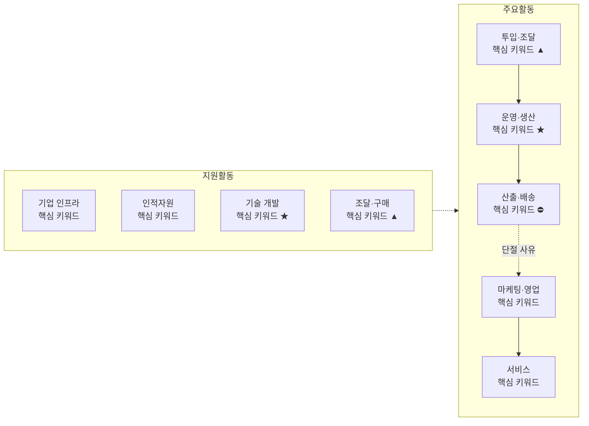

# 02 - 기업 내부 활동의 가치 사슬 분석

> 본 챕터의 분석은 이 문서에 정의된 방법론을 따른다.
> 질문표는 **특정 산업에 종속되지 않도록** 작성되어, 제조·서비스·플랫폼·유통 등 어떤 도메인에도 그대로 대입할 수 있다.

## 1. 가치사슬 주요활동 분석

### 1-1. 주요활동 공통 분석 질문표

| 항목명(Activity) | 가치사슬 **설계**를 위한 질문 🏗️ | 가치사슬 **개선**을 위한 질문 🚀 |
| --- | --- | --- |
| **투입·조달 물류**<br>Inbound Logistics<br><br>**핵심 투입자원·파트너·공급망 확보** | • 제품·서비스 제공에 필요한 핵심 투입자원은 무엇인가? (원자재·부품·데이터·콘텐츠·인력)<br>• 그 투입자원을 어떤 경로와 조건으로 확보할 것인가?<br>• 공급자·유통 파트너·제휴사와 어떤 방식으로 연결할 것인가? (직접 구매 / 장기계약 / 제휴 / 지분투자)<br>• 어떤 자원과 역량은 자체 확보하고, 어떤 것은 외부에서 조달할 것인가?<br>• 확보한 투입물을 어떻게 검수·정제·표준화할 것인가?<br>• 공급자와 파트너가 우리와 거래할 유인은 무엇인가? | • 외부에서 들어오는 투입물의 품질·최신성·가용성을 어떻게 높일 것인가?<br>• 특정 공급자·기술·지역에 대한 의존도를 줄일 수 있는가?<br>• 공급 중단이나 장애에 대비한 대체 경로가 있는가?<br>• 투입 과정에서 쌓이는 데이터를 다음 활동의 개선에 어떻게 되먹일 것인가?<br>• 중복 확보되거나 낭비되는 투입자원을 줄일 수 있는가?<br>• 조달 비용 절감과 품질·안정성 사이의 균형을 어떻게 설계할 것인가? |
| **운영·생산**<br>Operations<br><br>**투입자원을 고객 가치로 변환** | • 투입자원을 실제 고객 가치로 변환하는 핵심 처리 과정은 무엇인가?<br>• 고객 요청 접수부터 결과 전달까지의 전체 흐름을 어떻게 설계할 것인가?<br>• 핵심 공정과 기능을 어떤 순서와 방식으로 수행할 것인가?<br>• 품질·안전·보안·규제 준수를 어느 단계에서 어떻게 검증할 것인가?<br>• 수요가 급증해도 안정적으로 처리할 수 있는가?<br>• 자동화와 사람의 판단이 개입하는 경계를 어떻게 정할 것인가? | • 처리 완료율·성공률·전환율을 어떻게 높일 것인가?<br>• 고객이 과정 도중 이탈하는 단계와 원인은 무엇인가?<br>• 처리시간·오류율·재작업률·중단시간을 줄일 수 있는가?<br>• 문제 검출력을 높이면서 정상 건의 오탐을 줄일 수 있는가?<br>• 반복적인 수작업과 사후 정리 업무를 자동화할 수 있는가?<br>• 개선 속도와 운영 안정성을 동시에 확보할 수 있는가? |
| **산출·배송 물류**<br>Outbound Logistics<br><br>**완성된 가치의 전달** | • 고객은 결과물을 어떤 채널과 형태로 전달받는가?<br>• 전달 시점에 어떤 정보를 어떤 형식으로 함께 제공할 것인가?<br>• 고객이 현재 상태와 다음에 할 행동을 즉시 이해할 수 있는가?<br>• 여러 전달 채널의 역할을 어떻게 구분할 것인가?<br>• 제품·서비스의 비용·위험·제약을 충분히 설명할 수 있는가?<br>• 파트너와 중간 유통 단계에 필요한 정보는 어떤 방식으로 제공할 것인가? | • 전달 속도와 정확도를 높일 수 있는가?<br>• 핵심 정보와 부가정보의 우선순위가 명확한가?<br>• 복잡한 선택지를 비교 가능한 형태로 제공할 수 있는가?<br>• 지연이나 장애 발생 시 현재 상태와 다음 조치를 안내할 수 있는가?<br>• 중복되거나 과도한 알림·접촉을 줄일 수 있는가?<br>• 정보 접근성과 취약계층의 이해 가능성을 높일 수 있는가? |
| **마케팅 및 영업**<br>Marketing & Sales | • 여러 고객군 중 핵심 고객은 누구인가?<br>• 고객이 우리를 선택해야 하는 핵심 이유는 무엇인가?<br>• 첫 거래를 한 고객을 다른 제품·서비스로 어떻게 연결할 것인가?<br>• 편의성뿐 아니라 신뢰·품질·가격·혜택을 어떻게 전달할 것인가?<br>• 파트너와 유통 채널을 어떤 방식으로 유치할 것인가?<br>• 콘텐츠·검색·광고·추천·프로모션 등 획득 채널의 역할은 각각 무엇인가? | • 고객획득비용(CAC)을 낮추고 고객생애가치(LTV)를 높일 수 있는가?<br>• 프로모션이 끝난 이후에도 고객이 남는가?<br>• 제품·서비스 간 교차 이용률을 어떻게 높일 것인가?<br>• 개인화와 추천이 실제 고객 편익으로 이어지는가?<br>• 판매 목표와 객관적 정보 제공 사이의 이해상충을 어떻게 관리할 것인가?<br>• 고객 추천과 입소문 유입이 장기 고객으로 전환되는가? |
| **서비스**<br>Service<br><br>**판매 이후 지원과 고객보호** | • 오류·불량·지연·분실·피해 상황을 어떻게 처리할 것인가?<br>• 고객이 스스로 문제를 해결할 수 있는 수단은 무엇인가?<br>• 자동 응대와 전문 담당자의 역할을 어떻게 구분할 것인가?<br>• 사고 발생 시 조사·보상·신고·재발방지를 어떻게 수행할 것인가?<br>• 파트너와 유통 채널에 어떤 기술·운영 지원을 제공할 것인가?<br>• 고객의 소리(VOC)를 제품 개선으로 연결하는 체계가 있는가? | • 반복되는 문의를 제품 자체의 개선으로 제거할 수 있는가?<br>• 문제 상황을 고객이 문의하기 전에 먼저 탐지할 수 있는가?<br>• 자동 응대가 잘못된 안내를 하는 것을 어떻게 방지할 것인가?<br>• 응대 처리시간이 아니라 실제 문제해결률을 측정하고 있는가?<br>• 불만의 원인을 제품·UX·시스템·파트너·정책 문제로 분류할 수 있는가?<br>• 응대 채널이 바뀌어도 고객의 맥락이 유지되는가? |

## 2. 가치사슬 지원활동 분석

### 2-1. 지원활동 공통 분석 질문표

| 항목명(Activity) | 가치사슬 **설계**를 위한 질문 🏗️ | 가치사슬 **개선**을 위한 질문 🚀 |
| --- | --- | --- |
| **기업 인프라**<br>Firm Infrastructure | • 각 사업 영역을 어떤 법인과 조직이 담당할 것인가?<br>• 본사와 자회사·사업부 사이의 책임·데이터·브랜드 경계를 어떻게 설정할 것인가?<br>• 이사회·경영진·리스크관리·준법·정보보호·내부감사의 역할은 무엇인가?<br>• 해당 산업의 규제와 개인정보·소비자보호 요구를 어떻게 반영할 것인가?<br>• 신규 사업과 서비스의 법률·안전·리스크 검토 절차는 무엇인가? | • 법인과 조직이 늘어나면서 책임이 분산되고 있지 않은가?<br>• 성장지표와 리스크지표가 충돌할 때 어떤 기준으로 판단하는가?<br>• 준법·안전 조직이 제품설계 초기부터 참여하는가?<br>• 장애·사고·정보유출 대응 지휘체계가 명확한가?<br>• 조직 간 데이터 활용과 고객 동의를 일관되게 관리하는가? |
| **인적자원 관리**<br>Human Resource Management | • 필요한 기획·개발·데이터·운영·법무·리스크 인재는 누구인가?<br>• 도메인 전문성과 제품개발 역량을 어떻게 결합할 것인가?<br>• 빠른 실험과 안정성·규제준수를 어떻게 조정할 것인가?<br>• 각 제품·서비스의 최종 책임자와 의사결정권은 누구에게 있는가?<br>• 고객보호와 윤리 기준을 조직문화에 어떻게 내재화할 것인가? | • 직원이 규제·안전·기술 변화를 지속적으로 학습하는가?<br>• 성과평가가 매출뿐 아니라 안정성·고객보호·협업을 반영하는가?<br>• 특정 인력에게 지식과 권한이 집중되어 있지 않은가?<br>• 조직이 커져도 제품 주인의식과 의사결정 속도를 유지할 수 있는가?<br>• 고강도 업무와 사고 대응에 따른 번아웃을 관리하는가? |
| **기술 개발**<br>Technology Development | • 핵심 경쟁력을 만드는 기술은 무엇인가?<br>• 자체 개발과 외부 솔루션 도입의 기준은 무엇인가?<br>• 제품과 서비스를 늘리면서 기술적 결합도를 낮출 수 있는가?<br>• 이 산업이 요구하는 수준의 보안·가용성·복구성을 어떻게 확보할 것인가?<br>• 코드·데이터·설계·모델·규격을 어떻게 기술자산으로 관리할 것인가?<br>• AI와 자동화를 어느 활동에 우선 적용할 것인가? | • 제품별 중복개발을 줄이고 공통 플랫폼 재사용률을 높일 수 있는가?<br>• 장애와 불량을 사전에 예측하고 자동 복구할 수 있는가?<br>• 개선 속도와 운영 안정성을 동시에 높일 수 있는가?<br>• 알고리즘과 모델의 편향·오류를 관리하는가?<br>• 새로 도입한 기술이 만들어낸 결과를 검증하는 체계가 있는가?<br>• 규격·인터페이스 변경에 따른 파트너 비용을 최소화할 수 있는가? |
| **조달·구매**<br>Procurement | • 필요한 설비·원자재·솔루션·외주 서비스는 무엇인가?<br>• 공급자를 가격뿐 아니라 품질·안정성·규제준수 기준으로 평가하는가?<br>• 핵심 공급자에 대한 협상력을 어떻게 확보할 것인가?<br>• 공급자 장애나 계약 종료 시 사업을 지속할 수 있는가?<br>• 외부 업체가 다루는 정보와 자산을 어떻게 통제할 것인가? | • 구매 규모가 커짐에 따라 단가와 계약조건(SLA)을 개선할 수 있는가?<br>• 특정 공급자나 기술에 과도하게 종속되어 있지 않은가?<br>• 핵심 공급자에 대한 대안과 전환계획이 있는가?<br>• 계약에 자산 반환·삭제·감사·장애 대응 조건이 포함되는가?<br>• 공급자의 재무·보안·규제 위험을 지속적으로 모니터링하는가? |

---

## 3. 사용 안내

- 위 질문표는 **모든 산업에 공통으로 적용 가능한 형태**로 작성되어 있다. 실제 분석에서는 각 질문의 추상적 표현을 그 산업의 구체적 언어로 바꿔 답한다.
  - 예 · 제조업 — *"핵심 투입자원"* → 원자재·부품 / *"검수·표준화"* → 입고 검사·규격 관리
  - 예 · 플랫폼 — *"핵심 투입자원"* → 사용자 생성 콘텐츠·데이터 / *"검수·표준화"* → 모더레이션·메타데이터 정규화
  - 예 · 금융 — *"핵심 투입자원"* → 고객 동의 기반 금융데이터 / *"검수·표준화"* → 데이터 정제·마이데이터 표준화
- **설계 🏗️** 질문은 아직 활동이 없는 상태에서 *무엇을 만들 것인가* 를 정할 때, **개선 🚀** 질문은 이미 돌아가는 활동에서 *어디를 고칠 것인가* 를 찾을 때 쓴다.
- 9개 활동을 **빠뜨리지는 않되**, 모두 같은 깊이로 분석할 필요는 없다. 해당 산업에서 **원가 비중이 크거나 차별화가 일어나는 활동**에 분석을 집중한다.

---

# 분석 결과물 포맷 규격

> ⚠️ 위 질문표에 답하는 것만으로는 분석이 완성되지 않는다.
> **아래 골격을 모두 채워야 분석이 끝난 것으로 본다.** 이 절은 누가 언제 이 방법론을 쓰더라도 같은 수준의 결과물이 나오도록 하기 위한 규격이다.

## 4. 산출물 구성

| 분석 대상 수 | 산출 파일 |
| --- | --- |
| 1개 | `분석-01-<대상명>.md` |
| 2개 이상 | `분석-01-<대상명>.md`, `분석-02-<대상명>.md` … **+ `비교-01-vs-02.md` (필수)** |

- 대상이 둘 이상이면 **비교 문서를 반드시 별도 파일로** 만든다. 개별 분석 문서 안에 비교를 섞지 않는다.
- 파일은 챕터 디렉터리(`02-value-chain/`) 아래에 둔다.

## 5. 개별 분석 문서 골격

각 항목의 `[필수]`는 생략할 수 없다.

```
# 가치사슬 분석 ① — <대상 시장/산업명>

> [분석 방법론](./분석-방법론.md) · 선행 분석 <있으면 링크>

## 0. 분석 단위와 방법론 적용 방식
    [필수] 분석 단위 표 — 분석 주체 / 수익 모델 / 지역·시점 / 참고 사례
    [필수] 📎 방법론 적용 메모 — 추상 질문을 이 산업 언어로 바꾼 예시 2개 이상
    [필수] 전체 가치사슬 개요 (mermaid) + 기호 범례 한 줄

## 1. 주요활동 분석
### 1-1 투입·조달 물류   ### 1-2 운영·생산   ### 1-3 산출·배송 물류
### 1-4 마케팅 및 영업   ### 1-5 서비스
    [필수] 활동마다 2열 표 — 설계 🏗️ / 개선 🚀
    [필수] 방법론 질문을 그대로 옮기고, 답이 확정된 항목은 `→ **굵게**` 로 답을 병기
    [선택] 표 아래 📌 인사이트 · ⚠️ 위험 블록 — 그 활동에 결정적 특징이 있을 때만

## 2. 지원활동 분석
    [필수] 4개 활동(기업 인프라 / 인적자원 / 기술 개발 / 조달·구매)을 하나의 표로 묶어 제시

## 3. 종합 진단 — 가치는 어디서 만들어지고 어디서 새는가
    [필수] 구간별 판정 표 — 구간 / 판정(기호) / 근거
    [필수] 핵심 진단 3가지 — 번호 목록, 각 항목은 굵은 한 문장 + 설명 2~3줄

## 4. 개선 우선순위
    [필수] 순위 / 활동 / 조치 / 근거 4열 표, 3~5행
    [선택] 선행 챕터 결론과 연결하는 마무리 문장
```

## 6. 판정 기호 체계 (고정)

기호를 임의로 늘리거나 바꾸지 않는다. 문서 간 비교 가능성이 깨진다.

| 기호 | 의미 | 사용처 |
| --- | --- | --- |
| 🟢 | **가치 창출** — 차별화가 만들어지는 활동 | 3절 판정표 |
| 🟡 | **중립** — 잘해야 본전, 못하면 이탈 | 3절 판정표 |
| 🔴 | **가치 유출** — 원가·비용 중심 활동 | 3절 판정표 |
| ⛔ | **사슬 단절** — 가치 전달 자체가 완성되지 않는 지점 | 3절 판정표 |
| ★ | 차별화 활동 | 0절 개요 다이어그램 |
| ▲ | 원가 압박 활동 | 0절 개요 다이어그램 |

> **판정은 반드시 근거와 함께 쓴다.** 기호만 찍고 넘어가지 않는다.
>
> 🔴와 ⛔의 구분이 특히 중요하다. **🔴는 사슬 안에서 마진이 새는 것(최적화 문제)**, **⛔는 사슬이 끊어져 가치가 전달되지 않는 것(연결 문제)** 이다. 진단이 다르면 처방이 완전히 달라진다.

## 7. 전체 가치사슬 개요 다이어그램 규칙

0절에 넣는 mermaid 다이어그램은 아래 형식을 따른다.

- `graph LR` 로 그리고, **지원활동 subgraph 1개 + 주요활동 subgraph 1개**로 구성한다.
- 주요활동 5개는 실선 화살표로 순서대로 연결한다.
- 각 노드는 `활동명<br/>핵심 키워드` 2줄로 쓴다. 문장을 넣지 않는다.
- 차별화 활동에 `★`, 원가 압박 활동에 `▲`, 사슬이 끊어지는 구간에 `⛔` 를 붙인다.
- 사슬 단절 구간은 **점선 화살표(`-.->`)** 로 표기하고 끊어진 이유를 화살표 라벨에 적는다.
- 지원활동에서 주요활동으로는 점선 한 줄(`SUP -.-> PRI`)만 긋는다. 개별 연결선을 치지 않는다.
- 다이어그램 **바로 아래에 기호 범례 한 줄**을 둔다.


★ 차별화 · ▲ 원가 압박 · ⛔ 사슬 단절

## 8. 비교 문서 골격

분석 대상이 둘 이상일 때만 작성한다.

```
# 가치사슬 비교 분석 — A ↔ B

> 개별 분석 링크 · 선행 챕터 비교 문서 링크

## 0. 두 프레임워크의 역할 분담      ← 선행 챕터가 있을 때만
    [선택] 선행 프레임워크와 가치사슬의 역할 차이를 표로 정리

## 1. 활동별 대조표
    [필수] 9개 활동 전부를 한 표에, 각 칸에 판정 기호 포함
    [필수] 두 대상의 사슬 구조를 대비하는 mermaid 1개

## 2. 핵심 대비 N가지                 (3~5개 권장)
    [필수] 각 항목 = 소제목 + 대조표 또는 설명 + 📌 정리 문장
    [필수] 최소 1개는 "어디서 끊어지고 어디서 새는가"를 다룰 것

## 3. 전략 실행 결론
    [필수] 대상별 실행 활동 대조표 — 집중 방향 / 실행 주체 활동 / 1순위 조치 / 버릴 것 / 핵심 위험

## 4. 이 비교에서 남는 교훈
    [필수] 번호 목록 4~5개
    [필수] 마지막 항목은 다음 챕터로 넘어가는 질문으로 마무리
```

## 9. 작성 품질 기준

1. **9개 활동을 하나도 빠뜨리지 않는다.** 해당 산업에 무의미한 활동이라면 *"해당 없음"* 과 그 이유를 명시한다. 조용히 생략하지 않는다.
2. **모든 판정에 근거를 붙인다.** 🟢🔴⛔ 기호만 찍힌 칸은 미완성으로 본다.
3. **확인되지 않은 수치는 쓰지 않는다.** 정성적으로 서술하거나 *"확인 필요"* 로 표시한다. 그럴듯한 숫자를 지어내는 것이 가장 흔한 실패다.
4. **결론은 활동 수준까지 내려간다.** *"집중화가 필요하다"* 에서 멈추지 않고 *"어느 활동을 어떻게 바꾼다"* 까지 쓴다. 가치사슬 분석의 존재 이유가 이것이다.
5. **선행 챕터 분석이 있으면 교차 검증한다.** 앞선 판정이 유지되는지 뒤집히는지를 📌 블록으로 명시한다. 프레임워크끼리 어긋나는 지점이 가장 중요한 발견인 경우가 많다.
6. **질문을 삭제하지 않는다.** 활동별 표에는 방법론 질문을 원문 순서대로 싣고, 답은 `→` 뒤에 병기한다. 답한 질문만 남기면 다음 사람이 무엇을 건너뛰었는지 알 수 없다.
7. **분석 단위를 0절에서 못 박는다.** 분석 주체가 누구냐에 따라 결과가 완전히 뒤집힌다. 이것을 정하지 않고 시작한 분석은 무효로 본다.
