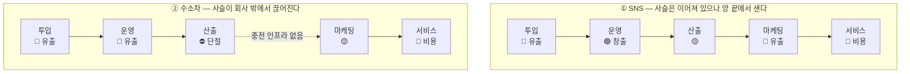

# 가치사슬 비교 분석 — 위치기반 숏폼 SNS ↔ 수소연료전지 승용차

> [① 위치기반 숏폼 SNS](./분석-01-위치기반-숏폼-SNS.md) · [② 수소연료전지 승용차](./분석-02-수소연료전지-승용차.md)
> 선행 비교 [Five Forces 비교](../01-porters-five-forces/비교-01-vs-02.md)

## 0. 두 프레임워크의 역할 분담

| | Porter's Five Forces (챕터 01) | Value Chain (챕터 02) |
|---|---|---|
| 보는 곳 | 산업 **바깥** — 우리를 둘러싼 환경 | 기업 **안** — 우리가 실제로 하는 일 |
| 답하는 질문 | **어디서 싸울 것인가** | **무엇을 하고 무엇을 버릴 것인가** |
| 결과물 | 산업 매력도 진단 | 활동별 가치 창출·유출 지도 |
| 앞 챕터 결론 | 둘 다 "매력도 낮음" | **그래서 각자 뭘 할 수 있는지가 여기서 갈린다** |

Five Forces에서 두 산업 모두 매력도가 낮게 나왔다. 하지만 *"그래서 어쩌라는 건가"* 에 대한 답은 가치사슬에서 나온다. 그리고 그 답이 정반대다.

---

## 1. 활동별 대조표

| 활동 | ① 위치기반 숏폼 SNS | ② 수소연료전지 승용차 |
|---|---|---|
| **투입·조달** | 🔴 UGC(공짜지만 통제 불가) + 지도 API·클라우드(협상력 없음) | 🔴 백금·탄소섬유(비싸지만 통제 가능) + 소량 조달 페널티 |
| **운영·생산** | 🟢 **추천 랭킹 — 유일한 차별화** | 🔴 스택 조립 — 규모 미달로 원가 안 내려감 |
| **산출·배송** | 🟡 피드·지도뷰 전달. 잘해야 본전 | ⛔ **충전 인프라 부재로 사슬 단절** |
| **마케팅·영업** | 🔴 CAC > 광고 ARPU | 🟡 보조금이 실질 구매 동기 (외부 의존) |
| **서비스** | 🔴 안전 대응 — 비용이나 **복제 불가 자산** | 🔴 전용 정비망 + 잔가 방어 |
| **기업 인프라** | 위치정보법·청소년보호 대응 | **정부 관계 관리 자체가 핵심 활동** |
| **인적자원** | 모더레이션 운영조직의 소진 관리 | 인증 정비사 양성 속도가 판매 지역을 제한 |
| **기술 개발** | 🟢 추천 모델 (그러나 복제 가능) | 🟢 **스택 기술 (진짜 자산, 회수처가 틀림)** |
| **조달·구매** | 🔴 종속도 높음, 개선 수단 거의 없음 | 🟡 백금 저감·재활용으로 **개선 가능** |

---

## 2. 핵심 대비 다섯 가지

### ① 원재료의 성격이 정반대다

| | ① SNS | ② 수소차 |
|---|---|---|
| 원재료 | 사용자 생성 콘텐츠 | 백금·탄소섬유 |
| 비용 | 사실상 공짜 | 매우 비쌈 |
| 통제 가능성 | **불가능** — 뭐가 올라올지 모름 | 가능 — 규격대로 들어옴 |
| 문제의 형태 | **많은데 걸러내야 한다** | **적은데 확보해야 한다** |

그래서 ①은 투입 단계에 **모더레이션(품질 필터)** 비용이 붙고, ②는 투입 단계에 **조달(확보 경쟁)** 비용이 붙는다. 같은 '투입·조달 물류' 칸이지만 하는 일이 전혀 다르다.

### ② 사슬의 속도가 다르므로 개선 방법이 다르다

| | ① SNS | ② 수소차 |
|---|---|---|
| 투입→고객 전달까지 | 수 초 | 수 개월 |
| 개선 실험 방법 | **A/B 테스트, 매일 배포** | 모델 체인지 주기 (3~5년) |
| 실패 비용 | 낮음 — 롤백하면 됨 | 매우 높음 — 금형·인증을 다시 해야 함 |
| 필요한 조직 문화 | 빠른 시도와 회수 | 사전 검증과 축적 |

**같은 '개선 질문 🚀'이라도 답을 얻는 방법이 완전히 다르다.** ①은 물어보지 말고 실험하면 되고, ②는 실험 비용이 커서 먼저 판단해야 한다.

### ③ 어디서 끊어지는가 — 이 비교의 핵심

- **①은 사슬 안에서 마진이 샌다.** 사슬은 이어져 있다. 앞(투입 원가)과 뒤(CAC)에서 돈이 빠져나가고 가운데(추천)에서만 가치가 생긴다. → **최적화 문제**
- **②는 사슬 자체가 완결되지 않는다.** 충전 인프라라는 고리가 회사 바깥에 있고, 그게 없으면 인도된 차가 작동하지 않는다. → **연결 문제**

> 📌 최적화 문제는 열심히 하면 나아지지만, **연결 문제는 아무리 열심히 해도 나아지지 않는다.** 끊어진 곳을 잇거나, 끊어지지 않은 다른 사슬로 옮겨야 한다.

### ④ 복제 가능성 — 무엇이 진짜 방어선인가

두 산업 모두 '기술 개발'이 유일한 🟢인데, 성격이 다르다.

| | ① 추천 알고리즘 | ② 연료전지 스택 |
|---|---|---|
| 복제 난도 | **낮음** — 논문·오픈소스·인력 이동으로 확산 | **높음** — 수십 년 누적, 특허 장벽 |
| 자산 가치 | 시간이 지날수록 희석 | 시간이 지날수록 축적 |
| 문제 | 지켜지지 않는다 | **회수할 시장이 없다** |

그래서 역설이 생긴다.

- **①의 진짜 방어선은 기술이 아니라 사람이 하는 일이다.** 지역 커뮤니티 운영, 모더레이션 노하우, 지역 상점과의 관계 — 비용 중심 활동으로 분류했던 곳이 유일하게 복제되지 않는다.
- **②의 진짜 문제는 기술이 아니라 시장 선택이다.** 자산은 훌륭한데 팔 곳을 잘못 골랐다.

### ⑤ 통제 가능성 — Five Forces의 판정이 뒤집히는 지점

Five Forces 비교에서 *"①은 힘을 바꿀 수 없고 ②는 바꿀 수 있다"* 고 정리했다. 가치사슬이 이를 활동 수준에서 확인해준다.

| Five Forces 판정 | 가치사슬로 다시 보면 |
|---|---|
| ① 공급자 교섭력 **높음** | 조달·구매 활동에 **개선 수단이 거의 없다.** 애플의 권한 정책도, 지도 API 가격도 우리가 못 바꾼다 → 판정 유지 |
| ② 공급자 교섭력 **매우 높음** | 조달·구매 활동에 **실행 가능한 수단이 있다.** 백금 저감, 재활용 루프, 부품 공용화 → **완화 가능한 힘으로 재평가** |

> ⚠️ **교육 포인트.** Five Forces만 보면 ②의 공급자 문제가 더 심각해 보이지만, 가치사슬을 그려보면 ②는 손쓸 수 있고 ①은 손쓸 수 없다. **외부 진단과 내부 실행 가능성은 다른 이야기다.** 두 프레임워크를 함께 써야 하는 이유가 바로 이것이다.

---

## 3. 전략 실행 결론

Five Forces에서 두 산업 모두 답이 **집중화**였다. 가치사슬은 그 집중화를 **어느 활동으로 실행할지** 알려준다.

| | ① 위치기반 숏폼 SNS | ② 수소연료전지 승용차 |
|---|---|---|
| **집중화의 성격** | 작게 쪼개서 **밀도**를 얻는다 | 대체재가 **못 오는 곳**으로 옮긴다 |
| **실행 주체 활동** | **마케팅·영업** (지역 단위 재설계) **서비스** (커뮤니티 운영의 자산화) | **기술개발 + 운영** (스택 모듈 공용화) **산출·배송** (거점 인프라 공동 투자) |
| **1순위 조치** | 전국 CAC 포기 → 지역 집중 런칭 | 스택 표준화 → 상용차·건설기계·선박 적용 |
| **버려야 할 것** | 전국 단위 정면 경쟁, 광고 단일 수익원 | 승용차 시장에서의 BEV 정면 승부 |
| **핵심 위험** | 지역 밀도를 만들기 전에 자금이 소진됨 | 정책 변화로 보조금이 끊김 |

**요약하면**

- ①은 **활동을 좁혀서** 집중화한다 — 같은 사슬을 더 작은 지역에 촘촘하게.
- ②는 **활동을 옮겨서** 집중화한다 — 같은 사슬을 다른 고객에게.

두 경우 모두 *"시장을 옮긴다"* 는 결론이 나오지만, ①은 마케팅 활동에서, ②는 기술개발·운영 활동에서 실행된다. **어느 활동을 건드릴지는 가치사슬을 그려봐야 알 수 있다.**

---

## 4. 이 비교에서 남는 교훈

1. **Five Forces는 진단이고 Value Chain은 처방이다.** 둘 다 '매력도 낮음'이라는 같은 진단을 받았지만, 처방은 활동 수준에서 완전히 갈렸다.
2. **'유출' 판정이 곧 '버려야 할 활동'은 아니다.** ①의 서비스 활동은 비용 중심이지만 유일하게 복제되지 않는 방어선이었다. 원가 기여와 전략적 가치는 다른 축이다.
3. **사슬이 끊어졌는지 새는지 구분하라.** 새는 것은 최적화로, 끊어진 것은 연결이나 이전으로 푼다. 진단을 틀리면 노력의 방향이 통째로 어긋난다.
4. **외부 진단이 내부 실행 가능성을 말해주지는 않는다.** 같은 '공급자 교섭력 높음'이라도 손쓸 수 있는 경우와 없는 경우가 있다. 두 프레임워크를 겹쳐 봐야 보인다.
5. **다음 챕터로 이어지는 질문.** 가치사슬은 "우리가 잘하는 활동"을 알려주지만, "그 활동이 이 산업에서 진짜 중요한가"는 답하지 못한다. → 챕터 03 **핵심 성공 요인(KSF) 분석**.
