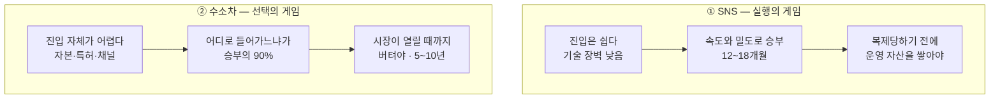

# 신규 진입자 KSF 비교 — 위치기반 숏폼 SNS ↔ 수소연료전지 승용차

> [① 위치기반 숏폼 SNS](./분석-01-위치기반-숏폼-SNS.md) · [② 수소연료전지 승용차](./분석-02-수소연료전지-승용차.md)
> 선행 비교 [Five Forces 비교](../01-porters-five-forces/비교-01-vs-02.md) · [가치사슬 비교](../02-value-chain/비교-01-vs-02.md)

## 0. 왜 KSF 목록을 합치지 않았는가

두 시장은 Five Forces에서 모두 **매력도 낮음** 판정을 받았으나, 그 원인이 정반대였다. ①은 다섯 힘이 전부 강해 이익이 깎이는 **과밀형**, ②는 경쟁자도 진입자도 없는데 시장 자체가 열리지 않은 **미성숙형**이다. 가치사슬 분석은 이 차이를 활동 수준에서 확인했다 — ①은 사슬 안에서 마진이 새고(🔴), ②는 사슬이 회사 밖에서 끊어진다(⛔).

원인이 반대이므로 성공 요인도 반대다. **하나의 Top 5로 합치면 어느 쪽에도 맞지 않는 일반론이 된다.** 두 목록을 나란히 놓았을 때 비로소, KSF라는 것이 산업 구조에서 어떻게 도출되는지가 드러난다.

---

## 1. Top 5 대조표

| 순위 | ① 위치기반 숏폼 SNS | 성격 | ② 수소연료전지 승용차 | 성격 |
|---|---|---|---|---|
| 1 | 단일 지역에서의 임계 밀도 선점 | 진입 조건 | 진입 지점의 재정의 — 승용차 완성차 회피 | 진입 조건 |
| 2 | 대체재가 침범할 수 없는 '상황'의 점유 | 성장 요인 | 백금 저감·회수 기술 | 성장 요인 |
| 3 | 기능이 아닌 운영으로 쌓는 방어 자산 | 생존 전제 | 스택 모듈의 다용도 표준화 | 생존 전제 |
| 4 | 위치 결합 위해의 사전 차단 역량 | 생존 전제 | 충전 인프라가 필요 없는 운영 구조 | 진입 조건 |
| 5 | 광고에 의존하지 않는 초기 수익 구조 | 성장 요인 | 정책 주기보다 긴 현금 수명 | 생존 전제 |

---

## 2. 핵심 대비 네 가지

### ① 1순위 KSF가 둘 다 "정면으로 들어가지 마라"이다

두 시장의 1순위 KSF는 표현이 전혀 다르지만 명령은 같다.

| | ① SNS | ② 수소차 |
|---|---|---|
| 1순위 KSF | 단일 지역에서의 임계 밀도 선점 | 승용차 완성차 회피 |
| 실질적 명령 | **전국으로 넓히지 마라** | **완성차로 들어가지 마라** |
| 근거가 된 판정 | 대체재 위협 매우 높음 + CAC > ARPU | 대체재 위협 매우 높음 + 진입장벽 3요소 전부 높음 |

> 📌 이것은 우연이 아니다. **매력도가 낮은 산업에서 신규 진입자의 첫 번째 성공 요인은 언제나 '어디를 포기할 것인가'로 나타난다.** 자원이 한정된 진입자가 정면에서 이길 방법은 존재하지 않으므로, 전략은 무엇을 하느냐가 아니라 어디를 비우느냐에서 시작된다.

### ② 그러나 게임의 성격이 다르다 — 실행의 게임 vs 선택의 게임

| | ① SNS | ② 수소차 |
|---|---|---|
| 승부가 결정되는 시점 | **진입 후** — 실행 속도와 운영 품질 | **진입 전** — 어느 구간으로 들어갈지 정하는 순간 |
| KSF의 성격 | 대부분 **조직 역량** (밀도 확보, 커뮤니티 운영, 안전 대응) | 대부분 **포지션 선택과 자산** (진입 구간, 기술, 운영 구조, 자금) |
| 잘못된 선택의 회복 가능성 | 있다 — 지역을 바꿔 다시 시도 가능 | 거의 없다 — 설비와 인증에 자본이 묶인다 |
| 필요한 조직 문화 | 빠른 시도와 회수 | 사전 검증과 축적 |

①에서는 무엇을 할지가 비교적 명확하고 **얼마나 잘하느냐**가 승부를 가른다. ②에서는 실행 이전에 **어디에 서 있느냐**가 결과의 대부분을 결정한다.

> 📌 이는 가치사슬 비교에서 도출한 결론 — *"①은 최적화 문제, ②는 연결 문제"* — 가 신규 진입자 관점에서 다시 확인된 것이다. 최적화 문제는 열심히 해서 개선되고, 연결 문제는 위치를 바꿔야 풀린다.

### ③ 시간축이 다르므로 '실패'의 정의가 다르다

| | ① SNS | ② 수소차 |
|---|---|---|
| 생존 판정 주기 | **12~18개월** — 첫 지역에서 밀도를 못 만들면 소멸 | **5~10년** — 시장이 열릴 때까지 버티는 것이 과제 |
| 죽는 원인 | 밀도 없는 확장으로 인한 **CAC 소진** | 시장 개화 이전의 **현금 고갈** |
| 5순위 KSF의 성격 | 광고 아닌 수익 구조 — *빨리 벌기* | 정책 주기보다 긴 현금 수명 — *오래 버티기* |
| 위험한 성공 신호 | 다운로드 수 증가 (밀도 없는 확장) | 보조금 기반 초기 수주 (정책 의존 심화) |

> 📌 ①의 신규 진입자에게 시간은 **적**이다. 거인이 복제하기 전에 운영 자산을 쌓아야 한다. ②의 신규 진입자에게 시간은 **조건**이다. 시장이 열리는 시점이 외부에서 정해지므로, 그때까지 살아 있는 것 자체가 전략이다.

### ④ Five Forces의 '진입자 위협' 판정이 KSF 도출로 뒤집힌다

이 비교에서 가장 중요한 발견이다.

| | Five Forces 판정 | KSF 도출 후 |
|---|---|---|
| ① SNS | 신규 진입자 위협 **높음** — 기술 장벽이 낮아 누구나 들어온다 | 들어가기는 쉽지만 **살아남기가 극히 어렵다.** 진입 이후 4개의 KSF가 전부 생존과 방어에 관한 것 |
| ② 수소차 | 신규 진입자 위협 **낮음** — 자본·특허·채널 3중 장벽 | **진입 지점을 바꾸면 장벽이 성립하지 않는다.** 소재·촉매 층위나 폐쇄 구역 특수차량에는 조 단위 설비가 필요 없다 |

> ⚠️ **교육 포인트.** *'진입자 위협 높음'* 이 *'진입하기 쉽다'* 를 뜻하지 않고, *'진입자 위협 낮음'* 이 *'진입이 불가능하다'* 를 뜻하지 않는다. Five Forces의 진입 장벽 판정은 **분석자가 어떤 진입 지점을 상정했느냐에 종속**된다. ②의 장벽이 높게 나온 것은 분석 단위를 '승용차 완성차 제조사'로 잡았기 때문이며, 층위를 바꾸면 판정도 바뀐다.
>
> 이것이 KSF 분석이 Five Forces 다음에 와야 하는 이유다. **KSF를 도출하는 과정에서 비로소 진입 지점을 재정의하게 되고, 그 결과 앞선 판정이 수정된다.**

---

## 3. 신규 진입자를 위한 최종 권고

| | ① 위치기반 숏폼 SNS | ② 수소연료전지 승용차 |
|---|---|---|
| **진입 권고 여부** | **조건부 권고** — 지역을 좁힐 각오가 있을 때만 | **승용차 완성차는 비권고**, 밸류체인 특정 구간은 권고 |
| **진입 지점** | 하나의 대학·지역·활동 커뮤니티 | 소재·촉매 공급자 또는 폐쇄 구역 특수 목적 차량 |
| **첫 12개월에 할 일** | 목표 지역에서 *"켜면 아는 사람이 있다"* 는 상태 달성 | 완성차사 검증 통과 가능한 기술 실증 + 정책 비의존 매출 확보 |
| **첫 12개월에 하지 말 것** | 두 번째 지역으로 확장, 광고 수익화 시도 | 완성차 설비 투자, 보조금 기반 대량 수주 |
| **실패 신호** | 다운로드는 느는데 지역별 밀도가 정체 | 매출이 전부 보조금 사업이고 기술 라이선싱 수요가 없음 |
| **철수 판단 기준** | 첫 지역에서 18개월 내 밀도 미달 | 보조금 중단 시나리오에서 12개월 미만 runway |

---

## 4. 이 비교에서 남는 교훈

1. **KSF는 산업 구조에서 도출되는 것이지, 일반론에서 오는 것이 아니다.** *'좋은 팀'* 이나 *'차별화된 제품'* 은 어느 산업에나 해당하므로 KSF가 아니다. 두 시장의 Top 5가 단 하나도 겹치지 않았다는 사실이 이를 증명한다.

2. **매력도가 낮은 산업일수록 1순위 KSF는 '무엇을 포기할 것인가'로 나타난다.** 자원이 한정된 신규 진입자가 정면에서 이길 방법은 없으므로, 전략은 비우는 데서 시작한다.

3. **KSF의 성격을 구분해야 자원 배분이 가능해진다.** 잘하면 이기는 **성장 요인**, 못하면 죽는 **생존 전제**, 시작 전에 정해지는 **진입 조건**은 각각 다른 시점에 다른 자원을 요구한다. 섞어서 나열하면 우선순위가 무너진다.

4. **선행 분석의 판정은 KSF 도출 과정에서 수정될 수 있다.** ②의 '진입자 위협 낮음'은 분석 단위를 승용차 완성차로 잡았을 때의 결론이었고, 진입 지점을 바꾸자 성립하지 않았다. **프레임워크의 결론은 분석 단위에 종속된다는 원칙이 여기서 다시 확인된다.**

5. **다음 챕터로 이어지는 질문.** KSF는 *"무엇에 집중해야 하는가"* 를 알려주지만, *"그 집중이 얼마나 큰 시장을 여는가"* 는 답하지 못한다. ①의 '하나의 대학가'와 ②의 '폐쇄 구역 특수차량'이 각각 사업이 될 만한 크기인지는 아직 모른다. → 챕터 04 **TAM-SAM-SOM과 Market Segment Map**.
