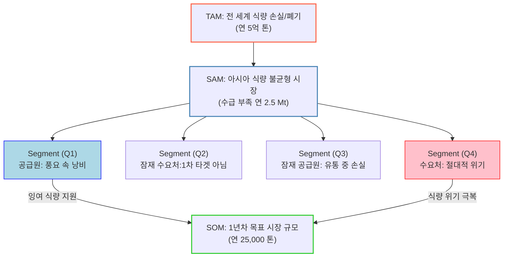
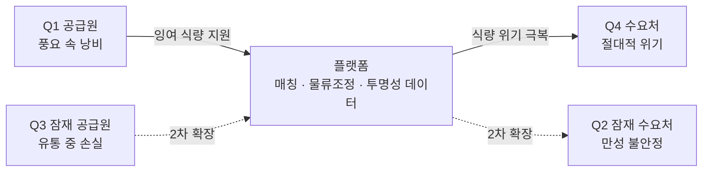

# TAM-SAM-SOM 분석 ③ — 아시아 식량 재분배(잉여-부족 매칭) 플랫폼

> [분석 방법론](./분석-방법론.md) · 리서치 원본 [① 글로벌 식량수급 불균형](./리서치-원본/01-글로벌-식량수급-불균형.md) · [② 아시아 식품유통손실 보고서](./리서치-원본/02-아시아-식품유통손실-보고서.md)

## 0. 분석 단위와 전제

> ⚠️ **이 분석은 챕터 01~03의 두 시장(①위치기반 SNS, ②수소연료전지차)과 무관한 세 번째 대상이다.** 앞선 챕터의 비교 축을 이어받지 않으며, 번호 ③은 프로젝트 전체에서의 분석 대상 순번이다.

| 항목 | 설정 |
|---|---|
| 분석 주체 | **잉여 식량 보유처와 식량 부족 지역을 연결하는 재분배·매칭 플랫폼 사업자** |
| 사업 모델 | 양면 시장 — 공급 측(잉여·손실 예정 식량) ↔ 수요 측(식량 위기 지역). 매칭·물류 조정·투명성 데이터 제공 |
| 지역·시점 | 아시아 중심, 2025년 리서치 기준 |
| 근거 리서치 | ChatGPT 심층리서치 2건 (원본 보존 → `리서치-원본/`) |

### 측정 대상과 단위 — 먼저 못 박는다

이 분석에서 시장 규모는 **금액이 아니라 식량의 물리적 무게(톤)** 로 측정한다. 방법론 7-1이 요구하는 대로 세 층의 단위를 통일한다.

| 기호 | 단위 | 환산 |
|---|---|---|
| **Mt** | 백만 톤 (million tonnes) | 1 Mt = 1,000,000 t |
| **t** | 톤 | — |

> 📌 **왜 금액이 아닌 톤인가.** 이 사업의 1차 성과는 매출이 아니라 *"몇 톤을 굶주린 곳으로 옮겼는가"* 다. 수익 모델(수수료·기부·공공 조달)은 톤 규모가 정해진 뒤에 얹는 층이므로, 시장 규모 자체는 톤으로 잡는 것이 타당하다. 단, 투자 유치 단계에서는 **톤 → 금액 환산**이 별도로 필요하다 (→ 7절).

---

## 1. 전체 구조도

| 층 | 수치 | 출처 |
|---|---|---|
| TAM | 연 5억 톤 (500 Mt) | 리서치 ① — *"매년 5억 톤의 음식이 손실되고 있습니다"* **(확인)** |
| SAM | 연 2.5 Mt | 리서치 ① 5절 — 아시아 충격 유발 수급 부족 약 2~3 Mt **(추정)** |
| SOM | 연 25,000 t | 1년차 목표치. SAM의 1% **(가정)** |
| Segment | Q1~Q4 | 리서치 ①②의 공급·수요 구조에서 도출 |

---

## 2. TAM — 전 세계 식량 손실·폐기

### 정의
> 전 세계에서 **생산되었으나 사람의 입에 들어가지 못하고 사라지는 식량**의 연간 총량.

### 수치 — **연 5억 톤 (500 Mt)** (확인)

### 산출 근거

리서치 ①에 직접 진술된 수치다. 주변 데이터가 이 자릿수를 뒷받침한다.

| 교차 근거 | 수치 | 출처 |
|---|---|---|
| 세계 곡물 생산량 | 약 2,925 Mt | FAO CSDB (리서치 ① 3절) |
| FAO 식품손실지수(수확 후~소매 이전) | **13.2%** (2021) | FAO SDG 12.3.1 (리서치 ②) |
| → 곡물만 환산 | 2,925 × 13.2% ≈ **386 Mt** (추정) | 계산 |
| 곡물 과잉·폐기 최근 5년 평균 | **250~300 Mt** | 리서치 ① 3절 |

> 📌 **자릿수 검증 통과.** 곡물만으로 386 Mt이고 여기에 과일·채소가 더해지므로, 500 Mt은 **곡물+원예작물 기준의 보수적 추정치**로 읽는 것이 타당하다. 다만 FAO/UNEP가 별도로 집계하는 *식품 손실 + 음식물 쓰레기 전체*는 이보다 훨씬 크므로(십억 톤 단위), **5억 톤은 '전체 식량 폐기'가 아니라 '유통 단계에서 상품성을 잃은 식량'으로 범위를 한정한 값**임을 명시해야 한다.

### 이 층에서 확인되는 사실

**세계는 식량이 모자라서 굶는 것이 아니다.** 리서치 ①의 진단이 이 사업의 존재 이유다.

> *"식량 공급(availability)은 되는데 접근성(accessibility)과 구매력(affordability), 안정성(stability)이 깨져 있는 구조야. 이 네 기둥 중 하나라도 무너지면 '풍요 속 기아'가 발생해."*

같은 리서치는 **2024년 IPC 3+ 인구의 칼로리 결핍을 전부 메우는 데 약 18.5 Mt의 곡물이면 충분**하다고 계산했다. 폐기량의 **7~8%만 재분배해도 전 세계 급성 기아의 칼로리 갭이 상쇄된다**는 뜻이다.

---

## 3. SAM — 아시아 식량 불균형 시장

### 정의
> TAM 중 **우리 플랫폼이 물리적·제도적으로 닿을 수 있는** 범위. 아시아 역내에서 발생하는 수급 불균형.

### 수치 — **연 2.5 Mt** (추정)

### TAM → SAM 을 좁힌 기준

| 좁히는 기준 | 근거 |
|---|---|
| **① 지역 한정 — 아시아** | 리서치 ② 전체가 아시아 대상. 아시아는 세계 곡물 생산의 **약 54%**(≈1,450 Mt)를 차지하는 최대 생산지이자 최대 손실 지역 |
| **② 대상 한정 — 실제 부족분** | 폐기량 전체가 아니라 **부족한 만큼**만이 재분배의 상한. 리서치 ① 5절 기준 아시아의 충격 유발 부족량 **약 2~3 Mt** |
| **③ 물류 도달 가능성** | 리서치 ① 3절 — *"거리가 짧아도 정치·안보·인프라 병목이 풀리지 않으면 곡물이 못 들어갑니다"* → 봉쇄·분쟁 지역 제외 |

### 아시아를 고른 이유 — 공급과 수요가 같은 대륙 안에 있다

리서치 ①의 지역 대조에서 아시아의 구조가 독특하다.

| 지역 | 과잉·폐기 | 충격 부족 | 구조 |
|---|---|---|---|
| **아시아** | **+190 Mt** | **−3 Mt** | 버려지는 양이 부족량의 **60배 이상** |
| 아프리카 | +40 Mt | −15 Mt | 폐기 < 부족 — 생산 자체가 부족 |
| 아메리카 | +86 Mt | −50 Mt | 충격 규모가 큼 |
| 유럽/CIS | +57 Mt | −25 Mt | 수출 차질형 |

> 📌 **이것이 SAM을 아시아로 잡은 결정적 근거다.** 아프리카는 폐기보다 부족이 커서 역내 재분배만으로는 해결되지 않는다(외부 조달 필요). 반면 **아시아는 역내에 버려지는 양만으로 역내 부족을 60배 이상 덮을 수 있다.** 즉 *"물량을 어디서 구하나"* 가 아니라 *"어떻게 옮기나"* 만 풀면 되는 시장이다.

### 아시아 손실의 실제 구성 (리서치 ②)

| 항목 | 수치 |
|---|---|
| 세계 수확 후~소매 이전 손실률 | 13.2% (2021) |
| 중앙·남아시아 손실률 | **20% 이상** — 세계 최고 |
| 남아시아 생산 대비 폐기 | **30% 이상** ≈ 3억 명분 |
| 인도 곡물 연간 손실 | 약 **2,300만 t** |
| 인도 과일 연간 손실 | 약 **1,200만 t** |
| 파키스탄 과일·채소 손실 | 생산 1,376만 t 중 35~40% ≈ **500만 t** |
| 필리핀 벼 건조 단계 손실 | 최대 **33%** |

---

## 4. SOM — 1년차 목표 시장

### 정의
> SAM 중 **1년 안에 우리가 실제로 매개할 수 있는** 물량.

### 수치 — **연 25,000 톤 (0.025 Mt)** (가정)

### SAM → SOM 을 좁힌 기준

**SAM 2.5 Mt의 1%.** 이 1%는 리서치에서 도출된 값이 아니라 **1년차 목표로 설정한 값**이다. 근거가 없다는 사실을 숨기지 않고 명시한다.

### 이 수치가 타당한지 상향식으로 교차 검증

방법론 1절이 요구하는 하향식↔상향식 교차 검증을 수행한다.

| 항목 | 값 | 비고 |
|---|---|---|
| 대형 트럭 1대 적재량 | 약 25 t | 일반 곡물 수송 기준 |
| 25,000 t 환산 | **트럭 1,000대분** | = 하루 약 **2.7대** |
| 40ft 컨테이너 1개 적재량 | 약 26 t | |
| 25,000 t 환산 | **컨테이너 약 960개** | 주당 약 18개 |

> 📌 **자릿수 검증 통과.** 하루 트럭 3대 수준은 신생 플랫폼이 1년차에 매개하기에 **공격적이지만 불가능하지 않은** 규모다. 반대로 이 규모조차 달성하지 못하면 사업 모델 자체를 재검토해야 한다는 뜻이기도 하다. **SOM은 목표인 동시에 실패 판정선이다.**

### 이 물량의 의미

25,000 t은 SAM의 1%에 불과하지만, 절대량으로는 **성인 약 3만 명의 연간 곡물 소비량**에 해당한다(성인 1인 연간 곡물 소비 약 800 kg 가정, **추정**). 1년차 목표로서 사회적 의미가 성립한다.

---

## 5. Market Segment Map

### 두 축의 정의

원본 차트는 사분면 Q1~Q4만 제시하고 축 이름을 명시하지 않았다. 각 사분면의 명칭에서 역산하면 두 축은 다음과 같이 읽힌다.

| 축 | 이름 | 양 끝 |
|---|---|---|
| **세로축** | **식량 수급 상태** | 위 = 잉여·과잉 / 아래 = 결핍·부족 |
| **가로축** | **표적 우선순위** | 왼쪽 = 잠재(2차) / 오른쪽 = 1차 표적 |

> ⚠️ **축 이름은 반드시 확정해야 한다.** 방법론 7-5가 요구하는 항목이다. 위 해석은 사분면 명칭에서 역산한 것이므로, 원 설계 의도와 다르면 이 표를 수정하고 차트에 축 라벨을 추가해야 한다.

### 사분면별 정의와 우선순위

| 사분면 | 역할 | 특성 | 구체적 대상 | 우선순위 |
|---|---|---|---|---|
| **Q1** | **공급원** | 풍요 속 낭비 | 가격 방어·규격 미달로 폐기하는 대형 유통·농협·식품기업. 리서치 ①의 *"규격중심 유통"* 폐기 5~15% | 🔵 **1차 (공급)** |
| **Q2** | 잠재 수요처 | 1차 타겟 아님 | 만성적 식량 불안정 상태이나 IPC 3 미만인 지역. 긴급도가 낮아 후순위 | ⬜ 2차 |
| **Q3** | 잠재 공급원 | 유통 중 손실 | 저장·운송 과정에서 손실이 발생하는 산지·물류 단계. 리서치 ② — 저장 10~20%, 건조 최대 33% | ⬜ 2차 |
| **Q4** | **수요처** | 절대적 위기 | IPC 3+ 급성 식량위기 인구. 2024년 **2억 9,530만 명**, 칼로리 갭 **18.5 Mt** | 🔴 **1차 (수요)** |

### 왜 Q1 → Q4 만 1차 표적인가

방법론 7-6은 1차 표적을 하나로 좁힐 것을 요구한다. 양면 시장이므로 **공급 1개 + 수요 1개**로 좁혔다.

- **Q1이 공급 1차인 이유.** 물량이 **이미 한곳에 모여 있고** 소유권이 명확해 협상 상대가 특정된다. 반면 Q3(유통 중 손실)은 손실이 산지·창고·도로에 **흩어져 발생**하므로 회수 단가가 높고 소유권도 불분명하다. **같은 1톤이라도 모으는 비용이 다르다.**
- **Q4가 수요 1차인 이유.** 긴급도가 명확해 **의사결정이 빠르고**, WFP·정부·NGO라는 **기존 수령 채널이 이미 존재**한다. Q2는 필요는 있으나 긴급도가 낮아 의사결정이 지연된다.

> 📌 **Q3는 버린 것이 아니라 미룬 것이다.** 리서치 ②가 보여주듯 유통 중 손실은 아시아 손실의 최대 덩어리(저장·건조·운송)다. **물량 잠재력은 Q3가 가장 크지만, 회수 난도 때문에 1년차 표적이 아니다.** Q1으로 운영 역량을 만든 뒤 Q3로 확장하는 것이 순서다.

### 사업 모델 — 사분면을 잇는 화살표

**플랫폼이 실제로 파는 것은 식량이 아니라 '연결'이다.** 리서치 ①이 지적한 병목 — *"거리가 짧아도 정치·안보·인프라 병목이 풀리지 않으면 곡물이 못 들어갑니다"* — 이 곧 이 사업의 존재 이유이자, 해결해야 할 대상이다.

---

## 6. 수치 검증 메모

### 대조표

| 수치 | 표기 | 리서치 대응 위치 | 판정 |
|---|---|---|---|
| TAM 500 Mt | (확인) | 리서치 ① — *"매년 5억 톤의 음식이 손실"* | ✅ 직접 진술 |
| 곡물 생산 2,925 Mt | (확인) | 리서치 ① 3절 FAO CSDB | ✅ |
| 손실률 13.2% | (확인) | 리서치 ② FAO SDG 12.3.1 (2021) | ✅ |
| 아시아 폐기 +190 Mt | (확인) | 리서치 ① 5절 | ✅ |
| SAM 2.5 Mt | (추정) | 리서치 ① 5절 아시아 부족 −3 Mt / 4절 세부 합산 | ⚠️ 아래 참조 |
| SOM 25,000 t | (가정) | 리서치에 근거 없음. SAM의 1% 목표 설정 | ⚠️ 목표치 |
| IPC 3+ 2.953억 명 | (확인) | 리서치 ① 1절 GRFC 2025 | ✅ |
| 칼로리 갭 18.5 Mt | (추정) | 리서치 ① 6절 — 600 kcal/인·일 × 3.5 M kcal/t 환산 | ✅ 계산식 명시됨 |

### ⚠️ 반드시 짚어야 할 방법론적 쟁점 — TAM과 SAM의 측정 대상이 다르다

방법론 1절의 **제1원칙(단위와 측정 대상이 같아야 한다)** 에 걸리는 지점이다.

| 층 | 측정하는 것 |
|---|---|
| TAM 500 Mt | **버려지는 양** (폐기·손실) |
| SAM 2.5 Mt | **모자라는 양** (수급 부족) |

**두 숫자는 동전의 양면이지 포함 관계가 아니다.** 2.5 Mt은 500 Mt의 부분집합이 아니라, 그 500 Mt으로 메워야 할 반대편 구멍이다. 엄밀히 하려면 아래 둘 중 하나를 택해야 한다.

| 선택지 | 조정 내용 | 결과 |
|---|---|---|
| **A. 공급 기준으로 통일** | TAM=세계 손실 500 Mt → SAM=**아시아 손실 약 190 Mt** → SOM=25,000 t | 포함 관계는 성립하나 SAM이 과대해져 SOM 비중이 0.01%로 떨어짐 |
| **B. 수요 기준으로 통일** | TAM=**세계 칼로리 갭 18.5 Mt** → SAM=아시아 부족 2.5 Mt → SOM=25,000 t | 포함 관계 성립. 세 층이 모두 *"메워야 할 양"* 으로 일관됨 |

> 📌 **권고는 B다.** 이 사업이 파는 가치는 *"얼마나 버려지는가"* 가 아니라 *"얼마나 채워지는가"* 이므로, 수요 기준 통일이 사업 정의와 일치한다. 다만 **현재 차트는 원안 그대로 보존**했다 — 원 설계 의도를 확인한 뒤 수정하는 것이 순서이기 때문이다.
>
> 한편 **현재 차트가 교육적으로는 더 나은 면도 있다.** 500 Mt(버려지는 양)과 2.5 Mt(모자라는 양)을 위아래로 붙여 놓으면 *"이만큼 버리면서 이만큼 모자라다"* 는 모순이 한눈에 보인다. 시장 규모 산정용과 문제 제기용을 **두 장의 차트로 분리**하는 것도 방법이다.

### 추가 확인이 필요한 항목

1. **TAM 500 Mt의 원 출처** — 리서치 대화에 진술은 있으나 기관·연도가 특정되지 않았다. FAO(2011, 13억 t 손실+폐기) / UNEP Food Waste Index(2024, 약 10억 t 폐기) / FAO SDG 12.3.1(13.2%) 중 어느 정의에 해당하는지 확인 필요.
2. **아시아 부족 2.5 Mt의 범위** — 리서치 ① 4절 세부는 동아시아 −3 Mt, 동남아 −6 Mt, 중앙아시아 −4 Mt로 합산 시 13 Mt이나, 5절 통합 차트는 −3 Mt이다. **집계 범위(남아시아 포함 여부)를 확정해야 한다.**
3. **성인 1인 연간 곡물 소비 800 kg** — 4절에서 쓴 가정치. 국가별 편차가 크므로 실제 적용 시 대상 지역 기준으로 보정 필요.

---

## 7. 다음 단계로 넘기는 질문

이 분석이 답한 것과 답하지 못한 것을 구분한다.

| 답한 것 | 답하지 못한 것 |
|---|---|
| 문제의 물리적 규모 (톤) | **경제적 규모 (원)** — 수수료·기부·공공조달 중 무엇으로 얼마를 버는가 |
| 공급·수요가 어디에 있는가 | **그들이 왜 우리를 써야 하는가** — Q1 기업이 폐기 대신 우리를 택할 동기 |
| 1차 표적 사분면 | **표적 안의 실제 인물** — Q1의 의사결정자는 ESG 담당인가 물류 담당인가 |
| 재분배 가능 물량의 상한 | **물류 병목의 해소 방법** — 리서치가 지목한 정치·안보·인프라 장벽 |

→ 챕터 05 **페르소나·고객 여정지도**로 이어진다. 특히 *"Q1의 의사결정자는 누구이며 무엇을 두려워하는가"* 가 다음 분석의 출발점이다.

> 📌 리서치 ①에는 이 플랫폼의 원형으로 보이는 **'Pollosseum'** — 생산·폐기·부족 지표를 시민이 보고 토론·투표하는 대시보드 구상 — 이 반복 언급된다. 재분배 매개와 시민 참여 중 **어느 쪽이 주력인지**에 따라 Q1·Q4의 정의가 달라지므로, 챕터 05 진입 전에 확정이 필요하다.

---

### ✅ 사후 기록 — 위 미결 질문은 챕터 05에서 확정됐다

사업 주체 확인 결과, 주력 모델은 **재분배 매개(양면 플랫폼)가 아니다.** 확정된 모델은 다음과 같다.

> **전 세계 구호 재원 가용 현황을 확인시키고 신규 구호자금을 모금하는 페이지**를 운영하며, 여러 행위자를 **사전 설득**해 확보한 조건으로 잉여 지역 → 부족 지역 **무상 운송**을 집행한다. 모금액은 식량이 아니라 **운송비**에 투입된다.

이 확정이 위 분석에 미치는 영향은 아래와 같다. **본문은 수정하지 않고 그대로 둔다** — 어떤 전제 위에서 무엇을 계산했는지가 남아 있어야 검증이 가능하기 때문이다.

| 위 분석의 결론 | 확정 후의 지위 |
|---|---|
| TAM 500 Mt · SAM 2.5 Mt · SOM 25,000 t | **유효.** 여전히 옮겨야 할 물리적 규모다 |
| Q1~Q4 Market Segment Map | **유효하되 고객 지도가 아니다.** 식량의 소재를 보여주는 지도이며, 그 안의 인물은 고객이 아니라 **사전 설득 대상 파트너**다 |
| §5 사업 모델 화살표 (Q1 → 플랫폼 → Q4) | **물자 흐름으로는 유효.** 다만 그 흐름을 여는 것은 플랫폼 매칭이 아니라 오프라인 설득과 모금된 운송비다 |
| 위 표의 *"Q1의 의사결정자는 ESG 담당인가 물류 담당인가"* | **질문은 살아 있으나 대상이 바뀐다.** 고객 조사가 아니라 **파트너 협상 상대 파악**의 문제다 |
| 위 표의 *"경제적 규모(원)"* | **답의 형태가 정해졌다** — 톤당 운송 단가 × 톤. 모금 목표는 여기서 역산된다 |

→ 정정된 전제에 따른 페르소나는 [챕터 05 페르소나 스펙트럼](../05-persona-journey/분석-03-식량-재분배-플랫폼-페르소나-스펙트럼.md) 에 있다. **정정의 경위는 이 사후 기록이 유일한 보관처다** — 챕터 05 문서는 최종 결과만 담도록 정리했다.
