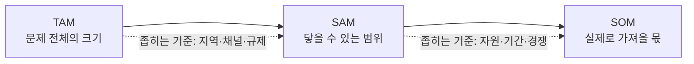

# 04 - TAM-SAM-SOM 과 Market Segment Map

> 본 챕터의 분석은 이 문서에 정의된 방법론을 따른다.

## 1. 세 개의 동심원 — TAM / SAM / SOM

시장 규모는 하나의 숫자가 아니다. **어디까지를 '우리 시장'으로 볼 것인가**에 따라 세 겹으로 갈라진다.

| 층 | 정식 명칭 | 묻는 질문 | 성격 |
| --- | --- | --- | --- |
| **TAM** | Total Addressable Market | 이 문제 전체의 크기는 얼마인가? | 문제의 규모. 사업 기회의 천장 |
| **SAM** | Serviceable Available Market | 우리 제품·채널·지역으로 **닿을 수 있는** 부분은? | TAM 중 물리적·제도적으로 도달 가능한 몫 |
| **SOM** | Serviceable Obtainable Market | 우리가 **실제로 가져올** 수 있는 몫은? | 자원·기간을 반영한 목표치 |



### 반드시 지켜야 할 두 가지 원칙

1. **단위가 같아야 한다.** TAM·SAM·SOM은 포함 관계(TAM ⊇ SAM ⊇ SOM)이므로 **같은 단위, 같은 측정 대상**이어야 한다. TAM은 '폐기량', SAM은 '부족량'처럼 측정 대상이 바뀌면 세 숫자는 동심원이 아니라 서로 다른 세 개의 숫자가 된다.
2. **좁히는 기준을 명시해야 한다.** TAM → SAM, SAM → SOM으로 갈 때 **무엇을 근거로 얼마나 잘라냈는지**를 밝힌다. 근거 없는 축소는 추정이 아니라 희망이다.

> 📌 **하향식(Top-down) vs 상향식(Bottom-up).** 위 방식은 큰 숫자에서 잘라 내려오는 하향식이다. 반대로 *"고객 1명당 단가 × 도달 가능 고객 수"* 로 쌓아 올리는 상향식이 있다. **가능하면 두 방식으로 각각 계산해 자릿수가 맞는지 교차 검증**한다. 어긋나면 둘 중 하나의 가정이 틀린 것이다.

## 2. Market Segment Map — 시장을 쪼개는 지도

TAM-SAM-SOM이 시장의 **크기**를 재는 도구라면, Segment Map은 그 시장이 **어떤 성질의 집단으로 나뉘는지**를 본다. 두 개의 축으로 2×2 사분면을 만들고, 각 칸에 고객군을 배치한다.

- **축은 두 개만 고른다.** 축이 늘어나면 지도가 아니라 표가 된다.
- **축은 반드시 이름을 붙인다.** 축 이름 없는 사분면은 해석이 사람마다 달라진다.
- **각 칸에 우선순위를 표시한다.** 1차 표적 / 2차 / 대상 아님을 구분하지 않으면 지도를 그린 의미가 없다.
- **양면 시장(two-sided market)이라면 공급 측과 수요 측을 같은 지도 위에 놓는다.** 이때 사분면 사이를 잇는 화살표가 곧 **사업 모델**이 된다.

## 3. 산출물 구성

| 분석 대상 수 | 산출 파일 |
| --- | --- |
| 1개 | `분석-<번호>-<대상명>.md` |
| 2개 이상 | 각 분석 파일 + **`비교-*.md` (필수)** |
| 외부 리서치를 입력으로 쓴 경우 | **`리서치-원본/` 아래에 출처 문서를 원문 보존 (필수)** |

> **원본 보존 원칙.** 외부 리서치를 근거로 삼았다면 그 원문을 반드시 저장소에 함께 둔다. 링크만 남기면 링크가 죽는 순간 근거가 사라지고, 요약만 남기면 요약 과정의 왜곡을 검증할 수 없다.

## 4. 개별 분석 문서 골격

```
# TAM-SAM-SOM 분석 — <대상명>

> 방법론 링크 · 리서치 원본 링크

## 0. 분석 단위와 전제
    [필수] 분석 단위 표 — 사업 주체 / 사업 모델 / 지역·시점 / 근거 리서치
    [필수] ⚠️ 측정 대상과 단위를 못 박는다 (톤? 원? 명? 무엇을 세는가)

## 1. 전체 구조도
    [필수] TAM → SAM → SOM → Segment 를 잇는 mermaid 1개
    [필수] 다이어그램 아래 각 수치의 출처를 한 줄씩

## 2. TAM / 3. SAM / 4. SOM
    [필수] 절마다 — 정의 / 수치 / 산출 근거 / 좁히는 기준
    [필수] 추정치와 확인된 수치를 기호로 구분 (§6)

## 5. Market Segment Map
    [필수] 두 축의 이름과 정의
    [필수] 사분면별 고객군 + 우선순위 판정
    [필수] 사분면 간 연결(사업 모델)을 화살표로

## 6. 수치 검증 메모
    [필수] 각 수치가 리서치의 어느 부분에서 나왔는지 대조표
    [필수] 리서치에 없는 수치는 '가정'으로 명시

## 7. 다음 단계로 넘기는 질문
    [필수] 이 분석이 답하지 못한 것을 명시
```

## 5. Segment Map 다이어그램 규칙

- `graph TD` 로 그리고 TAM → SAM → 4개 사분면 → SOM 순으로 흐르게 한다.
- 사분면 노드는 `Segment (Qn)<br/>역할: 특성` 2줄로 쓴다.
- **1차 표적 사분면만 색을 채우고(`fill`), 나머지는 테두리만** 둔다. 우선순위가 색으로 즉시 읽혀야 한다.
- 공급 측과 수요 측 사분면에서 SOM으로 향하는 화살표에 **거래 내용을 라벨로** 적는다. 그 라벨이 사업 모델이다.
- `classDef` 로 TAM·SAM·SOM·공급·수요를 구분한다.

## 6. 수치 표기 규칙 (고정)

추정과 사실을 섞으면 분석 전체의 신뢰가 무너진다. 기호로 구분한다.

| 기호 | 의미 |
| --- | --- |
| **(확인)** | 출처가 명시된 공식 통계·보고서 수치 |
| **(추정)** | 확인된 수치에서 계산·환산한 값. 계산식을 함께 적는다 |
| **(가정)** | 근거 없이 목표로 설정한 값. 근거가 없다는 사실 자체를 밝힌다 |

## 7. 작성 품질 기준

1. **TAM ⊇ SAM ⊇ SOM 의 포함 관계를 눈으로 확인한다.** 세 숫자의 단위와 측정 대상이 같은지 먼저 점검한다. 이 검증을 통과하지 못한 분석은 무효로 본다.
2. **좁히는 기준을 반드시 쓴다.** *"SAM은 TAM의 10%"* 라고만 쓰면 근거가 없는 것이다. 왜 10%인지 밝힌다.
3. **확인·추정·가정을 기호로 구분한다.** 특히 SOM은 대부분 가정이다. 그 사실을 숨기지 않는다.
4. **자릿수를 통일한다.** Mt(백만 톤)와 톤을 섞어 쓰면 1,000배 오독이 발생한다. 표 안에서는 단위를 하나로 고정하고, 필요하면 괄호로 병기한다.
5. **Segment Map의 축에 이름을 붙인다.** 축 없는 사분면은 지도가 아니다.
6. **1차 표적을 하나로 좁힌다.** 네 사분면이 전부 중요하다는 결론은 우선순위를 정하지 않은 것과 같다.
7. **외부 리서치 원문을 함께 보존한다.** (3절 원본 보존 원칙)
