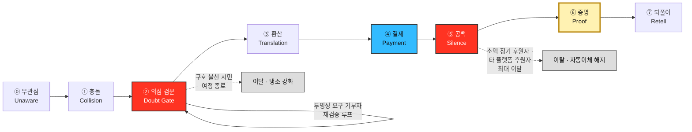

# 고객 여정지도 ③ — 구호재원 모금 기반 식량 무상 운송 서비스

> [분석 방법론 §3](./분석-방법론.md) · 입력 [페르소나 스펙트럼 분석 ③](./분석-03-식량-재분배-플랫폼-페르소나-스펙트럼.md) · 상위 [챕터 04 TAM-SAM-SOM](../04-tam-sam-som/분석-03-식량-재분배-플랫폼.md)

## 0. 등장 인물

이 지도는 스펙트럼 4유형의 대표 페르소나 넷을 다룬다. **접하기 전부터 결제 후까지**의 여정을 각각 그린다.

| 스펙트럼 유형 | 인물 이름 | 직무·상태 | 한 문장 정체 |
|---|---|---|---|
| 🔵 **핵심(Core)** | **「오천 원이 몇 킬로냐」** | 개인 소액 정기 후원자 | 월 5천~2만 원을 자동이체 중이며 후원처는 1~3곳. 내 돈이 무엇으로 바뀌었는지 모른다 |
| 🟢 **확장(Adjacent)** | **「이미 다른 데 후원 중」** | 타 기부 플랫폼 정기 후원자 | 아동·환경·의료 등 다른 대의에 이미 후원 중. 성과를 비교할 수 없어 옮기지 못한다 |
| 🔴 **극단(Extreme)** | **「원 단위로 캐묻는다」** | 극단적 투명성 요구 기부자 | 회계·감사 배경. 집행 내역이 없으면 안 내지만, 조건이 채워지면 가장 크게 가장 오래 낸다 |
| ⬜ **비활성(Non-user)** | **「어차피 중간에서 샌다」** | 국제 구호 불신 시민 | 알지만 내지 않는다. 안 내는 것이 합리적이라고 판단하고 있다 |

> 본문에서는 전체 이름 **「별칭」 + 직무**를 함께 쓰고, 표와 다이어그램에서는 자리가 좁을 때 **직무명**으로 부른다. 두 표기 모두 위 표의 같은 인물을 가리킨다.

---

## 1. 단계를 새로 정의한 근거

방법론 §3의 경고는 일반형 5단계(`문제 인식 → 탐색 → 의사결정 → 사용 → 유지`)를 그대로 채우지 말고 **서비스의 실제 관문에서 단계를 도출하라**고 요구한다. 그 절이 제시한 네 질문에 먼저 답한다.

| # | 질문 | 이 서비스의 답 |
|---|---|---|
| **1** | 고객이 실제로 통과하는 관문은? | 일반형에 없는 관문이 셋 있다 — **의심 검문**(내기 전에 반드시 통과) · **환산**(금액을 정하려면 원 → kg 변환이 먼저 있어야 한다) · **공백**(결제 후 결과가 오기까지 아무 일도 일어나지 않는 구간) |
| **2** | 가장 많이 이탈하는 곳은? | **②의심 검문**과 **⑤공백.** 전자는 결제 전 차단, 후자는 결제 후 소멸 |
| **3** | 결제 **이후에** 더 큰 관문이 있는가? | **있다.** 가구의 `조립·설치`와 같은 위치에 **⑤공백 → ⑥증명**이 있다. 기부는 결제 순간에 가치가 전달되지 않는다 |
| **4** | 페르소나마다 여정이 갈라지는가? | **갈라진다.** 「이미 다른 데 후원 중」 타 플랫폼 정기 후원자는 ⓪이 없고, 「원 단위로 캐묻는다」 투명성 요구 기부자는 ②에서 루프를 돌며 전용 단계가 하나 늘고, 「어차피 중간에서 샌다」 구호 불신 시민은 ②에서 여정이 끝난다. **지도를 넷으로 나눠 그린다** |

### 일반형을 쓰지 않은 이유 — 세 군데가 어긋난다

| 일반형 단계 | 이 서비스에서 어긋나는 지점 |
|---|---|
| **문제 인식** | 고객 **자신의** 불편이 아니다. 남의 문제이므로 '인식'이 아니라 우연한 **충돌**로 시작된다 |
| **사용** | **사용이라는 행위가 없다.** 결제 후 고객은 아무것도 하지 않고 기다린다. 그 자리에 **공백**과 **증명**이 들어간다 |
| **유지** | '반복 사용'이 아니라 **매번 다시 내리는 결심**이다. 그리고 유지의 방아쇠는 편의가 아니라 **남에게 말할 수 있는가**다 |

### 이 서비스의 8단계

| 표기 | 의미 |
|---|---|
| 🔴 빨강 (②·⑤) | **이탈 병목.** 여정의 성패가 여기서 갈린다 |
| 🔵 파랑 (④) | 결제 — **여정의 끝이 아니라 중간**이다 |
| 🟡 노랑 (⑥) | **가치가 실제로 전달되는 지점.** 결제가 아니라 여기가 목적지다 |

---

## 2. 🔵 핵심 — 「오천 원이 몇 킬로냐」 개인 소액 정기 후원자

> 월 5천~2만 원 자동이체. 후원처 1~3곳. 선의를 가지고 있으나 만성적으로 의심한다.

| 단계 | 고객 행동 | 고객 생각 | 감정 | **Pain Point** | 개선 기회 |
|---|---|---|---|---|---|
| **⓪ 무관심** | 구호 관련 게시물을 스크롤로 넘긴다 | *"또 불쌍한 얘기네"* | 무감각 | **호소가 서로 구별되지 않아 어떤 것도 기억에 남지 않는다** | 감정 호소 대신 **모순 수치 한 줄**로 진입 |
| **① 충돌** | *"버려지는 양이 부족량의 60배"* 에서 멈추고 링크를 연다 | *"남아도는데 왜 굶지?"* | 당혹 · 호기심 | **분노는 생겼는데 내가 할 수 있는 일이 무엇인지 보이지 않는다** | 첫 화면에서 **문제와 내 행동을 한 줄로 연결** |
| **② 의심 검문** | 단체 소개·수수료·언론 보도를 검색한다 | *"어차피 중간에서 얼마나 남기겠지"* | 경계 | **운영비 비율과 집행 내역이 없어 의심을 풀 근거를 찾지 못한다** | 운영비 비율·외부 검증 결과를 **결제 앞단에** 노출 |
| **③ 환산** | 금액 슬라이더를 움직이며 숫자를 본다 | *"오천 원이면 얼마나 가는 거지?"* | 흥미 | **금액과 결과의 관계를 몰라 얼마를 낼지 정하지 못한다** | **원 → kg → 도달 인원** 3단 환산 실시간 표시 |
| **④ 결제** | 정기 결제를 등록한다 | *"일단 소액으로"* | 가벼운 뿌듯함 | **해지가 어려울 것 같아 낼 수 있는 금액보다 낮춰 잡는다** | 등록 화면에 **해지 경로를 함께** 표기 |
| **⑤ 공백** | 아무것도 하지 않는다. 매달 결제 문자만 온다 | *"돈은 나가는데 뭐가 됐지?"* | 서서히 식음 | **집하·선적·통관에 걸리는 실제 리드타임 동안 신호가 없어 방치됐다고 느낀다** | 진행 상태(집하 → 선적 → 통관)를 **중간 신호**로 발송 |
| **⑥ 증명** | 인수 확인 기반 결과 알림을 연다 | *"진짜 갔구나"* | 안도 · 자부 | **결과가 전체 총량으로만 오면 내 몫이 어디 있는지 보이지 않는다** | **개인 누적 kg·도달 지역**을 개인 단위로 분리 표시 |
| **⑦ 되풀이** | 결과를 캡처해 공유하거나 금액을 올린다 | *"이건 말해도 되겠다"* | 신뢰 | **공유할 형태가 없으면 만족이 개인 안에서 끝나고 확산되지 않는다** | 공유 가능한 **개인 결과 카드** 제공 |

> 📌 **「오천 원이 몇 킬로냐」 개인 소액 정기 후원자의 여정은 ⑤에서 죽는다.** ①~④는 하루 안에 끝나지만 ⑤는 몇 주에서 몇 달이다. **가장 긴 단계에 가장 적은 설계가 들어가 있는 것**이 이 여정의 구조적 결함이다.

---

## 3. 🟢 확장 — 「이미 다른 데 후원 중」 타 기부 플랫폼 정기 후원자

> 아동·환경·의료 등 다른 대의에 이미 정기 후원 중. 우리의 확장 풀이자 「오천 원이 몇 킬로냐」의 공급원.

| 단계 | 고객 행동 | 고객 생각 | 감정 | **Pain Point** | 개선 기회 |
|---|---|---|---|---|---|
| **⓪ 무관심** *(변형)* | **해당 없음.** 이미 기부 중이다. 대신 **후원 피로**가 출발점 — 자동이체 내역을 훑는다 | *"이게 다 뭐였지"* | 피로 | **후원처가 늘수록 각각이 무엇을 했는지 확인할 방법이 없다** | *"지금 내는 곳과 비교"* 관점의 진입 콘텐츠 |
| **① 충돌** *(변형: 재검토 계기)* | 연말정산·후원 갱신 알림을 계기로 정리를 시도한다 | *"하나 줄이고 하나 바꿀까"* | 망설임 | **끊을 근거도 유지할 근거도 없어 결국 아무것도 바꾸지 못한다** | 갱신 시점을 노린 **비교형 진입** |
| **② 의심 검문** | 기존 단체와 나란히 놓고 비교한다 | *"여기가 더 나은가?"* | 비교 피로 | **단체마다 성과 단위가 달라 비교 자체가 성립하지 않는다** | **원 → kg → 명** 공통 단위로 환산 제시 |
| **③ 환산** | 지금 내는 금액을 그대로 넣어본다 | *"같은 돈이면 여기가 더 가나?"* | 계산적 관심 | **기존 후원 금액과 대조되지 않으면 이동 여부를 판단할 수 없다** | *"지금 내는 금액이면 여기선 O kg"* 대조 표시 |
| **④ 결제** | 기존 후원을 유지한 채 **소액 병행**으로 등록한다 | *"일단 같이 내보자"* | 안전한 시도 | **갈아타기를 요구받는다고 느끼면 죄책감 때문에 아예 중단한다** | **병행을 기본값**으로. 이전 권유 금지 |
| **⑤ 공백** | 기존 후원처의 소식과 나란히 비교하며 기다린다 | *"저기는 소식이 오는데"* | 열위감 | **비교 대상이 옆에 있어 무소식 기간이 곧바로 열등으로 읽힌다** | 기존 후원처보다 **잦은 최소 신호** 확보 |
| **⑥ 증명** | 결과 알림을 받는다 | *"이쪽이 확실히 명확하네"* | 납득 | **결과가 와도 기존 후원과 나란히 볼 화면이 없어 비교가 끊긴다** | **개인 기부 포트폴리오 뷰** |
| **⑦ 되풀이** | 기존 후원의 일부를 이쪽으로 옮긴다 | *"여기로 몰아도 되겠다"* | 정리된 만족 | **이전을 스스로 결정하려면 두 곳의 누적 성과가 한 화면에 필요하다** | **누적 비교 리포트** 제공 |

> 📌 **「이미 다른 데 후원 중」 타 플랫폼 정기 후원자는 신규 고객이 아니라 이주민이다.** 획득해야 할 것은 관심이 아니라 **비교 근거**다. 그리고 ④에서 이주를 요구하는 순간 죄책감이 작동해 오히려 전체가 멈춘다 — **병행이 기본값이어야 하는 이유다.**

---

## 4. 🔴 극단 — 「원 단위로 캐묻는다」 극단적 투명성 요구 기부자

> 회계·감사 배경. 기부금 유용 보도를 기억한다. 조건이 채워지면 가장 크게 가장 오래 낸다. **전용 단계 ②′가 하나 추가된다.**

| 단계 | 고객 행동 | 고객 생각 | 감정 | **Pain Point** | 개선 기회 |
|---|---|---|---|---|---|
| **⓪ 무관심** *(변형)* | 기부 시장을 이미 관찰 중이나 냉담하다 | *"대부분 검증이 안 된다"* | 냉담 | **관찰은 하고 있으나 검증 가능한 대상이 없어 후보에 오르지 않는다** | 검증 자료 자체를 **진입 콘텐츠**로 |
| **① 충돌** | 수치를 보자마자 **출처부터** 찾는다 | *"이 숫자 어디서 나왔지"* | 직업적 의심 | **출처 없는 수치는 신뢰가 아니라 경계를 유발한다** | 모든 수치에 **출처·연도·산출식** 병기 |
| **② 의심 검문** *(반복 루프)* | 재무제표·감사보고서·운영비 비율을 뒤진다. **여러 번 다시 온다** | *"합계 말고 내역"* | 적대적 검증 | **집계 총액만 있고 건별 집행 내역이 없어 검증이 중단된다** | **건별 집행 원장** 공개 |
| **②′ 소액 테스트** *(이 인물 전용 단계)* | 최소 금액을 넣고 결과가 오는지 관찰한다 | *"말이 아니라 행동을 본다"* | 유보 | **소액 기부자에게 결과 보고가 생략되면 테스트 자체가 실패로 끝난다** | **금액과 무관하게 동일한 증명** 제공 |
| **③ 환산** | 환산 계수의 산출 근거를 확인한다 | *"이 kg 계산은 뭘 근거로?"* | 검증적 | **환산 계수의 산출 근거가 없으면 마케팅 수치로 간주한다** | **계수 산출식과 갱신 주기** 공개 |
| **④ 결제** | 수수료 구조를 확인한 뒤 결제한다 | *"PG 수수료는 누가 부담하지"* | 신중 | **수수료·결제 비용이 표시되지 않으면 결제 직전에 이탈한다** | 결제 화면에 **비용 분해** 표기 |
| **⑤ 공백** | 진행 상태 페이지를 주기적으로 확인한다 | *"왜 아무 말이 없지"* | 의심 재발 | **진행 상태가 없으면 침묵을 지연이 아니라 은폐로 해석한다** | 지연 발생 시 **지연 사유를 먼저** 고지 |
| **⑥ 증명** | 인수 확인의 **입력 주체**를 확인한다 | *"이걸 누가 입력했나"* | 판정 대기 | **인수 확인을 우리가 입력했다면 증명이 자기증명으로 무너진다** | **수령 채널 서명·제3자 검증** 표기 |
| **⑦ 되풀이** | 금액을 크게 올리고 주변에 근거를 들어 권한다 | *"여긴 검증된다"* | 확신 | **단 한 번의 불일치가 발견되면 즉시 전액 중단하고 공개적으로 말한다** | 오차·실패 사례를 **우리가 먼저 공개**하는 운영 원칙 |

> 📌 **「원 단위로 캐묻는다」 투명성 요구 기부자를 기준으로 만들면 나머지 셋이 함께 해결된다.** 위 표의 개선 기회 9개 중 7개가 다른 세 여정의 Pain Point와 그대로 겹친다. **극단 사용자를 기준선으로 삼는 것이 가장 저렴한 설계 전략**이다.

---

## 5. ⬜ 비활성 — 「어차피 중간에서 샌다」 국제 구호 불신 시민

> 알지만 내지 않는다. **여정이 ②에서 끝난다.**

| 단계 | 고객 행동 | 고객 생각 | 감정 | **Pain Point** | 개선 기회 |
|---|---|---|---|---|---|
| **⓪ 무관심** | 구호 관련 노출을 능동적으로 회피한다 | *"관심 없다"* | 무관심 | **우리 채널로는 도달 자체가 되지 않는다** | 자사 채널 포기. **「기사에 쓸 숫자」 언론·연구자 경유** 노출로 전환 |
| **① 충돌** | 지인 공유나 언론 보도로 **비자발적으로** 노출된다 | *"또 저런 거"* | 냉소 | **우리가 하는 말은 광고로 분류되어 내용이 읽히지 않는다** | 화자를 바꾼다 — **제3자 보도가 첫 접점** |
| **② 의심 검문** ⛔ | 검색을 한 번 하고 닫는다 | *"어차피 중간에서 샌다"* | 확신에 찬 거부 | **불신을 반증할 제3자 근거가 검색 결과에 존재하지 않는다** | 외부 보도·검증 결과의 **검색 노출 확보** |
| **③~⑦** | **도달하지 않는다** | — | — | **전환 시도 자체가 역효과다. 설득을 반복할수록 거부가 강화된다** | 설득 중단. 아래 두 조건만 충족시켜 놓고 기다린다 |

### 이 인물이 ③으로 넘어가는 조건 — 둘 다 필요하다

| 조건 | 이유 |
|---|---|
| **① 제3자가 검증한 숫자가 검색에 잡힌다** | 우리 입에서 나온 말은 ②를 통과하지 못한다 |
| **② 한 번만 내고 끊을 수 있다는 것이 명시된다** | *"한 번 내면 계속 요구받는다"* 는 경험이 ②의 절반을 차지한다 |

> 📌 **「어차피 중간에서 샌다」 구호 불신 시민의 지도는 전환 경로가 아니라 이탈 지도다.** 어디서 왜 끝나는지를 그리는 것이 목적이며, **③~⑦을 채우려 드는 것 자체가 오독**이다. 이 지도의 용도는 *"광고비를 여기에 쓰지 말라"* 는 판정이다.

---

## 6. 네 여정 대조

### 단계별 이탈 위험

| 단계 | 「오천 원이 몇 킬로냐」 개인 소액 정기 후원자 | 「이미 다른 데 후원 중」 타 플랫폼 정기 후원자 | 「원 단위로 캐묻는다」 투명성 요구 기부자 | 「어차피 중간에서 샌다」 국제 구호 불신 시민 |
|---|:---:|:---:|:---:|:---:|
| ⓪ 무관심 | 중 | — *(해당 없음)* | — | **최대** |
| ① 충돌 | 중 | 낮 | 중 | 높 |
| ② 의심 검문 | 높 | 높 | **최대** | **종료** ⛔ |
| ②′ 소액 테스트 | — | — | 높 | — |
| ③ 환산 | 중 | 높 | 중 | — |
| ④ 결제 | 낮 | 중 | 중 | — |
| ⑤ 공백 | **최대** | **최대** | 높 | — |
| ⑥ 증명 | 중 | 중 | 높 | — |
| ⑦ 되풀이 | 중 | 낮 | 낮 | — |

### 세로로 읽어서 나오는 것

1. **모든 여정이 ②에서 한 번, ⑤에서 다시 걸린다.** 두 병목은 같은 결핍의 다른 얼굴이다 — ②는 *"낼 근거가 없다"*, ⑤는 *"냈다는 증거가 없다"*. **둘 다 증명 체계의 부재**다.
2. **결제(④)는 어느 여정에서도 최대 병목이 아니다.** 결제 폼 최적화에 쏟는 노력은 이 서비스에서 수익이 가장 낮은 투자다.
3. **가장 긴 단계에 설계가 가장 적다.** ①~④는 하루, ⑤는 수 주~수 개월이다. **여정 시간의 대부분을 차지하는 구간이 비어 있다.**
4. **네 여정의 Pain Point 33개 중 21개가 '증거의 부재'로 환원된다.** 나머지는 비교 불가(타 플랫폼 정기 후원자)와 도달 불가(국제 구호 불신 시민)다.

### 공통 Pain Point 4개와 그 해소 지점

| 공통 Pain Point | 걸리는 단계 | 겪는 인물 | 해소하는 것 |
|---|---|---|---|
| 낼 근거가 없다 (운영비·집행 내역 미공개) | ② | 넷 모두 | 건별 집행 원장 + 외부 검증 |
| 금액과 결과의 관계를 모른다 | ③ | 개인 소액 정기 후원자 · 타 플랫폼 정기 후원자 · 투명성 요구 기부자 | 원 → kg → 명 환산과 그 산출식 |
| 냈다는 증거가 오지 않는다 | ⑤·⑥ | 개인 소액 정기 후원자 · 타 플랫폼 정기 후원자 · 투명성 요구 기부자 | 진행 중 신호 + 개인 단위 결과 |
| 증명의 출처가 우리 자신이다 | ⑥ | 투명성 요구 기부자 (다른 셋에게도 잠재) | 수령 채널 서명 — **사전 설득 파트너에 의존** |

> ⚠️ **네 번째 항목이 이 여정의 급소다.** ⑥에서 전달할 증명의 원천 데이터를 우리가 만들지 못한다. [스펙트럼 §4 사전 설득 대상 명부](./분석-03-식량-재분배-플랫폼-페르소나-스펙트럼.md)가 지적한 대로 **수령 채널(WFP·국제 NGO·지자체)의 인수 확인 입력**이 유일한 공급원이며, 그 입력이 없으면 네 여정이 전부 ⑤에서 멈춘다.

---

## 7. 개선 우선순위

여정 전체에서 도출된 개선 기회를 **영향 범위 × 선행 조건**으로 줄 세운다.

| 순위 | 개선 항목 | 해소하는 단계 | 영향 받는 인물 | 선행 조건 |
|---|---|---|---|---|
| **1** | **인수 확인 입력 경로 확보** (수령 채널) | ⑤·⑥ | 개인 소액 정기 후원자 · 타 플랫폼 정기 후원자 · 투명성 요구 기부자 | 사전 설득 파트너 협상 — **제품이 아니라 계약** |
| **2** | **진행 중 상태 신호** (집하 → 선적 → 통관) | ⑤ | 개인 소액 정기 후원자 · 타 플랫폼 정기 후원자 · 투명성 요구 기부자 | 물류 파트너의 상태 데이터 |
| **3** | **건별 집행 원장 공개** | ② | 투명성 요구 기부자 → 나머지 셋 전부 | 회계 구조 설계 |
| **4** | **원 → kg → 명 환산과 산출식 공개** | ③ | 개인 소액 정기 후원자 · 타 플랫폼 정기 후원자 · 투명성 요구 기부자 | 톤당 운송 단가 확정 |
| **5** | **개인 단위 결과 카드** (공유 가능) | ⑥·⑦ | 개인 소액 정기 후원자 · 타 플랫폼 정기 후원자 | 1·2 완료 후 |
| **6** | **병행 기본값 · 이전 권유 금지** | ④ | 타 플랫폼 정기 후원자 | 정책 결정만으로 가능 |
| **7** | **제3자 보도의 검색 노출** | ①·② | 국제 구호 불신 시민 · 개인 소액 정기 후원자 | 「기사에 쓸 숫자」 언론·연구자 대상 활동 |

> 📌 **1·2위가 제품 개발이 아니라 파트너 협상이다.** 화면을 아무리 잘 만들어도 인수 확인 데이터가 들어오지 않으면 ⑤·⑥이 비고, 그러면 네 여정이 전부 무너진다. **개발 착수 전에 사전 설득 대상 검증이 선행되어야 한다는 결론이 여정지도에서도 같은 방향으로 나왔다.**

---

## 8. 근거 등급

| 구성 요소 | 등급 | 비고 |
|---|---|---|
| 8단계 구조 (특히 ⑤공백·⑥증명의 존재) | **(추정)** | 사업 모델 구조에서 도출. 실물 리드타임 미확인 |
| 네 인물의 정체성 | **(가정)** | 스펙트럼 §7 등급 승계 — 인터뷰 없음 |
| **행동·생각·감정 전체** | **(가정)** | 전량 생성물 |
| **Pain Point 33개** | **(가정)** | 구조적 추론이며 관찰된 이탈이 아니다 |
| 이탈 위험 등급 (§6 표) | **(가정)** | 로그·퍼널 데이터 없음. **상대 순위로만 읽을 것** |

> ⚠️ **이 지도에는 실측이 한 줄도 없다.** 특히 §6의 이탈 위험 등급은 실제 퍼널 데이터가 아니라 추론이므로, **절대값으로 인용하면 안 된다.** 최소 검증은 **「오천 원이 몇 킬로냐」 개인 소액 정기 후원자와 「원 단위로 캐묻는다」 투명성 요구 기부자 각 5인 인터뷰**에서 *"어느 단계에서 실제로 멈췄는가"* 를 확인하는 것이다.

---

## 9. 다음 챕터로

| 답한 것 | 답하지 못한 것 |
|---|---|
| 고객이 어디서 멈추는가 | **얼마나 멈추는가** — 단계별 실제 이탈률 |
| 무엇을 고쳐야 하는가 | **고치는 데 얼마가 드는가** — 개선 항목의 비용과 기간 |
| ⑤공백이 가장 긴 구간이라는 것 | **⑤가 실제로 며칠인가** — 집하부터 인수 확인까지의 리드타임 |
| 개선 우선순위 7개 | **어느 것부터 착수할 가치가 큰가** — 기회점수 판정 |

**→ 챕터 06 시장기회 분석(기회점수)** 으로 이어진다. §7의 개선 항목 7개와, 스펙트럼 §8에서 유보된 네 인물 — **「뉴스 보고 들어왔다」 일회성 충동 기부자 · 「이사회에 보고할 숫자」 기업 사회공헌 담당 · 「어디가 비어 있나」 공여기관 프로그램 오피서 · 「우리 반이 한 트럭」 제3자 모금 캠페인 주최자** — 를 함께 놓고 **중요도 × 만족도**로 점수를 매긴다.

**→ 챕터 07 JTBD** 에서는 이 지도의 ③환산 단계를 파고든다. *"「오천 원이 몇 킬로냐」 개인 소액 정기 후원자는 오천 원으로 무슨 일을 고용하려는가"* — 몇 kg을 옮기는 일인가, 아니면 **의심하지 않아도 되는 상태를 사는 일**인가.
