# 페르소나 스펙트럼 분석 ③ — 아시아 식량 재분배(잉여-부족 매칭) 플랫폼

> [분석 방법론 §2](./분석-방법론.md) · 입력 [챕터 04 TAM-SAM-SOM 분석 ③](../04-tam-sam-som/분석-03-식량-재분배-플랫폼.md) · 리서치 원본 [①](../04-tam-sam-som/리서치-원본/01-글로벌-식량수급-불균형.md) · [②](../04-tam-sam-som/리서치-원본/02-아시아-식품유통손실-보고서.md)

> ⚙️ **현재 진행 상태 — 워크플로우 ①단계까지 수행.**
> 이 문서는 방법론 §2의 **AI 기반 다중 페르소나 생성 및 평가 워크플로우** 5단계 중 **①단계 1차 생성(Divergent Thinking)** 의 산출물이다. **12종 페르소나 원본**이며, 아직 선별되지 않았다. ②평가 · ③보정 · ④검증 · ⑤통합은 미수행.
>
> 📌 **이 문서는 기존 `분석-03-식량-재분배-플랫폼.md`(일반 페르소나 6종)를 대체한다.** 6종은 전량 아래 12종에 흡수했고 계보는 §4에 표로 남겼다. 이전 판본은 커밋 `780d593` 에 보존되어 있다.

---

## 0. 이 단계의 규칙과 두 가지 편차

### 무엇을 하는 단계인가

**①단계는 좁히는 단계가 아니라 넓히는 단계다.** 방법론이 요구하는 배분(핵심 5 · 확장 3 · 극단 2 · 비활성 2 = **12종**)을 그대로 채웠다. 현실성이 의심스러운 후보도 지우지 않고 남겼다 — 걸러내는 일은 ②단계의 몫이다.

각 페르소나는 방법론이 지정한 **6개 항목**(이름 · 직무 · 문제 · 목표 · 감정 · 대체 솔루션)을 모두 채운다.

### 편차 ① — '이름'을 코드네임으로 대체했다

방법론 원문의 `이름` 항목은 **식별용 코드네임**(`C1 「하루 안에」` 형태)으로 채웠다. 나이·성별·가족관계 같은 신상은 만들지 않았다.

> 📌 지어낸 신상은 어떤 설계 판단도 바꾸지 못하면서 문서 전체를 사실처럼 읽히게 만든다. 12종을 구분하는 **호칭 기능**은 코드네임으로 충분하다. 괄호 안의 별칭은 그 사람의 **한 문장짜리 문제**에서 따왔다.

### 편차 ② — 비활성(Non-user)을 두 갈래로 나눴다

방법론 §2 자체가 비활성을 두 가지로 서술한다.

| 방법론의 서술 위치 | 정의 | 해당 인물 |
|---|---|---|
| 유형별 설명 — *"아직 사용하지 않거나 **회피**하는 집단 / 인식·가치·신뢰 결여"* | **회피형** — 알지만 거부한다 | **N1** 법무·리스크 담당 |
| 도출 핵심 질문 — *"이 제품/서비스를 **사용할 수 없는** 사람은 누구인가?"* | **비접근형** — 쓰고 싶어도 닿지 않는다 | **N2** IPC 3+ 위기 가구 |

**둘은 완전히 다른 사람이고 대응도 반대다.** N1은 설득이 아니라 조건 충족의 문제이고, N2는 마케팅이 아니라 경로의 문제다. 비활성 2명 자리에 하나씩 배치했다.

---

## 1. 스펙트럼 배치

```mermaid
graph LR
    subgraph CORE["Core 핵심 5 — 주력 타깃"]
        direction TB
        C1["C1 「하루 안에」<br>유통 DC 재고 처분 담당<br>폐기와 같은 부담이면 내준다"]
        C2["C2 「팔레트 단위」<br>식품 제조사 공장 재고·품질 담당<br>브랜드만 안 드러나면 대량 반출"]
        C3["C3 「분기 마감」<br>본사 지속가능경영(ESG) 담당<br>검증 가능한 톤 수가 필요하다"]
        C4["C4 「3개월 앞」<br>국가사무소 물류·프로그램 오피서<br>확약 안 된 물량은 계획에 못 넣는다"]
        C5["C5 「빈 차로 돌아간다」<br>지역 물류사(3PL) 배차 담당<br>공차 구간을 채워주면 움직인다"]
    end

    subgraph ADJ["Adjacent 확장 3 — 유사 문제 · 다른 맥락"]
        direction TB
        A1["A1 「우리 동네 안에서」<br>도시권 푸드뱅크 운영자<br>같은 매칭 문제, 라스트마일 규모"]
        A2["A2 「감사에서 방어되는가」<br>지자체 식량·복지 조달 담당<br>이력 서류가 없으면 못 받는다"]
        A3["A3 「등급만 낮으면 된다」<br>단체급식·2차 가공 구매 담당<br>12명 중 유일하게 돈을 낸다"]
    end

    subgraph EXT["Extreme 극단 2 — 제약 상황 · 실패 중심"]
        direction TB
        X1["X1 「사흘 뒤엔 없다」<br>산지 집하장·농협 운영자<br>피처폰·문해 제약, 72시간 시한"]
        X2["X2 「국경이 오늘 닫혔다」<br>분쟁·봉쇄 지역 배분 담당<br>통신 두절, 목적지가 당일 바뀐다"]
    end

    subgraph NON["Non-user 비활성 2 — 진입 장벽"]
        direction TB
        N1["N1 「사고 나면 회사가 흔들린다」<br>법무·리스크 관리 담당<br>회피형 — C1·C3를 막는 규정 작성자"]
        N2["N2 「배급소에서 결과만 만난다」<br>IPC 3+ 위기 가구 구성원<br>비접근형 — 성과 판정의 기준"]
    end

    CORE --> ADJ
    CORE --> EXT
    ADJ --> NON

    classDef core fill:#33BBFF,stroke:#333,stroke-width:2px,color:#111;
    classDef adj fill:#33FFBB,stroke:#333,stroke-width:2px,color:#111;
    classDef ext fill:#FF3322,stroke:#333,stroke-width:2px,color:#fff;
    classDef non fill:#DDDDDD,stroke:#333,stroke-width:2px,color:#111;
    class C1,C2,C3,C4,C5 core;
    class A1,A2,A3 adj;
    class X1,X2 ext;
    class N1,N2 non;
```

> 방법론 §2의 4유형 배치와 색상은 그대로 두고 **12명을 각자의 이름·직무·한 줄 특징으로 펼쳤다.** 색상 값은 원문과 동일하며, 어두운 배경에서도 글자가 읽히도록 `color` 만 명시했다.
>
> 위 그림은 **인원 배치**까지만 보여준다. 페르소나 사이의 관계(N1이 C1을 막고, C4가 N2로 가는 유일한 경로이며, C5가 그 사이를 잇는 구조)를 그리는 **Spectrum Map은 ⑤단계** 산출물이므로 여기서는 그리지 않는다.

---

## 2. 페르소나 원본 12종

각 표의 `Q` 열은 챕터 04 Market Segment Map의 사분면을, `—` 는 **사분면 밖에서 새로 나온 인물**을 뜻한다.

### 🔵 핵심(Core) 5종 — 주력 타깃 / 매출·사용 빈도 중심

| 코드·이름 | 직무 | Q | 문제 | 목표 | 감정 | 대체 솔루션 (현재 쓰는 것) |
|---|---|---|---|---|---|---|
| **C1** 「하루 안에」 | 대형 유통 물류센터(DC) 재고 처분 담당 | Q1 | 규격 미달·유통기한 임박 재고를 매일 처리한다. 재분배는 절차 밖이라 손이 더 가고, 사고가 나면 책임이 본인에게 온다. 회수가 하루를 넘기면 의미가 없다 | 폐기와 **같은 소요 시간·같은 책임 부담**으로 종료. 인수 확인이 곧 면책이 되는 것 | 경계. *"잘해야 본전, 잘못되면 내 이름이 남는다"* | 폐기업체 정기 수거(리스크 0) · 임직원 할인 판매 · 사료·바이오가스 위탁 |
| **C2** 「팔레트 단위」 | 식품 제조사 공장 재고·품질 담당 | Q1 | 라벨 오류·포장 불량·유통기한 임박 완제품이 **팔레트 단위**로 쌓인다. 상품성은 있으나 정규 채널로 낼 수 없고(브랜드 훼손·재판매 유출), 창고 자리를 차지한다 | 브랜드가 노출되지 않는 조건으로 대량을 한 번에 반출 | 아깝다는 감정 + 통제 상실 두려움. *"우리 로고가 시장에서 다시 팔리면 끝난다"* | 라벨 제거 후 아울렛 방출 · 전량 폐기 · 사료화 |
| **C3** 「분기 마감」 | 유통·식품기업 본사 지속가능경영(ESG) 담당 | Q1 | 감축 목표는 이미 공시했는데 **증빙 데이터가 없다.** 폐기 5~15%가 발생하는 것은 알지만 추적되지 않는다. 물류팀 협조를 얻지 못한다(현장 지휘권 없음) | 분기마다 제3자 검증 가능한 **"재분배 O톤"** 확보. 일회성이 아닌 정례 프로세스화 | 조급함 + 그린워싱 지적에 대한 방어 심리 | 일회성 기부 캠페인 + 보도자료 · 폐기물 처리 실적을 감축 실적으로 대체 표기 |
| **C4** 「3개월 앞」 | 국제 NGO·WFP 국가사무소 물류·프로그램 오피서 | Q4 | 자금 공백으로 배급량을 깎는다. **확정되지 않은 물량은 파이프라인에 넣을 수 없다.** 통관·보관 조건이 안 맞으면 항구에서 부패한다 | 품목·톤·도착일·인수조건이 하나로 묶인 **확약 물량**. 확약이 깨졌을 때의 대체 경로 | 불신(무산된 기부 약속의 누적) + 계획이 매주 뒤집히는 피로 | 자체 조달 입찰 · 기존 기부처 반복 요청 · 배급량 하향 조정 |
| **C5** 「빈 차로 돌아간다」 | 지역 물류사(3PL) 배차 담당 | — | 편도 운송 후 **공차로 회귀**한다. 소량·비정기 화물은 수지가 맞지 않고, 식품은 온도·위생 조건이 붙어 거절하는 편이 낫다 | 기존 노선의 빈 구간을 채우는 back-haul 물량. 정산이 확실할 것 | 실리적·회의적. *"선의는 알겠는데 기름값은 누가 냅니까"* | 화물 중개 플랫폼 · 기존 거래처 직접 계약 · 공차 감수 |

> 📌 **핵심 5인의 시간 단위가 전부 다르다.** C1은 **하루**, C5는 **건**, C4는 **주**, C2는 **월**, C3는 **분기**로 산다. 하나의 화면으로 다섯을 만족시킬 수 없다는 뜻이며, ②단계에서 이 축이 선별 기준이 된다.

### 🟢 확장(Adjacent) 3종 — 유사 문제 / 다른 맥락

| 코드·이름 | 직무 | Q | 문제 | 목표 | 감정 | 대체 솔루션 (현재 쓰는 것) |
|---|---|---|---|---|---|---|
| **A1** 「우리 동네 안에서」 | 도시권 푸드뱅크·지역 재분배 단체 운영자 | — | 같은 매칭 문제를 **도시 내부**에서 겪는다. 기부가 특정 요일·시간에 몰리고, 냉장 보관과 자원봉사 인력이 모자란다. 국제 물류가 아니라 라스트마일이 병목 | 예측 가능한 정기 기부처. 소량 다품목을 감당할 분류·보관 지원 | 사명감 + 만성 소진 | 개별 점포와의 인적 네트워크 · 메신저 단체방 · 엑셀 수기 관리 |
| **A2** 「감사에서 방어되는가」 | 지자체 식량·복지 담당 공무원 / 공공 급식 조달 담당 | Q2 | 긴급 상황이 아니어서 국제 지원 우선순위에서 밀린다. **출처·검사 이력이 불명확한 식품은 감사 위험 때문에 받을 수 없다.** 예산은 연 단위로 고정 | 예산에 편성 가능한 안정적 조달선 + 문서로 남는 이력 | 신중·방어적. 속도보다 서류가 먼저 | 지정 공급업체 수의계약 · 지역 농협 직거래 · 예산 소진 후 대기 |
| **A3** 「등급만 낮으면 된다」 | 단체급식·2차 가공(주스·소스·건조) 업체 구매 담당 | — | 원가 압박이 상시적이다. 규격 외 농산물은 싸게 살 수 있지만 **물량과 품질이 들쭉날쭉해 메뉴·생산 계획을 세울 수 없다** | 규격 외를 **상시·정량**으로 확보해 원가 절감 | 기회주의적 관심 + 공급 안정성에 대한 불신 | 도매시장 저등급 낙찰 · 산지 직접 계약 · 그냥 정품 구매 |

> 📌 **A3만 돈을 낸다.** 나머지 11명은 비용을 아끼거나 지원을 받는 쪽이다. 챕터 04 §7이 남긴 *"경제적 규모(원)는 얼마인가"* 라는 질문의 입구가 여기다 — **톤으로 재던 사업에 금액 축을 붙일 수 있는 유일한 후보**이므로 ②단계에서 확장(Adjacent) 대표로 유력하다.

### 🔴 극단(Extreme) 2종 — 제약 상황 / 실패·대안 사용 중심

| 코드·이름 | 직무 | Q | 문제 | 목표 | 감정 | 대체 솔루션 (현재 쓰는 것) |
|---|---|---|---|---|---|---|
| **X1** 「사흘 뒤엔 없다」 | 산지 집하장·농협 운영자 (저인프라 지역) | Q3 | 건조 단계 **최대 33%**, 저장 **10~20%** 손실. 규격 외 물량이 산지에 남는데 냉장·운송 수단이 없어 며칠이면 상한다. 성수기엔 하루 수십 건이 동시 발생. **피처폰·음성 통화 중심이고 데이터 요금이 부담이며 문해 제약이 있다 — 앱 설치 자체가 장벽** | 폐기 전 **72시간 안에** 회수. 값을 못 받으면 운송 실비라도 | 체념 섞인 기대. *"매년 똑같다"* | 헐값 방출 · 밭 갈아엎기 · 가축 사료 · 그냥 방치 |
| **X2** 「국경이 오늘 닫혔다」 | 분쟁·봉쇄 지역 현장 배분 담당 | Q4 | 통신이 끊기고 통관이 정지되며 **목적지가 당일 바뀐다.** 리서치 ①이 지목한 정치·안보·인프라 병목 한가운데에 있다. 온라인 전제 시스템은 필요한 순간에 반드시 작동하지 않는다 | 오프라인에서도 인수·분배 기록이 남는 것. 목적지 변경이 즉시 반영되는 것 | 극도의 실용주의 + 외부 시스템에 대한 불신 | 위성 전화 · 종이 대장 · 현지 상인 현금 구매 · 무전 |

> 📌 **X2는 챕터 04가 SAM에서 명시적으로 잘라낸 사람이다** (*"봉쇄·분쟁 지역 제외"*). 그런데도 스펙트럼에 다시 불러온 이유는, 이 사람 기준으로 설계하면 **오프라인 폴백 · 목적지 변경 · 종이 병행 기록**이 나오고 그 세 기능이 **X1과 C4에게 그대로 쓰이기** 때문이다. 시장에서 제외한 것과 설계에서 제외하는 것은 다르다.

### ⬜ 비활성(Non-user) 2종 — 진입 장벽 / 거부 요인

| 코드·이름 | 직무 | Q | 문제 | 목표 | 감정 | 대체 솔루션 (현재 쓰는 것) |
|---|---|---|---|---|---|---|
| **N1** 「사고 나면 회사가 흔들린다」 *(회피형)* | 유통·식품기업 법무·리스크 관리 담당 | — | 기부 식품의 식중독, 재판매 암시장 유출, 라벨 미표시가 형사·행정 책임과 브랜드 손상으로 이어진다. **얻는 것(이미지)에 비해 잃을 것이 크다.** 기부자 면책 제도는 국가마다 제각각이다 | 리스크를 0으로 유지. **안 하는 것이 가장 안전한 선택** | 확신에 찬 거부. 흔들림 없음 | 전량 폐기 정책 유지 · 기부 금지 사내 규정 |
| **N2** 「배급소에서 결과만 만난다」 *(비접근형)* | IPC 3+ 판정 지역의 위기 가구 구성원 | Q4 | 하루 **400~600 kcal** 결핍. 다음 배급의 시점·양을 몰라 미리 식사를 줄인다(어른이 굶고 아이에게 준다). 스마트폰·전기·통신·문해·언어가 모두 제약이며, **애초에 이 서비스의 존재를 모른다** | 다음 배급이 **언제 얼마나** 나오는지 아는 것 | 불확실성에 대한 만성 불안. 외부 약속에 대한 기대가 낮음 | 지역 공동체 나눔 · 부채·자산 처분 · 결식 · 이주 |

> 📌 **N1은 C1과 C3의 사내 반대자다.** C1의 거부권 뒤에서 그 규정을 실제로 쓰는 사람이 N1이다. **N1을 넘지 못하면 C1·C3는 움직일 수 없다** — 비활성 페르소나가 핵심 페르소나의 전제 조건이 되는 구조다.
>
> 📌 **N2는 회피가 아니라 도달 불가다.** 마케팅으로 전환되지 않는다. 닿는 유일한 경로는 C4·X2를 통해서이며, 동시에 **SOM 25,000 t의 성과는 이 사람 기준으로만 참이 된다.**

---

## 3. 12종 요약 대조

| 코드 | 유형 | 한 줄 정체 | 사분면 | 돈을 내는가 | 화면을 쓰는가 |
|---|---|---|---|---|---|
| C1 | 핵심 | DC 재고 처분 담당 | Q1 | 아니오 | 예 (매일·모바일) |
| C2 | 핵심 | 제조사 공장 재고·품질 담당 | Q1 | 아니오 | 예 (월·PC) |
| C3 | 핵심 | 본사 ESG 담당 | Q1 | **예산 집행** | 예 (분기·PC) |
| C4 | 핵심 | 국가사무소 물류 오피서 | Q4 | 아니오 | 예 (주·저대역) |
| C5 | 핵심 | 3PL 배차 담당 | — | **운임 수취** | 예 (건별·모바일) |
| A1 | 확장 | 도시 푸드뱅크 운영자 | — | 아니오 | 예 |
| A2 | 확장 | 지자체 복지·조달 담당 | Q2 | **예산 집행** | 예 |
| A3 | 확장 | 단체급식·가공 구매 담당 | — | **구매** | 예 |
| X1 | 극단 | 산지 집하장 운영자 | Q3 | 아니오 | 제한적 (음성·문자) |
| X2 | 극단 | 분쟁지역 배분 담당 | Q4 | 아니오 | 간헐적 (오프라인) |
| N1 | 비활성·회피 | 법무·리스크 담당 | — | 아니오 | **아니오 (차단자)** |
| N2 | 비활성·비접근 | IPC 3+ 위기 가구 | Q4 | 아니오 | **아니오 (수혜자)** |

---

## 4. 기존 6종과의 계보

이전 판본(일반 페르소나 6종)은 하나도 버리지 않았다.

| 이전 판본 | 12종에서의 위치 | 변화 |
|---|---|---|
| P1-A 지속가능경영 담당 | **C3** | 유지 |
| P1-B 물류·재고 담당 | **C1** | 유지 |
| P4-A 현장 배분 담당 | **C4** | 유지 + **X2** 라는 극단 변형이 분화 |
| P4-B 위기 가구 | **N2** | 비활성(비접근형)으로 위치 확정 |
| P3 산지 집하 운영자 | **X1** | 2차 표적 → **극단 사용자**로 재배치 |
| P2 지방정부 담당 | **A2** | 2차 표적 → **확장 사용자**로 재배치 |
| — | **C2 · C5 · A1 · A3 · X2 · N1** (6종 신규) | 아래 참조 |

### 신규 6종이 나온 곳

| 신규 | 어디서 나왔는가 |
|---|---|
| C2 제조사 공장 담당 | Q1을 *"대형 유통"* 으로만 읽었던 것을 **제조 단계**까지 넓힘 |
| C5 3PL 배차 담당 | **사분면 밖** — 공급·수요 축만 보느라 **매개자**를 놓쳤다 |
| A1 도시 푸드뱅크 | 확장(Adjacent) 질문 — *"유사한 서비스를 이미 쓰는 사람은 누구인가"* |
| A3 단체급식·가공 구매 | **사분면 밖** — 수요를 *"수혜"* 로만 봐서 **구매 수요**를 놓쳤다 |
| X2 분쟁지역 배분 담당 | 극단 질문 — *"가장 자주 실패하는 사람은 누구인가"* |
| N1 법무·리스크 담당 | **사분면 밖** — 비활성 질문 — *"회피하는 사람은 누구인가"* |

> 📌 **신규 6종 중 절반(C5 · A3 · N1)이 챕터 04 사분면 바깥에서 나왔다.** Market Segment Map의 두 축(수급 상태 × 표적 우선순위)은 **물건을 가진 쪽과 필요한 쪽**만 본다. 그 사이에서 물건을 옮기는 사람(C5), 돈을 내고 사가는 사람(A3), 못 나가게 막는 사람(N1)은 축 위에 자리가 없다. **스펙트럼을 돌린 첫 번째 소득이 이것이다.**

---

## 5. ①단계에서 이미 보이는 것

선별 전이지만 12종을 나란히 놓았을 때 드러나는 사실 네 가지를 기록한다. ②단계 평가의 입력으로 쓴다.

1. **경쟁자는 다른 플랫폼이 아니다.** 대체 솔루션 칸을 세로로 읽으면 12명 중 **8명의 현재 해법이 '폐기·방치·감수'** 다. 싸워야 할 상대는 경쟁 서비스가 아니라 **아무것도 하지 않는 선택지**다.
2. **엑셀·전화·단체방·종이 대장이 반복 등장한다** (A1 · X1 · X2 · C4). 대체재의 실체는 소프트웨어가 아니라 **사람의 기억과 인맥**이다.
3. **돈의 흐름이 한 방향으로만 열려 있다.** 지불 의사가 있는 쪽은 A3(구매) · C5(운임 수취) · C3/A2(예산 집행) 넷뿐이고, 수혜 측에서는 한 명도 없다. 톤 기반 사업에 금액을 붙이려면 **공급 측과 확장 시장에서 뽑아야 한다.**
4. **가장 접근성이 낮은 두 명(X1 · N2)이 물량과 성과의 양 끝을 쥐고 있다.** 물량 잠재력이 가장 큰 쪽(Q3 = X1)과 성과 판정 기준(N2)이 모두 **화면을 제대로 쓸 수 없는 사람**이다. 포용적 설계가 선택 사항이 아니라는 뜻이다.

---

## 6. 근거 등급

챕터 04 §6의 표기 규칙을 그대로 적용한다.

| 구성 요소 | 등급 | 비고 |
|---|---|---|
| 인용된 손실률·인구·칼로리 수치 (5~15% · 33% · 10~20% · 2.953억 명 · 400~600 kcal) | **(확인)** | 리서치 ①② 직접 인용 |
| 직무의 존재와 대략적 역할 분담 | **(추정)** | 업계 일반 조직 구조에서 추론 |
| **12종의 문제·목표·감정·대체 솔루션 전체** | **(가정)** | **인터뷰 없음. 전량 생성물이다** |
| 신규 6종의 실재 여부 | **(가정)** | ④단계 검증 대상 |

> ⚠️ **①단계 산출물은 가설의 목록이지 발견의 목록이 아니다.** 특히 `감정` 열은 방법론이 요구해서 채운 항목으로, 근거가 가장 얇다. ②·④단계를 거치기 전에는 이 문서를 인용해 의사결정을 내리지 않는다.

---

## 7. 다음 단계

| 단계 | 할 일 | 이 문서에서 넘기는 것 |
|---|---|---|
| **②** 2차 평가 | 문제·행동·맥락의 현실성으로 12종을 평가해 유형별 1명씩 **4명**으로 압축 | 12종 원본 + §5의 관찰 4가지. 핵심 5인의 **시간 단위 차이**를 선별 축으로 쓸 것 |
| **③** 3차 보정 | 재분배 플랫폼 맥락에 맞춰 언어·상황 재기술 | 챕터 04 §7의 미확정 전제(재분배 매개 vs 시민 참여)를 먼저 확정해야 함 |
| **④** 4차 검증 | 실재 확률과 근거 교차검증 | 우선 검증 대상 3종 — **C5 · A3 · N1** (사분면 밖에서 나와 근거가 가장 얇다) |
| **⑤** 5차 통합 | Spectrum Map 시각화 | 관계 축 후보 — *N1 → C1 차단* · *C4 → N2 유일 경로* · *C5 가 C1↔C4 를 잇는 실행* |
