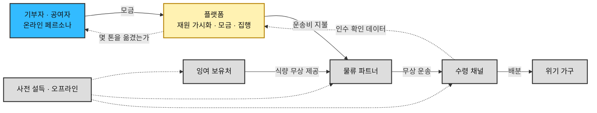
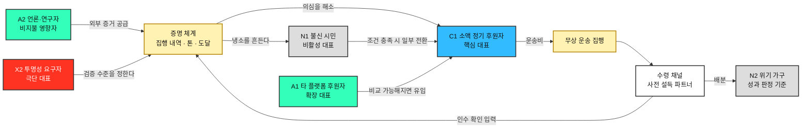

# 페르소나 스펙트럼 분석 ③ — 구호재원 모금 기반 식량 무상 운송 서비스

> [분석 방법론 §2](./분석-방법론.md) · 입력 [챕터 04 TAM-SAM-SOM 분석 ③](../04-tam-sam-som/분석-03-식량-재분배-플랫폼.md) · 리서치 원본 [①](../04-tam-sam-som/리서치-원본/01-글로벌-식량수급-불균형.md) · [②](../04-tam-sam-som/리서치-원본/02-아시아-식품유통손실-보고서.md)

> ⚙️ **진행 상태 — 워크플로우 ①~⑤단계 완료.**
> 방법론 §2의 5단계를 모두 수행했다. **①생성**(§3, 12종 원본) → **②평가**(§8, 4종 선별) → **③보정**(§9, 대표 카드) → **④검증**(§10) → **⑤통합**(§11, Spectrum Map).
>
> ⚠️ **두 가지를 못 채운 채 완료로 닫았다.** ④단계의 *'다중 AI 교차검증'* 은 단일 모델 추론으로 대체했고, **사용자 인터뷰는 전 단계에 걸쳐 한 건도 없다.** 근거 등급은 §7에 그대로 남겨둔다.
>
> 🔁 **재작성 이력.** 초판(커밋 `780d593`, 일반 페르소나 6종)과 2판(`c053f0c`, 스펙트럼 12종)은 **사업 모델 전제가 틀린 상태**에서 작성됐다. 그 전제와 정정 내용은 §0에 기록한다. 이 문서는 정정된 전제로 ①단계를 **다시 돌린** 결과다.

---

## 0. 정정 — 무엇이 틀렸고 실제 모델은 무엇인가

### 틀린 전제

초판·2판은 이 사업을 **양면 매칭 플랫폼**으로 놓고 페르소나를 뽑았다. 즉 잉여 보유처와 수령 채널이 **각자 온라인에 접속해 의향을 밝히고 거래를 성사시킨다**고 가정했다. 이 가정 위에서 창고 담당·배차 담당·집하장 운영자가 '핵심 사용자'로 올라갔다.

> ⚠️ 이 전제는 [챕터 04 §7](../04-tam-sam-som/분석-03-식량-재분배-플랫폼.md)이 *"재분배 매개와 시민 참여 중 어느 쪽이 주력인지 확정이 필요하다"* 며 남겨둔 갈림길에서 **확인 없이 한쪽을 고른 결과**다. 갈림길이 있다는 사실은 문서에 적혀 있었으나, 고르는 행위 자체가 검증되지 않았다.

### 실제 모델

| 층 | 실제 내용 |
|---|---|
| **온라인에서 하는 일** | ① 전 세계 **구호 재원 가용 현황**을 확인시킨다 ② **신규 구호자금 모금**을 받는다 |
| **오프라인에서 하는 일** | 여러 행위자를 **사전 설득**해 식량 제공·운송·통관·수령 조건을 미리 확보한다 |
| **실행** | 확보된 조건과 모금된 재원으로 **잉여 지역 → 부족 지역 무상 운송**을 집행한다 |
| **돈이 쓰이는 곳** | **식량이 아니라 운송이다.** 식량은 사전 설득으로 무상 확보하고, 모금액은 그것을 옮기는 비용에 투입한다 |

### 이 정정이 바꾸는 것

| 항목 | 틀린 전제 | 실제 |
|---|---|---|
| **고객이 누구인가** | 잉여 보유처 + 수령 채널 (양면) | **돈을 내는 사람** (기부자·공여자) — 단면 |
| **무엇을 파는가** | 매칭과 물류 조정 | **"당신의 돈이 몇 톤을 옮겼는가"라는 증명** |
| **행위자를 어떻게 움직이는가** | 각자 접속해 등록 | **우리가 찾아가 미리 설득** — 화면이 아니라 계약 |
| **화면이 필요한 사람** | 12명 대부분 | 기부자·공여자, 그리고 **인수 확인을 입력하는 수령 채널** |
| **성과 단위** | 매칭 건수 | 모금액(원) → **운송 톤(t)** → 도달 인구(명) |

### 챕터 04는 폐기되지 않는다 — 다만 무엇의 지도인지가 바뀐다

| 챕터 04 산출물 | 정정 후의 지위 |
|---|---|
| TAM 500 Mt / SAM 2.5 Mt / SOM 25,000 t | **유효.** 여전히 우리가 옮겨야 할 물리적 규모다 |
| Q1~Q4 Market Segment Map | **유효하되 고객 지도가 아니다.** *"식량이 어디서 남고 어디서 모자라는가"* 의 지도이며, 그 안의 인물은 고객이 아니라 **설득 대상 파트너**다 |
| §7의 미결 질문 *"경제적 규모(원)"* | **답의 형태가 정해졌다** — 톤당 운송 단가 × 톤. 모금 목표는 여기서 역산된다 |

> 📌 **핵심은 이것이다. 우리 고객은 챕터 04의 사분면 어디에도 없다.** 사분면의 두 축(수급 상태 × 표적 우선순위)은 식량을 가진 쪽과 필요한 쪽만 본다. **돈을 내는 사람은 그 지도 밖에 있다.** 그래서 사분면에서 페르소나를 뽑는 방식 자체가 이 사업에서는 성립하지 않았다.

---

## 1. 이 단계의 규칙과 두 가지 편차

**①단계는 좁히는 단계가 아니라 넓히는 단계다.** 방법론이 요구하는 배분(핵심 5 · 확장 3 · 극단 2 · 비활성 2 = **12종**)을 그대로 채웠다. 현실성이 의심스러운 후보도 남겼다 — 걸러내는 일은 ②단계의 몫이다. 각 페르소나는 방법론이 지정한 **6개 항목**(이름 · 직무 · 문제 · 목표 · 감정 · 대체 솔루션)을 모두 채운다.

### 편차 ① — '이름'을 코드네임으로 대체했다

방법론 원문의 `이름` 항목은 **식별용 코드네임**(`C1 「오천 원이 몇 킬로냐」` 형태)으로 채웠다. 나이·성별·가족관계 같은 신상은 만들지 않았다. 지어낸 신상은 어떤 설계 판단도 바꾸지 못하면서 문서 전체를 사실처럼 읽히게 만든다. 괄호 안의 별칭은 그 사람의 **한 문장짜리 문제**에서 따왔다.

### 편차 ② — 비활성(Non-user)을 두 갈래로 나눴다

방법론 §2 자체가 비활성을 두 가지로 서술한다.

| 방법론의 서술 위치 | 정의 | 해당 인물 |
|---|---|---|
| 유형별 설명 — *"아직 사용하지 않거나 **회피**하는 집단 / 인식·가치·신뢰 결여"* | **회피형** — 알지만 거부한다 | **N1** 국제 구호 자체를 불신하는 시민 |
| 도출 핵심 질문 — *"이 제품/서비스를 **사용할 수 없는** 사람은 누구인가?"* | **비접근형** — 쓰고 싶어도 닿지 않는다 | **N2** IPC 3+ 위기 가구 |

N1은 설득의 문제이고 N2는 경로의 문제다. 비활성 2명 자리에 하나씩 배치했다.

### 스펙트럼에 넣지 않은 사람들

**사전 설득 대상(잉여 보유처·물류사·통관 당국·수령 채널)은 이 스펙트럼에 넣지 않았다.** 이들은 서비스의 사용자가 아니라 **공급 조건을 이루는 파트너**이며, 화면이 아니라 계약으로 움직인다. 별도 명부로 §4에 정리했다.

---

## 2. 스펙트럼 배치

```mermaid
graph LR
%% subgraph 안에 direction 을 넣지 말 것.
%% 내부 노드끼리 연결선이 없어 모두 같은 rank 이므로, 진행 방향의 직각으로 배치된다.
%% 부모의 LR 을 물려받아야 세로로 쌓이고, TB 를 주면 가로로 퍼진다.
    subgraph CORE["Core 핵심 5 — 돈을 내거나 재원을 확인하는 사람"]
        C1["C1 「오천 원이 몇 킬로냐」<br>개인 소액 정기 후원자<br>내 돈이 무엇이 됐는지 모른다"]
        C2["C2 「뉴스 보고 들어왔다」<br>일회성 충동 기부자<br>30초 안에 못 끝내면 이탈"]
        C3["C3 「이사회에 보고할 숫자」<br>기업 사회공헌·ESG 담당<br>성과가 사진 몇 장으로만 남는다"]
        C4["C4 「어디가 비어 있나」<br>공여기관·재단 프로그램 오피서<br>재원 사각지대가 안 보인다"]
        C5["C5 「우리 반이 한 트럭」<br>제3자 모금 캠페인 주최자<br>진척이 안 보이면 사람이 안 모인다"]
    end

    subgraph ADJ["Adjacent 확장 3 — 유사 문제 · 다른 맥락"]
        A1["A1 「이미 다른 데 후원 중」<br>타 기부 플랫폼 정기 후원자<br>후원처가 늘수록 비교가 안 된다"]
        A2["A2 「기사에 쓸 숫자」<br>언론·연구자·정책 담당<br>인용 가능한 최신 출처가 없다"]
        A3["A3 「톤당 얼마인가」<br>임팩트 투자·사회적 금융 담당<br>단위 경제가 없으면 검토 불가"]
    end

    subgraph EXT["Extreme 극단 2 — 제약 상황 · 실패 중심"]
        X1["X1 「결제까지 못 간다」<br>해외 거주·비카드 결제 기부 시도자<br>의사는 있는데 매번 실패한다"]
        X2["X2 「원 단위로 캐묻는다」<br>극단적 투명성 요구 기부자<br>집행 내역 없으면 중도 이탈"]
    end

    subgraph NON["Non-user 비활성 2 — 진입 장벽"]
        N1["N1 「어차피 중간에서 샌다」<br>국제 구호 불신 시민<br>회피형 — 알지만 내지 않는다"]
        N2["N2 「배급소에서 결과만 만난다」<br>IPC 3+ 위기 가구 구성원<br>비접근형 — 성과 판정의 기준"]
    end

    CORE --> ADJ
    CORE --> EXT
    ADJ --> NON

    classDef core fill:#33BBFF,stroke:#333,stroke-width:2px,color:#111;
    classDef adj fill:#33FFBB,stroke:#333,stroke-width:2px,color:#111;
    classDef ext fill:#FF3322,stroke:#333,stroke-width:2px,color:#fff;
    classDef non fill:#DDDDDD,stroke:#333,stroke-width:2px,color:#111;
    class C1,C2,C3,C4,C5 core;
    class A1,A2,A3 adj;
    class X1,X2 ext;
    class N1,N2 non;
```

> 이 그림은 **배치**만 보여준다. 페르소나 사이의 관계를 그린 **Spectrum Map은 §11**에 있다.

---

## 3. 페르소나 원본 12종

### 🔵 핵심(Core) 5종 — 주력 타깃 / 모금액·사용 빈도 중심

| 코드·이름 | 직무 | 문제 | 목표 | 감정 | 대체 솔루션 (현재 쓰는 것) |
|---|---|---|---|---|---|
| **C1** 「오천 원이 몇 킬로냐」 | 개인 소액 정기 후원자 (월 5천~2만 원 자동이체) | 이미 몇 곳에 후원 중인데 **내 돈이 무엇으로 바뀌었는지 모른다.** 돌아오는 것은 연말정산 영수증과 감성 사진뿐이고, 끊고 싶어도 죄책감 때문에 못 끊는다 | 내 후원금이 **몇 kg을 어디로 옮겼는지** 숫자로 확인하는 것 | 선의 + 만성적 의심. *"어차피 중간에서 얼마나 남기겠지"* | 기존 국제구호단체 정기후원 유지 · 크리에이터 후원 · 아무것도 안 함 |
| **C2** 「뉴스 보고 들어왔다」 | 일회성 충동 기부자 (기근·재난 보도, SNS 공유로 유입) | **지금 당장** 뭔가 하고 싶은데 회원가입·본인인증에서 막힌다. 며칠 지나면 관심이 식어 다시 오지 않는다 | 30초 안에 결제를 끝내고, 결과는 나중에 알림으로 받는 것 | 순간적 분노·연민. 지속되지 않는다는 것을 본인도 안다 | SNS 공유만 하고 종료 · 다른 긴급모금 배너 · 이탈 |
| **C3** 「이사회에 보고할 숫자」 | 기업 사회공헌·ESG 담당 (CSR 예산 집행, 매칭그랜트 운영) | 예산은 있는데 **성과가 사진 몇 장으로만 남는다.** 임직원 참여 캠페인을 매년 새로 기획해야 하고, 기부 결과를 정량 지표로 쓸 수 없다 | 기업명으로 **분기당 "O톤 운송"** 실적 확보. 임직원이 직접 참여할 수 있는 형태 | 실적 압박 + 소재 고갈 | 기존 단체 지정기부 · 봉사활동 이벤트 · 물품 기부 |
| **C4** 「어디가 비어 있나」 | 정부 ODA·국제기구·민간재단의 자금 배분 담당 프로그램 오피서 | **전 세계 구호 재원이 어디에 얼마나 남아 있는지 한눈에 안 보인다.** 기관마다 포맷이 다른 appeal 문서를 뒤져야 하고, 중복 지원과 사각지대가 동시에 발생한다 | 재원 가용액과 부족분을 지역·시점별로 비교해 **비어 있는 칸**에 넣는 것. 사후 성과 보고가 가능할 것 | 신중. 잘못된 배분은 감사와 평판으로 돌아온다 | OCHA FTS·기관별 appeal 수기 취합 · 기존 파트너 반복 지원 |
| **C5** 「우리 반이 한 트럭」 | 제3자 모금 캠페인 주최자 (학교·종교단체·동호회·크리에이터) | 모금을 열어도 **목표와 진척이 안 보이면 사람이 모이지 않는다.** 정산 투명성을 주최자 개인이 증명해야 하는 부담 | 우리 이름으로 된 모금함 + 실시간 진척 + **"우리가 옮긴 톤수"** 결과물 | 열의 + 뒤처리에 대한 부담 | 기존 모금 플랫폼(해피빈·같이가치 등) · 계좌 모금 후 수기 정산 |

> 📌 **핵심 5인의 결제 단위와 주기가 전부 다르다.** C2는 **1회·수천 원**, C1은 **월·수천 원**, C5는 **캠페인 단위·수십만 원**, C3는 **분기·수천만 원**, C4는 **연·수억 원**이다. 같은 '기부'라는 단어를 쓰지만 **의사결정 구조가 개인 충동에서 기관 심사까지 벌어져 있다.** ②단계 선별에서 이 축을 기준으로 쓴다.

### 🟢 확장(Adjacent) 3종 — 유사 문제 / 다른 맥락

| 코드·이름 | 직무 | 문제 | 목표 | 감정 | 대체 솔루션 (현재 쓰는 것) |
|---|---|---|---|---|---|
| **A1** 「이미 다른 데 후원 중」 | 타 기부 플랫폼·타 대의(아동·환경·의료)의 정기 후원자 | 같은 행동을 이미 하고 있다. 후원처가 늘수록 관리가 안 되고 **성과를 서로 비교할 수 없어** 새 대의로 옮길 근거를 못 찾는다 | 같은 금액으로 더 명확한 결과. 후원처를 정리할 판단 근거 | 피로 + 비교 욕구 | 기존 후원 유지 · 연말에 한꺼번에 정리 |
| **A2** 「기사에 쓸 숫자」 | 언론·연구자·정책 담당 (데이터 인용자) | 식량 손실·기아·구호 재원 데이터가 기관별로 흩어져 있고 최신성이 떨어진다. **인용 가능한 단일 출처가 없다** | 출처가 명시된 재원·물량 데이터와 인용 가능한 시각화 | 회의적 검증 태도. 틀린 수치를 쓰면 본인이 다친다 | FAO·WFP 원문 · OCHA FTS · 직접 취합 |
| **A3** 「톤당 얼마인가」 | 임팩트 투자·사회적 금융 검토 담당 | 기부는 회계상 비용이라 검토 대상이 아니다. **톤당 운송 단가 같은 단위 경제가 없으면** 자금을 넣을 근거가 서지 않는다 | 톤당 단가와 그 개선 추이 — 즉 *"돈을 더 넣으면 효율이 오르는가"* | 냉정한 실사 태도 | 기존 임팩트 펀드 · 검토 보류 |

> 📌 **A2는 돈을 내지 않지만 신뢰를 만든다.** C1·N1의 의심(*"어차피 중간에서 샌다"*)을 푸는 외부 증거는 우리 페이지가 아니라 A2가 쓴 기사에서 나온다. **모금 전환율을 올리는 지렛대가 비지불 페르소나에 있다**는 뜻이다.

### 🔴 극단(Extreme) 2종 — 제약 상황 / 실패 중심

| 코드·이름 | 직무 | 문제 | 목표 | 감정 | 대체 솔루션 (현재 쓰는 것) |
|---|---|---|---|---|---|
| **X1** 「결제까지 못 간다」 | 해외 거주 디아스포라·비카드 결제 이용자·저대역 접속자 | **의사는 있는데 매번 실패한다.** 해외 발행 카드 거절, 현지 결제수단 미지원, 본인인증 실패, 저대역에서 결제 페이지 미로딩. 세금 영수증이 거주국에서 인정되지 않는다 | 실패 없이 끝까지 가는 결제 경로 | 좌절 + 배제감. *"내 돈은 안 받겠다는 건가"* | 국내 지인 계좌로 송금 부탁 · 포기 |
| **X2** 「원 단위로 캐묻는다」 | 극단적 투명성 요구 기부자 (회계·감사 배경, 기부금 유용 뉴스를 기억함) | 총액·수수료율·집행 내역·제3자 검증이 없으면 내지 않는다. 대부분의 모금 페이지가 이 요구를 채우지 못해 **결제 직전에 이탈**한다 | 원 단위 집행 내역과 외부 감사 결과 | 적대적 검증. 다만 **조건이 채워지면 가장 크게, 가장 오래 낸다** | 기부 보류 · 현지 단체에 직접 송금 · 소액만 테스트 후 관망 |

> 📌 **X2는 N1과 종이 한 장 차이다.** 같은 불신에서 출발하지만 X2는 조건이 충족되면 지불하고 N1은 하지 않는다. **X2 기준으로 투명성을 설계하면 N1의 일부가 넘어온다** — 극단 사용자가 비활성 시장을 여는 열쇠가 되는 구조다.

### ⬜ 비활성(Non-user) 2종 — 진입 장벽 / 거부 요인

| 코드·이름 | 직무 | 문제 | 목표 | 감정 | 대체 솔루션 (현재 쓰는 것) |
|---|---|---|---|---|---|
| **N1** 「어차피 중간에서 샌다」 *(회피형)* | 국제 구호 자체를 불신하거나 우선순위를 두지 않는 시민 | 기부금 유용 보도의 기억, *"먼 나라보다 우리 사정이 먼저"* 라는 우선순위, 그리고 **한 번 내면 계속 요구받는다**는 경험. 페이지에 오더라도 지갑을 열지 않는다 | 없음 — **안 내는 것이 합리적 선택**이라고 판단하고 있다 | 확신에 찬 냉소 | 국내 기부·지역 기부 · 아무것도 안 함 |
| **N2** 「배급소에서 결과만 만난다」 *(비접근형)* | IPC 3+ 판정 지역의 위기 가구 구성원 | 하루 **400~600 kcal** 결핍. 다음 배급의 시점·양을 몰라 미리 식사를 줄인다. 스마트폰·전기·통신·문해·언어가 모두 제약이며 **이 서비스의 존재를 모른다** | 다음 배급이 **언제 얼마나** 나오는지 아는 것 | 불확실성에 대한 만성 불안. 외부 약속에 대한 기대가 낮음 | 지역 공동체 나눔 · 부채·자산 처분 · 결식 · 이주 |

> 📌 **N2는 마케팅 대상이 아니라 성과 판정의 기준이다.** 이 사람에게 닿는 유일한 경로는 수령 채널을 통해서이며, **SOM 25,000 t은 이 사람 기준으로만 참이 된다.** 그리고 N2에게 도달했다는 증거가 곧 C1~C5에게 파는 상품이다 — **수혜자와 고객이 완전히 분리된 구조**이므로, 둘을 잇는 증명 체계가 이 사업의 제품 그 자체다.

---

## 4. 사전 설득 대상 명부 — 스펙트럼 밖

아래 행위자들은 **페이지에 접속하지 않는다.** 우리가 찾아가 미리 설득한다. 따라서 화면 설계 대상이 아니라 **계약·조건 설계 대상**이다.

| 행위자 | 무엇을 설득하는가 | 설득이 실패하면 | 챕터 04 |
|---|---|---|---|
| 대형 유통 물류센터 재고 처분 담당 | 폐기 대신 **무상 제공**, 하루 안 픽업 수용 | 물량 자체가 없다 | Q1 |
| 식품 제조사 공장 재고·품질 담당 | 팔레트 단위 무상 제공, 브랜드 비노출 조건 | 대량 물량 확보 실패 | Q1 |
| 유통·제조사 법무·리스크 담당 | 기부자 **면책**, 재판매 방지 조건 | 위 둘이 승인받지 못한다 | — |
| 3PL·선사 배차 담당 | 공차 구간 **무상·할인 운송** | 모금액 대비 운송량이 급락한다 | — |
| 통관·검역 당국 | 관세·검역 면제, 신속 통관 | 항구에서 부패한다 (리서치 ②) | — |
| 수령 채널 (WFP·국제 NGO·지자체) | 인수·배분 수행, **인수 확인 데이터 입력** | 증명이 성립하지 않아 모금이 멈춘다 | Q4·Q2 |
| 산지 집하장·농협 운영자 | 규격 외 물량 제공 (2차 확장) | 물량 확대가 막힌다 | Q3 |

> 📌 **명부에 딱 하나 온라인 접점이 있다 — 수령 채널의 '인수 확인'이다.** 이 한 번의 입력이 없으면 C1의 *"내 오천 원이 몇 kg"* 도, C3의 *"분기 O톤"* 도, X2의 집행 내역도 전부 성립하지 않는다. **설득 대상 중 유일하게 화면을 설계해야 하는 상대**이며, 동시에 가장 바쁘고 인터넷이 가장 불안정한 상대다.

---

## 5. 이전 판본과의 정정 매핑

| 2판 (틀린 전제) | 정정 후 | 사유 |
|---|---|---|
| C1 유통 DC 재고 처분 담당 | **§4 설득 대상**으로 이동 | 접속하지 않는다. 우리가 찾아간다 |
| C2 제조사 공장 재고·품질 담당 | **§4 설득 대상**으로 이동 | 위와 같음 |
| C3 본사 ESG 담당 (공급 측) | **C3 기업 사회공헌·ESG 담당(기부 측)** 으로 성격 변경 | 물량을 내주는 사람이 아니라 **돈을 내는 사람**으로 다시 정의 |
| C4 국가사무소 물류 오피서 | **§4 설득 대상** + 인수 확인 접점 | 수령 채널은 고객이 아니라 파트너 |
| C5 3PL 배차 담당 | **§4 설득 대상**으로 이동 | 사전 설득으로 확보하는 조건 |
| A1 도시 푸드뱅크 운영자 | **삭제** | 재분배 매개 모델에서만 성립하던 확장 시장 |
| A2 지자체 복지·조달 담당 | **§4 설득 대상**(수령 채널)으로 이동 | 위와 같음 |
| A3 단체급식·가공 구매 담당 | **삭제** | 규격 외 농산물을 사가는 수요 — 모금 모델과 무관 |
| X1 산지 집하장 운영자 | **§4 설득 대상**(2차)으로 이동 | 접속하지 않는다 |
| X2 분쟁지역 배분 담당 | **§4 설득 대상**으로 이동 | 인수 확인 접점의 극단 사례로만 남는다 |
| N1 법무·리스크 담당 | **§4 설득 대상**으로 이동 | 차단자이되 우리 사용자는 아니다 |
| N2 IPC 3+ 위기 가구 | **N2 유지** | 유일하게 그대로 살아남은 페르소나 |

> 📌 **12종 중 11종이 자리를 옮기거나 사라졌다.** 전제 하나가 바뀌면 페르소나 전체가 바뀐다는 것이 이 정정의 실증이다. 살아남은 하나가 **수혜자(N2)** 라는 점도 시사적이다 — 사업 모델이 어떻게 바뀌든 *"누가 굶고 있는가"* 는 변하지 않기 때문이다.

---

## 6. ①단계에서 이미 보이는 것

1. **경쟁자가 완전히 바뀌었다.** 이전 판본에서는 *'폐기 버튼'* 이 경쟁자였다. 지금은 **기존 국제구호단체의 정기후원과 다른 모금 플랫폼**이다. 싸우는 상대가 '무관심'에서 '이미 다른 곳에 내고 있음'으로 옮겨갔다.
2. **12명 중 7명(C1·C2·X2·N1·A1 그리고 C3·C4의 일부)이 같은 한 가지를 요구한다 — 증명.** 대체 솔루션 칸을 세로로 읽으면 이탈 사유가 대부분 *"결과를 못 봐서"* 다. **제품의 중심은 모금 폼이 아니라 증명 체계다.**
3. **증명의 원천은 우리 손에 없다.** 인수 확인 데이터는 §4의 수령 채널에서 나온다. **고객에게 팔 상품을 파트너가 쥐고 있는 구조**이며, 이것이 이 사업의 가장 큰 구조적 취약점이다.
4. **결제 단위가 5천 원에서 수억 원까지 벌어져 있다.** 하나의 페이지로 C2(30초 충동 결제)와 C4(기관 심사)를 동시에 만족시킬 수 없다. **③보정 단계에서 화면을 나눌지 판단해야 한다.**

---

## 7. 근거 등급

| 구성 요소 | 등급 | 비고 |
|---|---|---|
| 사업 모델 정의 (모금 → 무상 운송) | **(확인)** | 사업 주체가 직접 진술 |
| 인용된 손실률·인구·칼로리 수치 | **(확인)** | 리서치 ①② 직접 인용 |
| 구호 재원 정보가 분산되어 있다는 문제(C4) | **(추정)** | OCHA FTS 등 기존 체계에서 추론. **실물 확인 필요** |
| 직무의 존재와 역할 분담 | **(추정)** | 업계 일반 구조에서 추론 |
| **12종의 문제·목표·감정·대체 솔루션 전체** | **(가정)** | **인터뷰 없음. 전량 생성물이다** |
| 사전 설득이 실제로 성립한다는 전제 | **(가정)** | **이 사업의 최대 미검증 가정.** 무상 제공·무상 운송에 동의할 파트너가 실재하는지가 모든 것의 선행 조건 |

> ⚠️ **가장 먼저 검증해야 할 것은 페르소나가 아니라 §4다.** 기부자 페르소나가 아무리 정확해도, 식량과 운송을 무상으로 내줄 파트너가 없으면 모금할 것 자체가 없다. **④단계 검증에서 §4를 페르소나보다 앞세운다.**

---

## 8. ②단계 — 2차 평가와 4종 선별

### 평가 기준

방법론이 지정한 **문제·행동·맥락의 현실성**을 세 축으로 풀어 3점 척도(●●● / ●●○ / ●○○)로 매겼다.

| 축 | 묻는 것 |
|---|---|
| **문제 현실성** | 이 문제가 실제로 존재하는가, 아니면 우리가 만들고 싶은 문제인가 |
| **행동 관찰성** | 이 사람의 행동이 로그·통계로 관찰되는가 |
| **맥락 구체성** | 언제·어디서·무엇으로 접속하는지가 특정되는가 |

### 채점

| 코드 | 문제 | 행동 | 맥락 | 판정 |
|---|:---:|:---:|:---:|---|
| C1 소액 정기 후원자 | ●●● | ●●● | ●●● | ✅ **핵심 대표** |
| C2 일회성 충동 기부자 | ●●● | ●●● | ●●○ | 유보 — C1과 전환 경로가 겹친다 |
| C3 기업 사회공헌 담당 | ●●● | ●●○ | ●●● | 유보 — 실재하나 초기 진입 난도 높음 |
| C4 공여기관 프로그램 오피서 | ●●○ | ●○○ | ●●○ | **차점** (아래 📌 참조) |
| C5 제3자 모금 주최자 | ●●○ | ●●● | ●●○ | 유보 — 플랫폼 성숙 후 성립 |
| A1 타 플랫폼 정기 후원자 | ●●● | ●●● | ●●○ | ✅ **확장 대표** |
| A2 언론·연구자 | ●●● | ●○○ | ●●○ | 유보 — 시장이 아니라 영향자 |
| A3 임팩트 투자 담당 | ●●○ | ●○○ | ●○○ | 탈락 — 단계 불일치 |
| X1 결제 실패자 | ●●● | ●●● | ●●○ | 유보 — 일반적 접근성 과제 |
| X2 투명성 요구자 | ●●○ | ●●● | ●●● | ✅ **극단 대표** |
| N1 불신 시민 | ●●● | ●○○ | ●○○ | ✅ **비활성 대표** |
| N2 위기 가구 | ●●● | ●○○ | ●●● | 별도 지위 — 성과 판정 기준 |

### 선별 결과 — 대표 4종

**C1 · A1 · X2 · N1**

> 📌 **C4를 대표에서 뺀 것은 위험을 안고 내린 결정이다.** C4는 *"전 세계 구호 재원 가용 현황 확인"* 이라는 **두 기능 중 하나를 통째로 소비하는 유일한 페르소나**다. 유형별 1명이라는 형식 때문에 밀려났을 뿐 중요도가 낮아서가 아니다. **재원 대시보드를 주력 화면으로 가져간다면 C4를 두 번째 핵심으로 승격해야 하며, 그때는 대표가 5종이 된다.**

> 📌 **선별된 4명이 전부 같은 축 위에 있다.** C1은 의심하고, A1은 비교하지 못해 못 옮기고, X2는 검증을 요구하고, N1은 냉소한다. **네 명의 문제가 모두 '신뢰'라는 한 단어로 수렴한다.** ①단계 §6-2에서 관찰한 *"제품의 중심은 모금 폼이 아니라 증명 체계"* 가 선별을 통해 재확인됐다.

---

## 9. ③단계 — 3차 보정: 대표 4종 페르소나 카드

①단계의 6항목에 **첫 접점 · 전환 조건 · 이탈 조건**을 더해 실제 화면 설계에 쓸 수 있는 형태로 재기술했다.

### 🔵 Core — C1 「오천 원이 몇 킬로냐」

| 항목 | 내용 |
|---|---|
| **직무·상태** | 개인 소액 정기 후원자. 월 5천~2만 원을 자동이체 중이며 후원처는 1~3곳 |
| **문제** | 내 돈이 무엇으로 바뀌었는지 모른다. 돌아오는 것은 연말정산 영수증과 감성 사진뿐 |
| **목표** | 내 후원금이 **몇 kg을 어디로 옮겼는지** 숫자로 확인 |
| **감정** | 선의 + 만성적 의심 |
| **대체 솔루션** | 기존 단체 정기후원 유지 · 크리에이터 후원 · 아무것도 안 함 |
| **첫 접점** | SNS·뉴스에서 *"버려지는 식량이 부족량의 60배"* 라는 대조 수치를 보고 유입 |
| **전환 조건** | 결제 전에 **"5,000원 = 약 O kg 운송"** 환산이 먼저 보일 것. 결제 후 첫 인수 확인 알림이 **한 달 안에** 올 것 |
| **이탈 조건** | 두 달 연속 결과 알림 없음 · 환산이 추정치임이 뒤늦게 드러남 |

### 🟢 Adjacent — A1 「이미 다른 데 후원 중」

| 항목 | 내용 |
|---|---|
| **직무·상태** | 타 대의(아동·환경·의료)에 이미 정기 후원 중. 우리의 **확장 풀**이자 C1의 공급원 |
| **문제** | 후원처가 늘수록 관리가 안 되고 **성과를 서로 비교할 수 없어** 옮길 근거를 못 찾는다 |
| **목표** | 같은 금액으로 더 명확한 결과. 후원처를 정리할 판단 근거 |
| **감정** | 피로 + 비교 욕구 |
| **대체 솔루션** | 기존 후원 유지 · 연말에 한꺼번에 정리 |
| **첫 접점** | 연말정산 시즌 또는 후원 갱신 시점의 재검토 |
| **전환 조건** | **비교 가능한 단위**(원 → kg → 명)가 제시될 것. 기존 후원을 끊지 않고 **소액 병행**으로 시작할 수 있을 것 |
| **이탈 조건** | 갈아타기를 요구받는다고 느끼는 순간 · 단위가 모호해 비교가 안 될 때 |

### 🔴 Extreme — X2 「원 단위로 캐묻는다」

| 항목 | 내용 |
|---|---|
| **직무·상태** | 회계·감사 배경. 기부금 유용 보도를 기억한다. **조건이 채워지면 가장 크게 가장 오래 낸다** |
| **문제** | 총액·수수료율·집행 내역·제3자 검증이 없으면 결제 직전에 이탈한다 |
| **목표** | 원 단위 집행 내역과 외부 감사 결과 |
| **감정** | 적대적 검증 |
| **대체 솔루션** | 기부 보류 · 현지 단체 직접 송금 · 소액 테스트 후 관망 |
| **첫 접점** | 결제 페이지가 아니라 **재원·집행 내역 페이지**로 먼저 들어온다 |
| **전환 조건** | 운영비 비율 공개 · 건별 집행 내역 · **인수 확인의 출처(누가 언제 입력했는가)** 표시 |
| **이탈 조건** | 합계만 있고 내역이 없을 때 · 인수 확인의 출처가 우리 자신일 때 |

> 📌 **X2가 요구하는 수준으로 만들면 C1·A1·N1이 함께 해결된다.** 극단 사용자를 기준으로 설계했을 때 나머지가 따라오는 전형적인 구조이며, 이것이 X2를 극단 대표로 고른 이유다.

### ⬜ Non-user — N1 「어차피 중간에서 샌다」

| 항목 | 내용 |
|---|---|
| **직무·상태** | 국제 구호를 불신하거나 우선순위를 두지 않는 시민. **인구의 다수** |
| **문제** | 유용 보도의 기억 · *"먼 나라보다 우리 사정이 먼저"* · 한 번 내면 계속 요구받는다는 경험 |
| **목표** | 없음. **안 내는 것이 합리적**이라고 판단하고 있다 |
| **감정** | 확신에 찬 냉소 |
| **대체 솔루션** | 국내·지역 기부 · 아무것도 안 함 |
| **첫 접점** | 자발적 방문이 아니다. **A2(언론·연구자)의 보도**나 지인의 공유를 통해서만 노출된다 |
| **전환 조건** | 우리가 하는 말이 아니라 **제3자가 검증한 숫자**. 그리고 **일회성·소액으로 끊고 나갈 수 있다는 보장** |
| **이탈 조건** | 정기 전환을 압박하는 순간 · 감성 소구만 있고 숫자가 없을 때 |

> 📌 **N1은 마케팅 물량으로 뚫리지 않는다.** 유일한 경로가 A2를 통한 외부 증거이므로, **비지불 페르소나(A2)에 대한 투자가 곧 비활성 시장(N1) 개척 예산**이 된다.

---

## 10. ④단계 — 4차 검증: 실재 확률과 근거

> ⚠️ **방법론이 요구한 '다중 AI 교차검증'은 수행하지 못했다.** 아래는 단일 모델의 추론이며, 리서치 원문과 일반 시장 구조에 근거한 판단이다. **인터뷰·설문으로 대체되지 않는다.**

| 페르소나 | 실재 확률 | 근거 | 이 판단이 틀렸다면 보이는 신호 | 확인 방법 |
|---|---|---|---|---|
| **C1** 소액 정기 후원자 | **높음** | 정기후원 시장 자체가 대규모로 실재한다. 다만 *"우리에게 온다"* 는 것은 별개의 명제다 | 기존 후원자가 성과 데이터를 실제로는 열어보지 않는다 | 정기후원자 10~15인 인터뷰 — **후원처 변경 경험과 그 사유** |
| **A1** 타 플랫폼 후원자 | **존재 높음 / 전환 낮음~중간** | 존재는 확실하나, 후원처 교체가 실제로 얼마나 일어나는지가 불확실 | 기부 시장의 연간 교체율이 극히 낮게 나온다 | 기부 시장 이탈·교체율 통계 확인 |
| **X2** 투명성 요구자 | **중간** | 검증 요구 집단이 형성된 것은 관찰되나, *"원 단위"* 라는 강도는 과장일 수 있다 | 대부분이 요약 수준에서 만족하고 상세 내역을 열지 않는다 | 투명성 정보량을 달리한 A/B — **상세 내역 열람률** |
| **N1** 불신 시민 | **높음** | 기부 참여율이 인구의 일부에 그친다는 사실 자체가 비활성 다수의 존재를 증명한다 | 미참여의 주된 사유가 불신이 아니라 **단순 무관심**으로 나온다 | 미기부자 설문 — **거부 사유 분류** |

### 검증 우선순위 — 페르소나보다 먼저 확인할 것

| 순위 | 대상 | 이유 |
|---|---|---|
| **1** | **§4 사전 설득 대상의 실재성** | 무상으로 식량과 운송을 내줄 파트너가 없으면 **모금할 대상 자체가 없다.** 이 사업의 최대 미검증 가정 |
| **2** | **수령 채널의 인수 확인 입력 의사** | 증명 체계의 원천 데이터. 없으면 C1·X2 전원이 이탈한다 |
| **3** | C4가 겪는 재원 정보 공백의 실제 크기 | 두 기능 중 하나의 존재 이유 |
| **4** | 위 표의 페르소나 4종 | 위 셋이 무너지면 검증할 의미가 없다 |

---

## 11. ⑤단계 — Persona Spectrum Map

### 이 맵이 말하는 것

1. **중앙에 있는 것은 모금 폼이 아니라 증명 체계다.** 화살표가 가장 많이 드나드는 노드가 `증명 체계`이며, 네 대표 페르소나가 모두 이 노드를 경유해 연결된다.
2. **증명 체계의 입력은 우리 손 밖에 있다.** 유일한 원천이 `수령 채널`의 인수 확인이다. **고객에게 파는 상품을 파트너가 만들어 준다.**
3. **비지불 페르소나 둘(A2·X2)이 지불 페르소나를 만든다.** A2는 외부 증거를, X2는 검증 기준을 공급한다. 둘 다 돈을 내지 않지만 빼면 C1이 성립하지 않는다.
4. **N2만 루프 밖에 있다.** 받기만 하고 아무것도 되돌려 보내지 않는다. 그래서 **성과 판정의 기준은 될 수 있어도 성장 동력은 되지 못한다** — 이 구조가 구호 사업이 지속적으로 모금 압박을 받는 이유다.

---

## 12. 남은 질문과 다음 챕터

| 답한 것 | 답하지 못한 것 |
|---|---|
| 온라인에 오는 사람이 누구인가 | **그들이 얼마를 내는가** — 객단가·전환율·재방문 주기 |
| 무엇을 팔아야 하는가 (증명) | **증명을 어떻게 조달하는가** — 수령 채널의 입력 유인 |
| 어느 페르소나가 어느 페르소나를 여는가 | **순서와 비용** — A2를 먼저 잡을 것인가 C1을 먼저 모을 것인가 |
| 무상 제공·무상 운송이 전제라는 것 | **그 전제가 성립하는가** — §10 검증 우선순위 1·2 |

**다음 작업은 고객 여정지도다.** 대상은 **C1과 X2** 두 명으로 좁힌다. C1은 가장 얕게 들어와 가장 빨리 나가고, X2는 가장 깊게 파고들어 가장 늦게 결제한다. **여정의 양 끝**이므로 이 둘을 그리면 사이가 채워진다.

이후 챕터 06(기회점수)에서 §8의 유보 페르소나(C2·C3·C4·C5)를 우선순위로 다시 세우고, 챕터 07(JTBD)에서 *"C1이 오천 원으로 고용하려는 진짜 일은 무엇인가"* 를 다룬다.
