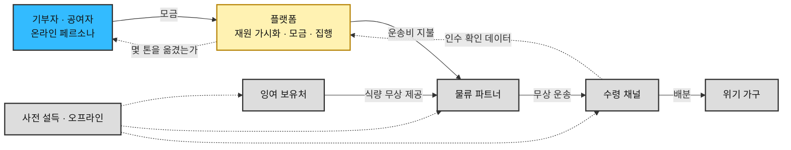
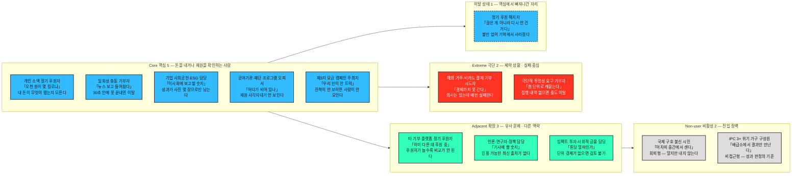
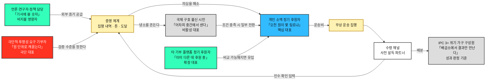

# 페르소나·고객 여정 분석 ③ — 구호재원 모금 기반 식량 무상 운송 서비스

> [분석 방법론](./분석-방법론.md) · 입력 [챕터 04 TAM-SAM-SOM](../04-tam-sam-som/분석-03-식량-재분배-플랫폼.md) · 리서치 원본 [①](../04-tam-sam-som/리서치-원본/01-글로벌-식량수급-불균형.md) · [②](../04-tam-sam-som/리서치-원본/02-아시아-식품유통손실-보고서.md) · 후속 [챕터 06 기회점수](../06-opportunity-score/분석-03-식량-재분배-플랫폼.md)

> 📕 **합본.** 방법론 §2(페르소나 스펙트럼)와 §3(고객 여정지도)의 산출물을 한 문서로 묶었다. 두 산출물은 **같은 인물 집합을 다른 각도에서 본 것**이라 나눠 두면 인물 명단이 어긋난다.
>
> | 부 | 내용 | 절 |
> |---|---|---|
> | **Ⅰ** | 페르소나 스펙트럼 — 누가 있는가 | §1~§9 |
> | **Ⅱ** | 고객 여정지도 — 그들이 어디서 멈추는가 | §1~§16 |
> | **Ⅲ** | 근거 등급과 남은 질문 | — |

> ⚠️ **이 문서의 인물과 여정은 전량 가설이다. 사용자 인터뷰가 한 건도 없다.** 근거 등급은 Ⅲ부 참조.

> 📝 **표기 규칙** — 인물은 **직무명을 앞에, 한 문장짜리 문제에서 딴 슬로건을 뒤에** 둔다(`개인 소액 정기 후원자 「오천 원이 몇 킬로냐」`). 나이·성별 같은 신상은 만들지 않았다. 지어낸 신상은 어떤 설계 판단도 바꾸지 못하면서 문서를 사실처럼 읽히게 만든다.

---

# Ⅰ부. 페르소나 스펙트럼

## 1. 사업 모델과 고객의 위치

| 층 | 내용 |
|---|---|
| **온라인에서 하는 일** | ① 전 세계 **구호 재원 가용 현황**을 확인시킨다 ② **신규 구호자금 모금**을 받는다 |
| **오프라인에서 하는 일** | 여러 행위자를 **사전 설득**해 식량 제공·운송·통관·수령 조건을 미리 확보한다 |
| **실행** | 확보된 조건과 모금된 재원으로 **잉여 지역 → 부족 지역 무상 운송**을 집행한다 |
| **돈이 쓰이는 곳** | **식량이 아니라 운송이다.** 식량은 사전 설득으로 무상 확보하고, 모금액은 그것을 옮기는 비용에 투입한다 |
| **파는 것** | **"당신의 돈이 몇 톤을 옮겼는가"라는 증명** |
| **성과 단위** | 모금액(원) → **운송 톤(t)** → 도달 인구(명) |

### 챕터 04와의 관계

> 챕터 04의 TAM·SAM·SOM과 Segment Map이 이 확정 모델에서 각각 어떤 지위를 갖는지는 **[챕터 04 §7 사후 기록](../04-tam-sam-som/분석-03-식량-재분배-플랫폼.md)에 정리했다.** 요지는 *"수치는 유효하되 사분면은 고객 지도가 아니라 물자 지도"* 다.

> 📌 **우리 고객은 챕터 04의 사분면 어디에도 없다.** 사분면의 두 축(수급 상태 × 표적 우선순위)은 식량을 가진 쪽과 필요한 쪽만 본다. **돈을 내는 사람은 그 지도 밖에 있다.** 사분면에서 고객을 뽑는 방식 자체가 이 사업에서는 성립하지 않는다.

---

---

## 2. 스펙트럼 배치

> 🔎 **13번째 인물은 챕터 07에서 발견됐다.** 「정기 후원 해지자」는 이 스펙트럼의 초판에 없었고, JTBD 인터뷰의 *"최근 사용을 중단한 사람"* 모집군을 채우려다 드러났다. **핵심 유형과 나란한 별개 인물이 아니라 핵심이 빠져나간 상태**이므로 점선 테두리로 표시했다.

> 이 그림은 **배치**만 보여준다. 인물 사이의 관계는 **§9 Spectrum Map**에 있다.

---

---

## 3. 페르소나 13종

### 🔵 핵심(Core) 5종 — 주력 타깃 / 모금액·사용 빈도 중심

| 인물 | 직무 | 문제 | 목표 | 감정 | 대체 솔루션 (현재 쓰는 것) |
|---|---|---|---|---|---|
| **개인 소액 정기 후원자** 「오천 원이 몇 킬로냐」 | 월 5천~2만 원 자동이체, 후원처 1~3곳 | 이미 몇 곳에 후원 중인데 **내 돈이 무엇으로 바뀌었는지 모른다.** 돌아오는 것은 연말정산 영수증과 감성 사진뿐이고, 끊고 싶어도 죄책감 때문에 못 끊는다 | 내 후원금이 **몇 kg을 어디로 옮겼는지** 숫자로 확인하는 것 | 선의 + 만성적 의심. *"어차피 중간에서 얼마나 남기겠지"* | 기존 국제구호단체 정기후원 유지 · 크리에이터 후원 · 아무것도 안 함 |
| **일회성 충동 기부자** 「뉴스 보고 들어왔다」 | 기근·재난 보도, SNS 공유로 유입 | **지금 당장** 뭔가 하고 싶은데 회원가입·본인인증에서 막힌다. 며칠 지나면 관심이 식어 다시 오지 않는다 | 30초 안에 결제를 끝내고, 결과는 나중에 알림으로 받는 것 | 순간적 분노·연민. 지속되지 않는다는 것을 본인도 안다 | SNS 공유만 하고 종료 · 다른 긴급모금 배너 · 이탈 |
| **기업 사회공헌·ESG 담당** 「이사회에 보고할 숫자」 | CSR 예산 집행, 매칭그랜트 운영 | 예산은 있는데 **성과가 사진 몇 장으로만 남는다.** 임직원 참여 캠페인을 매년 새로 기획해야 하고, 기부 결과를 정량 지표로 쓸 수 없다 | 기업명으로 **분기당 "O톤 운송"** 실적 확보. 임직원이 직접 참여할 수 있는 형태 | 실적 압박 + 소재 고갈 | 기존 단체 지정기부 · 봉사활동 이벤트 · 물품 기부 |
| **공여기관·재단 프로그램 오피서** 「어디가 비어 있나」 | 정부 ODA·국제기구·민간재단의 자금 배분 담당 | **전 세계 구호 재원이 어디에 얼마나 남아 있는지 한눈에 안 보인다.** 기관마다 포맷이 다른 appeal 문서를 뒤져야 하고, 중복 지원과 사각지대가 동시에 발생한다 | 재원 가용액과 부족분을 지역·시점별로 비교해 **비어 있는 칸**에 넣는 것. 사후 성과 보고가 가능할 것 | 신중. 잘못된 배분은 감사와 평판으로 돌아온다 | OCHA FTS·기관별 appeal 수기 취합 · 기존 파트너 반복 지원 |
| **제3자 모금 캠페인 주최자** 「우리 반이 한 트럭」 | 학교·종교단체·동호회·크리에이터 | 모금을 열어도 **목표와 진척이 안 보이면 사람이 모이지 않는다.** 정산 투명성을 주최자 개인이 증명해야 하는 부담 | 우리 이름으로 된 모금함 + 실시간 진척 + **"우리가 옮긴 톤수"** 결과물 | 열의 + 뒤처리에 대한 부담 | 기존 모금 플랫폼(해피빈·같이가치 등) · 계좌 모금 후 수기 정산 |

> 📌 **핵심 5인의 결제 단위와 주기가 전부 다르다.** 일회성 충동 기부자는 **1회·수천 원**, 개인 소액 정기 후원자는 **월·수천 원**, 제3자 모금 캠페인 주최자는 **캠페인 단위·수십만 원**, 기업 사회공헌 담당은 **분기·수천만 원**, 공여기관 프로그램 오피서는 **연·수억 원**이다. 같은 '기부'라는 단어를 쓰지만 **의사결정 구조가 개인 충동에서 기관 심사까지 벌어져 있다.**

### 🟢 확장(Adjacent) 3종 — 유사 문제 / 다른 맥락

| 인물 | 직무 | 문제 | 목표 | 감정 | 대체 솔루션 (현재 쓰는 것) |
|---|---|---|---|---|---|
| **타 기부 플랫폼 정기 후원자** 「이미 다른 데 후원 중」 | 아동·환경·의료 등 타 대의에 정기 후원 중 | 같은 행동을 이미 하고 있다. 후원처가 늘수록 관리가 안 되고 **성과를 서로 비교할 수 없어** 새 대의로 옮길 근거를 못 찾는다 | 같은 금액으로 더 명확한 결과. 후원처를 정리할 판단 근거 | 피로 + 비교 욕구 | 기존 후원 유지 · 연말에 한꺼번에 정리 |
| **언론·연구자·정책 담당** 「기사에 쓸 숫자」 | 데이터 인용자 | 식량 손실·기아·구호 재원 데이터가 기관별로 흩어져 있고 최신성이 떨어진다. **인용 가능한 단일 출처가 없다** | 출처가 명시된 재원·물량 데이터와 인용 가능한 시각화 | 회의적 검증 태도. 틀린 수치를 쓰면 본인이 다친다 | FAO·WFP 원문 · OCHA FTS · 직접 취합 |
| **임팩트 투자·사회적 금융 담당** 「톤당 얼마인가」 | 자금 집행 검토 담당 | 기부는 회계상 비용이라 검토 대상이 아니다. **톤당 운송 단가 같은 단위 경제가 없으면** 자금을 넣을 근거가 서지 않는다 | 톤당 단가와 그 개선 추이 — 즉 *"돈을 더 넣으면 효율이 오르는가"* | 냉정한 실사 태도 | 기존 임팩트 펀드 · 검토 보류 |

> 📌 **언론·연구자·정책 담당 「기사에 쓸 숫자」는 돈을 내지 않지만 신뢰를 만든다.** 개인 소액 정기 후원자와 국제 구호 불신 시민의 의심(*"어차피 중간에서 샌다"*)을 푸는 외부 증거는 우리 페이지가 아니라 이 사람이 쓴 기사에서 나온다. **모금 전환율을 올리는 지렛대가 비지불 페르소나에 있다.**

### 🔴 극단(Extreme) 2종 — 제약 상황 / 실패 중심

| 인물 | 직무 | 문제 | 목표 | 감정 | 대체 솔루션 (현재 쓰는 것) |
|---|---|---|---|---|---|
| **해외 거주·비카드 결제 기부 시도자** 「결제까지 못 간다」 | 디아스포라·저대역 접속자 | **의사는 있는데 매번 실패한다.** 해외 발행 카드 거절, 현지 결제수단 미지원, 본인인증 실패, 저대역에서 결제 페이지 미로딩. 세금 영수증이 거주국에서 인정되지 않는다 | 실패 없이 끝까지 가는 결제 경로 | 좌절 + 배제감. *"내 돈은 안 받겠다는 건가"* | 국내 지인 계좌로 송금 부탁 · 포기 |
| **극단적 투명성 요구 기부자** 「원 단위로 캐묻는다」 | 회계·감사 배경. 기부금 유용 뉴스를 기억함 | 총액·수수료율·집행 내역·제3자 검증이 없으면 내지 않는다. 대부분의 모금 페이지가 이 요구를 채우지 못해 **결제 직전에 이탈**한다 | 원 단위 집행 내역과 외부 감사 결과 | 적대적 검증. 다만 **조건이 채워지면 가장 크게, 가장 오래 낸다** | 기부 보류 · 현지 단체에 직접 송금 · 소액만 테스트 후 관망 |

> 📌 **극단적 투명성 요구 기부자와 국제 구호 불신 시민은 종이 한 장 차이다.** 같은 불신에서 출발하지만 앞은 조건이 충족되면 지불하고 뒤는 하지 않는다. **투명성 요구 기부자 기준으로 설계하면 불신 시민의 일부가 넘어온다** — 극단 사용자가 비활성 시장을 여는 열쇠가 되는 구조다.

### ⬜ 비활성(Non-user) 2종 — 진입 장벽 / 거부 요인

비활성은 성격이 정반대인 둘로 갈린다. **회피형**은 알지만 거부하고, **비접근형**은 쓰고 싶어도 닿지 않는다. 앞은 설득의 문제이고 뒤는 경로의 문제다.

| 인물 | 직무 | 문제 | 목표 | 감정 | 대체 솔루션 (현재 쓰는 것) |
|---|---|---|---|---|---|
| **국제 구호 불신 시민** 「어차피 중간에서 샌다」 *(회피형)* | 국제 구호를 불신하거나 우선순위를 두지 않는 시민 | 기부금 유용 보도의 기억, *"먼 나라보다 우리 사정이 먼저"* 라는 우선순위, 그리고 **한 번 내면 계속 요구받는다**는 경험. 페이지에 오더라도 지갑을 열지 않는다 | 없음 — **안 내는 것이 합리적 선택**이라고 판단하고 있다 | 확신에 찬 냉소 | 국내 기부·지역 기부 · 아무것도 안 함 |
| **IPC 3+ 위기 가구 구성원** 「배급소에서 결과만 만난다」 *(비접근형)* | 급성 식량위기 판정 지역의 수혜 대상 | 하루 **400~600 kcal** 결핍. 다음 배급의 시점·양을 몰라 미리 식사를 줄인다. 스마트폰·전기·통신·문해·언어가 모두 제약이며 **이 서비스의 존재를 모른다** | 다음 배급이 **언제 얼마나** 나오는지 아는 것 | 불확실성에 대한 만성 불안. 외부 약속에 대한 기대가 낮음 | 지역 공동체 나눔 · 부채·자산 처분 · 결식 · 이주 |

> 📌 **IPC 3+ 위기 가구 구성원은 마케팅 대상이 아니라 성과 판정의 기준이다.** 이 사람에게 닿는 유일한 경로는 수령 채널을 통해서이며, **SOM 25,000 t은 이 사람 기준으로만 참이 된다.** 그리고 이 사람에게 도달했다는 증거가 곧 핵심 5인에게 파는 상품이다 — **수혜자와 고객이 완전히 분리된 구조**이므로, 둘을 잇는 증명 체계가 이 사업의 제품 그 자체다.

---

### 🔵 이탈 상태 1종 — 핵심에서 빠져나간 자리 *(챕터 07 발견)*

| 인물 | 직무 | 문제 | 목표 | 감정 | 대체 솔루션 (현재 쓰는 것) |
|---|---|---|---|---|---|
| **정기 후원 해지자** 「끊은 게 아니라 다시 안 건 거다」 | 정기 후원 2곳을 5년 유지하다 카드 재발급을 계기로 전부 종료 | **끊겠다고 결심한 적이 없다.** 카드가 바뀌어 자동이체가 일괄 해제됐고, 재등록 목록을 추리는 동안 **이름을 봐도 무엇 하는 곳인지 떠오르지 않아** 다시 걸지 않았다 | 다시 시작하되, **6개월 뒤에도 무엇을 하는 곳인지 기억나는** 후원처를 고르는 것 | 불만 없음. 죄책감도 없음 — **끊는 행동 자체가 없었으므로 발동하지 않았다** | 없음. 후원하지 않는 상태이며 **재개 의사는 있으나 대상을 못 정했다** |

> 🚨 **이 인물이 이탈 모델을 뒤집는다.** 나머지 12종은 전부 *"불편하다"* 를 전제로 설계됐는데, 이 사람은 **끝까지 불편해하지 않았다.**
>
> | | 경로 |
> |---|---|
> | 초판의 가정 | `무소식 → 불만 → 해지` |
> | **실제** | **`무소식 → 무기억 → 재등록 목록에서 탈락`** |
>
> **불만은 발생하지 않는다. 기억이 사라진다.** 그래서 알림의 목적은 만족이 아니라 **기억**이고, 빈도·내용·타이밍 설계가 전부 달라진다. 근거는 [챕터 07 모의 세션 R8](../07-jtbd/분석-03-식량-재분배-플랫폼.md) — *"5년을 냈는데 제가 그 단체에 대해 아는 게 하나도 없어요."*

---

## 4. 사전 설득 대상 명부 — 스펙트럼 밖

아래 행위자들은 서비스의 사용자가 아니라 **공급 조건을 이루는 파트너**다. **페이지에 접속하지 않으며**, 우리가 찾아가 미리 설득한다. 따라서 화면 설계 대상이 아니라 **계약·조건 설계 대상**이다.

| 행위자 | 무엇을 설득하는가 | 설득이 실패하면 | 챕터 04 |
|---|---|---|---|
| 대형 유통 물류센터 재고 처분 담당 | 폐기 대신 **무상 제공**, 하루 안 픽업 수용 | 물량 자체가 없다 | Q1 |
| 식품 제조사 공장 재고·품질 담당 | 팔레트 단위 무상 제공, 브랜드 비노출 조건 | 대량 물량 확보 실패 | Q1 |
| 유통·제조사 법무·리스크 담당 | 기부자 **면책**, 재판매 방지 조건 | 위 둘이 승인받지 못한다 | — |
| 3PL·선사 배차 담당 | 공차 구간 **무상·할인 운송** | 모금액 대비 운송량이 급락한다 | — |
| 통관·검역 당국 | 관세·검역 면제, 신속 통관 | 항구에서 부패한다 (리서치 ②) | — |
| 수령 채널 (WFP·국제 NGO·지자체) | 인수·배분 수행, **인수 확인 데이터 입력** | 증명이 성립하지 않아 모금이 멈춘다 | Q4·Q2 |
| 산지 집하장·농협 운영자 | 규격 외 물량 제공 (2차 확장) | 물량 확대가 막힌다 | Q3 |

> 📌 **명부에 딱 하나 온라인 접점이 있다 — 수령 채널의 '인수 확인'이다.** 이 한 번의 입력이 없으면 개인 소액 정기 후원자의 *"내 오천 원이 몇 kg"* 도, 기업 사회공헌 담당의 *"분기 O톤"* 도, 투명성 요구 기부자의 집행 내역도 전부 성립하지 않는다. **설득 대상 중 유일하게 화면을 설계해야 하는 상대**이며, 동시에 가장 바쁘고 인터넷이 가장 불안정한 상대다.

---

---

## 5. 13종에서 읽히는 것

1. **경쟁자는 무관심이 아니라 '이미 다른 곳에 내고 있음'이다.** 대체 솔루션 칸에 가장 많이 등장하는 것이 기존 국제구호단체 정기후원과 다른 모금 플랫폼이다. 획득은 신규 창출이 아니라 **이동**의 문제다.
2. **13명 중 8명이 같은 한 가지를 요구한다 — 증명.** 개인 소액 정기 후원자 · 일회성 충동 기부자 · 극단적 투명성 요구 기부자 · 국제 구호 불신 시민 · 타 기부 플랫폼 정기 후원자, 그리고 기업 사회공헌 담당과 공여기관 프로그램 오피서의 일부가 여기 해당한다. 대체 솔루션 칸을 세로로 읽으면 이탈 사유가 대부분 *"결과를 못 봐서"* 다. **제품의 중심은 모금 폼이 아니라 증명 체계다.**
3. **증명의 원천은 우리 손에 없다.** 인수 확인 데이터는 §4의 수령 채널에서 나온다. **고객에게 팔 상품을 파트너가 쥐고 있는 구조**이며, 이것이 이 사업의 가장 큰 구조적 취약점이다.
4. **이탈은 불만이 아니라 무기억으로 일어난다.** 정기 후원 해지자는 끊겠다고 결심한 적이 없다. 나머지 12종의 Pain은 *"불편하다"* 를 전제하는데, **실제 이탈 경로에는 불편이 없었다.** 증명 체계가 풀어야 할 것이 하나 더 늘어난다 — **의심 해소뿐 아니라 기억 유지**다.
5. **결제 단위가 5천 원에서 수억 원까지 벌어져 있다.** 하나의 페이지로 일회성 충동 기부자(30초 충동 결제)와 공여기관 프로그램 오피서(기관 심사)를 동시에 만족시킬 수 없다. → 화면 분리 여부는 [고객 여정지도 §16-7](./분석-03-식량-재분배-플랫폼.md)에서 *"초기에는 나누지 않고 기관은 문서 패키지로 대응"* 으로 정리했다.

---

---

## 6. 대표 4종 선별

유형별로 **문제·행동·맥락의 현실성**이 가장 높은 한 명씩을 대표로 세웠다.

**개인 소액 정기 후원자 · 타 기부 플랫폼 정기 후원자 · 극단적 투명성 요구 기부자 · 국제 구호 불신 시민**

| 유형 | 인물 | 판정 |
|---|---|---|
| 🔵 핵심 | 개인 소액 정기 후원자 「오천 원이 몇 킬로냐」 | ✅ **대표** |
| | 일회성 충동 기부자 「뉴스 보고 들어왔다」 | 유보 — 소액 정기 후원자와 전환 경로가 겹친다 |
| | 기업 사회공헌·ESG 담당 「이사회에 보고할 숫자」 | 유보 — 실재하나 초기 진입 난도가 높다 |
| | 공여기관·재단 프로그램 오피서 「어디가 비어 있나」 | **차점** (아래 📌) |
| | 제3자 모금 캠페인 주최자 「우리 반이 한 트럭」 | 유보 — 플랫폼이 성숙한 뒤 성립한다 |
| 🟢 확장 | 타 기부 플랫폼 정기 후원자 「이미 다른 데 후원 중」 | ✅ **대표** |
| | 언론·연구자·정책 담당 「기사에 쓸 숫자」 | 유보 — 시장이 아니라 영향자 |
| | 임팩트 투자·사회적 금융 담당 「톤당 얼마인가」 | 탈락 — 자금 형식 불일치 |
| 🔴 극단 | 해외 거주·비카드 결제 기부 시도자 「결제까지 못 간다」 | 유보 — 일반적 접근성 과제 |
| | 극단적 투명성 요구 기부자 「원 단위로 캐묻는다」 | ✅ **대표** |
| ⬜ 비활성 | 국제 구호 불신 시민 「어차피 중간에서 샌다」 | ✅ **대표** |
| | IPC 3+ 위기 가구 구성원 「배급소에서 결과만 만난다」 | 별도 지위 — 성과 판정 기준 |
| 🔵 이탈 상태 | 정기 후원 해지자 「끊은 게 아니라 다시 안 건 거다」 | **차점** *(챕터 07 발견 — 아래 📌)* |

> 📌 **공여기관·재단 프로그램 오피서를 대표에서 뺀 것은 위험을 안고 내린 결정이었고, 후속 챕터가 이를 뒤집었다.** 이 사람은 *"전 세계 구호 재원 가용 현황 확인"* 이라는 **두 기능 중 하나를 통째로 소비하는 유일한 페르소나**다. 유형별 1명이라는 형식 때문에 밀려났을 뿐이다.
>
> ✅ **확정 — 승격됐다.** [챕터 06 DOS 분석](../06-opportunity-score/분석-03-식량-재분배-플랫폼.md)에서 이 인물은 **SAM 기준 인물 단위 1위(2.25)** 로 올라섰고, [챕터 07](../07-jtbd/분석-방법론.md) 인터뷰 대상 3순위에 편성됐으며, 기준본 Value Proposition은 재원 갭 대시보드(F6)를 **Phase 2 기능**으로 확정했다. **다만 1년차에는 열리지 않는 문이다** — SOM 기준으로는 7위로 내려앉고, 그 자물쇠가 P23(신생 기관은 심의에 낼 실적이 없다)이다.

> 📌 **정기 후원 해지자는 유형이 아니라 상태이므로 대표 목록의 형식에 맞지 않는다.** 유형별 1명이라는 규칙 밖에 있고, 대표로 세우면 「개인 소액 정기 후원자」와 같은 사람을 두 번 세게 된다. **그럼에도 차점으로 올린 이유는 이 인물만 이탈의 실제 경로를 보여주기 때문**이다 — 나머지 넷은 전부 *"들어오는 길"* 위에 있다.

> 📌 **선별된 4명이 전부 같은 축 위에 있다.** 개인 소액 정기 후원자는 의심하고, 타 기부 플랫폼 정기 후원자는 비교하지 못해 못 옮기고, 극단적 투명성 요구 기부자는 검증을 요구하고, 국제 구호 불신 시민은 냉소한다. **네 명의 문제가 모두 '신뢰'라는 한 단어로 수렴한다** — §5-2의 *"제품의 중심은 증명 체계"* 가 선별을 통해 재확인된다.

---

---

## 7. 대표 4종 페르소나 카드

**첫 접점 · 전환 조건 · 이탈 조건**을 더해 화면 설계에 바로 쓸 수 있는 형태로 정리했다.

### 🔵 핵심 — 개인 소액 정기 후원자 「오천 원이 몇 킬로냐」

| 항목 | 내용 |
|---|---|
| **직무·상태** | 월 5천~2만 원을 자동이체 중이며 후원처는 1~3곳 |
| **문제** | 내 돈이 무엇으로 바뀌었는지 모른다. 돌아오는 것은 연말정산 영수증과 감성 사진뿐 |
| **목표** | 내 후원금이 **몇 kg을 어디로 옮겼는지** 숫자로 확인 |
| **감정** | 선의 + 만성적 의심 |
| **대체 솔루션** | 기존 단체 정기후원 유지 · 크리에이터 후원 · 아무것도 안 함 |
| **첫 접점** | SNS·뉴스에서 *"버려지는 식량이 부족량의 60배"* 라는 대조 수치를 보고 유입 |
| **전환 조건** | 결제 전에 **"5,000원 = 약 O kg 운송"** 환산이 먼저 보일 것. 결제 후 첫 인수 확인 알림이 **한 달 안에** 올 것 |
| **이탈 조건** | 두 달 연속 결과 알림 없음 · 환산이 추정치임이 뒤늦게 드러남 |

### 🟢 확장 — 타 기부 플랫폼 정기 후원자 「이미 다른 데 후원 중」

| 항목 | 내용 |
|---|---|
| **직무·상태** | 아동·환경·의료 등 타 대의에 이미 정기 후원 중. 우리의 **확장 풀**이자 개인 소액 정기 후원자의 공급원 |
| **문제** | 후원처가 늘수록 관리가 안 되고 **성과를 서로 비교할 수 없어** 옮길 근거를 못 찾는다 |
| **목표** | 같은 금액으로 더 명확한 결과. 후원처를 정리할 판단 근거 |
| **감정** | 피로 + 비교 욕구 |
| **대체 솔루션** | 기존 후원 유지 · 연말에 한꺼번에 정리 |
| **첫 접점** | 연말정산 시즌 또는 후원 갱신 시점의 재검토 |
| **전환 조건** | **비교 가능한 단위**(원 → kg → 명)가 제시될 것. 기존 후원을 끊지 않고 **소액 병행**으로 시작할 수 있을 것 |
| **이탈 조건** | 갈아타기를 요구받는다고 느끼는 순간 · 단위가 모호해 비교가 안 될 때 |

### 🔴 극단 — 극단적 투명성 요구 기부자 「원 단위로 캐묻는다」

| 항목 | 내용 |
|---|---|
| **직무·상태** | 회계·감사 배경. 기부금 유용 보도를 기억한다. **조건이 채워지면 가장 크게 가장 오래 낸다** |
| **문제** | 총액·수수료율·집행 내역·제3자 검증이 없으면 결제 직전에 이탈한다 |
| **목표** | 원 단위 집행 내역과 외부 감사 결과 |
| **감정** | 적대적 검증 |
| **대체 솔루션** | 기부 보류 · 현지 단체 직접 송금 · 소액 테스트 후 관망 |
| **첫 접점** | 결제 페이지가 아니라 **재원·집행 내역 페이지**로 먼저 들어온다 |
| **전환 조건** | 운영비 비율 공개 · 건별 집행 내역 · **인수 확인의 출처(누가 언제 입력했는가)** 표시 |
| **이탈 조건** | 합계만 있고 내역이 없을 때 · 인수 확인의 출처가 우리 자신일 때 |

> 📌 **이 사람이 요구하는 수준으로 만들면 나머지 셋이 함께 해결된다.** 극단 사용자를 기준으로 설계했을 때 나머지가 따라오는 전형적인 구조이며, 이것이 극단 대표로 고른 이유다.

### ⬜ 비활성 — 국제 구호 불신 시민 「어차피 중간에서 샌다」

| 항목 | 내용 |
|---|---|
| **직무·상태** | 국제 구호를 불신하거나 우선순위를 두지 않는 시민. **인구의 다수** |
| **문제** | 유용 보도의 기억 · *"먼 나라보다 우리 사정이 먼저"* · 한 번 내면 계속 요구받는다는 경험 |
| **목표** | 없음. **안 내는 것이 합리적**이라고 판단하고 있다 |
| **감정** | 확신에 찬 냉소 |
| **대체 솔루션** | 국내·지역 기부 · 아무것도 안 함 |
| **첫 접점** | 자발적 방문이 아니다. **언론·연구자·정책 담당 「기사에 쓸 숫자」의 보도**나 지인의 공유를 통해서만 노출된다 |
| **전환 조건** | 우리가 하는 말이 아니라 **제3자가 검증한 숫자**. 그리고 **일회성·소액으로 끊고 나갈 수 있다는 보장** |
| **이탈 조건** | 정기 전환을 압박하는 순간 · 감성 소구만 있고 숫자가 없을 때 |

> 📌 **이 사람은 마케팅 물량으로 뚫리지 않는다.** 유일한 경로가 언론·연구자·정책 담당을 통한 외부 증거이므로, **비지불 페르소나에 대한 투자가 곧 비활성 시장 개척 예산**이 된다.

---

---

## 8. 실재 확률과 검증 계획

| 인물 | 실재 확률 | 근거 | 이 판단이 틀렸다면 보이는 신호 | 확인 방법 |
|---|---|---|---|---|
| **개인 소액 정기 후원자** 「오천 원이 몇 킬로냐」 | **높음** | 정기후원 시장 자체가 대규모로 실재한다. 다만 *"우리에게 온다"* 는 것은 별개의 명제다 | 기존 후원자가 성과 데이터를 실제로는 열어보지 않는다 | 정기후원자 10~15인 인터뷰 — **후원처 변경 경험과 그 사유** |
| **타 기부 플랫폼 정기 후원자** 「이미 다른 데 후원 중」 | **존재 높음 / 전환 낮음~중간** | 존재는 확실하나, 후원처 교체가 실제로 얼마나 일어나는지가 불확실 | 기부 시장의 연간 교체율이 극히 낮게 나온다 | 기부 시장 이탈·교체율 통계 확인 |
| **극단적 투명성 요구 기부자** 「원 단위로 캐묻는다」 | **중간** | 검증 요구 집단이 형성된 것은 관찰되나, *"원 단위"* 라는 강도는 과장일 수 있다 | 대부분이 요약 수준에서 만족하고 상세 내역을 열지 않는다 | 투명성 정보량을 달리한 A/B — **상세 내역 열람률** |
| **국제 구호 불신 시민** 「어차피 중간에서 샌다」 | **높음** | 기부 참여율이 인구의 일부에 그친다는 사실 자체가 비활성 다수의 존재를 증명한다 | 미참여의 주된 사유가 불신이 아니라 **단순 무관심**으로 나온다 | 미기부자 설문 — **거부 사유 분류** |

### 검증 우선순위 — 페르소나보다 먼저 확인할 것

| 순위 | 대상 | 이유 |
|---|---|---|
| **1** | **§4 사전 설득 대상의 실재성** | 무상으로 식량과 운송을 내줄 파트너가 없으면 **모금할 대상 자체가 없다.** 이 사업의 최대 미검증 가정 |
| **2** | **수령 채널의 인수 확인 입력 의사** | 증명 체계의 원천 데이터. 없으면 개인 소액 정기 후원자와 극단적 투명성 요구 기부자가 전원 이탈한다 |
| **3** | 공여기관 프로그램 오피서가 겪는 재원 정보 공백의 실제 크기 | 두 기능 중 하나의 존재 이유 |
| **4** | 위 표의 페르소나 4종 | 위 셋이 무너지면 검증할 의미가 없다 |

---

---

## 9. Persona Spectrum Map

### 이 맵이 말하는 것

1. **중앙에 있는 것은 모금 폼이 아니라 증명 체계다.** 화살표가 가장 많이 드나드는 노드가 `증명 체계`이며, 네 대표 페르소나가 모두 이 노드를 경유해 연결된다.
2. **증명 체계의 입력은 우리 손 밖에 있다.** 유일한 원천이 `수령 채널`의 인수 확인이다. **고객에게 파는 상품을 파트너가 만들어 준다.**
3. **비지불 페르소나 둘이 지불 페르소나를 만든다.** 언론·연구자·정책 담당은 외부 증거를, 극단적 투명성 요구 기부자는 검증 기준을 공급한다. 둘 다 돈을 내지 않지만 빼면 개인 소액 정기 후원자가 성립하지 않는다.
4. **IPC 3+ 위기 가구 구성원만 루프 밖에 있다.** 받기만 하고 아무것도 되돌려 보내지 않는다. 그래서 **성과 판정의 기준은 될 수 있어도 성장 동력은 되지 못한다** — 이 구조가 구호 사업이 지속적으로 모금 압박을 받는 이유다.

---

---

---

# Ⅱ부. 고객 여정지도

> 🗺️ **범위.** Ⅰ부에서 도출한 **13종 전원**의 여정을 개별로 그린다. 대표 4종만이 아니라 유보·탈락 인물까지 포함한다. 각 여정은 **서비스를 접하기 전부터 결제(또는 그에 해당하는 행위) 후까지**를 다룬다.

## 0. 등장 인물 13종

| # | 스펙트럼 유형 | 인물 | 여정 골격 | 이 사람의 '결제'에 해당하는 행위 |
|---|---|---|---|---|
| 1 | 🔵 핵심 | **개인 소액 정기 후원자** 「오천 원이 몇 킬로냐」 | A 개인 기부자형 | 정기 결제 등록 |
| 2 | 🔵 핵심 | **일회성 충동 기부자** 「뉴스 보고 들어왔다」 | A 개인 기부자형 | 1회 결제 |
| 3 | 🔵 핵심 | **기업 사회공헌·ESG 담당** 「이사회에 보고할 숫자」 | B 기관 심사형 | 품의 승인 후 계약 |
| 4 | 🔵 핵심 | **공여기관·재단 프로그램 오피서** 「어디가 비어 있나」 | B 기관 심사형 | 배분 결정 |
| 5 | 🔵 핵심 | **제3자 모금 캠페인 주최자** 「우리 반이 한 트럭」 | C 매개형 | 캠페인 개설 |
| 6 | 🟢 확장 | **타 기부 플랫폼 정기 후원자** 「이미 다른 데 후원 중」 | A 개인 기부자형 | 소액 병행 등록 |
| 7 | 🟢 확장 | **언론·연구자·정책 담당** 「기사에 쓸 숫자」 | C 매개형 | 기사·보고서 인용 |
| 8 | 🟢 확장 | **임팩트 투자·사회적 금융 담당** 「톤당 얼마인가」 | B 기관 심사형 | 투자 검토 결정 |
| 9 | 🔴 극단 | **해외 거주·비카드 결제 기부 시도자** 「결제까지 못 간다」 | A 개인 기부자형 | 결제 — **성공하지 못한다** |
| 10 | 🔴 극단 | **극단적 투명성 요구 기부자** 「원 단위로 캐묻는다」 | A 개인 기부자형 | 소액 테스트 후 본 결제 |
| 11 | ⬜ 비활성 | **국제 구호 불신 시민** 「어차피 중간에서 샌다」 | A 개인 기부자형 | **없음 — 여정이 중단된다** |
| 12 | ⬜ 비활성 | **IPC 3+ 위기 가구 구성원** 「배급소에서 결과만 만난다」 | D 수혜형 | **없음 — 지불도 화면도 없다** |
| 13 | 🔵 이탈 상태 | **정기 후원 해지자** 「끊은 게 아니라 다시 안 건 거다」 | A′ 이탈·재진입형 | **없음 — 재등록 목록에서 탈락한다** |

> 표기 규칙 — 본문에서는 **직무명을 앞에, 슬로건을 뒤에** 둔다(`개인 소액 정기 후원자 「오천 원이 몇 킬로냐」`). 표와 다이어그램에서 자리가 좁을 때는 **직무명만** 쓴다.

---

---

## 1. 단계를 새로 정의한 근거

방법론 §3의 경고는 일반형 5단계(`문제 인식 → 탐색 → 의사결정 → 사용 → 유지`)를 그대로 채우지 말고 **서비스의 실제 관문에서 단계를 도출하라**고 요구한다. 그 절의 네 질문에 먼저 답한다.

| # | 질문 | 이 서비스의 답 |
|---|---|---|
| **1** | 실제로 통과하는 관문은? | 일반형에 없는 관문이 셋 — **의심 검문**(내기 전 반드시 통과) · **환산**(원 → kg 변환이 있어야 금액을 정한다) · **공백**(결제 후 결과가 오기까지 아무 일도 없는 구간) |
| **2** | 가장 많이 이탈하는 곳은? | **의심 검문**과 **공백.** 전자는 결제 전 차단, 후자는 결제 후 소멸 |
| **3** | 결제 **이후에** 더 큰 관문이 있는가? | **있다.** 가구의 `조립·설치` 자리에 **공백 → 증명**이 있다. 기부는 결제 순간에 가치가 전달되지 않는다 |
| **4** | 페르소나마다 여정이 갈라지는가? | **13명이 하나의 단계 집합을 공유하지 않는다.** 네 개의 골격과 한 개의 변형으로 갈라진다 (아래) |

### 13명이 네 개의 여정 골격과 한 변형으로 갈라진다

방법론 §3이 가구와 자동차를 나란히 든 것과 같은 이유로, **이 서비스 안에서도 사람에 따라 단계 자체가 달라진다.** 억지로 한 골격에 밀어 넣으면 기관 담당자의 `내부 승인`과 수혜자의 `이동·대기`가 사라진다.

| 골격 | 해당 인물 | 결정적 차이 |
|---|---|---|
| **A. 개인 기부자형** (8단계) | 개인 소액 정기 후원자 · 일회성 충동 기부자 · 타 기부 플랫폼 정기 후원자 · 해외 거주·비카드 결제 기부 시도자 · 극단적 투명성 요구 기부자 · 국제 구호 불신 시민 | 혼자 결정하고 즉시 결제한다. **의심 검문과 공백**이 병목 |
| **B. 기관 심사형** (9단계) | 기업 사회공헌·ESG 담당 · 공여기관·재단 프로그램 오피서 · 임팩트 투자·사회적 금융 담당 | **내부 승인**이라는 관문이 추가된다. 본인이 원해도 조직이 막는다 |
| **C. 매개형** (8단계) | 제3자 모금 캠페인 주최자 · 언론·연구자·정책 담당 | **본인은 돈을 내지 않고 남을 움직인다.** 발행 후 확산이 성패 |
| **D. 수혜형** (8단계) | IPC 3+ 위기 가구 구성원 | **결제도 증명도 화면도 없다.** 배급 현장의 여정이며, 이것이 우리 성과의 실체 |
| **A′. 이탈·재진입형** (8단계) | 정기 후원 해지자 | **골격 A의 뒷절반이 실패한 뒤의 여정.** 결심 없이 끝나고, 재등록 목록에서 조용히 탈락한다 |

```mermaid
graph LR
    subgraph IND["골격 A · 개인 기부자형 — 6명"]
        IND0["⓪ 무관심"] --> IND1["① 충돌"] --> IND2["② 의심 검문"] --> IND3["③ 환산"] --> IND4["④ 결제"] --> IND5["⑤ 공백"] --> IND6["⑥ 증명"] --> IND7["⑦ 되풀이"]
    end
    subgraph ORG["골격 B · 기관 심사형 — 3명"]
        ORG0["⓪ 연간 계획"] --> ORG1["① 후보 발굴"] --> ORG2["② 실사 검문"] --> ORG3["③ 설계·산정"] --> ORG4["④ 내부 승인"] --> ORG5["⑤ 집행"] --> ORG6["⑥ 모니터링"] --> ORG7["⑦ 성과 수령"] --> ORG8["⑧ 갱신 판단"]
    end
    subgraph MED["골격 C · 매개형 — 2명"]
        MED0["⓪ 무관심"] --> MED1["① 개시 계기"] --> MED2["② 신뢰 검문"] --> MED3["③ 소재 확보"] --> MED4["④ 발행"] --> MED5["⑤ 확산"] --> MED6["⑥ 결과 회수"] --> MED7["⑦ 반복 판단"]
    end
    subgraph CHU["골격 A′ · 이탈·재진입형 — 1명"]
        CHU0["⓪ 유지"] --> CHU1["① 무기억 축적"] --> CHU2["② 행정적 단절"] --> CHU3["③ 재등록 목록"] --> CHU4["④ 탈락"] --> CHU5["⑤ 무후원"] --> CHU6["⑥ 재개 의사"] --> CHU7["⑦ 대상 미정"]
    end
    subgraph BEN["골격 D · 수혜형 — 1명"]
        BEN0["⓪ 만성 결핍"] --> BEN1["① 배급 소문"] --> BEN2["② 명단 확인"] --> BEN3["③ 이동·대기"] --> BEN4["④ 수령"] --> BEN5["⑤ 소진"] --> BEN6["⑥ 다음 배급 불확실"] --> BEN7["⑦ 대응"]
    end

    classDef gate fill:#FF3322,stroke:#333,stroke-width:2px,color:#fff;
    classDef val fill:#FFF2B2,stroke:#B8860B,stroke-width:2px,color:#111;
    class IND2,IND5,ORG4,MED5,BEN2,CHU1,CHU4 gate;
    class IND6,ORG7,MED6,BEN4 val;
```

| 표기 | 의미 |
|---|---|
| 🔴 빨강 | 그 골격의 **최대 병목** |
| 🟡 노랑 | **가치가 실제로 전달되는 지점** — 결제가 아니라 여기가 목적지다 |

---

---

## 골격 A — 개인 기부자형 (6명) · A′ 이탈·재진입형 (1명)
## 2. 🔵 개인 소액 정기 후원자 「오천 원이 몇 킬로냐」

> 월 5천~2만 원 자동이체. 후원처 1~3곳. 선의를 가지고 있으나 만성적으로 의심한다.

| 단계 | 고객 행동 | 고객 생각 | 감정 | **Pain Point** | 개선 기회 |
|---|---|---|---|---|---|
| **⓪ 무관심** | 구호 관련 게시물을 스크롤로 넘긴다 | *"또 불쌍한 얘기네"* | 무감각 | **호소가 서로 구별되지 않아 어떤 것도 기억에 남지 않는다** | 감정 호소 대신 **모순 수치 한 줄**로 진입 |
| **① 충돌** | *"버려지는 양이 부족량의 60배"* 에서 멈추고 링크를 연다 | *"남아도는데 왜 굶지?"* | 당혹 · 호기심 | **분노는 생겼는데 내가 할 수 있는 일이 보이지 않는다** | 첫 화면에서 **문제와 내 행동을 한 줄로 연결** |
| **② 의심 검문** | 단체 소개·수수료·언론 보도를 검색한다 | *"어차피 중간에서 얼마나 남기겠지"* | 경계 | **운영비 비율과 집행 내역이 없어 의심을 풀 근거를 찾지 못한다** | 운영비 비율·외부 검증을 **결제 앞단에** 노출 |
| **③ 환산** | 금액 슬라이더를 움직이며 숫자를 본다 | *"오천 원이면 얼마나 가는 거지?"* | 흥미 | **금액과 결과의 관계를 몰라 얼마를 낼지 정하지 못한다** | **원 → kg → 도달 인원** 3단 환산 실시간 표시 |
| **④ 결제** | 정기 결제를 등록한다 | *"일단 소액으로"* | 가벼운 뿌듯함 | **해지가 어려울 것 같아 낼 수 있는 금액보다 낮춰 잡는다** | 등록 화면에 **해지 경로를 함께** 표기 |
| **⑤ 공백** | 아무것도 하지 않는다. 매달 결제 문자만 온다 | *"돈은 나가는데 뭐가 됐지?"* | 서서히 식음 | **집하·선적·통관 리드타임 동안 신호가 없어 방치됐다고 느낀다** | 진행 상태(집하 → 선적 → 통관) **중간 신호** 발송 |
| **⑥ 증명** | 인수 확인 기반 결과 알림을 연다 | *"진짜 갔구나"* | 안도 · 자부 | **결과가 전체 총량으로만 오면 내 몫이 어디 있는지 보이지 않는다** | **개인 누적 kg·도달 지역** 분리 표시 |
| **⑦ 되풀이** | 결과를 캡처해 공유하거나 금액을 올린다 | *"이건 말해도 되겠다"* | 신뢰 | **공유할 형태가 없으면 만족이 개인 안에서 끝나고 확산되지 않는다** | 공유 가능한 **개인 결과 카드** |

> 📌 **여정이 ⑤에서 죽는다.** ①~④는 하루 안에 끝나지만 ⑤는 몇 주에서 몇 달이다. **가장 긴 단계에 가장 적은 설계가 들어가 있다.**

---

---

## 3. 🔵 일회성 충동 기부자 「뉴스 보고 들어왔다」

> 기근·재난 보도나 SNS 공유로 유입. 여정 ①~④가 **몇 분 안에** 끝나고, ⑤가 몇 달이다.

| 단계 | 고객 행동 | 고객 생각 | 감정 | **Pain Point** | 개선 기회 |
|---|---|---|---|---|---|
| **⓪ 무관심** | 평소 기부를 생각하지 않는다 | — | 무관심 | **평시에는 어떤 메시지도 도달하지 않는다** | 평시 획득 포기. **사건 발생 시 즉시 노출**에 예산 집중 |
| **① 충돌** | 재난 보도·SNS 공유를 보고 링크를 누른다 | *"뭐라도 해야겠는데"* | 순간적 분노 · 연민 | **감정의 유효 시간이 몇 분이라 이 안에 끝나지 않으면 사라진다** | 랜딩에서 결제까지 **1화면**으로 압축 |
| **② 의심 검문** *(초압축)* | 거의 검증하지 않는다. 로고와 첫인상으로 판단 | *"괜찮아 보이네"* | 성급함 | **검증을 건너뛰므로 나중에 후회로 돌아오고, 그 후회가 재방문을 막는다** | 검증 정보를 **찾게 하지 말고 한 줄로 보여줄 것** |
| **③ 환산** *(생략 위험)* | 금액을 고민하지 않고 기본값을 누른다 | *"얼마 하지? 그냥 만 원"* | 무심 | **기본 금액 제시가 없으면 고민이 생기고, 고민은 곧 이탈이다** | **3개 고정 금액 버튼** + 각각의 kg 환산 병기 |
| **④ 결제** | 간편결제로 즉시 낸다 | *"빨리 끝내자"* | 해소감 | **회원가입·본인인증을 요구하는 순간 대부분 여기서 이탈한다** | **비회원 결제 기본값.** 연락처 한 줄만 수집 |
| **⑤ 공백** | 서비스를 잊는다 | — | 망각 | **연락처를 받지 못했다면 이 사람은 여정에서 영구히 사라진다** | 결제 시 **알림 수신 동의를 기본 체크**로 확보 |
| **⑥ 증명** | 몇 달 뒤 알림을 받고 놀란다 | *"이런 게 오네?"* | 뜻밖의 호감 | **총량 보고는 무시된다. 자기 기부 건과 연결되지 않으면 열지 않는다** | *"당신이 낸 O원이 O kg"* 로 **개인화된 제목** |
| **⑦ 되풀이** | 대부분 오지 않는다. 소수가 정기로 전환 | *"다음에도 여기로 하지"* | 잔잔한 신뢰 | **일회성에서 정기로 넘어갈 계기가 ⑥ 알림 하나뿐이다** | ⑥ 알림 안에 **정기 전환 1클릭** 배치 |

> 📌 **이 사람의 획득 비용은 사건에 종속된다.** 평시 마케팅은 낭비이고, **재난 보도 시점의 반응 속도**가 전부다. 그리고 ④에서 연락처를 못 받으면 ⑥·⑦이 통째로 없어진다 — **가입 강요가 곧 매출 삭제**다.

---

---

## 4. 🟢 타 기부 플랫폼 정기 후원자 「이미 다른 데 후원 중」

> 아동·환경·의료 등 다른 대의에 이미 정기 후원 중. 신규가 아니라 **이주민**이다.

| 단계 | 고객 행동 | 고객 생각 | 감정 | **Pain Point** | 개선 기회 |
|---|---|---|---|---|---|
| **⓪ 무관심** *(변형)* | **해당 없음.** 이미 기부 중이다. 대신 **후원 피로**가 출발점 — 자동이체 내역을 훑는다 | *"이게 다 뭐였지"* | 피로 | **후원처가 늘수록 각각이 무엇을 했는지 확인할 방법이 없다** | *"지금 내는 곳과 비교"* 관점의 진입 콘텐츠 |
| **① 충돌** *(재검토 계기)* | 연말정산·갱신 알림을 계기로 정리를 시도한다 | *"하나 줄이고 하나 바꿀까"* | 망설임 | **끊을 근거도 유지할 근거도 없어 결국 아무것도 바꾸지 못한다** | 갱신 시점을 노린 **비교형 진입** |
| **② 의심 검문** | 기존 단체와 나란히 놓고 비교한다 | *"여기가 더 나은가?"* | 비교 피로 | **단체마다 성과 단위가 달라 비교 자체가 성립하지 않는다** | **원 → kg → 명** 공통 단위 환산 |
| **③ 환산** | 지금 내는 금액을 그대로 넣어본다 | *"같은 돈이면 여기가 더 가나?"* | 계산적 관심 | **기존 후원 금액과 대조되지 않으면 이동 여부를 판단할 수 없다** | *"지금 내는 금액이면 여기선 O kg"* 대조 |
| **④ 결제** | 기존 후원을 유지한 채 **소액 병행** 등록 | *"일단 같이 내보자"* | 안전한 시도 | **갈아타기를 요구받는다고 느끼면 죄책감 때문에 아예 중단한다** | **병행을 기본값**으로. 이전 권유 금지 |
| **⑤ 공백** | 기존 후원처의 소식과 나란히 비교하며 기다린다 | *"저기는 소식이 오는데"* | 열위감 | **비교 대상이 옆에 있어 무소식 기간이 곧바로 열등으로 읽힌다** | 기존 후원처보다 **잦은 최소 신호** |
| **⑥ 증명** | 결과 알림을 받는다 | *"이쪽이 확실히 명확하네"* | 납득 | **결과가 와도 기존 후원과 나란히 볼 화면이 없어 비교가 끊긴다** | **개인 기부 포트폴리오 뷰** |
| **⑦ 되풀이** | 기존 후원의 일부를 이쪽으로 옮긴다 | *"여기로 몰아도 되겠다"* | 정리된 만족 | **이전을 스스로 결정하려면 두 곳의 누적 성과가 한 화면에 필요하다** | **누적 비교 리포트** |

> 📌 **획득해야 할 것은 관심이 아니라 비교 근거다.** ④에서 이주를 요구하는 순간 죄책감이 작동해 전체가 멈춘다 — **병행이 기본값이어야 하는 이유다.**

---

---

## 5. 🔴 해외 거주·비카드 결제 기부 시도자 「결제까지 못 간다」

> 디아스포라·저대역 접속자. **①~③은 정상 통과하고 ④에서 반복 실패한다.**

| 단계 | 고객 행동 | 고객 생각 | 감정 | **Pain Point** | 개선 기회 |
|---|---|---|---|---|---|
| **⓪ 무관심** | 모국 소식을 간헐적으로 본다 | — | 거리감 | **국내 채널 중심 홍보라 노출 자체가 드물다** | 디아스포라 커뮤니티·해외 한인 매체 경유 |
| **① 충돌** | 커뮤니티 공유로 링크를 연다 | *"이건 내가 도울 수 있겠다"* | 동기 부여 · 소속감 | **모국 기여 동기가 강한데 그 동기를 받아줄 문구가 없다** | *"어디서 접속하든 같은 kg"* 메시지 |
| **② 의심 검문** | 단체 정보를 확인한다 | *"믿을 만한가"* | 경계 | **해외에서는 국내 기관 검증 정보에 접근하기 어렵다** | 영문 병기 · 국제 검증 표기 |
| **③ 환산** | 금액을 본다 | *"이거 원화인가 달러인가"* | 혼란 | **통화 단위가 원화로만 표시되어 얼마인지 감이 오지 않는다** | 접속 지역 기준 **현지 통화 병기** |
| **④ 결제** ⛔ | 시도 → 실패 → 재시도 → 실패 | *"내 돈은 안 받겠다는 건가"* | 좌절 · 배제감 | **해외 발행 카드 거절 · 국내 휴대폰 본인인증 요구 · 저대역에서 결제 모듈 미로딩 — 세 지점 어디서든 끊긴다** | 해외 카드·페이팔 등 **대체 결제** + 인증 없는 소액 경로 + **경량 결제 페이지** |
| **⑤ 공백** | (성공했다면) 기다린다 | *"연락이 오려나"* | 불안 | **알림이 국내 문자 기반이면 해외 번호에는 도달하지 않는다** | 이메일 기본 채널 |
| **⑥ 증명** | 결과와 영수증을 확인한다 | *"세금 처리는 안 되나"* | 아쉬움 | **거주국에서 인정되지 않는 기부금영수증은 실질 혜택이 0이다** | 혜택 없음을 **미리 명시** — 기대를 만들지 않는다 |
| **⑦ 되풀이** | 지인에게 대신 내달라고 부탁하거나 포기한다 | *"그냥 송금이 편하네"* | 체념 | **우회 경로가 자리 잡으면 다시는 정식 경로로 돌아오지 않는다** | 우회가 굳기 전 **④를 먼저 고칠 것** |

> 📌 **의사가 가장 강한 사람이 가장 많이 실패한다.** 이 여정의 Pain Point는 전부 ④ 한 단계에 몰려 있고, 나머지는 그 결과다. **다른 어떤 인물보다 고치기 쉬운 페르소나**이기도 하다 — 원인이 기술적이고 국소적이다.

---

---

## 6. 🔴 극단적 투명성 요구 기부자 「원 단위로 캐묻는다」

> 회계·감사 배경. 조건이 채워지면 가장 크게 가장 오래 낸다. **전용 단계 ②′가 추가된다.**

| 단계 | 고객 행동 | 고객 생각 | 감정 | **Pain Point** | 개선 기회 |
|---|---|---|---|---|---|
| **⓪ 무관심** | 기부 시장을 관찰 중이나 냉담하다 | *"대부분 검증이 안 된다"* | 냉담 | **검증 가능한 대상이 없어 애초에 후보에 오르지 않는다** | 검증 자료 자체를 **진입 콘텐츠**로 |
| **① 충돌** | 수치를 보자마자 **출처부터** 찾는다 | *"이 숫자 어디서 나왔지"* | 직업적 의심 | **출처 없는 수치는 신뢰가 아니라 경계를 유발한다** | 모든 수치에 **출처·연도·산출식** 병기 |
| **② 의심 검문** *(반복 루프)* | 재무제표·감사보고서·운영비 비율을 뒤진다. **여러 번 다시 온다** | *"합계 말고 내역"* | 적대적 검증 | **집계 총액만 있고 건별 집행 내역이 없어 검증이 중단된다** | **건별 집행 원장** 공개 |
| **②′ 소액 테스트** *(전용 단계)* | 최소 금액을 넣고 결과가 오는지 관찰한다 | *"말이 아니라 행동을 본다"* | 유보 | **소액 기부자에게 결과 보고를 생략하면 테스트가 실패로 끝난다** | **금액과 무관하게 동일한 증명** |
| **③ 환산** | 환산 계수의 산출 근거를 확인한다 | *"이 kg 계산은 뭘 근거로?"* | 검증적 | **환산 계수의 산출 근거가 없으면 마케팅 수치로 간주한다** | **계수 산출식과 갱신 주기** 공개 |
| **④ 결제** | 수수료 구조를 확인한 뒤 결제한다 | *"PG 수수료는 누가 부담하지"* | 신중 | **수수료·결제 비용이 표시되지 않으면 결제 직전에 이탈한다** | 결제 화면에 **비용 분해** 표기 |
| **⑤ 공백** | 진행 상태 페이지를 주기적으로 확인한다 | *"왜 아무 말이 없지"* | 의심 재발 | **진행 상태가 없으면 침묵을 지연이 아니라 은폐로 해석한다** | 지연 시 **사유를 먼저** 고지 |
| **⑥ 증명** | 인수 확인의 **입력 주체**를 확인한다 | *"이걸 누가 입력했나"* | 판정 대기 | **인수 확인을 우리가 입력했다면 증명이 자기증명으로 무너진다** | **수령 채널의 인수 확인·제3자 검증** 표기 |
| **⑦ 되풀이** | 금액을 크게 올리고 주변에 근거를 들어 권한다 | *"여긴 검증된다"* | 확신 | **단 한 번의 불일치가 발견되면 즉시 전액 중단하고 공개적으로 말한다** | 오차·실패 사례를 **우리가 먼저 공개** |

> 📌 **이 사람 기준으로 만들면 개인 기부자형 나머지 5명이 함께 해결된다.** 위 개선 기회 9개 중 7개가 다른 여정의 Pain Point와 그대로 겹친다.

---

---

## 7. ⬜ 국제 구호 불신 시민 「어차피 중간에서 샌다」

> 알지만 내지 않는다. **여정이 ②에서 끝난다.**

| 단계 | 고객 행동 | 고객 생각 | 감정 | **Pain Point** | 개선 기회 |
|---|---|---|---|---|---|
| **⓪ 무관심** | 구호 관련 노출을 능동적으로 회피한다 | *"관심 없다"* | 무관심 | **우리 채널로는 도달 자체가 되지 않는다** | 자사 채널 포기. **언론·연구자·정책 담당 경유** |
| **① 충돌** | 지인 공유나 언론 보도로 **비자발적** 노출 | *"또 저런 거"* | 냉소 | **우리가 하는 말은 광고로 분류되어 내용이 읽히지 않는다** | 화자를 바꾼다 — **제3자 보도가 첫 접점** |
| **② 의심 검문** ⛔ | 검색을 한 번 하고 닫는다 | *"어차피 중간에서 샌다"* | 확신에 찬 거부 | **불신을 반증할 제3자 근거가 검색 결과에 존재하지 않는다** | 외부 보도·검증 결과의 **검색 노출 확보** |
| **③~⑦** | **도달하지 않는다** | — | — | **전환 시도 자체가 역효과다. 설득을 반복할수록 거부가 강화된다** | 설득 중단. 아래 두 조건만 갖춰 놓고 기다린다 |

### ③으로 넘어가는 조건 — 둘 다 필요하다

| 조건 | 이유 |
|---|---|
| **제3자가 검증한 숫자가 검색에 잡힌다** | 우리 입에서 나온 말은 ②를 통과하지 못한다 |
| **한 번만 내고 끊을 수 있다는 것이 명시된다** | *"한 번 내면 계속 요구받는다"* 는 경험이 ②의 절반을 차지한다 |

> 📌 **이 지도는 전환 경로가 아니라 이탈 지도다.** ③~⑦을 채우려 드는 것 자체가 오독이며, 이 지도의 용도는 *"광고비를 여기에 쓰지 말라"* 는 판정이다.

---

---

## 7′. 🔵 정기 후원 해지자 「끊은 게 아니라 다시 안 건 거다」

> 골격 A의 **뒷절반이 실패한 뒤**의 여정. 정기 후원 2곳을 5년 유지하다 종료했고, **해지 버튼을 누른 적이 없다.** 챕터 07 모의 세션 R8에서 발견됐다.

| 단계 | 고객 행동 | 고객 생각 | 감정 | **Pain Point** | 개선 기회 |
|---|---|---|---|---|---|
| **⓪ 유지** | 자동이체가 5년째 나간다. 알림은 열지 않는다 | *"내고 있으니 됐지"* | 무감각한 안정 | **무소식을 비정상이 아니라 정상으로 수용한다. 그래서 불만이 생기지 않고, 불만이 없으니 붙잡을 신호도 잡히지 않는다** | 만족이 아니라 **기억**을 목표로 알림을 재설계 |
| **① 무기억 축적** | 단체 이름은 알지만 무엇을 했는지는 모른다 | *"거기가 뭐 하는 데였더라"* | — | **5년치 기부가 어떤 기억도 남기지 못했다. 남은 것은 이름 문자열뿐이다** | 알림마다 **한 줄 결과**를 실어 이름에 내용을 붙인다 |
| **② 행정적 단절** ⛔ | 카드를 재발급받는다. 자동이체가 **일괄 해제**된다 | *"카드 바꿨으니 다시 걸어야지"* | 사무적 | **후원과 무관한 행정 사건 하나가 모든 후원을 동시에 끊는다. 이탈에 의지가 개입하지 않는다** | 결제 수단 만료·변경을 **사전 감지해 미리 안내** |
| **③ 재등록 목록** | 무엇을 다시 걸지 기억나는 것부터 추린다 | *"이건 뭐였지"* | 판단 | **판단 기준이 '중요도'가 아니라 '기억나는가'다. 기억 안 나는 것은 검토조차 되지 않는다** | 재등록 시점에 **무엇을 했는지 한 화면**으로 제시 |
| **④ 탈락** ⛔ | 떠오르지 않는 곳은 목록에서 빠진다 | *"일단 넘어가자"* | 무감정 | **거부당한 것이 아니라 후보에 오르지 못했다. 경쟁에서 진 것이 아니라 경쟁에 참여하지 못한 것이다** | 이 단계 이전에 승부가 끝난다 — **⓪·①이 진짜 전장** |
| **⑤ 무후원** | 후원하지 않는 상태가 이어진다 | — | 무자각 | **단체는 이탈 사실을 두 달 뒤에 안다. 부작위 이탈은 탐지 자체가 과제다** | 결제 실패·미갱신을 **이탈 신호로 즉시 분류** |
| **⑥ 재개 의사** | 다시 할 생각은 있다 | *"하긴 해야 하는데"* | 미약한 부채감 | **의사가 있는데 방치된다. 가장 싼 획득 대상이 아무 접점 없이 남아 있다** | 재개 의사자 대상 **저부담 재진입 경로** |
| **⑦ 대상 미정** | 어디에 할지 정하지 못한다 | *"어디에 할지를 모르겠어요"* | 막막 | **예전 두 곳으로 돌아갈 이유도, 새 곳을 고를 근거도 없다** | 재시작 화면 — **금액이 아니라 결과로 고르게** |

> 🚨 **이 여정이 이탈 모델을 뒤집는다.** 나머지 12개 여정은 전부 *"불편해서 떠난다"* 를 전제하는데, 이 사람은 **끝까지 불편해하지 않았다.** 병목은 ④가 아니라 **①이다** — 탈락은 결과일 뿐이고, 승부는 무소식 기간에 이미 끝나 있었다.
>
> 📌 **개선 기회의 성격이 다른 여정과 다르다.** 다른 여정은 *"막힌 것을 뚫어라"* 인데 이 여정은 *"기억에 남게 하라"* 다. **같은 알림 기능이라도 목적이 만족에서 기억으로 바뀌면 빈도·제목·내용이 전부 달라진다.**
>
> 🖊️ **대표 Pain 2개** — ① 무기억 축적(**P37**) · ⑦ 대상 미정(**P38**). 다른 인물은 3개씩인데 둘뿐인 이유는 이 여정이 **인터뷰(모의)에서 역산된 것**이라 단계별 관찰 밀도가 낮기 때문이다. → [챕터 06 평가 대상](../06-opportunity-score/분석-03-식량-재분배-플랫폼.md)

---

## 골격 B — 기관 심사형 (3명)

개인 여정과 결정적으로 다른 점은 **④ 내부 승인**이다. 본인이 원해도 조직이 막고, 본인이 시들해도 계획이 밀어붙인다.
## 8. 🔵 기업 사회공헌·ESG 담당 「이사회에 보고할 숫자」

> CSR 예산 집행, 매칭그랜트 운영. 연간 계획과 분기 보고 주기에 묶여 있다.

| 단계 | 고객 행동 | 고객 생각 | 감정 | **Pain Point** | 개선 기회 |
|---|---|---|---|---|---|
| **⓪ 연간 계획** | 차년도 CSR 예산과 테마를 짠다 | *"올해는 뭘로 하지"* | 소재 고갈 | **예산 편성기를 놓치면 그해에는 아예 진입할 수 없다** | 예산 편성 시즌(통상 4분기)에 맞춘 제안 |
| **① 후보 발굴** | 사례집·경쟁사 활동·제안 메일을 훑는다 | *"우리 업과 맞나"* | 탐색 | **식품·유통업이 아니면 사업과의 연결 고리를 스스로 찾지 못한다** | 업종별 연결 논리를 담은 **제안 템플릿** |
| **② 실사 검문** | 법무·재무·홍보 세 부서의 검토를 받는다 | *"어디서 걸릴까"* | 방어적 | **세 부서가 각각 다른 서류를 요구하는데 한 번에 받을 패키지가 없다** | 법인 실사 자료를 **한 묶음**으로 상시 제공 |
| **③ 설계·산정** | 기부 규모와 임직원 참여 방식을 설계한다 | *"직원들이 뭘 하지"* | 기획 부담 | **돈만 내는 안은 사내 설득이 안 되는데 참여 프로그램이 준비되어 있지 않다** | 임직원 참여 모듈(사내 챌린지·매칭) 제공 |
| **④ 내부 승인** ⛔ | 품의를 올리고 결재를 기다린다 | *"이번엔 통과될까"* | 불확실 | **결재선에서 요구하는 것은 감동이 아니라 리스크 부재 증명인데 그 자료가 없다** | 리스크·면책·정산 구조를 **품의서 첨부용**으로 |
| **⑤ 집행** | 계약·송금·세금계산서를 처리한다 | *"서류만 맞으면 된다"* | 사무적 | **기부금영수증·전자계약 등 처리 방식이 회사 시스템과 안 맞으면 재작업이 발생한다** | 표준 서식·전자계약 지원 |
| **⑥ 모니터링** | 진행 상황을 사내에 공유한다 | *"중간에 할 말이 없네"* | 초조 | **분기 사보·사내 공지에 쓸 중간 소재가 없다** | 월 단위 **사내 공유용 콘텐츠 팩** |
| **⑦ 성과 수령** | 보고서에 넣을 수치를 받는다 | *"이번 분기 안에 와야 하는데"* | 마감 압박 | **운송 리드타임과 분기 보고 마감이 어긋나면 그해 실적으로 쓸 수 없다** | **분기 마감 기준 확정 실적** 별도 제공 |
| **⑧ 갱신 판단** | 차년도 유지 여부를 결정한다 | *"보고에 쓸 만했나"* | 계산 | **성과가 정량 지표로 남지 않으면 다음 해 예산에서 빠진다** | 전년 대비 추이가 담긴 **연간 리포트** |

> 📌 **이 여정의 병목은 ④ 내부 승인이고, 급소는 ⑦의 시점 불일치다.** 아무리 좋은 성과라도 **분기 마감 뒤에 도착하면 존재하지 않는 것과 같다.** 운송 리드타임이 긴 이 사업에서 기업 고객을 잡으려면 **회계 기간에 맞춘 실적 확정 규칙**이 제품 사양이 된다.

---

---

## 9. 🔵 공여기관·재단 프로그램 오피서 「어디가 비어 있나」

> 정부 ODA·국제기구·민간재단의 자금 배분 담당. **모금 페이지가 아니라 재원 대시보드를 쓴다.**

| 단계 | 고객 행동 | 고객 생각 | 감정 | **Pain Point** | 개선 기회 |
|---|---|---|---|---|---|
| **⓪ 연간 계획** | 배분 우선순위와 지역을 정한다 | *"올해는 어디에 넣나"* | 책임감 | **전 세계 재원 현황이 기관별로 흩어져 있어 출발점부터 불완전하다** | 지역·시점별 **재원 가용/부족 대시보드** |
| **① 후보 발굴** | appeal 문서와 기존 파트너 목록을 뒤진다 | *"중복은 피해야 하는데"* | 정보 갈증 | **포맷이 제각각인 문서를 수기로 취합해야 해 사각지대가 남는다** | 표준화된 **갭 지표**와 다운로드 |
| **② 실사 검문** | 데이터 출처와 갱신 주기를 확인한다 | *"이 숫자 언제 것이지"* | 검증적 | **갱신 시점이 없는 데이터는 기관 문서에 인용할 수 없다** | 모든 지표에 **기준일·출처·산출식** 표기 |
| **③ 설계·산정** | 어느 칸이 비었는지 판정하고 규모를 잡는다 | *"여기가 제일 비었네"* | 집중 | **부족분 대비 우리 처리 가능 물량이 표시되지 않아 규모를 못 정한다** | 갭 옆에 **처리 가능 용량** 병기 |
| **④ 내부 승인** ⛔ | 배분 심의를 거친다 | *"심의에서 물어볼 것"* | 방어 준비 | **심의는 성과 지표와 감사 대응 자료를 요구하는데 신생 기관은 실적이 없다** | 소규모 **파일럿 배분 옵션**으로 실적 축적 |
| **⑤ 집행** | 자금을 집행하고 협약을 체결한다 | *"조건을 명확히"* | 사무적 | **성과 지표 정의가 협약 단계에서 합의되지 않으면 사후 분쟁이 된다** | 협약서에 **톤·도달 인원 정의** 명문화 |
| **⑥ 모니터링** | 집행 진척을 추적한다 | *"제때 가고 있나"* | 감시 | **기관 보고 주기와 우리 데이터 주기가 어긋나면 매번 수기 요청이 발생한다** | 기관용 **정기 리포트 자동 발송** |
| **⑦ 성과 수령** | 결과 보고서를 받아 감사 자료로 제출한다 | *"감사에서 버틸까"* | 긴장 | **제3자 검증이 없는 자체 보고는 감사에서 근거로 인정되지 않는다** | 외부 검증 리포트 동봉 |
| **⑧ 갱신 판단** | 차기 사이클 반영 여부를 결정한다 | *"다음에도 여기 넣을까"* | 평가 | **동일 지표로 전년과 비교되지 않으면 지속 배분 근거가 서지 않는다** | 연도 간 **동일 지표 시계열** |

> 📌 **이 사람만 모금 페이지를 거치지 않는다.** *"전 세계 구호 재원 가용 현황 확인"* 이라는 **두 기능 중 하나를 통째로 소비하는 유일한 인물**이며, 그 기능이 없으면 여정 자체가 시작되지 않는다. 재원 대시보드를 주력으로 가져갈지 여부가 이 여정의 존폐를 결정한다.

---

---

## 10. 🟢 임팩트 투자·사회적 금융 담당 「톤당 얼마인가」

> 자금 집행 검토 담당. **대부분 ④에서 '보류'로 끝난다.** 그 사실 자체가 이 지도의 결론이다.

| 단계 | 고객 행동 | 고객 생각 | 감정 | **Pain Point** | 개선 기회 |
|---|---|---|---|---|---|
| **⓪ 연간 계획** | 펀드 테마와 배분 계획을 세운다 | *"올해 소셜 섹터 비중"* | 계산 | **식량·물류 재분배가 기존 투자 테마 분류에 들어가 있지 않다** | 기존 테마(기후·식량안보)와의 연결 서술 |
| **① 후보 발굴** | 딜 소싱 채널로 접한다 | *"이건 기부인가 사업인가"* | 분류 곤란 | **법인격과 수익 모델이 불명확하면 검토 대상 목록에 오르지 못한다** | 법인 구조·수익 모델을 **첫 장에** 명시 |
| **② 실사 검문** | 재무·거버넌스·리스크를 본다 | *"운영 주체가 버티나"* | 냉정 | **신생 조직은 재무 이력이 없어 실사 항목 대부분이 공란으로 남는다** | 파트너 계약·물량 실적으로 **대체 지표** 제시 |
| **③ 설계·산정** | 톤당 단가와 개선 추이를 계산한다 | *"규모가 커지면 싸지나"* | 분석적 | **톤당 운송 단가 시계열이 없어 규모의 경제 가설을 검증할 수 없다** | **톤당 단가 추이**를 상시 공개 지표로 |
| **④ 내부 승인** ⛔ | 투자심의에 올리거나 보류한다 | *"회수 구조가 없네"* | 판단 종료 | **비영리 구조에는 지분·회수 경로가 없어 투자 형식 자체가 성립하지 않는다** | 투자가 아닌 **성과연계 자금(PbR)·대출** 등 대체 형식 제시 |
| **⑤~⑧** | 대부분 도달하지 않는다. **관망으로 전환** | *"단가 추이만 보자"* | 유보 | **관망 상태를 유지시킬 정기 정보 채널이 없어 관계가 끊긴다** | 분기 **단위 경제 뉴스레터**로 관계 유지 |

> 📌 **스펙트럼 ②단계에서 '탈락 — 단계 불일치'로 판정된 이유가 여정으로 확인된다.** 문제는 관심이 아니라 **형식**이다. 지분 회수가 없는 구조에 투자 검토를 요청하는 것 자체가 어긋나며, **자금 형식을 바꾸지 않으면 ④를 통과할 방법이 없다.**

---

---

## 골격 C — 매개형 (2명)

본인은 돈을 내지 않고 **남을 움직인다.** 따라서 ④는 결제가 아니라 **발행**이고, 성패는 ⑤ 확산에서 갈린다.
## 11. 🔵 제3자 모금 캠페인 주최자 「우리 반이 한 트럭」

> 학교·종교단체·동호회·크리에이터. 자기 이름을 걸고 남에게서 돈을 모은다.

| 단계 | 고객 행동 | 고객 생각 | 감정 | **Pain Point** | 개선 기회 |
|---|---|---|---|---|---|
| **⓪ 무관심** | 모금을 생각해 본 적 없다 | — | 무관심 | **모금 주최라는 선택지가 있다는 것 자체를 모른다** | *"내가 열 수 있다"* 를 전면에 노출 |
| **① 개시 계기** | 학기 활동·기념일·구독자 이벤트가 계기가 된다 | *"뭔가 의미 있는 걸 해볼까"* | 의욕 | **계기는 있는데 무엇을 어떻게 여는지 몰라 시작 전에 접는다** | 목적별 **캠페인 템플릿** |
| **② 신뢰 검문** | 어디서 열지 고른다 | *"내 이름 걸고 하는데 사고 나면 곤란"* | 신중 | **주최자 개인이 정산 투명성을 책임져야 하면 부담 때문에 포기한다** | 정산·영수증을 **플랫폼이 책임진다**는 명시 |
| **③ 소재 확보** | 목표 금액과 명분을 정한다 | *"얼마를 목표로 하지"* | 막막 | **금액 목표는 와닿지 않는다. 사람들을 움직이는 단위가 아니다** | 목표를 **"트럭 한 대 = O톤 = O원"** 으로 제시 |
| **④ 발행** | 캠페인을 개설하고 링크를 뿌린다 | *"일단 열었다"* | 설렘 | **개설 절차가 길면 열기 전에 동력이 식는다** | 3필드 개설 · **즉시 링크 발급** |
| **⑤ 확산** ⛔ | 참여를 독려하고 진척을 지켜본다 | *"왜 안 모이지"* | 초조 · 민망함 | **진척이 눈에 보이지 않으면 참여자가 안 모이고, 안 모이면 주최자가 먼저 포기한다** | 실시간 **진척 위젯**과 공유 이미지 자동 생성 |
| **⑥ 결과 회수** | 모금 종료 후 결과를 받는다 | *"우리가 얼마나 옮긴 거지"* | 기대 | **결과가 개인 단위로만 오면 '우리가 함께 한 것'이 사라진다** | **집단 단위 결과** + 참여자 명단 감사 카드 |
| **⑦ 반복 판단** | 다음에 또 열지 결정한다 | *"내년에도 할까"* | 성취 또는 소진 | **뒤처리(감사 인사·정산 공유)를 주최자가 수기로 하면 다시 열지 않는다** | 감사 인사·정산 공유 **자동화** |

> 📌 **이 인물은 고객이 아니라 유통 채널이다.** 한 명이 수십 명을 데려오므로 획득 효율이 가장 높지만, **⑤에서 민망함을 느끼는 순간 캠페인과 함께 본인도 이탈한다.** 진척 가시화는 편의 기능이 아니라 **주최자 유지 장치**다.

---

---

## 12. 🟢 언론·연구자·정책 담당 「기사에 쓸 숫자」

> 데이터 인용자. **돈을 내지 않지만 국제 구호 불신 시민에게 닿는 유일한 경로다.**

| 단계 | 고객 행동 | 고객 생각 | 감정 | **Pain Point** | 개선 기회 |
|---|---|---|---|---|---|
| **⓪ 무관심** | 다른 주제를 다루고 있다 | — | 무관심 | **보도자료는 광고로 분류되어 열리지 않는다** | 자료실을 **데이터 저장소** 형태로 상시 공개 |
| **① 개시 계기** | 기근·식량 관련 취재나 연구가 시작된다 | *"쓸 만한 최신 수치가 어디 있지"* | 탐색 | **FAO·WFP 원문은 방대하고 갱신이 느려 마감에 맞지 않는다** | 마감에 쓸 수 있는 **요약 지표 페이지** |
| **② 신뢰 검문** | 출처와 산출 방식을 확인한다 | *"이거 인용해도 되나"* | 직업적 경계 | **출처·산출식이 없으면 인용 자체가 불가능하다. 틀린 수치는 본인이 다친다** | 지표마다 **원출처 링크·산출식·기준일** |
| **③ 소재 확보** | 표·그래프를 내려받는다 | *"원본 데이터가 필요한데"* | 실무적 | **이미지만 있고 원본 데이터가 없으면 재가공을 못 해 다른 출처로 간다** | CSV 다운로드 · **인용 표기 문구 제공** |
| **④ 발행** | 기사·보고서에 인용해 게재한다 | *"출처는 이렇게 쓰면 되나"* | 마감 압박 | **인용 표기 규정이 없으면 출처가 누락되고, 누락되면 우리에게 아무것도 남지 않는다** | 복사 가능한 **표준 인용 문구** |
| **⑤ 확산** | 기사가 퍼진다 | — | — | **게재 사실을 우리가 모르면 그 신뢰 자산을 재활용하지 못한다** | 인용 모니터링 · **보도 모음 페이지** |
| **⑥ 결과 회수** | 반응과 정정 요청을 처리한다 | *"수치가 바뀌었다는데"* | 부담 | **지표가 소리 없이 갱신되면 과거 기사와 어긋나 인용을 후회하게 된다** | **버전 기록**과 갱신 알림 |
| **⑦ 반복 판단** | 다음에도 이 출처를 쓸지 정한다 | *"여긴 믿을 만하네"* | 신뢰 축적 | **한 번의 오류가 영구 배제로 이어진다** | 정정 이력을 **먼저 공개**하는 운영 원칙 |

> 📌 **이 여정에는 결제가 없지만 투자 대비 회수는 가장 크다.** ④에서 인용 한 줄이 실리면 국제 구호 불신 시민의 ②를, 개인 소액 정기 후원자의 ②를 동시에 통과시킨다. **모금 전환율을 올리는 가장 싼 방법이 이 사람을 돕는 것**이다.

---

---

## 골격 D — 수혜형 (1명)
## 13. ⬜ IPC 3+ 위기 가구 구성원 「배급소에서 결과만 만난다」

> **결제도 증명도 화면도 없다.** 이 여정은 우리 제품의 여정이 아니라 **배급 현장의 여정**이며, 동시에 우리 성과의 실체다.

| 단계 | 행동 | 생각 | 감정 | **Pain Point** | 개선 기회 |
|---|---|---|---|---|---|
| **⓪ 만성 결핍** | 하루 400~600 kcal가 부족한 상태로 지낸다 | *"오늘은 몇 끼를 줄이나"* | 만성 불안 | **결핍이 일상이라 외부 지원을 기대하지 않는다** | 기대 관리 — 과잉 약속 금지 |
| **① 배급 소문** | 이웃·공동체를 통해 배급 소식을 듣는다 | *"진짜 온대?"* | 반신반의 | **공지가 구두로만 돌아 정확한 날짜·수량이 왜곡되어 전달된다** | 수령 채널에 **표준 공지 양식** 제공 |
| **② 명단 확인** ⛔ | 배급 대상 명단에 있는지 확인한다 | *"우리 집은 되나"* | 초조 | **명단 누락 시 이의 제기 절차가 없어 그대로 배제된다** | 명단·이의 절차를 수령 채널 운영 조건에 포함 |
| **③ 이동·대기** | 배급소까지 이동해 줄을 선다 | *"차비가 더 드는 건 아닌가"* | 지침 | **이동 비용과 대기 시간이 수령량의 가치를 잠식한다** | 배급소 위치·시간 사전 고지로 헛걸음 방지 |
| **④ 수령** | 식량을 받는다 | *"이번엔 받았다"* | 안도 | **수량과 품목이 예고와 다르면 가계 계획이 어긋난다** | 예고 수량과 실제의 **차이를 사전 고지** |
| **⑤ 소진** | 며칠~몇 주에 걸쳐 소비한다 | *"얼마나 버틸까"* | 계산 | **보관 수단이 없으면 배급이 몰릴 때 오히려 손실이 발생한다** | 보관 가능 품목 위주 편성 |
| **⑥ 다음 배급 불확실** | 다음 소식을 기다린다 | *"다음엔 언제지"* | 불안 재발 | **다음 배급 시점을 모르면 미리 식사를 줄이는 선제적 결식이 일어난다** | **다음 배급 예정일 고지**가 최대의 개선 |
| **⑦ 대응** | 결식·부채·자산 처분·이주를 택한다 | *"버티는 수밖에"* | 체념 | **불확실성 자체가 회복을 막는다. 지원이 있어도 계획을 세울 수 없다** | 정기성 확보 — 총량보다 **예측 가능성** |

> 📌 **이 여정에서 가장 큰 개선은 물량 증대가 아니라 '다음 배급 예정일 고지'다.** ⑥의 불확실성이 ⓪의 선제적 결식을 만든다. **같은 톤수라도 언제 올지 알려주면 실효가 올라간다.**
>
> 📌 **이 여정은 우리 화면과 연결되지 않는다.** 유일한 접점은 수령 채널이며, 여기서 발생하는 **인수 확인 데이터가 곧 나머지 11명에게 파는 상품**이다. **수혜자의 여정을 개선하는 일과 고객에게 증명을 파는 일이 같은 지점에서 만난다.**

---

---

## 14. 13개 여정 대조

### 병목이 어디에 있는가

| 골격 | 인물 | 최대 병목 | 병목의 성격 |
|---|---|---|---|
| A | 개인 소액 정기 후원자 | ⑤ 공백 | 결제 후 소멸 |
| A | 일회성 충동 기부자 | ④ 결제 (가입 강요) | 속도 |
| A | 타 기부 플랫폼 정기 후원자 | ② 의심 검문 (비교 불가) | 판단 근거 |
| A | 해외 거주·비카드 결제 기부 시도자 | ④ 결제 (기술적 실패) | 접근성 |
| A | 극단적 투명성 요구 기부자 | ② 의심 검문 (내역 부재) | 검증 |
| A | 국제 구호 불신 시민 | ② 의심 검문 (종료) | 도달·신뢰 |
| B | 기업 사회공헌·ESG 담당 | ④ 내부 승인 / ⑦ 시점 불일치 | 조직·회계 주기 |
| B | 공여기관·재단 프로그램 오피서 | ④ 내부 승인 (실적 부재) | 신뢰 이력 |
| B | 임팩트 투자·사회적 금융 담당 | ④ 내부 승인 (형식 불일치) | 자금 구조 |
| C | 제3자 모금 캠페인 주최자 | ⑤ 확산 (진척 비가시) | 사회적 부담 |
| C | 언론·연구자·정책 담당 | ③ 소재 확보 (원본 부재) | 데이터 형식 |
| D | IPC 3+ 위기 가구 구성원 | ⑥ 다음 배급 불확실 | 예측 가능성 |
| A′ | 정기 후원 해지자 | ① 무기억 축적 | **기억** |

### 세로로 읽어서 나오는 것

1. **개인은 '증거'에서 막히고, 기관은 '승인'에서 막히며, 이탈자는 '기억'에서 막힌다.** 개인 기부자형 6명 중 5명이 ②·⑤에서 걸리고, 기관 심사형 3명 전원이 ④ 내부 승인에서 걸린다. **두 집단은 다른 제품을 필요로 한다** — 앞은 증명 체계, 뒤는 승인 통과용 문서 패키지다.
2. **결제 자체가 병목인 사람은 열셋 중 둘뿐이다** — 일회성 충동 기부자(속도)와 해외 거주 기부 시도자(기술). 나머지 열 명에게 결제 폼은 병목이 아니다. **결제 최적화는 이 서비스에서 우선순위가 낮다.**
3. **13개 여정의 Pain Point 99개 중 절반 이상이 '보이지 않아서' 생긴다.** 집행 내역이 안 보이고(②), 진행 상태가 안 보이고(⑤), 내 몫이 안 보이고(⑥), 진척이 안 보이고(C-⑤), 다음 배급일이 안 보이고(D-⑥), **무엇을 했는지가 기억에 안 남는다(A′-①).** 가시성이 이 사업의 단일 최대 과제이며, **A′가 그 마지막 형태다 — 보이지 않으면 결국 기억되지도 않는다.**
4. **가장 늦게 도착하는 것이 가장 중요하다.** 여덟 개 여정에서 가치 전달 지점(증명·성과 수령·결과 회수·수령)이 **여정의 맨 뒤**에 있고, 그 앞의 공백이 가장 길다. 리드타임 단축이 곧 전환율이다.

### 골격을 넘어 반복되는 Pain Point 5개

| 공통 Pain Point | 겪는 인물 | 해소하는 것 |
|---|---|---|
| 집행 내역이 없어 낼 근거가 없다 | 개인 기부자형 6명 전원 + 공여기관 오피서 | 건별 집행 원장 + 외부 검증 |
| **결과가 기억에 남지 않는다** | 정기 후원 해지자 · 개인 소액 정기 후원자 · 일회성 충동 기부자 | **결과를 실은 알림 + 재등록 시점 회상 자료** |
| 결제 후 진행 상태가 보이지 않는다 | 개인 소액 정기 후원자 · 타 플랫폼 후원자 · 투명성 요구 기부자 · 기업 CSR 담당 · 캠페인 주최자 | 집하 → 선적 → 통관 중간 신호 |
| 성과가 내 단위로 오지 않는다 | 개인 소액 정기 후원자 · 충동 기부자 · 캠페인 주최자 · 기업 CSR 담당 | 개인·집단·기업별 성과 분리 집계 |
| 증명의 출처가 우리 자신이다 | 투명성 요구 기부자 · 공여기관 오피서 · 언론·연구자 | 수령 채널의 인수 확인 · 제3자 검증 |
| 예정 시점을 알 수 없다 | 기업 CSR 담당(분기 마감) · IPC 3+ 위기 가구(다음 배급) | 리드타임 확정과 사전 고지 |

> ⚠️ **네 번째와 다섯 번째가 급소다.** 둘 다 우리가 아니라 **수령 채널과 물류 파트너**가 쥐고 있다. [스펙트럼 §4 사전 설득 대상 명부](./분석-03-식량-재분배-플랫폼.md)가 지적한 구조가 12개 여정 전부에서 같은 자리에 다시 나타난다.

---

---

## 15. 개선 우선순위

| 순위 | 개선 항목 | 해소하는 단계 | 영향 받는 인물 수 | 선행 조건 |
|---|---|---|---|---|
| **1** | **인수 확인 입력 경로 확보** (수령 채널) | A-⑤⑥ · B-⑦ · C-⑥ | **12명** | 파트너 협상 — **제품이 아니라 계약** |
| **2** | **진행 중 상태 신호** (집하 → 선적 → 통관) | A-⑤ · B-⑥ · C-⑤ · A′-① | 9명 | 물류 파트너의 상태 데이터 |
| **3** | **건별 집행 원장 공개** | A-② · B-② | 7명 | 회계 구조 설계 |
| **4** | **원 → kg → 명 환산과 산출식 공개** | A-③ · C-③ | 7명 | 톤당 운송 단가 확정 |
| **5** | **개인·집단·기업 단위 성과 분리 집계** | A-⑥ · B-⑦ · C-⑥ · A′-③ | 7명 | 1·2 완료 후 |
| **6** | **리드타임 확정과 사전 고지** | B-⑦ · D-⑥ | 기업 CSR 담당 · 위기 가구 | 물류 실측 |
| **7** | **비회원·해외 결제 경로** | A-④ | 충동 기부자 · 해외 거주 시도자 | 결제 대행 계약 |
| **8** | **기관 실사·품의용 문서 패키지** | B-②④ | 기관 심사형 3명 | 법인 구조 정비 |
| **9** | **캠페인 진척 위젯과 자동 정산** | C-⑤⑦ | 캠페인 주최자 | 5 완료 후 |
| **10** | **원본 데이터 다운로드·표준 인용 문구** | C-③④ | 언론·연구자 → 불신 시민 | 지표 정의 확정 |

> 🔄 **챕터 07이 이 목록에 한 줄을 더 얹었다.** 모의 인터뷰에서 **「기억·재접촉」이 기능 단위 2위(DOS 합 1.62)** 로 새로 올라왔다. 이 표의 2·5순위(진행 신호 · 성과 분리 집계)가 그 재료이므로 항목을 새로 만들 필요는 없지만, **목적이 "안심"에서 "기억"으로 하나 더 늘어난다.** → [챕터 07 §3-4](../07-jtbd/분석-03-식량-재분배-플랫폼.md)

> 📌 **1·2위가 제품 개발이 아니라 파트너 협상이다.** 화면을 아무리 잘 만들어도 인수 확인 데이터가 들어오지 않으면 12개 여정 중 11개가 뒤쪽 절반을 잃는다. **개발 착수 전에 사전 설득 대상 검증이 선행되어야 한다는 결론이, 페르소나 분석과 여정 분석에서 각각 독립적으로 나왔다.**

---

---

## 16. 추가 인사이트 — 13개를 겹쳐야 보이는 것

§14가 여정을 **세로로 읽은** 결과라면, 이 절은 여정 **밖으로 한 발 물러났을 때** 나타나는 것들이다. 개별 지도 어디에도 적혀 있지 않고, 13개를 포개야만 드러난다.

### 16-1. 고객마다 시계가 다르고, 물류는 그중 어느 것과도 맞지 않는다

| 인물 | 이 사람의 시간 단위 | 인내의 한계 |
|---|---|---|
| 일회성 충동 기부자 | **분** | 감정이 식는 몇 분 |
| IPC 3+ 위기 가구 구성원 | **일** | 다음 끼니 |
| 개인 소액 정기 후원자 | **월** | 무소식 두 달 |
| 정기 후원 해지자 | **없음** | 인내가 아니라 **망각**이 한계다 |
| 제3자 모금 캠페인 주최자 | **캠페인 기간(2~4주)** | 모집 종료 시점 |
| 기업 사회공헌·ESG 담당 | **분기** | 분기 보고 마감일 |
| 공여기관·재단 프로그램 오피서 | **연** | 회계연도 |
| — **실제 운송 리드타임** | **수 주 ~ 수 개월** | — |

**물류의 시계가 모든 고객의 시계보다 느리다.** 개인의 인내(두 달)보다 길고, 기업의 마감(분기)과 어긋나고, 위기 가구의 절박함(며칠)과는 비교가 안 된다.

> 📌 **이 사업의 근본 마찰은 신뢰가 아니라 시간이다.** 증명이 부실해서 늦는 게 아니라, **애초에 모든 고객이 물류보다 빠르게 산다.** 대응은 두 갈래뿐이다 — 리드타임을 줄이거나, **중간 신호로 빈 시간을 채우거나.** 후자가 압도적으로 싸고, 그래서 §15의 2순위가 거기에 있다.

### 16-2. 사회적 성과와 상업적 성과가 같은 기능에서 나온다

| 누구의 문제 | 무엇을 요구하는가 | 필요한 역량 |
|---|---|---|
| IPC 3+ 위기 가구 구성원의 최대 개선 | 다음 배급 예정일 고지 | **리드타임 확정** |
| 기업 사회공헌·ESG 담당의 급소 | 분기 마감 전 실적 확정 | **리드타임 확정** |

두 요구는 전혀 다른 사람에게서 나왔는데 **같은 한 가지 역량**으로 수렴한다.

> 📌 **사회적 성과와 상업적 성과가 트레이드오프가 아니라 같은 투자에서 나오는 드문 정렬이다.** 리드타임 확정에 쓰는 돈은 수혜자와 고객에게 동시에 간다. 내부적으로는 *"수혜자를 위할 것인가 고객을 위할 것인가"* 라는 자원 배분 논쟁을 없애 주고, 대외적으로는 그 자체가 설득 서사가 된다.

### 16-3. 돈이 있어도 그릇이 없으면 못 받는다

임팩트 투자·사회적 금융 담당은 관심이 없어서가 아니라 **형식이 없어서** 멈췄다. 같은 일이 다른 자금원에서도 반복된다.

| 자금의 종류 | 받으려면 필요한 그릇 | 지금 있는가 |
|---|---|---|
| 개인 기부 | 결제 · 기부금영수증 | 있다고 가정 |
| 기업 기부 | 전자계약 · 세금계산서 · **품의 첨부 자료** | **없음** |
| 공공·공여 자금 | 협약서 · 성과지표 정의 · **감사 대응 문서** | **없음** |
| 임팩트 자본 | 성과연계지급(PbR) · 대출 등 **회수 구조** | **없음** |

> 📌 **모금 페이지를 아무리 잘 만들어도 그릇이 하나뿐이면 들어올 수 있는 돈의 종류가 하나뿐이다.** 다음 단계의 과제는 UI가 아니라 **법인 구조와 계약 서식**이다. 개발 로드맵과 별개의 트랙으로 잡아야 한다.

### 16-4. 획득 채널이 광고가 아니라 매개자다

13명 중 둘 — 언론·연구자·정책 담당과 제3자 모금 캠페인 주최자 — 은 **본인은 한 푼도 내지 않고 남을 데려온다.** 그리고 국제 구호 불신 시민에게 닿는 **유일한** 경로가 전자다.

| 매개자 | 데려오는 사람 | 필요한 도구 | 이것의 정체 |
|---|---|---|---|
| 언론·연구자·정책 담당 | 국제 구호 불신 시민 · 개인 소액 정기 후원자 | 원본 데이터 다운로드 · 표준 인용 문구 | **제품 백로그** |
| 제3자 모금 캠페인 주최자 | 수십 명의 참여자 | 진척 위젯 · 자동 정산 | **제품 백로그** |

> 📌 **광고비로 살 수 없는 것을 기능으로 살 수 있다.** 위 네 가지는 흔히 마케팅 예산으로 분류되는 일을 **제품 개발 항목으로 전환**한다. 신생 조직에게 이 전환은 비용 구조 자체를 바꾼다.

### 16-5. 제품의 뒷절반을 우리가 소유하지 않는다

13개 여정 중 **12개의 가치 전달 지점**이 수령 채널과 물류 파트너의 데이터에 의존한다.

통상적인 플랫폼은 앞단(획득)이 어렵고 뒷단(전달)이 자동이다. **여기서는 정확히 반대다.** 획득은 페이지로 해결되지만 전달은 남의 손에 있다.

> 📌 **따라서 방어 가능한 자산은 화면이 아니라 파트너 망이다.** 경쟁자가 모금 페이지는 하루면 베끼지만, 인수 확인을 안정적으로 받아내는 관계는 베끼지 못한다. **§15의 1순위가 제품이 아니라 협상인 이유가 여기서도 다시 나온다.**

### 16-6. 우리가 파는 것은 운송이 아니라 검증된 기록이다

13개 여정에서 고객이 기다리는 것은 식량이 아니라 **그것이 갔다는 증거**다. 식량은 사전 설득으로 무상 확보하고, 운송은 파트너가 수행하며, **우리가 유일하게 직접 만드는 산출물은 기록이다.**

> 📌 이 정의를 받아들이면 조직의 성격이 바뀐다. **물류 조직이 아니라 기록·검증 조직에 가깝다.** 채용 우선순위(물류 전문가 vs 회계·데이터 검증 인력), 시스템 투자, 외부 파트너십의 순서가 전부 달라진다.
>
> ✅ **확정 — 채택됐다.** 기준본 [Value Proposition §2](../08-branding-value-proposition/value-proposition-03-food-redistribution-platform-v1.0.md)가 이 재정의를 받아들였다. JTBD Job 진술 여덟 개의 동사가 *확인하다·판정하다·방어하다·설명하다·가려내다·되살리다* 로 쏠린 것을 근거로, **"제품은 물류 서비스가 아니라 의사결정 보조 도구에 가깝다"** 를 결론으로 못 박았다. [챕터 06 평가 대상 §6](../06-opportunity-score/분석-03-식량-재분배-플랫폼.md)도 36개 Goal 중 24개가 *얻는 것*이 아니라 *판단하는 것*임을 독립적으로 확인했다.

### 16-7. 실행 판단 — 지금은 화면을 나누지 않는다

§14-1은 개인형과 기관형이 다른 제품을 원한다고 판정했다. 그러나 **기관형 3명의 병목(④ 내부 승인)은 화면이 아니라 문서로 풀린다.**

| 시점 | 개인형 | 기관형 |
|---|---|---|
| **초기** | 화면 하나 | **문서 패키지로 대응** — 화면 없음 |
| **기관 고객이 반복 유입된 뒤** | 유지 | 전용 화면 검토 |

> 📌 **다른 제품이 필요하다는 결론이 곧 화면을 둘 만들라는 뜻은 아니다.** 기관형에게 지금 필요한 것은 실사 자료·품의 첨부·협약 서식이며, 이것들은 개발이 아니라 작성으로 만들어진다. 화면 분리는 그 뒤의 문제다.

### 인사이트가 바꾸는 결정

| 인사이트 | 바뀌는 결정 |
|---|---|
| 16-1 시계 불일치 | 리드타임 단축보다 **중간 신호**에 먼저 투자 |
| 16-2 성과의 정렬 | 리드타임 확정을 **단일 최우선 역량**으로 설정 |
| 16-3 그릇의 부재 | 개발과 **병행하는 법인·계약 트랙** 신설 |
| 16-4 매개자 채널 | 마케팅 예산 항목을 **제품 백로그로 이전** |
| 16-5 뒷절반의 소유권 | 방어 자산을 화면이 아닌 **파트너 망**으로 정의 |
| 16-6 기록 조직 | 채용·시스템 투자 우선순위 재검토 — **✅ 채택됨** (VP §2) |
| 16-7 화면 분리 시점 | 초기 개발 범위를 **개인형 하나로 축소** |

---

---

---

# Ⅲ부. 근거 등급과 남은 질문

## Ⅲ-1. 근거 등급

| 구성 요소 | 등급 | 비고 |
|---|---|---|
| 사업 모델 정의 (모금 → 무상 운송) | **(확인)** | 사업 주체가 직접 진술 |
| 인용된 손실률·인구·칼로리 수치 | **(확인)** | 리서치 ①② 직접 인용 |
| 구호 재원 정보가 분산되어 있다는 문제 | **(추정)** | OCHA FTS 등 기존 체계에서 추론. **실물 확인 필요** |
| 직무의 존재와 역할 분담 | **(추정)** | 업계 일반 구조에서 추론 |
| 네 개 여정 골격과 A′ 변형의 구분 | **(추정)** | 인물의 의사결정 구조에서 도출 |
| 공백·증명 단계의 존재 | **(추정)** | 사업 모델 구조에서 도출. **실물 리드타임 미확인** |
| **13종의 문제·목표·감정·대체 솔루션 전체** | **(가정)** | **인터뷰 없음. 전량 생성물이다** |
| **13개 여정의 행동·생각·감정 전체** | **(가정)** | 전량 생성물 |
| **Pain Point 99개** | **(가정)** | 구조적 추론이며 관찰된 이탈이 아니다 |
| §8 실재 확률 판정 · §14 병목 판정 | **(가정)** | 퍼널 데이터 없음. **상대 비교로만 읽을 것** |
| §16 추가 인사이트 | **(추론)** | 13개 여정을 겹쳐 도출한 **패턴 판독**이므로, 밑에 깔린 여정이 틀리면 함께 무너진다 |
| §16-1 운송 리드타임 '수 주~수 개월' | **(가정)** | **실측 없음.** 이 값이 크게 다르면 16-1·16-2가 모두 재검토 대상 |
| 사전 설득이 실제로 성립한다는 전제 | **(가정)** | **이 사업의 최대 미검증 가정.** 무상 제공·무상 운송에 동의할 파트너가 실재하는지가 모든 것의 선행 조건 |
| **13번째 인물(정기 후원 해지자)** | **(가정)** | 챕터 07 **모의** 세션에서 역산했다. 실제 인터뷰가 아니므로 다른 12종보다 근거가 두껍지 않다 |

> ⚠️ **이 문서에는 실측이 한 줄도 없다.** 병목 판정은 실제 이탈률이 아니라 추론이므로 **절대값으로 인용하면 안 된다.** 최소 검증은 골격별 대표 1명씩 — **개인 소액 정기 후원자 · 기업 사회공헌 담당 · 제3자 모금 캠페인 주최자 · 정기 후원 해지자 · 수령 채널 실무자** 각 5인에게 *"어느 단계에서 실제로 멈췄는가"* 를 확인하는 것이다.
>
> ⚠️ **가장 먼저 검증할 것은 페르소나가 아니라 §4다.** 기부자 페르소나가 아무리 정확해도, 식량과 운송을 무상으로 내줄 파트너가 없으면 모금할 것 자체가 없다.

---

## Ⅲ-2. 이 분석이 남긴 질문과 그 답

후속 챕터에서 답이 나온 것과 아직 열려 있는 것을 구분한다.

### 답이 나온 것

| 질문 | 답 | 어디서 |
|---|---|---|
| **어느 페르소나를 먼저 잡는가** | 인물 단위 시장 가중으로는 **극단적 투명성 요구 기부자**(SOM 1위)와 **공여기관 오피서**(SAM 1위)가 갈린다. 1년차는 전자, 확장은 후자 | [챕터 06 DOS §6](../06-opportunity-score/분석-03-식량-재분배-플랫폼.md) |
| **개인과 기관에 화면을 나눌 것인가** | **초기에는 나누지 않는다.** 기관형의 병목(④ 내부 승인)은 화면이 아니라 **문서 패키지**로 풀린다 | §16-7 |
| **제품의 성격은 무엇인가** | **물류 서비스가 아니라 의사결정 보조 도구.** Job 동사가 전부 *판단*에 쏠린다 | [VP §2](../08-branding-value-proposition/value-proposition-03-food-redistribution-platform-v1.0.md) |
| **어떤 기능을 먼저 만드는가** | **증명 체계 4종 + 시급성 2종 + 공조 1종 + 모금 3종 = MVP 10개** | [VP §8](../08-branding-value-proposition/value-proposition-03-food-redistribution-platform-v1.0.md) |
| **이탈은 왜 일어나는가** | 불만이 아니라 **무기억**. `무소식 → 무기억 → 재등록 목록에서 탈락` | §7′ · [챕터 07 §4](../07-jtbd/분석-03-식량-재분배-플랫폼.md) |
| **비교 가능한 공통 단위가 필요한가** | ❌ **기각됐다.** 수요 측은 *"비교할 생각을 안 해봤다"*, 공급 측은 GiveWell이 이미 제공한다 | [챕터 08 §4-3](../08-branding-value-proposition/경쟁사-가치선언-03-식량-재분배-플랫폼.md) |

### 아직 열려 있는 것

| # | 질문 | 왜 아직인가 |
|:---:|---|---|
| **1** | **사전 설득 대상이 실재하는가** — §4의 7주체 | 이 사업의 **최대 미검증 가정.** 파트너 접촉이 한 건도 없다 |
| **2** | **수령 채널이 인수 확인을 입력해 줄 것인가** | 증명 체계의 유일한 원천. 없으면 12개 여정이 뒤쪽 절반을 잃는다 |
| **3** | **단계별 실제 이탈률** | 퍼널 데이터가 없다. 병목 판정 전체가 여기 걸려 있다 |
| **4** | **집하부터 인수 확인까지의 리드타임** | §16-1·16-2의 전제인데 실측이 없다 |
| **5** | **객단가·전환율·재방문 주기** | 모금 목표를 역산할 수 없다 |
| **6** | **어느 자금 그릇을 먼저 만드는가** — §16-3 | 법인 구조 문제라 제품 로드맵과 별개 트랙 |

**→ [챕터 06 시장기회 분석](../06-opportunity-score/분석-03-식량-재분배-플랫폼.md)** 으로 이어진다. §15의 개선 항목을 **중요도 × 만족도**로 점수화해 착수 순서를 정하고, 시장 가중을 곱해 다시 정렬한다.
