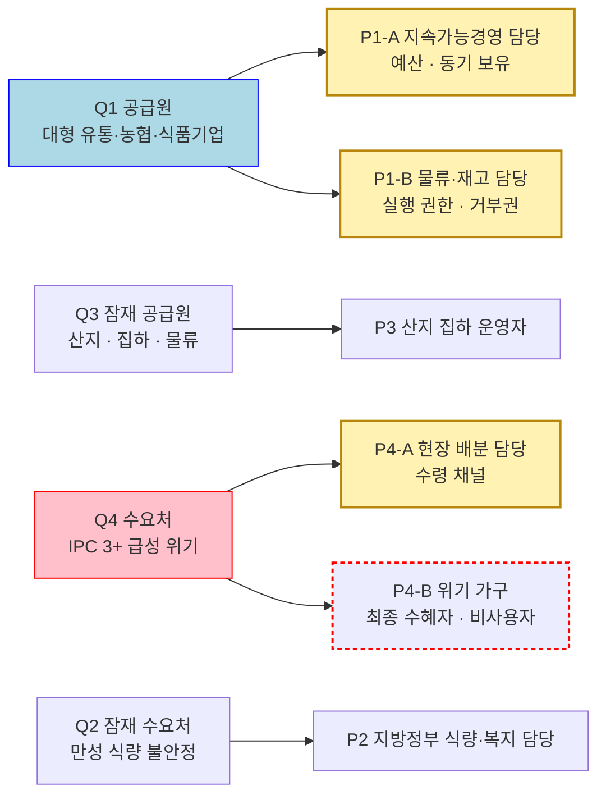

# 페르소나 분석 ③ — 아시아 식량 재분배(잉여-부족 매칭) 플랫폼

> 입력 [챕터 04 TAM-SAM-SOM 분석 ③](../04-tam-sam-som/분석-03-식량-재분배-플랫폼.md) · 리서치 원본 [① 글로벌 식량수급 불균형](../04-tam-sam-som/리서치-원본/01-글로벌-식량수급-불균형.md) · [② 아시아 식품유통손실 보고서](../04-tam-sam-som/리서치-원본/02-아시아-식품유통손실-보고서.md)

## 0. 분석 단위와 전제

| 항목 | 설정 |
|---|---|
| 분석 주체 | 잉여 식량 보유처와 식량 부족 지역을 연결하는 재분배·매칭 플랫폼 사업자 |
| 입력 | 챕터 04 §5 Market Segment Map 의 사분면 Q1~Q4 |
| 산출 | 사분면에서 도출한 페르소나 6종 (유형명·역할·주요 문제·목표·사용 맥락) |
| 페르소나의 정의 | **사분면 안에서 실제로 손을 움직이거나, 손을 움직이지 못하게 막는 한 사람** |

### 전제 하나를 먼저 못 박는다 — 주력 모델을 '재분배 매개'로 고정했다

챕터 04 §7 마지막 메모는 **재분배 매개**와 **시민 참여 대시보드(Pollosseum)** 중 무엇이 주력인지 미확정으로 남겼다. 이 문서는 **재분배 매개를 주력으로 가정**하고 페르소나를 뽑았다.

> ⚠️ 시민 참여가 주력이 되면 **'기부·투표하는 시민'과 '데이터를 인용하는 언론·연구자' 페르소나가 추가**되고, Q1·Q4의 정의 자체가 바뀐다. 이 전제가 뒤집히면 아래 6종 중 P1-A와 P2를 제외한 나머지는 재작성 대상이다.

### 인터뷰 없이 만든 페르소나라는 사실을 숨기지 않는다

이 페르소나들은 **사용자 인터뷰가 아니라 통계·구조에서 역산**한 것이다. 따라서 전원 **가설(hypothesis)** 단계다. 각 요소의 근거 등급은 §5에서 확인·추정·가정으로 나눠 표기한다. 검증 전까지 이 문서의 지위는 *"이런 사람이 있을 것이다"* 이지 *"이런 사람이 있다"* 가 아니다.

---

## 1. 사분면 → 페르소나 매핑

| 표기 | 의미 |
|---|---|
| 노란색 채움 | **1차 설계 대상** — 화면·프로세스를 이 사람 기준으로 만든다 |
| 빨간 점선 테두리 | **비사용자** — 화면을 쓰지 않지만 성공 판정의 기준이 되는 사람 |
| 테두리만 | 2차 — 1차 표적의 운영 역량이 만들어진 뒤 확장 |

**사분면 4개에서 페르소나 6개가 나온 이유는 Q1과 Q4가 각각 두 사람으로 쪼개졌기 때문이다.** 쪼갠 근거는 §2의 추출 규칙 2·3에 있다.

---

## 2. 추출 규칙 — 사분면에서 사람으로 내려오는 방법

세그먼트는 집단이고 페르소나는 개인이다. 이 간극을 메우는 데 다섯 가지 규칙을 썼다.

| # | 규칙 | 이유 |
|---|---|---|
| **1** | **조직명이 아니라 자리(직무)로 내려간다** | *"대형 유통사"* 는 계약 상대이지 사용자가 아니다. 화면을 여는 것은 언제나 특정 직무의 한 사람이다 |
| **2** | **한 사분면 안에 결정 구조가 둘이면 페르소나도 둘로 나눈다** | 예산과 동기를 가진 사람, 실행 권한과 거부권을 가진 사람이 다르면 설득 전략이 완전히 달라진다 |
| **3** | **사용자와 수혜자를 분리한다** | 둘을 섞으면 *"담당자가 편해지는 도구"* 로 최적화되고 칼로리 갭이 줄었는지는 아무도 보지 않게 된다 |
| **4** | **주요 문제는 리서치의 수치에 건다** | 감정 묘사만 있는 문제 진술은 참·거짓을 가릴 수 없다. 숫자에 걸린 문제만 검증할 수 있다 |
| **5** | **이름·나이·가족관계·취미를 지어내지 않는다** | 지어낸 신상은 검증 불가능한데 사실처럼 읽힌다. 유형명으로만 부른다 |

> 📌 **규칙 5가 이 문서의 형식을 결정했다.** 흔한 페르소나 템플릿은 *"35세 김OO 대리, 취미는 등산"* 으로 시작한다. 그 정보는 어떤 설계 판단도 바꾸지 못하면서 문서 전체를 소설처럼 보이게 만든다. 여기서는 **설계 판단을 바꾸는 다섯 항목**(유형명·역할·주요 문제·목표·사용 맥락)만 남겼다.

---

## 3. 페르소나 카드

### 🔵 Q1 공급원 — 1차 표적 (공급)

#### P1-A. 숫자로 증명해야 하는 지속가능경영 담당

| 항목 | 내용 |
|---|---|
| **페르소나 유형명** | 숫자로 증명해야 하는 지속가능경영 담당 (ESG·CSR팀 실무 매니저) |
| **역할** | 대형 유통사·식품기업 **본사** 소속. 연간 지속가능경영보고서 작성, 폐기물 감축 목표(SDG 12.3) 관리, 외부 공시·평가기관 대응. **예산 편성권은 있으나 현장 지휘권은 없다** |
| **주요 문제** | 감축 목표는 이미 대외 선언했는데 **증빙 가능한 실적 데이터가 없다.** 규격 미달·가격 방어로 연간 폐기가 발생하는 것은 알지만(리서치 ① — 산지·도매 규격외 선별 폐기 **5~15%**), 어디로 몇 톤이 갔는지 추적되지 않는다. 기부를 해도 제3자 검증이 없으면 보고서에 쓸 수 없고, 쓰면 그린워싱 지적을 받는다. 내부적으로 물류팀 협조를 얻지 못한다 |
| **목표** | 분기마다 **"재분배 O톤 / 폐기 감축 O%"** 를 제3자 검증 가능한 형태로 확보. 일회성 캠페인이 아니라 **반복 가능한 정례 프로세스**로 만들기 |
| **사용 맥락** | 분기 보고 마감 3~4주 전, 사무실 데스크톱. 대시보드에서 자사 배출 물량·수령처·도착 확인 증빙을 내려받아 보고서에 붙인다. 신규 도입 검토 시점에는 법무·물류팀을 설득할 자료(식품안전 책임 범위, 면책 조항)를 먼저 요청한다 |

> 💬 *"기부한 건 아는데, 몇 톤이 어디로 갔는지 못 쓰면 보고서엔 한 줄도 못 넣습니다."*

#### P1-B. 사고 나면 내 책임인 물류·재고 담당

| 항목 | 내용 |
|---|---|
| **페르소나 유형명** | 사고 나면 내 책임인 물류·재고 담당 (물류센터·산지유통센터 운영 책임자) |
| **역할** | 규격 미달·유통기한 임박 재고의 **처분을 실제로 실행하는 사람.** 출고 지시, 차량·인력 배차, 폐기 처리 승인. 본사 방침과 무관하게 **물건을 내주지 않으면 아무 일도 일어나지 않는 자리** |
| **주요 문제** | 폐기는 이미 확립된 절차다 — 비용은 들지만 **리스크가 0**이다. 재분배는 절차 밖의 일이라 손이 더 가고, 식중독이나 재판매(암시장 유출) 사고가 나면 책임이 자기에게 온다. 추가 상차 시간·차량·인력이 필요한데 그 노력은 자신의 KPI에 잡히지 않는다. **동기는 없고 위험만 있다** |
| **목표** | 기존 폐기 처리와 **같은 수준의 소요 시간과 책임 부담**으로 끝내기. 인수 시점에 책임이 명확히 끊기는 것 — 수령 확인이 곧 면책이 되는 구조 |
| **사용 맥락** | 마감 직전 **창고 현장, 모바일.** 재고 리스트에서 '폐기' 대신 '재분배'를 선택하고, 픽업 시각과 인수자를 확인하고, 인수증(사진·서명)을 받는 순간 손을 떼기를 원한다. **회수가 하루 안에 되지 않으면 그냥 폐기한다** |

> 💬 *"폐기는 눌러 본 적 있는 버튼이고, 기부는 사고 나면 내 이름이 남는 일이에요."*

> 📌 **챕터 04 §7의 질문 — *"Q1의 의사결정자는 ESG 담당인가 물류 담당인가"* — 에 대한 답.**
> **둘 다이며, 역할이 다르다. 파는 곳은 P1-A, 뚫는 곳은 P1-B다.**
> P1-A만 설득하면 **계약은 되고 물량은 나오지 않는다.** 도입 결정은 본사에서 나지만 실제 톤 수는 창고에서 결정된다. SOM 25,000 t의 성패는 P1-B의 손끝에 있다.

---

### 🔴 Q4 수요처 — 1차 표적 (수요)

#### P4-A. 배분 계획을 매주 다시 짜는 현장 오퍼레이션 담당

| 항목 | 내용 |
|---|---|
| **페르소나 유형명** | 배분 계획을 매주 다시 짜는 현장 오퍼레이션 담당 (WFP·국제 NGO 국가사무소의 프로그램·물류 오피서) |
| **역할** | IPC 3+ 지역에서 물자를 **수령하고 배분하는 실행 책임자.** 향후 3~6개월 조달 예정 물량(파이프라인) 관리, 배급소 배정, 통관·창고 조율. 자금이 비면 **배급량 삭감을 결정하는 사람** |
| **주요 문제** | 리서치 ①이 경고한 **인도주의 자금 공백**이 상시화됐다. 문제는 물량 총량이 아니라 **예측 가능성**이다 — 언제 얼마가 들어올지 확정되지 않은 물량은 파이프라인에 넣을 수 없다. 기부 제안은 자주 오지만 품목·수량·도착 시점이 불확실하고, 통관·보관 조건이 맞지 않으면 항구에서 썩는다(리서치 ② — 통관 지연·냉장 부재로 인한 도착 전 폐기) |
| **목표** | 3개월 앞 파이프라인에 **그대로 붙여 넣을 수 있는 확약 물량** — 품목·톤·도착 예정일·인수 조건이 하나로 묶인 단위. 그리고 확약이 깨졌을 때의 대체 경로 |
| **사용 맥락** | 주간 파이프라인 회의 직전, 노트북 + **불안정한 현장 인터넷.** 확정·미확정 물량을 구분해 내려받아 배급 계획에 반영한다. 국경 폐쇄·통관 지연이 발생하면 **목적지를 바꿀 수 있는지**를 먼저 확인한다 |

> 💬 *"안 오는 것보다 나쁜 게, 온다고 해서 계획에 넣었는데 안 오는 겁니다."*

#### P4-B. 오늘 한 끼를 계산하는 위기 가구 — 최종 수혜자, 비사용자

| 항목 | 내용 |
|---|---|
| **페르소나 유형명** | 오늘 한 끼를 계산하는 위기 가구 (IPC Phase 3+ 판정 지역의 가구 구성원) |
| **역할** | **플랫폼을 쓰지 않는다.** 2024년 IPC 3+ 인구 **2억 9,530만 명** 중 한 명. 배급소에서 결과만 만난다 |
| **주요 문제** | 리서치 ①의 진단 그대로 — 식량이 없는 것이 아니라 **접근성·구매력·안정성이 깨진 것.** IPC Phase 3 기준 하루 **400~600 kcal** 결핍. 다음 배급이 언제 얼마나 나올지 몰라 **미리 식사량을 줄인다.** 배급소까지의 이동 비용과 시간, 대기, 명단 누락 |
| **목표** | 다음 배급이 **언제, 얼마나** 나오는지 미리 아는 것. 그리고 하루 칼로리 갭이 실제로 메워지는 것 |
| **사용 맥락** | 배급소 현장. 접점은 앱이 아니라 **배급 공지(문자·게시·구두 전달)와 수령 확인**이다. 플랫폼이 이 사람에게 닿는 유일한 경로는 **P4-A를 통해서**다 |

> 📌 **비사용자를 왜 페르소나에 넣는가.** 넣지 않으면 제품은 *"P4-A의 업무가 편해지는 도구"* 로 최적화된다. 그러면 매칭 건수는 늘고 칼로리 갭은 그대로인 상태가 성공으로 보고된다.
> **화면 설계의 대상은 P4-A, 성과 판정의 기준은 P4-B다.** 둘을 섞지 않는다.

---

### ⬜ Q3 잠재 공급원 — 2차

#### P3. 수확기마다 팔 곳을 못 찾는 산지 집하 운영자

| 항목 | 내용 |
|---|---|
| **페르소나 유형명** | 수확기마다 팔 곳을 못 찾는 산지 집하 운영자 (농협·산지유통센터 관리자, 수집상) |
| **역할** | 소농에게서 물량을 모아 도매로 넘기는 **중간 집하 단계.** 건조·선별·보관·1차 운송을 담당. Q1과 달리 물량이 **한곳에 모여 있지 않다** |
| **주요 문제** | 리서치 ② — 건조 단계 손실 **최대 33%**(필리핀 벼), 저장 단계 **10~20%**, 대형 유통의 규격 요구로 인한 선별 폐기. 대형 유통이 받지 않는 물량이 산지에 남는데 옮길 냉장·운송 수단이 없어 **며칠 안에 상한다.** 손실이 산지·창고·도로에 흩어져 있어 한 번에 모으는 비용이 물건 값을 넘어선다 |
| **목표** | 규격 외 물량이 **폐기가 되기 전 며칠 안에** 회수되는 경로. 값을 받으면 좋고, 최소한 **운송 실비라도 회수**되는 것 |
| **사용 맥락** | 수확 성수기, **현장 모바일과 통화.** 문자나 음성으로 *"지금 O톤, O일까지"* 를 등록하고 픽업 차량이 실제로 오는지 확인한다. **데이터 요금·문해 수준·앱 설치 자체가 장벽**이므로 복잡한 UI는 그 자리에서 사용을 중단시킨다 |

> 💬 *"가져가 주기만 하면 됩니다. 근데 사흘 뒤에 오면 이미 버린 다음이에요."*

---

### ⬜ Q2 잠재 수요처 — 2차

#### P2. 긴급은 아니지만 매년 반복되는 결식을 관리하는 지방정부 담당

| 항목 | 내용 |
|---|---|
| **페르소나 유형명** | 긴급은 아니지만 매년 반복되는 결식을 관리하는 지방정부 담당 (지자체 식량·복지 공무원, 지역 푸드뱅크 운영자) |
| **역할** | 만성 식량 불안정 지역(IPC 3 **미만**)의 급식·푸드뱅크·복지 배분 담당. 예산 집행과 **감사 대응** |
| **주요 문제** | 긴급 상황이 아니어서 국제 지원 우선순위에서 항상 밀린다. 예산은 연 단위로 고정되어 있고, **출처·품질 이력이 불명확한 식품은 감사 위험 때문에 받을 수 없다.** 의사결정이 느린 이유는 무관심이 아니라 **감사 구조 때문**이다 |
| **목표** | 연간 예산 계획에 편성할 수 있는 **안정적·저비용 조달선.** 출처·검사 이력·인수 내역이 문서로 남아 감사에서 방어되는 것 |
| **사용 맥락** | 예산 편성기와 정기 발주 주기, 사무실 PC. 조달 규정 검토와 함께 본다. 긴급 매칭 속도보다 **계약서·정산 서류·이력 문서**가 우선이다 |

> 💬 *"공짜라서 못 받는 경우가 더 많아요. 어디서 왔는지 증빙이 안 되면요."*

---

## 4. 6종 한눈에 비교

| | **P1-A** 지속가능경영 담당 | **P1-B** 물류·재고 담당 | **P4-A** 현장 배분 담당 | **P4-B** 위기 가구 | **P3** 산지 집하 운영자 | **P2** 지방정부 담당 |
|---|---|---|---|---|---|---|
| **사분면** | Q1 공급 | Q1 공급 | Q4 수요 | Q4 수요 | Q3 공급 | Q2 수요 |
| **우선순위** | 🟡 1차 | 🟡 1차 | 🟡 1차 | 🔴 판정 기준 | ⬜ 2차 | ⬜ 2차 |
| **역할** | 보고·공시, 예산 편성 | 재고 처분 실행 | 수령·배분 실행 | 수혜 (비사용자) | 집하·건조·보관 | 복지 배분·예산 집행 |
| **주요 문제** | 증빙 데이터 없음 | 동기 없고 위험만 있음 | 물량이 아니라 예측 가능성 부족 | 다음 배급을 알 수 없음 | 회수가 며칠 늦어 이미 폐기 | 출처 미검증 = 감사 위험 |
| **목표** | 검증 가능한 분기 실적 | 폐기와 같은 부담으로 종료 | 파이프라인에 넣을 확약 물량 | 칼로리 갭 해소 | 폐기 전 회수·실비 회수 | 예산에 편성 가능한 조달선 |
| **사용 맥락** | 분기 마감 전, 사무실 PC | 마감 직전 창고, 모바일 | 주간 회의 전, 불안정 인터넷 | 배급소 (화면 없음) | 성수기 현장, 저사양 모바일 | 예산 편성기, 사무실 PC |
| **결정 권한** | 도입 결정 | **거부권** | 수령 결정 | 없음 | 출하 결정 | 조달 결정 |

### 이 표에서 읽히는 것

- **1차 표적 3인의 시간 단위가 전부 다르다.** P1-A는 **분기**, P4-A는 **주**, P1-B는 **하루**로 산다. 하나의 화면으로 셋을 만족시킬 수 없다는 뜻이다.
- **거부권을 가진 사람은 P1-B 한 명뿐이다.** 나머지는 하지 않기로 결정할 수 있을 뿐 남의 행동을 막지는 않는다. **가장 먼저 설계해야 할 대상은 P1-B의 5분이다.**
- **공급 측 두 명(P1-B·P3)의 공통 조건은 '현장·모바일·시간 압박'** 이다. 수요 측 두 명(P4-A·P2)은 '사무실·문서·계획 주기'다. **제품이 사실상 두 개**라는 신호다.

---

## 5. 근거 검증 메모

챕터 04 §6의 표기 규칙(확인 / 추정 / 가정)을 그대로 적용한다. 페르소나는 대부분 가정이며, **어디까지가 데이터이고 어디부터가 상상인지**를 구분하는 것이 이 절의 목적이다.

| 페르소나 구성 요소 | 근거 | 등급 |
|---|---|---|
| Q1에 폐기 물량이 실재한다 (5~15%) | 리서치 ① 3절 — 규격중심 유통 선별 폐기 | **(확인)** |
| Q4 인구 규모 2억 9,530만 명 | 리서치 ① 1절 GRFC 2025 | **(확인)** |
| Q4 개인의 결핍 400~600 kcal/일 | 리서치 ① 7절 IPC Phase 3 기준 | **(확인)** |
| Q3 건조 33% · 저장 10~20% 손실 | 리서치 ② 2절 (필리핀 벼 등) | **(확인)** |
| P4-A의 '도착 전 폐기' 경험 | 리서치 ② 2절 — 통관 지연·냉장 부재 | **(확인)** |
| 자금 공백으로 배급량 삭감 | 리서치 ① 4절 — 인도주의 자금 공백 경고 | **(확인)** |
| ESG팀과 물류팀이 분리되어 있다 | 대기업 일반 조직 구조에서 추론 | **(추정)** |
| 규격 요구가 중간 유통의 폐기를 유발 | 리서치 ② 3절 — 소매업체 규격 요구 → 선별 폐기 | **(확인)** |
| 감사 위험이 지자체 수령을 막는다 | 공공 조달 일반 관행에서 추론 | **(추정)** |
| **P1-B가 거부권을 가진다** | 근거 없음 — 이 분석의 핵심 가설 | **(가정)** |
| **각 인물의 두려움·동기·인용구** | 인터뷰 없음. 전부 창작 | **(가정)** |
| **사용 시점·기기·소요 시간** | 직무 특성에서 추론했으나 미검증 | **(가정)** |

### 가장 먼저 깨질 수 있는 가정 세 개

| # | 가정 | 틀렸을 때의 결과 | 검증 방법 |
|---|---|---|---|
| **1** | P1-B가 실질 거부권을 가진다 | 1차 설계 대상 자체가 잘못됨. 본사 방침만으로 물량이 나온다면 P1-A에 집중해야 함 | 유통사 물류센터 담당 **3~5인** 인터뷰 — *"본사가 기부하라고 하면 그대로 나갑니까"* |
| **2** | P4-A의 병목이 물량이 아니라 예측 가능성이다 | 확약 기반 설계가 과잉이 됨. 총량이 병목이면 속도·규모 우선 설계로 바뀜 | WFP·국제 NGO 국가사무소 물류 담당 **2~3인** 인터뷰 — 파이프라인 반려 사유 실측 |
| **3** | P1-B가 '하루 안'을 임계로 삼는다 | 물류 SLA 설계 전체가 어긋남. 실제 임계가 3일이면 훨씬 저렴한 설계가 가능 | 재고 처분 실무 로그 확인 — 폐기 결정까지의 실제 소요 시간 |

> 📌 **이 세 가정은 SOM 25,000 t의 전제이기도 하다.** 챕터 04는 *"하루 트럭 3대"* 를 공격적이지만 가능한 수준으로 판정했는데, 그 판단은 **P1-B가 매일 트럭 3대분을 내준다**는 가정 위에 서 있다. 가정 1이 깨지면 SOM도 함께 재산정해야 한다.

---

## 6. 다음 단계로 넘기는 질문

| 답한 것 | 답하지 못한 것 |
|---|---|
| 사분면 안의 실제 인물이 누구인가 | **한 페르소나 안의 편차** — P3의 문해·데이터 접근성은 어디까지 벌어지는가 (→ 페르소나 스펙트럼) |
| 각자가 무엇을 두려워하는가 | **그 두려움이 언제 발생하는가** — 단계별 접점과 이탈 지점 (→ 고객 여정지도) |
| 누가 거부권을 가지는가 | **거부권을 무엇으로 푸는가** — 면책 구조인가, 소요 시간 단축인가, 인센티브인가 |
| 1차 설계 대상 3인 | **셋 중 무엇을 먼저 만드는가** — 기회점수 기반 우선순위 (→ 챕터 06) |
| 표면적 요구 (목표 항목) | **그 사람이 고용하려는 진짜 일** — 폐기 버튼이 이미 해주고 있는 일은 무엇인가 (→ 챕터 07 JTBD) |

**바로 다음 작업은 두 가지다.**

1. **페르소나 스펙트럼** — P3와 P4-A는 내부 편차가 특히 크다. P3는 스마트폰 상시 사용자부터 음성 통화만 가능한 사용자까지, P4-A는 상시 인터넷 사무소부터 위성 통신에 의존하는 오지 사무소까지 걸쳐 있다. **평균값 페르소나로 설계하면 양 끝의 사용자가 전부 이탈한다.**
2. **고객 여정지도** — 대상을 **P1-B와 P4-A 두 명**으로 좁혀 그린다. 이유는 §4에서 확인된 대로, 이 둘이 물량의 시작과 끝을 각각 쥐고 있고 시간 단위가 정반대(하루 vs 주)이기 때문이다.
