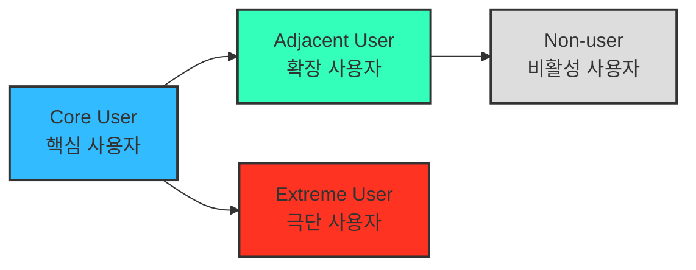

# 05 - 페르소나, 페르소나 스펙트럼, 고객 여정지도

> 본 챕터의 분석은 이 문서에 정의된 방법론을 따른다.
> 이 방법론은 **선행 분석(챕터 04 TAM-SAM-SOM 과 Market Segment Map)의 결과물을 입력으로 받는다.** 사분면이 정의되지 않은 상태에서 페르소나를 만들면 근거 없는 인물 창작이 된다.

> 📥 **원문 반입 상태.** 이 문서는 강의 원문을 절 번호 그대로 보존한다. 현재 **§2 페르소나 스펙트럼** 원문만 반입되었다. §1 페르소나 · §3 고객 여정지도 원문은 아직 없으며, 원문이 들어오면 이 문서의 해당 번호 자리에 그대로 채운다.
>
> - **§1 페르소나** — 원문 미반입. 산출물 [`분석-03-식량-재분배-플랫폼.md`](./분석-03-식량-재분배-플랫폼.md) 는 원문 없이 챕터 04 사분면에서 직접 도출했다. 원문 반입 시 산출물과 대조해 어긋나는 부분을 조정한다.
> - **§3 고객 여정지도** — 원문 미반입, 산출물 없음.
>
> ⚠️ **`분석 결과물 포맷 규격` 절이 아직 없다.** 챕터 01~03과 같이 세 절의 원문이 모두 갖춰진 뒤 붙인다. 그전까지 이 문서만으로는 같은 수준의 산출물이 재현되지 않는다.

---

## 2. **페르소나 스펙트럼 (Persona Spectrum)**

> 더 정확한 방법으로 내 서비스를 둘러싼 “여러 유형의 페르소나와 유형별 특성”을 파악하고, 구체적인 사례까지 확인합니다!

- 극단적·비전형적 사용자까지 포함해 서비스의 **포용성(Inclusivity)** 과 **사용 맥락의 다양성**을 확보하는 분석 방법.

**페르소나 스펙트럼 유형별 설명**

| 구분 | 설명 | 목적 | 생성 포인트 |
| --- | --- | --- | --- |
| **핵심(Core)** | 이상적인 주요 고객군 | 주력 타깃 설정 | 매출/사용 빈도 중심 |
| **확장(Adjacent)** | 유사 문제를 가진 인접 시장군 | 확장 기회 탐색 | 유사 니즈/다른 맥락 |
| **극단(Extreme)** | 제약·극단적 상황을 가진 사용자 | 제품 개선 및 포용적 설계 | 실패·불편·대안 사용 중심 |
| **비활성(Non-user)** | 아직 사용하지 않거나 회피하는 집단 | 시장 진입 장벽 및 거부 요인 파악 | 인식·가치·신뢰 결여 중심 |

**페르소나 스펙트럼 도출 핵심 질문**

- (확장) “유사한 제품/서비스를 사용하고 있는 사람은 누구인가?”
- (비활성) “이 제품/서비스를 `사용할 수 없는 사람`은 누구인가?”
- (극단) “가장 자주 실패를 경험하는 사람은 누구인가?”

> 💡 AI 활용 방향:
> AI를 고객의 ‘다양한 가능성’을 빠르게 탐색하는 프로토타이핑 파트너로 삼아 각 사용자 군의 맥락적 특성과 감정적 동기를 가상으로 생성

### ⚙️ **AI 기반 다중 페르소나 생성 및 평가 워크플로우**

| 단계 | 목적 | AI 프롬프트 예시 | 산출물 |
| --- | --- | --- | --- |
| **① 1차 생성 (Divergent Thinking)** | 각 스펙트럼 유형별 3~5개 버전 생성 | “핵심 사용자 5명, 확장 사용자 3명, 극단 사용자 2명, 비활성 사용자 2명을 만들어줘. 각자는 이름, 직무, 문제, 목표, 감정, 대체 솔루션을 포함해.” | 총 10~12개 페르소나 원본 |
| **② 2차 평가 (Convergent Filtering)** | 생성된 페르소나를 평가 및 선별 | “각 페르소나를 문제·행동·맥락의 현실성 기준으로 평가해, 상위 1개씩만 추천해줘.” | 4개 대표 페르소나 (Core, Adjacent, Extreme, Non-user) |
| **③ 3차 보정 (Contextual Rewriting)** | 사업 주제에 맞게 언어 및 상황 맞춤화 | “우리의 서비스 맥락(예: SaaS 컨설팅 플랫폼)에 맞춰 다시 기술해줘.” | 실제 적용 가능한 4종 페르소나 카드 |
| **④ 4차 검증 (AI Peer Review)** | 다중 AI 교차검증 | “이 4명의 페르소나가 실제 시장에서 존재할 확률과 근거를 설명해줘.” | 검증 코멘트 요약 리포트 |
| **⑤ 5차 통합 (Spectrum Map)** | 페르소나 간 관계 구조화 | Mermaid / Figma로 시각화 | Persona Spectrum Map 완성 |
