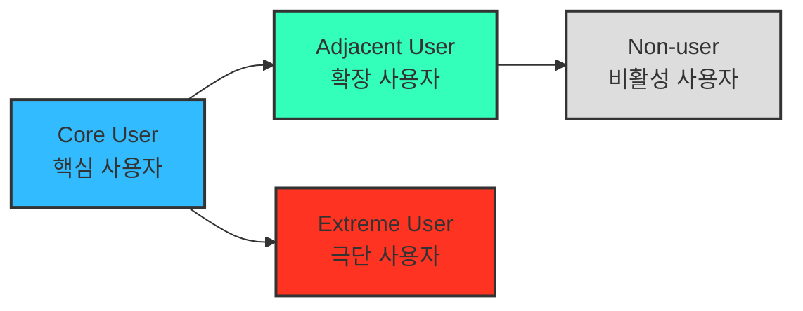

# 05 - 페르소나, 페르소나 스펙트럼, 고객 여정지도

> 본 챕터의 분석은 이 문서에 정의된 방법론을 따른다.
> 이 방법론은 **선행 분석(챕터 04 TAM-SAM-SOM 과 Market Segment Map)의 결과물을 입력으로 받는다.** 사분면이 정의되지 않은 상태에서 페르소나를 만들면 근거 없는 인물 창작이 된다.

> 📤 **산출물** — [페르소나·고객 여정 분석 ③](./분석-03-식량-재분배-플랫폼.md) (§2·§3 합본)

---

## 2. **페르소나 스펙트럼 (Persona Spectrum)**

> 더 정확한 방법으로 내 서비스를 둘러싼 “여러 유형의 페르소나와 유형별 특성”을 파악하고, 구체적인 사례까지 확인합니다!

- 극단적·비전형적 사용자까지 포함해 서비스의 **포용성(Inclusivity)** 과 **사용 맥락의 다양성**을 확보하는 분석 방법.

**페르소나 스펙트럼 유형별 설명**

| 구분 | 설명 | 목적 | 생성 포인트 |
| --- | --- | --- | --- |
| **핵심(Core)** | 이상적인 주요 고객군 | 주력 타깃 설정 | 매출/사용 빈도 중심 |
| **확장(Adjacent)** | 유사 문제를 가진 인접 시장군 | 확장 기회 탐색 | 유사 니즈/다른 맥락 |
| **극단(Extreme)** | 제약·극단적 상황을 가진 사용자 | 제품 개선 및 포용적 설계 | 실패·불편·대안 사용 중심 |
| **비활성(Non-user)** | 아직 사용하지 않거나 회피하는 집단 | 시장 진입 장벽 및 거부 요인 파악 | 인식·가치·신뢰 결여 중심 |

**페르소나 스펙트럼 도출 핵심 질문**

- (확장) “유사한 제품/서비스를 사용하고 있는 사람은 누구인가?”
- (비활성) “이 제품/서비스를 `사용할 수 없는 사람`은 누구인가?”
- (극단) “가장 자주 실패를 경험하는 사람은 누구인가?”

> 💡 AI 활용 방향:
> AI를 고객의 ‘다양한 가능성’을 빠르게 탐색하는 프로토타이핑 파트너로 삼아 각 사용자 군의 맥락적 특성과 감정적 동기를 가상으로 생성

### ⚙️ **AI 기반 다중 페르소나 생성 및 평가 워크플로우**

> ⛔ **아래 「AI 프롬프트 예시」 열은 강의 원문의 예시이지 이 프로젝트에서 실제로 쓴 지시문이 아니다. 그대로 복사해 쓰지 않는다.**
>
> | 왜 그대로 쓰면 안 되나 | |
> |---|---|
> | **① 산출물에 프롬프트가 남는다** | 분석 결과 문서는 *"무엇을 알아냈는가"* 만 담는다. *"어떻게 시켰는가"* 가 섞이면 다음 사람이 결론과 작업 지시를 구분하지 못한다 |
> | **② 개수가 서비스마다 다르다** | *"핵심 5명, 확장 3명…"* 은 예시 숫자다. 실제 개수는 **선행 분석의 세그먼트 수**에서 나와야 한다 |
> | **③ 산출 항목이 부족하다** | 예시에는 `대체 솔루션` 이 있으나 **첫 접점·전환 조건·이탈 조건**이 없다. 이 셋이 없으면 화면 설계로 넘어가지 못한다 |
> | **④ ⑤단계에 예시가 없다** | Spectrum Map은 프롬프트가 아니라 **인물 간 관계를 직접 판단**해 그리는 작업이다 |
>
> **이 프로젝트의 실제 적용은 산출물 문서에 결과로만 남겼다.** 프롬프트 원문은 아래 표에 **강의 자료로서** 보존한다.

| 단계 | 목적 | AI 프롬프트 예시 *(원문 · 그대로 쓰지 말 것)* | 산출물 |
| --- | --- | --- | --- |
| **① 1차 생성 (Divergent Thinking)** | 각 스펙트럼 유형별 3~5개 버전 생성 | “핵심 사용자 5명, 확장 사용자 3명, 극단 사용자 2명, 비활성 사용자 2명을 만들어줘. 각자는 이름, 직무, 문제, 목표, 감정, 대체 솔루션을 포함해.” | 총 10~12개 페르소나 원본 |
| **② 2차 평가 (Convergent Filtering)** | 생성된 페르소나를 평가 및 선별 | “각 페르소나를 문제·행동·맥락의 현실성 기준으로 평가해, 상위 1개씩만 추천해줘.” | 4개 대표 페르소나 (Core, Adjacent, Extreme, Non-user) |
| **③ 3차 보정 (Contextual Rewriting)** | 사업 주제에 맞게 언어 및 상황 맞춤화 | “우리의 서비스 맥락(예: SaaS 컨설팅 플랫폼)에 맞춰 다시 기술해줘.” | 실제 적용 가능한 4종 페르소나 카드 |
| **④ 4차 검증 (AI Peer Review)** | 다중 AI 교차검증 | “이 4명의 페르소나가 실제 시장에서 존재할 확률과 근거를 설명해줘.” | 검증 코멘트 요약 리포트 |
| **⑤ 5차 통합 (Spectrum Map)** | 페르소나 간 관계 구조화 | Mermaid / Figma로 시각화 | Persona Spectrum Map 완성 |

---

## 3. **고객 여정지도 (Customer Journey Map, CJM)**

> 고객이 “문제를 인식 → 해결을 탐색 → 구매/사용 → 평가/유지”와 같은 과정에서 겪는
> 경험, 감정, Pain Point를 시각화한 흐름도.

> ❓ **고객 여정의 단계를 정의하는 방법** → <https://www.ibm.com/kr-ko/think/topics/customer-journey-map>

> 💡 ***비즈니스 유형별로 `매우 다른` 맞춤형 고객 여정지도가 도출될 수 있음!***
>
> 잘 만들어진 고객 여정지도는 **내 서비스에 대해 고객의 생각과 행동 반경을 잘 담고 있는 체계적인 분석도구**다.
>
> - **가구 시장에 대한 CJM** → “`실측`” & “`조립/설치`”
> - **자동차 시장에 대한 CJM** → “`비교`” & “`시승`” & “`협상`”

> ***“예쁘면 다 좋은 게 아니라, 지식으로서 가치있는 부분을 가독성 높고 재사용하기 쉽게 추출하기”***

| **단계** | 고객 행동 | 고객 생각 | 감정 | Pain Point | 개선 기회 |
| --- | --- | --- | --- | --- | --- |
| **문제 인식** | 불편함을 느낌 | “이 문제 왜 생기는 거지?” | 불안 | 정보 부족 | 문제 원인 콘텐츠 제공 |
| **탐색** | 대안을 찾음 | “이건 괜찮아 보이는데?” | 기대 | 복잡한 비교 | 비교 툴 제공 |
| **의사결정** | 선택 고민 | “이걸 사도 될까?” | 불안 | 신뢰 부족 | 후기·데모 제공 |
| **사용** | 실제 사용 | “생각보다 어렵네” | 실망 | UX 미흡 | 온보딩 개선 |
| **유지** | 반복 사용 | “이제 익숙해졌네” | 안정 | 가치 감소 | 리텐션 캠페인 |

---

> ## ⚠️ 경고 — 위 5단계는 예시일 뿐, 단계는 매번 새로 정의한다
>
> **고객 여정지도는 항상 같은 단계로 찍어내는 산출물이 아니다.** 위 표의 `문제 인식 → 탐색 → 의사결정 → 사용 → 유지`는 **일반형 예시**이며, 이 다섯 칸을 그대로 가져다 채우는 순간 그 문서는 분석이 아니라 템플릿 작성이 된다.
>
> **단계는 서비스의 특성에서 도출한다.** 이 절이 가구와 자동차를 나란히 든 이유가 그것이다.
>
> | 시장 | 그 시장에서만 나타나는 결정적 단계 | 일반형 5단계에 없는 것 |
> |---|---|---|
> | 가구 | **실측** · **조립/설치** | 구매 후에 더 큰 관문이 있다 |
> | 자동차 | **비교** · **시승** · **협상** | 탐색과 결정 사이가 세 단계로 갈라진다 |
>
> **분석을 시작하기 전에 반드시 물어야 할 것.**
>
> 1. 이 서비스에서 고객이 **실제로 통과하는 관문**은 무엇인가 — 남들이 쓰는 단계 이름이 아니라, 이 서비스에서만 생기는 관문
> 2. 그 관문 중 **고객이 가장 많이 이탈하는 곳**은 어디인가
> 3. 구매·결제 **이후에** 더 큰 관문이 있는가 (가구의 조립·설치처럼)
> 4. **페르소나마다 여정이 갈라지는가** — 갈라진다면 지도를 나눠 그린다
>
> **단계 이름이 서비스와 무관하게 읽힌다면 그 CJM은 잘못 그려진 것이다.** *"탐색"* 이라고만 쓰지 말고 그 서비스에서 탐색이 실제로 무엇인지를 단계 이름에 담는다.
