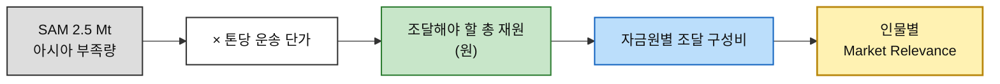
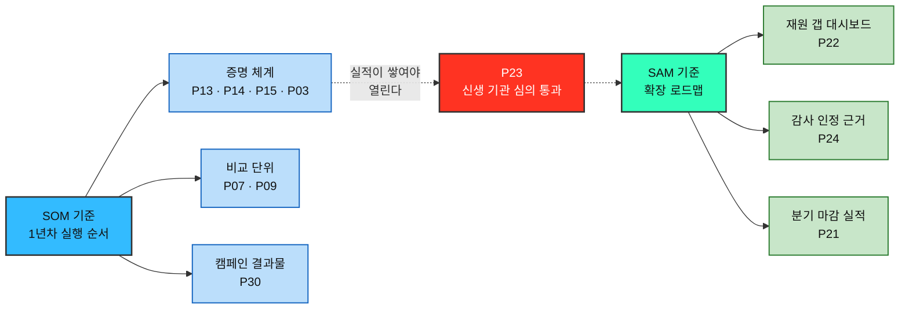

# 시장 가중형 기회점수(DOS) 분석 ③ — 구호재원 모금 기반 식량 무상 운송 서비스

> [분석 방법론 §4](./분석-방법론.md) · 입력 [AOS 분석 ③](./분석-03-식량-재분배-플랫폼.md) · [평가 대상 36개](./평가대상-03-대표-페인포인트.md) · 모수 근거 [챕터 04 TAM-SAM-SOM](../04-tam-sam-som/분석-03-식량-재분배-플랫폼.md)

> 📊 **산출.** **DOS = (Importance − Satisfaction) × Market Relevance** 를 **SAM 기준**과 **SOM 기준** 두 버전으로 각각 계산했다. 두 순위의 차이 자체가 결론의 일부다.
>
> ⚠️ **Importance·Satisfaction은 AOS 분석의 값을 그대로 승계**하며 전부 인터뷰 없는 추정이다. 여기에 **MR이라는 가정 한 겹이 더 얹힌다.** 근거 등급은 §7 참조.

---

## 0. Market Relevance 정의

### 모수를 SAM으로 잡고 SOM을 병기하는 이유

| 모수 | 판정 | 사유 |
|---|:---:|---|
| **TAM** (세계 식량 손실 500 Mt) | ❌ | **인과가 끊긴다.** 어떤 Pain을 고쳐도 세계 폐기량의 몇 %가 움직인다고 말할 수 없어 MR이 전부 0에 수렴한다 |
| **SAM** (아시아 부족량 2.5 Mt) | ✅ **기본** | 방법론이 DOS의 목적을 **"시장 확장성 검증"** 으로 규정한다. 그리고 챕터 04 §6이 지적한 TAM/SAM 측정 대상 불일치에서 **정의가 바뀌지 않는 유일한 층**이다 |
| **SOM** (1년차 25,000 t) | ✅ **병기** | 확장성이 아니라 **1년차 실행 순서**를 본다. AOS가 이미 실행 관점을 담당하므로 SOM만 쓰면 두 지표가 같은 것을 두 번 재게 되지만, SAM과 나란히 놓으면 **"지금 할 것"과 "커지려면 할 것"의 차이**가 드러난다 |

### 톤이 아니라 재원으로 환산한다

36개 중 **33개가 돈을 내는 사람의 Pain**이다. 분자가 기부자의 미충족인데 분모가 식량 톤이면 단위가 맞지 않는다.

**톤은 성과 단위, 원은 시장 단위다.** SOM 기준도 같은 방식으로 `25,000 t × 톤당 운송 단가` 로 환산한다.

### MR 부여 규칙 세 가지

| # | 규칙 | 이유 |
|---|---|---|
| **1** | **MR은 Pain별이 아니라 인물별로 부여한다** | Pain마다 다르게 주면 Importance를 두 번 세게 된다. 방법론이 DOS를 *"고객 미충족 × 시장 파급력"* 으로 정의한 것은 **두 항이 독립**이라는 뜻이다 |
| **2** | **MR의 합은 1이 아니어도 된다** | 방법론 예시도 0.8 + 0.6 + 0.7 = 2.1이다. MR은 예산 배분표가 아니라 *"이 Pain이 닿는 시장의 상대적 크기"* 이므로, 같은 지갑을 다른 경로로 공략하는 인물들이 각자 MR을 갖는 것이 정상이다 |
| **3** | **비지불 인물은 MR 0, 수혜형은 산출 제외** | 언론·연구자와 불신 시민의 간접 기여를 다른 인물 MR에 얹으면 이중 계산이 된다. 수혜형 3개(P34·P35·P36)는 AOS에서 이미 분리한 대로 **성과 판정 트랙**에 남긴다 |

### 자금원 구성비 — 층마다 다르다

MR은 비율이므로 분모의 절대 크기는 무의미하다. **결과를 가르는 것은 층마다 조달 구성이 다르다는 사실이다.**

| 자금원 | **SAM 기준** | **SOM 기준** | 차이의 근거 |
|---|:---:|:---:|---|
| 기관 공여 (정부 ODA·국제기구·재단) | **45%** | 15% | SAM 규모는 기관 자금 없이 불가능하다. 반면 1년차 신생 조직은 심의를 통과하기 어렵다 (P23) |
| 기업 (CSR·매칭그랜트) | **25%** | 15% | 기업도 실적 없는 신생과는 계약을 꺼린다 (P20) |
| 개인 정기 | 18% | **30%** | 1년차 매출의 중심 |
| 개인 일회성·캠페인 | 10% | **35%** | 사건 기반 유입과 제3자 캠페인이 초기에 가장 빠른 채널 |
| 임팩트 자본·대출 | 2% | 5% | 두 층 모두 작다. 형식 자체가 성립하지 않는다 (P27) |

### 인물별 Market Relevance

| 인물 | 자금원 | **SAM MR** | **SOM MR** |
|---|---|:---:|:---:|
| 공여기관·재단 프로그램 오피서 「어디가 비어 있나」 | 기관 공여 | **0.45** | 0.15 |
| 기업 사회공헌·ESG 담당 「이사회에 보고할 숫자」 | 기업 | **0.25** | 0.15 |
| 개인 소액 정기 후원자 「오천 원이 몇 킬로냐」 | 개인 정기 | 0.18 | **0.30** |
| 타 기부 플랫폼 정기 후원자 「이미 다른 데 후원 중」 | 개인 정기 (획득 경로) | 0.18 | **0.30** |
| 극단적 투명성 요구 기부자 「원 단위로 캐묻는다」 | 개인 정기 (성향 집단) | 0.18 | **0.30** |
| 일회성 충동 기부자 「뉴스 보고 들어왔다」 | 개인 일회성 | 0.10 | **0.35** |
| 제3자 모금 캠페인 주최자 「우리 반이 한 트럭」 | 개인 일회성·캠페인 | 0.10 | **0.35** |
| 임팩트 투자·사회적 금융 담당 「톤당 얼마인가」 | 임팩트 자본 | 0.02 | 0.05 |
| 해외 거주·비카드 결제 기부 시도자 「결제까지 못 간다」 | 개인 계열 하위 | 0.02 | 0.03 |
| 언론·연구자·정책 담당 「기사에 쓸 숫자」 | 없음 (간접 채널) | **0.00** | **0.00** |
| 국제 구호 불신 시민 「어차피 중간에서 샌다」 | 없음 (잠재 시장) | **0.00** | **0.00** |
| IPC 3+ 위기 가구 구성원 「배급소에서 결과만 만난다」 | — | *산출 제외* | *산출 제외* |

> 📌 **개인 정기 계열 세 인물이 같은 MR을 갖는다.** 개인 소액 정기 후원자 · 타 기부 플랫폼 정기 후원자 · 극단적 투명성 요구 기부자는 **같은 지갑을 세 각도에서 본 것**이다. 규칙 2에 따라 각자 시장 크기를 그대로 받는다. 보수적으로 잡은 값이며, 실제로는 투명성 개선이 기관 자금까지 파급되므로 과소평가일 수 있다.

---

## 1. DOS Table — SAM 기준 (확장성)

**DOS = (Importance − Satisfaction) × SAM MR** · 33개 내림차순

| 순위 | ID | 인물 | Pain Point (요약) | Imp−Sat | MR | **DOS** |
|:---:|---|---|---|:---:|:---:|:---:|
| 1 | **P22** | 공여기관 프로그램 오피서 | 전 세계 재원 현황이 흩어져 출발점이 불완전하다 | 3 | 0.45 | **1.35** |
| 2 | **P24** | 공여기관 프로그램 오피서 | 제3자 검증 없는 자체 보고는 감사에서 불인정 | 2 | 0.45 | **0.90** |
| 3 | **P21** | 기업 사회공헌·ESG 담당 | 리드타임과 분기 마감이 어긋나 실적으로 못 쓴다 | 3 | 0.25 | **0.75** |
| 4 | **P07** | 타 기부 플랫폼 정기 후원자 | 단체마다 성과 단위가 달라 비교가 성립하지 않는다 | 4 | 0.18 | **0.72** |
| 4 | **P13** | 극단적 투명성 요구 기부자 | 집계 총액만 있고 건별 집행 내역이 없다 | 4 | 0.18 | **0.72** |
| 6 | **P03** | 개인 소액 정기 후원자 | 리드타임 동안 신호가 없어 방치됐다고 느낀다 | 3 | 0.18 | **0.54** |
| 6 | **P09** | 타 기부 플랫폼 정기 후원자 | 무소식 기간이 곧바로 열등으로 읽힌다 | 3 | 0.18 | **0.54** |
| 6 | **P14** | 극단적 투명성 요구 기부자 | 소액 기부자에게 결과 보고가 생략된다 | 3 | 0.18 | **0.54** |
| 6 | **P15** | 극단적 투명성 요구 기부자 | 인수 확인을 우리가 입력하면 자기증명이 된다 | 3 | 0.18 | **0.54** |
| 10 | **P01** | 개인 소액 정기 후원자 | 운영비·집행 내역이 없어 의심을 풀 수 없다 | 2 | 0.18 | **0.36** |
| 11 | **P30** | 제3자 모금 캠페인 주최자 | 결과가 개인 단위로만 와 '함께 한 것'이 사라진다 | 3 | 0.10 | **0.30** |
| 12 | **P20** | 기업 사회공헌·ESG 담당 | 결재선이 요구하는 리스크 부재 증명 자료가 없다 | 1 | 0.25 | **0.25** |
| 13 | **P02** | 개인 소액 정기 후원자 | 금액과 결과의 관계를 몰라 금액을 못 정한다 | 1 | 0.18 | **0.18** |
| 14 | **P04** | 일회성 충동 기부자 | 감정 유효 시간이 몇 분이다 | 1 | 0.10 | **0.10** |
| 14 | **P05** | 일회성 충동 기부자 | 회원가입·본인인증 요구 시 이탈한다 | 1 | 0.10 | **0.10** |
| 14 | **P06** | 일회성 충동 기부자 | 연락처 미확보 시 여정에서 영구히 사라진다 | 1 | 0.10 | **0.10** |
| 14 | **P29** | 제3자 모금 캠페인 주최자 | 진척이 안 보이면 참여자가 모이지 않는다 | 1 | 0.10 | **0.10** |
| 18 | **P11** | 해외 거주 기부 시도자 | 카드 거절·본인인증·저대역 중 어디서든 끊긴다 | 3 | 0.02 | **0.06** |
| 18 | **P27** | 임팩트 투자 담당 | 회수 경로가 없어 투자 형식이 성립하지 않는다 | 3 | 0.02 | **0.06** |
| 20 | **P26** | 임팩트 투자 담당 | 톤당 단가 시계열이 없어 가설을 검증 못 한다 | 2 | 0.02 | **0.04** |
| 21 | **P18** | 국제 구호 불신 시민 | 불신을 반증할 제3자 근거가 검색에 없다 | 0 | 0.00 | **0.00** |
| 21 | **P19** | 기업 사회공헌·ESG 담당 | 임직원 참여 프로그램이 준비되어 있지 않다 | 0 | 0.25 | **0.00** |
| 21 | **P23** | 공여기관 프로그램 오피서 | 신생 기관은 심의에 낼 실적이 없다 | 0 | 0.45 | **0.00** |
| 21 | **P25** | 임팩트 투자 담당 | 법인격·수익 모델이 불명확해 목록에 못 오른다 | 0 | 0.02 | **0.00** |
| 21 | **P28** | 제3자 모금 캠페인 주최자 | 정산 책임을 주최자 개인이 져야 한다 | 0 | 0.10 | **0.00** |
| 21 | **P31** | 언론·연구자·정책 담당 | 출처·산출식이 없으면 인용이 불가능하다 | 1 | 0.00 | **0.00** |
| 21 | **P32** | 언론·연구자·정책 담당 | 원본 데이터가 없어 다른 출처로 간다 | 1 | 0.00 | **0.00** |
| 21 | **P33** | 언론·연구자·정책 담당 | 소리 없는 갱신으로 과거 기사와 어긋난다 | 0 | 0.00 | **0.00** |
| 21 | **P16** | 국제 구호 불신 시민 | 우리 채널로는 도달 자체가 되지 않는다 | −2 | 0.00 | **0.00** |
| 21 | **P17** | 국제 구호 불신 시민 | 우리 말은 광고로 분류되어 읽히지 않는다 | −2 | 0.00 | **0.00** |
| 31 | **P10** | 해외 거주 기부 시도자 | 원화로만 표시되어 금액 감각이 안 선다 | −1 | 0.02 | **−0.02** |
| 31 | **P12** | 해외 거주 기부 시도자 | 거주국에서 영수증이 인정되지 않는다 | −1 | 0.02 | **−0.02** |
| 33 | **P08** | 타 기부 플랫폼 정기 후원자 | 갈아타기 요구 시 죄책감으로 중단한다 | −1 | 0.18 | **−0.18** |

**SAM 기준 DOS 총합 8.03** · 양수 20개 · 0 10개 · 음수 3개

---

## 2. DOS Table — SOM 기준 (1년차 실행)

**DOS = (Importance − Satisfaction) × SOM MR** · 33개 내림차순

| 순위 | ID | 인물 | Pain Point (요약) | Imp−Sat | MR | **DOS** |
|:---:|---|---|---|:---:|:---:|:---:|
| 1 | **P07** | 타 기부 플랫폼 정기 후원자 | 단체마다 성과 단위가 달라 비교가 성립하지 않는다 | 4 | 0.30 | **1.20** |
| 1 | **P13** | 극단적 투명성 요구 기부자 | 집계 총액만 있고 건별 집행 내역이 없다 | 4 | 0.30 | **1.20** |
| 3 | **P30** | 제3자 모금 캠페인 주최자 | 결과가 개인 단위로만 와 '함께 한 것'이 사라진다 | 3 | 0.35 | **1.05** |
| 4 | **P03** | 개인 소액 정기 후원자 | 리드타임 동안 신호가 없어 방치됐다고 느낀다 | 3 | 0.30 | **0.90** |
| 4 | **P09** | 타 기부 플랫폼 정기 후원자 | 무소식 기간이 곧바로 열등으로 읽힌다 | 3 | 0.30 | **0.90** |
| 4 | **P14** | 극단적 투명성 요구 기부자 | 소액 기부자에게 결과 보고가 생략된다 | 3 | 0.30 | **0.90** |
| 4 | **P15** | 극단적 투명성 요구 기부자 | 인수 확인을 우리가 입력하면 자기증명이 된다 | 3 | 0.30 | **0.90** |
| 8 | **P01** | 개인 소액 정기 후원자 | 운영비·집행 내역이 없어 의심을 풀 수 없다 | 2 | 0.30 | **0.60** |
| 9 | **P21** | 기업 사회공헌·ESG 담당 | 리드타임과 분기 마감이 어긋나 실적으로 못 쓴다 | 3 | 0.15 | **0.45** |
| 9 | **P22** | 공여기관 프로그램 오피서 | 전 세계 재원 현황이 흩어져 출발점이 불완전하다 | 3 | 0.15 | **0.45** |
| 11 | **P04** | 일회성 충동 기부자 | 감정 유효 시간이 몇 분이다 | 1 | 0.35 | **0.35** |
| 11 | **P05** | 일회성 충동 기부자 | 회원가입·본인인증 요구 시 이탈한다 | 1 | 0.35 | **0.35** |
| 11 | **P06** | 일회성 충동 기부자 | 연락처 미확보 시 여정에서 영구히 사라진다 | 1 | 0.35 | **0.35** |
| 11 | **P29** | 제3자 모금 캠페인 주최자 | 진척이 안 보이면 참여자가 모이지 않는다 | 1 | 0.35 | **0.35** |
| 15 | **P02** | 개인 소액 정기 후원자 | 금액과 결과의 관계를 몰라 금액을 못 정한다 | 1 | 0.30 | **0.30** |
| 15 | **P24** | 공여기관 프로그램 오피서 | 제3자 검증 없는 자체 보고는 감사에서 불인정 | 2 | 0.15 | **0.30** |
| 17 | **P20** | 기업 사회공헌·ESG 담당 | 결재선이 요구하는 리스크 부재 증명 자료가 없다 | 1 | 0.15 | **0.15** |
| 17 | **P27** | 임팩트 투자 담당 | 회수 경로가 없어 투자 형식이 성립하지 않는다 | 3 | 0.05 | **0.15** |
| 19 | **P26** | 임팩트 투자 담당 | 톤당 단가 시계열이 없어 가설을 검증 못 한다 | 2 | 0.05 | **0.10** |
| 20 | **P11** | 해외 거주 기부 시도자 | 카드 거절·본인인증·저대역 중 어디서든 끊긴다 | 3 | 0.03 | **0.09** |
| 21 | **P18** | 국제 구호 불신 시민 | 불신을 반증할 제3자 근거가 검색에 없다 | 0 | 0.00 | **0.00** |
| 21 | **P19** | 기업 사회공헌·ESG 담당 | 임직원 참여 프로그램이 준비되어 있지 않다 | 0 | 0.15 | **0.00** |
| 21 | **P23** | 공여기관 프로그램 오피서 | 신생 기관은 심의에 낼 실적이 없다 | 0 | 0.15 | **0.00** |
| 21 | **P25** | 임팩트 투자 담당 | 법인격·수익 모델이 불명확해 목록에 못 오른다 | 0 | 0.05 | **0.00** |
| 21 | **P28** | 제3자 모금 캠페인 주최자 | 정산 책임을 주최자 개인이 져야 한다 | 0 | 0.35 | **0.00** |
| 21 | **P31** | 언론·연구자·정책 담당 | 출처·산출식이 없으면 인용이 불가능하다 | 1 | 0.00 | **0.00** |
| 21 | **P32** | 언론·연구자·정책 담당 | 원본 데이터가 없어 다른 출처로 간다 | 1 | 0.00 | **0.00** |
| 21 | **P33** | 언론·연구자·정책 담당 | 소리 없는 갱신으로 과거 기사와 어긋난다 | 0 | 0.00 | **0.00** |
| 21 | **P16** | 국제 구호 불신 시민 | 우리 채널로는 도달 자체가 되지 않는다 | −2 | 0.00 | **0.00** |
| 21 | **P17** | 국제 구호 불신 시민 | 우리 말은 광고로 분류되어 읽히지 않는다 | −2 | 0.00 | **0.00** |
| 31 | **P10** | 해외 거주 기부 시도자 | 원화로만 표시되어 금액 감각이 안 선다 | −1 | 0.03 | **−0.03** |
| 31 | **P12** | 해외 거주 기부 시도자 | 거주국에서 영수증이 인정되지 않는다 | −1 | 0.03 | **−0.03** |
| 33 | **P08** | 타 기부 플랫폼 정기 후원자 | 갈아타기 요구 시 죄책감으로 중단한다 | −1 | 0.30 | **−0.30** |

**SOM 기준 DOS 총합 10.68** · 양수 20개 · 0 10개 · 음수 3개

---

## 3. 두 순위 대조

### 상위 10 나란히 보기

| 순위 | **SAM 기준 (확장성)** | DOS | **SOM 기준 (1년차)** | DOS |
|:---:|---|:---:|---|:---:|
| 1 | P22 재원 갭 대시보드 | 1.35 | P07 비교 가능한 공통 단위 | 1.20 |
| 2 | P24 감사 인정 근거 | 0.90 | P13 건별 집행 원장 | 1.20 |
| 3 | P21 분기 마감 실적 확정 | 0.75 | P30 집단 단위 결과물 | 1.05 |
| 4 | P07 비교 가능한 공통 단위 | 0.72 | P03 진행 중 상태 신호 | 0.90 |
| 5 | P13 건별 집행 원장 | 0.72 | P09 후원처 상대 비교 | 0.90 |
| 6 | P03 진행 중 상태 신호 | 0.54 | P14 소액에도 동일 증명 | 0.90 |
| 7 | P09 후원처 상대 비교 | 0.54 | P15 제3자 서명 증명 | 0.90 |
| 8 | P14 소액에도 동일 증명 | 0.54 | P01 운영비·집행 내역 | 0.60 |
| 9 | P15 제3자 서명 증명 | 0.54 | P21 분기 마감 실적 확정 | 0.45 |
| 10 | P01 운영비·집행 내역 | 0.36 | P22 재원 갭 대시보드 | 0.45 |

### 이동 폭이 큰 항목

| ID | SAM 순위 | SOM 순위 | 해석 |
|---|:---:|:---:|---|
| **P22** 재원 갭 대시보드 | **1위** | 9위 | 기관 자금이 지배하는 확장 국면에서만 1위다. 1년차에는 기관이 신생 조직에 자금을 주지 않는다 |
| **P24** 감사 인정 근거 | **2위** | 15위 | 위와 같은 이유 |
| **P30** 집단 단위 결과물 | 11위 | **3위** | 캠페인은 1년차에 가장 빠른 채널이지만 규모가 커지면 비중이 줄어든다 |
| **P04·P05·P06** 충동 기부자 3종 | 14위 | **11위** | 사건 기반 유입은 초기에 크고 나중에 작다 |
| **P27** 자금 형식 다변화 | 18위 | 17위 | 두 층 모두 낮다. AOS 3.0(공동 6위)에서 급락 |
| **P11** 해외 결제 경로 | 18위 | 20위 | 두 층 모두 낮다. AOS 3.0에서 급락 |

> 📌 **두 순위에서 모두 상위 8위 안에 드는 여섯 개** — **P07 · P13 · P03 · P09 · P14 · P15** — 이 모수 선택과 무관하게 견고한 기회다. 이 여섯은 **증명 체계 넷**(P03·P13·P14·P15)과 **비교 단위 둘**(P07·P09)로 갈린다. → [혼합 매트릭스 §3](./분석-03-식량-재분배-플랫폼-혼합매트릭스.md)에서 두 축을 함께 놓고 다시 확인한다.

---

## 4. AOS와 무엇이 달라졌나

DOS는 시장 크기를 곱하므로, **개인의 고통은 크지만 그 사람의 자금 비중이 작은 항목**을 걸러낸다.

| ID | AOS | AOS 순위 | SAM DOS | SOM DOS | 무슨 일이 있었나 |
|---|:---:|:---:|:---:|:---:|---|
| **P11** 해외 결제 경로 | 3.0 | 공동 6위 | 0.06 (18위) | 0.09 (20위) | **급락.** 개인에게는 치명적이지만 자금 비중이 2~3%다 |
| **P27** 자금 형식 다변화 | 3.0 | 공동 6위 | 0.06 (18위) | 0.15 (17위) | **급락.** 임팩트 자본 자체가 작은 시장이다 |
| **P24** 감사 인정 근거 | 2.0 | 17위 | **0.90 (2위)** | 0.30 (15위) | **급등.** 고통은 중간인데 기관 자금 전체가 걸려 있다 |
| **P22** 재원 갭 대시보드 | 3.0 | 공동 6위 | **1.35 (1위)** | 0.45 (9위) | **급등(SAM).** 가장 큰 자금원의 출발점을 막고 있다 |
| **P36** 다음 배급 예정일 | 4.0 | 공동 1위 | *제외* | *제외* | 수혜형이라 DOS 산출에서 빠졌다 |

> 📌 **AOS 공동 1위였던 P36이 DOS에서 사라진다.** 이것이 두 지표의 성격 차이를 가장 선명하게 보여준다 — **AOS는 "누가 얼마나 아픈가", DOS는 "그 아픔이 얼마나 많은 돈에 닿는가"** 를 잰다. 수혜자는 아프지만 돈을 내지 않는다. **P36을 DOS 목록에서 뺐다고 해서 중요도가 사라진 것이 아니라, 다른 자로 재야 한다는 뜻이다.**

---

## 5. 음수·0 항목의 해석

### 음수 3개 — 과잉 충족 신호

| ID | Imp | Sat | Imp−Sat | 의미 |
|---|:---:|:---:|:---:|---|
| **P08** 갈아타기 죄책감 | 3 | 4 | **−1** | 기존 플랫폼도 병행을 막지 않는다. **자원을 넣으면 낭비** |
| **P10** 원화 표시 | 3 | 4 | **−1** | 국제 단체가 이미 현지 통화를 지원한다 |
| **P12** 거주국 영수증 | 3 | 4 | **−1** | 현지 단체 기부로 세제 혜택을 받으면 된다 |

> 📌 **AOS에서는 이 셋이 0.6으로 그냥 낮은 항목이었지만, DOS는 부호로 방향을 알려준다.** 낮은 것과 **하지 말아야 할 것**은 다르다. 특히 P08은 SOM 기준 −0.30으로 전체 최하위인데, 개인 정기 시장이 커서 **잘못 건드리면 손실도 크다**는 뜻이다.

### 0인 10개 — 두 가지 서로 다른 0

| 유형 | ID | 왜 0인가 | 어떻게 다뤄야 하나 |
|---|---|---|---|
| **Imp−Sat = 0** | P18 · P19 · P23 · P25 · P28 · P33 | 중요도만큼 이미 충족되어 있다 | **위생 요건.** 없으면 탈락하므로 최소 요건 목록으로 |
| **MR = 0** | P16 · P17 · P31 · P32 | 직접 조달 기여가 없다 | **간접 채널.** DOS로 잴 수 없는 항목 |

> ⚠️ **DOS의 구조적 한계가 여기서 드러난다.** 언론·연구자의 P31·P32는 `Imp−Sat = 1` 로 실제 미충족이 있는데도 MR 0 때문에 DOS가 0이 된다. 그런데 챕터 05 여정지도 §16-4가 확인한 대로 **이 인물은 국제 구호 불신 시민에게 닿는 유일한 경로이자 획득 채널**이다.
>
> **DOS는 직접 조달만 재므로 간접 채널을 볼 수 없다.** MR 0인 네 항목은 DOS 목록에서 빼되 **별도 트랙으로 반드시 유지해야 한다.** 점수가 0인 것과 가치가 0인 것은 다르다.

---

## 6. 인물 단위 합계

| 인물 | Pain 3개 합 (SAM) | Pain 3개 합 (SOM) |
|---|:---:|:---:|
| 공여기관·재단 프로그램 오피서 | **2.25** ①위 | 0.75 |
| 극단적 투명성 요구 기부자 | **1.80** ②위 | **3.00** ①위 |
| 개인 소액 정기 후원자 | 1.08 | **1.80** ②위 |
| 타 기부 플랫폼 정기 후원자 | 1.08 | **1.80** ②위 |
| 기업 사회공헌·ESG 담당 | 1.00 | 0.60 |
| 제3자 모금 캠페인 주최자 | 0.40 | 1.40 |
| 일회성 충동 기부자 | 0.30 | 1.05 |
| 임팩트 투자·사회적 금융 담당 | 0.10 | 0.25 |
| 해외 거주 기부 시도자 | 0.02 | 0.03 |
| 언론·연구자·정책 담당 | 0.00 | 0.00 |
| 국제 구호 불신 시민 | 0.00 | 0.00 |

> 📌 **극단적 투명성 요구 기부자가 두 층 모두 최상위권이다.** SAM에서 2위, SOM에서 1위다. 스펙트럼 §6이 *"이 사람 기준으로 만들면 나머지 셋이 함께 해결된다"* 고 판정한 것이 **시장 가중을 넣은 뒤에도 유지된다.**
>
> 📌 **공여기관 오피서는 SAM 1위(2.25) / SOM 7위(0.75)로 진폭이 가장 크다.** 확장의 열쇠이면서 1년차에는 열리지 않는 문이다. **P23(신생 기관은 심의에 낼 실적이 없다)이 그 문의 자물쇠**인데, 정작 P23의 DOS는 두 층 모두 0이다 — 이미 대체 수단(기존 파트너)이 있어 미충족이 0이기 때문이다. **자물쇠는 점수로 드러나지 않는다.**

---

## 7. 근거 등급

| 구성 요소 | 등급 | 비고 |
|---|---|---|
| DOS 계산식 | **(확인)** | 방법론 §4 정의 |
| 모수 선택 (SAM 기본 · SOM 병기) | **(추정)** | 방법론의 DOS 목적 규정과 챕터 04 §6에서 도출 |
| **Importance · Satisfaction 36개** | **(가정)** | AOS 분석에서 승계. 인터뷰 없음 |
| **자금원 구성비 (SAM · SOM)** | **(가정)** | **실측·벤치마크 없음.** 신생 비영리의 일반적 조달 패턴에서 추론 |
| **인물별 MR 부여** | **(가정)** | 위 구성비의 산물 |
| 두 순위와 그 차이 | **(가정)** | 위 값들의 산물 |

> ⚠️ **DOS는 AOS보다 한 겹 더 얇다.** AOS의 두 가정(Importance·Satisfaction) 위에 **MR이라는 세 번째 가정**이 곱해진다. 곱셈이므로 오차도 곱해진다.
>
> **가장 먼저 흔들릴 값은 자금원 구성비다.** SAM의 기관 45%와 SOM의 캠페인 35%는 근거 있는 추정이 아니라 **작업 가정**이다. 이 두 숫자가 바뀌면 §3의 순위 대조가 통째로 바뀐다. **실제 비영리 조달 통계로 교체하는 것이 다음 단계의 1순위다.**
>
> ⚠️ **SAM 2.5 Mt 자체도 미확정이다.** 챕터 04 §6이 남긴 대로 집계 범위에 따라 2.5 Mt과 13 Mt 사이에서 움직인다. MR이 비율이라 순위에는 영향이 없지만, **"조달해야 할 총 재원이 얼마"라는 절대값을 말하는 순간 5배 차이가 난다.** 톤당 운송 단가도 아직 없다.

---

## 8. 결론 — 두 개의 목록으로 읽는다

| 질문 | 답 |
|---|---|
| **1년차에 무엇부터 만드나** | SOM 기준 상위 — **증명 체계(P13·P14·P15·P03)와 비교 단위(P07·P09), 그리고 캠페인 결과물(P30)** |
| **커지려면 무엇이 필요한가** | SAM 기준 상위 — **기관 자금을 여는 세 가지(P22 재원 대시보드 · P24 감사 근거 · P21 분기 실적)** |
| **둘을 잇는 것은 무엇인가** | **P23.** 신생 기관이 심의를 통과할 실적이 없다는 문제다. DOS는 0이지만 **1년차 성과가 쌓여야만 풀리는 자물쇠**이므로, SOM 목록을 실행하는 것 자체가 SAM 목록의 선행 조건이다 |
| **DOS로 재면 안 되는 것은** | 수혜형 3개(성과 판정 트랙) · MR 0인 간접 채널 4개(언론·연구자, 불신 시민) |

### 다음 단계

| 순위 | 할 일 | 이유 |
|:---:|---|---|
| **1** | **자금원 구성비를 실제 통계로 교체** | 두 순위 전체가 이 가정 위에 서 있다. 국내 비영리 조달 구조·기부 시장 통계 확인 |
| **2** | **톤당 운송 단가 산정** | MR을 재원으로 환산하는 고리이자, P21·P26의 선행 조건 |
| **3** | **SAM 집계 범위 확정** | 챕터 04 §6의 미결 항목. 2.5 Mt인지 13 Mt인지 |
| **4** | **챕터 07 JTBD 인터뷰 대상 재조정** | AOS 기준 5인에서 **극단적 투명성 요구 기부자를 최우선**으로 올린다 (인물 단위 DOS 두 층 모두 최상위권) |
