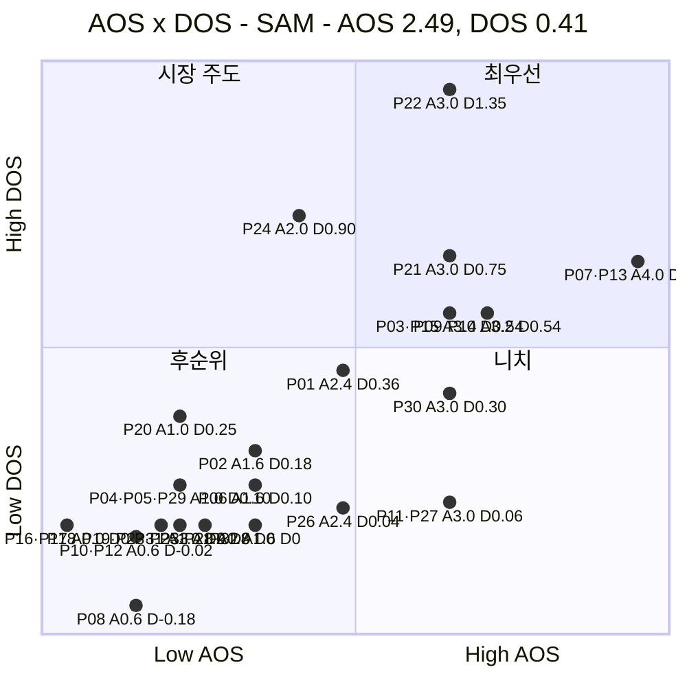
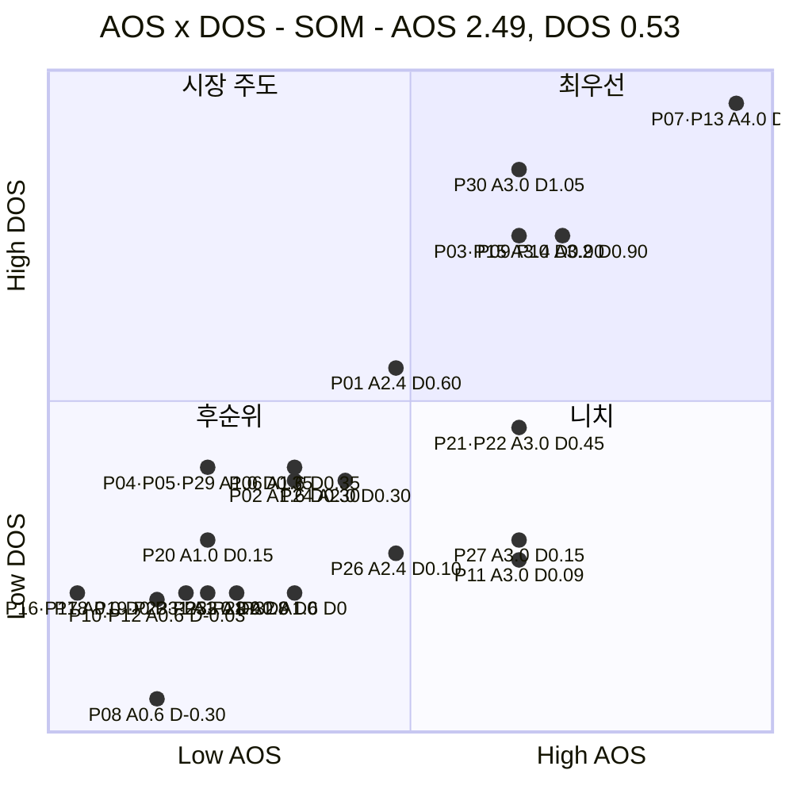

# AOS × DOS 혼합 매트릭스 ③ — 구호재원 모금 기반 식량 무상 운송 서비스

> 입력 [AOS 분석 ③](./분석-03-식량-재분배-플랫폼.md) · [DOS 분석 ③](./분석-03-식량-재분배-플랫폼-DOS.md) · [분석 방법론](./분석-방법론.md)

> 📊 **산출.** 두 점수를 한 평면에 놓는다. **X축 = AOS**(고객이 얼마나 아픈가), **Y축 = DOS**(그 아픔이 얼마나 많은 돈에 닿는가). DOS가 두 버전이므로 매트릭스도 **SAM 기준·SOM 기준 두 장**이다.

---

## 0. 축 정의와 기준선

### 왜 이 배치인가

| 축 | 지표 | 재는 것 | 출처 |
|---|---|---|---|
| **X (가로)** | **AOS** = Imp × (1 − Sat/5) | **고객 미충족의 강도** — 그 사람이 얼마나 아픈가 | AOS 분석 §3 |
| **Y (세로)** | **DOS** = (Imp − Sat) × MR | **시장 파급력** — 그 아픔이 닿는 자금의 크기 | DOS 분석 §1·§2 |

두 지표는 Importance·Satisfaction을 공유하지만 **Market Relevance의 유무**가 다르다. 따라서 이 평면의 세로 위치는 사실상 **MR이 만드는 차이**이고, **가로에서 오른쪽인데 세로에서 아래**인 항목이 곧 *"개인에게는 절실하나 시장이 작은"* 니치다.

### 기준선

| 축 | 기준값 | 산출 |
|---|:---:|---|
| **AOS** | **2.49** | AOS 분석에서 확정한 기회 경계를 그대로 승계 (36개 기준 평균 + 0.5σ) |
| **DOS (SAM)** | **0.41** | 33개 기준 평균 0.243 + 0.5σ(0.341) |
| **DOS (SOM)** | **0.53** | 33개 기준 평균 0.324 + 0.5σ(0.403) |

> 🖊️ *AOS 경계만 36개 기준이고 DOS 경계는 33개 기준이다. AOS는 다른 문서에서 이미 공표한 값이라 문서 간 일관성을 위해 그대로 가져왔다. **33개로 다시 계산하면 2.37이 되며, 그 경우 P01·P26(AOS 2.4)이 오른쪽으로 넘어간다** — 두 항목은 선 위에 걸쳐 있는 것으로 읽어야 한다.*

> ⚠️ **수혜형 3개(P34·P35·P36)는 이 평면에 없다.** DOS가 산출되지 않기 때문이며, 성과 판정 트랙으로 별도 관리한다. **AOS 공동 1위였던 P36이 여기 없다는 사실 자체가 두 지표의 성격 차이다.**

### 사분면의 의미

| 사분면 | 조건 | 이름 | 뜻 |
|---|---|---|---|
| **우상단** | AOS ↑ · DOS ↑ | 🔥 **최우선** | 고객도 아프고 시장도 크다 |
| **좌상단** | AOS ↓ · DOS ↑ | 💰 **시장 주도** | 개인의 고통은 덜하지만 자금 규모가 크다 |
| **우하단** | AOS ↑ · DOS ↓ | 🎯 **니치** | 절실하지만 그 사람들이 내는 돈이 적다 |
| **좌하단** | AOS ↓ · DOS ↓ | ⬜ **후순위** | 둘 다 작다 |

---

## 1. 혼합 매트릭스 — SAM 기준 (확장성)

| 사분면 | 개수 | 항목 |
|---|:---:|---|
| 🔥 **최우선** | **8** | **P07** 비교 공통 단위 · **P13** 건별 집행 원장 · **P09** 후원처 상대 비교 · **P14** 소액에도 동일 증명 · **P03** 진행 중 상태 신호 · **P15** 제3자 서명 증명 · **P22** 재원 갭 대시보드 · **P21** 분기 마감 실적 확정 |
| 💰 **시장 주도** | **1** | **P24** 감사 인정 근거 |
| 🎯 **니치** | **3** | **P30** 집단 단위 결과물 · **P11** 해외 결제 경로 · **P27** 자금 형식 다변화 |
| ⬜ **후순위** | **21** | P01 · P02 · P04 · P05 · P06 · P08 · P10 · P12 · P16 · P17 · P18 · P19 · P20 · P23 · P25 · P26 · P28 · P29 · P31 · P32 · P33 |

---

## 2. 혼합 매트릭스 — SOM 기준 (1년차)

| 사분면 | 개수 | 항목 |
|---|:---:|---|
| 🔥 **최우선** | **7** | **P07** 비교 공통 단위 · **P13** 건별 집행 원장 · **P30** 집단 단위 결과물 · **P09** 후원처 상대 비교 · **P14** 소액에도 동일 증명 · **P03** 진행 중 상태 신호 · **P15** 제3자 서명 증명 |
| 💰 **시장 주도** | **1** | **P01** 운영비·집행 내역 공개 |
| 🎯 **니치** | **4** | **P21** 분기 마감 실적 확정 · **P22** 재원 갭 대시보드 · **P27** 자금 형식 다변화 · **P11** 해외 결제 경로 |
| ⬜ **후순위** | **21** | P02 · P04 · P05 · P06 · P08 · P10 · P12 · P16 · P17 · P18 · P19 · P20 · P23 · P24 · P25 · P26 · P28 · P29 · P31 · P32 · P33 |

---

## 3. 두 매트릭스 대조

### 어느 칸에서 어느 칸으로 움직였나

| ID | 항목 | SAM | SOM | 왜 움직였나 |
|---|---|---|---|---|
| **P22** 재원 갭 대시보드 | 🔥 최우선 | 🔥 | 🎯 **니치** | 기관 자금이 45%인 확장 국면에서만 큰 시장이다. 1년차엔 15% |
| **P21** 분기 마감 실적 | 🔥 최우선 | 🔥 | 🎯 **니치** | 기업 자금도 같은 이유로 25% → 15% |
| **P24** 감사 인정 근거 | 💰 시장 주도 | 💰 | ⬜ **후순위** | 기관 자금에만 걸려 있어 층 이동에 가장 민감하다 |
| **P30** 집단 단위 결과물 | 🎯 니치 | 🎯 | 🔥 **최우선** | 캠페인이 1년차 최대 채널(35%)이다 |
| **P01** 운영비·집행 내역 | ⬜ 후순위 | ⬜ | 💰 **시장 주도** | 개인 정기가 18% → 30%로 커진다 |

**여섯 개는 두 매트릭스 모두 🔥 최우선에 남는다.**

| ID | 항목 | 기능 계열 |
|---|---|---|
| **P07** | 비교 가능한 공통 단위 | 공통 단위와 비교 |
| **P09** | 후원처 상대 비교 | 공통 단위와 비교 |
| **P03** | 진행 중 상태 신호 | 증명 체계 |
| **P13** | 건별 집행 원장 | 증명 체계 |
| **P14** | 소액에도 동일 증명 | 증명 체계 |
| **P15** | 제3자 서명 증명 | 증명 체계 |

> 📌 **여섯 중 넷이 증명 체계, 둘이 비교 단위다.** 페르소나 분석 · 여정 분석 · AOS · DOS · 혼합 매트릭스 — **다섯 경로가 전부 같은 두 덩어리를 가리킨다.** 모수 선택도, 축 조합도 이 결론을 바꾸지 못했다.

### 우하단(니치)에 고정된 둘

**P11**(해외 결제 경로)과 **P27**(자금 형식 다변화)은 두 매트릭스 모두 🎯 니치다. AOS 3.0으로 상위권인데 DOS는 0.06~0.15에 그친다.

> 📌 **혼합 매트릭스가 가장 잘 하는 일이 이것이다.** AOS만 보면 이 둘은 공동 6위였고, DOS만 보면 18위권이었다. **두 축을 함께 놓아야 "절실한데 작다"가 한눈에 보인다.** 버릴 항목이 아니라 **자원 배분에서 뒤로 미룰 항목**이며, 시장이 커지면 위로 올라온다.

---

## 4. 사분면별 행동 지침

| 사분면 | 무엇을 하나 | 이유 |
|---|---|---|
| 🔥 **최우선** | **MVP 범위로 잡는다.** 챕터 07 JTBD 인터뷰의 1순위 대상 | 고객 미충족과 시장 크기가 동시에 확인된 유일한 칸 |
| 💰 **시장 주도** | **영업·제안 자료로 푼다.** 제품 기능이 아닐 수 있다 | 개인의 고통이 크지 않으므로 UX가 아니라 **신뢰 문서**의 문제다. SAM의 P24(감사 근거)가 전형이다 |
| 🎯 **니치** | **로드맵 뒤로 미루되 버리지 않는다** | 절실한 사용자가 실재하므로 지지자가 된다. 시장이 커지면 최우선으로 올라온다 |
| ⬜ **후순위** | **두 갈래로 나눠 처리한다** | ① `Imp−Sat = 0` 인 위생 요건(P18·P19·P23·P25·P28·P33)은 **최소 요건 목록**으로 ② MR 0인 간접 채널(P16·P17·P31·P32)은 **별도 트랙**으로 |

> ⚠️ **후순위 21개를 한 덩어리로 처리하면 안 된다.** 이 칸에는 성격이 다른 셋이 섞여 있다 — **위생 요건**(없으면 탈락), **간접 채널**(DOS로 잴 수 없음), **진짜 후순위**(P08·P10·P12는 DOS 음수, 즉 과잉 충족).

---

## 5. 근거 등급

| 구성 요소 | 등급 | 비고 |
|---|---|---|
| 축 배치와 사분면 정의 | **(확인)** | 두 지표의 정의에서 직접 도출 |
| DOS 경계 0.41 · 0.53 | **(확인)** | 33개 분포에서 계산 (평균 + 0.5σ) |
| AOS 경계 2.49 | **(추정)** | 36개 기준 승계. 33개로 재계산 시 2.37 |
| **좌표를 이루는 Imp · Sat · MR** | **(가정)** | AOS·DOS 분석에서 승계. 인터뷰·실측 없음 |
| 사분면 배치 결과 | **(가정)** | 위 값들의 산물 |

> ⚠️ **이 매트릭스는 두 개의 파생 지표를 다시 조합한 3차 산출물이다.** AOS의 가정(Imp·Sat) 위에 DOS의 가정(MR)이 곱해지고, 그 둘을 다시 두 축으로 배치했다. **점의 정확한 위치를 믿지 말고 칸의 소속만 읽어야 하며**, 그마저도 선 위에 걸친 항목(P01·P26)은 흔들린다.

---

## 6. 다음 단계

| 순위 | 할 일 | 이유 |
|:---:|---|---|
| **1** | 🔥 **최우선 6개를 MVP 범위로 확정** | 두 매트릭스 교집합. 모수·축 조합에 흔들리지 않는다 |
| **2** | **자금원 구성비를 실제 통계로 교체 후 재배치** | Y축 전체가 이 가정 위에 있다. 특히 P22·P21·P24·P30·P01의 칸이 바뀐다 |
| **3** | 💰 **시장 주도 칸을 영업 자료 과제로 이관** | 제품 백로그가 아니다 |
| **4** | ⬜ **후순위 21개를 세 갈래로 재분류** | 위생 요건 / 간접 채널 / 과잉 충족 |

**→ 챕터 07 JTBD** 로 넘긴다. 인터뷰 1순위는 🔥 최우선 6개를 보유한 세 인물 — **극단적 투명성 요구 기부자**(P13·P14·P15) · **타 기부 플랫폼 정기 후원자**(P07·P09) · **개인 소액 정기 후원자**(P03) — 이며, 이는 DOS 인물 단위 합계 상위와도 일치한다.
