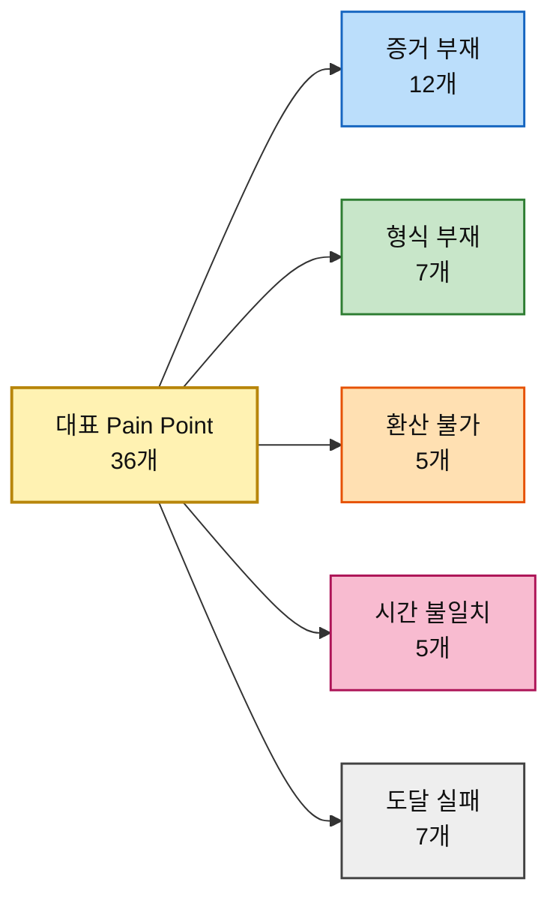
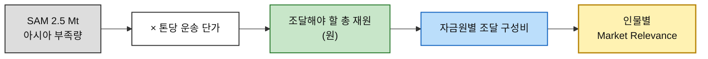

# 시장기회 분석 ③ — 구호재원 모금 기반 식량 무상 운송 서비스

> [분석 방법론](./분석-방법론.md) · 입력 [챕터 05 페르소나·고객 여정](../05-persona-journey/분석-03-식량-재분배-플랫폼.md) · 상위 [챕터 04 TAM-SAM-SOM](../04-tam-sam-som/분석-03-식량-재분배-플랫폼.md) · 후속 [챕터 07 JTBD](../07-jtbd/분석-방법론.md)

> 📕 **합본.** 방법론 1️⃣·2️⃣·4️⃣의 산출물을 한 문서로 묶었다. 네 문서로 나눠 두면 **같은 38개 항목의 점수가 네 곳에 흩어져** 한쪽만 고쳐도 어긋난다.
>
> | 부 | 내용 | 방법론 |
> |---|---|---|
> | **Ⅰ** | 평가 대상 — 대표 Pain Point 38개와 그 Goal | 2️⃣ |
> | **Ⅱ** | AOS — 조정형 기회점수 | 1️⃣ |
> | **Ⅲ** | DOS — 시장 가중형 기회점수 | 4️⃣ |
> | **Ⅳ** | 혼합 매트릭스 — AOS × DOS | — |
> | **Ⅴ** | 근거 등급과 다음 단계 | — |

> 🔄 **후속 챕터의 검증 결과를 반영한 판이다.** 초판은 12인 36개였고, 두 가지가 바뀌었다.
>
> | 무엇이 | 어떻게 | 근거 |
> |---|---|---|
> | **Satisfaction 3개 상향** | P07 1→**3** · P09 1→**2** · P14 1→**3** | [챕터 08 경쟁 조사 §4-3](../08-branding-value-proposition/경쟁사-가치선언-03-식량-재분배-플랫폼.md) — GiveWell·ShareTheMeal이 이미 제공한다 |
> | **13번째 인물과 Pain 2개 추가** | 정기 후원 해지자 → **P37 · P38** | [챕터 07 모의 세션 R8](../07-jtbd/분석-03-식량-재분배-플랫폼.md) |
>
> **Importance는 손대지 않았다.** 챕터 07의 Importance 재채점은 **모의 응답 기반(가정 위의 가정)** 이라 여기 들여오면 근거 등급이 내려간다. 반면 챕터 08의 Satisfaction 재판정은 **공개 자료 실사(확인 등급 리서치에서 도출)** 이므로 반영했다.

> ⚠️ **채점값은 전부 추정이다.** 실제 인터뷰·설문이 없다. 근거 등급은 Ⅴ부 참조.

---

# Ⅰ부. 평가 대상 — 대표 Pain Point 38개

## 1. 선정 규칙과 Goal 열의 의미

방법론 §2가 열어둔 두 질문에 먼저 답하고 추렸다.

| 방법론의 질문 | 이 분석의 답 |
|---|---|
| *"문제정의·Segment 단계의 Pain List를 쓰면 어떻게 될까?"* | **쓰지 않았다.** 챕터 04의 Q1~Q4 사분면은 이 사업에서 고객 지도가 아니라 **물자 지도**로 판명됐다. 그 단계의 Pain List로 점수를 매기면 고객이 아니라 **파트너의 고통**에 점수를 매기게 된다 |
| *"스펙트럼 4가지 중 누구의 Pain List를 써야 할까?"* | **넷 다 쓴다.** 여정지도에서 **개인은 증거에서, 기관은 승인에서 막힌다**는 것이 확인됐다. 한 유형만 고르면 다른 집단의 기회가 통째로 사라진다 |

그 위에서 인물마다 세 개씩 골랐다.

| # | 규칙 | 이유 |
|---|---|---|
| **1** | 그 인물의 **최대 병목 단계**에서 반드시 하나 | 여정지도 §14가 판정한 병목을 빠뜨리면 대표성이 없다 |
| **2** | **서로 다른 단계**에서 뽑는다 | 한 단계에 몰리면 그 인물의 여정 전체가 아니라 한 구간만 점수화된다 |
| **3** | **이탈로 직결**되는 것 우선 | 불편(inconvenience)이 아니라 중단(drop-off)을 일으키는 것 |

### Goal을 두 층으로 적은 이유

방법론 §2의 평가 단위는 *"각 페르소나의 주요 Pain·Goal"* 이다. **Pain만으로는 Importance와 Satisfaction을 매길 수 없다.** 무엇에 대한 중요도이고 무엇에 대한 충족도인지가 정해져야 점수가 의미를 갖는다.

| 층 | 무엇인가 | 어디에 쓰는가 |
|---|---|---|
| **페르소나 Goal** | 그 사람이 이 서비스와의 관계 전체에서 이루려는 것 | Importance의 상한을 잡는다 |
| **막히는 Goal** *(Pain별)* | 그 단계에서 달성하려다 막힌 구체적 목표 | **Satisfaction의 채점 대상.** *"지금 쓰는 대체 솔루션으로 이 Goal이 얼마나 달성되는가"* 를 묻는다 |

---

---

## 2. 골격 A · 개인 기부자형 — 18개

### 개인 소액 정기 후원자 「오천 원이 몇 킬로냐」

> 🎯 **페르소나 Goal** — 내 후원금이 **몇 kg을 어디로 옮겼는지** 숫자로 확인하는 것

| ID | 여정 단계 | Pain Point | 막히는 Goal | 선정 사유 |
|---|---|---|---|---|
| **P01** | ② 의심 검문 | 운영비 비율과 집행 내역이 없어 의심을 풀 근거를 찾지 못한다 | 내기 전에 **이 단체가 새지 않는다는 것을 스스로 확인**하는 것 | 결제 전 차단 지점 |
| **P02** | ③ 환산 | 금액과 결과의 관계를 몰라 얼마를 낼지 정하지 못한다 | 낼 금액을 **결과 기준으로 스스로 정하는** 것 | 이 인물을 정의하는 문제 |
| **P03** | ⑤ 공백 | 집하·선적·통관 리드타임 동안 신호가 없어 방치됐다고 느낀다 | 결제 후에도 **내 돈이 움직이고 있음을 계속 확인**하는 것 | **최대 병목** |

### 일회성 충동 기부자 「뉴스 보고 들어왔다」

> 🎯 **페르소나 Goal** — 30초 안에 결제를 끝내고, 결과는 나중에 알림으로 받는 것

| ID | 여정 단계 | Pain Point | 막히는 Goal | 선정 사유 |
|---|---|---|---|---|
| **P04** | ① 충돌 | 감정의 유효 시간이 몇 분이라 그 안에 끝나지 않으면 사라진다 | **마음이 움직인 그 순간에** 행동을 끝내는 것 | 이 여정의 제한 시간 |
| **P05** | ④ 결제 | 회원가입·본인인증을 요구하는 순간 대부분 이탈한다 | **계정을 만들지 않고** 결제를 마치는 것 | **최대 병목** |
| **P06** | ⑤ 공백 | 연락처를 받지 못하면 이 사람은 여정에서 영구히 사라진다 | 잊고 있어도 **결과가 나를 찾아오게** 하는 것 | ⑥·⑦을 통째로 삭제하는 구조적 손실 |

### 타 기부 플랫폼 정기 후원자 「이미 다른 데 후원 중」

> 🎯 **페르소나 Goal** — 같은 금액으로 더 명확한 결과. 후원처를 정리할 판단 근거를 얻는 것

| ID | 여정 단계 | Pain Point | 막히는 Goal | 선정 사유 |
|---|---|---|---|---|
| **P07** | ② 의심 검문 | 단체마다 성과 단위가 달라 비교 자체가 성립하지 않는다 | 지금 내는 곳과 여기를 **같은 잣대로 견주는** 것 | **최대 병목** |
| **P08** | ④ 결제 | 갈아타기를 요구받는다고 느끼면 죄책감 때문에 아예 중단한다 | 기존 후원을 **끊지 않고 부담 없이 시작**해 보는 것 | 전환 직전의 역효과 |
| **P09** | ⑤ 공백 | 비교 대상이 옆에 있어 무소식 기간이 곧바로 열등으로 읽힌다 | 병행 중인 두 곳 중 **어디가 나은지 계속 판단**하는 것 | 이 인물에게만 있는 상대 평가 |

### 해외 거주·비카드 결제 기부 시도자 「결제까지 못 간다」

> 🎯 **페르소나 Goal** — 실패 없이 끝까지 가는 결제 경로를 찾는 것

| ID | 여정 단계 | Pain Point | 막히는 Goal | 선정 사유 |
|---|---|---|---|---|
| **P10** | ③ 환산 | 통화 단위가 원화로만 표시되어 금액 감각이 서지 않는다 | **내가 쓰는 통화로** 금액 감각을 잡는 것 | 결제 전 이탈 요인 |
| **P11** | ④ 결제 | 해외 발행 카드 거절·국내 휴대폰 본인인증 요구·저대역 미로딩 중 어디서든 끊긴다 | **거주국에서도 끊기지 않고** 결제를 완료하는 것 | **최대 병목** |
| **P12** | ⑥ 증명 | 거주국에서 인정되지 않는 기부금영수증은 실질 혜택이 0이다 | 기부에 대한 **제도적 인정을 거주국에서도** 받는 것 | 재기부 동기 소멸 |

### 극단적 투명성 요구 기부자 「원 단위로 캐묻는다」

> 🎯 **페르소나 Goal** — 원 단위 집행 내역과 외부 감사 결과를 확보하는 것

| ID | 여정 단계 | Pain Point | 막히는 Goal | 선정 사유 |
|---|---|---|---|---|
| **P13** | ② 의심 검문 | 집계 총액만 있고 건별 집행 내역이 없어 검증이 중단된다 | 합계가 아니라 **건별로 돈의 흐름을 검증**하는 것 | **최대 병목** |
| **P14** | ②′ 소액 테스트 | 소액 기부자에게 결과 보고를 생략하면 테스트가 실패로 끝난다 | 큰돈을 넣기 전에 **작은 돈으로 이 조직을 시험**하는 것 | 이 인물 전용 단계 |
| **P15** | ⑥ 증명 | 인수 확인을 우리가 입력했다면 증명이 자기증명으로 무너진다 | **증명의 출처가 우리가 아님**을 확인하는 것 | 증명 체계의 신뢰 근간 |

### 국제 구호 불신 시민 「어차피 중간에서 샌다」

> 🎯 **페르소나 Goal** — **없다.** 안 내는 것이 합리적 선택이라고 이미 판단했다. 굳이 적자면 *"그 판단을 유지하는 것"*

| ID | 여정 단계 | Pain Point | 막히는 Goal | 선정 사유 |
|---|---|---|---|---|
| **P16** | ⓪ 무관심 | 우리 채널로는 도달 자체가 되지 않는다 | 관심 없는 사안에 **시간과 주의를 쓰지 않는** 것 *(우리와 반대 방향의 Goal)* | 여정 진입 실패 |
| **P17** | ① 충돌 | 우리가 하는 말은 광고로 분류되어 내용이 읽히지 않는다 | **광고와 정보를 빠르게 구분**해 걸러내는 것 | 화자 문제 |
| **P18** | ② 의심 검문 | 불신을 반증할 제3자 근거가 검색 결과에 존재하지 않는다 | 안 내겠다는 판단이 **옳았는지 최소 비용으로 확인**하는 것 | **여정 종료 지점** |

---

---

## 3. 골격 B · 기관 심사형 — 9개

### 기업 사회공헌·ESG 담당 「이사회에 보고할 숫자」

> 🎯 **페르소나 Goal** — 기업명으로 **분기당 "O톤 운송"** 실적을 확보하고, 임직원이 직접 참여할 형태를 만드는 것

| ID | 여정 단계 | Pain Point | 막히는 Goal | 선정 사유 |
|---|---|---|---|---|
| **P19** | ③ 설계·산정 | 돈만 내는 안은 사내 설득이 안 되는데 임직원 참여 프로그램이 준비되어 있지 않다 | 예산만 쓴 것이 아니라 **사내가 함께 움직였다고 말할 수 있는** 것 | ④ 승인의 선행 조건 |
| **P20** | ④ 내부 승인 | 결재선이 요구하는 것은 감동이 아니라 리스크 부재 증명인데 그 자료가 없다 | **결재선을 한 번에 통과**시키는 것 | **최대 병목** |
| **P21** | ⑦ 성과 수령 | 운송 리드타임과 분기 보고 마감이 어긋나면 그해 실적으로 쓸 수 없다 | **분기 보고서에 확정 수치로** 실적을 넣는 것 | **급소** — 성과가 있어도 무효가 된다 |

### 공여기관·재단 프로그램 오피서 「어디가 비어 있나」

> 🎯 **페르소나 Goal** — 재원 가용액과 부족분을 비교해 **비어 있는 칸**에 넣고, 사후 성과 보고까지 마치는 것

| ID | 여정 단계 | Pain Point | 막히는 Goal | 선정 사유 |
|---|---|---|---|---|
| **P22** | ⓪ 연간 계획 | 전 세계 재원 현황이 기관별로 흩어져 있어 출발점부터 불완전하다 | **어디가 비었는지 한눈에 보고** 배분을 시작하는 것 | 재원 대시보드 기능의 존재 이유 |
| **P23** | ④ 내부 승인 | 심의는 실적과 감사 대응 자료를 요구하는데 신생 기관은 실적이 없다 | **신생 파트너를 심의에서 방어**하는 것 | **최대 병목** |
| **P24** | ⑦ 성과 수령 | 제3자 검증이 없는 자체 보고는 감사에서 근거로 인정되지 않는다 | **감사에서 버티는 성과 근거**를 확보하는 것 | 재배분 차단 |

### 임팩트 투자·사회적 금융 담당 「톤당 얼마인가」

> 🎯 **페르소나 Goal** — 톤당 단가와 그 개선 추이를 확인해 *"돈을 더 넣으면 효율이 오르는가"* 에 답하는 것

| ID | 여정 단계 | Pain Point | 막히는 Goal | 선정 사유 |
|---|---|---|---|---|
| **P25** | ① 후보 발굴 | 법인격과 수익 모델이 불명확하면 검토 대상 목록에 오르지 못한다 | **검토 대상 목록에 올릴 수 있는지** 판정하는 것 | 진입 자체가 막힌다 |
| **P26** | ③ 설계·산정 | 톤당 운송 단가 시계열이 없어 규모의 경제 가설을 검증할 수 없다 | **돈을 더 넣으면 효율이 오르는지** 확인하는 것 | 판단 근거 부재 |
| **P27** | ④ 내부 승인 | 비영리 구조에는 회수 경로가 없어 투자 형식 자체가 성립하지 않는다 | **자금을 집행할 형식을 찾는** 것 | **최대 병목** — 형식 불일치 |

---

---

## 4. 골격 C · 매개형 — 6개

### 제3자 모금 캠페인 주최자 「우리 반이 한 트럭」

> 🎯 **페르소나 Goal** — 우리 이름으로 된 모금함 + 실시간 진척 + **"우리가 옮긴 톤수"** 결과물을 남기는 것

| ID | 여정 단계 | Pain Point | 막히는 Goal | 선정 사유 |
|---|---|---|---|---|
| **P28** | ② 신뢰 검문 | 정산 투명성을 주최자 개인이 책임져야 하면 부담 때문에 포기한다 | **내 이름을 걸어도 뒤탈이 없다**는 것을 확인하는 것 | 개설 전 이탈 |
| **P29** | ⑤ 확산 | 진척이 눈에 보이지 않으면 참여자가 안 모이고, 주최자가 먼저 포기한다 | **참여자가 계속 모이도록 판을 유지**하는 것 | **최대 병목** |
| **P30** | ⑥ 결과 회수 | 결과가 개인 단위로만 오면 '우리가 함께 한 것'이 사라진다 | *"우리가 함께 O톤을 옮겼다"* 를 **집단의 이름으로 남기는** 것 | 이 인물의 목표 그 자체 |

### 언론·연구자·정책 담당 「기사에 쓸 숫자」

> 🎯 **페르소나 Goal** — 출처가 명시된 재원·물량 데이터와 인용 가능한 시각화를 확보하는 것

| ID | 여정 단계 | Pain Point | 막히는 Goal | 선정 사유 |
|---|---|---|---|---|
| **P31** | ② 신뢰 검문 | 출처·산출식이 없으면 인용 자체가 불가능하다 | **인용해도 내가 다치지 않을 출처**인지 판정하는 것 | 인용의 최소 조건 |
| **P32** | ③ 소재 확보 | 이미지만 있고 원본 데이터가 없으면 재가공을 못 해 다른 출처로 간다 | **마감 안에 재가공 가능한 데이터**를 확보하는 것 | **최대 병목** |
| **P33** | ⑥ 결과 회수 | 지표가 소리 없이 갱신되면 과거 기사와 어긋나 인용을 후회하게 된다 | 이미 나간 기사의 수치가 **계속 유효하도록 유지**하는 것 | 재인용 차단 |

---

---

## 5. 골격 D · 수혜형 — 3개

### IPC 3+ 위기 가구 구성원 「배급소에서 결과만 만난다」

> 🎯 **페르소나 Goal** — 다음 배급이 **언제 얼마나** 나오는지 아는 것

| ID | 여정 단계 | Pain Point | 막히는 Goal | 선정 사유 |
|---|---|---|---|---|
| **P34** | ② 명단 확인 | 명단 누락 시 이의 제기 절차가 없어 그대로 배제된다 | **배급 대상에서 빠지지 않는** 것 | **최대 병목** |
| **P35** | ③ 이동·대기 | 이동 비용과 대기 시간이 수령량의 가치를 잠식한다 | **받는 양보다 드는 비용이 크지 않게** 하는 것 | 실질 수혜 감소 |
| **P36** | ⑥ 다음 배급 불확실 | 다음 배급 시점을 모르면 미리 식사를 줄이는 선제적 결식이 일어난다 | **다음 끼니를 계획할 수 있는** 것 | 여정지도가 지목한 **최대 개선 지점** |

---

---

## 6. 골격 A′ · 이탈·재진입형 — 2개

### 정기 후원 해지자 「끊은 게 아니라 다시 안 건 거다」 *(챕터 07 발견)*

> 🎯 **페르소나 Goal** — 다시 등록할 목록에서 **무엇을 하는 곳인지 기억나는** 후원처를 고르는 것

| ID | 여정 단계 | Pain Point | 막히는 Goal | 선정 사유 |
|---|---|---|---|---|
| **P37** | ① 무기억 축적 | 5년치 기부가 어떤 기억도 남기지 못했다. 남은 것은 이름 문자열뿐이다 | 재등록 시점에 **이 단체가 무엇을 했는지 떠올리는** 것 | **진짜 병목** — 탈락은 결과일 뿐 승부는 여기서 끝난다 |
| **P38** | ⑦ 대상 미정 | 재개 의사는 있는데 어디에 할지 정하지 못한다 | **다시 시작할 곳을 찾는** 것 | 가장 싼 획득 대상이 방치되어 있다 |

> 🖊️ **다른 인물은 3개씩인데 둘뿐인 이유** — 이 여정은 [챕터 07 모의 세션](../07-jtbd/분석-03-식량-재분배-플랫폼.md)에서 역산됐고, 단계별 관찰 밀도가 다른 인물보다 낮다. **인터뷰가 실제로 수행되면 세 번째가 나올 가능성이 높다.**

---

## 7. Goal 열 해설 — 38개의 목표를 세로로 읽으면

**막히는 Goal 열을 위에서 아래로 읽으면 동사가 한쪽으로 쏠린다.** 확인하다 · 검증하다 · 판정하다 · 견주다 · 방어하다 · 시험하다. 36개 중 **24개의 Goal이 무언가를 *얻는* 것이 아니라 무언가를 *판단하는* 것**이다. 나머지 12개도 대부분 *"잘못되지 않게 하는 것"* 쪽이지 *"더 얻는 것"* 이 아니다.

이것이 뜻하는 바는 분명하다. **고객이 이 서비스에서 이루려는 일은 대체로 "안전하게 결정하는 것"이다.** 식량이 옮겨지는 것은 그들이 원하는 결과이지만, 화면 앞에서 그들이 실제로 수행하는 일은 판단이다. 개인 소액 정기 후원자는 새지 않는지를 확인하려 하고, 기업 담당자는 결재선을 통과시키려 하며, 언론은 인용해도 다치지 않을지를 판정하려 하고, 임팩트 투자자는 목록에 올릴 수 있는지를 가리려 한다. **제품이 물류 서비스가 아니라 의사결정 보조 도구에 가깝다**는 여정지도 §16-6의 재정의가, Goal 열에서 독립적으로 다시 확인된다.

**두 층의 Goal이 어긋나는 자리가 특히 중요하다.** 페르소나 Goal은 대체로 결과 지향이다 — *"몇 kg을 옮겼는지 확인한다", "분기당 O톤 실적을 확보한다", "우리가 옮긴 톤수를 남긴다"*. 그런데 단계별로 막히는 Goal은 거의 전부 **위험 회피**다 — *"새지 않는지 확인", "결재선 통과", "뒤탈 없음 확인", "내가 다치지 않을 출처인지 판정"*. **원하는 것은 성과인데, 매 단계에서 실제로 하고 있는 일은 손실 회피다.** 이 간극이 여정이 길어지고 이탈이 많은 이유이며, 동시에 설계의 지침이 된다 — 각 단계에서 제공해야 할 것은 감동이 아니라 **안심의 근거**다.

**국제 구호 불신 시민의 Goal 열은 부호가 반대다.** P16의 Goal은 *"시간과 주의를 쓰지 않는 것"* 이다. 우리 서비스가 그 Goal을 달성시켜 주면 고객을 잃는다. 이 인물의 세 줄은 **AOS를 매길 때 Importance를 '우리에게 얼마나 중요한가'로 읽으면 안 된다** — 그 사람에게는 중요하고, 우리에게는 뚫어야 할 벽이다. P18(*"안 내겠다는 판단이 옳았는지 최소 비용으로 확인"*)만이 유일하게 양방향이다. 그 확인을 우리가 도와주되 결과가 반대로 나오게 만드는 것, 그것이 이 인물에 대한 유일한 접근 경로다.

**수혜형 3개만 Goal의 층위가 다르다.** P34·P35·P36의 Goal은 *"빠지지 않는 것", "비용이 크지 않게 하는 것", "다음 끼니를 계획하는 것"* 이다. 나머지 33개가 정보와 판단에 관한 것인 반면 이 셋만 **생존에 관한 것**이다. 같은 5점 척도에 올려놓으면 Importance가 전부 5로 수렴해 변별이 사라진다. **이 셋은 사업 우선순위 목록이 아니라 성과 판정 기준으로 따로 다뤄야 한다.**

**Goal이 겹치는 곳이 기능의 후보다.** *"확인하는 것"* 계열(P01·P03·P13·P15·P24·P28·P31)은 서로 다른 일곱 명이 서로 다른 단계에서 요구하지만, 요구하는 물건은 하나다 — **출처가 우리가 아닌 집행 기록**. *"견주는 것"* 계열(P02·P07·P26)은 **원 → kg → 명 공통 단위와 그 산출식** 하나로 묶인다. AOS 채점 후 상위권을 묶을 때 이 축을 쓰면 개별 Pain 36개가 아니라 **기능 단위 5~6개**로 정리된다.

---

---

## 8. 성격별 분류 — 38개를 가로지르는 다섯 갈래

| 성격 | 개수 | 해당 ID | 공통 처방 |
|---|:---:|---|---|
| **증거 부재** — 낼 근거·냈다는 증거가 없다 | **12** | P01 · P03 · P06 · P09 · P13 · P14 · P15 · P18 · P20 · P24 · P31 · P33 | 건별 집행 원장 · 진행 신호 · 제3자 검증 |
| **형식 부재** — 그릇이 없어 돈·자료가 못 들어온다 | **7** | P05 · P10 · P11 · P12 · P25 · P27 · P32 | 결제 경로 · 법인 구조 · 데이터 포맷 |
| **환산 불가** — 금액과 결과를 잇는 단위가 없다 | **5** | P02 · P07 · P19 · P26 · P30 | 원 → kg → 명 공통 단위와 산출식 |
| **시간 불일치** — 상대의 시계와 어긋난다 | **5** | P04 · P21 · P29 · P34 · P36 | 리드타임 확정과 사전 고지 |
| **도달 실패** — 여정에 들어오지도 못한다 | **7** | P08 · P16 · P17 · P22 · P23 · P28 · P35 | 화자 전환 · 진입 장벽 제거 |

> 📌 **증거 부재가 36개 중 12개로 단독 최다이며, 네 골격 전부에 걸쳐 있다.** 개인·기관·매개형이 각기 다른 이유로 같은 결핍에 걸린다. **AOS 채점 전이지만, 상위권이 이 갈래에서 나올 가능성이 높다.**

---

---

# Ⅱ부. AOS — 조정형 기회점수

**AOS = Importance × (1 − Satisfaction / 5)**

## 0. 채점 규칙

### 두 지표의 앵커

| 점수 | **Importance** — 그 사람의 Goal 달성에 이 Pain 해소가 얼마나 중요한가 | **Satisfaction** — 지금 쓰는 **대체 솔루션**이 그 Goal을 얼마나 달성시켜 주는가 |
|:---:|---|---|
| **5** | 막히면 여정이 종료된다 | 대체 솔루션이 충분히 해결하고 있다 |
| **4** | 크게 지연·왜곡되고 상당수가 이탈한다 | 대체로 해결되며 약간 아쉬운 정도다 |
| **3** | 불편하지만 우회할 수 있다 | 절반쯤 해결된다 |
| **2** | 있으면 좋은 수준이다 | 거의 해결되지 않는다 |
| **1** | 거의 영향이 없다 | 전혀 해결되지 않는다 |

> 📌 **Satisfaction의 대상은 우리 서비스가 아니다.** 방법론 2️⃣가 규정한 대로 *"기존 솔루션 생태계 하에서"* 매긴다. **대체 솔루션이 잘하고 있으면 우리에게는 기회가 아니다.**

### 사분면 기준선 — 방법론 B (평균 기반)

| 항목 | **기준선** | 초판(36개) 대비 |
|---|:---:|---|
| **Importance 기준선** — 전체 평균 μ₁ | **4.29** | 4.31 → 4.29 |
| **Satisfaction 기준선** — 전체 평균 μ₂ | **2.92** | 2.89 → 2.92 *(재판정으로 상승)* |
| **AOS 기회 경계** — 평균 1.85 + 0.5σ (σ = 1.12) | **2.41** | 2.49 → 2.41 |

**경계 처리** — Importance **평균 이상**이 상단, Satisfaction **평균 이하**가 좌측이다. 5점 척도는 정수만 나오므로 실제로는 다음과 같이 갈린다.

| 축 | 상단 / 좌측 | 하단 / 우측 |
|---|---|---|
| Importance (기준 4.29) | **5점만** (18개) | 4점 · 3점 (20개) |
| Satisfaction (기준 2.92) | **1점 · 2점** (16개, 좌측) | 3점 · 4점 · 5점 (22개, 우측) |

> ⚠️ **B는 Importance 4점을 전부 하단으로 밀어낸다.** 기준선이 4와 5 사이에 떨어지기 때문이며, **여기서 'Low Importance'는 '중요하지 않다'가 아니라 '5점이 아니다'라는 뜻**이다. 사분면 이름을 액면 그대로 읽으면 안 된다.
>
> ⚠️ **방법론이 B의 용도를 한정하고 있다** — *"이미 사업 운영중에 있고 여러차례 도출된 점수 분포가 존재하는 경우"*. **이 표본은 인터뷰 없는 추정치**이므로 평균과 σ가 실제 시장 분포를 대표한다는 보장이 없다.

---

## 1. Importance · Satisfaction Table

> `🔻` = 챕터 08 경쟁 조사로 **Satisfaction 상향**된 항목 · `🆕` = 챕터 07에서 추가된 항목

| ID | 인물 | 막히는 Goal (요약) | **Imp** | Importance 근거 | 현재 쓰는 대체 솔루션 | **Sat** | Satisfaction 근거 |
|---|---|---|:---:|---|---|:---:|---|
| **P01** | 개인 소액 정기 후원자 | 새지 않는다는 것을 스스로 확인 | **4** | 결제 전 차단 지점이나, 소액이라 완전 검증 없이 내기도 한다 | 대형 국제구호단체의 연간보고서·회계공시 | ****2**** | 공시는 있으나 총액 수준이라 개인이 확인할 수 없다 |
| **P02** | 개인 소액 정기 후원자 | 결과 기준으로 금액을 정함 | **4** | 금액 결정이 막히면 결제가 흔들린다 | 기존 단체의 *"3만원 = 아동 1명 한 달"* 식 환산 | ****3**** | 환산 자체는 널리 제공된다. 검증되지 않을 뿐 |
| **P03** | 개인 소액 정기 후원자 | 결제 후에도 계속 확인 | **5** | 해지로 직결되는 최대 병목 | 정기 뉴스레터·소식지 | ****2**** | 신호는 오지만 내 기부 건과 연결되지 않는다 |
| **P04** | 일회성 충동 기부자 | 마음이 움직인 순간에 끝냄 | **5** | 감정 유효 시간이 이 여정 전체의 제한 시간 | 기존 긴급모금 배너 + 간편결제 | ****4**** | 이미 수 초 안에 끝난다 |
| **P05** | 일회성 충동 기부자 | 계정 없이 결제 완료 | **5** | 여기서 대부분 이탈한다 | 해피빈·카카오같이가치의 로그인 상태 결제 | ****4**** | 사실상 무마찰. 기존 대안이 매우 강하다 |
| **P06** | 일회성 충동 기부자 | 결과가 나를 찾아오게 함 | **4** | ⑥·⑦ 단계를 통째로 삭제한다 | 계정 기반 완료 알림 | ****3**** | 완료 통지는 오나 결과 보고는 오지 않는다 |
| **P07** | 타 기부 플랫폼 정기 후원자 | 같은 잣대로 견줌 | **5** | 이동을 결정할 유일한 근거 | GiveWell의 단체 비교 — 생명 1명당 3,500~5,500달러라는 공통 단위 | **3** 🔻 | 국제 영역에서는 **이미 공통 단위로 비교된다** (챕터 08) |
| **P08** | 타 기부 플랫폼 정기 후원자 | 끊지 않고 병행 시작 | **3** | 소액 병행으로 우회 가능 | 기존 플랫폼도 병행 자체는 자유 | ****4**** | 추가 후원을 막는 곳은 없다 |
| **P09** | 타 기부 플랫폼 정기 후원자 | 어디가 나은지 계속 판단 | **4** | 병행 후 유지·이전 결정을 좌우 | GiveWell Top Charities 목록 — 사실상 상대 비교표 | **2** 🔻 | 목록은 있으나 **국내 단체는 대상이 아니다** (챕터 08) |
| **P10** | 해외 거주 기부 시도자 | 내 통화로 금액 감각 | **3** | 암산으로 우회 가능 | 유니세프·월드비전 등 글로벌 단체의 현지 통화 결제 | ****4**** | 국제 단체는 이미 지원한다 |
| **P11** | 해외 거주 기부 시도자 | 거주국에서 결제 완료 | **5** | 결제가 안 되면 나머지가 전부 무의미 | 국제 단체의 해외 결제 | ****2**** | 결제는 되지만 **모국 기여 동기**를 대체하지 못한다 |
| **P12** | 해외 거주 기부 시도자 | 거주국의 제도적 인정 | **3** | 기부 자체를 막지는 않는다 | 거주국 현지 단체 기부 시 세제 혜택 | ****4**** | 혜택만 놓고 보면 대안이 있다 |
| **P13** | 극단적 투명성 요구 기부자 | 건별로 돈의 흐름 검증 | **5** | 이 인물의 전부 | **없음** — 건별 집행 원장을 공개하는 단체가 없다 | ****1**** | 감사보고서는 총액 수준에 그친다 |
| **P14** | 극단적 투명성 요구 기부자 | 작은 돈으로 조직을 시험 | **4** | 본 결제로 가는 관문 | ShareTheMeal — **0.80달러 단위로 목적지 지정** | **3** 🔻 | 소액이라고 보고에서 빠지지 않는다 (챕터 08) |
| **P15** | 극단적 투명성 요구 기부자 | 증명 출처가 우리가 아님 확인 | **5** | 증명 체계의 신뢰 근간 | 한국가이드스타 평가·외부 회계감사 | ****2**** | 조직 단위 평가는 있으나 건별 인수 증명은 없다 |
| **P16** | 국제 구호 불신 시민 | 시간·주의를 쓰지 않음 | **3** | 적극적 회피 노력까지는 하지 않는다 | 광고 차단·무시 | ****5**** | 회피가 아주 잘 작동하고 있다 |
| **P17** | 국제 구호 불신 시민 | 광고와 정보 구분 | **3** | 위와 같음 | 학습된 광고 식별 | ****5**** | 위와 같음 |
| **P18** | 국제 구호 불신 시민 | 판단이 옳았는지 확인 | **4** | 자기 판단의 확인이 이 인물의 핵심 동기 | 검색하면 나오는 기부금 유용 보도 | ****4**** | 판단이 오히려 강화된다 — **우리 관점에서는 역방향** |
| **P19** | 기업 사회공헌·ESG 담당 | 사내가 함께 움직였다고 말함 | **4** | 사내 승인의 선행 조건 | 기존 대형 단체의 임직원 봉사·캠페인 프로그램 | ****4**** | 오래 축적된 강점 영역 |
| **P20** | 기업 사회공헌·ESG 담당 | 결재선을 한 번에 통과 | **5** | 승인 실패 시 집행 자체가 불가 | 기존 대형 단체의 법인 실사 자료 패키지 | ****4**** | 완비되어 있다 |
| **P21** | 기업 사회공헌·ESG 담당 | 분기 보고서에 확정 수치 | **5** | 성과가 있어도 무효가 된다 | 기존 단체의 분기 보고 | ****2**** | 사진·수기 보고 수준이라 확정 수치가 제때 오지 않는다 |
| **P22** | 공여기관 프로그램 오피서 | 어디가 비었는지 한눈에 봄 | **5** | 배분의 출발점 | OCHA FTS 및 기관별 appeal 문서 | ****2**** | 존재하나 불완전하고 수기 취합이 필요하다 |
| **P23** | 공여기관 프로그램 오피서 | 신생 파트너를 심의에서 방어 | **4** | 중요하나 기존 파트너 교체로 우회 가능 | 검증된 기존 파트너(WFP 등)로 대체 | ****4**** | 신생 파트너를 쓰지 않으면 해결된다 |
| **P24** | 공여기관 프로그램 오피서 | 감사에서 버티는 근거 | **5** | 불인정 시 재배분이 끊긴다 | 대형 기구의 외부 평가·감사 체계 | ****3**** | 기구 단위로는 있으나 사업 단위로는 부족 |
| **P25** | 임팩트 투자 담당 | 검토 목록에 올릴 수 있는지 판정 | **4** | 진입 자체가 걸린다 | 명확한 법인 구조를 갖춘 다른 소셜벤처 | ****4**** | 검토 후보는 얼마든지 있다 |
| **P26** | 임팩트 투자 담당 | 돈을 더 넣으면 효율이 오르는지 | **4** | 투자 판단의 근거 | **거의 없음** — 구호·물류 섹터의 단위 경제 시계열 | ****2**** | 톤당 단가 추이를 공개하는 곳이 드물다 |
| **P27** | 임팩트 투자 담당 | 자금을 집행할 형식을 찾음 | **5** | 형식이 없으면 집행이 불가능 | 성과연계지급(PbR)·소셜임팩트본드 | ****2**** | 형식은 존재하나 국내 적용 사례가 드물다 |
| **P28** | 제3자 모금 캠페인 주최자 | 내 이름 걸어도 뒤탈 없음 확인 | **4** | 개설 전 이탈 지점 | 해피빈·같이가치의 플랫폼 정산 책임 | ****4**** | 정산 책임을 플랫폼이 진다 |
| **P29** | 제3자 모금 캠페인 주최자 | 참여자가 모이도록 판 유지 | **5** | 캠페인의 성패 | 기존 모금 플랫폼의 실시간 진척 바 | ****4**** | 모금 진척 가시화는 이미 표준이다 |
| **P30** | 제3자 모금 캠페인 주최자 | 집단의 이름으로 결과를 남김 | **5** | 이 인물의 목표 그 자체 | 기존 플랫폼의 모금액 총계 | ****2**** | 금액은 나오나 집단 성과물이 남지 않는다 |
| **P31** | 언론·연구자·정책 담당 | 인용해도 안 다칠 출처인지 판정 | **5** | 인용의 최소 조건 | FAO·WFP·OCHA 원문 | ****4**** | 출처와 산출식이 명확하다 |
| **P32** | 언론·연구자·정책 담당 | 마감 안에 재가공 가능한 데이터 | **4** | 마감 내 사용 가능성을 좌우 | FAO CSV·OCHA FTS API | ****3**** | 원본은 있으나 최신성·통합성이 부족하다 |
| **P33** | 언론·연구자·정책 담당 | 나간 기사의 수치가 계속 유효 | **3** | 사후 리스크 | 기관 데이터의 기준일·버전 표기 | ****3**** | 표기하는 편이나 알림은 오지 않는다 |
| **P34** | IPC 3+ 위기 가구 구성원 | 배급 대상에서 빠지지 않음 | **5** | 생존 직결 | 현행 배급 체계의 명단 관리 | ****2**** | 이의 제기 절차가 정비되어 있지 않다 |
| **P35** | IPC 3+ 위기 가구 구성원 | 비용이 받는 양보다 크지 않게 | **4** | 실질 수혜량을 결정 | 현행 배급소 운영 | ****2**** | 이동 비용 문제를 거의 다루지 못한다 |
| **P36** | IPC 3+ 위기 가구 구성원 | 다음 끼니를 계획할 수 있음 | **5** | 선제적 결식을 유발한다 | **거의 없음** — 다음 배급 사전 고지 | ****1**** | 현행 체계에서 예정일이 공지되지 않는다 |
| **P37** | 정기 후원 해지자 | 재등록 시점에 이 단체가 무엇을 했는지 떠올림 | **5** | 기억나지 않으면 후보에조차 오르지 않는다 | **없음** — 5년 후원해도 아무것도 남지 않는다 | **1** 🆕 | 단체가 기억에 남기는 장치를 갖고 있지 않다 |
| **P38** | 정기 후원 해지자 | 다시 시작할 곳을 찾음 | **3** | 의사는 있으나 대상 선정이 막힌다 | **없음** — 재개 의사자를 돕는 경로가 없다 | **1** 🆕 | 이탈자 대상 재진입 안내가 존재하지 않는다 |

---

## 2. AOS Table — 내림차순

`★` = AOS 기회 경계(**2.41**) 이상 · 사분면은 방법론 B 기준(Imp 4.29 · Sat 2.92)

| 순위 | ID | 인물 | Pain Point (요약) | Imp | Sat | **AOS** | 사분면 |
|:---:|---|---|---|:---:|:---:|:---:|:---:|
| 1 | **P13** | 극단적 투명성 요구 기부자 | 집계 총액만 있고 건별 집행 내역이 없다 | 5 | 1 | **4** ★ | 🔥 Q1 |
| 1 | **P36** | IPC 3+ 위기 가구 구성원 | 다음 배급 시점을 몰라 선제적 결식이 일어난다 | 5 | 1 | **4** ★ | 🔥 Q1 |
| 1 | **P37** | 정기 후원 해지자 | 5년을 냈는데 무엇을 하는 곳인지 기억나지 않는다 🆕 *챕터 07 신규* | 5 | 1 | **4** ★ | 🔥 Q1 |
| 4 | **P03** | 개인 소액 정기 후원자 | 리드타임 동안 신호가 없어 방치됐다고 느낀다 | 5 | 2 | **3** ★ | 🔥 Q1 |
| 4 | **P11** | 해외 거주 기부 시도자 | 카드 거절·본인인증·저대역 중 어디서든 끊긴다 | 5 | 2 | **3** ★ | 🔥 Q1 |
| 4 | **P15** | 극단적 투명성 요구 기부자 | 인수 확인을 우리가 입력하면 자기증명이 된다 | 5 | 2 | **3** ★ | 🔥 Q1 |
| 4 | **P21** | 기업 사회공헌·ESG 담당 | 리드타임과 분기 마감이 어긋나 실적으로 못 쓴다 | 5 | 2 | **3** ★ | 🔥 Q1 |
| 4 | **P22** | 공여기관 프로그램 오피서 | 전 세계 재원 현황이 흩어져 출발점이 불완전하다 | 5 | 2 | **3** ★ | 🔥 Q1 |
| 4 | **P27** | 임팩트 투자 담당 | 회수 경로가 없어 투자 형식이 성립하지 않는다 | 5 | 2 | **3** ★ | 🔥 Q1 |
| 4 | **P30** | 제3자 모금 캠페인 주최자 | 결과가 개인 단위로만 와 '함께 한 것'이 사라진다 | 5 | 2 | **3** ★ | 🔥 Q1 |
| 4 | **P34** | IPC 3+ 위기 가구 구성원 | 명단 누락 시 이의 절차가 없어 배제된다 | 5 | 2 | **3** ★ | 🔥 Q1 |
| 12 | **P01** | 개인 소액 정기 후원자 | 운영비·집행 내역이 없어 의심을 풀 수 없다 | 4 | 2 | **2.4** | ⚫ Q3 |
| 12 | **P09** | 타 기부 플랫폼 정기 후원자 | 무소식 기간이 곧바로 열등으로 읽힌다 🔻 *Sat 1→2 (챕터 08)* | 4 | 2 | **2.4** | ⚫ Q3 |
| 12 | **P26** | 임팩트 투자 담당 | 톤당 단가 시계열이 없어 가설을 검증 못 한다 | 4 | 2 | **2.4** | ⚫ Q3 |
| 12 | **P35** | IPC 3+ 위기 가구 구성원 | 이동 비용과 대기가 수령량의 가치를 잠식한다 | 4 | 2 | **2.4** | ⚫ Q3 |
| 12 | **P38** | 정기 후원 해지자 | 재개 의사는 있으나 어디에 할지 정하지 못한다 🆕 *챕터 07 신규* | 3 | 1 | **2.4** | ⚫ Q3 |
| 17 | **P07** | 타 기부 플랫폼 정기 후원자 | 단체마다 성과 단위가 달라 비교가 성립하지 않는다 🔻 *Sat 1→3 (챕터 08)* | 5 | 3 | **2** | 💎 Q2 |
| 17 | **P24** | 공여기관 프로그램 오피서 | 제3자 검증 없는 자체 보고는 감사에서 불인정 | 5 | 3 | **2** | 💎 Q2 |
| 19 | **P02** | 개인 소액 정기 후원자 | 금액과 결과의 관계를 몰라 금액을 못 정한다 | 4 | 3 | **1.6** | ⚠️ Q4 |
| 19 | **P06** | 일회성 충동 기부자 | 연락처 미확보 시 여정에서 영구히 사라진다 | 4 | 3 | **1.6** | ⚠️ Q4 |
| 19 | **P14** | 극단적 투명성 요구 기부자 | 소액 기부자에게 결과 보고가 생략된다 🔻 *Sat 1→3 (챕터 08)* | 4 | 3 | **1.6** | ⚠️ Q4 |
| 19 | **P32** | 언론·연구자·정책 담당 | 원본 데이터가 없어 다른 출처로 간다 | 4 | 3 | **1.6** | ⚠️ Q4 |
| 23 | **P33** | 언론·연구자·정책 담당 | 소리 없는 갱신으로 과거 기사와 어긋난다 | 3 | 3 | **1.2** | ⚠️ Q4 |
| 24 | **P04** | 일회성 충동 기부자 | 감정 유효 시간이 몇 분이다 | 5 | 4 | **1** | 💎 Q2 |
| 24 | **P05** | 일회성 충동 기부자 | 회원가입·본인인증 요구 시 이탈한다 | 5 | 4 | **1** | 💎 Q2 |
| 24 | **P20** | 기업 사회공헌·ESG 담당 | 결재선이 요구하는 리스크 부재 증명 자료가 없다 | 5 | 4 | **1** | 💎 Q2 |
| 24 | **P29** | 제3자 모금 캠페인 주최자 | 진척이 안 보이면 참여자가 모이지 않는다 | 5 | 4 | **1** | 💎 Q2 |
| 24 | **P31** | 언론·연구자·정책 담당 | 출처·산출식이 없으면 인용이 불가능하다 | 5 | 4 | **1** | 💎 Q2 |
| 29 | **P18** | 국제 구호 불신 시민 | 불신을 반증할 제3자 근거가 검색에 없다 | 4 | 4 | **0.8** | ⚠️ Q4 |
| 29 | **P19** | 기업 사회공헌·ESG 담당 | 임직원 참여 프로그램이 준비되어 있지 않다 | 4 | 4 | **0.8** | ⚠️ Q4 |
| 29 | **P23** | 공여기관 프로그램 오피서 | 신생 기관은 심의에 낼 실적이 없다 | 4 | 4 | **0.8** | ⚠️ Q4 |
| 29 | **P25** | 임팩트 투자 담당 | 법인격·수익 모델이 불명확해 목록에 못 오른다 | 4 | 4 | **0.8** | ⚠️ Q4 |
| 29 | **P28** | 제3자 모금 캠페인 주최자 | 정산 책임을 주최자 개인이 져야 한다 | 4 | 4 | **0.8** | ⚠️ Q4 |
| 34 | **P08** | 타 기부 플랫폼 정기 후원자 | 갈아타기 요구 시 죄책감으로 중단한다 | 3 | 4 | **0.6** | ⚠️ Q4 |
| 34 | **P10** | 해외 거주 기부 시도자 | 원화로만 표시되어 금액 감각이 안 선다 | 3 | 4 | **0.6** | ⚠️ Q4 |
| 34 | **P12** | 해외 거주 기부 시도자 | 거주국에서 영수증이 인정되지 않는다 | 3 | 4 | **0.6** | ⚠️ Q4 |
| 37 | **P16** | 국제 구호 불신 시민 | 우리 채널로는 도달 자체가 되지 않는다 | 3 | 5 | **0** | ⚠️ Q4 |
| 37 | **P17** | 국제 구호 불신 시민 | 우리 말은 광고로 분류되어 읽히지 않는다 | 3 | 5 | **0** | ⚠️ Q4 |

> 🔻 **재판정 3개가 전부 순위에서 내려갔다.** P07은 **공동 1위(4.0) → 17위(2.0)**, P14는 **4위(3.2) → 21위(1.6)**, P09는 4위(3.2) → 12위(2.4)다. **초판의 상위권 다섯 중 셋이 경쟁 조사 한 번에 무너졌다.**
>
> 🆕 **P37이 그 빈자리를 채웠다.** AOS 4.0으로 P13·P36과 공동 1위이며, **초판에 인물조차 없던 자리에서 나왔다.**
>
> 📌 **이번 판에서는 ★와 Q1이 정확히 일치한다.** 초판은 ★ 13개 / Q1 11개로 어긋났는데, Satisfaction 재판정이 그 어긋남을 없앴다. **P09·P14가 Q3에 앉은 채로 ★를 달고 있던 문제**가 해소된 것이다.

---

## 3. Matrix — 사분면 배치

### 셀 매트릭스 (행 = Importance, 열 = Satisfaction)

기준선: **Importance 4.29 · Satisfaction 2.92** · `★` 는 AOS 기회 경계 **2.41** 이상

| Imp \ Sat | **1** | **2** | ┃ | **3** | **4** | **5** |
|:---:|---|---|:---:|---|---|---|
| **5** | 🔥 ★ **P13** · **P36** · **P37** *AOS 4* | 🔥 ★ **P03** · **P11** · **P15** · **P21** · **P22** · **P27** · **P30** · **P34** *AOS 3* | ┃ | 💎 **P07** · **P24** *AOS 2* | 💎 **P04** · **P05** · **P20** · **P29** · **P31** *AOS 1* | — |
| ━━ | ━━ | ━━ | ╋ | ━━ | ━━ | ━━ |
| **4** | — | ⚫ **P01** · **P09** · **P26** · **P35** *AOS 2.4* | ┃ | ⚠️ **P02** · **P06** · **P14** · **P32** *AOS 1.6* | ⚠️ **P18** · **P19** · **P23** · **P25** · **P28** *AOS 0.8* | — |
| **3** | ⚫ **P38** *AOS 2.4* | — | ┃ | ⚠️ **P33** *AOS 1.2* | ⚠️ **P08** · **P10** · **P12** *AOS 0.6* | ⚠️ **P16** · **P17** *AOS 0* |

| 기호 | 사분면 | 조건 | 개수 |
|:---:|---|---|:---:|
| 🔥 | **Q1 혁신기회** | Imp ≥ 4.29 + Sat ≤ 2.92 | **11** |
| 💎 | **Q2 개선기회** | Imp ≥ 4.29 + Sat > 2.92 | **7** |
| ⚫ | **Q3 유지관리** | Imp < 4.29 + Sat ≤ 2.92 | **5** |
| ⚠️ | **Q4 과잉투자** | Imp < 4.29 + Sat > 2.92 | **15** |
| ★ | **AOS 기회 영역** | AOS ≥ 2.41 | **11** *(= Q1과 동일)* |

---

## 4. 해석

### 4-1. 최상위 3개 — 대체 솔루션이 아예 없는 자리

AOS 만점권(4.0)에 오른 셋은 모두 **Satisfaction 1**, 즉 지금 그 일을 해 주는 것이 세상에 없다.

| ID | 무엇이 없는가 | 검증 상태 |
|---|---|---|
| **P13** | **건별 집행 원장**을 공개하는 구호 단체가 없다 | ✅ **두 조사를 모두 통과했다** — 경쟁 8곳 중 어디도 하지 않고, 모의 세션에서도 요구가 확인됐다 |
| **P36** | 수혜 가구에게 **다음 배급 예정일을 미리 알려주는** 체계가 없다 | ⚠️ 조사 범위 안에서 못 찾았다는 뜻이지 존재하지 않는다는 뜻은 아니다 |
| **P37** | 5년을 후원해도 **그 단체가 무엇을 했는지 기억에 남기는** 장치가 없다 | 🆕 경쟁 조사가 *"여덟 곳 모두 어떻게 받을 것인가만 말하고 어떻게 기억될 것인가는 아무도 말하지 않는다"* 로 확인 |

> 📌 **초판에서는 여기에 P07(비교 단위)이 있었다.** 그 자리를 P37이 대신했다는 사실이 이 챕터에서 일어난 가장 큰 변화다. **"비교하게 해 주는 것"에서 "기억에 남는 것"으로 1순위가 옮겨 갔다.**

### 4-2. Q2 7개 — 잘해도 이기지 못하는 영역

Q2(High Importance + High Satisfaction)에는 **중요하지만 기존 대안이 이미 잘 해내는** 항목이 모였다. 결제 속도(P04·P05), 법인 실사 자료(P20), 모금 진척 바(P29), 출처 명시(P31), 기구 단위 외부 평가(P24), 그리고 **재판정으로 내려온 P07**이 여기 있다.

> ⚠️ **AOS가 낮다고 해서 안 만들어도 된다는 뜻이 아니다.** 이들은 **위생 요인**이다 — 갖춰도 차별화되지 않지만, 없으면 그 자리에서 탈락한다.
>
> **AOS는 "무엇으로 이길 것인가"를 알려주지 "무엇을 안 만들어도 되는가"를 알려주지 않는다.** Q2는 **최소 요건 목록**으로 따로 관리해야 하며, Q4 15개 중에도 위생 요인이 섞여 있다(P06 연락처 확보 · P19 임직원 참여 · P28 정산 책임).

### 4-3. Q3 5개 — 이름을 그대로 믿으면 안 되는 칸

Low Importance + Low Satisfaction 칸에 **P01 · P09 · P26 · P35 · P38** 다섯이 들어갔다. 전부 AOS 2.4로 **기회 경계(2.41) 바로 아래**다.

> ⚠️ **Q3에 떨어진 이유는 중요도가 낮아서가 아니라 Importance가 5점이 아니어서다.** 경계값이 0.01만 움직여도 다섯 개가 통째로 ★를 단다. **이 칸의 이름을 "유지관리"로 읽고 UX 최적화 대상으로 넘기면 안 된다.**

### 4-4. 국제 구호 불신 시민 — AOS가 0으로 나온 이유

P16·P17이 유일한 **AOS 0.0**이다. 이 사람의 Goal은 *"시간과 주의를 쓰지 않는 것"* 이고, 현재 그 Goal은 **완벽하게 달성되고 있다**(Satisfaction 5).

> 📌 **채점이 정확히 작동했다.** 이는 **마케팅 예산을 여기에 쓰지 말라**는 판정이다. 유일한 예외가 **P18(AOS 0.8)** — *"안 내겠다는 판단이 옳았는지 확인"* 은 양방향 Goal이므로, 이 인물을 여는 통로는 P18 하나뿐이고 그마저 **언론·연구자를 통한 간접 경로**여야 한다.

### 4-5. 수혜형 3개는 목록에서 분리한다

P36(4.0 · Q1)·P34(3.0 · Q1)·P35(2.4 · Q3)는 전부 상위권이지만, 이 사람은 **우리에게 돈을 내지 않는다.**

> 📌 **분리해서 읽는다.** 세 항목의 AOS 합 **9.4**는 *"사업 기회의 크기"* 가 아니라 **성과 판정 기준의 강도**다. 다만 P36(다음 배급 예정일)은 P21(분기 마감 실적 확정)과 **같은 역량(리드타임 확정)에서 나온다** — 사회적 성과와 상업적 성과가 한 투자에서 나오는 드문 정렬이다.

### 4-6. 기능 단위로 환원 — AOS 2.0 이상

개별 Pain을 처방이 같은 것끼리 묶으면 **여섯 덩어리**가 된다.

| 기능 | 포함 Pain | 항목 수 | **AOS 합** | 초판 대비 |
|---|---|:---:|:---:|---|
| **① 증명 체계** — 건별 집행 원장 · 인수 확인 주체 · 진행 중 신호 · 운영비 내역 · 감사 근거 | P13 · P15 · P03 · P01 · P24 | 5 | **14.4** | 17.6 → 14.4 *(P14 이탈)* |
| **② 기억·재접촉** — 이름 인지 유지 · 재시작 경로 | P37 · P38 | 2 | **6.4** | 🆕 **신규 2위** |
| **③ 자금 그릇** — 형식·경로 다변화 (PbR·대출·해외 결제) | P27 · P11 | 2 | **6.0** | 유지 |
| **④ 재원 가시화** — 갭 대시보드와 단위 경제 지표 | P22 · P26 | 2 | **5.4** | 유지 |
| **⑤ 시점 확정** — 분기 마감 기준 실적 확정 | P21 | 1 | **3.0** | 유지 |
| **⑥ 집단 결과물** — 캠페인 단위 성과 산출 | P30 | 1 | **3.0** | 유지 |
| ~~**⑦ 비교 단위**~~ | ~~P07 · P09~~ | ~~2~~ | ~~4.4~~ | ❌ **2위(7.2)에서 소멸** |
| *(별도)* **수혜 접근성** | P36 · P34 · P35 | 3 | *9.4* | 성과 판정 트랙 |

> 📌 **증명 체계가 여전히 1위이고, 격차는 오히려 벌어졌다.** 초판에서는 2위 '비교 단위'(7.2)의 2.4배였는데, 지금은 2위 '기억·재접촉'(6.4)의 2.3배다. **1위가 흔들린 것이 아니라 2위가 교체됐다.**
>
> 🎯 **'기억·재접촉'은 초판의 어떤 문서에도 없던 덩어리다.** 두 Pain 모두 *"고객이 우리를 잊는 것"* 을 다루며, **인터뷰(모의)에서만 나올 수 있는 발견**이었다. 채점표는 이미 아는 것에만 점수를 매긴다 — 이것이 인터뷰를 대체할 수 없는 이유다.
>
> ⚠️ **다만 1위 기능의 원천을 우리가 소유하지 않는다.** 인수 확인 데이터는 수령 채널에서 나온다. **AOS 1위 기능의 구현 조건이 제품 개발이 아니라 파트너 협상**이다.

---

# Ⅲ부. DOS — 시장 가중형 기회점수

**DOS = (Importance − Satisfaction) × Market Relevance** · **SAM 기준**(확장성)과 **SOM 기준**(1년차 실행) 두 버전

## 0. Market Relevance 정의

### 모수를 SAM으로 잡고 SOM을 병기하는 이유

| 모수 | 판정 | 사유 |
|---|:---:|---|
| **TAM** (세계 식량 손실 500 Mt) | ❌ | **인과가 끊긴다.** 어떤 Pain을 고쳐도 세계 폐기량의 몇 %가 움직인다고 말할 수 없어 MR이 전부 0에 수렴한다 |
| **SAM** (아시아 부족량 2.5 Mt) | ✅ **기본** | 방법론이 DOS의 목적을 **"시장 확장성 검증"** 으로 규정한다. 그리고 챕터 04 §6이 지적한 TAM/SAM 측정 대상 불일치에서 **정의가 바뀌지 않는 유일한 층**이다 |
| **SOM** (1년차 25,000 t) | ✅ **병기** | 확장성이 아니라 **1년차 실행 순서**를 본다. AOS가 이미 실행 관점을 담당하므로 SOM만 쓰면 두 지표가 같은 것을 두 번 재게 되지만, SAM과 나란히 놓으면 **"지금 할 것"과 "커지려면 할 것"의 차이**가 드러난다 |

### 톤이 아니라 재원으로 환산한다

38개 중 **35개가 돈을 내는 사람의 Pain**이다. 분자가 기부자의 미충족인데 분모가 식량 톤이면 단위가 맞지 않는다.

**톤은 성과 단위, 원은 시장 단위다.** SOM 기준도 같은 방식으로 `25,000 t × 톤당 운송 단가` 로 환산한다.

### MR 부여 규칙 세 가지

| # | 규칙 | 이유 |
|---|---|---|
| **1** | **MR은 Pain별이 아니라 인물별로 부여한다** | Pain마다 다르게 주면 Importance를 두 번 세게 된다. 방법론이 DOS를 *"고객 미충족 × 시장 파급력"* 으로 정의한 것은 **두 항이 독립**이라는 뜻이다 |
| **2** | **MR의 합은 1이 아니어도 된다** | 방법론 예시도 0.8 + 0.6 + 0.7 = 2.1이다. MR은 예산 배분표가 아니라 *"이 Pain이 닿는 시장의 상대적 크기"* 이므로, 같은 지갑을 다른 경로로 공략하는 인물들이 각자 MR을 갖는 것이 정상이다 |
| **3** | **비지불 인물은 MR 0, 수혜형은 산출 제외** | 언론·연구자와 불신 시민의 간접 기여를 다른 인물 MR에 얹으면 이중 계산이 된다. 수혜형 3개(P34·P35·P36)는 AOS에서 이미 분리한 대로 **성과 판정 트랙**에 남긴다 |

### 자금원 구성비 — 층마다 다르다

MR은 비율이므로 분모의 절대 크기는 무의미하다. **결과를 가르는 것은 층마다 조달 구성이 다르다는 사실이다.**

| 자금원 | **SAM 기준** | **SOM 기준** | 차이의 근거 |
|---|:---:|:---:|---|
| 기관 공여 (정부 ODA·국제기구·재단) | **45%** | 15% | SAM 규모는 기관 자금 없이 불가능하다. 반면 1년차 신생 조직은 심의를 통과하기 어렵다 (P23) |
| 기업 (CSR·매칭그랜트) | **25%** | 15% | 기업도 실적 없는 신생과는 계약을 꺼린다 (P20) |
| 개인 정기 | 18% | **30%** | 1년차 매출의 중심 |
| 개인 일회성·캠페인 | 10% | **35%** | 사건 기반 유입과 제3자 캠페인이 초기에 가장 빠른 채널 |
| 임팩트 자본·대출 | 2% | 5% | 두 층 모두 작다. 형식 자체가 성립하지 않는다 (P27) |

### 인물별 Market Relevance

| 인물 | 자금원 | **SAM MR** | **SOM MR** |
|---|---|:---:|:---:|
| 공여기관·재단 프로그램 오피서 「어디가 비어 있나」 | 기관 공여 | **0.45** | 0.15 |
| 기업 사회공헌·ESG 담당 「이사회에 보고할 숫자」 | 기업 | **0.25** | 0.15 |
| 개인 소액 정기 후원자 「오천 원이 몇 킬로냐」 | 개인 정기 | 0.18 | **0.30** |
| 타 기부 플랫폼 정기 후원자 「이미 다른 데 후원 중」 | 개인 정기 (획득 경로) | 0.18 | **0.30** |
| 극단적 투명성 요구 기부자 「원 단위로 캐묻는다」 | 개인 정기 (성향 집단) | 0.18 | **0.30** |
| **정기 후원 해지자 「끊은 게 아니라 다시 안 건 거다」** 🆕 | 개인 정기 (이탈 상태) | 0.18 | **0.30** |
| 일회성 충동 기부자 「뉴스 보고 들어왔다」 | 개인 일회성 | 0.10 | **0.35** |
| 제3자 모금 캠페인 주최자 「우리 반이 한 트럭」 | 개인 일회성·캠페인 | 0.10 | **0.35** |
| 임팩트 투자·사회적 금융 담당 「톤당 얼마인가」 | 임팩트 자본 | 0.02 | 0.05 |
| 해외 거주·비카드 결제 기부 시도자 「결제까지 못 간다」 | 개인 계열 하위 | 0.02 | 0.03 |
| 언론·연구자·정책 담당 「기사에 쓸 숫자」 | 없음 (간접 채널) | **0.00** | **0.00** |
| 국제 구호 불신 시민 「어차피 중간에서 샌다」 | 없음 (잠재 시장) | **0.00** | **0.00** |
| IPC 3+ 위기 가구 구성원 「배급소에서 결과만 만난다」 | — | *산출 제외* | *산출 제외* |

> 📌 **개인 정기 계열 네 인물이 같은 MR을 갖는다.** 개인 소액 정기 후원자 · 타 기부 플랫폼 정기 후원자 · 극단적 투명성 요구 기부자 · 정기 후원 해지자는 **같은 지갑을 네 각도에서 본 것**이다 — 각각 유지 중 · 병행 중 · 검증 중 · 빠져나간 상태다. 규칙 2에 따라 각자 시장 크기를 그대로 받는다. 보수적으로 잡은 값이며, 실제로는 투명성 개선이 기관 자금까지 파급되므로 과소평가일 수 있다.

---

---

## 1. DOS Table — SAM 기준 (확장성)

| 순위 | ID | 인물 | Pain Point (요약) | Imp−Sat | MR | **DOS** |
|:---:|---|---|---|:---:|:---:|:---:|
| 1 | **P22** | 공여기관 프로그램 오피서 | 전 세계 재원 현황이 흩어져 출발점이 불완전하다 | 3 | 0.45 | **1.35** |
| 2 | **P24** | 공여기관 프로그램 오피서 | 제3자 검증 없는 자체 보고는 감사에서 불인정 | 2 | 0.45 | **0.9** |
| 3 | **P21** | 기업 사회공헌·ESG 담당 | 리드타임과 분기 마감이 어긋나 실적으로 못 쓴다 | 3 | 0.25 | **0.75** |
| 4 | **P13** | 극단적 투명성 요구 기부자 | 집계 총액만 있고 건별 집행 내역이 없다 | 4 | 0.18 | **0.72** |
| 4 | **P37** | 정기 후원 해지자 | 5년을 냈는데 무엇을 하는 곳인지 기억나지 않는다 | 4 | 0.18 | **0.72** |
| 6 | **P03** | 개인 소액 정기 후원자 | 리드타임 동안 신호가 없어 방치됐다고 느낀다 | 3 | 0.18 | **0.54** |
| 6 | **P15** | 극단적 투명성 요구 기부자 | 인수 확인을 우리가 입력하면 자기증명이 된다 | 3 | 0.18 | **0.54** |
| 8 | **P01** | 개인 소액 정기 후원자 | 운영비·집행 내역이 없어 의심을 풀 수 없다 | 2 | 0.18 | **0.36** |
| 8 | **P07** | 타 기부 플랫폼 정기 후원자 | 단체마다 성과 단위가 달라 비교가 성립하지 않는다 | 2 | 0.18 | **0.36** |
| 8 | **P09** | 타 기부 플랫폼 정기 후원자 | 무소식 기간이 곧바로 열등으로 읽힌다 | 2 | 0.18 | **0.36** |
| 8 | **P38** | 정기 후원 해지자 | 재개 의사는 있으나 어디에 할지 정하지 못한다 | 2 | 0.18 | **0.36** |
| 12 | **P30** | 제3자 모금 캠페인 주최자 | 결과가 개인 단위로만 와 '함께 한 것'이 사라진다 | 3 | 0.1 | **0.3** |
| 13 | **P20** | 기업 사회공헌·ESG 담당 | 결재선이 요구하는 리스크 부재 증명 자료가 없다 | 1 | 0.25 | **0.25** |
| 14 | **P02** | 개인 소액 정기 후원자 | 금액과 결과의 관계를 몰라 금액을 못 정한다 | 1 | 0.18 | **0.18** |
| 14 | **P14** | 극단적 투명성 요구 기부자 | 소액 기부자에게 결과 보고가 생략된다 | 1 | 0.18 | **0.18** |
| 16 | **P04** | 일회성 충동 기부자 | 감정 유효 시간이 몇 분이다 | 1 | 0.1 | **0.1** |
| 16 | **P05** | 일회성 충동 기부자 | 회원가입·본인인증 요구 시 이탈한다 | 1 | 0.1 | **0.1** |
| 16 | **P06** | 일회성 충동 기부자 | 연락처 미확보 시 여정에서 영구히 사라진다 | 1 | 0.1 | **0.1** |
| 16 | **P29** | 제3자 모금 캠페인 주최자 | 진척이 안 보이면 참여자가 모이지 않는다 | 1 | 0.1 | **0.1** |
| 20 | **P11** | 해외 거주 기부 시도자 | 카드 거절·본인인증·저대역 중 어디서든 끊긴다 | 3 | 0.02 | **0.06** |
| 20 | **P27** | 임팩트 투자 담당 | 회수 경로가 없어 투자 형식이 성립하지 않는다 | 3 | 0.02 | **0.06** |
| 22 | **P26** | 임팩트 투자 담당 | 톤당 단가 시계열이 없어 가설을 검증 못 한다 | 2 | 0.02 | **0.04** |
| 23 | **P16** | 국제 구호 불신 시민 | 우리 채널로는 도달 자체가 되지 않는다 | -2 | 0 | **0** |
| 23 | **P17** | 국제 구호 불신 시민 | 우리 말은 광고로 분류되어 읽히지 않는다 | -2 | 0 | **0** |
| 23 | **P18** | 국제 구호 불신 시민 | 불신을 반증할 제3자 근거가 검색에 없다 | 0 | 0 | **0** |
| 23 | **P19** | 기업 사회공헌·ESG 담당 | 임직원 참여 프로그램이 준비되어 있지 않다 | 0 | 0.25 | **0** |
| 23 | **P23** | 공여기관 프로그램 오피서 | 신생 기관은 심의에 낼 실적이 없다 | 0 | 0.45 | **0** |
| 23 | **P25** | 임팩트 투자 담당 | 법인격·수익 모델이 불명확해 목록에 못 오른다 | 0 | 0.02 | **0** |
| 23 | **P28** | 제3자 모금 캠페인 주최자 | 정산 책임을 주최자 개인이 져야 한다 | 0 | 0.1 | **0** |
| 23 | **P31** | 언론·연구자·정책 담당 | 출처·산출식이 없으면 인용이 불가능하다 | 1 | 0 | **0** |
| 23 | **P32** | 언론·연구자·정책 담당 | 원본 데이터가 없어 다른 출처로 간다 | 1 | 0 | **0** |
| 23 | **P33** | 언론·연구자·정책 담당 | 소리 없는 갱신으로 과거 기사와 어긋난다 | 0 | 0 | **0** |
| 33 | **P10** | 해외 거주 기부 시도자 | 원화로만 표시되어 금액 감각이 안 선다 | -1 | 0.02 | **-0.02** |
| 33 | **P12** | 해외 거주 기부 시도자 | 거주국에서 영수증이 인정되지 않는다 | -1 | 0.02 | **-0.02** |
| 35 | **P08** | 타 기부 플랫폼 정기 후원자 | 갈아타기 요구 시 죄책감으로 중단한다 | -1 | 0.18 | **-0.18** |

**SAM 기준 DOS 총합 8.21** · 양수 22개 · 0 10개 · 음수 3개

---

## 2. DOS Table — SOM 기준 (1년차 실행)

| 순위 | ID | 인물 | Pain Point (요약) | Imp−Sat | MR | **DOS** |
|:---:|---|---|---|:---:|:---:|:---:|
| 1 | **P13** | 극단적 투명성 요구 기부자 | 집계 총액만 있고 건별 집행 내역이 없다 | 4 | 0.3 | **1.2** |
| 1 | **P37** | 정기 후원 해지자 | 5년을 냈는데 무엇을 하는 곳인지 기억나지 않는다 | 4 | 0.3 | **1.2** |
| 3 | **P30** | 제3자 모금 캠페인 주최자 | 결과가 개인 단위로만 와 '함께 한 것'이 사라진다 | 3 | 0.35 | **1.05** |
| 4 | **P03** | 개인 소액 정기 후원자 | 리드타임 동안 신호가 없어 방치됐다고 느낀다 | 3 | 0.3 | **0.9** |
| 4 | **P15** | 극단적 투명성 요구 기부자 | 인수 확인을 우리가 입력하면 자기증명이 된다 | 3 | 0.3 | **0.9** |
| 6 | **P01** | 개인 소액 정기 후원자 | 운영비·집행 내역이 없어 의심을 풀 수 없다 | 2 | 0.3 | **0.6** |
| 6 | **P07** | 타 기부 플랫폼 정기 후원자 | 단체마다 성과 단위가 달라 비교가 성립하지 않는다 | 2 | 0.3 | **0.6** |
| 6 | **P09** | 타 기부 플랫폼 정기 후원자 | 무소식 기간이 곧바로 열등으로 읽힌다 | 2 | 0.3 | **0.6** |
| 6 | **P38** | 정기 후원 해지자 | 재개 의사는 있으나 어디에 할지 정하지 못한다 | 2 | 0.3 | **0.6** |
| 10 | **P21** | 기업 사회공헌·ESG 담당 | 리드타임과 분기 마감이 어긋나 실적으로 못 쓴다 | 3 | 0.15 | **0.45** |
| 10 | **P22** | 공여기관 프로그램 오피서 | 전 세계 재원 현황이 흩어져 출발점이 불완전하다 | 3 | 0.15 | **0.45** |
| 12 | **P04** | 일회성 충동 기부자 | 감정 유효 시간이 몇 분이다 | 1 | 0.35 | **0.35** |
| 12 | **P05** | 일회성 충동 기부자 | 회원가입·본인인증 요구 시 이탈한다 | 1 | 0.35 | **0.35** |
| 12 | **P06** | 일회성 충동 기부자 | 연락처 미확보 시 여정에서 영구히 사라진다 | 1 | 0.35 | **0.35** |
| 12 | **P29** | 제3자 모금 캠페인 주최자 | 진척이 안 보이면 참여자가 모이지 않는다 | 1 | 0.35 | **0.35** |
| 16 | **P02** | 개인 소액 정기 후원자 | 금액과 결과의 관계를 몰라 금액을 못 정한다 | 1 | 0.3 | **0.3** |
| 16 | **P14** | 극단적 투명성 요구 기부자 | 소액 기부자에게 결과 보고가 생략된다 | 1 | 0.3 | **0.3** |
| 16 | **P24** | 공여기관 프로그램 오피서 | 제3자 검증 없는 자체 보고는 감사에서 불인정 | 2 | 0.15 | **0.3** |
| 19 | **P20** | 기업 사회공헌·ESG 담당 | 결재선이 요구하는 리스크 부재 증명 자료가 없다 | 1 | 0.15 | **0.15** |
| 19 | **P27** | 임팩트 투자 담당 | 회수 경로가 없어 투자 형식이 성립하지 않는다 | 3 | 0.05 | **0.15** |
| 21 | **P26** | 임팩트 투자 담당 | 톤당 단가 시계열이 없어 가설을 검증 못 한다 | 2 | 0.05 | **0.1** |
| 22 | **P11** | 해외 거주 기부 시도자 | 카드 거절·본인인증·저대역 중 어디서든 끊긴다 | 3 | 0.03 | **0.09** |
| 23 | **P16** | 국제 구호 불신 시민 | 우리 채널로는 도달 자체가 되지 않는다 | -2 | 0 | **0** |
| 23 | **P17** | 국제 구호 불신 시민 | 우리 말은 광고로 분류되어 읽히지 않는다 | -2 | 0 | **0** |
| 23 | **P18** | 국제 구호 불신 시민 | 불신을 반증할 제3자 근거가 검색에 없다 | 0 | 0 | **0** |
| 23 | **P19** | 기업 사회공헌·ESG 담당 | 임직원 참여 프로그램이 준비되어 있지 않다 | 0 | 0.15 | **0** |
| 23 | **P23** | 공여기관 프로그램 오피서 | 신생 기관은 심의에 낼 실적이 없다 | 0 | 0.15 | **0** |
| 23 | **P25** | 임팩트 투자 담당 | 법인격·수익 모델이 불명확해 목록에 못 오른다 | 0 | 0.05 | **0** |
| 23 | **P28** | 제3자 모금 캠페인 주최자 | 정산 책임을 주최자 개인이 져야 한다 | 0 | 0.35 | **0** |
| 23 | **P31** | 언론·연구자·정책 담당 | 출처·산출식이 없으면 인용이 불가능하다 | 1 | 0 | **0** |
| 23 | **P32** | 언론·연구자·정책 담당 | 원본 데이터가 없어 다른 출처로 간다 | 1 | 0 | **0** |
| 23 | **P33** | 언론·연구자·정책 담당 | 소리 없는 갱신으로 과거 기사와 어긋난다 | 0 | 0 | **0** |
| 33 | **P10** | 해외 거주 기부 시도자 | 원화로만 표시되어 금액 감각이 안 선다 | -1 | 0.03 | **-0.03** |
| 33 | **P12** | 해외 거주 기부 시도자 | 거주국에서 영수증이 인정되지 않는다 | -1 | 0.03 | **-0.03** |
| 35 | **P08** | 타 기부 플랫폼 정기 후원자 | 갈아타기 요구 시 죄책감으로 중단한다 | -1 | 0.3 | **-0.3** |

**SOM 기준 DOS 총합 10.98**

---

## 3. 두 순위 대조

### 상위 10 나란히 보기

| 순위 | **SAM 기준 (확장성)** | DOS | **SOM 기준 (1년차)** | DOS |
|:---:|---|:---:|---|:---:|
| 1 | P22 재원 갭 대시보드 | 1.35 | P13 건별 집행 원장 | 1.20 |
| 2 | P24 감사 인정 근거 | 0.90 | **P37 이름 인지 유지** 🆕 | 1.20 |
| 3 | P21 분기 마감 실적 확정 | 0.75 | P30 집단 단위 결과물 | 1.05 |
| 4 | P13 건별 집행 원장 | 0.72 | P03 진행 중 상태 신호 | 0.90 |
| 5 | **P37 이름 인지 유지** 🆕 | 0.72 | P15 인수 확인 주체 | 0.90 |
| 6 | P03 진행 중 상태 신호 | 0.54 | P01 운영비·집행 내역 | 0.60 |
| 7 | P15 인수 확인 주체 | 0.54 | P07 비교 공통 단위 🔻 | 0.60 |
| 8 | P01 운영비·집행 내역 | 0.36 | P09 후원처 상대 비교 🔻 | 0.60 |
| 9 | P07 비교 공통 단위 🔻 | 0.36 | **P38 재시작 경로** 🆕 | 0.60 |
| 10 | P09 후원처 상대 비교 🔻 · **P38** 🆕 | 0.36 | P21 · P22 | 0.45 |

### 초판에서 무엇이 바뀌었나

| ID | 초판 | 이번 판 | 왜 |
|---|---|---|---|
| **P07** 비교 공통 단위 | SOM **1위 (1.20)** | SOM 7위 (0.60) | Sat 1→3 재판정. `Imp−Sat` 이 4에서 2로 반토막 |
| **P14** 소액에도 동일 증명 | SOM 공동 4위 (0.90) | SOM 12위 (0.30) | Sat 1→3 재판정 |
| **P37** 이름 인지 유지 | *(없음)* | **SAM 5위 · SOM 공동 1위** | 챕터 07 신규 |
| **P38** 재시작 경로 | *(없음)* | SAM 공동 10위 · SOM 9위 | 챕터 07 신규 |

> 📌 **두 순위에서 모두 상위 8위 안에 드는 다섯 개** — **P13 · P37 · P03 · P15 · P01** — 이 모수 선택과 무관하게 견고한 기회다. 이 다섯은 **증명 체계 넷**(P13·P03·P15·P01)과 **기억 하나**(P37)로 갈린다.
>
> 🔻 **초판에서 이 자리에 있던 P07·P09·P14 중 셋이 전부 내려갔다.** 초판의 견고한 여섯 중 **비교 단위 둘이 소멸**하고, 증명 체계 넷 중 P14가 빠졌다. **그 빈자리를 기억·재접촉이 채웠다.**

### 이동 폭이 큰 항목

| ID | SAM 순위 | SOM 순위 | 해석 |
|---|:---:|:---:|---|
| **P22** 재원 갭 대시보드 | **1위** | 11위 | 기관 자금이 지배하는 확장 국면에서만 1위다. 1년차에는 기관이 신생 조직에 자금을 주지 않는다 |
| **P24** 감사 인정 근거 | **2위** | 16위 | 위와 같은 이유 |
| **P30** 집단 단위 결과물 | 12위 | **3위** | 캠페인은 1년차에 가장 빠른 채널이지만 규모가 커지면 비중이 줄어든다 |
| **P37** 이름 인지 유지 | 5위 | **공동 1위** | 개인 정기 시장이 1년차에 가장 크다. **이탈 방지가 곧 획득이다** |
| **P27** 자금 형식 · **P11** 해외 결제 | 18위권 | 17·20위 | 두 층 모두 낮다. AOS 3.0(상위권)에서 급락 |

---

## 4. AOS와 무엇이 달라졌나

DOS는 시장 크기를 곱하므로, **개인의 고통은 크지만 그 사람의 자금 비중이 작은 항목**을 걸러낸다.

| ID | AOS | SAM DOS | SOM DOS | 무슨 일이 있었나 |
|---|:---:|:---:|:---:|---|
| **P11** 해외 결제 경로 | 3.0 | 0.06 | 0.09 | **급락.** 개인에게는 치명적이지만 자금 비중이 2~3%다 |
| **P27** 자금 형식 다변화 | 3.0 | 0.06 | 0.15 | **급락.** 임팩트 자본 자체가 작은 시장이다 |
| **P24** 감사 인정 근거 | 2.0 | **0.90 (2위)** | 0.30 | **급등.** 고통은 중간인데 기관 자금 전체가 걸려 있다 |
| **P22** 재원 갭 대시보드 | 3.0 | **1.35 (1위)** | 0.45 | **급등(SAM).** 가장 큰 자금원의 출발점을 막고 있다 |
| **P36** 다음 배급 예정일 | **4.0** | *제외* | *제외* | 수혜형이라 DOS 산출에서 빠졌다 |
| **P37** 이름 인지 유지 | **4.0** | 0.72 | **1.20** | AOS·DOS 양쪽 최상위. **두 지표가 처음으로 같은 항목을 1위로 지목한다** |

> 📌 **AOS 공동 1위 셋 중 하나(P36)가 DOS에서 사라지고, 하나(P37)는 그대로 1위에 남는다.** 이것이 두 지표의 성격 차이를 가장 선명하게 보여준다 — **AOS는 "누가 얼마나 아픈가", DOS는 "그 아픔이 얼마나 많은 돈에 닿는가"** 를 잰다. 수혜자는 아프지만 돈을 내지 않고, 해지자는 아프면서 **가장 큰 지갑에 속해 있다.**

---

## 5. 음수·0 항목의 해석

### 음수 3개 — 과잉 충족 신호

| ID | Imp | Sat | Imp−Sat | 의미 |
|---|:---:|:---:|:---:|---|
| **P08** 갈아타기 죄책감 | 3 | 4 | **−1** | 기존 플랫폼도 병행을 막지 않는다. **자원을 넣으면 낭비** |
| **P10** 원화 표시 | 3 | 4 | **−1** | 국제 단체가 이미 현지 통화를 지원한다 |
| **P12** 거주국 영수증 | 3 | 4 | **−1** | 현지 단체 기부로 세제 혜택을 받으면 된다 |

> 📌 **AOS에서는 이 셋이 0.6으로 그냥 낮은 항목이었지만, DOS는 부호로 방향을 알려준다.** 낮은 것과 **하지 말아야 할 것**은 다르다. 특히 P08은 SOM 기준 −0.30으로 전체 최하위인데, 개인 정기 시장이 커서 **잘못 건드리면 손실도 크다**는 뜻이다.

### 0인 10개 — 두 가지 서로 다른 0

| 유형 | ID | 왜 0인가 | 어떻게 다뤄야 하나 |
|---|---|---|---|
| **Imp−Sat = 0** | P18 · P19 · P23 · P25 · P28 · P33 | 중요도만큼 이미 충족되어 있다 | **위생 요건.** 없으면 탈락하므로 최소 요건 목록으로 |
| **MR = 0** | P16 · P17 · P31 · P32 | 직접 조달 기여가 없다 | **간접 채널.** DOS로 잴 수 없는 항목 |

> ⚠️ **DOS의 구조적 한계가 여기서 드러난다.** 언론·연구자의 P31·P32는 `Imp−Sat = 1` 로 실제 미충족이 있는데도 MR 0 때문에 DOS가 0이 된다. 그런데 여정지도 §16-4가 확인한 대로 **이 인물은 국제 구호 불신 시민에게 닿는 유일한 경로이자 획득 채널**이다.
>
> **DOS는 직접 조달만 재므로 간접 채널을 볼 수 없다.** MR 0인 네 항목은 DOS 목록에서 빼되 **별도 트랙으로 반드시 유지해야 한다.** 점수가 0인 것과 가치가 0인 것은 다르다.

---

## 6. 인물 단위 합계

| 인물 | SAM 합 | SOM 합 |
|---|:---:|:---:|
| 공여기관·재단 프로그램 오피서 | **2.25** ①위 | 0.75 |
| 극단적 투명성 요구 기부자 | **1.44** ②위 | **2.40** ①위 |
| 개인 소액 정기 후원자 | 1.08 | **1.80** ②위 |
| **정기 후원 해지자** 🆕 | 1.08 | **1.80** ②위 |
| 기업 사회공헌·ESG 담당 | 1.00 | 0.60 |
| 타 기부 플랫폼 정기 후원자 | 0.54 🔻 | 0.90 🔻 |
| 제3자 모금 캠페인 주최자 | 0.40 | 1.40 |
| 일회성 충동 기부자 | 0.30 | 1.05 |
| 임팩트 투자·사회적 금융 담당 | 0.10 | 0.25 |
| 해외 거주 기부 시도자 | 0.02 | 0.03 |
| 언론·연구자·정책 담당 · 국제 구호 불신 시민 | 0.00 | 0.00 |

> 📌 **극단적 투명성 요구 기부자가 두 층 모두 최상위권을 지켰다.** 재판정으로 P14가 빠져 SAM 1.80 → 1.44로 내려갔지만 순위는 그대로다. 스펙트럼이 *"이 사람 기준으로 만들면 나머지가 함께 해결된다"* 고 판정한 것이 **시장 가중을 넣고 재판정을 거친 뒤에도 유지된다.**
>
> 🆕 **정기 후원 해지자가 단 두 개의 Pain으로 개인 소액 정기 후원자와 동률에 올랐다.** 다른 인물은 세 개씩인데도 그렇다. **인물 하나가 통째로 빠져 있었다는 것이 얼마나 큰 공백이었는지**를 보여준다.
>
> 🔻 **타 기부 플랫폼 정기 후원자는 초판 1.08 → 0.54로 절반이 됐다.** 이 인물의 Pain 세 개 중 둘(P07·P09)이 재판정 대상이었기 때문이다. **초판에서 인터뷰 1순위로 지목됐던 인물인데, 그 근거가 크게 얇아졌다.**

---

# Ⅳ부. 혼합 매트릭스 — AOS × DOS

**X축 = AOS**(고객이 얼마나 아픈가) · **Y축 = DOS**(그 아픔이 얼마나 많은 돈에 닿는가). DOS가 두 버전이므로 매트릭스도 두 장이다.

## 0. 기준선과 사분면

| 축 | 기준값 | 산출 |
|---|:---:|---|
| **AOS** | **2.41** | 38개 평균 1.85 + 0.5σ(1.12) |
| **DOS (SAM)** | **0.40** | 35개 평균 + 0.5σ |
| **DOS (SOM)** | **0.50** | 35개 평균 + 0.5σ |

| 사분면 | 조건 | 이름 | 뜻 |
|---|---|---|---|
| **우상단** | AOS ↑ · DOS ↑ | 🔥 **최우선** | 고객도 아프고 시장도 크다 |
| **좌상단** | AOS ↓ · DOS ↑ | 💰 **시장 주도** | 개인의 고통은 덜하지만 자금 규모가 크다 |
| **우하단** | AOS ↑ · DOS ↓ | 🎯 **니치** | 절실하지만 그 사람들이 내는 돈이 적다 |
| **좌하단** | AOS ↓ · DOS ↓ | ⬜ **후순위** | 둘 다 작다 |

> ⚠️ **수혜형 3개(P34·P35·P36)는 이 평면에 없다.** DOS가 산출되지 않기 때문이며, 성과 판정 트랙으로 별도 관리한다.

## 1. SAM 기준 (확장성)

| 사분면 | 개수 | 항목 |
|---|:---:|---|
| 🔥 **최우선** | **6** | **P13** 건별 집행 원장 · **P37** 이름 인지 유지 · **P03** 진행 중 상태 신호 · **P15** 인수 확인 주체 · **P22** 재원 갭 대시보드 · **P21** 분기 마감 실적 확정 |
| 💰 **시장 주도** | **1** | **P24** 감사 인정 근거 |
| 🎯 **니치** | **3** | **P30** 집단 단위 결과물 · **P11** 해외 결제 경로 · **P27** 자금 형식 다변화 |
| ⬜ **후순위** | **25** | P01 · P02 · P04~P10 · P12 · P14 · P16~P20 · P23 · P25 · P26 · P28 · P29 · P31~P33 · P38 |

## 2. SOM 기준 (1년차)

| 사분면 | 개수 | 항목 |
|---|:---:|---|
| 🔥 **최우선** | **5** | **P13** 건별 집행 원장 · **P37** 이름 인지 유지 · **P03** 진행 중 상태 신호 · **P15** 인수 확인 주체 · **P30** 집단 단위 결과물 |
| 💰 **시장 주도** | **4** | **P01** 운영비·집행 내역 · **P07** 비교 공통 단위 · **P09** 후원처 상대 비교 · **P38** 재시작 경로 |
| 🎯 **니치** | **4** | **P11** 해외 결제 · **P21** 분기 마감 실적 · **P22** 재원 갭 대시보드 · **P27** 자금 형식 |
| ⬜ **후순위** | **22** | 나머지 |

## 3. 두 매트릭스 대조

**네 개가 두 매트릭스 모두 🔥 최우선에 남는다.**

| ID | 항목 | 기능 계열 |
|---|---|---|
| **P13** | 건별 집행 원장 | 증명 체계 |
| **P03** | 진행 중 상태 신호 | 증명 체계 |
| **P15** | 인수 확인 주체 | 증명 체계 |
| **P37** | 이름 인지 유지 | **기억·재접촉** |

> 🎯 **셋이 증명 체계, 하나가 기억이다.** 초판은 *"넷이 증명 체계, 둘이 비교 단위"* 였다. **비교 단위가 통째로 빠지고 기억이 들어왔다.**
>
> 📌 **다섯 경로가 여전히 같은 곳을 가리킨다.** 페르소나 분석 · 여정 분석 · AOS · DOS · 혼합 매트릭스 — 그리고 이제 **경쟁 조사와 모의 인터뷰라는 두 개의 외부 검증까지 통과했다.** 모수 선택도, 축 조합도, 재판정도 **증명 체계를 1위에서 끌어내리지 못했다.**
>
> ⚠️ **P07·P09가 SOM 기준 💰 시장 주도로 올라온 것을 오독하면 안 된다.** AOS가 낮아서 왼쪽으로 밀렸을 뿐이고, DOS가 높은 이유는 **개인 정기라는 큰 지갑에 속해 있어서**다. 이 칸의 처방은 *"제품 기능이 아니라 영업·문서로 푼다"* 인데, **P07은 그마저도 필요 없다** — 수요 측에서 *"비교할 생각이 없다"* 로 반증됐기 때문이다.

### 니치에 고정된 둘

**P11**(해외 결제)과 **P27**(자금 형식)은 두 매트릭스 모두 🎯 니치다. AOS 3.0으로 상위권인데 DOS는 0.06~0.15에 그친다.

> 📌 **혼합 매트릭스가 가장 잘 하는 일이 이것이다.** AOS만 보면 이 둘은 상위권이었고, DOS만 보면 18위권이었다. **두 축을 함께 놓아야 "절실한데 작다"가 한눈에 보인다.** 버릴 항목이 아니라 **자원 배분에서 뒤로 미룰 항목**이다.

## 4. 사분면별 행동 지침

| 사분면 | 무엇을 하나 | 이유 |
|---|---|---|
| 🔥 **최우선** | **MVP 범위로 잡는다.** JTBD 인터뷰의 1순위 대상 | 고객 미충족과 시장 크기가 동시에 확인된 유일한 칸 |
| 💰 **시장 주도** | **영업·제안 자료로 푼다.** 제품 기능이 아닐 수 있다 | 개인의 고통이 크지 않으므로 UX가 아니라 **신뢰 문서**의 문제다 |
| 🎯 **니치** | **로드맵 뒤로 미루되 버리지 않는다** | 절실한 사용자가 실재하므로 지지자가 된다. 시장이 커지면 올라온다 |
| ⬜ **후순위** | **세 갈래로 나눠 처리한다** | ① 위생 요건(Imp−Sat=0) → **최소 요건 목록** ② MR 0인 간접 채널 → **별도 트랙** ③ DOS 음수(P08·P10·P12) → **손대지 않는다** |

---

# Ⅴ부. 근거 등급과 다음 단계

## 1. 근거 등급

| 구성 요소 | 등급 | 비고 |
|---|---|---|
| AOS·DOS 계산식 | **(확인)** | 방법론 1️⃣·4️⃣ 정의 |
| **사분면 기준선 (방법론 B — 평균 기반)** | **(확인)** | 38개 분포에서 계산. Imp 4.29 · Sat 2.92 · AOS 경계 2.41 |
| Satisfaction 재판정 3개 (P07·P09·P14) | **(추정)** | 챕터 08 경쟁 조사의 공개 자료 기준. 개별 기능 수준 실사용 검증은 미실시 |
| Satisfaction 항목의 **대체 솔루션 존재 여부** | **(추정)** | 시장에 실재하는 서비스에서 판단 |
| 모수 선택 (SAM 기본 · SOM 병기) | **(추정)** | 방법론의 DOS 목적 규정과 챕터 04 §6에서 도출 |
| **Importance 38개 전부** | **(가정)** | 인터뷰·설문 없음. 여정지도의 병목 판정에서 도출 |
| **Satisfaction 나머지 35개** | **(가정)** | 대체 솔루션의 실제 충족도를 측정한 것이 아니다 |
| **자금원 구성비 (SAM · SOM)** | **(가정)** | **실측·벤치마크 없음.** 신생 비영리의 일반적 조달 패턴에서 추론 |
| **인물별 MR 부여** | **(가정)** | 위 구성비의 산물 |
| 사분면 배치·순위 | **(가정)** | 위 값들의 산물이므로 같은 등급 |
| **P37 · P38** | **(가정)** | 챕터 07 **모의** 세션에서 역산. 실제 인터뷰가 아니다 |

> ⚠️ **DOS는 AOS보다 한 겹 더 얇다.** AOS의 두 가정(Imp·Sat) 위에 **MR이라는 세 번째 가정**이 곱해진다. 곱셈이므로 오차도 곱해진다. 혼합 매트릭스는 그 둘을 다시 조합한 **3차 산출물**이므로 **점의 위치가 아니라 칸의 소속만 읽어야 한다.**
>
> ⚠️ **가장 먼저 흔들릴 값은 자금원 구성비다.** SAM의 기관 45%와 SOM의 캠페인 35%는 근거 있는 추정이 아니라 **작업 가정**이다. 이 두 숫자가 바뀌면 Ⅲ부 순위 대조가 통째로 바뀐다.
>
> 🎯 **이번 판이 초판보다 나아진 점은 점수의 정확도가 아니라 검증의 이력이다.** 초판 §6은 *"가장 흔들리기 쉬운 값은 Satisfaction 1점 5개"* 라고 경고했고, **그 다섯 중 셋이 실제로 뒤집혔다.** 경고가 적중했다는 사실이 나머지 둘(P13·P36)의 신뢰도를 오히려 높인다.

## 2. 다음 단계

| 순위 | 할 일 | 상태 | 이유 |
|:---:|---|:---:|---|
| **1** | **수령 채널의 인수 확인 입력 의사 확인** | ❌ 미수행 | AOS 1위 기능(증명 체계 합 14.4)의 선행 조건이 제품이 아니라 **파트너 협상**이다 |
| **2** | **자금원 구성비를 실제 통계로 교체** | ❌ 미수행 | 두 DOS 순위 전체가 이 가정 위에 서 있다 |
| **3** | **톤당 운송 단가 산정** | ❌ 미수행 | MR을 재원으로 환산하는 고리이자 P21·P26의 선행 조건 |
| **4** | **실제 인터뷰 실행** | ❌ 미수행 | 지금 값은 전부 인터뷰 없는 추정이다 |
| **5** | **SAM 집계 범위 확정** (2.5 Mt인지 13 Mt인지) | ❌ 미수행 | 챕터 04의 미결 항목 |
| ✅ | ~~대체재 재조사~~ | **완료** | [챕터 08 §4-3](../08-branding-value-proposition/경쟁사-가치선언-03-식량-재분배-플랫폼.md) — P07·P09·P14가 뒤집혔고 이 문서에 반영됐다 |
| ✅ | ~~최소 요건 목록 작성~~ | **완료** | Q2 7개 + Q4 위생 요인이 [VP §8](../08-branding-value-proposition/value-proposition-03-food-redistribution-platform-v1.0.md)의 MVP 판정에 반영됐다 |
| ✅ | ~~JTBD 인터뷰 대상 선정~~ | **완료** | 두 필터(핵심+확장 × 혁신기회+니치) 교차로 6인 + 해지자 |

**→ [챕터 07 JTBD 분석](../07-jtbd/분석-방법론.md)** 으로 이어진다. 이 챕터가 *"어느 문제가 큰가"* 에 답했다면, 챕터 07은 *"그 문제 뒤에서 고객이 고용하려는 일은 무엇인가"* 에 답한다.
