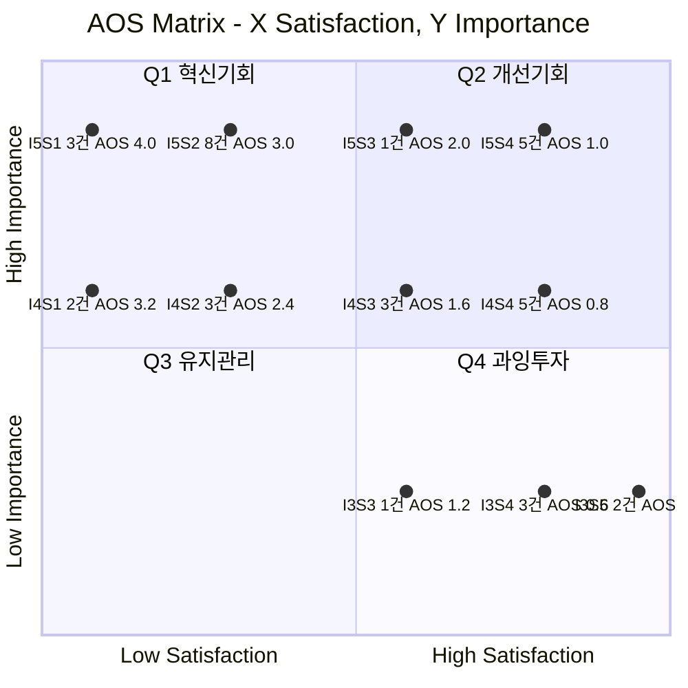

# 시장기회 분석 ③ — 구호재원 모금 기반 식량 무상 운송 서비스

> [분석 방법론](./분석-방법론.md) · 입력 [평가 대상 ③ 대표 Pain Point 36개](./평가대상-03-대표-페인포인트.md) · 상위 [챕터 05 고객 여정지도](../05-persona-journey/분석-03-식량-재분배-플랫폼-고객여정지도.md)

> 📊 **산출.** 대표 Pain Point 36개에 Importance·Satisfaction을 매기고 **AOS = Importance × (1 − Satisfaction/5)** 로 계산해 내림차순 정렬하고 사분면에 배치했다.
>
> ⚠️ **채점값은 전부 추정이다.** 인터뷰·설문이 없다. 근거 등급은 §6 참조.

---

## 0. 채점 규칙

### 두 지표의 앵커

| 점수 | **Importance** — 그 사람의 Goal 달성에 이 Pain 해소가 얼마나 중요한가 | **Satisfaction** — 지금 쓰는 **대체 솔루션**이 그 Goal을 얼마나 달성시켜 주는가 |
|:---:|---|---|
| **5** | 막히면 여정이 종료된다 | 대체 솔루션이 충분히 해결하고 있다 |
| **4** | 크게 지연·왜곡되고 상당수가 이탈한다 | 대체로 해결되며 약간 아쉬운 정도다 |
| **3** | 불편하지만 우회할 수 있다 | 절반쯤 해결된다 |
| **2** | 있으면 좋은 수준이다 | 거의 해결되지 않는다 |
| **1** | 거의 영향이 없다 | 전혀 해결되지 않는다 |

> 📌 **Satisfaction의 대상은 우리 서비스가 아니다.** 방법론 §2가 규정한 대로 *"기존 솔루션 생태계 하에서"* 매긴다. 즉 **지금 그 사람이 실제로 쓰고 있는 것**(기존 국제구호단체, 해피빈·같이가치, OCHA FTS, FAO 원문, 현행 배급 체계)이 `막히는 Goal` 을 얼마나 채워 주는지를 본다. 대체 솔루션이 잘하고 있으면 우리에게는 기회가 아니다.

### 사분면 기준선 — 각 지표의 중앙값

| 지표 | 분포 | **중앙값** |
|---|---|:---:|
| Importance | 5점 17개 · 4점 13개 · 3점 6개 | **4.0** |
| Satisfaction | 1점 5개 · 2점 11개 · 3점 5개 · 4점 13개 · 5점 2개 | **3.0** |

**경계 처리 — 중앙값 이상은 High, 미만은 Low.** 즉 Importance 4 이상이 High Importance, Satisfaction 3 이상이 High Satisfaction이다.

> ⚠️ **Importance 중앙값이 4로 높게 잡혔다.** 평가 대상을 고를 때 *"이탈로 직결되는 것"* 을 우선했기 때문이며, 그래서 36개 중 30개(83%)가 High Importance에 들어간다. **여기서 'Low Importance'는 '중요하지 않다'가 아니라 '3점'이라는 뜻**으로 읽어야 한다.

### 방법론의 A·B 대신 중앙값을 쓴 이유

방법론 §1 [참고] 절은 두 가지 기준 수립법을 제시한다. 이 분석은 **둘 다 쓰지 않고 중앙값**을 썼다.

| 기준 | 값 | 이 표본에 적용했을 때의 문제 |
|---|---|---|
| **A. 고정 3.0** | Imp 3.0 · Sat 3.0 | Importance 최솟값이 3이므로 **36개 전원이 High Importance**가 된다. 상하 구분이 사라져 Q3·Q4가 통째로 비고, 사분면이 좌우 두 칸으로 축소된다 |
| **B. 평균 기반** | Imp 4.31 · Sat 2.89 · AOS 2.49 | 방법론이 *"이미 사업 운영중에 있고 여러차례 도출된 점수 분포가 존재하는 경우"* 로 용도를 한정한다. **이 표본은 1회차 추정치**라 평균과 σ가 실제 분포를 대표하지 못한다 |
| **적용 — 중앙값** | **Imp 4.0 · Sat 3.0** | 표본 내부 분포를 쓰되 치우친 값에 덜 흔들린다 |

### 기준을 바꾸면 결과가 얼마나 달라지는가

| 기준 | Q1 혁신기회 | Q2 개선기회 | Q3 유지관리 | Q4 과잉투자 |
|---|:---:|:---:|:---:|:---:|
| A. 고정 3.0 | **16** | 20 | 0 | 0 |
| B. 평균 기반 | **11** | 6 | 5 | 14 |
| **적용 — 중앙값** | **16** | 14 | 0 | 6 |

> 📌 **Q1 구성은 기준에 거의 흔들리지 않는다.** A와 중앙값은 **완전히 같은 16개**를 Q1으로 판정하고(Importance 3점 항목 중 Satisfaction 2점 이하가 하나도 없기 때문), B는 그중 11개로 더 좁게 잡을 뿐 **새로 들어오는 항목은 없다.**
>
> **세 기준 어디서도 Q1을 벗어나지 않는 11개** — P03 · P07 · P11 · P13 · P15 · P21 · P22 · P27 · P30 · P34 · P36 — **이것이 이 분석에서 가장 흔들리지 않는 결론이다.** 기준선 논쟁과 무관하게 이 11개는 혁신기회로 남는다.

---

## 1. ② Importance Table

| ID | 인물 | 막히는 Goal (요약) | **Imp** | 판정 근거 |
|---|---|---|:---:|---|
| P01 | 개인 소액 정기 후원자 | 새지 않는다는 것을 스스로 확인 | **4** | 결제 전 차단 지점이나, 소액이라 완전 검증 없이 내기도 한다 |
| P02 | 개인 소액 정기 후원자 | 결과 기준으로 금액을 정함 | **4** | 금액 결정이 막히면 결제가 흔들린다 |
| P03 | 개인 소액 정기 후원자 | 결제 후에도 계속 확인 | **5** | 해지로 직결되는 최대 병목 |
| P04 | 일회성 충동 기부자 | 마음이 움직인 순간에 끝냄 | **5** | 감정 유효 시간이 이 여정 전체의 제한 시간 |
| P05 | 일회성 충동 기부자 | 계정 없이 결제 완료 | **5** | 여기서 대부분 이탈한다 |
| P06 | 일회성 충동 기부자 | 결과가 나를 찾아오게 함 | **4** | ⑥·⑦ 단계를 통째로 삭제한다 |
| P07 | 타 기부 플랫폼 정기 후원자 | 같은 잣대로 견줌 | **5** | 이동을 결정할 유일한 근거 |
| P08 | 타 기부 플랫폼 정기 후원자 | 끊지 않고 병행 시작 | **3** | 소액 병행으로 우회 가능 |
| P09 | 타 기부 플랫폼 정기 후원자 | 어디가 나은지 계속 판단 | **4** | 병행 후 유지·이전 결정을 좌우 |
| P10 | 해외 거주 기부 시도자 | 내 통화로 금액 감각 | **3** | 암산으로 우회 가능 |
| P11 | 해외 거주 기부 시도자 | 거주국에서 결제 완료 | **5** | 결제가 안 되면 나머지가 전부 무의미 |
| P12 | 해외 거주 기부 시도자 | 거주국의 제도적 인정 | **3** | 기부 자체를 막지는 않는다 |
| P13 | 극단적 투명성 요구 기부자 | 건별로 돈의 흐름 검증 | **5** | 이 인물의 전부 |
| P14 | 극단적 투명성 요구 기부자 | 작은 돈으로 조직을 시험 | **4** | 본 결제로 가는 관문 |
| P15 | 극단적 투명성 요구 기부자 | 증명 출처가 우리가 아님 확인 | **5** | 증명 체계의 신뢰 근간 |
| P16 | 국제 구호 불신 시민 | 시간·주의를 쓰지 않음 | **3** | 적극적 회피 노력까지는 하지 않는다 |
| P17 | 국제 구호 불신 시민 | 광고와 정보 구분 | **3** | 위와 같음 |
| P18 | 국제 구호 불신 시민 | 판단이 옳았는지 확인 | **4** | 자기 판단의 확인이 이 인물의 핵심 동기 |
| P19 | 기업 사회공헌·ESG 담당 | 사내가 함께 움직였다고 말함 | **4** | 사내 승인의 선행 조건 |
| P20 | 기업 사회공헌·ESG 담당 | 결재선을 한 번에 통과 | **5** | 승인 실패 시 집행 자체가 불가 |
| P21 | 기업 사회공헌·ESG 담당 | 분기 보고서에 확정 수치 | **5** | 성과가 있어도 무효가 된다 |
| P22 | 공여기관 프로그램 오피서 | 어디가 비었는지 한눈에 봄 | **5** | 배분의 출발점 |
| P23 | 공여기관 프로그램 오피서 | 신생 파트너를 심의에서 방어 | **4** | 중요하나 기존 파트너 교체로 우회 가능 |
| P24 | 공여기관 프로그램 오피서 | 감사에서 버티는 근거 | **5** | 불인정 시 재배분이 끊긴다 |
| P25 | 임팩트 투자 담당 | 검토 목록에 올릴 수 있는지 판정 | **4** | 진입 자체가 걸린다 |
| P26 | 임팩트 투자 담당 | 돈을 더 넣으면 효율이 오르는지 | **4** | 투자 판단의 근거 |
| P27 | 임팩트 투자 담당 | 자금을 집행할 형식을 찾음 | **5** | 형식이 없으면 집행이 불가능 |
| P28 | 제3자 모금 캠페인 주최자 | 내 이름 걸어도 뒤탈 없음 확인 | **4** | 개설 전 이탈 지점 |
| P29 | 제3자 모금 캠페인 주최자 | 참여자가 모이도록 판 유지 | **5** | 캠페인의 성패 |
| P30 | 제3자 모금 캠페인 주최자 | 집단의 이름으로 결과를 남김 | **5** | 이 인물의 목표 그 자체 |
| P31 | 언론·연구자·정책 담당 | 인용해도 안 다칠 출처인지 판정 | **5** | 인용의 최소 조건 |
| P32 | 언론·연구자·정책 담당 | 마감 안에 재가공 가능한 데이터 | **4** | 마감 내 사용 가능성을 좌우 |
| P33 | 언론·연구자·정책 담당 | 나간 기사의 수치가 계속 유효 | **3** | 사후 리스크 |
| P34 | IPC 3+ 위기 가구 구성원 | 배급 대상에서 빠지지 않음 | **5** | 생존 직결 |
| P35 | IPC 3+ 위기 가구 구성원 | 비용이 받는 양보다 크지 않게 | **4** | 실질 수혜량을 결정 |
| P36 | IPC 3+ 위기 가구 구성원 | 다음 끼니를 계획할 수 있음 | **5** | 선제적 결식을 유발한다 |

---

## 2. ③ Satisfaction Table

**지금 그 사람이 쓰고 있는 대체 솔루션**을 명시하고, 그것이 `막히는 Goal` 을 얼마나 달성시켜 주는지 매겼다.

| ID | 현재 쓰는 대체 솔루션 | **Sat** | 판정 근거 |
|---|---|:---:|---|
| P01 | 대형 국제구호단체의 연간보고서·회계공시 | **2** | 공시는 있으나 총액 수준이라 개인이 확인할 수 없다 |
| P02 | 기존 단체의 *"3만원 = 아동 1명 한 달"* 식 환산 | **3** | 환산 자체는 널리 제공된다. 검증되지 않을 뿐 |
| P03 | 정기 뉴스레터·소식지 | **2** | 신호는 오지만 내 기부 건과 연결되지 않는다 |
| P04 | 기존 긴급모금 배너 + 간편결제 | **4** | 이미 수 초 안에 끝난다 |
| P05 | 해피빈·카카오같이가치의 로그인 상태 결제 | **4** | 사실상 무마찰. 기존 대안이 매우 강하다 |
| P06 | 계정 기반 완료 알림 | **3** | 완료 통지는 오나 결과 보고는 오지 않는다 |
| P07 | **없음** — 후원처 간 성과 비교 도구가 존재하지 않는다 | **1** | 대체 솔루션 자체가 없다 |
| P08 | 기존 플랫폼도 병행 자체는 자유 | **4** | 추가 후원을 막는 곳은 없다 |
| P09 | **없음** — 병행 후원처 간 상대 비교 화면이 없다 | **1** | 대체 솔루션 자체가 없다 |
| P10 | 유니세프·월드비전 등 글로벌 단체의 현지 통화 결제 | **4** | 국제 단체는 이미 지원한다 |
| P11 | 국제 단체의 해외 결제 | **2** | 결제는 되지만 **모국 기여 동기**를 대체하지 못한다 |
| P12 | 거주국 현지 단체 기부 시 세제 혜택 | **4** | 혜택만 놓고 보면 대안이 있다 |
| P13 | **없음** — 건별 집행 원장을 공개하는 단체가 없다 | **1** | 감사보고서는 총액 수준에 그친다 |
| P14 | **없음** — 소액 기부자 대상 개별 결과 보고가 사실상 없다 | **1** | 금액이 작으면 보고에서 제외된다 |
| P15 | 한국가이드스타 평가·외부 회계감사 | **2** | 조직 단위 평가는 있으나 건별 인수 증명은 없다 |
| P16 | 광고 차단·무시 | **5** | 회피가 아주 잘 작동하고 있다 |
| P17 | 학습된 광고 식별 | **5** | 위와 같음 |
| P18 | 검색하면 나오는 기부금 유용 보도 | **4** | 판단이 오히려 강화된다 — **우리 관점에서는 역방향** |
| P19 | 기존 대형 단체의 임직원 봉사·캠페인 프로그램 | **4** | 오래 축적된 강점 영역 |
| P20 | 기존 대형 단체의 법인 실사 자료 패키지 | **4** | 완비되어 있다 |
| P21 | 기존 단체의 분기 보고 | **2** | 사진·수기 보고 수준이라 확정 수치가 제때 오지 않는다 |
| P22 | OCHA FTS 및 기관별 appeal 문서 | **2** | 존재하나 불완전하고 수기 취합이 필요하다 |
| P23 | 검증된 기존 파트너(WFP 등)로 대체 | **4** | 신생 파트너를 쓰지 않으면 해결된다 |
| P24 | 대형 기구의 외부 평가·감사 체계 | **3** | 기구 단위로는 있으나 사업 단위로는 부족 |
| P25 | 명확한 법인 구조를 갖춘 다른 소셜벤처 | **4** | 검토 후보는 얼마든지 있다 |
| P26 | **거의 없음** — 구호·물류 섹터의 단위 경제 시계열 | **2** | 톤당 단가 추이를 공개하는 곳이 드물다 |
| P27 | 성과연계지급(PbR)·소셜임팩트본드 | **2** | 형식은 존재하나 국내 적용 사례가 드물다 |
| P28 | 해피빈·같이가치의 플랫폼 정산 책임 | **4** | 정산 책임을 플랫폼이 진다 |
| P29 | 기존 모금 플랫폼의 실시간 진척 바 | **4** | 모금 진척 가시화는 이미 표준이다 |
| P30 | 기존 플랫폼의 모금액 총계 | **2** | 금액은 나오나 집단 성과물이 남지 않는다 |
| P31 | FAO·WFP·OCHA 원문 | **4** | 출처와 산출식이 명확하다 |
| P32 | FAO CSV·OCHA FTS API | **3** | 원본은 있으나 최신성·통합성이 부족하다 |
| P33 | 기관 데이터의 기준일·버전 표기 | **3** | 표기하는 편이나 알림은 오지 않는다 |
| P34 | 현행 배급 체계의 명단 관리 | **2** | 이의 제기 절차가 정비되어 있지 않다 |
| P35 | 현행 배급소 운영 | **2** | 이동 비용 문제를 거의 다루지 못한다 |
| P36 | **거의 없음** — 다음 배급 사전 고지 | **1** | 현행 체계에서 예정일이 공지되지 않는다 |

---

## 3. ④ AOS Table — 내림차순

**AOS = Importance × (1 − Satisfaction / 5)**

| 순위 | ID | 인물 | Pain Point (요약) | Imp | Sat | **AOS** | 사분면 |
|:---:|---|---|---|:---:|:---:|:---:|:---:|
| 1 | **P07** | 타 기부 플랫폼 정기 후원자 | 단체마다 성과 단위가 달라 비교가 성립하지 않는다 | 5 | 1 | **4.0** | Q1 |
| 1 | **P13** | 극단적 투명성 요구 기부자 | 집계 총액만 있고 건별 집행 내역이 없다 | 5 | 1 | **4.0** | Q1 |
| 1 | **P36** | IPC 3+ 위기 가구 구성원 | 다음 배급 시점을 몰라 선제적 결식이 일어난다 | 5 | 1 | **4.0** | Q1 |
| 4 | **P09** | 타 기부 플랫폼 정기 후원자 | 무소식 기간이 곧바로 열등으로 읽힌다 | 4 | 1 | **3.2** | Q1 |
| 4 | **P14** | 극단적 투명성 요구 기부자 | 소액 기부자에게 결과 보고가 생략된다 | 4 | 1 | **3.2** | Q1 |
| 6 | **P03** | 개인 소액 정기 후원자 | 리드타임 동안 신호가 없어 방치됐다고 느낀다 | 5 | 2 | **3.0** | Q1 |
| 6 | **P11** | 해외 거주 기부 시도자 | 카드 거절·본인인증·저대역 중 어디서든 끊긴다 | 5 | 2 | **3.0** | Q1 |
| 6 | **P15** | 극단적 투명성 요구 기부자 | 인수 확인을 우리가 입력하면 자기증명이 된다 | 5 | 2 | **3.0** | Q1 |
| 6 | **P21** | 기업 사회공헌·ESG 담당 | 리드타임과 분기 마감이 어긋나 실적으로 못 쓴다 | 5 | 2 | **3.0** | Q1 |
| 6 | **P22** | 공여기관 프로그램 오피서 | 전 세계 재원 현황이 흩어져 출발점이 불완전하다 | 5 | 2 | **3.0** | Q1 |
| 6 | **P27** | 임팩트 투자 담당 | 회수 경로가 없어 투자 형식이 성립하지 않는다 | 5 | 2 | **3.0** | Q1 |
| 6 | **P30** | 제3자 모금 캠페인 주최자 | 결과가 개인 단위로만 와 '함께 한 것'이 사라진다 | 5 | 2 | **3.0** | Q1 |
| 6 | **P34** | IPC 3+ 위기 가구 구성원 | 명단 누락 시 이의 절차가 없어 배제된다 | 5 | 2 | **3.0** | Q1 |
| 14 | **P01** | 개인 소액 정기 후원자 | 운영비·집행 내역이 없어 의심을 풀 수 없다 | 4 | 2 | **2.4** | Q1 |
| 14 | **P26** | 임팩트 투자 담당 | 톤당 단가 시계열이 없어 가설을 검증 못 한다 | 4 | 2 | **2.4** | Q1 |
| 14 | **P35** | IPC 3+ 위기 가구 구성원 | 이동 비용과 대기가 수령량의 가치를 잠식한다 | 4 | 2 | **2.4** | Q1 |
| 17 | **P24** | 공여기관 프로그램 오피서 | 제3자 검증 없는 자체 보고는 감사에서 불인정 | 5 | 3 | **2.0** | Q2 |
| 18 | **P02** | 개인 소액 정기 후원자 | 금액과 결과의 관계를 몰라 금액을 못 정한다 | 4 | 3 | **1.6** | Q2 |
| 18 | **P06** | 일회성 충동 기부자 | 연락처 미확보 시 여정에서 영구히 사라진다 | 4 | 3 | **1.6** | Q2 |
| 18 | **P32** | 언론·연구자·정책 담당 | 원본 데이터가 없어 다른 출처로 간다 | 4 | 3 | **1.6** | Q2 |
| 21 | **P33** | 언론·연구자·정책 담당 | 소리 없는 갱신으로 과거 기사와 어긋난다 | 3 | 3 | **1.2** | Q4 |
| 22 | **P04** | 일회성 충동 기부자 | 감정 유효 시간이 몇 분이다 | 5 | 4 | **1.0** | Q2 |
| 22 | **P05** | 일회성 충동 기부자 | 회원가입·본인인증 요구 시 이탈한다 | 5 | 4 | **1.0** | Q2 |
| 22 | **P20** | 기업 사회공헌·ESG 담당 | 결재선이 요구하는 리스크 부재 증명 자료가 없다 | 5 | 4 | **1.0** | Q2 |
| 22 | **P29** | 제3자 모금 캠페인 주최자 | 진척이 안 보이면 참여자가 모이지 않는다 | 5 | 4 | **1.0** | Q2 |
| 22 | **P31** | 언론·연구자·정책 담당 | 출처·산출식이 없으면 인용이 불가능하다 | 5 | 4 | **1.0** | Q2 |
| 27 | **P18** | 국제 구호 불신 시민 | 불신을 반증할 제3자 근거가 검색에 없다 | 4 | 4 | **0.8** | Q2 |
| 27 | **P19** | 기업 사회공헌·ESG 담당 | 임직원 참여 프로그램이 준비되어 있지 않다 | 4 | 4 | **0.8** | Q2 |
| 27 | **P23** | 공여기관 프로그램 오피서 | 신생 기관은 심의에 낼 실적이 없다 | 4 | 4 | **0.8** | Q2 |
| 27 | **P25** | 임팩트 투자 담당 | 법인격·수익 모델이 불명확해 목록에 못 오른다 | 4 | 4 | **0.8** | Q2 |
| 27 | **P28** | 제3자 모금 캠페인 주최자 | 정산 책임을 주최자 개인이 져야 한다 | 4 | 4 | **0.8** | Q2 |
| 32 | **P08** | 타 기부 플랫폼 정기 후원자 | 갈아타기 요구 시 죄책감으로 중단한다 | 3 | 4 | **0.6** | Q4 |
| 32 | **P10** | 해외 거주 기부 시도자 | 원화로만 표시되어 금액 감각이 안 선다 | 3 | 4 | **0.6** | Q4 |
| 32 | **P12** | 해외 거주 기부 시도자 | 거주국에서 영수증이 인정되지 않는다 | 3 | 4 | **0.6** | Q4 |
| 35 | **P16** | 국제 구호 불신 시민 | 우리 채널로는 도달 자체가 되지 않는다 | 3 | 5 | **0.0** | Q4 |
| 35 | **P17** | 국제 구호 불신 시민 | 우리 말은 광고로 분류되어 읽히지 않는다 | 3 | 5 | **0.0** | Q4 |

---

## 4. ⑤ Matrix — 사분면 배치

### 셀 매트릭스 (행 = Importance, 열 = Satisfaction)

기준선: **Importance 4.0 · Satisfaction 3.0** (각 지표의 중앙값). 굵은 선 안쪽이 **Q1 혁신기회**다.

| Imp \ Sat | **1** | **2** | **3** | **4** | **5** |
|:---:|---|---|---|---|---|
| **5** | 🔥 P07 · P13 · P36 *AOS 4.0* | 🔥 P03 · P11 · P15 P21 · P22 · P27 P30 · P34 *AOS 3.0* | 💎 P24 *AOS 2.0* | 💎 P04 · P05 · P20 P29 · P31 *AOS 1.0* | — |
| **4** | 🔥 P09 · P14 *AOS 3.2* | 🔥 P01 · P26 · P35 *AOS 2.4* | 💎 P02 · P06 · P32 *AOS 1.6* | 💎 P18 · P19 · P23 P25 · P28 *AOS 0.8* | — |
| **3** | — | — | ⚠️ P33 *AOS 1.2* | ⚠️ P08 · P10 · P12 *AOS 0.6* | ⚠️ P16 · P17 *AOS 0.0* |

| 기호 | 사분면 | 조건 | 개수 |
|:---:|---|---|:---:|
| 🔥 | **Q1 혁신기회** | High Importance + Low Satisfaction | **16** |
| 💎 | **Q2 개선기회** | High Importance + High Satisfaction | **14** |
| ⚫ | **Q3 유지관리** | Low Importance + Low Satisfaction | **0** |
| ⚠️ | **Q4 과잉투자** | Low Importance + High Satisfaction | **6** |

### 버블 매트릭스

> 🖊️ *점은 개별 Pain이 아니라 **동일 좌표에 겹치는 항목을 묶은 셀**이다(36개 중 다수가 좌표를 공유한다). 축 간격은 판독을 위해 조정했으며 정확한 값은 위 표에 있다. `I5S1` = Importance 5 · Satisfaction 1.*

---

## 5. 해석

### 5-1. 최상위 3개 — 대체 솔루션이 아예 없는 자리

AOS 만점권(4.0)에 오른 셋은 모두 **Satisfaction 1**, 즉 지금 그 일을 해 주는 것이 세상에 없다.

| ID | 무엇이 없는가 |
|---|---|
| **P07** | 후원처 간 성과를 **같은 단위로 비교**하는 도구가 어디에도 없다 |
| **P13** | **건별 집행 원장**을 공개하는 구호 단체가 없다 |
| **P36** | 수혜 가구에게 **다음 배급 예정일을 미리 알려주는** 체계가 없다 |

> 📌 **셋 다 '더 잘하는 것'이 아니라 '아무도 안 하는 것'이다.** 기존 플레이어와 같은 일을 더 잘해서 이기는 그림이 아니라, **비어 있는 칸을 차지하는 그림**이다.

### 5-2. Q2에 몰린 14개 — 잘해도 이기지 못하는 영역

Q2(High Importance + High Satisfaction)에는 **중요하지만 기존 대안이 이미 잘 해내는** 항목이 모였다. 결제 속도(P04·P05), 법인 실사 자료(P20), 모금 진척 바(P29), 출처 명시(P31)가 여기 있다.

> ⚠️ **AOS가 낮다고 해서 안 만들어도 된다는 뜻이 아니다.** 이들은 **위생 요인**이다 — 갖춰도 차별화되지 않지만, 없으면 그 자리에서 탈락한다. 기존 플랫폼이 이미 표준으로 제공하므로 **없을 때만 눈에 띈다.**
>
> **AOS는 "무엇으로 이길 것인가"를 알려주지 "무엇을 안 만들어도 되는가"를 알려주지 않는다.** Q2는 **최소 요건 목록**으로 따로 관리해야 한다.

### 5-3. Q3이 비었다 — 선정 과정의 흔적

Low Importance + Low Satisfaction 칸에 하나도 없다. 평가 대상을 고를 때 *"이탈로 직결되는 것 우선"* 규칙을 적용해 **중요도 낮은 Pain을 애초에 걸러냈기 때문**이다.

> ⚠️ **이것은 시장의 성질이 아니라 표본의 성질이다.** 여정지도의 92개 전체를 채점했다면 Q3에 상당수가 떨어졌을 것이다. **"유지관리 대상이 없다"고 해석하면 안 된다.**
>
> 기준선을 바꾸면 곧바로 드러난다 — §0의 민감도 표에서 **방법론 B(평균 기반)를 적용하면 Q3에 5개**(P01·P09·P14·P26·P35)가 들어간다. 같은 항목이 중앙값 기준에서는 Q1에 있다. **Q3의 공백은 기준선이 만든 것이지 시장이 만든 것이 아니다.**

### 5-4. 국제 구호 불신 시민 — AOS가 0으로 나온 이유

P16·P17이 유일한 **AOS 0.0**이다. 이 사람의 Goal은 *"시간과 주의를 쓰지 않는 것"* 이고, 현재 그 Goal은 **완벽하게 달성되고 있다**(Satisfaction 5).

> 📌 **채점이 정확히 작동했다.** 방법론대로 *"그 사람에게"* 매기면 이 인물에 대한 기회는 0이 된다. 이는 **마케팅 예산을 여기에 쓰지 말라**는 판정이며, 여정지도가 *"이 지도의 용도는 광고비를 여기에 쓰지 말라는 판정"* 이라고 한 것과 정확히 일치한다.
>
> 유일한 예외가 **P18(AOS 0.8)** 이다. *"안 내겠다는 판단이 옳았는지 확인"* 은 양방향 Goal이므로, 이 인물을 여는 통로는 P18 하나뿐이다. 다만 점수가 낮아 **직접 공략이 아니라 언론·연구자를 통한 간접 경로**여야 한다는 것도 함께 말해 준다.

### 5-5. 수혜형 3개는 목록에서 분리한다

P36(4.0)·P34(3.0)·P35(2.4)는 전부 Q1 상위권이지만, 이 사람은 **우리에게 돈을 내지 않는다.** 평가대상 문서 §6이 예고한 대로 같은 목록에 두면 사업 우선순위가 왜곡된다.

> 📌 **분리해서 읽는다.** P36·P34·P35의 AOS 합 **9.4**는 *"사업 기회의 크기"* 가 아니라 **성과 판정 기준의 강도**다. 다만 P36(다음 배급 예정일)은 P21(분기 마감 실적 확정)과 **같은 역량(리드타임 확정)에서 나온다** — 여정지도 §16-2가 지적한 정렬이 점수로도 확인된다.

### 5-6. 기능 단위로 환원 — AOS 2.0 이상 17개

개별 Pain 17개를 처방이 같은 것끼리 묶으면 **여섯 덩어리**가 된다.

| 기능 | 포함 Pain | 항목 수 | **AOS 합** |
|---|---|:---:|:---:|
| **① 증명 체계** — 건별 집행 원장 · 제3자 서명 · 소액에도 동일 적용 · 진행 중 신호 | P13 · P14 · P03 · P15 · P01 · P24 | 6 | **17.6** |
| **② 공통 단위와 비교** — 원 → kg → 명 환산과 후원처 대조 | P07 · P09 | 2 | **7.2** |
| **③ 자금 그릇** — 형식·경로 다변화 (PbR·대출·해외 결제) | P27 · P11 | 2 | **6.0** |
| **④ 재원 가시화** — 갭 대시보드와 단위 경제 지표 | P22 · P26 | 2 | **5.4** |
| **⑤ 시점 확정** — 분기 마감 기준 실적 확정 | P21 | 1 | **3.0** |
| **⑥ 집단 결과물** — 캠페인 단위 성과 산출 | P30 | 1 | **3.0** |
| *(별도)* **수혜 접근성** — 배급 예고·명단 이의·이동 부담 | P36 · P34 · P35 | 3 | *9.4* |

> 📌 **증명 체계가 17.6으로 2위(7.2)의 두 배를 넘는다.** 여섯 명의 서로 다른 인물이 서로 다른 단계에서 같은 물건 하나를 요구한다 — **출처가 우리가 아닌 집행 기록.** 페르소나 분석·여정 분석·기회점수 세 경로가 전부 같은 결론에 도달했다.
>
> ⚠️ **다만 그 물건의 원천을 우리가 소유하지 않는다.** 인수 확인 데이터는 수령 채널에서 나온다. **AOS 1위 기능의 구현 조건이 제품 개발이 아니라 파트너 협상**이라는 뜻이며, 이는 여정지도 §15가 이미 1순위로 지목한 것과 같다.

---

## 6. 근거 등급

| 구성 요소 | 등급 | 비고 |
|---|---|---|
| AOS 계산식과 사분면 기준선(중앙값) | **(확인)** | 방법론 §1의 정의와 사용자 지정 기준 |
| Satisfaction 항목의 **대체 솔루션 존재 여부** | **(추정)** | 시장에 실재하는 서비스에서 판단. 개별 기능 수준은 미검증 |
| **Importance 36개 전부** | **(가정)** | 인터뷰·설문 없음. 여정지도의 병목 판정에서 도출 |
| **Satisfaction 36개 전부** | **(가정)** | 대체 솔루션의 실제 충족도를 측정한 것이 아니다 |
| 사분면 배치와 순위 | **(가정)** | 위 두 값의 산물이므로 같은 등급 |

> ⚠️ **AOS 순위는 "무엇을 먼저 만들지"가 아니라 "무엇을 먼저 검증할지"의 순서다.** 채점값이 전부 가정이므로, 상위 항목은 **확신의 목록이 아니라 검증 대상의 목록**이다.
>
> **가장 흔들리기 쉬운 값은 Satisfaction 1점 항목(P07·P09·P13·P14·P36)이다.** *"대체 솔루션이 없다"* 는 판단은 조사 범위가 좁으면 쉽게 뒤집힌다. 상위 5개가 전부 여기 속하므로, **경쟁·대체재 조사를 최우선으로 해야 한다.**

---

## 7. 다음 단계

| 순위 | 할 일 | 이유 |
|:---:|---|---|
| **1** | **Satisfaction 1점 5개의 대체재 재조사** | 순위 상위 전체가 이 판단에 걸려 있다 |
| **2** | **Q1 상위 항목 대상 JTBD 인터뷰** | 방법론 §1이 Q1을 *"JTBD 인터뷰 대상"* 으로 지정 |
| **3** | **증명 체계의 원천 확보 가능성 확인** | AOS 1위 기능의 선행 조건이 파트너 협상이다 |
| **4** | **Q2 14개를 최소 요건 목록으로 재분류** | 차별화 항목이 아니라 탈락 방지 항목으로 관리 |

**→ 챕터 07 JTBD** 로 이어진다. 인터뷰 대상은 Q1 상위의 **개인 소액 정기 후원자 · 타 기부 플랫폼 정기 후원자 · 극단적 투명성 요구 기부자** 셋이며, 파고들 질문은 *"이 사람이 오천 원으로 고용하려는 진짜 일은 몇 kg을 옮기는 일인가, 의심하지 않아도 되는 상태를 사는 일인가"* 다.
