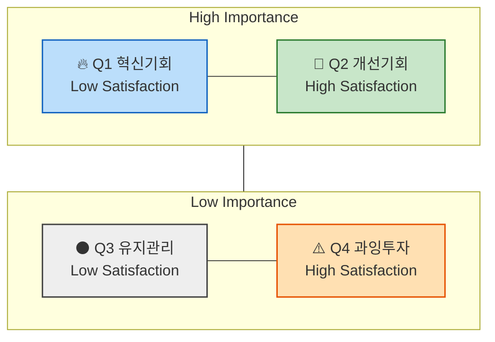

# 06 - 시장기회 분석 : 기회점수(OS) 기반 우선순위 판단

> 본 챕터의 분석은 이 문서에 정의된 방법론을 따른다.
> 이 방법론은 **챕터 05의 산출물(페르소나 스펙트럼 · 고객 여정지도)을 입력으로 받는다.** 점수를 매길 Pain 목록이 없으면 시작할 수 없다 (→ §2).

> 📤 **산출물** — [시장기회 분석 ③](./분석-03-식량-재분배-플랫폼.md) (1️⃣·2️⃣·4️⃣ 합본)
>
> 🔢 **AOS 산출 워크플로우** — ② Importance 평가 → ③ Satisfaction 평가 → ④ AOS 계산 → ⑤ Matrix 시각화. 산출물 Ⅱ부가 이 순서를 그대로 따른다.

---

## 1️⃣ `기회점수(OS, Opportunity Score)`란?
&nbsp;&nbsp;&nbsp;&nbsp; & `조정형 기회점수(AOS, Adjusted Opportunity Score)`란?

> **전통적 `기회점수` OS**의 수식에서는
> 고객의 불만족 수준 계산에 고객의 기대치(`중요도`)와 만족도 지표를 직접 사용합니다.
> 하지만, 이 경우 고객이 문제(Pain, Goal, Job)에 대해 가지고 있는 기대치(`중요도`)가 두 번 반영됩니다.
>
> - 아래와 같이 `Importance`가 두 번 반영되면, **실제 시장감각을 왜곡**하는 문제가 발생하게 됩니다.
>
>     ```markdown
>     **OS = Importance(기대치) + (Importance(기대치) - Satisfaction(만족도))(불만족도) = Importance x 2 - Satisfaction(만족도)**
>     ```
>
> **조정형 `기회점수` AOS**는 그러한 수식을 개선하여,
> 고객의 불만족 수준을 고객의 기대치 및 중요도와 관계 없는 방법을 사용해
> `비율 계산 형태` (`1−Satisfaction / 5`) 로 도출한 뒤,
> 거기에 `Importance`를 곱하여 **현실적 혁신기회 강도**를 산출합니다.
>
> - 아래의 변경된 수식을 사용하면 실제 시장감각에 더 가까운 계산이 가능합니다.
>
>     ```markdown
>     **AOS = Importance × (1 - Satisfaction(rate) / 5)**
>     ```

---

### 💡 AOS(Adjusted Opportunity Score)의 정의

| 항목 | 설명 |
| --- | --- |
| Importance | 고객에게 Pain/Goal이 얼마나 중요한가 (1~5점) |
| Satisfaction | 현재 이 Pain이 얼마나 잘 해결되고 있는가 (1~5점) |
| 1−Satisfaction/5 | 충족되지 않은 영역(Unmet Need)의 비율 |
| AOS | "중요하지만 덜 해결된 문제"의 강도 |

### 📊 점수 해석 예시

| Pain / Goal | Importance | Satisfaction | 1-Satisfaction<br>(rate) | AOS | 해석 |
| --- | --- | --- | --- | --- | --- |
| 리포트 자동화의 한계 | 5 | 2(40%) | 0.6 | 5×(1−0.4)=3.0 | 명확한 혁신 기회 |
| AI 학습 피로감 | 3 | 2 |  | 3×(1−0.4)=1.8 | 부분적 개선 기회 |
| 데이터 공유 비효율 | 4 | 3(60%) | 0.4 | 4×(1−0.6)=1.6 | 유지관리 대상 |
| 신뢰 부족 | 2 | 4 |  | 2×(1−0.8)=0.4 | 저기회 영역 |

> 🖊️ *편집 메모 — 원문에서 2·4행의 `1-Satisfaction(rate)` 칸은 비어 있다. AOS 계산식에서 역산하면 각각 **0.6**, **0.2** 다.*

---

### 📈 AOS 시각화 구조



- **사분면 형태로 시각화**

    `X축`: Satisfaction (충족도), `Y축`: Importance (중요도)

- **사분면 해석 방법**

    | 사분면 | 조건 | 의미 | 전략 행동 |
    | --- | --- | --- | --- |
    | Q1 | High AOS | 혁신기회(High Importance + Low Satisfaction) | JTBD 인터뷰 대상, MVP 실험 우선 |
    | Q2 | 중간 AOS | 개선기회 | 지속적 개선 필요 |
    | Q3 | Low AOS | 유지/보완 | UX·마케팅 최적화 중심 |
    | Q4 | 0 근처 | 과잉투자 위험 | 자원 분배 재검토 |

### [참고] 매트릭스에서 사분면 상하 좌우를 가르는 수치 기준점은 어디인가?

#### 💡 A. 점수 척도 기반 단순 **기준점 수립 (최초 분석/설계를 위한 분석)**

가장 단순하고 직관적인 방식.

Likert 5점 척도(1~5)를 그대로 쓰고, 중간값 **3.0**을 중심선으로 삼는다.

| 축 | 기준점 | 의미 |
| --- | --- | --- |
| Satisfaction | 3.0 | 이 이상은 "대체로 만족" |
| Importance | 3.0 | 이 이상은 "대체로 중요" |
| AOS | 2.0~2.5 | 중요도·불만족의 평균 이상 |

📘 **활용법:**

- 문제의식 및 솔루션의 유형에 따라 기준을 조정해도 괜찮음
- 예: "Importance가 4 이상인 Pain만 상단으로 올리자."
- **목표는 구조적 사고 훈련**
→ 문제 해결을 구조화하는 데에 초점

#### 💡 B. 기존 사업에서의 **데이터 분포에 따라 수립**

이미 사업 운영중에 있고 여러차례 도출된 점수 분포가 존재하는 경우,
평균값과 표준편차를 이용해 사분면을 **데이터 기반으로 자동 구분**할 수 있다.

| 항목 | 계산 | 해석 |
| --- | --- | --- |
| Importance 기준선 | 전체 Importance 평균(μ₁) | 평균 이상 → 상단 |
| Satisfaction 기준선 | 전체 Satisfaction 평균(μ₂) | 평균 이하 → 좌측 |
| AOS 기준선 | 전체 AOS 평균 + 0.5σ | 이 값 이상 → "기회 영역" |

- 예시:

    ```
    Importance 평균 = 3.6
    Satisfaction 평균 = 2.9
    AOS 평균 = 2.1
    ```

    - Y축 기준(Importance): 3.6
    - X축 기준(Satisfaction): 2.9
    - 버블 경계(AOS): 2.1

📘 **해석 포인트:**

"우리 사업의 실제 평가 분포"에 맞게 사분면이 형성되므로
페르소나나 산업별 편향을 줄일 수 있다.

> 📌 **판독 규칙 — 어느 기준을 썼는지는 산출물에 반드시 명시한다.*** 기준선이 바뀌면 같은 AOS가 다른 사분면에 떨어지므로, 기준을 밝히지 않은 사분면 배치는 재현되지 않는다. [분석-03](./분석-03-식량-재분배-플랫폼.md)은 **B(평균 기반)** 을 적용했고, A·중앙값과의 차이를 §0 민감도 표에 함께 남겼다.*
>
> ⚠️ **판독 규칙 — B를 5점 척도에 적용할 때의 주의.*** 정수 점수에 평균 기준선을 그으면 선이 정수 사이에 떨어져 **한 등급 전체가 통째로 한쪽으로 몰린다.** 분석-03에서는 Importance 기준선 4.31이 4와 5 사이에 놓여 4점 항목 전부가 하단(Low Importance)으로 내려갔다. **이때는 사분면 이름보다 AOS 값을 우선해 읽어야 한다** — 사분면은 두 축을 각각 이분한 요약이고 AOS는 두 축을 곱해 강도를 직접 잰 값이다.*

---

## 2️⃣ 평가 대상 정의 – 무엇을 (재료로) 점수화하는가?

- **`우리가 설계한 솔루션`** 에 대한 **페르소나 스펙트럼과 고객 여정 지도**에 대하여
- **`기존 솔루션 생태계`** 하에서 **고객이 겪고 있는 Pain/Job 상황**을 평가합니다.

| 분석 단계 | 평가 단위 = `고객 타겟` | 평가 대상 = `Pain 정의 내용` |
| --- | --- | --- |
| 페르소나 단계 | 각 페르소나의 주요 Pain·Goal | "이 사람에게 가장 중요한 고통은 무엇인가?" |
| 고객 여정 지도 | 여정 단계별 Pain Point / 개선기회 | "고객 여정 중 어디서 좌절이 가장 큰가?" |
| ~~*JTBD 인터뷰 사전 단계*~~ | ~~*Job Statement 단위*~~ | ~~*"이 고객이 진보를 이루기 위해 수행하는 일(Job)은 무엇인가?"*~~ |

> ✅ **앞선 분석 결과 중 무엇을 사용하는가?**
>
> - 페르소나가 도출되기 전, "`문제정의`", "`Segment`" 단계의 Pain List 를 사용하면 어떻게 될까요?
> - 페르소나 Spectrum 4가지 중 어떤 페르소나가 가진 Pain List 를 사용해야 할까요?

> *분석 & 기획 단계에서는 최대한 많은 "유효한" 문제들에 시장기회 점수를 매겨서 내림차순으로 정렬해 봅니다*

---

## 4️⃣ AOS에서 시장 가중형 점수 DOS로 확장하기 – VC들이 실제로 사용하는 시장가중형 분석

> AOS는 고객 한 명의 중요도를 반영한 지표라면,
>
> DOS는 **시장 규모와 맥락을 곱해 '발견된 기회(Discovered Opportunity Score)'를 산출**
>
> *→ **기회 점수 = 고객 미충족 × 시장 파급력** 으로 계산. (실제 VC, PM들이 쓰는 구조와 유사)*

### 🧠 AOS vs. DOS 비교

| 구분 | AOS | DOS |
| --- | --- | --- |
| 계산기준 | 고객 체감 중심 | 시장가중 중심 |
| 데이터 출처 | 페르소나, 인터뷰 | TAM/SAM, 산업 리서치 |
| 목적 | 혁신 아이디어 탐색 | 시장 확장성 검증 |
| 적용 시점 | 리서치 초기 | 비즈니스 모델 검증 |
| AI 활용 | 중요도·만족도 평가 | 시장 규모 가중치 계산 |

### 💡 DOS(Discovered Opportunity Simulation)의 개념

> "고객의 미충족 × 시장 가치"의 교차점 = **진짜 기회 영역**
>
> ```markdown
> DOS = (Importance - Satisfaction) × Market Relevance
> ```
>
> → **Market Relevance 수치는 시장 파급력**
> &nbsp;&nbsp;&nbsp;&nbsp;`TAM-SAM-SOM(%)`\* 을 사용하거나, 시장 성장률, 채택난이도, 확산성 등을
> &nbsp;&nbsp;&nbsp;&nbsp;추가로 고려해 평가
> &nbsp;&nbsp;&nbsp;&nbsp;\* *TAM-SAM-SOM 에 대해 해당 Pain이 갖는 상대적 비중*
>
> ***⇒ 지금까지 수행한 시장분석 자료를 AI에 투입하면
> &nbsp;&nbsp;&nbsp;&nbsp;"기회 강도 × 시장 확산성"을 손쉽고 정확하게 도출 가능!***

> ⛔ **이 프로젝트에서 위 문장은 성립하지 않았다 — 원문이지만 그대로 믿지 말 것.**
>
> 자료를 넣는다고 DOS가 나오지 않는다. **모수·비중 산정법·추가 가중치 세 가지를 사람이 먼저 정해야** 계산이 시작되고(아래 판독 규칙), 이 프로젝트에서는 그 결정에만 별도의 판단이 필요했다 — 톤 단위 모수를 기부자 Pain에 쓸 수 없어 **재원으로 환산하는 고리**를 새로 만들어야 했다.
>
> 그리고 산출된 값의 등급은 **(가정)** 이다. DOS는 AOS의 두 가정 위에 MR이라는 세 번째 가정을 곱하므로 **AOS보다 한 겹 더 얇다.** *"손쉽고 정확하게"* 중 손쉬운 쪽은 맞고 **정확한 쪽은 틀리다.***

### DOS 계산식 적용 예시

| Pain | Importance | Satisfaction | TAM-SAM-SOM(%)\* | DOS |
| --- | --- | --- | --- | --- |
| 자동화 한계 | 5 | 2 | 0.8 | (5−2)×0.8 = 2.4 |
| AI 학습 피로 | 3 | 2 | 0.6 | (3−2)×0.6 = 0.6 |
| 신뢰 부족 | 2 | 4 | 0.7 | (2−4)×0.7 = −1.4 |

\* *TAM-SAM-SOM 중 적정 모수에 대한 해당 Pain/Goal 의 비중*

---

> 🖊️ **명칭이 원문 안에서 두 가지로 쓰인다.*** 도입부는 `Discovered Opportunity **Score**`, 개념 소제목은 `Discovered Opportunity **Simulation**` 이다. 둘 다 원문 그대로 두었으며, 산출물에서는 하나로 고정해 쓴다.*
>
> 📌 **판독 규칙 — DOS는 부호가 있고 AOS는 없다.*** AOS는 `Imp × (1 − Sat/5)` 이므로 항상 0 이상이지만, DOS는 `(Imp − Sat) × MR` 이라 **Satisfaction이 Importance보다 크면 음수**가 된다(위 예시의 −1.4). **음수는 과잉 충족 신호**이며, 자원을 빼야 할 항목을 가리킨다. 두 점수는 척도도 부호 규칙도 다르므로 **같은 표에 나란히 놓고 크기를 비교하면 안 된다.***
>
> 📌 **판독 규칙 — Market Relevance는 분석 착수 전에 정의를 확정해야 한다.*** 원문은 산정 방식을 열어 두었다(`TAM-SAM-SOM(%)` 또는 성장률·채택난이도·확산성 가중). 최소한 아래 셋을 먼저 정하지 않으면 DOS는 재현되지 않는다.*
>
> | 확정 사항 | 묻는 것 |
> |---|---|
> | **모수** | TAM · SAM · SOM 중 무엇을 분모로 삼는가 |
> | **비중 산정법** | 해당 Pain이 그 모수에서 차지하는 비중을 무엇으로 재는가 (인구 수 · 금액 · 물량 · 추정 점유) |
> | **추가 가중치** | 성장률·채택난이도·확산성을 넣을 것인가. 넣는다면 곱인가 가중합인가 |
>
> ✅ **이 사업의 모수 선택 — 확정됐다.** 챕터 04의 TAM-SAM-SOM은 **톤(t) 단위의 물량 지표**인데 이 챕터의 Pain 38개 중 35개는 **돈을 내는 사람**의 것이다. 기부자 Pain의 비중을 톤으로 재면 단위가 맞지 않는다.
>
> 열어 두었던 두 갈래(모수를 새로 세우기 / 톤을 수혜 측에만 적용하기) 대신 **제3의 답을 택했다** — **SAM을 톤이 아니라 재원으로 환산한다.**
>
> `SAM 2.5 Mt × 톤당 운송 단가 = 조달해야 할 총 재원(원) → 자금원별 구성비 → 인물별 MR`
>
> TAM은 **명시적으로 기각**했다. *"어떤 Pain을 고쳐도 세계 폐기량의 몇 %가 움직인다고 말할 수 없어 MR이 전부 0에 수렴"* 하기 때문이다. SOM은 **1년차 실행 순서**를 보기 위해 병기한다. → [산출물 Ⅲ부 §0](./분석-03-식량-재분배-플랫폼.md)
