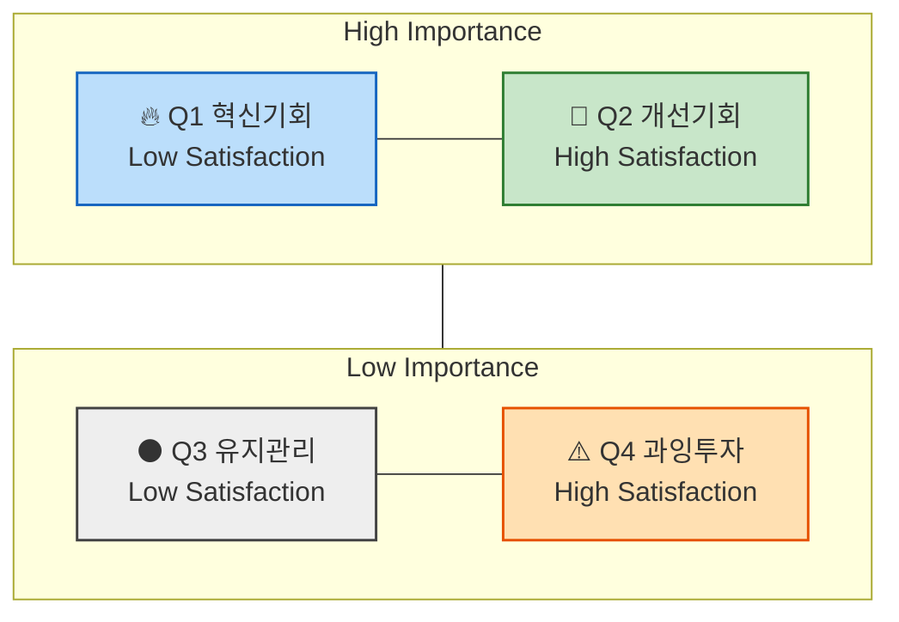

# 06 - 시장기회 분석 : 기회점수(OS) 기반 우선순위 판단

> 본 챕터의 분석은 이 문서에 정의된 방법론을 따른다.
> 이 방법론은 **챕터 05의 산출물(페르소나 스펙트럼 · 고객 여정지도)을 입력으로 받는다.** 점수를 매길 Pain 목록이 없으면 시작할 수 없다 (→ §2).

> 📥 **원문 반입 상태.** 강의 원문의 절 번호를 그대로 보존한다. **1️⃣ · 2️⃣ 반입 완료.**
>
> ⚠️ **`분석 결과물 포맷 규격` 절이 아직 없다.** 챕터 01~03과 같이 원문이 갖춰진 뒤 붙인다. 그전까지 이 문서만으로는 같은 수준의 산출물이 재현되지 않는다.

---

## 1️⃣ `기회점수(OS, Opportunity Score)`란?
&nbsp;&nbsp;&nbsp;&nbsp; & `조정형 기회점수(AOS, Adjusted Opportunity Score)`란?

> **전통적 `기회점수` OS**의 수식에서는
> 고객의 불만족 수준 계산에 고객의 기대치(`중요도`)와 만족도 지표를 직접 사용합니다.
> 하지만, 이 경우 고객이 문제(Pain, Goal, Job)에 대해 가지고 있는 기대치(`중요도`)가 두 번 반영됩니다.
>
> - 아래와 같이 `Importance`가 두 번 반영되면, **실제 시장감각을 왜곡**하는 문제가 발생하게 됩니다.
>
>     ```markdown
>     **OS = Importance(기대치) + (Importance(기대치) - Satisfaction(만족도))(불만족도) = Importance x 2 - Satisfaction(만족도)**
>     ```
>
> **조정형 `기회점수` AOS**는 그러한 수식을 개선하여,
> 고객의 불만족 수준을 고객의 기대치 및 중요도와 관계 없는 방법을 사용해
> `비율 계산 형태` (`1−Satisfaction / 5`) 로 도출한 뒤,
> 거기에 `Importance`를 곱하여 **현실적 혁신기회 강도**를 산출합니다.
>
> - 아래의 변경된 수식을 사용하면 실제 시장감각에 더 가까운 계산이 가능합니다.
>
>     ```markdown
>     **AOS = Importance × (1 - Satisfaction(rate) / 5)**
>     ```

---

### 💡 AOS(Adjusted Opportunity Score)의 정의

| 항목 | 설명 |
| --- | --- |
| Importance | 고객에게 Pain/Goal이 얼마나 중요한가 (1~5점) |
| Satisfaction | 현재 이 Pain이 얼마나 잘 해결되고 있는가 (1~5점) |
| 1−Satisfaction/5 | 충족되지 않은 영역(Unmet Need)의 비율 |
| AOS | "중요하지만 덜 해결된 문제"의 강도 |

### 📊 점수 해석 예시

| Pain / Goal | Importance | Satisfaction | 1-Satisfaction<br>(rate) | AOS | 해석 |
| --- | --- | --- | --- | --- | --- |
| 리포트 자동화의 한계 | 5 | 2(40%) | 0.6 | 5×(1−0.4)=3.0 | 명확한 혁신 기회 |
| AI 학습 피로감 | 3 | 2 |  | 3×(1−0.4)=1.8 | 부분적 개선 기회 |
| 데이터 공유 비효율 | 4 | 3(60%) | 0.4 | 4×(1−0.6)=1.6 | 유지관리 대상 |
| 신뢰 부족 | 2 | 4 |  | 2×(1−0.8)=0.4 | 저기회 영역 |

> 🖊️ *편집 메모 — 원문에서 2·4행의 `1-Satisfaction(rate)` 칸은 비어 있다. AOS 계산식에서 역산하면 각각 **0.6**, **0.2** 다.*

---

### 📈 AOS 시각화 구조



> 🖊️ *편집 메모 — 위 다이어그램은 원문 그대로다. 다만 `Top --- Bottom` 이 subgraph 를 엣지 끝점으로 만들기 때문에 렌더러에 따라 내부 `direction LR` 이 무시되어 **사분면이 세로로 늘어설 수 있다.** 그렇게 보이면 `Top --- Bottom` 한 줄을 지우면 된다.*

- **사분면 형태로 시각화**

    `X축`: Satisfaction (충족도), `Y축`: Importance (중요도)

- **사분면 해석 방법**

    | 사분면 | 조건 | 의미 | 전략 행동 |
    | --- | --- | --- | --- |
    | Q1 | High AOS | 혁신기회(High Importance + Low Satisfaction) | JTBD 인터뷰 대상, MVP 실험 우선 |
    | Q2 | 중간 AOS | 개선기회 | 지속적 개선 필요 |
    | Q3 | Low AOS | 유지/보완 | UX·마케팅 최적화 중심 |
    | Q4 | 0 근처 | 과잉투자 위험 | 자원 분배 재검토 |

### [참고] 매트릭스에서 사분면 상하 좌우를 가르는 수치 기준점은 어디인가?

#### 💡 A. 점수 척도 기반 단순 **기준점 수립 (최초 분석/설계를 위한 분석)**

가장 단순하고 직관적인 방식.

Likert 5점 척도(1~5)를 그대로 쓰고, 중간값 **3.0**을 중심선으로 삼는다.

| 축 | 기준점 | 의미 |
| --- | --- | --- |
| Satisfaction | 3.0 | 이 이상은 "대체로 만족" |
| Importance | 3.0 | 이 이상은 "대체로 중요" |
| AOS | 2.0~2.5 | 중요도·불만족의 평균 이상 |

📘 **활용법:**

- 문제의식 및 솔루션의 유형에 따라 기준을 조정해도 괜찮음
- 예: "Importance가 4 이상인 Pain만 상단으로 올리자."
- **목표는 구조적 사고 훈련**
→ 문제 해결을 구조화하는 데에 초점

#### 💡 B. 기존 사업에서의 **데이터 분포에 따라 수립**

이미 사업 운영중에 있고 여러차례 도출된 점수 분포가 존재하는 경우,
평균값과 표준편차를 이용해 사분면을 **데이터 기반으로 자동 구분**할 수 있다.

| 항목 | 계산 | 해석 |
| --- | --- | --- |
| Importance 기준선 | 전체 Importance 평균(μ₁) | 평균 이상 → 상단 |
| Satisfaction 기준선 | 전체 Satisfaction 평균(μ₂) | 평균 이하 → 좌측 |
| AOS 기준선 | 전체 AOS 평균 + 0.5σ | 이 값 이상 → "기회 영역" |

- 예시:

    ```
    Importance 평균 = 3.6
    Satisfaction 평균 = 2.9
    AOS 평균 = 2.1
    ```

    - Y축 기준(Importance): 3.6
    - X축 기준(Satisfaction): 2.9
    - 버블 경계(AOS): 2.1

📘 **해석 포인트:**

"우리 사업의 실제 평가 분포"에 맞게 사분면이 형성되므로
페르소나나 산업별 편향을 줄일 수 있다.

> 🖊️ *편집 메모 — **어느 기준을 썼는지는 산출물에 반드시 명시한다.** 기준선이 바뀌면 같은 AOS가 다른 사분면에 떨어지므로, 기준을 밝히지 않은 사분면 배치는 재현되지 않는다. [분석-03](./분석-03-식량-재분배-플랫폼.md)은 **B(평균 기반)** 을 적용했고, A·중앙값과의 차이를 §0 민감도 표에 함께 남겼다.*
>
> 🖊️ *편집 메모 — **B를 5점 척도에 적용할 때의 주의.** 정수 점수에 평균 기준선을 그으면 선이 정수 사이에 떨어져 **한 등급 전체가 통째로 한쪽으로 몰린다.** 분석-03에서는 Importance 기준선 4.31이 4와 5 사이에 놓여 4점 항목 전부가 하단(Low Importance)으로 내려갔다. **이때는 사분면 이름보다 AOS 값을 우선해 읽어야 한다** — 사분면은 두 축을 각각 이분한 요약이고 AOS는 두 축을 곱해 강도를 직접 잰 값이다.*

---

## 2️⃣ 평가 대상 정의 – 무엇을 (재료로) 점수화하는가?

- **`우리가 설계한 솔루션`** 에 대한 **페르소나 스펙트럼과 고객 여정 지도**에 대하여
- **`기존 솔루션 생태계`** 하에서 **고객이 겪고 있는 Pain/Job 상황**을 평가합니다.

| 분석 단계 | 평가 단위 = `고객 타겟` | 평가 대상 = `Pain 정의 내용` |
| --- | --- | --- |
| 페르소나 단계 | 각 페르소나의 주요 Pain·Goal | "이 사람에게 가장 중요한 고통은 무엇인가?" |
| 고객 여정 지도 | 여정 단계별 Pain Point / 개선기회 | "고객 여정 중 어디서 좌절이 가장 큰가?" |
| ~~*JTBD 인터뷰 사전 단계*~~ | ~~*Job Statement 단위*~~ | ~~*"이 고객이 진보를 이루기 위해 수행하는 일(Job)은 무엇인가?"*~~ |

> ✅ **앞선 분석 결과 중 무엇을 사용하는가?**
>
> - 페르소나가 도출되기 전, "`문제정의`", "`Segment`" 단계의 Pain List 를 사용하면 어떻게 될까요?
> - 페르소나 Spectrum 4가지 중 어떤 페르소나가 가진 Pain List 를 사용해야 할까요?

> *분석 & 기획 단계에서는 최대한 많은 "유효한" 문제들에 시장기회 점수를 매겨서 내림차순으로 정렬해 봅니다*
