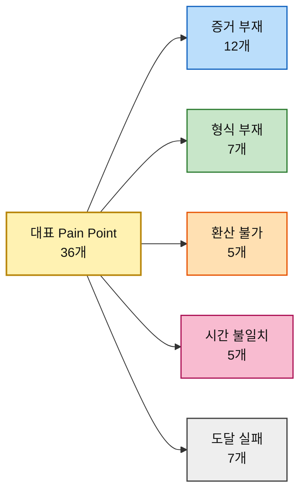

# 평가 대상 ③ — 대표 Pain Point 36개와 그 Goal

> [분석 방법론 §2](./분석-방법론.md) · 출처 [챕터 05 고객 여정지도 ③](../05-persona-journey/분석-03-식량-재분배-플랫폼-고객여정지도.md) · [페르소나 스펙트럼 ③](../05-persona-journey/분석-03-식량-재분배-플랫폼-페르소나-스펙트럼.md)

> 🎯 **이 문서의 용도.** 방법론 §2가 요구하는 **AOS 채점 대상**을 확정한다. 고객 여정지도의 Pain Point 92개에서 **페르소나 12명 × 3개 = 36개**를 대표로 추리고, 각 Pain이 **어떤 Goal을 막고 있는지**를 함께 적었다. **Importance·Satisfaction 채점은 아직 하지 않았다** — 이 문서는 채점표의 왼쪽 열이다.

---

## 1. 선정 규칙과 Goal 열의 의미

방법론 §2가 열어둔 두 질문에 먼저 답하고 추렸다.

| 방법론의 질문 | 이 분석의 답 |
|---|---|
| *"문제정의·Segment 단계의 Pain List를 쓰면 어떻게 될까?"* | **쓰지 않았다.** 챕터 04의 Q1~Q4 사분면은 이 사업에서 고객 지도가 아니라 **물자 지도**로 판명됐다. 그 단계의 Pain List로 점수를 매기면 고객이 아니라 **파트너의 고통**에 점수를 매기게 된다 |
| *"스펙트럼 4가지 중 누구의 Pain List를 써야 할까?"* | **넷 다 쓴다.** 여정지도에서 **개인은 증거에서, 기관은 승인에서 막힌다**는 것이 확인됐다. 한 유형만 고르면 다른 집단의 기회가 통째로 사라진다 |

그 위에서 인물마다 세 개씩 골랐다.

| # | 규칙 | 이유 |
|---|---|---|
| **1** | 그 인물의 **최대 병목 단계**에서 반드시 하나 | 여정지도 §14가 판정한 병목을 빠뜨리면 대표성이 없다 |
| **2** | **서로 다른 단계**에서 뽑는다 | 한 단계에 몰리면 그 인물의 여정 전체가 아니라 한 구간만 점수화된다 |
| **3** | **이탈로 직결**되는 것 우선 | 불편(inconvenience)이 아니라 중단(drop-off)을 일으키는 것 |

### Goal을 두 층으로 적은 이유

방법론 §2의 평가 단위는 *"각 페르소나의 주요 Pain·Goal"* 이다. **Pain만으로는 Importance와 Satisfaction을 매길 수 없다.** 무엇에 대한 중요도이고 무엇에 대한 충족도인지가 정해져야 점수가 의미를 갖는다.

| 층 | 무엇인가 | 어디에 쓰는가 |
|---|---|---|
| **페르소나 Goal** | 그 사람이 이 서비스와의 관계 전체에서 이루려는 것 | Importance의 상한을 잡는다 |
| **막히는 Goal** *(Pain별)* | 그 단계에서 달성하려다 막힌 구체적 목표 | **Satisfaction의 채점 대상.** *"지금 쓰는 대체 솔루션으로 이 Goal이 얼마나 달성되는가"* 를 묻는다 |

---

## 2. 골격 A · 개인 기부자형 — 18개

### 개인 소액 정기 후원자 「오천 원이 몇 킬로냐」

> 🎯 **페르소나 Goal** — 내 후원금이 **몇 kg을 어디로 옮겼는지** 숫자로 확인하는 것

| ID | 여정 단계 | Pain Point | 막히는 Goal | 선정 사유 |
|---|---|---|---|---|
| **P01** | ② 의심 검문 | 운영비 비율과 집행 내역이 없어 의심을 풀 근거를 찾지 못한다 | 내기 전에 **이 단체가 새지 않는다는 것을 스스로 확인**하는 것 | 결제 전 차단 지점 |
| **P02** | ③ 환산 | 금액과 결과의 관계를 몰라 얼마를 낼지 정하지 못한다 | 낼 금액을 **결과 기준으로 스스로 정하는** 것 | 이 인물을 정의하는 문제 |
| **P03** | ⑤ 공백 | 집하·선적·통관 리드타임 동안 신호가 없어 방치됐다고 느낀다 | 결제 후에도 **내 돈이 움직이고 있음을 계속 확인**하는 것 | **최대 병목** |

### 일회성 충동 기부자 「뉴스 보고 들어왔다」

> 🎯 **페르소나 Goal** — 30초 안에 결제를 끝내고, 결과는 나중에 알림으로 받는 것

| ID | 여정 단계 | Pain Point | 막히는 Goal | 선정 사유 |
|---|---|---|---|---|
| **P04** | ① 충돌 | 감정의 유효 시간이 몇 분이라 그 안에 끝나지 않으면 사라진다 | **마음이 움직인 그 순간에** 행동을 끝내는 것 | 이 여정의 제한 시간 |
| **P05** | ④ 결제 | 회원가입·본인인증을 요구하는 순간 대부분 이탈한다 | **계정을 만들지 않고** 결제를 마치는 것 | **최대 병목** |
| **P06** | ⑤ 공백 | 연락처를 받지 못하면 이 사람은 여정에서 영구히 사라진다 | 잊고 있어도 **결과가 나를 찾아오게** 하는 것 | ⑥·⑦을 통째로 삭제하는 구조적 손실 |

### 타 기부 플랫폼 정기 후원자 「이미 다른 데 후원 중」

> 🎯 **페르소나 Goal** — 같은 금액으로 더 명확한 결과. 후원처를 정리할 판단 근거를 얻는 것

| ID | 여정 단계 | Pain Point | 막히는 Goal | 선정 사유 |
|---|---|---|---|---|
| **P07** | ② 의심 검문 | 단체마다 성과 단위가 달라 비교 자체가 성립하지 않는다 | 지금 내는 곳과 여기를 **같은 잣대로 견주는** 것 | **최대 병목** |
| **P08** | ④ 결제 | 갈아타기를 요구받는다고 느끼면 죄책감 때문에 아예 중단한다 | 기존 후원을 **끊지 않고 부담 없이 시작**해 보는 것 | 전환 직전의 역효과 |
| **P09** | ⑤ 공백 | 비교 대상이 옆에 있어 무소식 기간이 곧바로 열등으로 읽힌다 | 병행 중인 두 곳 중 **어디가 나은지 계속 판단**하는 것 | 이 인물에게만 있는 상대 평가 |

### 해외 거주·비카드 결제 기부 시도자 「결제까지 못 간다」

> 🎯 **페르소나 Goal** — 실패 없이 끝까지 가는 결제 경로를 찾는 것

| ID | 여정 단계 | Pain Point | 막히는 Goal | 선정 사유 |
|---|---|---|---|---|
| **P10** | ③ 환산 | 통화 단위가 원화로만 표시되어 금액 감각이 서지 않는다 | **내가 쓰는 통화로** 금액 감각을 잡는 것 | 결제 전 이탈 요인 |
| **P11** | ④ 결제 | 해외 발행 카드 거절·국내 휴대폰 본인인증 요구·저대역 미로딩 중 어디서든 끊긴다 | **거주국에서도 끊기지 않고** 결제를 완료하는 것 | **최대 병목** |
| **P12** | ⑥ 증명 | 거주국에서 인정되지 않는 기부금영수증은 실질 혜택이 0이다 | 기부에 대한 **제도적 인정을 거주국에서도** 받는 것 | 재기부 동기 소멸 |

### 극단적 투명성 요구 기부자 「원 단위로 캐묻는다」

> 🎯 **페르소나 Goal** — 원 단위 집행 내역과 외부 감사 결과를 확보하는 것

| ID | 여정 단계 | Pain Point | 막히는 Goal | 선정 사유 |
|---|---|---|---|---|
| **P13** | ② 의심 검문 | 집계 총액만 있고 건별 집행 내역이 없어 검증이 중단된다 | 합계가 아니라 **건별로 돈의 흐름을 검증**하는 것 | **최대 병목** |
| **P14** | ②′ 소액 테스트 | 소액 기부자에게 결과 보고를 생략하면 테스트가 실패로 끝난다 | 큰돈을 넣기 전에 **작은 돈으로 이 조직을 시험**하는 것 | 이 인물 전용 단계 |
| **P15** | ⑥ 증명 | 인수 확인을 우리가 입력했다면 증명이 자기증명으로 무너진다 | **증명의 출처가 우리가 아님**을 확인하는 것 | 증명 체계의 신뢰 근간 |

### 국제 구호 불신 시민 「어차피 중간에서 샌다」

> 🎯 **페르소나 Goal** — **없다.** 안 내는 것이 합리적 선택이라고 이미 판단했다. 굳이 적자면 *"그 판단을 유지하는 것"*

| ID | 여정 단계 | Pain Point | 막히는 Goal | 선정 사유 |
|---|---|---|---|---|
| **P16** | ⓪ 무관심 | 우리 채널로는 도달 자체가 되지 않는다 | 관심 없는 사안에 **시간과 주의를 쓰지 않는** 것 *(우리와 반대 방향의 Goal)* | 여정 진입 실패 |
| **P17** | ① 충돌 | 우리가 하는 말은 광고로 분류되어 내용이 읽히지 않는다 | **광고와 정보를 빠르게 구분**해 걸러내는 것 | 화자 문제 |
| **P18** | ② 의심 검문 | 불신을 반증할 제3자 근거가 검색 결과에 존재하지 않는다 | 안 내겠다는 판단이 **옳았는지 최소 비용으로 확인**하는 것 | **여정 종료 지점** |

---

## 3. 골격 B · 기관 심사형 — 9개

### 기업 사회공헌·ESG 담당 「이사회에 보고할 숫자」

> 🎯 **페르소나 Goal** — 기업명으로 **분기당 "O톤 운송"** 실적을 확보하고, 임직원이 직접 참여할 형태를 만드는 것

| ID | 여정 단계 | Pain Point | 막히는 Goal | 선정 사유 |
|---|---|---|---|---|
| **P19** | ③ 설계·산정 | 돈만 내는 안은 사내 설득이 안 되는데 임직원 참여 프로그램이 준비되어 있지 않다 | 예산만 쓴 것이 아니라 **사내가 함께 움직였다고 말할 수 있는** 것 | ④ 승인의 선행 조건 |
| **P20** | ④ 내부 승인 | 결재선이 요구하는 것은 감동이 아니라 리스크 부재 증명인데 그 자료가 없다 | **결재선을 한 번에 통과**시키는 것 | **최대 병목** |
| **P21** | ⑦ 성과 수령 | 운송 리드타임과 분기 보고 마감이 어긋나면 그해 실적으로 쓸 수 없다 | **분기 보고서에 확정 수치로** 실적을 넣는 것 | **급소** — 성과가 있어도 무효가 된다 |

### 공여기관·재단 프로그램 오피서 「어디가 비어 있나」

> 🎯 **페르소나 Goal** — 재원 가용액과 부족분을 비교해 **비어 있는 칸**에 넣고, 사후 성과 보고까지 마치는 것

| ID | 여정 단계 | Pain Point | 막히는 Goal | 선정 사유 |
|---|---|---|---|---|
| **P22** | ⓪ 연간 계획 | 전 세계 재원 현황이 기관별로 흩어져 있어 출발점부터 불완전하다 | **어디가 비었는지 한눈에 보고** 배분을 시작하는 것 | 재원 대시보드 기능의 존재 이유 |
| **P23** | ④ 내부 승인 | 심의는 실적과 감사 대응 자료를 요구하는데 신생 기관은 실적이 없다 | **신생 파트너를 심의에서 방어**하는 것 | **최대 병목** |
| **P24** | ⑦ 성과 수령 | 제3자 검증이 없는 자체 보고는 감사에서 근거로 인정되지 않는다 | **감사에서 버티는 성과 근거**를 확보하는 것 | 재배분 차단 |

### 임팩트 투자·사회적 금융 담당 「톤당 얼마인가」

> 🎯 **페르소나 Goal** — 톤당 단가와 그 개선 추이를 확인해 *"돈을 더 넣으면 효율이 오르는가"* 에 답하는 것

| ID | 여정 단계 | Pain Point | 막히는 Goal | 선정 사유 |
|---|---|---|---|---|
| **P25** | ① 후보 발굴 | 법인격과 수익 모델이 불명확하면 검토 대상 목록에 오르지 못한다 | **검토 대상 목록에 올릴 수 있는지** 판정하는 것 | 진입 자체가 막힌다 |
| **P26** | ③ 설계·산정 | 톤당 운송 단가 시계열이 없어 규모의 경제 가설을 검증할 수 없다 | **돈을 더 넣으면 효율이 오르는지** 확인하는 것 | 판단 근거 부재 |
| **P27** | ④ 내부 승인 | 비영리 구조에는 회수 경로가 없어 투자 형식 자체가 성립하지 않는다 | **자금을 집행할 형식을 찾는** 것 | **최대 병목** — 형식 불일치 |

---

## 4. 골격 C · 매개형 — 6개

### 제3자 모금 캠페인 주최자 「우리 반이 한 트럭」

> 🎯 **페르소나 Goal** — 우리 이름으로 된 모금함 + 실시간 진척 + **"우리가 옮긴 톤수"** 결과물을 남기는 것

| ID | 여정 단계 | Pain Point | 막히는 Goal | 선정 사유 |
|---|---|---|---|---|
| **P28** | ② 신뢰 검문 | 정산 투명성을 주최자 개인이 책임져야 하면 부담 때문에 포기한다 | **내 이름을 걸어도 뒤탈이 없다**는 것을 확인하는 것 | 개설 전 이탈 |
| **P29** | ⑤ 확산 | 진척이 눈에 보이지 않으면 참여자가 안 모이고, 주최자가 먼저 포기한다 | **참여자가 계속 모이도록 판을 유지**하는 것 | **최대 병목** |
| **P30** | ⑥ 결과 회수 | 결과가 개인 단위로만 오면 '우리가 함께 한 것'이 사라진다 | *"우리가 함께 O톤을 옮겼다"* 를 **집단의 이름으로 남기는** 것 | 이 인물의 목표 그 자체 |

### 언론·연구자·정책 담당 「기사에 쓸 숫자」

> 🎯 **페르소나 Goal** — 출처가 명시된 재원·물량 데이터와 인용 가능한 시각화를 확보하는 것

| ID | 여정 단계 | Pain Point | 막히는 Goal | 선정 사유 |
|---|---|---|---|---|
| **P31** | ② 신뢰 검문 | 출처·산출식이 없으면 인용 자체가 불가능하다 | **인용해도 내가 다치지 않을 출처**인지 판정하는 것 | 인용의 최소 조건 |
| **P32** | ③ 소재 확보 | 이미지만 있고 원본 데이터가 없으면 재가공을 못 해 다른 출처로 간다 | **마감 안에 재가공 가능한 데이터**를 확보하는 것 | **최대 병목** |
| **P33** | ⑥ 결과 회수 | 지표가 소리 없이 갱신되면 과거 기사와 어긋나 인용을 후회하게 된다 | 이미 나간 기사의 수치가 **계속 유효하도록 유지**하는 것 | 재인용 차단 |

---

## 5. 골격 D · 수혜형 — 3개

### IPC 3+ 위기 가구 구성원 「배급소에서 결과만 만난다」

> 🎯 **페르소나 Goal** — 다음 배급이 **언제 얼마나** 나오는지 아는 것

| ID | 여정 단계 | Pain Point | 막히는 Goal | 선정 사유 |
|---|---|---|---|---|
| **P34** | ② 명단 확인 | 명단 누락 시 이의 제기 절차가 없어 그대로 배제된다 | **배급 대상에서 빠지지 않는** 것 | **최대 병목** |
| **P35** | ③ 이동·대기 | 이동 비용과 대기 시간이 수령량의 가치를 잠식한다 | **받는 양보다 드는 비용이 크지 않게** 하는 것 | 실질 수혜 감소 |
| **P36** | ⑥ 다음 배급 불확실 | 다음 배급 시점을 모르면 미리 식사를 줄이는 선제적 결식이 일어난다 | **다음 끼니를 계획할 수 있는** 것 | 여정지도가 지목한 **최대 개선 지점** |

---

## 6. Goal 열 해설 — 36개의 목표를 세로로 읽으면

**막히는 Goal 열을 위에서 아래로 읽으면 동사가 한쪽으로 쏠린다.** 확인하다 · 검증하다 · 판정하다 · 견주다 · 방어하다 · 시험하다. 36개 중 **24개의 Goal이 무언가를 *얻는* 것이 아니라 무언가를 *판단하는* 것**이다. 나머지 12개도 대부분 *"잘못되지 않게 하는 것"* 쪽이지 *"더 얻는 것"* 이 아니다.

이것이 뜻하는 바는 분명하다. **고객이 이 서비스에서 이루려는 일은 대체로 "안전하게 결정하는 것"이다.** 식량이 옮겨지는 것은 그들이 원하는 결과이지만, 화면 앞에서 그들이 실제로 수행하는 일은 판단이다. 개인 소액 정기 후원자는 새지 않는지를 확인하려 하고, 기업 담당자는 결재선을 통과시키려 하며, 언론은 인용해도 다치지 않을지를 판정하려 하고, 임팩트 투자자는 목록에 올릴 수 있는지를 가리려 한다. **제품이 물류 서비스가 아니라 의사결정 보조 도구에 가깝다**는 여정지도 §16-6의 재정의가, Goal 열에서 독립적으로 다시 확인된다.

**두 층의 Goal이 어긋나는 자리가 특히 중요하다.** 페르소나 Goal은 대체로 결과 지향이다 — *"몇 kg을 옮겼는지 확인한다", "분기당 O톤 실적을 확보한다", "우리가 옮긴 톤수를 남긴다"*. 그런데 단계별로 막히는 Goal은 거의 전부 **위험 회피**다 — *"새지 않는지 확인", "결재선 통과", "뒤탈 없음 확인", "내가 다치지 않을 출처인지 판정"*. **원하는 것은 성과인데, 매 단계에서 실제로 하고 있는 일은 손실 회피다.** 이 간극이 여정이 길어지고 이탈이 많은 이유이며, 동시에 설계의 지침이 된다 — 각 단계에서 제공해야 할 것은 감동이 아니라 **안심의 근거**다.

**국제 구호 불신 시민의 Goal 열은 부호가 반대다.** P16의 Goal은 *"시간과 주의를 쓰지 않는 것"* 이다. 우리 서비스가 그 Goal을 달성시켜 주면 고객을 잃는다. 이 인물의 세 줄은 **AOS를 매길 때 Importance를 '우리에게 얼마나 중요한가'로 읽으면 안 된다** — 그 사람에게는 중요하고, 우리에게는 뚫어야 할 벽이다. P18(*"안 내겠다는 판단이 옳았는지 최소 비용으로 확인"*)만이 유일하게 양방향이다. 그 확인을 우리가 도와주되 결과가 반대로 나오게 만드는 것, 그것이 이 인물에 대한 유일한 접근 경로다.

**수혜형 3개만 Goal의 층위가 다르다.** P34·P35·P36의 Goal은 *"빠지지 않는 것", "비용이 크지 않게 하는 것", "다음 끼니를 계획하는 것"* 이다. 나머지 33개가 정보와 판단에 관한 것인 반면 이 셋만 **생존에 관한 것**이다. 같은 5점 척도에 올려놓으면 Importance가 전부 5로 수렴해 변별이 사라진다. **이 셋은 사업 우선순위 목록이 아니라 성과 판정 기준으로 따로 다뤄야 한다.**

**Goal이 겹치는 곳이 기능의 후보다.** *"확인하는 것"* 계열(P01·P03·P13·P15·P24·P28·P31)은 서로 다른 일곱 명이 서로 다른 단계에서 요구하지만, 요구하는 물건은 하나다 — **출처가 우리가 아닌 집행 기록**. *"견주는 것"* 계열(P02·P07·P26)은 **원 → kg → 명 공통 단위와 그 산출식** 하나로 묶인다. AOS 채점 후 상위권을 묶을 때 이 축을 쓰면 개별 Pain 36개가 아니라 **기능 단위 5~6개**로 정리된다.

---

## 7. 성격별 분류 — 36개를 가로지르는 다섯 갈래

| 성격 | 개수 | 해당 ID | 공통 처방 |
|---|:---:|---|---|
| **증거 부재** — 낼 근거·냈다는 증거가 없다 | **12** | P01 · P03 · P06 · P09 · P13 · P14 · P15 · P18 · P20 · P24 · P31 · P33 | 건별 집행 원장 · 진행 신호 · 제3자 검증 |
| **형식 부재** — 그릇이 없어 돈·자료가 못 들어온다 | **7** | P05 · P10 · P11 · P12 · P25 · P27 · P32 | 결제 경로 · 법인 구조 · 데이터 포맷 |
| **환산 불가** — 금액과 결과를 잇는 단위가 없다 | **5** | P02 · P07 · P19 · P26 · P30 | 원 → kg → 명 공통 단위와 산출식 |
| **시간 불일치** — 상대의 시계와 어긋난다 | **5** | P04 · P21 · P29 · P34 · P36 | 리드타임 확정과 사전 고지 |
| **도달 실패** — 여정에 들어오지도 못한다 | **7** | P08 · P16 · P17 · P22 · P23 · P28 · P35 | 화자 전환 · 진입 장벽 제거 |

> 📌 **증거 부재가 36개 중 12개로 단독 최다이며, 네 골격 전부에 걸쳐 있다.** 개인·기관·매개형이 각기 다른 이유로 같은 결핍에 걸린다. **AOS 채점 전이지만, 상위권이 이 갈래에서 나올 가능성이 높다.**

---

## 8. 채점 전에 확정할 것

| # | 확정 사항 | 지금 상태 |
|---|---|---|
| **1** | **사분면 경계 기준값** | 미확정. 방법론 §1의 Notion 링크 내용을 옮겨 적어야 한다. 중앙값으로 자를지 고정값(3.0)으로 자를지에 따라 Q1 목록이 달라진다 |
| **2** | **Satisfaction의 기준 대상** | 방법론 §2는 *"기존 솔루션 생태계 하에서"* 로 규정한다. 즉 **우리 서비스가 아니라 지금 그 사람이 쓰는 대체 솔루션**이 `막히는 Goal` 을 얼마나 달성시켜 주는지를 매긴다 |
| **3** | **Importance의 관점** | 원칙은 '그 사람에게 얼마나 중요한가'다. **국제 구호 불신 시민 3개는 부호가 반대이고, 수혜형 3개는 층위가 다르다** (→ §6) |
| **4** | **채점자와 근거** | **인터뷰가 없다.** 36개 전부 (가정) 등급이므로 채점값 역시 가정이다. 채점표에 근거 열을 두고 무엇에 기대어 매겼는지 남긴다 |

> ⚠️ **이 36개는 관찰된 Pain이 아니라 구조에서 추론한 Pain이다.** 출처인 여정지도 §17이 밝힌 대로 실측이 한 줄도 없으며, `막히는 Goal` 열은 그 Pain에서 한 번 더 추론한 것이므로 **한 단계 더 얇다.** **AOS 순위는 "무엇을 먼저 검증할지"의 순서이지 "무엇을 먼저 만들지"의 순서가 아니다.**
>
> ⚠️ **92개 → 36개로 줄이면서 버린 것이 있다.** 중복도가 높은 서술과 다른 인물에게 이미 잡힌 동일 구조의 Pain을 제외했다. **버려진 56개가 무의미하다는 뜻은 아니며**, AOS 상위권이 얇게 나오면 여정지도로 돌아가 보충해야 한다.

---

## 9. 다음 단계

1. §8의 4개 항목을 확정한다.
2. 36개에 Importance·Satisfaction을 매기고 **AOS = Importance × (1 − Satisfaction/5)** 로 계산한다. Satisfaction은 `막히는 Goal` 을 대상으로 매긴다.
3. **내림차순 정렬**하고 사분면에 배치한다 (방법론 §1).
4. 상위권을 §6 마지막 문단의 **Goal 계열**로 묶어 개별 Pain이 아니라 **기능 단위**로 환원한다.
5. Q1(혁신기회)에 떨어진 항목을 **챕터 07 JTBD 인터뷰 대상**으로 넘긴다.
