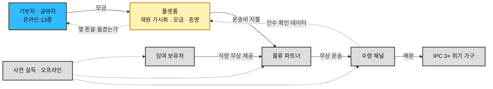
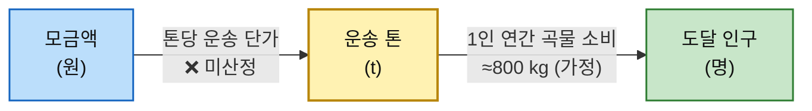
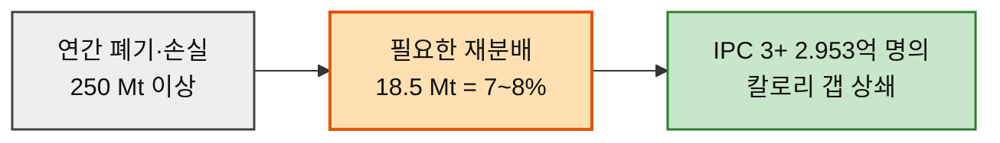
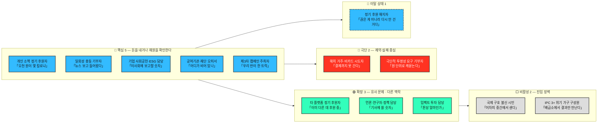
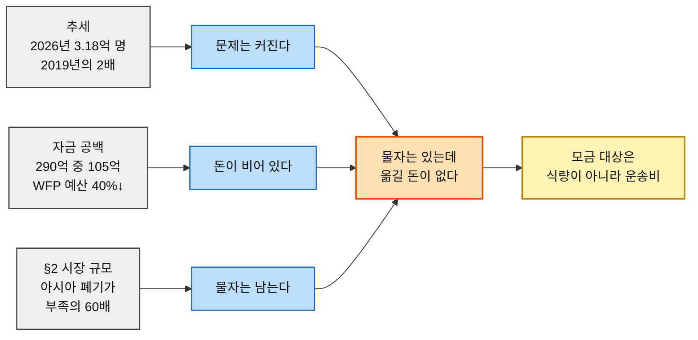
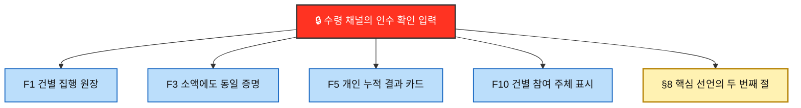
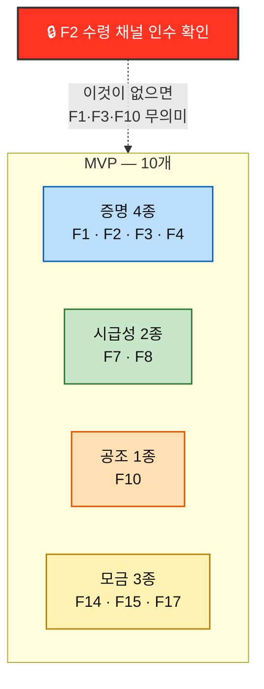

# Value Proposition ③ — Relief-Funded Free Food Transport Service

*구호재원 모금 기반 식량 무상 운송 서비스* · **v2.0 (rooted)** · 2026-08-14

> 🌳 **rooted — 뿌리를 함께 담은 판.** v1.0은 결론만 담고 근거는 링크로 걸었다. 이 판은 **챕터 04~08의 분석 지식을 이 문서 안에 직접 싣는다.** 링크를 따라가지 않아도 *"왜 그렇게 결론 났는가"* 가 여기서 끝난다.
>
> | 출처 | 이 문서 어디로 들어왔나 |
> |---|---|
> | **04** TAM-SAM-SOM | §2 시장 규모와 문제의 구조 |
> | **05** 페르소나 스펙트럼 · 고객 여정지도 | §3 고객 · §4 여정과 Pain |
> | **06** AOS · DOS · 혼합 매트릭스 | §5 기회 점수 |
> | **07** JTBD 인터뷰 | §6 고객이 고용하려는 일 |
> | **08** 경쟁 분석 · 가치목표 제안 | §7 기존 대안 · §9 차별적 가치 |

> ⚠️ **근거 등급이 항목마다 다르다.** §2·§7·§10-2는 **(확인 · 외부 실측)**, §3~§6은 **(가정 · 인터뷰 미실시)** 다. 상세는 §12. **이 문서에서 가장 견고한 것과 가장 얇은 것을 섞어 읽으면 안 된다.**

---

## 0. 한 장 요약

| 질문 | 답 |
|---|---|
| **무엇을 하는가** | 전 세계 구호 재원의 가용 현황을 보여주고 신규 구호자금을 모금한다. 잉여 식량은 **사전 설득으로 무상 확보**하고, 모금액은 식량이 아니라 **그것을 옮기는 운송비**에 넣는다 |
| **왜 성립하는가** | 아시아는 **버리는 양(+190 Mt)이 모자라는 양(−3 Mt)의 60배**다. 세계 폐기량의 **7~8%만 재분배해도** 급성 기아 인구의 칼로리 갭이 상쇄된다. 부족한 것은 곡물이 아니라 **곡물을 움직이는 비용**이다 |
| **누구에게 파는가** | 온라인에 오는 **13종의 인물.** 그중 돈을 내는 사람이 10종이고, 나머지 셋은 **매개자·불신 시민·수혜자**다 |
| **무엇을 파는가** | 식량이 아니라 **"당신의 돈이 몇 톤을 옮겼는가"라는 증명.** 다섯 개의 독립 경로가 전부 이 결론에 수렴했다 |
| **어떻게 다른가** | 경쟁 8곳 모두 **조직·국가 단위**로 성과를 말한다. 우리는 **건(件) 단위 + 수령 채널의 인수 확인**이며, *"확인이 없으면 세지 않는다"* 는 **자기 구속**을 선언에 넣는다 |
| **무엇부터 만드는가** | **MVP 10개** — 증명 4 · 시급성 2 · 공조 1 · 모금 3 |
| **무엇이 이 사업을 죽이는가** | **F2 수령 채널의 인수 확인 입력.** 파트너가 입력하지 않으면 증명 체계 전체와 핵심 선언의 절반이 성립하지 않는다 |

> 🚨 **이 문서 전체에서 단 하나만 기억한다면 이것이다.** 우리가 직접 만드는 산출물은 **기록**뿐이다. 식량은 남이 주고, 운송은 남이 하고, 수령 확인도 남이 입력한다. **제품은 물류 서비스가 아니라 의사결정 보조 도구에 가깝고, 조직은 물류 조직이 아니라 기록·검증 조직에 가깝다.**

---

# 1. 사업 정의

**전 세계 구호 재원의 가용 현황을 확인시키고 신규 구호자금을 모금하는 페이지**를 운영한다. 잉여 식량은 사전 설득으로 무상 확보하고, **모금액은 식량이 아니라 그것을 옮기는 운송비에 투입**한다. 성과 단위는 `모금액(원) → 운송 톤(t) → 도달 인구(명)` 이며, **고객에게 파는 것은 식량이 아니라 "당신의 돈이 몇 톤을 옮겼는가"라는 증명**이다.

| 층 | 내용 |
|---|---|
| **온라인에서 하는 일** | ① 전 세계 **구호 재원 가용 현황**을 확인시킨다 ② **신규 구호자금 모금**을 받는다 |
| **오프라인에서 하는 일** | 여러 행위자를 **사전 설득**해 식량 제공·운송·통관·수령 조건을 미리 확보한다 |
| **실행** | 확보된 조건과 모금된 재원으로 **잉여 지역 → 부족 지역 무상 운송**을 집행한다 |
| **돈이 쓰이는 곳** | **식량이 아니라 운송이다** |
| **파는 것** | **"당신의 돈이 몇 톤을 옮겼는가"라는 증명** |

> ⚠️ **점선 화살표 하나에 사업 전체가 걸려 있다.** `수령 채널 → 플랫폼` 의 **인수 확인 데이터**가 유일하게 우리 손 밖에서 들어오는 입력이며, 이것이 없으면 오른쪽 점선(*"몇 톤을 옮겼는가"*)이 성립하지 않는다. **고객에게 팔 상품을 파트너가 만들어 준다** — 이 구조가 이 사업의 최대 강점이자 최대 취약점이다.

---

# 2. 시장 규모와 문제의 구조 — 왜 이 사업이 성립하는가

이 절은 §7-2의 시급성 통계가 *"지금 문제가 크다"* 를 말한 뒤에 온다. 여기서 말하는 것은 다른 것이다 — **그 문제를 메울 물자가 이미 어디에 얼마나 있는가**, 그리고 **우리가 그중 얼마를 옮기겠다고 말하는가**.

## 2-1. 측정 단위 — 왜 금액이 아니라 톤인가

시장 규모는 **금액이 아니라 식량의 물리적 무게(톤)** 로 측정한다. 이 사업의 1차 성과는 매출이 아니라 *"몇 톤을 굶주린 곳으로 옮겼는가"* 이기 때문이다. 수익 구조는 톤 규모가 정해진 뒤에 얹는 층이므로, 규모 자체는 톤으로 잡는 것이 타당하다. **Mt = 백만 톤 · 1 Mt = 1,000,000 t**

이 단위 선택이 §5 Value Proposition의 성과 사슬과 그대로 맞물린다.

> 📌 **가운데 칸이 이 사업의 성과 단위다.** 왼쪽 화살표(톤당 운송 단가)는 아직 비어 있고, 오른쪽 화살표는 가정치다. **증명 체계가 실제로 증명해야 하는 숫자는 이 사슬의 두 화살표**이며, 그것이 톤당 운송 단가 산정이 다른 모든 항목의 선행 조건인 이유다.

## 2-2. 세계는 식량이 모자라서 굶는 것이 아니다

리서치 원본 ①의 진단이 이 사업의 존재 이유다.

> *"식량 공급(availability)은 되는데 접근성(accessibility)과 구매력(affordability), 안정성(stability)이 깨져 있는 구조야. 이 네 기둥 중 하나라도 무너지면 '풍요 속 기아'가 발생해."*

| 기둥 | 무너지는 방식 | 결과 |
|---|---|---|
| **가용성** availability | — 무너지지 않았다 | 세계 곡물 생산 **2,925 Mt** **(확인)** |
| **접근성** accessibility | 도로·전력·콜드체인 부족, 국경 통관 지연 | 아시아·아프리카에서 수확량 **20~40%** 가 시장 전에 부패·손실 **(확인)** |
| **구매력** affordability | 임금 정체·통화가치 하락·식품 가격 급등 | *"식량은 있어도 살 돈이 없는"* 인구 **28억 명** **(확인)** |
| **안정성** stability | 분쟁·제재·기후 충격 | IPC 5 단계 지속. 분쟁 직접 영향 **1.4억 명** **(확인)** |

결정적 수치는 이것이다. 2024년 IPC 3+ 인구 **2억 9,530만 명** **(확인)** 의 칼로리 결핍을 **전부** 메우는 데 필요한 곡물은 **약 18.5 Mt** **(추정 — 600 kcal/인·일 × 3.5 M kcal/t 환산)** 이다. 같은 기간 과잉·폐기로 사라지는 곡물은 해마다 **250 Mt 이상** **(확인)** 이다.

> 🎯 **버리는 것의 7~8%.** 이 한 줄이 *"물자는 남는데 옮길 돈이 없다"* 를 수치로 지지한다. 우리가 파는 것이 식량이 아니라 **운송**인 이유가 여기 있다 — 부족한 것은 곡물이 아니라 곡물을 움직이는 비용이다.

## 2-3. 시장 규모 3층 — TAM 500 Mt / SAM 2.5 Mt / SOM 25,000 t

| 층 | 수치 | 정의 | 등급 | 근거 |
|---|---|---|:---:|---|
| **TAM** | **연 500 Mt** (5억 톤) | 생산되었으나 사람의 입에 들어가지 못하고 사라지는 식량의 세계 연간 총량 | **(확인)** | 리서치 ① — *"매년 5억 톤의 음식이 손실되고 있습니다"* |
| **SAM** | **연 2.5 Mt** | 아시아 역내에서 발생하는 수급 불균형 중 물리적·제도적으로 닿을 수 있는 범위 | **(추정)** | 리서치 ① 5절 — 아시아 충격 유발 부족 약 2~3 Mt |
| **SOM** | **연 25,000 t** (0.025 Mt) | 1년 안에 실제로 옮길 수 있는 물량 | **(가정)** | SAM의 1%. **리서치에 근거 없는 목표 설정값** |

### 각 층을 좁힌 기준

| 이행 | 좁히는 기준 | 근거 |
|---|---|---|
| TAM → SAM ① | **지역 한정 — 아시아** | 아시아는 세계 곡물 생산의 **약 54%**(≈1,450 Mt)를 차지하는 최대 생산지이자 최대 손실 지역 **(확인)** |
| TAM → SAM ② | **대상 한정 — 실제 부족분** | 폐기량 전체가 아니라 **부족한 만큼**만이 재분배의 상한이다 |
| TAM → SAM ③ | **물류 도달 가능성** | *"거리가 짧아도 정치·안보·인프라 병목이 풀리지 않으면 곡물이 못 들어갑니다"* → 봉쇄·분쟁 지역 제외 |
| SAM → SOM | **1년차 집행 역량** | 도출값이 아니라 **설정값**이다. 근거가 없다는 사실을 숨기지 않는다 |

### TAM의 자릿수 검증

| 교차 근거 | 수치 | 등급 |
|---|---|:---:|
| 세계 곡물 생산량 | 약 2,925 Mt (FAO CSDB) | **(확인)** |
| FAO 식품손실지수(수확 후~소매 이전) | **13.2%** (2021, SDG 12.3.1) | **(확인)** |
| → 곡물만 환산 | 2,925 × 13.2% ≈ **386 Mt** | **(추정)** |
| 곡물 과잉·폐기 최근 5년 평균 | **250~300 Mt** | **(확인)** |

> 📌 **500 Mt은 '전체 식량 폐기'가 아니다.** 곡물만으로 386 Mt이고 여기에 과일·채소가 더해지므로 자릿수는 통과한다. 다만 FAO/UNEP가 별도 집계하는 *식품 손실 + 음식물 쓰레기 전체*는 십억 톤 단위이므로, **500 Mt은 '유통 단계에서 상품성을 잃은 식량'으로 범위를 한정한 값**으로 읽어야 한다.

## 2-4. 왜 아시아인가 — 과잉과 부족이 같은 대륙 안에 있다

이 대조가 **사업 성립의 근거**다. 지역을 아시아로 좁힌 것은 접근성 때문이 아니라, 아시아만이 아래 구조를 갖고 있기 때문이다. *(2019–2024 5개 작황연도 기준)*

| 지역 | 과잉·폐기 | 충격 부족 | 배율 | 구조 | 등급 |
|---|---:|---:|:---:|---|:---:|
| **아시아** | **+190 Mt** | **−3 Mt** | **60배 이상** | 버리는 양만으로 부족을 덮고도 남는다 | **(확인)** |
| 아프리카 | +40 Mt | −15 Mt | 2.7배 | **폐기 < 부족** 구조에 근접 — 생산 자체가 부족 | **(확인)** |
| 아메리카 | +86 Mt | −50 Mt | 1.7배 | 충격 규모가 커서 여유가 얇다 | **(확인)** |
| 유럽/CIS | +57 Mt | −25 Mt | 2.3배 | 수출 차질형 | **(확인)** |

> 🎯 **이것이 SAM을 아시아로 잡은 결정적 근거다.** 아프리카는 폐기보다 부족이 커서 역내 재분배만으로 해결되지 않는다 — 외부 조달이 필요하고, 그 순간 사업은 *"어디서 구하나"* 문제가 된다. 반면 **아시아는 역내에 버려지는 양만으로 역내 부족을 60배 이상 덮을 수 있다.** 아시아에서만 이 사업은 *"물량을 어디서 구하나"* 가 아니라 **"어떻게 옮기나"** 하나로 좁혀진다. **우리가 조달이 아니라 운송을 파는 것은 지역 선택의 결과다.**

## 2-5. 아시아 손실의 실제 구성 — 실측

+190 Mt은 추정 합산치지만, 그 아래 국가별 실측이 같은 방향을 가리킨다.

| 항목 | 수치 | 등급 |
|---|---|:---:|
| 세계 수확 후~소매 이전 손실률 | **13.2%** (2021). 2016년 13%에서 **거의 변동 없음** | **(확인)** |
| 중앙·남아시아 손실률 | **20% 이상** — 세계 최고 | **(확인)** |
| 중앙·남아시아 곡물 손실률 | **약 21%** vs 북미·유럽 **16%** | **(확인)** |
| 남아시아 생산 대비 폐기 | **30% 이상** ≈ **3억 명분** | **(확인)** |
| **인도** 곡물 연간 손실 | 약 **2,300만 t** (생산량의 10% 이상) | **(확인)** |
| **인도** 과일 연간 손실 | 약 **1,200만 t** | **(확인)** |
| **파키스탄** 과일·채소 | 생산 1,376만 t 중 **35~40%** ≈ **500만 t** | **(확인)** |
| **필리핀** 벼 건조 단계 | 최대 **33%** (수확 12% · 탈곡 15%와 별도) | **(확인)** |
| **필리핀·인도네시아** 과일 | 최대 **50%** / 약 **20%** | **(확인)** |
| 저장 단계 곡물 손실 | **10~20%** (해충·설치류·곰팡이) | **(확인)** |

> 📌 **손실은 소비자 식탁이 아니라 산지와 창고에서 발생한다.** 개도국 식품 손실의 **40% 이상이 수확 후 처리·저장·운송 단계**에서 나온다 **(확인)**. 이 사실이 두 가지를 결정한다 — ⓐ 확보 대상은 소매 잔여물이 아니라 **산지·유통 물량**이고, ⓑ 손실의 원인이 **콜드체인·도로·통관**이라면 **그것을 사는 돈이 곧 운송비**다.

## 2-6. SOM 25,000 t — 상향식 교차 검증

하향식(SAM의 1%)으로 잡은 값을 물류 단위로 되짚는다.

| 항목 | 값 | 환산 |
|---|---|---|
| 대형 트럭 1대 적재량 | 약 **25 t** | 25,000 t = **트럭 1,000대분** = 하루 **약 2.7대** |
| 40ft 컨테이너 1개 적재량 | 약 **26 t** | 25,000 t = **컨테이너 약 960개** = 주당 약 **18개** |
| 성인 1인 연간 곡물 소비 | 약 **800 kg** **(가정)** | 25,000 t ≈ **성인 약 3만 명**의 1년치 |

> 📌 **자릿수 검증 통과.** 하루 트럭 3대는 1년차 집행 규모로 **공격적이지만 불가능하지 않다.** 동시에 이 수치는 **실패 판정선**이기도 하다 — 하루 3대조차 옮기지 못하면 모델 자체를 재검토해야 한다. **SOM은 목표인 동시에 손절선이다.**

## 2-7. 이 절의 미해결 항목

| # | 항목 | 상태 | 무엇을 막고 있나 |
|:---:|---|:---:|---|
| **1** | **TAM 500 Mt의 원 출처** — FAO(2011, 13억 t) / UNEP Food Waste Index(2024, 약 10억 t) / FAO SDG 12.3.1(13.2%) 중 어느 정의인가 | ❌ 미확인 | 대외 인용 시 정의 불일치 위험 |
| **2** | **SAM 2.5 Mt의 집계 범위** — 리서치 ① 4절 세부 합산은 **13 Mt**(동아시아 −3 · 동남아 −6 · 중앙아시아 −4), 5절 통합 차트는 **−3 Mt** | ❌ 미확인 | **절대값을 말하는 순간 5배 차이**가 난다 |
| **3** | **톤당 운송 단가** | ❌ 미산정 | 모금 목표·단위 경제·기업 실적 확정의 **공통 선행 조건** |
| **4** | 성인 1인 연간 곡물 소비 **800 kg** | ⚠️ 가정 | 국가별 편차가 커 대상 지역 기준 보정 필요 |

> ⚠️ **TAM과 SAM은 측정 대상이 다르다.** TAM 500 Mt은 **버려지는 양**, SAM 2.5 Mt은 **모자라는 양**이다. 두 숫자는 동전의 양면이지 포함 관계가 아니다. 따라서 **세 층을 하나의 동심원으로 읽지 않는다.** 규모 산정에 유효한 것은 **SAM 한 층**이고, TAM 500 Mt은 그 위에 얹힌 **문제 제기용 대조 수치**다. 챕터 06 DOS가 SAM만을 기본 모수로 채택한 이유도 같다 — *"정의가 바뀌지 않는 유일한 층"* 이기 때문이다.
>
> 🖊️ **그럼에도 둘을 나란히 두는 것이 낫다.** 500 Mt(버리는 양)과 2.5 Mt(모자라는 양)을 위아래로 붙이면 *"이만큼 버리면서 이만큼 모자라다"* 는 모순이 한눈에 보인다. **시장 규모 산정용 차트와 문제 제기용 차트는 원래 다른 물건**이다.

## 2-8. 폐기된 전제 — 수치는 유효하다

챕터 04는 이 사업을 **잉여 보유처와 부족 지역을 잇는 양면 매칭 플랫폼**으로 전제하고 계산했다. 그 전제는 챕터 05에서 폐기됐다. **폐기된 것은 전제이지 계산이 아니다.**

| 챕터 04의 산출물 | 확정 모델에서의 지위 |
|---|---|
| **TAM 500 Mt · SAM 2.5 Mt · SOM 25,000 t** | ✅ **유효.** 여전히 *"옮겨야 할 물리적 규모"* 다. 단 동심원으로 읽지 않는다 |
| **아시아 +190 Mt ↔ −3 Mt 대조** | ✅ **유효.** 오히려 확정 모델에서 근거로서의 무게가 커졌다 — 조달이 아니라 운송을 파는 이유이므로 |
| **Q1~Q4 Market Segment Map** | 🔄 **유효하되 고객 지도가 아니다.** 두 축(식량 수급 상태 · 표적 우선순위)이 모두 **식량의 소재**를 가리키므로 이것은 **물자 지도**다. 사분면 안의 인물은 고객이 아니라 **사전 설득 대상 파트너**다 |
| **Q1 → 플랫폼 → Q4 화살표** | 🔄 **물자 흐름으로는 유효.** 흐름을 여는 것은 화면 위의 매칭이 아니라 **오프라인 사전 설득 + 모금된 운송비**다 |
| *"파는 것은 연결이다"* | ❌ **폐기.** 파는 것은 **증명**이다 — *"당신의 돈이 몇 톤을 옮겼는가"* |

> 🗺️ **돈을 내는 사람은 두 축 어디에도 놓이지 않는다.** 챕터 04의 사분면에서 고객을 뽑는 방식이 이 사업에서 성립하지 않는 이유이며, **고객이 13종 페르소나로 따로 도출된 이유**다. 챕터 04가 답한 것은 *"무엇을 얼마나 옮기는가"* 이고, *"누가 그 값을 내는가"* 는 챕터 05가 새로 물어야 했던 질문이다.

---

# 3. 고객 — 누가 돈을 내는가

## 3-1. 고객은 시장 지도 밖에 있다

챕터 04의 Segment Map은 두 축(식량 수급 상태 × 표적 우선순위)이 **모두 식량의 소재**를 가리킨다. **돈을 내는 사람은 그 지도 어디에도 없다.** 그래서 고객은 사분면에서 뽑지 않고 **별도로 도출**했다.

도출 방법은 **페르소나 스펙트럼** — 핵심(Core) / 확장(Adjacent) / 극단(Extreme) / 비활성(Non-user) 네 유형으로 나누어 **극단·비활성까지 포함**해 포용성과 사용 맥락의 다양성을 확보하는 방식이다.

## 3-2. 13인의 핵심 Pain · Needs

| 인물 | 유형 | 핵심 Pain | 핵심 Needs | 병목 |
|---|---|---|---|:---:|
| **개인 소액 정기 후원자** 「오천 원이 몇 킬로냐」 | 🔵 핵심 | 리드타임 동안 신호가 없다. 알림이 와도 **"또 뭐 달라고 할까봐" 열지 않는다** | 추가 요구 없이 진행 상태와 내 돈에 연결된 결과 확인 | ⑤ 공백 |
| **일회성 충동 기부자** 「뉴스 보고 들어왔다」 | 🔵 핵심 | 감정 유효 시간이 몇 분인데 **회원가입·본인인증에서 막힌다.** 연락처를 못 받으면 **여정에서 영구 소실** | 30초 안에 비회원 결제, 결과는 나중에 수신 | ④ 결제 |
| **기업 사회공헌·ESG 담당** 「이사회에 보고할 숫자」 | 🔵 핵심 | 운송 리드타임과 **분기 마감이 어긋나** 그해 실적으로 못 쓴다 | 마감 전 확정 수치, 사내 검토 자료, 임직원 참여 실적 | ⑦ 성과 수령 |
| **공여기관·재단 오피서** 「어디가 비어 있나」 | 🔵 핵심 | 재원 현황이 흩어져 **갭 판단에 2~3주.** 신생 파트너는 심의 요건을 못 맞춘다 | 출처가 분명한 재원 갭, 중복 방지, 감사 가능한 증빙 | ④ 내부 승인 |
| **제3자 캠페인 주최자** 「우리 반이 한 트럭」 | 🔵 핵심 | 참여자가 결과를 물어도 **답할 집단 자료가 없다** | 참여자가 보는 진척, 자동 명단, 종료 후에도 남는 집단 결과 | ⑤ 확산 |
| **타 플랫폼 정기 후원자** 「이미 다른 데 후원 중」 | 🟢 확장 | **"끊는 것도 일"** 이고 죄책감이 정리를 막는다 | 통화·사과 없이 해지·감액, 부담 없는 병행 시험 | ② · ④ |
| **언론·연구자·정책 담당** 「기사에 쓸 숫자」 | 🟢 확장 *(매개자)* | 원자료는 방대하고 느리며 버전이 바뀌면 과거 기사도 위험해진다 | 출처·기준일·산출식, CSV/API, 버전·정정 이력 | ③ 소재 확보 |
| **임팩트 투자 담당** 「톤당 얼마인가」 | 🟢 확장 | 회수 구조가 없으면 **첫 스크리닝 30초에 탈락** | 투자 가능한 자금 형식, 톤당 단가 다년 시계열 | ④ 내부 승인 |
| **해외 거주·비카드 시도자** 「결제까지 못 간다」 | 🔴 극단 | 해외 카드·국내 본인인증·저대역 중 **어디서든 끊긴다** | 거주국에서도 실패하지 않는 결제와 제도적 인정 | ④ 결제 |
| **극단적 투명성 요구 기부자** 「원 단위로 캐묻는다」 | 🔴 극단 | 총액만 있고 **건별 내역이 없다.** 단체가 입력한 인수 확인은 자기증명이다 | 총액→개별 건 역추적, 수령 채널 확인, 소액에도 같은 증명 | ② 의심 검문 |
| **정기 후원 해지자** 「끊은 게 아니라 다시 안 건 거다」 | 🔵 이탈 상태 | 카드 재발급 뒤 **이름을 봐도 무엇 하는 곳인지 떠오르지 않아** 다시 걸지 않았다 | 시간이 지나도 기억나는 결과, 부담 없는 재시작 경로 | ① 무기억 |
| **국제 구호 불신 시민** 「어차피 중간에서 샌다」 | ⬜ 비활성 | 우리 메시지를 광고로 분류하고 **안 내는 것이 합리적**이라 판단한다 | 설득 카피가 아니라 **검색 가능한 제3자 근거** | ② 의심 검문 |
| **IPC 3+ 위기 가구 구성원** 「배급소에서 결과만 만난다」 | ⬜ 비활성 *(성과 판정 기준)* | 다음 배급 시점을 몰라 **미리 식사를 줄인다** | 명단 이의 절차, 예고 수량·일정, 예측 가능성 | ⑥ 다음 배급 |

> 📌 **결제 단위가 5천 원에서 수억 원까지 벌어져 있다.** 일회성 충동 기부자는 **1회·수천 원**, 개인 소액 정기 후원자는 **월·수천 원**, 캠페인 주최자는 **캠페인 단위·수십만 원**, 기업 담당은 **분기·수천만 원**, 공여기관 오피서는 **연·수억 원**이다. 같은 '기부'라는 단어를 쓰지만 **의사결정 구조가 개인 충동에서 기관 심사까지 벌어져 있다.**
>
> 🔑 **13명 중 8명이 같은 한 가지를 요구한다 — 증명.** 대체 솔루션 칸을 세로로 읽으면 이탈 사유가 대부분 *"결과를 못 봐서"* 다. **제품의 중심은 모금 폼이 아니라 증명 체계다.**
>
> 🎯 **극단 사용자가 비활성 시장을 여는 열쇠다.** 극단적 투명성 요구 기부자와 국제 구호 불신 시민은 **같은 불신에서 출발**하는데, 앞은 조건이 채워지면 지불하고 뒤는 하지 않는다. **투명성 요구 기부자 기준으로 설계하면 불신 시민의 일부가 넘어온다.**
>
> 🚨 **비지불 페르소나 둘이 지불 페르소나를 만든다.** 언론·연구자는 **외부 증거**를, 극단적 투명성 요구 기부자는 **검증 기준**을 공급한다. 둘 다 돈을 내지 않지만 빼면 개인 소액 정기 후원자가 성립하지 않는다. **모금 전환율을 올리는 지렛대가 비지불 페르소나에 있다.**

## 3-3. 사전 설득 대상 명부 — 스펙트럼 밖

아래 7주체는 **사용자가 아니라 공급 조건을 이루는 파트너**다. **페이지에 접속하지 않으며**, 우리가 찾아가 미리 설득한다. 따라서 **화면 설계 대상이 아니라 계약·조건 설계 대상**이다.

| 행위자 | 무엇을 설득하는가 | 설득이 실패하면 |
|---|---|---|
| 대형 유통 물류센터 재고 처분 담당 | 폐기 대신 **무상 제공**, 하루 안 픽업 수용 | 물량 자체가 없다 |
| 식품 제조사 공장 재고·품질 담당 | 팔레트 단위 무상 제공, 브랜드 비노출 조건 | 대량 물량 확보 실패 |
| 유통·제조사 법무·리스크 담당 | 기부자 **면책**, 재판매 방지 조건 | 위 둘이 승인받지 못한다 |
| 3PL·선사 배차 담당 | 공차 구간 **무상·할인 운송** | 모금액 대비 운송량이 급락한다 |
| 통관·검역 당국 | 관세·검역 면제, 신속 통관 | 항구에서 부패한다 |
| **수령 채널** (WFP·국제 NGO·지자체) | 인수·배분 수행, **인수 확인 데이터 입력** | **증명이 성립하지 않아 모금이 멈춘다** |
| 산지 집하장·농협 운영자 | 규격 외 물량 제공 *(2차 확장)* | 물량 확대가 막힌다 |

> 🔑 **명부에 딱 하나 온라인 접점이 있다 — 수령 채널의 '인수 확인'이다.** 이 한 번의 입력이 없으면 소액 후원자의 *"내 오천 원이 몇 kg"* 도, 기업 담당의 *"분기 O톤"* 도, 투명성 요구 기부자의 집행 내역도 **전부 성립하지 않는다.** **설득 대상 중 유일하게 화면을 설계해야 하는 상대**이며, 동시에 **가장 바쁘고 인터넷이 가장 불안정한 상대**다.
>
> ⚠️ **이 명부의 실재성이 이 사업의 최대 미검증 가정이다.** 기부자 페르소나가 아무리 정확해도, 식량과 운송을 무상으로 내줄 파트너가 없으면 **모금할 것 자체가 없다.** 접촉은 아직 한 건도 없다.

---

# 4. 고객 여정과 Pain

## 4-1. 단계를 서비스에서 새로 도출했다

일반형 5단계(`문제 인식 → 탐색 → 의사결정 → 사용 → 유지`)를 쓰지 않았다. 이 서비스에는 **일반형에 없는 관문이 셋** 있기 때문이다.

| # | 이 서비스에만 있는 관문 | 왜 |
|---|---|---|
| **② 의심 검문** | 내기 전에 반드시 통과한다 | 기부는 **결과를 보고 사는 것이 아니라 믿고 먼저 내는 것**이다 |
| **③ 환산** | 원 → kg 변환이 있어야 금액을 정한다 | 5,000원이 얼마인지 모르면 **얼마를 낼지 결정할 수 없다** |
| **⑤ 공백** | 결제 후 결과가 오기까지 아무 일도 없는 구간 | 운송 리드타임이 수 주~수 개월이다 |

> 📌 **결제(④)는 여정의 끝이 아니라 중간이다.** 가치가 실제로 전달되는 지점은 **⑥증명**이며, 그 앞의 **⑤공백이 가장 길다.** ①~④는 하루 안에 끝나는데 ⑤는 몇 주에서 몇 달이다. **여정 시간의 대부분을 차지하는 구간에 설계가 가장 적게 들어가 있다.**

**13명이 하나의 단계 집합을 공유하지 않는다.** 네 골격과 한 변형으로 갈라진다.

| 골격 | 인물 | 결정적 차이 |
|---|---|---|
| **A. 개인 기부자형** (8단계) | 6명 | 혼자 결정하고 즉시 결제한다. **의심 검문과 공백**이 병목 |
| **A′. 이탈·재진입형** (8단계) | 정기 후원 해지자 | 골격 A의 뒷절반이 실패한 뒤. **결심 없이 끝나고 재등록 목록에서 탈락** |
| **B. 기관 심사형** (9단계) | 3명 | **내부 승인**이 추가된다. 본인이 원해도 조직이 막는다 |
| **C. 매개형** (8단계) | 2명 | **본인은 돈을 내지 않고 남을 움직인다.** 발행 후 확산이 성패 |
| **D. 수혜형** (8단계) | IPC 3+ 위기 가구 | **결제도 증명도 화면도 없다.** 배급 현장의 여정이며 우리 성과의 실체 |

## 4-2. 어디서 멈추는가

| 골격 | 인물 | 최대 병목 | 병목의 성격 |
|---|---|---|---|
| A | 개인 소액 정기 후원자 | ⑤ 공백 | 결제 후 소멸 |
| A | 일회성 충동 기부자 | ④ 결제 (가입 강요) | 속도 |
| A | 타 플랫폼 정기 후원자 | ② 의심 검문 (비교 불가) | 판단 근거 |
| A | 해외 거주 시도자 | ④ 결제 (기술적 실패) | 접근성 |
| A | 극단적 투명성 요구 기부자 | ② 의심 검문 (내역 부재) | 검증 |
| A | 국제 구호 불신 시민 | ② 의심 검문 (여정 종료) | 도달·신뢰 |
| **A′** | **정기 후원 해지자** | **① 무기억 축적** | **기억** |
| B | 기업 사회공헌 담당 | ④ 내부 승인 / ⑦ 시점 불일치 | 조직·회계 주기 |
| B | 공여기관 오피서 | ④ 내부 승인 (실적 부재) | 신뢰 이력 |
| B | 임팩트 투자 담당 | ④ 내부 승인 (형식 불일치) | 자금 구조 |
| C | 제3자 캠페인 주최자 | ⑤ 확산 (진척 비가시) | 사회적 부담 |
| C | 언론·연구자 | ③ 소재 확보 (원본 부재) | 데이터 형식 |
| D | IPC 3+ 위기 가구 | ⑥ 다음 배급 불확실 | 예측 가능성 |

**세로로 읽어서 나오는 네 가지**

1. **개인은 '증거'에서 막히고, 기관은 '승인'에서 막히며, 이탈자는 '기억'에서 막힌다.** 개인 6명 중 5명이 ②·⑤에서 걸리고, 기관 3명 전원이 ④에서 걸린다. **두 집단은 다른 제품을 필요로 한다** — 앞은 증명 체계, 뒤는 **승인 통과용 문서 패키지**다.
2. **결제 자체가 병목인 사람은 열셋 중 둘뿐이다.** 나머지 열하나에게 결제 폼은 병목이 아니다. **결제 최적화는 이 서비스에서 우선순위가 낮다.**
3. **Pain 99개 중 절반 이상이 '보이지 않아서' 생긴다.** 집행 내역이 안 보이고(②), 진행 상태가 안 보이고(⑤), 내 몫이 안 보이고(⑥), 진척이 안 보이고(C-⑤), 다음 배급일이 안 보이고(D-⑥), **무엇을 했는지가 기억에 안 남는다(A′-①).**
4. **가장 늦게 도착하는 것이 가장 중요하다.** 여덟 개 여정에서 가치 전달 지점이 **여정의 맨 뒤**에 있고 그 앞의 공백이 가장 길다.

## 4-3. 골격을 넘어 반복되는 Pain 여섯

| 공통 Pain | 겪는 인물 | 해소하는 것 |
|---|---|---|
| 집행 내역이 없어 낼 근거가 없다 | 개인 기부자형 6명 전원 + 공여기관 오피서 | 건별 집행 원장 + 외부 검증 |
| 결제 후 진행 상태가 보이지 않는다 | 소액 후원자 · 타 플랫폼 · 투명성군 · 기업 CSR · 캠페인 주최자 | 집하 → 선적 → 통관 중간 신호 |
| 성과가 내 단위로 오지 않는다 | 소액 후원자 · 충동 기부자 · 캠페인 주최자 · 기업 CSR | 개인·집단·기업별 분리 집계 |
| **증명의 출처가 우리 자신이다** | 투명성군 · 공여기관 오피서 · 언론·연구자 | **수령 채널의 인수 확인 · 제3자 검증** |
| **예정 시점을 알 수 없다** | 기업 CSR(분기 마감) · IPC 3+ 위기 가구(다음 배급) | **리드타임 확정과 사전 고지** |
| 결과가 기억에 남지 않는다 | 해지자 · 소액 후원자 · 충동 기부자 | 결과를 실은 알림 + 재등록 시점 회상 자료 |

> ⚠️ **네 번째와 다섯 번째가 급소다.** 둘 다 우리가 아니라 **수령 채널과 물류 파트너**가 쥐고 있다.

## 4-4. 여정 13개를 겹쳐야 보이는 일곱 가지

### ① 고객마다 시계가 다르고, 물류는 그중 어느 것과도 맞지 않는다

| 인물 | 시간 단위 | 인내의 한계 |
|---|---|---|
| 일회성 충동 기부자 | **분** | 감정이 식는 몇 분 |
| IPC 3+ 위기 가구 | **일** | 다음 끼니 |
| 개인 소액 정기 후원자 | **월** | 무소식 두 달 |
| 정기 후원 해지자 | **없음** | 인내가 아니라 **망각**이 한계다 |
| 캠페인 주최자 | **캠페인 기간(2~4주)** | 모집 종료 시점 |
| 기업 사회공헌 담당 | **분기** | 분기 보고 마감일 |
| 공여기관 오피서 | **연** | 회계연도 |
| — **실제 운송 리드타임** | **수 주 ~ 수 개월** | — |

> 📌 **이 사업의 근본 마찰은 신뢰가 아니라 시간이다.** 증명이 부실해서 늦는 게 아니라 **애초에 모든 고객이 물류보다 빠르게 산다.** 대응은 둘뿐이다 — 리드타임을 줄이거나, **중간 신호로 빈 시간을 채우거나.** 후자가 압도적으로 싸다.

### ② 사회적 성과와 상업적 성과가 같은 기능에서 나온다

| 누구의 문제 | 무엇을 요구하는가 | 필요한 역량 |
|---|---|---|
| IPC 3+ 위기 가구의 최대 개선 | 다음 배급 예정일 고지 | **리드타임 확정** |
| 기업 사회공헌 담당의 급소 | 분기 마감 전 실적 확정 | **리드타임 확정** |

> 🎯 **트레이드오프가 아니라 정렬이다.** 리드타임 확정에 쓰는 돈은 수혜자와 고객에게 동시에 간다. *"수혜자를 위할 것인가 고객을 위할 것인가"* 라는 자원 배분 논쟁을 없애 주고, **그 자체가 대외 설득 서사가 된다.**

### ③ 돈이 있어도 그릇이 없으면 못 받는다

| 자금의 종류 | 받으려면 필요한 그릇 | 지금 있는가 |
|---|---|---|
| 개인 기부 | 결제 · 기부금영수증 | 있다고 가정 |
| 기업 기부 | 전자계약 · 세금계산서 · **품의 첨부 자료** | **없음** |
| 공공·공여 자금 | 협약서 · 성과지표 정의 · **감사 대응 문서** | **없음** |
| 임팩트 자본 | 성과연계지급(PbR) · 대출 등 **회수 구조** | **없음** |

> 📌 **모금 페이지를 아무리 잘 만들어도 그릇이 하나뿐이면 들어올 수 있는 돈의 종류가 하나뿐이다.** 다음 과제는 UI가 아니라 **법인 구조와 계약 서식**이며, **개발 로드맵과 별개의 트랙**으로 잡아야 한다.

### ④ 획득 채널이 광고가 아니라 매개자다

13명 중 둘 — 언론·연구자와 캠페인 주최자 — 은 **본인은 한 푼도 내지 않고 남을 데려온다.** 그리고 국제 구호 불신 시민에게 닿는 **유일한** 경로가 전자다.

| 매개자 | 데려오는 사람 | 필요한 도구 | 이것의 정체 |
|---|---|---|---|
| 언론·연구자 | 불신 시민 · 소액 후원자 | 원본 데이터 다운로드 · 표준 인용 문구 | **제품 백로그** |
| 캠페인 주최자 | 수십 명의 참여자 | 진척 위젯 · 자동 정산 | **제품 백로그** |

> 📌 **광고비로 살 수 없는 것을 기능으로 살 수 있다.** 흔히 마케팅 예산으로 분류되는 일을 **제품 개발 항목으로 전환**한다. 신생 조직에게 이 전환은 비용 구조 자체를 바꾼다.

### ⑤ 제품의 뒷절반을 우리가 소유하지 않는다

13개 여정 중 **12개의 가치 전달 지점**이 수령 채널과 물류 파트너의 데이터에 의존한다. 통상적인 플랫폼은 앞단(획득)이 어렵고 뒷단(전달)이 자동인데 **여기서는 정확히 반대다.**

> 📌 **따라서 방어 가능한 자산은 화면이 아니라 파트너 망이다.** 경쟁자가 모금 페이지는 하루면 베끼지만, **인수 확인을 안정적으로 받아내는 관계는 베끼지 못한다.**

### ⑥ 우리가 파는 것은 운송이 아니라 검증된 기록이다

식량은 사전 설득으로 무상 확보하고, 운송은 파트너가 수행한다. **우리가 유일하게 직접 만드는 산출물은 기록이다.**

> 🎯 이 정의를 받아들이면 조직의 성격이 바뀐다. **물류 조직이 아니라 기록·검증 조직에 가깝다.** 채용 우선순위(물류 전문가 vs 회계·데이터 검증 인력), 시스템 투자, 파트너십의 순서가 전부 달라진다.

### ⑦ 지금은 화면을 나누지 않는다

개인형과 기관형이 다른 제품을 원하는 것은 맞지만, **기관형 3명의 병목(④ 내부 승인)은 화면이 아니라 문서로 풀린다.**

| 시점 | 개인형 | 기관형 |
|---|---|---|
| **초기** | 화면 하나 | **문서 패키지로 대응** — 화면 없음 |
| **기관 고객이 반복 유입된 뒤** | 유지 | 전용 화면 검토 |

> 📌 **다른 제품이 필요하다는 결론이 곧 화면을 둘 만들라는 뜻은 아니다.** 실사 자료·품의 첨부·협약 서식은 **개발이 아니라 작성으로 만들어진다.**

---

# 5. 기회 점수 — 어느 문제가 큰가

## 5-1. 두 개의 자

| 지표 | 식 | 재는 것 |
|---|---|---|
| **AOS** *(조정형 기회점수)* | `Importance × (1 − Satisfaction/5)` | **고객 미충족의 강도** — 그 사람이 얼마나 아픈가 |
| **DOS** *(시장 가중형)* | `(Importance − Satisfaction) × Market Relevance` | **시장 파급력** — 그 아픔이 닿는 자금의 크기 |

**Satisfaction의 대상은 우리 서비스가 아니라 지금 그 사람이 쓰는 대체 솔루션**이다. 대체 솔루션이 잘하고 있으면 우리에게는 기회가 아니다.

**Market Relevance는 톤이 아니라 재원으로 환산한다.** Pain 38개 중 35개가 돈을 내는 사람의 것이므로, 분모가 식량 톤이면 단위가 맞지 않는다.

`SAM 2.5 Mt × 톤당 운송 단가 = 조달해야 할 총 재원(원) → 자금원별 구성비 → 인물별 MR`

| 자금원 | **SAM 기준** *(확장 국면)* | **SOM 기준** *(1년차)* | 차이의 근거 |
|---|:---:|:---:|---|
| 기관 공여 (정부 ODA·국제기구·재단) | **45%** | 15% | SAM 규모는 기관 자금 없이 불가능하나, 1년차 신생 조직은 심의를 통과하기 어렵다 |
| 기업 (CSR·매칭그랜트) | **25%** | 15% | 기업도 실적 없는 신생과는 계약을 꺼린다 |
| 개인 정기 | 18% | **30%** | 1년차 매출의 중심 |
| 개인 일회성·캠페인 | 10% | **35%** | 사건 기반 유입과 제3자 캠페인이 초기 최속 채널 |
| 임팩트 자본·대출 | 2% | 5% | 두 층 모두 작다. **형식 자체가 성립하지 않는다** |

> ⚠️ **이 구성비가 이 챕터에서 가장 먼저 흔들릴 값이다.** 근거 있는 추정이 아니라 **작업 가정**이며, 바뀌면 DOS 순위가 통째로 바뀐다.

## 5-2. 채점 결과 — Pain 38개

기준선은 **평균 기반(방법론 B)** 이다. Importance **4.29** · Satisfaction **2.92** · AOS 기회 경계 **2.41**.

**AOS 상위 — 기회 경계 이상 11개** *(= Q1 혁신기회와 정확히 일치)*

| ID | Pain | 인물 | Imp | Sat | **AOS** | DOS(SAM) | DOS(SOM) |
|---|---|---|:---:|:---:|:---:|:---:|:---:|
| **P13** | 집계 총액만 있고 **건별 집행 내역이 없다** | 투명성군 | 5 | 1 | **4.0** | 0.72 | **1.20** |
| **P36** | 다음 배급 시점을 몰라 **선제적 결식**이 일어난다 | 위기 가구 | 5 | 1 | **4.0** | *제외* | *제외* |
| **P37** | 5년을 냈는데 **무엇을 하는 곳인지 기억나지 않는다** | 해지자 | 5 | 1 | **4.0** | 0.72 | **1.20** |
| **P03** | 리드타임 동안 **신호가 없어 방치됐다고 느낀다** | 소액 후원자 | 5 | 2 | **3.0** | 0.54 | 0.90 |
| **P15** | **인수 확인을 우리가 입력하면 자기증명**이 된다 | 투명성군 | 5 | 2 | **3.0** | 0.54 | 0.90 |
| **P21** | 리드타임과 **분기 마감이 어긋나** 실적으로 못 쓴다 | 기업 CSR | 5 | 2 | **3.0** | **0.75** | 0.45 |
| **P22** | 전 세계 **재원 현황이 흩어져** 출발점이 불완전하다 | 공여기관 | 5 | 2 | **3.0** | **1.35** | 0.45 |
| **P30** | 결과가 개인 단위로만 와 **'함께 한 것'이 사라진다** | 캠페인 주최자 | 5 | 2 | **3.0** | 0.30 | **1.05** |
| **P27** | **회수 경로가 없어** 투자 형식이 성립하지 않는다 | 임팩트 투자 | 5 | 2 | **3.0** | 0.06 | 0.15 |
| **P11** | 카드 거절·본인인증·저대역 중 **어디서든 끊긴다** | 해외 거주 | 5 | 2 | **3.0** | 0.06 | 0.09 |
| **P34** | 명단 누락 시 **이의 절차가 없어 배제**된다 | 위기 가구 | 5 | 2 | **3.0** | *제외* | *제외* |

## 5-3. 검증이 상위권을 세 개 무너뜨렸다

초판은 12인 36개였다. **경쟁 조사(공급 측)와 모의 인터뷰(수요 측)가 각각 독립적으로** 상위권을 뒤집었다.

| ID | 항목 | 초판 | 지금 | 무엇이 뒤집었나 |
|---|---|:---:|:---:|---|
| **P07** | 후원처 비교 공통 단위 | AOS **4.0 · 공동 1위** | AOS **2.0 · 17위** | 수요 — *"비교를 해야 한다는 생각을 안 해봤어요"* 공급 — **GiveWell이 이미 제공** (생명 1명당 3,500~5,500달러) |
| **P14** | 소액에도 동일한 증명 | AOS 3.2 · 4위 | AOS **1.6 · 21위** | 공급 — **ShareTheMeal이 0.80달러 단위**로 목적지 지정 제공 |
| **P09** | 후원처 상대 비교 | AOS 3.2 · 4위 | AOS 2.4 · 12위 | 공급 — GiveWell Top Charities 목록 |
| **P37** 🆕 | 이름 인지 유지 | *(인물조차 없었다)* | **AOS 4.0 · 공동 1위** | 모의 세션에서 **13번째 인물이 발견됐다** |

> 🚨 **AOS·DOS 양쪽에서 최상위였던 '비교 단위' 계열이 통째로 소멸했다.** 기능 환원에서 **2위 덩어리(합 7.2)** 였던 것이 사라졌다.
>
> 🎯 **그 빈자리를 '기억·재접촉'이 채웠다.** 초판의 어떤 문서에도 없던 덩어리이며, **인터뷰에서만 나올 수 있는 발견**이었다. **채점표는 이미 아는 것에만 점수를 매긴다** — 이것이 인터뷰를 대체할 수 없는 이유다.
>
> 📌 **그럼에도 1위는 흔들리지 않았다.** 초판 §6이 *"가장 흔들리기 쉬운 값은 Satisfaction 1점 5개"* 라고 경고했고 **그 다섯 중 셋이 실제로 뒤집혔는데, P13(건별 원장)은 두 조사를 모두 통과했다.** 경고가 적중했다는 사실이 **살아남은 항목의 신뢰도를 오히려 높인다.**

## 5-4. 기능 단위 환원 — 여섯 덩어리

| 기능 | 포함 Pain | **AOS 합** | 초판 대비 |
|---|---|:---:|---|
| **① 증명 체계** — 건별 원장 · 인수 확인 주체 · 진행 신호 · 운영비 내역 · 감사 근거 | P13 · P15 · P03 · P01 · P24 | **14.4** | 17.6 → 14.4 *(P14 이탈)* · **여전히 1위** |
| **② 기억·재접촉** — 이름 인지 유지 · 재시작 경로 | P37 · P38 | **6.4** | 🆕 **신규 2위** |
| **③ 자금 그릇** — PbR·대출·해외 결제 | P27 · P11 | **6.0** | 유지 |
| **④ 재원 가시화** — 갭 대시보드 · 단위 경제 | P22 · P26 | **5.4** | 유지 |
| **⑤ 시점 확정** — 분기 마감 기준 실적 | P21 | **3.0** | 유지 |
| **⑥ 집단 결과물** — 캠페인 단위 성과 | P30 | **3.0** | 유지 |
| ~~**비교 단위**~~ | ~~P07 · P09~~ | ~~4.4~~ | ❌ **2위(7.2)에서 소멸** |
| *(별도)* **수혜 접근성** | P36 · P34 · P35 | *9.4* | 성과 판정 트랙 |

## 5-5. 두 축을 겹치면 — 혼합 매트릭스

**네 개가 SAM·SOM 두 매트릭스 모두 🔥 최우선에 남는다.**

| ID | 항목 | 계열 |
|---|---|---|
| **P13** | 건별 집행 원장 | 증명 체계 |
| **P03** | 진행 중 상태 신호 | 증명 체계 |
| **P15** | 인수 확인 주체 | 증명 체계 |
| **P37** | 이름 인지 유지 | 기억·재접촉 |

| 사분면 | 처방 | 해당 |
|---|---|---|
| 🔥 **최우선** | **MVP 범위로 잡는다** | 위 넷 + SAM에선 P21·P22, SOM에선 P30 |
| 💰 **시장 주도** | **영업·제안 자료로 푼다.** 제품 기능이 아닐 수 있다 | P24 감사 근거 |
| 🎯 **니치** | **로드맵 뒤로 미루되 버리지 않는다** | P11 해외 결제 · P27 자금 형식 |
| ⬜ **후순위** | **세 갈래로 나눈다** — 위생 요건 / 간접 채널 / 과잉 충족(DOS 음수) | 나머지 |

> 📌 **인물 단위로 보면 층마다 주인공이 다르다.**
>
> | 층 | 1위 | 2위 |
> |---|---|---|
> | **SAM (확장)** | 공여기관 오피서 **2.25** | 극단적 투명성 요구 기부자 1.44 |
> | **SOM (1년차)** | 극단적 투명성 요구 기부자 **2.40** | 개인 소액 후원자 · **정기 후원 해지자** 각 1.80 |
>
> **공여기관 오피서는 확장의 열쇠이면서 1년차에는 열리지 않는 문이다.** 그 자물쇠가 **P23(신생 기관은 심의에 낼 실적이 없다)** 인데, 정작 P23의 DOS는 0이다 — 이미 대체 수단(기존 파트너)이 있어 미충족이 0으로 잡히기 때문이다. **자물쇠는 점수로 드러나지 않는다.**

> ⚠️ **AOS 순위는 "무엇을 먼저 만들지"가 아니라 "무엇을 먼저 검증할지"의 순서다.** 채점값이 전부 가정이므로 상위 항목은 **확신의 목록이 아니라 검증 대상의 목록**이다.

---

# 6. JTBD — 고객이 고용하려는 일

## 6-1. Job Statement 8종

| # | 인물 | Situation (When…) | **Job (…I want to…)** |
|:---:|---|---|---|
| **J1** | 개인 소액 정기 후원자 | 밤에 혼자 영상을 보다가 감정이 움직인 순간 | 마음이 움직인 그 자리에서 **무언가 했다는 상태로 넘어가고자** 함 |
| **J2** | 극단적 투명성 요구 기부자 | 연 1회 갱신 검토 시점, 결산 공시가 나오는 때 | 믿는 대신 **확인해서, 계속 낼지 스스로 판정하고자** 함 |
| **J3** | 타 플랫폼 정기 후원자 | 카드 정리·연말정산으로 자동이체 목록을 마주치는 순간 | 늘어난 후원을 정리하되 **끊는 사람이 되지 않으면서 정리하고자** 함 |
| **J4** | 공여기관·재단 오피서 | 연간 배분 계획 수립기, 작년 목록을 처음 여는 순간 | 비어 있는 칸을 찾아 배분하되 **심의와 감사에서 방어 가능한 형태로** 집행하고자 함 |
| **J5** | 제3자 캠페인 주최자 | 모금 종료 한 달 뒤, 참여자가 *"그거 어떻게 됐어요?"* 라고 묻는 순간 | 내가 열자고 한 일의 **끝을 참여자에게 설명할 수 있고자** 함 |
| **J6** | 기업 사회공헌·ESG 담당 | 10월 보고서 취합 착수부터 12월 중순 마감까지의 창 | 마감 안에 **확정된 정량 실적을 확보해 차년도 예산을 지키고자** 함 |
| **J7** | 임팩트 투자 담당 | 딜 소싱 후 첫 스크리닝, 조직 형태를 확인하는 30초 | 넣을 수 있는 **자금 형식이 성립하는지 먼저 가려내고자** 함 |
| **J8** | 정기 후원 해지자 | 카드를 재발급받고 자동이체를 다시 등록하는 순간 | 다시 등록할 목록을 추리며 **무엇이었는지 기억나는 것부터 되살리고자** 함 |

> 🎯 **Job 진술을 세로로 읽으면 동사가 한쪽으로 쏠린다** — 확인하다 · 판정하다 · 방어하다 · 설명하다 · 가려내다 · 되살리다. **고객이 이 서비스에서 수행하는 일은 대부분 '얻는 것'이 아니라 '판단하는 것'이다.** 제품은 물류 서비스가 아니라 **의사결정 보조 도구**에 가깝다.
>
> 같은 결론이 다른 경로에서도 나왔다 — Pain 38개가 막는 Goal을 세로로 읽으면 **24개가 무언가를 *얻는* 것이 아니라 *판단하는* 것**이었다. **원하는 것은 성과인데 매 단계에서 실제로 하는 일은 손실 회피다.** 각 단계에서 제공해야 할 것은 감동이 아니라 **안심의 근거**다.
>
> ⚠️ **J1·J3의 Job은 우리 사업 목표와 어긋난다.** J1은 *"무언가 했다는 상태"* 만 원하고 결과를 보지 않으며, J3은 **정리(=해지)** 를 원한다. **고객의 Job이 항상 우리에게 유리하지 않다는 사실을 숨기지 않는다.**

## 6-2. 인터뷰가 뒤집은 세 가지

**① 불만은 발생하지 않는다. 기억이 사라진다.**
일반군은 무소식을 정상으로 수용했고, 해지자는 불만 없이 이탈했으며, 타 플랫폼 후원자는 7년째 아무것도 모른 채 유지 중이다. **Pain 99개 대부분이 *"불편하다"* 를 전제하는데 참가자들은 불편해하지 않는다.**

| | 이탈 경로 |
|---|---|
| 우리 가정 | `무소식 → 불만 → 해지` |
| **실제** | **`무소식 → 무기억 → 재등록 목록에서 탈락`** |

**제품이 겨눠야 할 것은 불만 해소가 아니라 망각 방지다.** 알림의 목적이 만족이 아니라 **기억**이 되면 빈도·제목·내용 설계가 전부 달라진다.

**② 투명성이 자동으로 선(善)이 아니다.**
타 플랫폼 후원자는 비교 가능성이 생기면 *"마음이 불편할 것 같다"* 고 했고 *"숫자가 나오면 오히려 더 의심되지 않아요?"* 라고 되물었다. 반면 투명성군은 *"볼 수 있게 되어 있는지"* 만 확인하고 **실제로 열지는 않는다.**

> 🔑 **증명 체계의 가치는 열람이 아니라 열람 가능성에 있다.** 요구 수준이 *"건별 원장 전면 공개"* 가 아니라 **"내려갈 수 있는 구조"** 라는 뜻이며, **구현 난도와 비용이 우리 가정보다 낮다.** 동시에 **과잉 노출은 역효과**를 낸다.

**③ 점수가 못 보는 것은 자물쇠와 우회로다.**
심의 요건 3종(3년 집행 실적 · 유사 사업 경험 · 감사보고서)은 DOS 0이었지만 **기관 진입 전체를 막고 있었다.** 그리고 *"기존 기관을 주관으로, 우리를 하위 파트너로"* 라는 우회로는 AOS·DOS 어디에도 없었다. **점수는 정면 돌파만 상정한다. 경로를 찾는 것은 인터뷰의 몫이다.**

## 6-3. 측정 가능한 Outcome

`📏` 는 참가자 진술에서 수치가 확보된 항목이다.

| # | Outcome | 인물 | AOS | DOS(SAM) | 측정 표현 |
|:---:|---|---|:---:|:---:|---|
| **O01** | 지역별 재원 갭 확인 시간 단축 | 공여기관 | 2.4 | **0.90** | 📏 현재 **2~3주** → 목표 미확정 |
| **O02** | 제3자 확인 수령 증빙을 감사 자료로 제출 | 공여기관 | 2.0 | **0.90** | 감사 인정 여부 (이진) |
| **O03** | 확정 실적 수령 | 기업 CSR | 3.0 | **0.75** | 📏 **12월 중순까지** |
| **O04** | 6개월 뒤에도 이름을 보면 무엇 하는 곳인지 떠오른다 | 해지자 | **4.0** | **0.72** | 재등록 시 인지율 *(미확정)* |
| **O05** | 수령 확인의 입력 주체가 수령 채널임을 확인 | 투명성군 | **4.0** | **0.72** | 인수 확인 주체 표시율 100% |
| **O06** | 해지·감액을 사과나 통화 없이 완료 | 타 플랫폼 | 3.2 | 0.54 | 소요 시간 *(미확정)* |
| **O07** | 알림이 추가 요구를 담지 않았음을 열기 전에 안다 | 소액 일반군 | 3.2 | 0.54 | 알림 개봉률 |
| **O08** | 총액에서 개별 건까지 내려갈 수 있다 | 투명성군 | 3.2 | 0.54 | 임의 건 역추적 클릭 수 |
| **O09** | 소액 테스트에도 동일한 증명이 온다 | 투명성군 | 3.2 | 0.54 | 📏 **6개월** 테스트 후 증액 |
| **O10** | 심의 요건 3종을 충족한 상태로 제출 | 공여기관 | 1.0 | 0.45 | 📏 **3년 실적 · 유사 사업 · 감사보고서** |
| **O11** | 종료 후에도 조회 가능한 집단 결과 | 캠페인 주최자 | **4.0** | 0.40 *(SOM 1.40)* | 📏 **1개월** 시점 재질문 대응 |
| **O12** | 다시 시작할 곳을 찾을 수 있다 | 해지자 | 2.4 | 0.36 | 재개 전환율 |
| **O13** | 임직원 참여 실적으로 차년도 예산 방어 | 기업 CSR | 1.0 | 0.25 | 예산 유지 여부 (이진) |
| **O14** | 사내 검토 4종 자료 일괄 확보 | 기업 CSR | 1.0 | 0.25 | 📏 기부금영수증·중립성·세무·사진권 |
| **O15** | 진척이 참여자가 실제로 보는 자리에 표시 | 캠페인 주최자 | 2.4 | 0.20 | 위젯 임베드 수 |
| **O16** | 참여자 명단을 자동으로 확보 | 캠페인 주최자 | 2.4 | 0.20 | 수기 작성 건수 0 |
| **O18** | 관리비 비율과 감사 의견을 한 화면에서 확인 | 투명성군 | 1.6 | 0.18 | 두 항목 확인 시간 *(미확정)* |
| **O19** | 회수 구조를 갖춘 자금 형식으로 검토 목록 진입 | 임팩트 투자 | 3.0 | 0.06 | 검토 목록 등재 여부 |
| **O20** | 톤당 단가 시계열 제공 | 임팩트 투자 | 2.4 | 0.04 | 📏 **최소 3년치** |
| **O21** | 금액과 결과의 관계를 이해하고 후원액을 정한다 | 소액 일반군 | 1.2 | 0.00 | 환산 정보 노출 후 금액 선택 변화 |

> ⚠️ **수치 표현이 붙은 것은 20개 중 6개뿐이다.** 나머지 14개는 *"몇 분·몇 %·몇 건"* 의 목표치가 비어 있고, **그 빈칸이 실제 인터뷰에서 반드시 받아 와야 할 목록**이다.
>
> 🔻 **두 Outcome은 반증되어 제외했다** — 후원처 비교(O17)와 상대 판단(O22).
>
> ⬜ **수혜형 3개(P34·P35·P36)는 이 표에 없다.** 이 사람은 우리에게 돈을 내지 않으므로 **사업 우선순위가 아니라 성과 판정 기준**으로 따로 관리한다.

---

# 7. 기존 대안 — 경쟁과 대체재

> 규모는 각 기관 공식 발표 기준 · **(확인)** · 리서치 기준일 2026-08-13

## 7-1. 경쟁 서비스 여덟과 그 가치 선언

각 조직의 **가치 선언문은 공식 슬로건이 아니라 사업 활동에서 역산한 해석**이다 **(추정)**.

| 서비스 | 경쟁 축 | 규모 | 가치 선언 *(활동에서 역산)* |
|---|---|---|---|
| **WFP ShareTheMeal** | 모금 | 누적 **2억 끼**(2023.11) · 52개 통화 | *"기부를 금액이 아니라 끼니로 셉니다"* |
| **네이버 해피빈** | 모금 | 20년 누적 **3,000억 원** · 참여자 1,200만 명 | *"오늘 남긴 글 한 편이 이미 기부입니다. 그 100원은 한 푼도 우리에게 남지 않습니다"* |
| **Too Good To Go** | 잉여식량 | 사용자 **1.2억 명** · 21개국 · 2024년 백 **1억 1,560만 개** | *"음식을 구하는 데 선한 마음까지 요구하지 않겠습니다"* |
| **Global FoodBanking Network** | 잉여식량 | **46개국** · 2024년 배분 **7.62억 kg** ≈ 21억 끼 | *"우리는 식량을 나르지 않습니다. 나를 수 있는 조직을 세웁니다"* |
| **전국푸드뱅크** | 잉여식량 | 광역 17 + 기초 **450여** 거점 · 보건복지부 산하 | *"버려질 식품이 제도 안에서 움직이게 합니다"* |
| **OCHA FTS** | 재원 가시화 | 인도적 자금의 **글로벌 기준점** · HDX 227개 데이터셋 | *"돈을 다루지 않습니다. 모두가 같은 방식으로 말할 수 있게 합니다"* |
| **GiveDirectly** | 신뢰·검증 | 2024년 **1.26억 달러** · 11개국 217,219명 | *"믿으라고 하지 않겠습니다. **84.8%** 가 사람에게 갔다는 사실을 확인하십시오"* |
| **GiveWell** | 신뢰·검증 | 2024년 **3.97억 달러** 배분 · 생명 1명당 3,500~5,500달러 | *"우리 계산을 보고 직접 판단하십시오"* |

## 7-2. 고객이 실제로 쓰는 Substitute

**경쟁사보다 무서운 것은 "아무것도 하지 않음"이다.**

| 고객 | 현재 Substitute | 계속 쓰는 이유 | 전환 장벽 |
|---|---|---|---|
| 개인 후원자 | 기존 자동이체 유지 · 알림 미개봉 · **아무것도 하지 않음** | 추가 판단이 필요 없다 | 해지 절차 · 죄책감 · 신생 조직 불신 |
| 투명성 성향 후원자 | 공익법인 공시 · 가이드스타 · 결산 · **개인 엑셀** | 검증 절차를 스스로 통제한다 | 개별 건까지 못 내려가고 자체 증명을 믿기 어렵다 |
| 캠페인 주최자 | 기존 모금 플랫폼 + **종이 온도계 + 수기 명단** | 익숙하고 **참여자가 실제로 본다** | 종료 뒤 집단 성과를 설명할 수 없다 |
| 기업 CSR | 파트너에게 메일·전화 후 **엑셀 취합** | 기존 사내 절차에 맞는다 | 마감 지연과 확정 수치 부재 |
| 공여기관 | OCHA FTS · appeal PDF · **기존 파트너 재사용** | 심의·감사 위험이 가장 낮다 | 정보 누락 · 수기 취합 · 신생 기관 진입 장벽 |
| 임팩트 투자 | 다른 임팩트 딜 · **검토 보류** | 회수 가능한 구조가 있다 | 기부금에는 회수 구조가 없다 |
| 수혜 가구 | 공동체 나눔 · 부채 · 자산 처분 · **결식 · 이주** | 공식 배급이 불확실할 때 즉시 쓸 수 있다 | 서비스 화면에 직접 접근할 수 없다 |

## 7-3. 비어 있는 세 자리

여덟 곳의 선언을 뒤집으면 **누구도 말하지 않은 것**이 셋 남는다.

| # | 빈 자리 | 왜 비어 있나 | 방어 가능성 |
|---|---|---|:---:|
| **①** | **개인의 기부 건과 수령 사실의 연결** | GiveDirectly의 84.8%는 **조직 단위 비율**이고 ShareTheMeal의 '끼'는 **금액 환산**이다. *"내가 낸 5,000원이 저 트럭에 실렸다"* 를 **건 단위로** 잇는 곳은 없다 | ⚠️ GiveDirectly가 마음먹으면 내려올 수 있다 |
| **②** | **잉여-부족의 국경 넘는 이동** | 전국푸드뱅크는 국내에 갇혀 있고, Too Good To Go는 도시 내 거래이며, GFN은 국가별 조직 육성이다 | ⚠️ 물류 역량 없이는 선언만으로 성립하지 않는다 |
| **③** | **잊히지 않는 관계** | 여덟 곳 모두 *"어떻게 받을 것인가"* 를 말하고 **아무도 *"어떻게 기억될 것인가"* 를 말하지 않는다** | ✅ **가장 방어 가능** — 문제로 인식조차 되지 않는 영역 |

## 7-4. 이 조사가 남긴 경고 셋

**① 우리는 네 시장에서 동시에 아마추어다.**
모금·잉여식량·재원 가시화·신뢰검증 네 축 각각에 전업 강자가 있고, 규모·제도·데이터 어느 것도 앞서지 않는다. **네 가지를 다 한다는 것은 네 번 비교당한다는 뜻**이며, 각 비교에서 지면 종합에서도 진다.

**② '투명성'은 이미 레드오션이다.**
GiveDirectly는 전달률을, GiveWell은 계산 모델과 오류까지, 해피빈은 수수료 0%를 각각 브랜드 축으로 잡았다. **형용사로는 차별화가 생기지 않으며**, 차별화는 *"어느 단위까지 내려가는가"* 에서만 나온다. 그 단위가 **건(件)** 이다.

**③ 국내에서는 첫 반문이 정해져 있다.**
잉여식량 이야기를 꺼내면 상대는 *"푸드뱅크에 주면 되지 않나"* 라고 묻는다. 이 질문에 대한 답 — **"국경을 넘기 때문"** — 을 준비하지 못하면 **사전 설득이 첫 문장에서 막힌다.**

> ⚠️ **조사 범위의 한계.** 영어·한국어 공개 자료만 조사했다. **일본·중국·인도 등 아시아 역내 사업자와 이슬람권 자카트 기반 기부 플랫폼은 포함하지 않았다.** P36(다음 배급 예정일)의 *"대체재 없음"* 판정이 유지된 것도 **조사 범위 안에서 못 찾았다는 뜻**이지 존재하지 않는다는 뜻이 아니다.
>
> **다음 조사 대상** — 아시아 역내 식량 재분배 사업자 · 이슬람권 모금 플랫폼(자카트·사다카) · **블록체인 기반 기부 추적 서비스**(건 단위 증명의 직접 경쟁자일 가능성).

---

# 8. 핵심 제안 (Value Proposition)

> ## **"비어 있는 곳을 먼저 말하고, 채운 한 건을 수령 채널 담당자의 인수 확인으로 증명하며, 그 한 건에 함께한 이름을 모두 남깁니다.**
> ## **셋 중 하나라도 못 하면, 그 건은 우리 실적이 아닙니다."**

### 이 문장이 성립하는 이유

| 절 | 대응 방향 | 경쟁 공백 |
|---|---|---|
| *"비어 있는 곳을 먼저 말하고"* | **B — 시급성 가시화** | FTS는 자금만, FAO·WFP는 느리다. **지금 그 지역**을 인용 가능한 형태로 주는 곳이 없다 |
| *"수령 채널 담당자의 인수 확인으로 증명하며"* | **A — 건의 증명** | 여덟 곳 모두 조직·국가 단위. **건 단위 + 제3자 인수 확인은 공백** |
| *"함께한 이름을 모두 남깁니다"* | **C — 공조의 기록** | 여덟 곳 모두 **자기 실적을 주어로** 삼는다 |
| *"못 하면 실적이 아닙니다"* | 세 방향의 **자기 구속** | **"세지 않겠다"고 말한 곳은 없다** |

> 📌 **세 절이 하나의 순환을 이룬다.** B가 모금을 열고 → 모금이 집행을 만들고 → 집행 기록이 A와 C를 만들고 → A와 C가 다시 모금으로 돌아온다. **어느 하나를 빼면 고리가 끊긴다.**
>
> 🖊️ **"서명"이 아니라 "인수 확인"이라고 쓴 이유.** 배급 현장의 수령 채널이 실제로 남길 수 있는 것은 대개 **확인 시각·담당자·연락처**이지 법적 효력을 가진 서명이 아니다. **지킬 수 있는 것보다 큰 말을 조건절에 넣으면 선언 자체가 반증 가능해진다.** 요구 수준은 낮추지 않되, 약속의 문구는 실제로 받아 낼 수 있는 것에 맞춘다.

---

# 9. 차별적 가치 세 방향

## 9-1. 세 선언

모두 **공개 약속형**이다 — 조건을 선언 안에 넣어 **파트너를 아직 확보하지 못한 지금도 참이 되게** 만든다.

| 방향 | 선언 | 청중 | 지금 실행 가능? |
|---|---|---|:---:|
| **A. 건의 증명** | *"총액을 말하지 않습니다. 수령 채널의 인수 확인이 붙지 않은 한 건은, 우리 실적으로 세지 않습니다."* | 극단적 투명성 요구 기부자 · 개인 소액 정기 후원자 | ⏳ 첫 운송 필요 |
| **B. 시급성 가시화** | *"어디가 얼마나 급한지 우리가 먼저 말합니다. 출처와 기준일이 붙지 않은 숫자는 한 줄도 싣지 않습니다."* | 언론·연구자 · 공여기관 오피서 *(+ 개인 기부자 3종의 진입 관문)* | ✅ **오늘 가능** |
| **C. 공조의 기록** | *"이 1톤은 우리가 옮긴 것이 아닙니다. 함께한 이름을 전부 밝히지 못하는 건은, 성과로 발표하지 않습니다."* | 제3자 캠페인 주최자 · 기업 사회공헌 담당 | ⏳ 파트너 확보 필요 |

> 🔑 **A의 선언은 실적이 0이어도 지켜진다.** *"인수 확인이 없으면 세지 않는다"* 는 약속은 셀 것이 없을 때도 참이기 때문이다. 그리고 이 문장은 **파트너 협상장에서 우리 요구 조건을 설명하는 근거**로 그대로 쓰인다.

## 9-2. 세 방향은 같은 약점을 뒤집은 것이다

| 방향 | 우리 약점 | 뒤집힌 결과 |
|---|---|---|
| **A** | 증명 데이터를 파트너가 쥐고 있다 | **자기증명이 아니므로 오히려 신뢰가 높다** |
| **B** | 우리는 데이터 원천이 아니다 | **편집과 해석이 값이다** |
| **C** | 혼자 할 수 있는 게 없다 | **합작 자체가 아무도 안 하는 차별점이다** |

> 🎯 **세 선언이 하나의 브랜드로 읽히는 이유** — 전부 *"우리가 덜 가져간다"* 는 형태다. A는 **세는 권한**을, B는 **해석의 독점**을, C는 **성과의 소유권**을 내려놓는다. **경쟁사들이 자기 실적을 키워 신뢰를 만드는 동안, 우리는 자기 몫을 줄여 신뢰를 만든다.**

## 9-3. 방향 B의 근거 — 전부 외부 실측 **(확인)**

B는 세 방향 중 유일하게 **오늘 실행 가능**하고, 그 근거가 전부 우리 밖에 있다.

### ① 규모 — 얼마나 많은가

| 지표 | 값 | 출처 |
|---|---|---|
| 2025년 급성 식량위기(IPC/CH 3+) | **2억 6,600만 명** · 47개국 · 분석 인구의 **22.9%** | [GRFC 2026](https://knowledge4policy.ec.europa.eu/publication/global-report-food-crises-2026_en) |
| 2024년 | **2억 9,530만 명** · 53개국 · 22.6% — **GRFC 9년 역사상 최고** | [GRFC 2025](https://www.fightfoodcrises.net/articles/2025-global-report-food-crises-acute-food-insecurity-and-malnutrition-rise-sixth) |
| 2025년 IPC 5(재난) 인구 | **약 120만~140만 명** | [EC JRC](https://joint-research-centre.ec.europa.eu/jrc-news-and-updates/food-crises-no-respite-14-m-people-suffer-most-severe-level-food-insecurity-2025-2026-04-24_en) |

> 🖊️ **절대수가 줄어든 것을 개선으로 읽으면 안 된다.** 2억 9,530만 → 2억 6,600만은 **분석 대상국이 53개국에서 47개국으로 줄어든 결과**이며, **비율은 22.6% → 22.9%로 오히려 올랐다.** **이런 함정을 짚어 주는 것이 방향 B가 하는 일 그 자체다.**

### ② 추세 — 얼마나 악화되는가

| 지표 | 값 | 출처 |
|---|---|---|
| 2026년 IPC 3+ 전망 | **3억 1,800만 명** — **2019년의 두 배 이상** | [WFP Global Outlook](https://www.wfp.org/stories/wfp-global-outlook-things-have-never-been-so-bad-hunger-rises-amid-funding-cuts) |
| 악화 전망 핫스팟 (2025.11~2026.05) | **16개국·지역**, 그중 **14개의 주 원인이 분쟁** | [FAO Hunger Hotspots](https://www.fao.org/markets-and-trade/do-not-touch/all-widgets/hunger-hotspots---fao-wfp-early-warnings-on-acute-food-insecurity--november-2025-to-may-2026-outlook/en) |
| 최고 우려 — IPC 5 임박 | **6개국·지역** (아이티·말리·팔레스타인·남수단·수단·예멘) | [WFP](https://www.wfp.org/news/new-fao-wfp-report-warns-shrinking-window-prevent-millions-more-people-facing-acute-food) |

### ③ 자금 공백 — 우리 사업의 존재 이유와 직결

| 지표 | 값 | 출처 |
|---|---|---|
| WFP 2025년 예산 | **64억 달러** — 2024년 100억 달러 대비 **40% 감소** | [WFP Global Outlook](https://www.wfp.org/stories/wfp-global-outlook-things-have-never-been-so-bad-hunger-rises-amid-funding-cuts) |
| 지원 축소 규모 | 2024년 7,990만 명 지원 → **최대 1,670만 명(21%) 감소** | [WFP](https://www.wfp.org/publications/food-security-impact-reduction-wfp-funding) |
| 2025년 10월 말 조달률 | 필요 **290억 달러** 중 **105억 달러**만 확보 — **36%** | [WFP](https://www.wfp.org/news/new-fao-wfp-report-warns-shrinking-window-prevent-millions-more-people-facing-acute-food) |
| 파이프라인 붕괴 위험 운영 | **6개국** (아프가니스탄·DRC·아이티·소말리아·남수단·수단) | [WFP](https://www.wfp.org/news/wfp-warns-six-critical-operations-are-facing-significant-food-aid-pipeline-breaks-year-end) |
| DRC 사례 | IPC 4 인구 230만 명 계획 → 실제 **100만 명** → 10월부터 **60만 명** | [WFP](https://www.wfp.org/stories/funding-cuts-six-critical-wfp-operations-risk) |
| 아이티 사례 | 긴급 단계 인구 **월 배급 절반 삭감** · 6개월간 **4,400만 달러** 부족 | [WFP](https://www.wfp.org/stories/funding-cuts-six-critical-wfp-operations-risk) |

### ④ 아시아 — 우리가 SAM으로 잡은 지역

| 지표 | 값 | 출처 |
|---|---|---|
| 아프가니스탄 (2025.03~04) | **1,260만 명** — 인구 4,600만의 **27%** | [IPC](https://www.ipcinfo.org/ipc-country-analysis/details-map/en/c/1159622/) |
| 아프가니스탄 (2025 겨울) | **1,700만 명 이상** | [WFP](https://www.wfp.org/news/latest-food-security-report-confirms-fears-deepening-hunger-crisis-afghanistan-winter-sets) |
| 세계 급성 기아 2/3를 차지하는 10개국 | 그중 **4개가 아시아** — 아프가니스탄·방글라데시·미얀마·파키스탄 | [WFP·UNICEF](https://www.wfp.org/news/acute-food-insecurity-and-malnutrition-remain-alarmingly-high-crises-deepen-un-eu-and-partners) |

### 이 근거가 사업 논거로 직결되는 방식

> ⚠️ **B를 "국경을 넘는다"로 말하면 안 된다.** 통관·물류 실적이 0인 상태에서 국경을 말하면 인터뷰가 확인한 *"숫자가 나오면 오히려 더 의심된다"* 는 역효과를 그대로 맞는다. **실적이 쌓인 뒤 꺼낼 문장이다.**

---

# 10. Proof — 왜 이 결론을 믿을 수 있는가

## 10-1. 일곱 경로가 같은 곳을 가리켰다

| 경로 | 산출물 | 지목한 것 |
|---|---|---|
| **① 페르소나 분석** | 13종 중 **8명이 같은 요구** | **증명** |
| **② 여정 분석** | Pain 99개 중 **절반 이상이 "보이지 않아서"** | **증명** |
| **③ AOS** | 기능 환원 1위 — 증명 체계 **합 14.4**, 2위(6.4)의 **2.3배** | **증명** |
| **④ DOS** | 두 모수 모두 상위 8위 안에 남은 다섯 중 **4개가 증명 체계** | **증명** |
| **⑤ 혼합 매트릭스** | 두 매트릭스 모두 🔥 최우선인 넷 중 **3개가 증명 체계** | **증명** |
| **⑥ 모의 인터뷰** *(수요 측)* | P15(자기증명 붕괴)가 **유도 없이 확인**됐다 — 참가자가 먼저 물었다 | **건 단위 증명** |
| **⑦ 경쟁 조사** *(공급 측)* | Satisfaction 1점 5개 중 **P13(건별 원장)만 대체재 없음 유지** | **건 단위 증명** |

> 🎯 **모수 선택도, 축 조합도, 수요 측 검증도, 공급 측 재조사도 이 결론을 바꾸지 못했다.** 반면 한때 AOS 1위였던 **'비교 단위'는 수요 측과 공급 측 양쪽에서 무너졌다** — 이 대비가 증명 체계의 견고함을 보여준다.

## 10-2. 대안과의 차별성 비교

| 비교 축 | ShareTheMeal | 해피빈 | GiveDirectly | GiveWell | GFN·푸드뱅크 | OCHA FTS | **우리** |
|---|:---:|:---:|:---:|:---:|:---:|:---:|:---:|
| **증명 해상도** | 국가·총량 | 수수료 0% | 조직 84.8% | 단체 비용효과 | 연간 배분량 | — | **건(件)** |
| **증명 확인 주체** | 자체 | 플랫폼 | 자체+RCT | 자체 모델 | 자체 | — | **수령 채널** |
| **현장 시급성 발행** | 캠페인 단위 | ✖ | ✖ | ✖ | 연차보고 | 자금 데이터만 | **월 갱신·출처 병기** |
| **성과의 주어** | 자사 | 자사 | 자사 | 자사 | 자사 | — | **참여 주체 전원** |
| **국경 넘는 이동** | ✔ | ✖ | ✔(현금) | — | 국가별 조직 | — | **✔ 물자** |
| **"세지 않겠다" 선언** | ✖ | ✖ | ✖ | ✖ | ✖ | ✖ | **✔** |

> 📌 **차별성은 새로운 일을 하는 데서 오지 않는다.** 여섯 축 중 넷은 경쟁사도 하고 있다. **우리 자리는 해상도(건)·확인 주체(외부)·주어(우리들)** 세 칸이며, **마지막 줄이 그 셋을 묶는 자기 구속**이다.

## 10-3. 반증된 것도 함께 기록한다

| 항목 | 한때의 판정 | 반증 |
|---|---|---|
| **후원처 비교 단위**(P07) | AOS **4.0 · 공동 1위** | 수요 — *"비교를 해야 한다는 생각을 안 해봤어요. 기부는 성적 매기는 게 아니라고 생각해서요"* / 공급 — **GiveWell이 이미 제공** |
| **후원처 상대 비교**(P09) | AOS 3.2 · 4위 | 공급 — GiveWell Top Charities 목록이 사실상 상대 비교표 |
| **소액 증명 부재**(P14) | Sat **1** *(대체재 없음)* | 공급 — ShareTheMeal이 **0.80달러 단위**로 목적지 지정 제공 |
| **"건별 원장 전면 공개"가 요구 수준** | 구현 난도 최상 가정 | 수요 — *"원 단위까지 보진 않아요. **볼 수 있게 되어 있는지**를 보는 거예요"* → **난도·비용 하향** |
| **이탈 모델 `무소식 → 불만 → 해지`** | 여정 설계의 전제 | 수요 — *"끊은 게 아니라 다시 안 건 거예요"* → **`무소식 → 무기억 → 탈락`** 으로 교체 |

> 🎯 **반증을 남기는 것이 이 문서의 신뢰 근거다.** AOS 1위 항목을 스스로 폐기한 기록이 있어야, **남은 항목이 살아남은 것이라는 말에 무게가 실린다.**

## 10-4. 이 사업의 단일 차단 지점

> 🚨 **수령 채널이 인수 확인을 입력하지 않으면 증명 체계 전체와 핵심 선언의 절반이 성립하지 않는다.**
>
> **개발 착수 전에 할 일** — 수령 채널 후보 2~3곳에 *"기부 건 단위로 인수 확인을 입력해 줄 수 있는가"* 를 직접 확인한다. **답이 '아니오'면 MVP를 F7·F8·F14·F15·F17 다섯 개로 줄이고 방향 B만 먼저 간다.**

---

# 11. Job-Feature Map

## 11-1. 기능 명세

> **중요도** = AOS·DOS + 여정 병목 + 위생 요건 여부 · **난이도** = 개발·협상 난도 종합
> `🔒` 는 **파트너 확보에 종속**된 기능

| 기능명 | 핵심 Job 연관성 | 중요도(1~5) | 개발 난이도(1~5) | MVP 포함 여부 (✔/✖) | 우선순위 (High/Mid/Low) |
|---|---|:---:|:---:|:---:|:---:|
| **F1 건별 집행 원장** 기부 1건에서 수령 1건까지 끊기지 않고 역추적 | **J2 투명성 요구 기부자** — 총액이 아니라 개별 건으로 내려가 스스로 검증한다 **J1 소액 후원자** — 내 돈이 무엇이 됐는지 확인한다 | **5** | 4 | ✔ | **High** |
| **F2 🔒 수령 채널 인수 확인 입력** 받은 쪽이 직접 수령 사실·시각·담당을 기록 | **J2 투명성 요구 기부자** — 단체가 자기 성적표를 쓰지 않게 한다 **F1·F5·F10이 쓰는 데이터의 유일한 원천** | **5** | **5** | ✔ | **High** |
| **F3 소액에도 동일한 증명 발송** 금액과 무관하게 같은 수준의 결과 보고 | **J2 투명성 요구 기부자** — 소액으로 6개월 시험한 뒤 증액하는 경로를 연다. 여기서 보고가 빠지면 시험 자체가 실패로 끝난다 | 4 | 2 | ✔ | **High** |
| **F4 진행 중 상태 신호** 집하 → 선적 → 통관 단계를 중간에 알림 | **J1 소액 후원자** — *"돈은 나가는데 뭐가 됐지"* 라는 공백을 메운다 **J8 해지자** — 무소식이 무기억으로 굳는 것을 막는다 | **5** | 4 | ✔ | **High** |
| **F7 시급성 콘텐츠 발행** 위기 지역 현황을 출처·기준일과 함께 월 단위 갱신 | **J4 공여기관 오피서** — 어디가 비었는지 판단하는 출발점 **개인 기부자 3종의 진입 관문** — 유입이 대부분 여기서 시작된다 | **5** | 2 | ✔ | **High** |
| **F8 원본 데이터 다운로드 + 표준 인용 문구** CSV·API와 그대로 붙여 쓸 출처 표기 | **언론·연구자** — 마감 안에 재가공 가능한 형태를 준다. 이들의 보도가 **국제 구호 불신 시민에게 닿는 유일한 경로**이므로 광고보다 싼 획득 채널이다 | 3 | 1 | ✔ | **High** |
| **F10 건별 참여 주체 표시** 한 건에 관여한 조직과 역할을 함께 기록 | **J5 캠페인 주최자** — 참여자에게 결과를 설명할 근거 **J6 기업 담당** — 사내에 공유할 수 있는 실적 | 4 | 2 | ✔ | **High** |
| **F14 비회원 30초 결제** | **J1 소액 후원자** — 마음이 움직인 그 자리에서 끝낸다 **위생 요건** — 가입·본인인증을 요구하면 대부분 여기서 이탈한다 | **5** | 3 | ✔ | **High** |
| **F15 원 → kg → 명 환산 표시** 금액 입력과 동시에 결과를 환산해 노출 | **J1 소액 후원자** — 얼마를 낼지 정하려면 금액과 결과의 관계가 먼저 보여야 한다 *(③환산 관문)* | 4 | 2 | ✔ | **High** |
| **F17 요구 없는 알림** 열기 전에 추가 요청이 없음을 제목에서 밝힘 | **J1 소액 후원자** — *"열면 또 뭐 하라고 할 것 같아서"* 라는 미개봉 사유를 푼다. 알림을 만들어도 이 장치가 없으면 열리지 않는다 | 4 | 2 | ✔ | **High** |
| **F5 개인 누적 결과 카드** 공유 가능한 개인 단위 성과물 | **J1 소액 후원자** — 남에게 말할 수 있어야 후원이 유지된다 **J8 해지자** — 이름을 기억에 남긴다 | 4 | 2 | ✖ | Mid |
| **F6 재원 갭 대시보드** 지역·시점별 가용액과 부족분 대조 | **J4 공여기관 오피서** — 지금 한 사이클에 2~3주 걸리는 갭 판단을 줄인다 | 4 | 4 | ✖ | Mid |
| **F11 집단 단위 결과물** 캠페인·기업·학급 이름으로 남는 성과 | **J5 캠페인 주최자** — *"우리가 함께 옮겼다"* 를 종료 후에도 보여준다 **J6 기업 담당** — 임직원 참여 실적으로 차년도 예산을 방어한다 | 4 | 3 | ✖ | Mid |
| **F19 기관 실사·품의 문서 패키지** 기부금영수증·정치적 중립성·세무·사진 사용권 4종 | **J6 기업 담당** — 결재선이 반드시 묻는 것을 미리 갖춘다 **위생 요건** — 없으면 계약 검토 자체가 시작되지 않는다 | 4 | 2 | ✖ | Mid |
| **F20 분기 마감 기준 확정 실적 리포트** 회계 기간 안에 확정된 수치만 따로 집계 | **J6 기업 담당** — 12월 중순까지 못 받으면 그해 실적으로 쓰지 못하고, 이것이 실제 파트너 교체 사유가 된다 | 4 | 4 | ✖ | Mid |
| **F21 🔒 제3자 검증 감사 자료** 외부 기관이 확인한 수령 증빙 | **J4 공여기관 오피서** — 자체 보고서는 감사에서 근거로 인정되지 않는다 | 4 | 4 | ✖ | Mid |
| **F9 지표 버전 관리·갱신 알림** 수치 변경 이력과 정정 고지 | **언론·연구자** — 수치가 조용히 바뀌면 이미 나간 기사가 어긋나 재인용이 끊긴다 | 2 | 3 | ✖ | Low |
| **F12 참여자 명단 자동 확보** | **J5 캠페인 주최자** — 지금은 참여자 이름을 종이에 손으로 적고 있다 | 3 | 3 | ✖ | Low |
| **F13 임베드 가능한 진척 위젯** 외부 화면에 붙여 쓰는 모금 진척 표시 | **J5 캠페인 주최자** — 참여자는 플랫폼이 아니라 교실 벽을 본다. 진척은 그들이 실제로 보는 자리에 있어야 한다 | 3 | 2 | ✖ | Low |
| **F16 해외 결제 경로** 현지 통화 표시와 비카드 결제 수단 | **해외 거주 기부 시도자** — 의사는 있는데 카드 거절·본인인증·저대역 중 어디선가 매번 끊긴다 | 3 | 4 | ✖ | Low |
| **F18 죄책감 없는 해지·감액** 통화·사과 없이 스스로 끝내는 경로 | **J3 타 플랫폼 후원자** — 끊는 사람이 되지 않으면서 정리하게 한다. 이 경로가 없으면 새 후원을 시작하는 것도 망설인다 | 3 | 3 | ✖ | Low |

**MVP 10개 · Phase 2 6개 · Phase 3 5개** *(총 21)*

## 11-2. MVP 범위와 그 근거

| 판단 | 근거 |
|---|---|
| **증명 4종을 MVP에 넣는다** | 다섯 경로가 모두 지목했고, 경쟁 조사에서 **건별 원장만 대체재 없음이 유지**됐다 |
| **시급성 2종을 MVP에 넣는다** | 운송 실적 0에도 **오늘 시작 가능**하고, 개인 기부자 3종의 진입 관문이다. F8은 난이도 1로 **가장 싼 획득 채널** |
| **공조 1종(F10)만 넣는다** | F1에 필드를 추가하는 수준(난이도 2)이므로 지금 넣는 것이 나중에 넣는 것보다 싸다. 집단 결과물(F11)은 캠페인 기능이 필요해 Phase 2 |
| **모금 3종은 위생 요건** | 없으면 그 자리에서 탈락한다. 차별화 항목은 아니지만 **빠지면 나머지가 무의미** |
| **비교 단위 기능은 넣지 않는다** | 수요·공급 양쪽에서 반증됐다 *(§10-4)* |
| **F6 재원 갭 대시보드를 뺀다** | 공여기관은 1년차 자금 비중 15%이고, 심의 요건 3종(O10)이 먼저 막는다 |

> 🚨 **F2가 단일 차단 지점이다.** 수령 채널이 인수 확인을 입력하지 않으면 **F1·F3·F5·F10이 전부 무의미**해지고, 핵심 제안(§8)의 두 번째 절도 성립하지 않는다.
>
> **개발 착수 전에 할 일** — 수령 채널 후보 2~3곳에 *"기부 건 단위로 인수 확인을 입력해 줄 수 있는가"* 를 직접 확인한다. **답이 '아니오'면 MVP를 F7·F8·F14·F15·F17 다섯 개로 줄이고 방향 B만 먼저 간다.**

## 11-3. 구현 순서

| 단계 | 기능 | 조건 |
|:---:|---|---|
| **0** | F7 · F8 | 파트너 없이 즉시 착수. 시급성 콘텐츠로 언론·기부자 유입 시작 |
| **1** | F14 · F15 · F17 | 모금 실행 가능 상태 확보 |
| **2** | **F2 확보 협상** | 🔒 여기서 막히면 3단계 전체가 멈춘다 |
| **3** | F1 · F3 · F4 · F10 | 첫 운송과 동시에 증명 체계 가동 |
| **4** | F5 · F11 · F19 · F20 · F21 | 실적 축적 후 확산·기관 대응 |
| **5** | F9 · F12 · F13 · F16 · F18 | 최적화 |

---
---

# 12. 근거 등급과 남은 질문

## 12-1. 무엇을 얼마나 믿을 수 있는가

| 구성 요소 | 등급 | 비고 |
|---|---|---|
| §2 시장 규모·손실률·지역 대조 | **(확인)** | FAO·GRFC·IPC 등 공개 통계. 단 TAM 원출처와 SAM 집계 범위는 미확정 |
| §7 경쟁사 규모·모델 | **(확인)** | 각 기관 공식 발표·공시. 링크·기준 시점 병기 |
| §9-3 시급성 통계 전체 | **(확인)** | GRFC·IPC·FAO·WFP·EC JRC. 기준일 2026-08-13 |
| §10-1 일곱 경로의 수렴 | **(확인)** | 산출물 간 대조 결과 |
| §1 사업 모델 정의 | **(확인)** | 사업 주체 진술 |
| §7 가치 선언문 8종 | **(추정)** | **공식 슬로건이 아니라 활동에서 역산한 해석** |
| §5 Satisfaction 재판정 3개 | **(추정)** | 공개 자료 기준. 개별 기능 수준 실사용 검증은 미실시 |
| §3 Pain · §6 Job · Outcome | **(가정)** | **실제 인터뷰 미실시.** JTBD 카드는 모의 응답 기반 |
| §5 Imp · Sat · AOS · DOS 전체 | **(가정)** | 인터뷰 없는 추정값 |
| §5 자금원 구성비와 MR | **(가정)** | **실측·벤치마크 없음.** 신생 비영리의 일반적 조달 패턴에서 추론 |
| §11 중요도·난이도·우선순위 | **(추정)** | 위 값들과 개발 판단의 종합 |

> ⛔ **§3~§6과 §11의 수치는 실제 인터뷰가 끝나면 재작성 대상이다.** 특히 **Outcome 20개 중 14개는 측정 목표가 비어 있다.**
>
> ⚠️ **이 문서에서 가장 견고한 것은 §2·§7·§9-3(외부 실측)이고, 가장 얇은 것은 §5의 채점값**이다. **Value Proposition의 방향은 견고한 쪽이 지지하고, 기능의 우선순위는 얇은 쪽에 기대고 있다** — 순서를 바꾸지 말고 읽어야 한다.
>
> 📌 **DOS는 AOS보다 한 겹 더 얇다.** AOS의 두 가정(Imp·Sat) 위에 **MR이라는 세 번째 가정**이 곱해진다. 곱셈이므로 오차도 곱해진다. 혼합 매트릭스는 그 둘을 다시 조합한 **3차 산출물**이므로 **점의 위치가 아니라 칸의 소속만 읽어야 한다.**

## 12-2. 아직 열려 있는 질문

| # | 질문 | 무엇을 막고 있나 |
|:---:|---|---|
| **1** | **사전 설득 대상 7주체가 실재하는가** | **이 사업의 최대 미검증 가정.** 접촉이 한 건도 없다 |
| **2** | **수령 채널이 인수 확인을 입력해 줄 것인가** | 증명 체계의 유일한 원천. 없으면 13개 여정 중 12개가 뒤쪽 절반을 잃는다 |
| **3** | **톤당 운송 단가** | 모금 목표 역산 · 단위 경제(O20) · 기업 실적 확정(F20)의 **공통 선행 조건** |
| **4** | **단계별 실제 이탈률** | 퍼널 데이터가 없다. 병목 판정 전체가 여기 걸려 있다 |
| **5** | **집하부터 인수 확인까지의 리드타임** | §4-4 ①·②의 전제인데 실측이 없다 |
| **6** | **객단가·전환율·재방문 주기** | 모금 목표를 역산할 수 없다 |
| **7** | **자금원 구성비의 실제 통계** | §5의 두 DOS 순위 전체가 이 가정 위에 있다 |
| **8** | **SAM 집계 범위** — 2.5 Mt인가 13 Mt인가 | **절대값을 말하는 순간 5배 차이**가 난다 |
| **9** | **어느 자금 그릇을 먼저 만드는가** | 법인 구조 문제라 제품 로드맵과 별개 트랙 |

## 12-3. 다음 단계

| 순위 | 할 일 | 왜 이 순서인가 |
|:---:|---|---|
| **1** | **수령 채널 인수 확인 입력 의사 확인** | F2는 단일 차단 지점이다. **답이 '아니오'면 MVP 범위 자체가 바뀐다** |
| **2** | **F7·F8 즉시 착수** | 파트너와 무관하게 **오늘 가능**하고, 개인 기부자 3종의 진입 관문이다 |
| **3** | **실제 인터뷰 7종 + 해지자 그룹 실행** | §6의 빈 측정 목표 14개를 채운다. 지금 값은 전부 모의 응답 기반이다 |
| **4** | **톤당 운송 단가 산정** | 성과 사슬의 왼쪽 화살표. 세 개 항목의 공통 선행 조건 |
| **5** | **사전 설득 대상 7주체 접촉** | 실재성이 확인되지 않으면 나머지가 전부 무의미하다 |
| **6** | **자금원 구성비를 실제 통계로 교체 후 재채점** | §5 순위 전체가 이 가정 위에 서 있다 |

---

> 🌳 **이 문서는 챕터 04~08의 지식을 직접 담은 통합본이다.** 원 분석 문서는 각 챕터에 그대로 남아 있으며, **채점 과정·개별 여정 13개 전문·모의 인터뷰 응답 전문**처럼 이 문서가 요약만 실은 부분은 그쪽에서 확인할 수 있다.
>
> | 챕터 | 이 문서가 요약한 것 | 원문에만 있는 것 |
> |---|---|---|
> | [04](../04-tam-sam-som/분석-03-식량-재분배-플랫폼.md) | §2 전체 | Segment Map Q1~Q4 사분면 정의, 수치 검증 대조표 |
> | [05](../05-persona-journey/분석-03-식량-재분배-플랫폼.md) | §3·§4 | **13개 여정 전문**(단계별 행동·생각·감정·Pain·개선 기회), 대표 페르소나 카드 |
> | [06](../06-opportunity-score/분석-03-식량-재분배-플랫폼.md) | §5 | **Pain 38개 전문**과 막히는 Goal, Imp·Sat 채점 근거, DOS 표 전체 |
> | [07](../07-jtbd/분석-03-식량-재분배-플랫폼.md) | §6 | 인터뷰 문항지, **모의 응답 8세션 전문**, JTBD 요약 카드 8종 |
> | [08](./경쟁사-가치선언-03-식량-재분배-플랫폼.md) | §7·§9 | 경쟁 8종의 사업활동 상세, 출처 링크 40여 개 |
