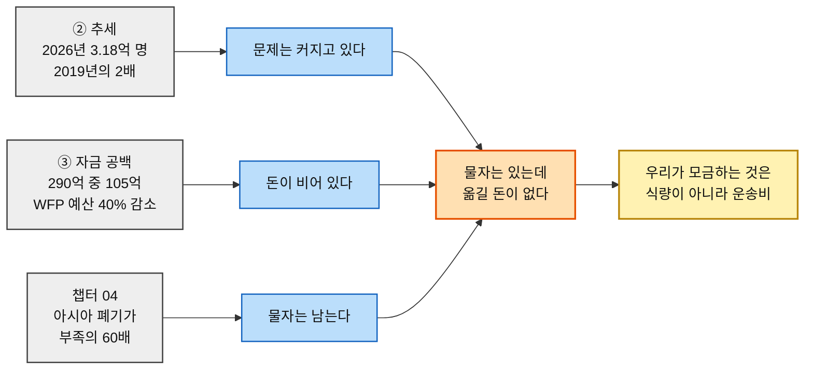
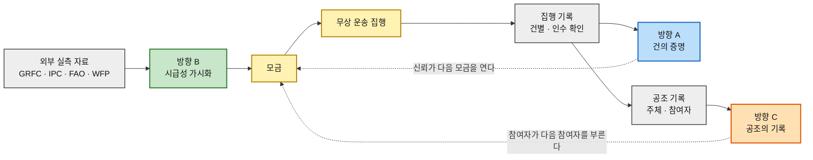

# 차별적 가치목표 제안 ③ — 구호재원 모금 기반 식량 무상 운송 서비스

> 입력 [경쟁사 가치선언 분석](./경쟁사-가치선언-03-식량-재분배-플랫폼.md) · [챕터 06 혼합 매트릭스](../06-opportunity-score/분석-03-식량-재분배-플랫폼-혼합매트릭스.md) · [챕터 07 모의 결과보고서](../07-jtbd/모의결과보고서-03-식량-재분배-플랫폼.md) · [여정지도 §16](../05-persona-journey/분석-03-식량-재분배-플랫폼-고객여정지도.md)

> 🎯 **이 문서는 경쟁사 분석 §4-4를 대체한다.** 세 방향 모두 **지금 선언 가능한 상태**로 정리했고, 각 방향마다 **근거 → 결론 추적표**를 붙여 어떤 자료가 어떤 문장을 떠받치는지 한 줄씩 대응시켰다.
>
> 🔎 **리서치 기준일 2026-08-13.** 방향 B의 근거는 전부 **외부 실측 자료**(GRFC·FAO·WFP·IPC)이며 링크를 병기했다.
>
> 📌 **세 가지 확정 사항** — ① 선언은 **공개 약속형**(조건을 선언 안에 넣어 지금 말해도 참이 되게 한다) ② 구조는 **통합 1 + 청중별 3** ③ 방향 B는 *"데이터 콘텐츠화"* 에서 **"식량 위기 지역의 시급성 가시화"** 로 재정의하고 근거를 **미디어 보도 스크랩 + 가용 통계 추출**로 세운다.

---

## 0. 제시된 세 가지를 어떻게 조정했는가

| 제시안 | 경쟁 지형 대조 | 조정 | 결과 |
|---|---|---|---|
| **① 투명한 지원 수량과 지원처** | ShareTheMeal이 *"우크라이나 550만 끼"* 로 **국가·총량 단위는 이미 제공** | 해상도를 **건(件)·인수 확인 주체**로 내린다 | **방향 A — 건의 증명** |
| **② 문제 지역 현황을 데이터로 콘텐츠화** | 원자료는 FAO·WFP·FTS 것이라 *"데이터 보유"* 는 차별점이 못 됨. 게다가 근거로 삼은 언론 페르소나는 **DOS 0** | 주제를 **"시급성 가시화"** 로 바꾸고, 근거를 내부 페르소나 점수가 아니라 **외부 보도·통계**로 교체 | **방향 B — 식량 위기 지역의 시급성 가시화** |
| **③ 누적 수혜 규모 어필** | ShareTheMeal 2억 끼·GFN 21억 끼와 **총량 경쟁은 진다** | 주어를 **"우리"에서 "우리들"로** 바꾸고, 근거를 모의 세션이 아니라 **7주체 합작이라는 구조적 사실**로 옮긴다 | **방향 C — 공조의 기록** |

> 📌 **세 조정이 같은 원리를 따른다.** 규모로 못 이기는 신생 조직은 **한 칸 더 내려가거나(A), 다른 자료로 서거나(B), 주어를 바꾸는(C)** 세 가지만 쓸 수 있다.
>
> 🔁 **②의 조정이 가장 크다.** 이전 판은 *"언론에게 데이터를 준다"* 였고 언론은 우리에게 돈을 내지 않으므로 DOS가 0이었다. **지금 판은 시급성 자체를 우리가 말한다.** 그러면 이 콘텐츠는 언론용 자료가 아니라 **모든 기부자 페르소나의 진입 근거**가 되고, DOS 0 문제가 발생하지 않는다.

---

## 1. 방향 A — 건(件)의 증명

### 선언문 *(공개 약속형)*

> **"우리는 총액을 말하지 않습니다. 수령 채널의 인수 확인이 붙지 않은 한 건은, 우리 실적으로 세지 않습니다."**

**공개 약속형인 이유.** 뒤 문장이 **조건이자 자기 구속**이다. 파트너를 아직 확보하지 못한 지금도 이 선언은 참이다 — *"인수 확인이 없으면 세지 않는다"* 는 약속은 실적이 0이어도 지켜지기 때문이다. 그리고 이 문장은 **파트너 협상장에서 우리 요구 조건을 설명하는 근거**로 그대로 쓰인다.

### 근거 → 결론 추적

| 근거 | 출처 · 등급 | 이 근거가 떠받치는 문장 |
|---|---|---|
| 여덟 경쟁사 중 **건 단위 집행 원장을 공개하는 곳이 없다** | [경쟁사 분석 §4-3](./경쟁사-가치선언-03-식량-재분배-플랫폼.md) · **(확인)** | *"우리는 총액을 말하지 않습니다"* — 총액은 이미 모두가 말한다 |
| GiveDirectly는 **조직 단위 84.8%**, ShareTheMeal은 **금액 환산 '끼'** 까지만 | [GiveDirectly 효율 지표](https://www.givedirectly.org/rethinking-efficiency/) · [WFP](https://www.wfp.org/stories/sharethemeal-wfp-app-reaches-200-million-meals-milestone) · **(확인)** | *"한 건"* 이라는 해상도가 빈 자리라는 판단 |
| **P13** 건별 집행 원장 — AOS 4.0(1위) · Sat 1. **모의 인터뷰와 경쟁 조사를 모두 통과한 유일한 항목** | [챕터 06](../06-opportunity-score/분석-03-식량-재분배-플랫폼.md) · [챕터 07 §3](../07-jtbd/모의결과보고서-03-식량-재분배-플랫폼.md) · **(가정)** | 이 방향을 1순위로 두는 근거 |
| **P15** 인수 확인의 입력 주체 — *"우리가 입력하면 자기증명"* | [챕터 06](../06-opportunity-score/분석-03-식량-재분배-플랫폼.md) · **(가정)** | *"수령 채널의 인수 확인"* — 확인 주체를 문장에 명시한 이유 |
| 요구 수준은 *"전면 공개"* 가 아니라 **"내려갈 수 있는 구조"** | [챕터 07 모의 1-3](../07-jtbd/모의결과보고서-03-식량-재분배-플랫폼.md) · **(가정)** | 구현 범위를 전수 공개가 아니라 **역추적 가능성**으로 잡는 근거 |

### 이 선언을 지키기 위한 최소 요건

1. **수령 채널이 인수 확인을 입력한다** — 확인 시각·담당. 우리가 대신 입력하면 선언이 무효다
2. **기부 건과 화물 건이 연결된다** — 배치로 묶더라도 역추적 경로가 끊기지 않는다
3. **임의의 한 건을 끝까지 따라갈 수 있다** — 전수 공개가 아니라 **표본 추적 가능성**

> 🖊️ **"서명"이 아니라 "인수 확인"이라고 쓴 이유.** 챕터 05~07은 이 요건을 **P15 제3자 서명 증명**이라는 이름으로 채점했고, 모의 응답자도 *"받는 쪽에서 서명이 들어가야"* 라고 말했다. 그 기록은 그대로 둔다. 다만 **선언문에서는 쓰지 않는다** — 배급 현장의 수령 채널이 실제로 남길 수 있는 것은 대개 **확인 시각·담당자·연락처**이지 법적 효력을 가진 서명이 아니고, 지킬 수 있는 것보다 큰 말을 조건절에 넣으면 **선언 자체가 반증 가능해진다.** 요구 수준은 낮추지 않되, 약속의 문구는 실제로 받아 낼 수 있는 것에 맞춘다.

### 청중

**극단적 투명성 요구 기부자 · 개인 소액 정기 후원자** — 챕터 06 DOS 인물 단위에서 SOM 기준 1·2위를 차지한 두 인물이다.

---

## 2. 방향 B — 식량 위기 지역의 시급성 가시화

### 선언문 *(공개 약속형)*

> **"어디가 얼마나 급한지 우리가 먼저 말합니다. 출처와 기준일이 붙지 않은 숫자는 한 줄도 싣지 않습니다."**

**공개 약속형인 이유.** 이 선언은 **운송 실적이 0이어도 오늘 지킬 수 있다.** 그리고 뒤 문장이 [챕터 07 모의](../07-jtbd/모의결과보고서-03-식량-재분배-플랫폼.md)에서 확인된 *"숫자가 나오면 오히려 더 의심된다"* 는 반응을 정면으로 막는다 — **숫자를 내놓기 전에 출처를 먼저 약속**하는 구조다.

### 근거 → 결론 추적 *(전부 외부 실측)*

#### ① 규모 — 얼마나 많은가

| 지표 | 값 | 출처 |
|---|---|---|
| 2025년 급성 식량위기(IPC/CH 3+) 인구 | **2억 6,600만 명** · 47개국 · 분석 인구의 **22.9%** | [GRFC 2026 (EC K4P)](https://knowledge4policy.ec.europa.eu/publication/global-report-food-crises-2026_en) |
| 2024년 | **2억 9,530만 명** · 53개국 · 22.6% — **GRFC 9년 역사상 최고** | [GNAFC — GRFC 2025](https://www.fightfoodcrises.net/articles/2025-global-report-food-crises-acute-food-insecurity-and-malnutrition-rise-sixth) |
| 2025년 IPC 5(재난) 인구 | **약 120만~140만 명** | [EC JRC 2026.04](https://joint-research-centre.ec.europa.eu/jrc-news-and-updates/food-crises-no-respite-14-m-people-suffer-most-severe-level-food-insecurity-2025-2026-04-24_en) · [EC JRC 2025.09](https://joint-research-centre.ec.europa.eu/jrc-news-and-updates/food-crises-12-million-people-suffer-catastrophic-conflict-driven-hunger-2025-2025-09-16_en) |

> 🖊️ **절대수가 줄어든 것을 개선으로 읽으면 안 된다.** 2억 9,530만 → 2억 6,600만은 **분석 대상국이 53개국에서 47개국으로 줄어든 결과**이며, **비율은 22.6% → 22.9%로 오히려 올랐다.** 이런 함정을 짚어 주는 것이 이 방향의 콘텐츠가 하는 일이다.

#### ② 추세 — 얼마나 악화되는가

| 지표 | 값 | 출처 |
|---|---|---|
| 2026년 IPC 3+ 전망 | **3억 1,800만 명** — **2019년의 두 배 이상** | [WFP Global Outlook](https://www.wfp.org/stories/wfp-global-outlook-things-have-never-been-so-bad-hunger-rises-amid-funding-cuts) |
| 악화 전망 핫스팟 (2025.11~2026.05) | **16개국·지역** | [FAO — Hunger Hotspots](https://www.fao.org/markets-and-trade/do-not-touch/all-widgets/hunger-hotspots---fao-wfp-early-warnings-on-acute-food-insecurity--november-2025-to-may-2026-outlook/en) |
| 최고 우려 — IPC 5 임박 | **6개국·지역** (아이티·말리·팔레스타인·남수단·수단·예멘) | [WFP 보도자료](https://www.wfp.org/news/new-fao-wfp-report-warns-shrinking-window-prevent-millions-more-people-facing-acute-food) |
| 16개 핫스팟 중 주 원인이 분쟁인 곳 | **14개** | [GNAFC](https://www.fightfoodcrises.net/articles/new-fao-wfp-report-warns-shrinking-window-prevent-millions-more-people-facing-acute-food) |

#### ③ 자금 공백 — 얼마나 비었는가 *(우리 사업의 존재 이유와 직결)*

| 지표 | 값 | 출처 |
|---|---|---|
| WFP 2025년 예산 | **64억 달러** — 2024년 100억 달러 대비 **40% 감소** | [WFP Global Outlook](https://www.wfp.org/stories/wfp-global-outlook-things-have-never-been-so-bad-hunger-rises-amid-funding-cuts) |
| 지원 축소 규모 | 2024년 7,990만 명 지원 → **최대 1,670만 명(21%) 감소** | [WFP](https://www.wfp.org/publications/food-security-impact-reduction-wfp-funding) |
| 2025년 10월 말 기준 조달률 | 필요 **290억 달러** 중 **105억 달러**만 확보 — **36%** | [WFP 보도자료](https://www.wfp.org/news/new-fao-wfp-report-warns-shrinking-window-prevent-millions-more-people-facing-acute-food) |
| 파이프라인 붕괴 위험 운영 | **6개국** (아프가니스탄·DRC·아이티·소말리아·남수단·수단) | [WFP](https://www.wfp.org/news/wfp-warns-six-critical-operations-are-facing-significant-food-aid-pipeline-breaks-year-end) |
| DRC 사례 | IPC 4 인구 230만 명 계획 → 실제 **100만 명** → 10월부터 **60만 명** → 2026년 2월 완전 붕괴 우려 | [WFP](https://www.wfp.org/stories/funding-cuts-six-critical-wfp-operations-risk) |
| 아이티 사례 | 긴급 단계 인구 **월 배급 절반 삭감** · 6개월간 **4,400만 달러** 부족 | [WFP](https://www.wfp.org/stories/funding-cuts-six-critical-wfp-operations-risk) |
| 2026년 WFP 소요 | **130억 달러**로 1억 1,000만 명 도달 — **식량불안 인구의 3분의 1** | [WFP Global Outlook](https://www.wfp.org/stories/wfp-global-outlook-things-have-never-been-so-bad-hunger-rises-amid-funding-cuts) |

#### ④ 아시아 — 챕터 04가 SAM으로 잡은 지역

| 지표 | 값 | 출처 |
|---|---|---|
| 아프가니스탄 (2025.03~04) | **1,260만 명** — 인구 4,600만의 **27%** | [IPC 국가 분석](https://www.ipcinfo.org/ipc-country-analysis/details-map/en/c/1159622/) |
| 아프가니스탄 (2025 겨울) | **1,700만 명 이상** | [WFP](https://www.wfp.org/news/latest-food-security-report-confirms-fears-deepening-hunger-crisis-afghanistan-winter-sets) |
| 전 세계 급성 기아의 3분의 2를 차지하는 10개국 | 그중 **4개가 아시아** — 아프가니스탄·방글라데시·미얀마·파키스탄 | [WFP·UNICEF 공동 보도](https://www.wfp.org/news/acute-food-insecurity-and-malnutrition-remain-alarmingly-high-crises-deepen-un-eu-and-partners) |

### 이 근거가 결론에 직결되는 방식

> 🎯 **이것이 이 방향의 핵심이다. 시급성 콘텐츠와 모금 논거가 같은 문장을 쓴다.**
>
> 우리 사업 모델은 *"모금액을 식량이 아니라 운송비에 쓴다"* 인데, 그 정당성이 바로 위 세 근거의 교차점에서 나온다. **콘텐츠를 만드는 일과 모금하는 일이 분리되지 않으므로**, 이전 판이 걱정했던 *"미디어가 되고 사업을 잃는다"* 는 함정이 구조적으로 줄어든다.
>
> 📌 **DOS 0 문제도 해소된다.** 이전 판의 B는 언론·연구자(MR 0)를 고객으로 삼았지만, 지금 판의 B는 **모든 기부자 페르소나의 진입 근거**다. 챕터 05를 보면 개인 소액 정기 후원자의 첫 접점이 *"버려지는 식량이 부족량의 60배"* 라는 대조 수치이고, 일회성 충동 기부자는 기근 보도로 유입되며, 공여기관 오피서는 *"어디가 비었는지"* 를 확인한다 — **세 인물 모두 시급성 정보로 진입한다.**

### 이 선언을 지키기 위한 최소 요건

1. **모든 지표에 출처·기준일·산출식을 병기한다** — 선언의 후반부가 곧 요건이다
2. **갱신 주기를 숫자로 약속한다** — *"매월 O일"*. 약속 없는 최신성은 최신성이 아니다
3. **원본을 내려받게 한다** — CSV·API. 이미지만 있으면 인용되지 않는다
4. **해석의 함정을 함께 짚는다** — 위 🖊️ 처럼 *"절대수가 줄었지만 비율은 올랐다"* 를 설명하는 것이 우리 편집의 값이다

### 청중

**언론·연구자·정책 담당 · 공여기관·재단 프로그램 오피서** — 그리고 이 콘텐츠는 **개인 기부자 3종의 진입 관문**으로도 동시에 작동한다.

---

## 3. 방향 C — 공조의 기록

### 선언문 *(공개 약속형)*

> **"이 1톤은 우리가 옮긴 것이 아닙니다. 함께한 이름을 전부 밝히지 못하는 건은, 성과로 발표하지 않습니다."**

**공개 약속형인 이유.** 자기 실적으로 발표하지 않겠다는 **자기 구속**이 선언의 절반이다. 파트너가 없으면 발표할 것도 없으므로 지금도 참이며, **파트너에게는 "당신 이름이 남는다"는 제안**이 된다.

### 근거 → 결론 추적

> 🔁 **이전 판에서 근거 축을 옮겼다.** 원래 '기억·재접촉'([챕터 07 모의 세션 1건](../07-jtbd/모의결과보고서-03-식량-재분배-플랫폼.md), 생성된 응답)에 기대고 있었으나, **7주체 합작이라는 구조적 사실**로 축을 바꿨다. 근거 등급이 (가정)에서 (확인)으로 올라간다.

| 근거 | 출처 · 등급 | 이 근거가 떠받치는 문장 |
|---|---|---|
| 이 사업은 **사전 설득 대상 7종**의 합작으로만 성립한다 — 잉여 보유처·제조사·법무·물류사·통관·수령 채널·산지 | [챕터 05 §4](../05-persona-journey/분석-03-식량-재분배-플랫폼-페르소나-스펙트럼.md) · **(확인)** | *"우리가 옮긴 것이 아닙니다"* — 수사가 아니라 **사실 진술**이다 |
| 여덟 경쟁사가 **전부 자기 실적을 주어로 삼는다** | [경쟁사 분석 §3](./경쟁사-가치선언-03-식량-재분배-플랫폼.md) · **(확인)** | 이 자리가 비어 있다는 판단 |
| **P30** 집단 단위 결과물 — SOM 기준 DOS **1.05(3위)** | [챕터 06 DOS](../06-opportunity-score/분석-03-식량-재분배-플랫폼-DOS.md) · **(가정)** | 집단 단위 기록에 **실제 수요가 있다**는 근거 |
| 증명의 원천을 **우리가 소유하지 않는다** — 최대 취약점 | [챕터 05 §5-3](../05-persona-journey/분석-03-식량-재분배-플랫폼-페르소나-스펙트럼.md) · **(확인)** | 약점을 숨기지 않고 **전면에 내세우는** 전략의 근거 |
| **O04** 이름 인지 상태 — DOS 0.72 · *"5년을 냈는데 아는 게 하나도 없어요"* | [챕터 07 모의](../07-jtbd/모의결과보고서-03-식량-재분배-플랫폼.md) · **(가정 · 모의)** | **보조 근거.** 기록에 이름이 남으면 잊히지 않는다는 부가 효과 |

> 📌 **첫 줄과 넷째 줄이 이 방향의 뼈대다.** 둘 다 (확인) 등급이고, **같은 사실의 앞뒷면**이다 — *"혼자 할 수 있는 게 없다"* 는 취약점이 *"합작을 선언할 자격"* 이 된다. 모의 세션에 기대던 이전 판보다 훨씬 단단하다.

### 이 선언을 지키기 위한 최소 요건

1. **한 건에 관여한 주체를 전부 표시한다** — 익명 처리하더라도 **개수와 역할**은 밝힌다
2. **기부자를 그 목록에 넣는다** — 참여자가 자기 이름을 찾을 수 있어야 한다
3. **집단 단위로 묶을 수 있다** — 캠페인·기업·학급 단위 공동 기록 *(P30)*
4. **누적을 우리 성과로 표기하지 않는다** — 주어는 항상 *"우리들"* 이지 *"우리"* 가 아니다

### 청중

**제3자 모금 캠페인 주최자 · 기업 사회공헌·ESG 담당** — 둘 다 *"우리 집단이 함께 했다"* 를 사내·집단에 보여줘야 하는 인물이다.

---

## 4. 세 방향의 관계

### 하나의 배관, 세 개의 출구

**B가 모금을 열고, 모금이 집행을 만들고, 집행 기록이 A와 C를 만들고, A와 C가 다시 모금으로 돌아온다.** 세 방향이 하나의 순환이므로 **어느 하나를 빼면 고리가 끊긴다.**

### 지금 각 방향이 서 있는 자리

| 방향 | 지금 선언 가능한가 | 지금 실행 가능한가 | 근거 등급 |
|---|:---:|:---:|---|
| **B** 시급성 가시화 | ✅ | ✅ **오늘 시작 가능** | **(확인)** — 외부 실측 |
| **A** 건의 증명 | ✅ *(공개 약속형)* | ⏳ 첫 운송 필요 | (확인) + (가정) |
| **C** 공조의 기록 | ✅ *(공개 약속형)* | ⏳ 파트너 확보 필요 | **(확인)** — 구조적 사실 |

> 📌 **셋 다 지금 선언할 수 있다.** 공개 약속형이 *"~하지 않겠다"* 는 자기 구속 형태이기 때문이다. 실적이 0이어도 *"인수 확인 없이는 세지 않겠다"* 는 약속은 지켜지고 있다.

### 세 방향이 각각 뒤집는 약점

| 방향 | 우리 약점 | 뒤집힌 결과 |
|---|---|---|
| **A** | 증명 데이터를 파트너가 쥐고 있다 | **자기증명이 아니므로 오히려 신뢰가 높다** |
| **B** | 우리는 데이터 원천이 아니다 | **편집과 해석이 값이다** — 함정을 짚어 주는 것이 우리 일 |
| **C** | 혼자 할 수 있는 게 없다 | **합작 자체가 아무도 안 하는 차별점이다** |

> 📌 **세 약점이 전부 "우리 것이 아니다"라는 하나의 사실에서 나온다.** 세 선언은 그 사실을 숨기지 않고 전면에 내세운다. **숨기면 취약점이고 드러내면 포지션이다.**

---

## 5. 선언문 — 통합 1 + 청중별 3

### 통합 선언문

> # **"비어 있는 곳을 먼저 말하고, 채운 한 건을 수령 채널의 인수 확인으로 증명하며, 그 한 건에 함께한 이름을 모두 남깁니다.**
> # **셋 중 하나라도 못 하면, 그 건은 우리 실적이 아닙니다."**

**해설.** 앞 문장의 세 절이 각각 B·A·C이고 순서가 곧 사업의 순환 순서다. **뒷문장이 세 선언을 하나의 공개 약속으로 묶는다** — 실적을 늘리는 것보다 **세지 않는 기준을 지키는 것**을 앞에 놓았다는 선언이며, 이것이 경쟁 지형에서 우리가 설 수 있는 유일한 자리다. 여덟 경쟁사 중 **"세지 않겠다"고 말한 곳은 없다.**

### 청중별 메시지

| 청중 | 방향 | 메시지 | 왜 이 청중에게 이 말인가 |
|---|:---:|---|---|
| **극단적 투명성 요구 기부자** **개인 소액 정기 후원자** | **A** | *"총액이 아니라 한 건입니다. 수령 채널의 인수 확인이 없으면 우리도 세지 않습니다."* | 이 둘의 공통 문제가 **자기증명에 대한 불신**이다. 검증 주체를 우리 밖에 두었다는 것이 핵심 메시지 |
| **언론·연구자·정책 담당** **공여기관·재단 프로그램 오피서** | **B** | *"어디가 얼마나 급한지, 출처와 기준일과 함께 매월 갱신합니다."* | 둘 다 **인용 가능성**이 조건이다. 갱신 주기와 출처가 곧 사용 가능 여부를 가른다 |
| **제3자 모금 캠페인 주최자** **기업 사회공헌·ESG 담당** | **C** | *"당신들의 이름으로 남습니다. 우리 실적으로 발표하지 않습니다."* | 둘 다 **집단·조직 단위로 보여줘야** 하는 사람이다. 성과의 주어가 자기 쪽이어야 값이 있다 |

> 📌 **세 메시지가 하나의 브랜드로 읽히는 이유는 전부 "우리가 덜 가져간다"는 형태이기 때문이다.** A는 세는 권한을, B는 해석의 독점을, C는 성과의 소유권을 각각 내려놓는다. **경쟁사들이 자기 실적을 키워 신뢰를 만드는 동안, 우리는 자기 몫을 줄여 신뢰를 만든다.**

---

## 6. 위험과 근거 등급

### 남은 단 하나의 전제

**A와 C는 파트너 확보에 종속된다.** B는 종속되지 않는다.

| 방향 | 종속 대상 | 미확보 시 |
|---|---|---|
| **B** | 없음 — 외부 공개 자료로 성립 | **영향 없음** |
| **A** | 수령 채널의 **인수 확인 입력** | 선언은 유지되나 **실적이 0으로 남는다** |
| **C** | **다섯 주체의 실재** | 선언은 유지되나 **발표할 건이 없다** |

> 📌 **공개 약속형을 택한 결과, 파트너 미확보가 선언을 거짓으로 만들지는 않는다.** 다만 **실적이 영원히 0이면 선언은 공허해진다.** 확보 여부는 여전히 사업의 생사를 가르며, [챕터 05 §10](../05-persona-journey/분석-03-식량-재분배-플랫폼-페르소나-스펙트럼.md)과 [챕터 06 §7-1](../06-opportunity-score/분석-03-식량-재분배-플랫폼.md)이 반복해 지목한 1순위 검증 과제다.
>
> **선언 대외 공개 전에 할 일** — 수령 채널 후보 2~3곳에 *"기부 건 단위로 인수 확인을 입력해 줄 수 있는가"* 를 직접 묻는다. **답이 '아니오'라도 선언은 유지하되, A·C의 실행 일정을 다시 잡는다.**

### 근거 등급

| 구성 요소 | 등급 | 비고 |
|---|---|---|
| **방향 B의 규모·추세·자금 공백·아시아 통계 전체** | **(확인)** | GRFC·IPC·FAO·WFP·EC JRC 공식 발표. 링크·기준일 병기 |
| 경쟁사 선언·활동 대조 | **(확인)** | [경쟁사 분석](./경쟁사-가치선언-03-식량-재분배-플랫폼.md)의 검증 링크 승계 |
| **방향 C의 7주체 합작 구조** | **(확인)** | 챕터 05 §4 — 사업 모델의 구조적 사실 |
| 근거로 인용한 AOS·DOS 값 | **(가정)** | 인터뷰 없는 추정값 |
| 챕터 07에서 인용한 참가자 발언 | **(가정 · 모의)** | **생성된 응답. 실존 인물의 말이 아니다** |
| **선언문 3종 · 통합 선언문** | **(추정)** | 위 근거들의 해석 |

> ⚠️ **방향 B만 근거가 외부 실측이고 A·C는 내부 산출물에 기댄다.** 다만 A의 뼈대(P13이 두 조사를 모두 통과)와 C의 뼈대(7주체 합작)는 각각 (확인) 등급 근거를 하나씩 갖고 있어, **셋 다 최소 하나의 확인된 근거 위에 서 있다.**
>
> ⚠️ **B의 통계는 갱신 주기가 짧다.** GRFC는 연 1회, Hunger Hotspots는 반년마다, WFP 자금 현황은 수시로 바뀐다. **이 문서의 수치는 2026-08-13 기준이며, 콘텐츠로 발행할 때는 반드시 재확인해야 한다.** 선언문 후반부(*"출처와 기준일"*)를 우리가 먼저 어기면 안 된다.

---

## Sources

- [EC Knowledge4Policy — Global Report on Food Crises 2026](https://knowledge4policy.ec.europa.eu/publication/global-report-food-crises-2026_en)
- [GNAFC — 2025 Global Report on Food Crises](https://www.fightfoodcrises.net/articles/2025-global-report-food-crises-acute-food-insecurity-and-malnutrition-rise-sixth)
- [EC JRC — 1.4m people at most severe level in 2025](https://joint-research-centre.ec.europa.eu/jrc-news-and-updates/food-crises-no-respite-14-m-people-suffer-most-severe-level-food-insecurity-2025-2026-04-24_en)
- [EC JRC — 1.2m in catastrophic hunger 2025](https://joint-research-centre.ec.europa.eu/jrc-news-and-updates/food-crises-12-million-people-suffer-catastrophic-conflict-driven-hunger-2025-2025-09-16_en)
- [WFP Global Outlook — hunger rises amid funding cuts](https://www.wfp.org/stories/wfp-global-outlook-things-have-never-been-so-bad-hunger-rises-amid-funding-cuts)
- [WFP — Six critical operations facing pipeline breaks](https://www.wfp.org/news/wfp-warns-six-critical-operations-are-facing-significant-food-aid-pipeline-breaks-year-end)
- [WFP — Funding cuts: six critical operations at risk](https://www.wfp.org/stories/funding-cuts-six-critical-wfp-operations-risk)
- [WFP — Food Security Impact of Reduction in WFP Funding](https://www.wfp.org/publications/food-security-impact-reduction-wfp-funding)
- [FAO — Hunger Hotspots Nov 2025 to May 2026 outlook](https://www.fao.org/markets-and-trade/do-not-touch/all-widgets/hunger-hotspots---fao-wfp-early-warnings-on-acute-food-insecurity--november-2025-to-may-2026-outlook/en)
- [WFP — 16 hotspots, shrinking window](https://www.wfp.org/news/new-fao-wfp-report-warns-shrinking-window-prevent-millions-more-people-facing-acute-food)
- [GNAFC — 16 hotspots 보도자료](https://www.fightfoodcrises.net/articles/new-fao-wfp-report-warns-shrinking-window-prevent-millions-more-people-facing-acute-food)
- [IPC — Afghanistan Acute Food Insecurity Mar–Apr 2025](https://www.ipcinfo.org/ipc-country-analysis/details-map/en/c/1159622/)
- [WFP — Afghanistan winter hunger crisis](https://www.wfp.org/news/latest-food-security-report-confirms-fears-deepening-hunger-crisis-afghanistan-winter-sets)
- [WFP·UNICEF — Acute food insecurity remains alarmingly high](https://www.wfp.org/news/acute-food-insecurity-and-malnutrition-remain-alarmingly-high-crises-deepen-un-eu-and-partners)
- [GiveDirectly — Rethinking efficiency](https://www.givedirectly.org/rethinking-efficiency/)
- [WFP — ShareTheMeal 200 million meals](https://www.wfp.org/stories/sharethemeal-wfp-app-reaches-200-million-meals-milestone)
