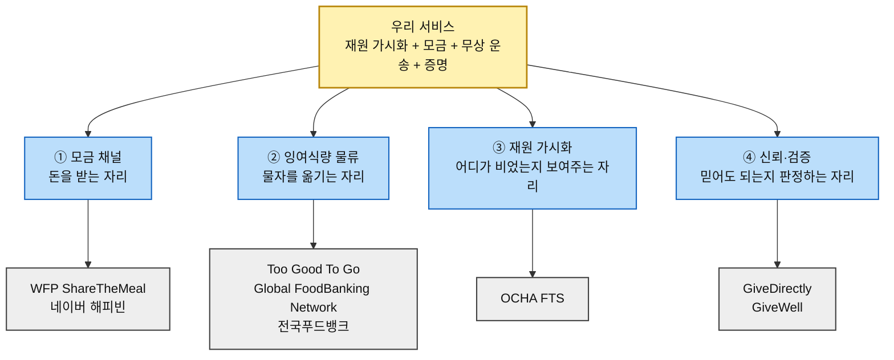
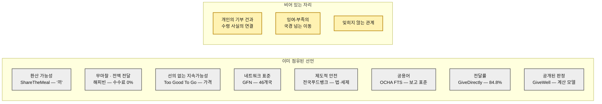

# 경쟁 지형과 가치 선언 분석 ③ — 구호재원 모금 기반 식량 무상 운송 서비스

> 입력 [챕터 04 TAM-SAM-SOM](../04-tam-sam-som/분석-03-식량-재분배-플랫폼.md) · [챕터 05 페르소나 스펙트럼](../05-persona-journey/분석-03-식량-재분배-플랫폼-페르소나-스펙트럼.md) · [고객 여정지도](../05-persona-journey/분석-03-식량-재분배-플랫폼-고객여정지도.md) · [챕터 06 AOS](../06-opportunity-score/분석-03-식량-재분배-플랫폼.md) · [DOS](../06-opportunity-score/분석-03-식량-재분배-플랫폼-DOS.md) · [혼합 매트릭스](../06-opportunity-score/분석-03-식량-재분배-플랫폼-혼합매트릭스.md) · [챕터 07 모의 결과보고서](../07-jtbd/모의결과보고서-03-식량-재분배-플랫폼.md)

> 🔎 **리서치 기준일 2026-08-13.** 아래 수치와 링크는 모두 각 기관의 공식 발표·공시·언론 보도에서 확인한 것이다.
>
> ⚠️ **이 문서는 이 프로젝트에서 근거 등급이 다르다.** 챕터 05·06·07의 산출물은 전량 **(가정)** 이었으나, 이 문서의 규모·모델 서술은 대부분 **(확인)** 이다. 다만 **가치 선언문(§3)은 활동에서 역산한 해석**이므로 **(추정)** 이며, 각 기관의 공식 슬로건이 아니다.
>
> 📌 **이 문서가 답하는 미결 과제.** [AOS 분석 §7-1](../06-opportunity-score/분석-03-식량-재분배-플랫폼.md)이 1순위로 지목한 *"대체재 재조사 — Satisfaction 1점 5개에 상위 순위 전체가 걸려 있다"* 에 대한 응답이다. 판정 결과는 §4-3에 있다.

---

## 0. 경쟁의 정의 — 우리는 무엇과 경쟁하는가

챕터 05의 `대체 솔루션` 열과 챕터 06의 Satisfaction 판정 근거를 세로로 읽으면, 이 사업은 **하나의 시장이 아니라 네 개의 서로 다른 시장에 동시에 발을 걸치고 있다.**

| 경쟁 축 | 우리가 하겠다는 것 | 이미 그 자리를 점유한 서비스 |
|---|---|---|
| **① 모금 채널** | 신규 구호자금 모금 페이지 | WFP ShareTheMeal · 네이버 해피빈 |
| **② 잉여식량 물류** | 잉여 지역 → 부족 지역 무상 운송 | Too Good To Go · Global FoodBanking Network · 전국푸드뱅크 |
| **③ 재원 가시화** | 전 세계 구호 재원 가용 현황 확인 | OCHA Financial Tracking Service |
| **④ 신뢰·검증** | *"당신의 돈이 몇 톤을 옮겼는가"* 라는 증명 | GiveDirectly · GiveWell |

> 🚨 **여기서 이미 전략적 문제가 하나 드러난다.** 챕터 06은 이 사업의 핵심 자산을 *"증명 체계"* 로 판정했는데, **증명은 네 축 중 가장 경쟁이 치열한 자리**다. GiveDirectly는 전달률을 소수점까지 공개하고, GiveWell은 판정 모델 자체를 공개한다. **"투명하다"는 선언만으로는 이 두 곳을 넘지 못한다.**

---

## 1. 경쟁사 브리핑

> 규모 수치는 각 기관의 **최신 공식 발표 기준**이며 기준 시점을 함께 적었다. 기관마다 회계연도와 집계 정의가 달라 **횡적 비교는 자릿수 수준에서만** 유효하다.

| # | 서비스 | 경쟁 축 | 비즈니스 규모 | 핵심 비즈니스 모델 | 사업 전략의 특징 | 출처 |
|:---:|---|---|---|---|---|---|
| **1** | **WFP ShareTheMeal** *(UN 세계식량계획)* | ① 모금 | **누적 2억 끼**(2023.11) · 2015년 출시 · **14개 언어 · 52개 통화 · 200개국 이상** · 모금 목표 105건 완료 · 2022년 한 해 약 **2,800만 달러** 모금 | **한 끼 = 0.80달러**로 최소 결제 단위를 고정한 소액 기부 앱. 국가·위기별 모금 목표를 사용자가 선택 | **금액을 끼니로 환산해 제품화**했다. UN 기관의 신뢰를 그대로 상속받아 검증 비용을 0으로 만든 구조 | [WFP 200M 마일스톤](https://www.wfp.org/stories/sharethemeal-wfp-app-reaches-200-million-meals-milestone) · [WFP Innovation 프로젝트](https://innovation.wfp.org/project/sharethemeal) · [150M 마일스톤](https://www.wfp.org/stories/sharethemeal-wfp-app-marks-150-million-meals-milestone) |
| **2** | **네이버 해피빈** | ① 모금 | **20년 누적 후원액 3,000억 원 초과** · 참여자 **1,200만 명** · 개설 모금함 **15만 개** · 누적 콩 모금 **436억 원** · 재해재난 6년 누적 **418억 원**(2025.07 기준) | **수수료 0%**. UGC 활동 보상으로 지급되는 '콩'(개당 100원)과 현금 기부를 병행. 단체가 직접 모금함 개설 | **기부를 결제가 아니라 활동의 부산물로 바꿨다.** 100% 전달 원칙을 브랜드의 축으로 삼음 | [전자신문 2025.07.10](https://www.etnews.com/20250710000128) · [디지털투데이](https://www.digitaltoday.co.kr/news/articleView.html?idxno=576045) · [해피빈 공식](https://happybean.naver.com/) |
| **3** | **Too Good To Go** | ② 잉여식량 | 2016년 코펜하겐 설립 · 등록 사용자 **1억 2,000만 명 이상** · 활성 매장 **18만 개** · **21개국** · 2024년 Surprise Bag **1억 1,560만 개**(전년 대비 +13%) | **영리 B Corp 마켓플레이스.** 백당 약 **€1.09 수수료** + 매장 연간 구독료 + B2B 폐기 분석 | **폐기를 기부가 아니라 할인 상품으로 재정의**했다. 선의가 아니라 가격으로 움직이므로 확장 속도가 비영리와 다르다 | [2024·2025 임팩트 리포트](https://www.toogoodtogo.com/en-us/impact-report) · [임팩트 산정 방식](https://www.toogoodtogo.com/en-gb/about-us/our-impact-calculation) · [B Corp 인증](https://www.bcorporation.net/en-us/find-a-b-corp/company/too-good-to-go-ap-s/) |
| **4** | **The Global FoodBanking Network** | ② 잉여식량 | **46개국** · 2024년 **3,800만 명**에게 제공 · 배분량 **7억 6,200만 kg**(전년 +17%) ≈ **21억 끼** · 산지 회수 **1억 4,700만 kg**(5년 전의 2배) · 매립 회피 **5억 1,200만 kg** | **비영리 네트워크.** 직접 배분하지 않고 회원 푸드뱅크의 역량·기술·표준을 지원 | **직접 운영이 아니라 표준화로 확장한다.** 농장·팩하우스·시장까지 회수 지점을 밀어 올려 공급망 상류를 장악 | [FY2024 연차보고서](https://www.foodbanking.org/2024annualreport/) · [2024 네트워크 활동 보고](https://www.foodbanking.org/our-impact/network-activity-report-2024/) · [보도자료](https://www.foodbanking.org/news/new-data-shows-food-banks-are-resilient/) |
| **5** | **전국푸드뱅크** *(한국사회복지협의회)* | ② 잉여식량 | 1998년 IMF 이후 시작 · **17개 광역푸드뱅크 + 450여 개 기초푸드뱅크·푸드마켓** · 보건복지부 산하 한국사회복지협의회 운영 | **공공 위탁 사업.** 기업·개인의 기부식품을 저소득층에 무상 제공. 기부자에게 세제 혜택 | **전국 물류망과 제도가 이미 깔려 있다.** 신규 진입자가 국내에서 '잉여식량 재분배'를 말할 때 반드시 비교당하는 기준선 | [전국푸드뱅크 공식](https://www.foodbank1377.org/introduce/foodbank.do) · [복지넷 사업 소개](https://www.bokji.net/ssn/bin/08.bokji) · [공공데이터포털 데이터셋](https://www.data.go.kr/data/15083266/fileData.do) |
| **6** | **OCHA Financial Tracking Service** | ③ 재원 가시화 | 전 세계 인도적 자금 데이터의 **공식 기준점** · 국가별 요구액·충족률·공여자 분포를 준실시간 공개 · HDX에 **227개 데이터셋** 배포 | **무료 공공재.** 파트너(정부·UN 기구·NGO·CERF·민간)가 **표준 양식으로 자발 보고** | **데이터를 팔지 않고 참조점이 되는 전략.** 보고 표준을 쥐고 있으므로, 이 데이터를 쓰는 모든 서비스가 FTS의 정의를 상속받는다 | [FTS 홈](https://fts.unocha.org/) · [FTS 개요 보고서](https://www.unocha.org/publications/report/world/financial-tracking-service-fts-tracking-humanitarian-funding-overview-0) · [HDX 데이터셋](https://data.humdata.org/organization/ocha-fts) |
| **7** | **GiveDirectly** | ④ 신뢰·검증 | 2024년 **1억 2,600만 달러**를 **11개국 217,219명**에게 전달 · FY2024 수입 **2억 680만 달러** · 2009년 이래 **15개국 150만 명 이상** | **무조건적 현금 이전.** 빈곤 구제 프로그램 기준 기부금의 **84.8%가 수혜자에게 직접** 전달, 오버헤드 약 12% | **중간 단계를 없앤 것 자체가 상품이다.** 전달률을 상시 공개 지표로 운영하고 RCT로 효과를 증명 | [재무 공개](https://www.givedirectly.org/financials) · [효율 지표 산정 방식](https://www.givedirectly.org/rethinking-efficiency/) · [GiveWell 2024 재평가](https://www.givedirectly.org/givewell-2024) |
| **8** | **GiveWell** | ④ 신뢰·검증 | 2024년 **3억 9,700만 달러**를 단체에 배분(76%가 4개 Top Charity) · Top Charities Fund **6,400만 달러** · 생명 1명당 추정 비용 **3,500~5,500달러** | **비영리 평가기관.** 돈을 직접 쓰지 않고 **"어디에 내야 하는가"를 판정**하고 그 판정에 자금을 붙인다 | **판정 근거와 계산 모델, 심지어 오류까지 공개한다.** 신뢰를 주장이 아니라 검증 가능한 산출물로 만든 사례 | [2024 지표·임팩트](https://blog.givewell.org/2025/08/13/givewells-2024-metrics-and-impact/) · [비용효과 기준](https://www.givewell.org/how-we-work/our-criteria/cost-effectiveness) · [Top Charities](https://www.givewell.org/charities/top-charities) |

> 🖊️ **집계 정의 주의 세 가지**
> ① **ShareTheMeal의 '끼'와 GFN의 '끼'는 다른 단위다.** 전자는 0.80달러를 1끼로 환산한 금액 기준, 후자는 배분 중량(kg)을 끼로 환산한 물량 기준이다.
> ② **Too Good To Go의 'Surprise Bag'은 끼가 아니다.** 백 하나에 담기는 양이 매장마다 다르며, 회사가 별도의 환산식을 공개하고 있다.
> ③ **해피빈의 3,000억 원은 20년 누적**이고 GiveDirectly의 1억 2,600만 달러는 **1년치**다. 나란히 놓고 크기를 비교하면 안 된다.

---

## 2. 기업별 핵심 가치와 주요 사업활동

### 2-1. WFP ShareTheMeal — "한 끼"라는 단위를 발명했다

**핵심 가치: 환산 가능성(convertibility).**

이 앱의 결정적 설계는 기능이 아니라 **단위**다. 0.80달러라는 금액을 *"한 끼"* 로 고정함으로써, 기부자가 *"얼마를 낼까"* 를 고민하는 대신 *"몇 끼를 낼까"* 를 고민하게 만들었다. 챕터 05가 개인 소액 정기 후원자의 목표로 잡은 *"내 후원금이 몇 kg을 어디로 옮겼는지 숫자로 확인"* 은 **ShareTheMeal이 10년 전에 이미 푼 문제**다.

- **국가·위기별 모금 목표 선택** — 우크라이나 550만 끼, 팔레스타인 756만 끼처럼 목적지를 지정해 기부한다. 자금의 목적지가 보인다는 점에서 우리가 말하는 *"어디로 갔는가"* 의 일부를 이미 제공한다.
- **UN 기관 신뢰 상속** — WFP 공식 앱이라는 지위가 검증 비용을 0으로 만든다. 신생 조직이 감사보고서로 쌓아야 할 신뢰를 로고 하나로 대체한다.
- **글로벌 결제 대응** — 52개 통화 지원. 챕터 06의 P11(해외 거주 기부 시도자의 결제 실패)이 이곳에서는 발생하지 않는다.

### 2-2. 네이버 해피빈 — 기부를 결제에서 떼어냈다

**핵심 가치: 무마찰(frictionlessness)과 전액 전달.**

해피빈의 '콩'은 카페 글쓰기나 지식iN 답변 채택 같은 **플랫폼 활동의 보상**으로 지급되며 개당 100원의 가치를 갖는다. 즉 **지갑을 열지 않고도 기부가 성립한다.** 누적 콩 모금액만 436억 원이다.

- **수수료 0% 원칙** — 결제 수수료를 받지 않고 기부금 100%를 단체에 전달한다고 공개한다. 챕터 06이 P13(건별 집행 원장)으로 풀려던 신뢰 문제를 **수수료 구조 한 줄로** 해결한 접근이다.
- **모금함 15만 개 · 참여자 1,200만 명** — 챕터 05의 제3자 모금 캠페인 주최자 「우리 반이 한 트럭」이 실제로 쓰고 있는 도구가 이것이다. 개설 인프라가 이미 대중화되어 있다.
- **재해재난 대응 채널** — 6년간 418억 원. 챕터 05의 일회성 충동 기부자가 뉴스를 보고 도달하는 곳이 우리 페이지가 아니라 여기다.

### 2-3. Too Good To Go — 선의를 가격으로 대체했다

**핵심 가치: 상업적 지속가능성.**

이 회사의 전략적 선택은 **기부 모델을 쓰지 않은 것**이다. 소비자는 원가의 50~75% 가격에 Surprise Bag을 구매하고, 회사는 백당 약 €1.09의 수수료와 매장 구독료를 받는다. **아무도 선의를 요구받지 않으므로 확장 속도가 비영리와 다르다** — 21개국 18만 매장, 사용자 1억 2,000만 명.

- **B Corp 인증** — 2021년 81.6점으로 최초 인증, 2024년 초 93.4점으로 재인증. 영리 법인이면서 사회적 목적을 **외부 기준으로 증명**하는 경로를 택했다.
- **임팩트 산정 방식 공개** — 회사가 별도 페이지에서 환산식을 공개한다. 챕터 07 모의 결과가 지목한 *"환산 계수의 산출 근거"* 요구에 대한 업계의 답이 이미 존재한다.
- **B2B 폐기 분석** — 매장에 폐기 데이터를 되팔아 부가 수익을 만든다. 우리가 '증명 데이터'로 부르는 것을 이 회사는 **판매 가능한 상품**으로 다룬다.

### 2-4. The Global FoodBanking Network — 운영하지 않고 표준을 깐다

**핵심 가치: 네트워크 레버리지.**

GFN은 스스로 식량을 옮기지 않는다. 46개국 회원 푸드뱅크에 **역량·기술·표준**을 공급하고, 그 결과 2024년 배분량이 7억 6,200만 kg(전년 대비 +17%)에 이르렀다.

- **회수 지점을 상류로 밀어올림** — 산지 농산물 회수가 1억 4,700만 kg으로 5년 전의 두 배다. 챕터 04가 *"물량 잠재력은 Q3(유통 중 손실)가 가장 크지만 회수 난도 때문에 1년차 표적이 아니다"* 라고 미뤄 둔 영역을 **이미 공략 중**이다.
- **환경 지표 병기** — 매립 회피 5억 1,200만 kg = CO2e 190만 톤을 함께 발표한다. 식량 재분배를 **기아 대응이자 기후 대응**으로 이중 포지셔닝했다.
- **실적을 국가 단위로 공개** — 신생 조직이 심의에서 요구받는 *"유사 사업 수행 경험"*(챕터 07 모의 세션에서 확인된 요건)을 46개국 단위로 축적해 두었다.

### 2-5. 전국푸드뱅크 — 제도가 이미 깔려 있다

**핵심 가치: 공적 인프라.**

1998년 IMF 위기 대응으로 출발해 **17개 광역 + 450여 기초** 거점을 갖췄고, 보건복지부 산하 한국사회복지협의회가 운영한다. 국내에서 '잉여식량 재분배'를 말하는 모든 신규 사업자는 **이 체계와 비교당한다.**

- **기부식품등 제공사업의 법적 지위** — 기부 기업에 세제 혜택이 따라붙는다. 챕터 05 §4가 설득 대상으로 잡은 *"대형 유통 물류센터 재고 처분 담당"* 에게는 **이미 검증된 처리 경로**가 존재한다는 뜻이다.
- **공공데이터 개방** — 전국 푸드뱅크·마켓 표준 데이터가 공공데이터포털에 공개되어 있다.
- **구조적 한계도 뚜렷하다** — 국내 저소득층 대상이며 **국경을 넘지 않는다.** 우리 사업의 '아시아 역내 이동'과는 경쟁 영역이 겹치지 않는다.

### 2-6. OCHA FTS — 보고 표준을 쥔 자의 지위

**핵심 가치: 참조점(reference point).**

FTS는 인도적 자금의 **글로벌 기준점**이며, 파트너들이 표준 양식으로 자발 보고한 데이터를 준실시간으로 공개한다. 유료 판매가 아니라 무료 공공재다.

- **표준을 쥐면 정의를 쥔다** — 이 데이터를 쓰는 모든 서비스가 FTS의 집계 정의를 상속받는다. 챕터 07 모의 세션에서 나온 *"FTS가 소규모 기관 미입력으로 갭을 과대 추정한다"* 는 우려가 그대로 우리 대시보드의 오차가 된다.
- **HDX 227개 데이터셋** — 기계 판독 가능한 형태로 배포된다. 챕터 06의 P32(언론·연구자의 원본 데이터 요구)는 **이미 상당 부분 충족되어 있다.**
- **약점은 완결성** — 자발 보고 기반이므로 미보고분이 존재한다. **우리 서비스가 파고들 수 있는 유일한 틈이 여기다.**

### 2-7. GiveDirectly — 중간을 없앤 것이 상품이다

**핵심 가치: 전달률의 계량화.**

GiveDirectly는 *"우리를 믿어라"* 대신 **숫자를 내놓는다.** 빈곤 구제 프로그램 기준 기부금의 **84.8%가 수혜자에게 현금으로 직접** 전달되며, 오버헤드는 약 12%다. 2024년 한 해 1억 2,600만 달러를 11개국 217,219명에게 보냈다.

- **효율 지표의 산정 방식까지 공개** — 별도 문서로 *"효율을 어떻게 다시 정의했는가"* 를 설명한다. 챕터 07 모의 세션의 투명성군이 요구한 *"관리비 비율"* 을 이 조직은 **브랜드의 중심에 놓았다.**
- **RCT로 효과를 증명** — 자체 주장이 아니라 외부 연구로 검증한다. 챕터 06의 P15(자기증명 붕괴)를 구조적으로 회피한 설계다.
- **GiveWell의 재평가로 3~4배 상향** — 제3자 평가기관이 자신을 재평가한 결과를 **자사 채널에 그대로 게시**한다. 검증 주체를 외부에 두는 태도가 일관된다.

### 2-8. GiveWell — 판정 자체를 상품으로 만들었다

**핵심 가치: 검증 가능한 판정.**

GiveWell은 돈을 쓰지 않는다. **어디에 내야 하는지를 판정**하고, 그 판정에 자금을 붙인다. 2024년 3억 9,700만 달러를 배분했고 그중 76%가 4개 Top Charity로 갔다.

- **비용효과를 단일 숫자로** — 생명 1명당 3,500~5,500달러. 기관마다 다른 성과를 **하나의 비교 가능한 단위**로 환산했다. 챕터 06의 P07(후원처 간 비교 단위 부재, AOS 1위)이 **국제 영역에서는 이미 존재한다.**
- **계산 모델과 오류를 공개** — 추정 모델을 버전별로 공개하고 재평가 결과도 블로그로 알린다. *"틀렸다"* 를 먼저 말하는 것이 신뢰 자산이 된다.
- **자금을 붙여 판정에 힘을 준다** — 평가만 하는 것이 아니라 Top Charities Fund 등으로 실제 자금을 배분한다. 평가기관이 **자금 배분자가 될 때 판정의 구속력이 생긴다.**

---

## 3. 가치 선언문 도출

> 아래 선언문은 각 기관의 **공식 슬로건이 아니라**, §1·§2의 활동 근거에서 역산해 한두 문장으로 압축한 **해석**이다. 근거 등급은 **(추정)** 이다.

### 3-1. WFP ShareTheMeal

> **"우리는 기부를 금액이 아니라 끼니로 셉니다. 당신이 낸 80센트는 계산되어야 할 돈이 아니라 누군가의 한 끼입니다."**

**해설.** 이 선언의 힘은 겸손함이 아니라 **단위의 소유권**에서 나온다. '끼'라는 단위를 선점했기 때문에, 뒤에 오는 누구든 자기 성과를 설명하려면 이 단위와 비교당한다. 우리 서비스가 '톤'을 쓰려 한다면 **먼저 답해야 할 질문은 "왜 끼가 아니라 톤인가"** 다. 톤은 물류 종사자의 단위이지 기부자의 단위가 아니다.

### 3-2. 네이버 해피빈

> **"기부는 따로 시간을 내서 하는 일이 아닙니다. 오늘 남긴 글 한 편이 이미 기부입니다. 그리고 그 100원은 한 푼도 우리에게 남지 않습니다."**

**해설.** 두 문장이 각각 다른 장벽을 겨냥한다. 앞은 **진입 마찰**, 뒤는 **불신**이다. 특히 뒤 문장의 *"한 푼도 남지 않는다"* 는 우리가 건별 집행 원장으로 풀려던 문제를 **구조 한 줄로 끝낸 선언**이다. 증명을 정교하게 만드는 것과 증명이 필요 없게 만드는 것 중 **후자가 더 강하다는 사실**을 보여준다.

### 3-3. Too Good To Go

> **"음식을 구하는 데 선한 마음까지 요구하지 않겠습니다. 싸니까 사고, 그래서 덜 버려집니다."**

**해설.** 이 선언은 **도덕적 호소를 의도적으로 버린다.** 죄책감을 동력으로 쓰지 않기 때문에 지속 가능하고 확장이 빠르다. 챕터 07 모의 세션에서 타 기부 플랫폼 후원자가 *"끊는 것도 일"* 이라며 죄책감에 붙잡혀 있던 것과 정면으로 대비된다. **우리 서비스가 선의를 동력으로 삼는 한, 이 회사의 확장 속도는 따라갈 수 없다.**

### 3-4. The Global FoodBanking Network

> **"우리는 식량을 나르지 않습니다. 나를 수 있는 조직을 46개국에 세웁니다."**

**해설.** 직접 실행을 포기하는 대신 **표준과 역량을 공급**하는 선택이 선언에 그대로 드러난다. 이 문장이 성립하려면 *"어떤 조직이 좋은 푸드뱅크인가"* 에 대한 정의를 쥐고 있어야 하며, 실제로 그렇다. **우리가 '사전 설득으로 파트너를 모은다'고 말할 때, 이미 그 파트너들을 표준화해 둔 조직이 존재한다는 뜻이다.**

### 3-5. 전국푸드뱅크

> **"버려질 식품이 제도 안에서 움직이게 합니다. 기부하는 쪽도 받는 쪽도 법과 절차로 보호받습니다."**

**해설.** 매력이 아니라 **안전**을 파는 선언이다. 챕터 05가 설득 대상으로 지목한 유통·제조사 법무 담당이 가장 두려워하는 것이 면책과 재판매 유출인데, 이 체계는 그것을 **제도로 이미 해결해 두었다.** 신생 사업자가 *"우리에게 무상으로 주십시오"* 라고 말할 때 상대가 떠올릴 첫 반문은 *"푸드뱅크에 주면 되지 않나"* 다.

### 3-6. OCHA FTS

> **"우리는 돈을 다루지 않습니다. 누가 어디에 얼마를 보냈는지를 모두가 같은 방식으로 말할 수 있게 합니다."**

**해설.** 데이터를 파는 대신 **공용어를 만드는** 전략이다. 무료 공공재라 수익 경쟁은 없지만, **정의를 쥐고 있으므로 대체가 어렵다.** 우리 재원 대시보드가 FTS 데이터를 쓴다면 우리는 경쟁자가 아니라 **유통 채널**이 되고, 쓰지 않는다면 *"왜 기준점과 숫자가 다른가"* 를 매번 설명해야 한다. 어느 쪽이든 이 조직을 우회할 수 없다.

### 3-7. GiveDirectly

> **"우리를 믿으라고 하지 않겠습니다. 당신이 낸 돈의 84.8%가 사람에게 갔다는 사실을 확인하십시오."**

**해설.** 신뢰를 **형용사가 아니라 소수점**으로 표현한 선언이다. 우리 서비스가 팔겠다는 *"증명"* 이라는 가치를 **이미 가장 날카롭게 점유한 조직**이며, 여기에 정면으로 부딪히면 승산이 낮다. 다만 이 선언에는 빈 곳이 있다 — **전달률은 조직 단위 비율이지 개인의 기부 건과 연결된 값이 아니다.** 챕터 06의 P13·P15가 겨눈 자리가 정확히 그 틈이다.

### 3-8. GiveWell

> **"좋은 일에 돈을 쓰는 것과 가장 좋은 일에 돈을 쓰는 것은 다릅니다. 우리는 그 차이를 숫자와 공개된 계산으로 보여줍니다."**

**해설.** *"우리가 옳다"* 가 아니라 *"우리 계산을 보고 직접 판단하라"* 는 구조다. 오류 정정까지 공개하는 태도가 이 선언을 지탱한다. 챕터 07 모의 세션의 투명성군이 *"볼 수 있게 되어 있는지를 보는 것"* 이라고 말한 요구 수준과 정확히 일치한다 — **이 시장에서 신뢰의 통화는 열람량이 아니라 열람 가능성이다.**

---

## 4. 종합 분석

### 4-1. 선언 지형 — 어떤 가치가 이미 점유됐는가

**여덟 개 선언을 나란히 놓으면 우리가 쓰려던 문장 대부분이 이미 누군가의 것이다.**

| 우리가 말하려던 것 | 이미 말한 곳 | 그래서 |
|---|---|---|
| *"당신의 돈이 몇 톤을 옮겼는지 보여준다"* | ShareTheMeal(끼) · GiveDirectly(84.8%) | **단위만 다른 같은 선언.** 톤은 기부자의 단위가 아니라 물류의 단위다 |
| *"투명하게 공개한다"* | GiveWell · GiveDirectly | 형용사로는 이길 수 없다. **둘 다 계산식과 오류까지 공개**한다 |
| *"버려지는 식량을 옮긴다"* | Too Good To Go · GFN · 전국푸드뱅크 | 규모·제도·표준 전부 열세다. **국내에서는 전국푸드뱅크가 기본 답변**이다 |
| *"재원이 어디에 비었는지 보여준다"* | OCHA FTS | **원천 데이터가 그쪽 것**이다. 우리는 재가공자에 가깝다 |
| *"수수료 없이 전액 전달한다"* | 네이버 해피빈 | 국내 기부자에게는 **이미 익숙한 기본값**이다 |

### 4-2. 비어 있는 세 자리

> 위 표를 뒤집으면, 여덟 곳 **누구도 선언하지 않은 것**이 셋 남는다.

| # | 빈 자리 | 왜 비어 있나 | 우리 분석의 어디와 맞물리나 |
|---|---|---|---|
| **①** | **개인의 기부 건과 수령 사실의 연결** | GiveDirectly의 84.8%는 **조직 단위 비율**이고, ShareTheMeal의 '끼'는 **금액 환산**이다. *"내가 낸 5,000원이 저 트럭에 실렸다"* 를 **건 단위로** 잇는 곳은 없다 | [챕터 06 기능 환원 1위 — 증명 체계 AOS 합 17.6](../06-opportunity-score/분석-03-식량-재분배-플랫폼.md) · P13 · P15 |
| **②** | **잉여-부족의 국경 넘는 이동** | 전국푸드뱅크는 국내에 갇혀 있고, Too Good To Go는 도시 내 거래이며, GFN은 국가별 조직 육성이다. **아시아 역내 국가 간 이동**을 사업으로 선언한 곳이 없다 | [챕터 04 §3 — 아시아는 폐기가 부족의 60배](../04-tam-sam-som/분석-03-식량-재분배-플랫폼.md) |
| **③** | **잊히지 않는 관계** | 여덟 곳 모두 *"어떻게 받을 것인가"* 를 말하고 **아무도 *"어떻게 기억될 것인가"* 를 말하지 않는다** | [챕터 07 모의 결과 — 신규 2위 기능 '기억·재접촉' DOS 1.62](../07-jtbd/모의결과보고서-03-식량-재분배-플랫폼.md) |

> 🎯 **셋 중 ③이 가장 방어 가능하다.** ①은 GiveDirectly가 마음먹으면 건 단위로 내려올 수 있고, ②는 물류 역량이 없으면 선언만으로 성립하지 않는다. 반면 ③은 **기존 플레이어들이 문제로 인식조차 하지 않는 영역**이다 — 챕터 07 모의 세션에서 해지자가 *"5년을 냈는데 아는 게 하나도 없어요"* 라고 말한 그 자리다.

### 4-3. AOS 분석의 미결 과제에 대한 응답

[AOS 분석 §6](../06-opportunity-score/분석-03-식량-재분배-플랫폼.md)이 *"가장 흔들리기 쉬운 값"* 으로 지목한 **Satisfaction 1점 5개**를 이번 조사로 재판정한다.

| ID | 항목 | 챕터 06 판정 | 조사 결과 | 재판정 |
|---|---|:---:|---|:---:|
| **P07** | 후원처 간 성과를 같은 단위로 비교 | Sat **1** *(대체재 없음)* | **GiveWell이 국제 영역에서 이미 제공** — 생명 1명당 3,500~5,500달러라는 공통 단위로 단체를 비교한다 | **Sat 3** ⬆️ |
| **P09** | 병행 후원처 간 상대 비교 | Sat **1** *(대체재 없음)* | GiveWell의 Top Charities 목록이 사실상 상대 비교표다. 다만 **국내 단체는 대상이 아니다** | **Sat 2** ⬆️ |
| **P13** | 건별 집행 원장 공개 | Sat **1** *(대체재 없음)* | GiveDirectly가 **조직 단위 전달률(84.8%)** 까지는 공개하나 **건 단위는 아무도 안 한다** | **Sat 1 유지** ✅ |
| **P14** | 소액에도 동일한 증명 | Sat **1** *(대체재 없음)* | ShareTheMeal이 **0.80달러 단위로 목적지를 지정**하게 한다. 소액이라고 보고에서 빠지지 않는다 | **Sat 3** ⬆️ |
| **P36** | 다음 배급 예정일 사전 고지 | Sat **1** *(대체재 없음)* | 이번 조사 범위에서 이를 제공하는 서비스를 찾지 못했다 | **Sat 1 유지** *(조사 한계)* |

> 🚨 **AOS 1위였던 P07이 여기서도 무너진다.** 챕터 07 모의 세션은 *"비교하고 싶어 하지 않는다"* 는 **수요 측 반증**을 냈고, 이번 경쟁 조사는 *"이미 비교 도구가 있다"* 는 **공급 측 반증**을 낸다. **두 방향에서 동시에 부정된 항목**이므로 우선순위에서 내려야 한다.
>
> 📌 **반대로 P13은 두 조사를 모두 통과했다.** 여덟 곳 중 어디도 건별 집행 원장을 공개하지 않으며, 모의 세션에서도 *"볼 수 있게 되어 있는지"* 라는 요구가 확인됐다. **이 프로젝트에서 가장 견고하게 남은 단 하나의 기회다.**

### 4-4. 우리 가치 선언문 — 초안과 그 위험

> ➡️ **이 절은 [차별적 가치목표 제안](./가치목표-제안-03-식량-재분배-플랫폼.md)으로 대체됐다.** 아래 세 후보는 **경쟁 공백에서만 역산한 1차안**이며, 사업 주체가 제시한 세 가치를 대조해 조정한 결과가 그 문서에 있다. 기록용으로 남긴다.

위 분석을 근거로 세 갈래의 선언 후보를 제시한다.

| 후보 | 선언문 초안 | 근거 | 위험 |
|:---:|---|---|---|
| **A. 건 단위 증명** | *"우리는 총액을 말하지 않습니다. 당신이 낸 그 돈이 실린 트럭의 번호와, 그것을 받은 사람의 서명을 보여드립니다."* | §4-2 ①, P13·P15 | **인수 확인 데이터를 우리가 소유하지 않는다.** 파트너가 입력하지 않으면 선언 자체가 거짓이 된다 |
| **B. 국경을 넘는 이동** | *"남는 곳과 모자란 곳은 같은 대륙 안에 있습니다. 우리는 그 사이의 국경을 여는 일을 합니다."* | §4-2 ②, 챕터 04 §3 | **물류·통관 역량이 아직 없다.** 선언이 실행보다 앞서면 신뢰를 잃는다 |
| **C. 잊히지 않는 관계** | *"기부가 끝난 자리에서 우리 일이 시작됩니다. 5년 뒤에도 당신이 우리 이름을 기억하게 만드는 것이 우리의 목표입니다."* | §4-2 ③, 챕터 07 기억·재접촉 | **경쟁자가 없다는 것은 시장이 없다는 뜻일 수도 있다.** 모의 세션 1건이 유일한 근거다 |

> 📌 **권고는 A를 중심축으로, C를 보조 서사로 두는 것이다.** A는 챕터 05·06·07 **세 경로가 모두 지목한 유일한 기회**이고 이번 경쟁 조사에서도 살아남았다. C는 근거가 얇지만 **경쟁 지형에서 완전히 비어 있으므로** 브랜드 차별화 서사로는 값이 크다.
>
> ⚠️ **B는 지금 선언하면 안 된다.** 통관·물류 실적이 0인 상태에서 국경을 말하면, 챕터 07이 확인한 *"숫자가 나오면 오히려 더 의심된다"* 는 역효과를 그대로 맞는다. **실적이 쌓인 뒤 꺼낼 문장이다.**

### 4-5. 이 조사가 남긴 경고 세 가지

**① 우리는 네 개 시장에서 동시에 아마추어다.**
§0의 네 축 각각에 전업 강자가 있고, 우리는 어느 축에서도 그들보다 규모·제도·데이터가 앞서지 않는다. **네 가지를 다 한다는 것은 네 번 비교당한다는 뜻**이며, 각 비교에서 지면 종합에서도 진다.

**② '투명성'은 이미 레드오션이다.**
GiveDirectly는 전달률을, GiveWell은 계산 모델을, 해피빈은 수수료 0%를 각각 브랜드 축으로 삼았다. **투명성을 선언하는 것만으로는 차별화가 생기지 않으며**, 차별화는 *"어느 단위까지 내려가는가"* 에서만 나온다. 그 단위가 **건(件)** 이다.

**③ 국내에서는 첫 반문이 정해져 있다.**
잉여식량 이야기를 꺼내면 상대는 *"푸드뱅크에 주면 되지 않나"* 라고 묻는다. 이 질문에 대한 답 — **"국경을 넘기 때문"** — 을 준비하지 못하면 챕터 05 §4의 사전 설득이 첫 문장에서 막힌다.

---

## 5. 근거 등급

| 구성 요소 | 등급 | 비고 |
|---|---|---|
| §1 규모·모델 수치 | **(확인)** | 각 기관 공식 발표·공시·언론 보도. 링크 병기, 기준 시점 표기 |
| §2 사업활동 서술 | **(확인)** | 위 출처의 내용 정리 |
| 기관 간 규모 횡비교 | **(추정)** | 회계연도·집계 정의가 달라 **자릿수 수준에서만** 유효 |
| **§3 가치 선언문 8종** | **(추정)** | **공식 슬로건이 아니라 활동에서 역산한 해석** |
| §4-3 Satisfaction 재판정 | **(추정)** | 공개 자료 기준. 개별 기능 수준의 실사용 검증은 미실시 |
| §4-4 우리 선언문 초안 | **(가정)** | 위 해석의 산물 |

> ⚠️ **조사 범위의 한계.** 영어·한국어 공개 자료만 조사했다. 일본·중국·인도 등 **아시아 역내 사업자와 이슬람권 자카트 기반 기부 플랫폼은 포함하지 않았다.** P36(다음 배급 예정일)의 *"대체재 없음"* 판정이 유지된 것도 **조사 범위 안에서 못 찾았다는 뜻**이지 존재하지 않는다는 뜻이 아니다.
>
> **다음 조사 대상** — 아시아 역내 식량 재분배 사업자 · 이슬람권 모금 플랫폼(자카트·사다카) · 블록체인 기반 기부 추적 서비스(건 단위 증명의 직접 경쟁자일 가능성).

---

## Sources

- [WFP — ShareTheMeal app reaches 200 million meals milestone](https://www.wfp.org/stories/sharethemeal-wfp-app-reaches-200-million-meals-milestone)
- [WFP Innovation — ShareTheMeal 프로젝트](https://innovation.wfp.org/project/sharethemeal)
- [WFP — ShareTheMeal app marks 150 million meals milestone](https://www.wfp.org/stories/sharethemeal-wfp-app-marks-150-million-meals-milestone)
- [전자신문 — 네이버 해피빈, 20년간 3000억 모금](https://www.etnews.com/20250710000128)
- [디지털투데이 — 네이버 해피빈 20년, 누적 3000억 모금](https://www.digitaltoday.co.kr/news/articleView.html?idxno=576045)
- [네이버 해피빈 공식](https://happybean.naver.com/)
- [Too Good To Go — Impact Report](https://www.toogoodtogo.com/en-us/impact-report)
- [Too Good To Go — Our Impact Calculation](https://www.toogoodtogo.com/en-gb/about-us/our-impact-calculation)
- [B Lab — Too Good To Go ApS 인증 프로필](https://www.bcorporation.net/en-us/find-a-b-corp/company/too-good-to-go-ap-s/)
- [The Global FoodBanking Network — Annual Report FY2024](https://www.foodbanking.org/2024annualreport/)
- [GFN — Network Activity Report 2024](https://www.foodbanking.org/our-impact/network-activity-report-2024/)
- [GFN — 보도자료: 식량은행 회복력 데이터](https://www.foodbanking.org/news/new-data-shows-food-banks-are-resilient/)
- [전국푸드뱅크 — 기관 소개](https://www.foodbank1377.org/introduce/foodbank.do)
- [한국사회복지협의회 복지넷 — 푸드뱅크 사업 소개](https://www.bokji.net/ssn/bin/08.bokji)
- [공공데이터포털 — 한국사회복지협의회 전국푸드뱅크 정보](https://www.data.go.kr/data/15083266/fileData.do)
- [OCHA Financial Tracking Service 홈](https://fts.unocha.org/)
- [OCHA — FTS 개요 보고서](https://www.unocha.org/publications/report/world/financial-tracking-service-fts-tracking-humanitarian-funding-overview-0)
- [HDX — OCHA FTS 데이터셋](https://data.humdata.org/organization/ocha-fts)
- [GiveDirectly — Financials](https://www.givedirectly.org/financials)
- [GiveDirectly — Rethinking efficiency](https://www.givedirectly.org/rethinking-efficiency/)
- [GiveDirectly — GiveWell 2024 재평가](https://www.givedirectly.org/givewell-2024)
- [GiveWell Blog — 2024 Metrics and Impact](https://blog.givewell.org/2025/08/13/givewells-2024-metrics-and-impact/)
- [GiveWell — Cost-Effectiveness 기준](https://www.givewell.org/how-we-work/our-criteria/cost-effectiveness)
- [GiveWell — Top Charities](https://www.givewell.org/charities/top-charities)
