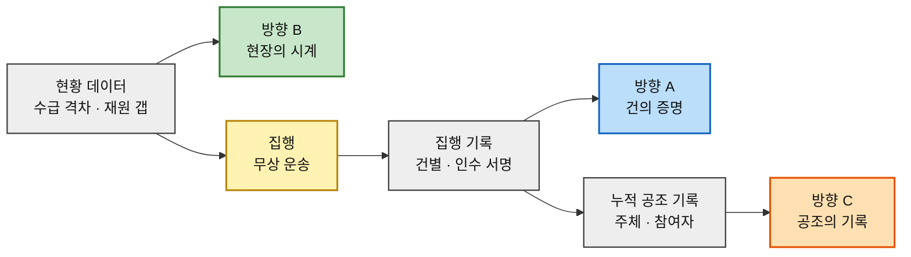

# 차별적 가치목표 제안 ③ — 구호재원 모금 기반 식량 무상 운송 서비스

> 입력 [경쟁사 가치선언 분석](./경쟁사-가치선언-03-식량-재분배-플랫폼.md) · [챕터 06 혼합 매트릭스](../06-opportunity-score/분석-03-식량-재분배-플랫폼-혼합매트릭스.md) · [챕터 07 모의 결과보고서](../07-jtbd/모의결과보고서-03-식량-재분배-플랫폼.md) · [여정지도 §16](../05-persona-journey/분석-03-식량-재분배-플랫폼-고객여정지도.md)

> 🎯 **이 문서는 경쟁사 분석 §4-4를 대체한다.** 그쪽의 세 후보(건 단위 증명 / 국경 / 잊히지 않는 관계)는 경쟁 공백에서만 역산한 것이었고, 이 문서는 **사업 주체가 제시한 세 가지 가치**를 경쟁 지형에 대조해 조정한 결과다.
>
> ⚠️ **근거 등급.** 경쟁 대조는 **(확인)**, 조정 논리와 선언문 초안은 **(추정)**, 실행 순서는 **(가정)** 이다.

---

## 0. 제시된 세 가지를 어떻게 다뤘는가

| 제시안 | 경쟁 지형 대조 결과 | 판정 | 조정 방향 |
|---|---|:---:|---|
| **① 투명한 지원 수량과 지원처를 알려준다** | **이미 점유됐다.** WFP ShareTheMeal이 *"우크라이나 550만 끼 · 팔레스타인 756만 끼"* 처럼 **목적지와 수량을 이미 함께 제공**한다 | ⚠️ **부분 중복** | 차별점은 *수량과 지원처*가 아니라 **해상도**다. `국가·총량` → **`건(件)·서명 주체`** 로 내려가야 비로소 빈자리가 된다 → **방향 A** |
| **② 문제 지역 현황을 데이터로 콘텐츠화해 게시한다** | **방향은 맞다.** 다만 원자료는 FAO·WFP·OCHA FTS의 것이라 *"데이터를 가졌다"* 는 차별점이 못 된다 | ✅ **유효 · 근거 교체 필요** | 차별점은 데이터 보유가 아니라 **갱신 주기와 지역 해상도**다. 그리고 이것은 콘텐츠 전략이 아니라 **획득 채널 전략**이다 → **방향 B** |
| **③ 누적 수혜 규모를 어필해 국제 공조 가치를 전파한다** | **그대로 쓰면 진다.** ShareTheMeal 2억 끼, GFN 21억 끼와 **총량으로 겨룰 수 없다** | ⚠️ **재구성 필요** | *"누구의 누적인가"* 를 바꾸면 아무도 없는 자리가 된다. **우리 실적**이 아니라 **참여한 모든 행위자의 공동 기록** → **방향 C** |

> 📌 **세 조정이 전부 같은 원리를 따른다.** 경쟁자들이 이미 하고 있는 것을 **더 잘하겠다**고 말하는 대신, **한 칸 더 내려가거나(A) 한 칸 더 자주 하거나(B) 주어를 바꾼다(C).** 규모로 이길 수 없는 신생 조직이 쓸 수 있는 차별화는 이 세 가지뿐이다.

---

## 1. 방향 A — 건(件)의 증명

### 선언문 초안

> **"우리는 총액을 말하지 않습니다. 당신이 낸 그 한 건이 어느 화물에 실렸고 누가 받았는지, 받은 사람의 서명으로 보여드립니다."**

### 왜 비어 있는가

| 경쟁사 | 증명의 해상도 | 서명 주체 |
|---|---|---|
| WFP ShareTheMeal | **국가 단위 총량** (우크라이나 550만 끼) | WFP 자체 |
| GiveDirectly | **조직 단위 비율** (전달률 84.8%) | 자체 공시 + 외부 RCT |
| GiveWell | **단체 단위 비용효과** (생명 1명당 3,500~5,500달러) | 자체 계산 모델 |
| 네이버 해피빈 | **수수료 0% 원칙** (구조적 보증) | 플랫폼 |
| **비어 있는 자리** | **건(件) 단위 — 기부 1건 ↔ 수령 1건** | **수령 채널의 서명** |

**셋 다 '조직이 얼마나 잘하는가'를 증명하고, 아무도 '내 것이 어디로 갔는가'를 증명하지 않는다.**

### 우리 분석의 어디서 나왔나

| 근거 | 내용 |
|---|---|
| [챕터 06 P13](../06-opportunity-score/분석-03-식량-재분배-플랫폼.md) | 건별 집행 원장 — **AOS 4.0(1위) · Sat 1**. 경쟁 조사에서도 **대체재 없음이 유지된 유일한 항목** |
| [챕터 06 P15](../06-opportunity-score/분석-03-식량-재분배-플랫폼.md) | 인수 확인의 입력 주체 — AOS 3.0. *"우리가 입력하면 자기증명이 된다"* |
| [챕터 07 모의 §3-4](../07-jtbd/모의결과보고서-03-식량-재분배-플랫폼.md) | 기능 환원 **1위 — 증명 체계(DOS 합 2.88)** |
| [챕터 07 모의 1-3](../07-jtbd/모의결과보고서-03-식량-재분배-플랫폼.md) | *"원 단위까지 보진 않아요. **볼 수 있게 되어 있는지**를 보는 거예요"* |

> 📌 **요구 수준이 우리 가정보다 낮다는 것이 이 방향의 결정적 이점이다.** 전면 공개가 아니라 **"내려갈 수 있는 구조"** 면 충족된다. 즉 **모든 건을 항상 보여줄 필요가 없고, 아무 건이나 골라 끝까지 따라갈 수 있으면 된다.**

### 이 선언이 참이 되기 위한 최소 요건

1. **수령 채널이 인수 확인을 입력한다** — 서명·사진·시각. 우리가 대신 입력하면 선언 전체가 무효다
2. **기부 건과 화물 건이 연결된다** — 배치 단위로 묶더라도 역추적 경로가 끊기지 않아야 한다
3. **임의의 한 건을 골라 끝까지 따라갈 수 있다** — 3클릭 이내 목표 *(측정값은 인터뷰에서 확보 필요)*

### 이 선언이 거짓이 되는 신호

- ⛔ 인수 확인을 **우리 직원이 대신 입력**하기 시작한다
- ⛔ *"운영상의 이유로"* 일부 건을 총량으로 묶어 표시한다
- ⛔ 서명 주체가 표시되지 않는 화면이 하나라도 생긴다

> ⚠️ **이 방향의 유일한 급소는 데이터 소유권이다.** [여정지도 §16-5](../05-persona-journey/분석-03-식량-재분배-플랫폼-고객여정지도.md)가 지적한 대로 **우리가 파는 상품을 파트너가 만들어 준다.** 파트너 계약에 인수 확인 입력 의무를 넣지 못하면 **이 선언은 시작할 수 없다.**

---

## 2. 방향 B — 현장의 시계

### 선언문 초안

> **"어디가 비었는지 우리가 먼저 말합니다. 작년 통계가 아니라 이번 달의 그 지역을, 인용할 수 있는 형태로 공개합니다."**

### 왜 비어 있는가

| 경쟁사 | 무엇을 공개하나 | 무엇이 없나 |
|---|---|---|
| OCHA FTS | **자금 흐름** — 요구액·충족률·공여자 | 자금 데이터이지 **현장 상황이 아니다** |
| FAO · WFP 원문 | 손실률·기아 인구 등 **권위 있는 통계** | 방대하고 느리다 — *"마감에 맞지 않는다"* |
| GiveWell | **비용효과 추정** | 특정 지역의 지금 상태는 다루지 않는다 |
| Global FoodBanking Network | 회원 네트워크의 **연간 실적** | 국가별 조직 활동이지 **수급 격차 지도가 아니다** |
| **비어 있는 자리** | **만성·악화 지역의 최신 수급 현황을 인용 가능한 형태로** | — |

**원자료는 모두 공개돼 있다. 없는 것은 데이터가 아니라 갱신 주기와 편집이다.**

### 우리 분석의 어디서 나왔나

| 근거 | 내용 |
|---|---|
| [챕터 06 P31·P32](../06-opportunity-score/분석-03-식량-재분배-플랫폼.md) | 언론·연구자 — *"인용해도 안 다칠 출처"* · *"마감 안에 재가공 가능한 데이터"* |
| [여정지도 §16-4](../05-persona-journey/분석-03-식량-재분배-플랫폼-고객여정지도.md) | **획득 채널이 광고가 아니라 매개자다.** 마케팅 예산으로 살 수 없는 것을 기능으로 산다 |
| [챕터 06 P18](../06-opportunity-score/분석-03-식량-재분배-플랫폼.md) | 불신 시민은 **제3자 보도로만 열린다.** 우리 말은 광고로 분류된다 |
| [챕터 04 §3](../04-tam-sam-som/분석-03-식량-재분배-플랫폼.md) | *"아시아는 버려지는 양이 부족량의 60배"* — **콘텐츠의 핵심 서사가 이미 있다** |

> 🎯 **이 방향의 진짜 정체는 콘텐츠가 아니라 채널이다.** 언론·연구자는 DOS가 0인 비지불 페르소나이지만, **불신 시민과 소액 후원자의 의심을 푸는 외부 증거를 만드는 유일한 경로**다. **비지불 페르소나에 대한 투자가 지불 페르소나를 만든다** — 이 구조를 선언으로 승격시킨 것이 방향 B다.

### 이 선언이 참이 되기 위한 최소 요건

1. **갱신 주기를 숫자로 약속한다** — *"매월 O일 갱신"*. 약속 없는 최신성은 최신성이 아니다
2. **모든 지표에 출처·기준일·산출식을 병기한다** — 언론이 인용의 최소 조건으로 요구하는 것
3. **원본을 내려받게 한다** — CSV·API. 이미지만 있으면 다른 출처로 간다
4. **지표가 갱신되면 알린다** — 이미 나간 기사의 수치가 어긋나면 재인용이 끊긴다

### 이 선언이 거짓이 되는 신호

- ⛔ 갱신이 한 번 밀리고 **공지 없이 넘어간다**
- ⛔ 출처가 우리 내부 추정치인 지표가 섞인다
- ⛔ 콘텐츠는 늘어나는데 **운송 실적이 늘지 않는다** → 미디어가 되고 사업을 잃는다

> ⚠️ **가장 큰 함정은 미디어화다.** 콘텐츠는 운송보다 만들기 쉬워서 조직이 그쪽으로 기운다. **방어 장치는 하나 — 콘텐츠에 쓰는 데이터와 집행에 쓰는 데이터를 같은 파이프라인에서 뽑는 것이다.** 별도로 만들기 시작하면 두 개의 조직이 된다.

---

## 3. 방향 C — 공조의 기록

### 선언문 초안

> **"이 1톤은 우리가 옮긴 것이 아닙니다. 내준 기업, 실어준 선사, 통과시킨 세관, 나눠준 현장, 그리고 당신 — 다섯의 이름이 함께 남습니다."**

### 왜 비어 있는가

**여덟 곳 모두 자기 실적을 말한다.**

| 경쟁사 | 성과의 주어 |
|---|---|
| WFP ShareTheMeal | *"ShareTheMeal이 2억 끼를 나눴다"* |
| Global FoodBanking Network | *"우리 네트워크가 21억 끼를 배분했다"* |
| GiveDirectly | *"우리가 1억 2,600만 달러를 전달했다"* |
| Too Good To Go | *"우리 커뮤니티가 1억 1,560만 백을 구했다"* |
| **비어 있는 자리** | **"이 한 건에 몇 주체가 관여했는가"** — 공조 자체를 성과 단위로 삼기 |

### 우리 분석의 어디서 나왔나

| 근거 | 내용 |
|---|---|
| [챕터 05 §4](../05-persona-journey/분석-03-식량-재분배-플랫폼-페르소나-스펙트럼.md) | 사전 설득 대상 **7종** — 이 사업은 구조적으로 **여러 주체의 합작**이다 |
| [챕터 05 §5-3](../05-persona-journey/분석-03-식량-재분배-플랫폼-페르소나-스펙트럼.md) | *"증명의 원천이 우리 손에 없다"* — **최대 취약점** |
| [챕터 06 P30](../06-opportunity-score/분석-03-식량-재분배-플랫폼.md) | 집단 단위 결과물 — 캠페인 주최자. **SOM 기준 DOS 3위(1.05)** |
| [챕터 07 모의 §3-4](../07-jtbd/모의결과보고서-03-식량-재분배-플랫폼.md) | 신규 2위 기능 — **기억·재접촉(DOS 1.62)** |

> 🎯 **이 방향의 값은 약점을 자산으로 뒤집는 데 있다.** 우리 사업의 최대 취약점은 *"혼자 할 수 있는 게 없다"* 는 것이다. 그런데 **경쟁자들은 전부 혼자 한 것처럼 말하므로**, 합작을 정면으로 내세우는 순간 그 취약점이 **유일한 차별점**이 된다.
>
> 📌 **그리고 이것이 '잊히지 않는 관계'를 만든다.** 챕터 07 모의에서 해지자는 *"5년을 냈는데 아는 게 하나도 없어요"* 라고 했다. **기록에 자기 이름이 있으면 잊히지 않는다.** 누적 총량은 잊히지만 *"내가 낀 그 한 건"* 은 남는다.

### 이 선언이 참이 되기 위한 최소 요건

1. **한 건에 관여한 주체를 전부 표시한다** — 익명 처리하더라도 **개수와 역할**은 밝힌다
2. **기부자를 그 목록에 넣는다** — 참여자가 자기 이름을 찾을 수 있어야 한다
3. **집단 단위로 묶을 수 있다** — 캠페인·기업·학급 단위 공동 기록 *(P30)*
4. **누적을 우리 성과로 표기하지 않는다** — 주어는 항상 *"우리들"* 이지 *"우리"* 가 아니다

### 이 선언이 거짓이 되는 신호

- ⛔ 보도자료 제목이 *"○○, 누적 O톤 달성"* 으로 나간다
- ⛔ 파트너 이름이 **사업 초기에만** 표시되고 규모가 커지면 사라진다
- ⛔ 공조 주체가 실제로는 **우리와 물류사 둘뿐**이다

> ⚠️ **이 선언은 파트너가 실재해야만 성립한다.** [챕터 05 §10](../05-persona-journey/분석-03-식량-재분배-플랫폼-페르소나-스펙트럼.md)이 *"이 사업의 최대 미검증 가정"* 으로 지목한 그 파트너들이다. **다섯 주체를 못 모으면 이 문장은 쓸 수 없다.**

---

## 4. 세 방향의 관계와 실행 순서

### 하나의 파이프라인, 세 개의 출구

세 방향은 별개 사업이 아니라 **같은 데이터 배관의 세 지점**이다. 이것이 셋을 함께 가져가야 하는 이유다.

### 실행 순서

| 순서 | 방향 | 착수 시점 | 이유 |
|:---:|---|---|---|
| **1** | **B 현장의 시계** | **지금** | 운송 실적 0이어도 시작할 수 있는 **유일한 방향**이다. 그리고 언론·연구자를 확보해 두면 A·C가 나왔을 때 **전파 채널이 이미 있다** |
| **2** | **A 건의 증명** | **첫 운송과 동시에** | 파트너 계약에 인수 확인 입력 의무를 **넣은 채로** 시작해야 한다. 나중에 추가하려면 재협상이다 |
| **3** | **C 공조의 기록** | **건이 쌓인 뒤** | 다섯 주체가 실제로 관여한 건이 없으면 서사가 성립하지 않는다 |

> ⚠️ **B를 먼저 하되 B만 하면 안 된다.** 콘텐츠는 만들기 쉽고 운송은 어렵다. **B의 성과 지표를 조회수나 인용 건수가 아니라 "그 콘텐츠를 보고 들어온 기부 전환"으로 잡아야** 미디어화를 막을 수 있다.

### 세 방향이 각각 뒤집는 약점

| 방향 | 우리 약점 | 뒤집힌 결과 |
|---|---|---|
| **A** | 증명 데이터를 파트너가 쥐고 있다 | **자기증명이 아니므로 오히려 신뢰가 높다** |
| **B** | 우리는 데이터 원천이 아니다 | **재가공과 현행화가 곧 가치다** |
| **C** | 혼자 할 수 있는 게 없다 | **합작 자체가 아무도 안 하는 차별점이다** |

> 📌 **세 약점이 전부 "우리 것이 아니다"라는 하나의 사실에서 나온다.** 그리고 세 방향은 전부 그 사실을 숨기지 않고 **전면에 내세우는** 전략이다. 숨기면 취약점이고 드러내면 포지션이 된다.

---

## 5. 통합 선언문 초안

> ### **"비어 있는 곳을 먼저 보여주고, 그곳에 닿은 한 건을 받은 사람의 서명으로 증명하고, 그 한 건이 몇 사람의 손을 거쳤는지 남깁니다."**

**해설.** 세 절이 각각 방향 B·A·C이며 순서가 곧 실행 순서다. 이 문장이 경쟁 지형에서 살아남는 이유는 셋 다 **경쟁자가 안 하는 것**이어서가 아니라, **셋을 한 배관으로 잇는 곳이 없어서**다. 데이터를 가진 곳(OCHA)은 집행하지 않고, 집행하는 곳(GFN·푸드뱅크)은 건 단위로 증명하지 않으며, 증명하는 곳(GiveDirectly·GiveWell)은 현장 데이터를 만들지 않는다.

### 짧은 형(태그라인 후보)

| 후보 | 문장 | 강조점 |
|:---:|---|---|
| **1** | *"총액이 아니라 한 건."* | 방향 A 단독. 가장 날카롭지만 파트너 확보 전에는 쓸 수 없다 |
| **2** | *"우리가 옮긴 게 아니라, 우리들이 옮겼습니다."* | 방향 C 단독. 감정적 호소력이 가장 크다 |
| **3** | *"먼저 보여주고, 그다음 증명합니다."* | B → A 순서. **지금 쓸 수 있는 유일한 문장** |

> 📌 **지금 채택 가능한 것은 3번뿐이다.** 1번과 2번은 실행이 선언을 따라잡은 뒤에 꺼내야 한다. [챕터 07 모의](../07-jtbd/모의결과보고서-03-식량-재분배-플랫폼.md)가 확인한 *"숫자가 나오면 오히려 더 의심된다"* 는 반응은, **실행보다 앞선 선언에 대한 방어 반응**이다.

---

## 6. 위험과 근거 등급

### 세 방향이 공유하는 단 하나의 전제

**셋 다 파트너 확보에 종속된다.**

| 방향 | 종속 대상 |
|---|---|
| A | 수령 채널의 **인수 확인 입력** |
| B | 현장 데이터의 **정기 수급** (수령 채널·현지 사무소) |
| C | **다섯 주체의 실재** — 잉여 보유처·물류사·통관·수령 채널·기부자 |

> 🚨 **파트너가 없으면 세 방향 모두 선언만 남는다.** 챕터 05 §10과 챕터 06 §7-1이 반복해서 1순위로 지목한 것이 바로 이 검증이며, **이 문서는 그 검증을 대체하지 못한다.**
>
> **선언문 확정 전에 반드시 할 일** — 수령 채널 후보 2~3곳에 *"기부 건 단위로 인수 확인을 입력해 줄 수 있는가"* 를 직접 묻는다. **답이 '아니오'면 방향 A와 C를 접고 B만 남긴다.**

### 근거 등급

| 구성 요소 | 등급 | 비고 |
|---|---|---|
| 경쟁사 선언·활동 대조 | **(확인)** | [경쟁사 분석](./경쟁사-가치선언-03-식량-재분배-플랫폼.md)의 검증 링크 승계 |
| 제시안 3종의 중복·공백 판정 | **(추정)** | 공개 자료 기준. 개별 기능 수준 실사용 검증 미실시 |
| 세 방향의 근거로 인용한 AOS·DOS 값 | **(가정)** | 인터뷰 없는 추정값 |
| 챕터 07에서 인용한 참가자 발언 | **(가정)** | **모의 응답. 실존 인물의 말이 아니다** |
| **선언문 초안 · 실행 순서** | **(가정)** | 위 값들의 산물 |

> ⚠️ **방향 C의 근거가 가장 얇다.** '기억·재접촉'은 [챕터 07 모의 세션 1건](../07-jtbd/모의결과보고서-03-식량-재분배-플랫폼.md)에서만 나왔고 그마저 생성된 응답이다. **경쟁자가 없다는 것이 시장이 없다는 뜻일 수도 있다** — 실제 해지자 인터뷰에서 재확인되기 전에는 보조 서사로만 쓴다.
