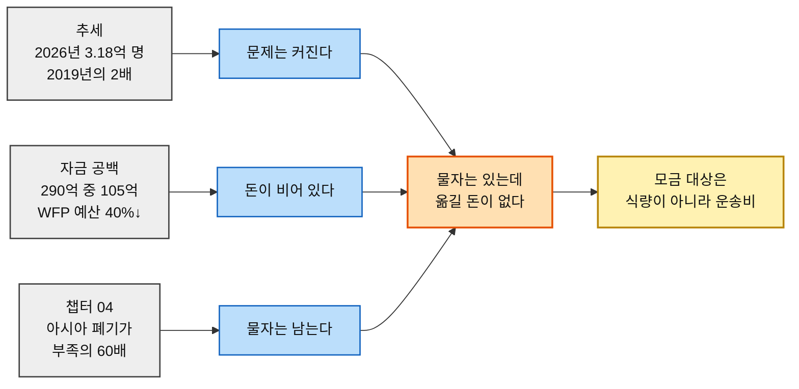
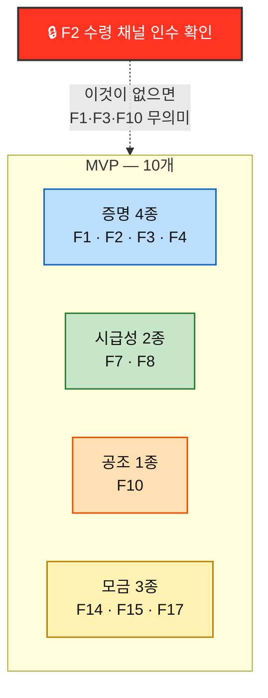

# Value Proposition ③ — 구호재원 모금 기반 식량 무상 운송 서비스

> 🤖 **작성 — Claude Opus 5 · reasoning effort `xhigh`** · 2026-08-13

> **입력** [챕터 04 TAM-SAM-SOM](../04-tam-sam-som/분석-03-식량-재분배-플랫폼.md) · [챕터 05 페르소나 스펙트럼](../05-persona-journey/분석-03-식량-재분배-플랫폼-페르소나-스펙트럼.md) · [고객 여정지도](../05-persona-journey/분석-03-식량-재분배-플랫폼-고객여정지도.md) · [챕터 06 AOS](../06-opportunity-score/분석-03-식량-재분배-플랫폼.md) · [DOS](../06-opportunity-score/분석-03-식량-재분배-플랫폼-DOS.md) · [혼합 매트릭스](../06-opportunity-score/분석-03-식량-재분배-플랫폼-혼합매트릭스.md) · [챕터 07 JTBD 결과](../07-jtbd/모의결과보고서-03-식량-재분배-플랫폼.md) · [챕터 08 경쟁 분석](../08-competitor-branding/경쟁사-가치선언-03-식량-재분배-플랫폼.md) · [가치목표 제안](../08-competitor-branding/가치목표-제안-03-식량-재분배-플랫폼.md)

> ⚠️ **근거 등급이 항목마다 다르다.** §4 기존 대안과 §7의 시급성 통계는 **(확인 · 외부 실측)**, §1~§3의 Pain·Job·Outcome은 **(가정 · 인터뷰 미실시)** 다. 상세는 §9.

---

## 사업 정의 — 한 문단

**전 세계 구호 재원의 가용 현황을 확인시키고 신규 구호자금을 모금하는 페이지**를 운영한다. 잉여 식량은 사전 설득으로 무상 확보하고, **모금액은 식량이 아니라 그것을 옮기는 운송비에 투입**한다. 성과 단위는 `모금액(원) → 운송 톤(t) → 도달 인구(명)` 이며, **고객에게 파는 것은 식량이 아니라 "당신의 돈이 몇 톤을 옮겼는가"라는 증명**이다.

---

# 1. 페르소나 및 CJM 기반 고객별 핵심 문제 (Pain · Needs)

## 1-1. 여정의 공통 구조 — 병목은 두 곳이다

개인 기부자형 8단계 여정에서 이탈은 **②의심 검문**(결제 전 차단)과 **⑤공백**(결제 후 소멸) 두 곳에 집중된다.

> 📌 **결제(④)는 여정의 끝이 아니라 중간이다.** 가치가 실제로 전달되는 지점은 ⑥증명이며, 그 앞의 ⑤공백이 가장 길다. **여정 시간의 대부분을 차지하는 구간에 설계가 가장 적게 들어가 있다.**

## 1-2. 인물별 핵심 Pain

| 인물 | 스펙트럼 | 핵심 Pain | 병목 단계 |
|---|:---:|---|:---:|
| **개인 소액 정기 후원자** 「오천 원이 몇 킬로냐」 | 🔵 핵심 | 리드타임 동안 신호가 없어 방치됐다고 느낀다. 알림이 와도 **"또 뭐 달라고 할까봐" 열지 않는다** | ⑤ 공백 |
| **일회성 충동 기부자** 「뉴스 보고 들어왔다」 | 🔵 핵심 | 감정 유효 시간이 몇 분인데 **회원가입·본인인증에서 막힌다.** 연락처를 못 받으면 여정에서 영구 소실 | ④ 결제 |
| **기업 사회공헌·ESG 담당** 「이사회에 보고할 숫자」 | 🔵 핵심 | 운송 리드타임과 **분기 마감이 어긋나** 그해 실적으로 쓸 수 없다 | ⑦ 성과 수령 |
| **공여기관·재단 프로그램 오피서** 「어디가 비어 있나」 | 🔵 핵심 | 재원 현황이 기관별로 흩어져 **갭 판단에 2~3주**가 걸린다. 신생 파트너는 심의 요건 3종을 못 맞춘다 | ④ 내부 승인 |
| **제3자 모금 캠페인 주최자** 「우리 반이 한 트럭」 | 🔵 핵심 | 참여자가 *"그 돈으로 뭐 했어요?"* 라고 묻는데 **답할 자료가 없다** | ⑥ 결과 회수 |
| **타 기부 플랫폼 정기 후원자** 「이미 다른 데 후원 중」 | 🟢 확장 | 끊고 싶어도 **"끊는 것도 일"** 이라 못 끊는다. 죄책감이 정리를 막는다 | ② · ④ |
| **언론·연구자·정책 담당** 「기사에 쓸 숫자」 | 🟢 확장 | 원자료는 방대하고 느려 **마감에 맞지 않는다** | ③ 소재 확보 |
| **극단적 투명성 요구 기부자** 「원 단위로 캐묻는다」 | 🔴 극단 | 총액만 있고 **건별 내역이 없어 검증이 중단**된다. 인수 확인을 단체가 입력하면 **자기증명**이 된다 | ② 의심 검문 |
| **정기 후원 해지자** *(신규 발견)* | 🔵 핵심의 이탈 | 카드 재발급으로 자동이체가 초기화됐을 때 **이름을 봐도 무엇 하는 곳인지 안 떠올라** 다시 걸지 않았다 | ⑤ → 이탈 |
| **IPC 3+ 위기 가구 구성원** 「배급소에서 결과만 만난다」 | ⬜ 비활성 | 다음 배급 시점을 몰라 **미리 식사를 줄인다**(선제적 결식) | ⑥ 다음 배급 불확실 |

## 1-3. 92개 Pain을 관통하는 Need

| 발견 | 내용 |
|---|---|
| **불만이 아니라 무기억** | 참가자들은 **불편해하지 않는다.** 무소식을 정상으로 수용하고, 이탈도 불만 없이 일어난다. 이탈 경로는 `무소식 → 불만 → 해지` 가 아니라 **`무소식 → 무기억 → 재등록 목록에서 탈락`** 이다 |
| **Pain 92개 중 절반 이상이 '보이지 않아서'** | 집행 내역이 안 보이고(②), 진행 상태가 안 보이고(⑤), 내 몫이 안 보이고(⑥), 다음 배급일이 안 보인다 |
| **결제는 어느 여정에서도 최대 병목이 아니다** | 12개 여정 중 결제가 병목인 인물은 둘뿐이다. **결제 폼 최적화는 수익이 가장 낮은 투자** |

---

# 2. JTBD 관점 — 고객 상황별 Goal · Job

> [챕터 07 JTBD 요약 카드](../07-jtbd/모의결과보고서-03-식량-재분배-플랫폼.md)에서 추출한 Situation + Job Statement.

| # | 인물 | Situation (When…) | **Job Statement (…I want to…)** |
|:---:|---|---|---|
| **J1** | 개인 소액 정기 후원자 | 밤에 혼자 영상을 보다가 감정이 움직인 순간 | 마음이 움직인 그 자리에서 **무언가 했다는 상태로 넘어가고자** 함 |
| **J2** | 극단적 투명성 요구 기부자 | 연 1회 갱신 검토 시점, 결산 공시가 나오는 때 | 믿는 대신 **확인해서, 계속 낼지 스스로 판정하고자** 함 |
| **J3** | 타 기부 플랫폼 정기 후원자 | 카드 정리·연말정산으로 자동이체 목록을 마주치는 순간 | 늘어난 후원을 정리하고 싶지만, **끊는 사람이 되지 않으면서 정리하고자** 함 |
| **J4** | 공여기관·재단 프로그램 오피서 | 연간 배분 계획 수립기, 작년 목록을 처음 여는 순간 | 비어 있는 칸을 찾아 배분하되, **심의와 감사에서 방어 가능한 형태로** 집행하고자 함 |
| **J5** | 제3자 모금 캠페인 주최자 | 모금 종료 한 달 뒤, 참여자가 *"그거 어떻게 됐어요?"* 라고 묻는 순간 | 내가 열자고 한 일의 **끝을 참여자에게 설명할 수 있고자** 함 |
| **J6** | 기업 사회공헌·ESG 담당 | 10월 보고서 취합 착수부터 12월 중순 마감까지의 창 | 마감 안에 **확정된 정량 실적을 확보해, 차년도 예산을 지키고자** 함 |
| **J7** | 임팩트 투자·사회적 금융 담당 | 딜 소싱 후 첫 스크리닝, 조직 형태를 확인하는 30초 | 넣을 수 있는 **자금 형식이 성립하는지 먼저 가려내고자** 함 |
| **J8** | 정기 후원 해지자 | 카드를 재발급받고 자동이체를 다시 등록하는 순간 | 다시 등록할 목록을 추리며, **무엇이었는지 기억나는 것부터 되살리고자** 함 |

> 🎯 **Job 진술을 세로로 읽으면 동사가 한쪽으로 쏠린다** — 확인하다 · 판정하다 · 방어하다 · 설명하다 · 가려내다 · 되살리다. **고객이 이 서비스에서 수행하는 일은 대부분 '얻는 것'이 아니라 '판단하는 것'이다.** 제품은 물류 서비스가 아니라 **의사결정 보조 도구**에 가깝다.
>
> ⚠️ **J1·J3의 Job은 우리 사업 목표와 어긋난다.** J1은 *"무언가 했다는 상태"* 만 원하고 결과를 보지 않으며, J3은 **정리(=해지)** 를 원한다. **고객의 Job이 항상 우리에게 유리하지 않다는 사실을 숨기지 않는다.**

---

# 3. 고객이 원하는 Outcome

> **측정 가능한 형태**로 서술한다. `📏` 는 실제 인터뷰에서 확보된 수치가 붙은 항목이다.

| # | Outcome | 인물 | Imp | Sat | **AOS** | **DOS**(SAM) | 측정 표현 |
|:---:|---|---|:---:|:---:|:---:|:---:|---|
| **O01** | 지역별 재원 갭 확인 시간 단축 | 공여기관 | 4 | 2 | 2.4 | **0.90** | 📏 현재 **2~3주** → 목표 미확정 |
| **O02** | 제3자 확인 수령 증빙을 감사 자료로 제출 | 공여기관 | 5 | 3 | 2.0 | **0.90** | 감사 인정 여부 (이진) |
| **O03** | 확정 실적 수령 | 기업 CSR | 5 | 2 | 3.0 | **0.75** | 📏 **12월 중순까지** |
| **O04** | 6개월 뒤에도 이름을 보면 무엇 하는 곳인지 떠오른다 | 해지자 | 5 | 1 | **4.0** | **0.72** | 재등록 시 인지율 *(미확정)* |
| **O05** | 수령 확인의 입력 주체가 수령 채널임을 확인 | 투명성군 | 5 | 1 | **4.0** | **0.72** | 서명 주체 표시율 100% |
| **O06** | 해지·감액을 사과나 통화 없이 완료 | 타 플랫폼 | 4 | 1 | 3.2 | **0.54** | 소요 시간 *(미확정)* |
| **O07** | 알림이 추가 요구를 담지 않았음을 열기 전에 안다 | 소액 일반군 | 4 | 1 | 3.2 | **0.54** | 알림 개봉률 |
| **O08** | 총액에서 개별 건까지 내려갈 수 있다 | 투명성군 | 4 | 1 | 3.2 | **0.54** | 임의 건 역추적 클릭 수 |
| **O09** | 소액 테스트에도 동일한 증명이 온다 | 투명성군 | 4 | 1 | 3.2 | **0.54** | 📏 **6개월** 테스트 후 증액 |
| **O10** | 심의 요건 3종을 충족한 상태로 제출 | 공여기관 | 5 | 4 | 1.0 | **0.45** | 📏 **3년 집행 실적 · 유사 사업 · 감사보고서** |
| **O11** | 종료 후에도 조회 가능한 집단 결과 | 캠페인 주최자 | 5 | 1 | **4.0** | 0.40 *(SOM 1.40)* | 📏 **1개월** 시점 재질문 대응 |
| **O12** | 다시 시작할 곳을 찾을 수 있다 | 해지자 | 3 | 1 | 2.4 | 0.36 | 재개 전환율 |
| **O13** | 임직원 참여 실적으로 차년도 예산 방어 | 기업 CSR | 5 | 4 | 1.0 | 0.25 | 예산 유지 여부 (이진) |
| **O14** | 사내 검토 4종 자료 일괄 확보 | 기업 CSR | 5 | 4 | 1.0 | 0.25 | 📏 기부금영수증·중립성·세무·사진권 |
| **O15** | 진척이 참여자가 실제로 보는 자리에 표시 | 캠페인 주최자 | 4 | 2 | 2.4 | 0.20 | 위젯 임베드 수 |
| **O16** | 참여자 명단을 자동으로 확보 | 캠페인 주최자 | 3 | 1 | 2.4 | 0.20 | 수기 작성 건수 0 |
| **O19** | 회수 구조를 갖춘 자금 형식으로 검토 목록 진입 | 임팩트 투자 | 5 | 2 | 3.0 | 0.06 | 검토 목록 등재 여부 |
| **O20** | 톤당 단가 시계열 제공 | 임팩트 투자 | 4 | 2 | 2.4 | 0.04 | 📏 **최소 3년치** |

> ⚠️ **측정 표현이 붙은 것은 18개 중 6개뿐이다.** 나머지는 *"몇 분·몇 %·몇 건"* 이 비어 있고, **그 빈칸이 실제 인터뷰에서 반드시 받아 와야 할 목록**이다.
>
> 🔻 **두 Outcome은 반증되어 제외했다** — 후원처 비교(O17)와 상대 판단(O22). 수요 측(*"비교하고 싶어 하지 않는다"*)과 공급 측(*"GiveWell이 이미 제공"*) **양쪽에서 부정**됐다.
>
> ⬜ **수혜형 3개(O34·O35·O36)는 이 표에 없다.** 이 사람은 우리에게 돈을 내지 않으므로 **사업 우선순위가 아니라 성과 판정 기준**으로 따로 관리한다.

---

# 4. 기존 대안 (Competitor / Substitute)

> [챕터 08 경쟁 분석](../08-competitor-branding/경쟁사-가치선언-03-식량-재분배-플랫폼.md) · 규모는 각 기관 공식 발표 기준 · **(확인)**

| 서비스 | 경쟁 축 | 규모 | 가치 선언 *(활동에서 역산)* |
|---|---|---|---|
| **WFP ShareTheMeal** | 모금 | 누적 **2억 끼**(2023.11) · 52개 통화 | *"기부를 금액이 아니라 끼니로 셉니다"* |
| **네이버 해피빈** | 모금 | 20년 누적 **3,000억 원** · 참여자 1,200만 명 | *"오늘 남긴 글 한 편이 이미 기부입니다. 그 100원은 한 푼도 우리에게 남지 않습니다"* |
| **Too Good To Go** | 잉여식량 | 사용자 **1.2억 명** · 21개국 · 2024년 백 **1억 1,560만 개** | *"음식을 구하는 데 선한 마음까지 요구하지 않겠습니다"* |
| **Global FoodBanking Network** | 잉여식량 | **46개국** · 2024년 배분 **7.62억 kg** ≈ 21억 끼 | *"우리는 식량을 나르지 않습니다. 나를 수 있는 조직을 세웁니다"* |
| **전국푸드뱅크** | 잉여식량 | 광역 17 + 기초 **450여** 거점 · 보건복지부 산하 | *"버려질 식품이 제도 안에서 움직이게 합니다"* |
| **OCHA FTS** | 재원 가시화 | 인도적 자금의 **글로벌 기준점** · HDX 227개 데이터셋 | *"돈을 다루지 않습니다. 모두가 같은 방식으로 말할 수 있게 합니다"* |
| **GiveDirectly** | 신뢰·검증 | 2024년 **1.26억 달러** · 11개국 217,219명 | *"믿으라고 하지 않겠습니다. **84.8%** 가 사람에게 갔다는 사실을 확인하십시오"* |
| **GiveWell** | 신뢰·검증 | 2024년 **3.97억 달러** 배분 · 생명 1명당 3,500~5,500달러 | *"우리 계산을 보고 직접 판단하십시오"* |

> 🚨 **우리는 네 시장에서 동시에 아마추어다.** 각 축에 전업 강자가 있고, 규모·제도·데이터 어느 것도 앞서지 않는다. **네 가지를 다 한다는 것은 네 번 비교당한다는 뜻**이다.
>
> ⚠️ **'투명성'은 이미 레드오션이다.** GiveDirectly는 전달률을, GiveWell은 계산 모델과 오류까지, 해피빈은 수수료 0%를 각각 브랜드 축으로 잡았다. **형용사로는 차별화가 생기지 않는다.**

---

# 5. 우리 솔루션의 핵심 제안 (Value Proposition)

> ## **"비어 있는 곳을 먼저 말하고, 채운 한 건을 받은 사람의 서명으로 증명하며, 그 한 건에 함께한 이름을 모두 남깁니다.**
> ## **셋 중 하나라도 못 하면, 그 건은 우리 실적이 아닙니다."**

### 이 문장이 성립하는 이유

| 절 | 대응 방향 | 경쟁 공백 |
|---|---|---|
| *"비어 있는 곳을 먼저 말하고"* | **B — 시급성 가시화** | FTS는 자금만, FAO·WFP는 느리다. **지금 그 지역**을 인용 가능한 형태로 주는 곳이 없다 |
| *"받은 사람의 서명으로 증명하며"* | **A — 건의 증명** | 여덟 곳 모두 조직·국가 단위. **건 단위 + 제3자 서명은 공백** |
| *"함께한 이름을 모두 남깁니다"* | **C — 공조의 기록** | 여덟 곳 모두 **자기 실적을 주어로** 삼는다 |
| *"못 하면 실적이 아닙니다"* | 세 방향의 **자기 구속** | **"세지 않겠다"고 말한 곳은 없다** |

> 📌 **세 절이 하나의 순환을 이룬다.** B가 모금을 열고 → 모금이 집행을 만들고 → 집행 기록이 A와 C를 만들고 → A와 C가 다시 모금으로 돌아온다. **어느 하나를 빼면 고리가 끊긴다.**

---

# 6. 우리가 제공하는 차별적 가치

## 6-1. 세 방향

| 방향 | 선언 *(공개 약속형)* | 청중 | 지금 실행 가능? |
|---|---|---|:---:|
| **A. 건의 증명** | *"총액을 말하지 않습니다. 받은 사람의 서명이 붙지 않은 한 건은, 우리 실적으로 세지 않습니다."* | 극단적 투명성 요구 기부자 · 개인 소액 정기 후원자 | ⏳ 첫 운송 필요 |
| **B. 시급성 가시화** | *"어디가 얼마나 급한지 우리가 먼저 말합니다. 출처와 기준일이 붙지 않은 숫자는 한 줄도 싣지 않습니다."* | 언론·연구자 · 공여기관 오피서 *(+ 개인 기부자 3종의 진입 관문)* | ✅ **오늘 가능** |
| **C. 공조의 기록** | *"이 1톤은 우리가 옮긴 것이 아닙니다. 함께한 이름을 전부 밝히지 못하는 건은, 성과로 발표하지 않습니다."* | 제3자 모금 캠페인 주최자 · 기업 사회공헌 담당 | ⏳ 파트너 확보 필요 |

## 6-2. 세 방향은 같은 약점을 뒤집은 것이다

| 방향 | 우리 약점 | 뒤집힌 결과 |
|---|---|---|
| **A** | 증명 데이터를 파트너가 쥐고 있다 | **자기증명이 아니므로 오히려 신뢰가 높다** |
| **B** | 우리는 데이터 원천이 아니다 | **편집과 해석이 값이다** |
| **C** | 혼자 할 수 있는 게 없다 | **합작 자체가 아무도 안 하는 차별점이다** |

> 🎯 **세 선언이 하나의 브랜드로 읽히는 이유** — 전부 *"우리가 덜 가져간다"* 는 형태다. A는 세는 권한을, B는 해석의 독점을, C는 성과의 소유권을 내려놓는다. **경쟁사들이 자기 실적을 키워 신뢰를 만드는 동안, 우리는 자기 몫을 줄여 신뢰를 만든다.**

---

# 7. Proof

## 7-1. 고객가치 도출의 근거 — 다섯 경로가 같은 곳을 가리켰다

| 경로 | 산출물 | 지목한 것 |
|---|---|---|
| **① 페르소나 분석** | 12종 중 7명이 같은 요구 | **증명** |
| **② 여정 분석** | Pain 92개 중 절반 이상이 *"보이지 않아서"* | **증명** |
| **③ AOS** | 기능 환원 1위 — 증명 체계 **합 17.6**, 2위(7.2)의 두 배 | **증명** |
| **④ DOS** | 두 모수 모두 상위 8위 안에 남은 6개 중 **4개가 증명 체계** | **증명** |
| **⑤ 경쟁 조사** | Satisfaction 1점 5개 중 **P13(건별 원장)만 대체재 없음 유지** | **건 단위 증명** |

> 🎯 **모수 선택도, 축 조합도, 수요 측 반증도 이 결론을 바꾸지 못했다.** 반면 한때 AOS 1위였던 '비교 단위'는 **수요 측과 공급 측 양쪽에서 무너졌다** — 이 대비가 증명 체계의 견고함을 보여준다.

## 7-2. 시급성 근거 — 외부 실측 **(확인)**

| 층 | 지표 | 출처 |
|---|---|---|
| **규모** | 2025년 IPC 3+ **2억 6,600만 명**(47개국, 22.9%). 절대수는 줄었으나 **비율은 상승**(22.6%→22.9%) — 분석국이 53→47로 감소한 탓 | [GRFC 2026](https://knowledge4policy.ec.europa.eu/publication/global-report-food-crises-2026_en) · [GRFC 2025](https://www.fightfoodcrises.net/articles/2025-global-report-food-crises-acute-food-insecurity-and-malnutrition-rise-sixth) |
| **추세** | 2026년 전망 **3억 1,800만 명** = 2019년의 **두 배 이상** · 핫스팟 16곳 중 **14곳의 주 원인이 분쟁** | [WFP Global Outlook](https://www.wfp.org/stories/wfp-global-outlook-things-have-never-been-so-bad-hunger-rises-amid-funding-cuts) · [FAO Hunger Hotspots](https://www.fao.org/markets-and-trade/do-not-touch/all-widgets/hunger-hotspots---fao-wfp-early-warnings-on-acute-food-insecurity--november-2025-to-may-2026-outlook/en) |
| **자금 공백** | 필요 **290억 중 105억만 확보(36%)** · WFP 예산 **40% 감소**(100억→64억 달러) · **6개 운영 파이프라인 붕괴 위험** | [WFP](https://www.wfp.org/news/wfp-warns-six-critical-operations-are-facing-significant-food-aid-pipeline-breaks-year-end) |
| **아시아** | 아프가니스탄 겨울 **1,700만 명 이상** · 세계 기아 2/3를 차지하는 10개국 중 **4개가 아시아** | [WFP](https://www.wfp.org/news/latest-food-security-report-confirms-fears-deepening-hunger-crisis-afghanistan-winter-sets) · [IPC](https://www.ipcinfo.org/ipc-country-analysis/details-map/en/c/1159622/) |

### 이 근거가 사업 논거로 직결되는 방식

## 7-3. 대안과의 차별성 비교

| 비교 축 | ShareTheMeal | 해피빈 | GiveDirectly | GiveWell | GFN·푸드뱅크 | OCHA FTS | **우리** |
|---|:---:|:---:|:---:|:---:|:---:|:---:|:---:|
| **증명 해상도** | 국가·총량 | 수수료 0% | 조직 84.8% | 단체 비용효과 | 연간 배분량 | — | **건(件)** |
| **증명 서명 주체** | 자체 | 플랫폼 | 자체+RCT | 자체 모델 | 자체 | — | **수령 채널** |
| **현장 시급성 발행** | 캠페인 단위 | ✖ | ✖ | ✖ | 연차보고 | 자금 데이터만 | **월 갱신·출처 병기** |
| **성과의 주어** | 자사 | 자사 | 자사 | 자사 | 자사 | — | **참여 주체 전원** |
| **국경 넘는 이동** | ✔ | ✖ | ✔(현금) | — | 국가별 조직 | — | **✔ 물자** |
| **"세지 않겠다" 선언** | ✖ | ✖ | ✖ | ✖ | ✖ | ✖ | **✔** |

> 📌 **차별성은 새로운 일을 하는 데서 오지 않는다.** 여섯 축 중 넷은 경쟁사도 하고 있다. **우리 자리는 해상도(건)·서명 주체(외부)·주어(우리들)** 세 칸이며, 마지막 줄이 그 셋을 묶는 자기 구속이다.

## 7-4. 반증된 것도 함께 기록한다

| 항목 | 한때의 판정 | 반증 | 출처 |
|---|---|---|---|
| **후원처 비교 단위**(P07) | AOS **4.0 · 1위** | 수요 측 — *"비교를 해야 한다는 생각을 안 해봤어요"* / 공급 측 — **GiveWell이 이미 제공** | [챕터 07](../07-jtbd/모의결과보고서-03-식량-재분배-플랫폼.md) · [챕터 08](../08-competitor-branding/경쟁사-가치선언-03-식량-재분배-플랫폼.md) |
| **소액 증명 부재**(P14) | Sat **1** *(대체재 없음)* | ShareTheMeal이 **0.80달러 단위**로 목적지 지정 제공 | [챕터 08 §4-3](../08-competitor-branding/경쟁사-가치선언-03-식량-재분배-플랫폼.md) |

> 🎯 **반증을 남기는 것이 이 문서의 신뢰 근거다.** AOS 1위 항목을 스스로 폐기한 기록이 있어야, 남은 항목이 살아남은 것이라는 말에 무게가 실린다.

---

# 8. Job-Feature Map

## 8-1. 기능 명세

> **중요도** = AOS·DOS + 여정 병목 + 위생 요건 여부 · **난이도** = 개발·협상 난도 종합
> `🔒` 는 **파트너 확보에 종속**된 기능

| 기능명 | 핵심 Job 연관성 | 중요도 | 난이도 | MVP | 우선순위 |
|---|---|:---:|:---:|:---:|:---:|
| **F1** 건별 집행 원장 *(임의 건 역추적)* | J2 확인·판정 · J1 결과 확인 | **5** | 4 | ✔ | **High** |
| **F2** 🔒 수령 채널 인수 확인 입력 *(서명·시각·주체)* | J2 자기증명 회피 · **F1·F5·F10의 선행 조건** | **5** | **5** | ✔ | **High** |
| **F3** 소액에도 동일한 증명 발송 | J2 소액 테스트 후 증액 | 4 | 2 | ✔ | **High** |
| **F4** 진행 중 상태 신호 *(집하→선적→통관)* | J1 *"뭐가 됐지"* · J8 무기억 방지 | **5** | 4 | ✔ | **High** |
| **F7** 시급성 콘텐츠 발행 *(출처·기준일·월 갱신)* | J4 갭 판단 · **개인 기부자 3종의 진입 관문** | **5** | 2 | ✔ | **High** |
| **F8** 원본 데이터 다운로드 + 표준 인용 문구 | 언론·연구자 → J4 간접 · **획득 채널** | 3 | 1 | ✔ | **High** |
| **F10** 건별 참여 주체 표시 *(5주체 이름)* | J5 설명 가능 · J6 사내 공유 | 4 | 2 | ✔ | **High** |
| **F14** 비회원 30초 결제 | J1 *"그 자리에서 끝내기"* · **위생 요건** | **5** | 3 | ✔ | **High** |
| **F15** 원 → kg → 명 환산 표시 | J1 금액 결정 · **③환산 관문** | 4 | 2 | ✔ | **High** |
| **F17** 요구 없는 알림 *(봉투에 요청 부재 명시)* | J1 알림 미개봉 해소 | 4 | 2 | ✔ | **High** |
| **F5** 개인 누적 결과 카드 *(공유 가능)* | J1 ⑦되풀이 · J8 이름 인지 | 4 | 2 | ✖ | Mid |
| **F6** 재원 갭 대시보드 *(지역·시점별)* | J4 배분 출발점 | 4 | 4 | ✖ | Mid |
| **F11** 집단 단위 결과물 *(캠페인·기업·학급)* | J5 *"우리가 함께"* · J6 임직원 참여 | 4 | 3 | ✖ | Mid |
| **F19** 기관 실사·품의 문서 패키지 *(4종)* | J6 결재선 통과 · **위생 요건** | 4 | 2 | ✖ | Mid |
| **F20** 분기 마감 기준 확정 실적 리포트 | J6 *"12월 중순까지"* · **급소** | 4 | 4 | ✖ | Mid |
| **F21** 🔒 제3자 검증 감사 자료 | J4 감사 방어 | 4 | 4 | ✖ | Mid |
| **F9** 지표 버전 관리·갱신 알림 | 언론 재인용 유지 | 2 | 3 | ✖ | Low |
| **F12** 참여자 명단 자동 확보 | J5 수기 명단 해소 | 3 | 3 | ✖ | Low |
| **F13** 임베드 가능한 진척 위젯 | J5 *"참여자가 보는 자리"* | 3 | 2 | ✖ | Low |
| **F16** 해외 결제 경로 *(현지 통화·비카드)* | 해외 거주 기부 시도자 | 3 | 4 | ✖ | Low |
| **F18** 죄책감 없는 해지·감액 | J3 *"끊는 사람 안 되기"* | 3 | 3 | ✖ | Low |

**MVP 10개 · Phase 2 6개 · Phase 3 5개** *(총 21)*

## 8-2. MVP 범위와 그 근거

| 판단 | 근거 |
|---|---|
| **증명 4종을 MVP에 넣는다** | 다섯 경로가 모두 지목했고, 경쟁 조사에서 **건별 원장만 대체재 없음이 유지**됐다 |
| **시급성 2종을 MVP에 넣는다** | 운송 실적 0에도 **오늘 시작 가능**하고, 개인 기부자 3종의 진입 관문이다. F8은 난이도 1로 **가장 싼 획득 채널** |
| **공조 1종(F10)만 넣는다** | F1에 필드를 추가하는 수준(난이도 2)이므로 지금 넣는 것이 나중에 넣는 것보다 싸다. 집단 결과물(F11)은 캠페인 기능이 필요해 Phase 2 |
| **모금 3종은 위생 요건** | 없으면 그 자리에서 탈락한다. 차별화 항목은 아니지만 **빠지면 나머지가 무의미** |
| **비교 단위 기능은 넣지 않는다** | 수요·공급 양쪽에서 반증됐다 *(§7-4)* |
| **F6 재원 갭 대시보드를 뺀다** | 공여기관은 1년차 자금 비중 15%이고, 심의 요건 3종(O10)이 먼저 막는다 |

> 🚨 **F2가 단일 차단 지점이다.** 수령 채널이 인수 확인을 입력하지 않으면 **F1·F3·F5·F10이 전부 무의미**해지고, 핵심 제안(§5)의 두 번째 절도 성립하지 않는다.
>
> **개발 착수 전에 할 일** — 수령 채널 후보 2~3곳에 *"기부 건 단위로 인수 확인을 입력해 줄 수 있는가"* 를 직접 확인한다. **답이 '아니오'면 MVP를 F7·F8·F14·F15·F17 다섯 개로 줄이고 방향 B만 먼저 간다.**

## 8-3. 구현 순서

| 단계 | 기능 | 조건 |
|:---:|---|---|
| **0** | F7 · F8 | 파트너 없이 즉시 착수. 시급성 콘텐츠로 언론·기부자 유입 시작 |
| **1** | F14 · F15 · F17 | 모금 실행 가능 상태 확보 |
| **2** | **F2 확보 협상** | 🔒 여기서 막히면 3단계 전체가 멈춘다 |
| **3** | F1 · F3 · F4 · F10 | 첫 운송과 동시에 증명 체계 가동 |
| **4** | F5 · F11 · F19 · F20 · F21 | 실적 축적 후 확산·기관 대응 |
| **5** | F9 · F12 · F13 · F16 · F18 | 최적화 |

---

# 9. 근거 등급

| 구성 요소 | 등급 | 비고 |
|---|---|---|
| §4 경쟁사 규모·모델·선언 | **(확인)** | 각 기관 공식 발표. 챕터 08 검증 링크 |
| §7-2 시급성 통계 전체 | **(확인)** | GRFC·IPC·FAO·WFP·EC JRC. 기준일 2026-08-13 |
| §7-1 다섯 경로의 수렴 | **(확인)** | 산출물 간 대조 결과 |
| 사업 모델 정의 | **(확인)** | 사업 주체 진술 |
| §1 Pain · §2 Job · §3 Outcome | **(가정)** | **실제 인터뷰 미실시.** JTBD 카드는 모의 응답 기반 |
| §3 Imp · Sat · AOS · DOS 수치 | **(가정)** | 인터뷰 없는 추정값 |
| §8 중요도·난이도·우선순위 | **(추정)** | 위 값들과 개발 판단의 종합 |

> ⛔ **§1~§3과 §8의 수치는 실제 인터뷰가 끝나면 재작성 대상이다.** 특히 Outcome 18개 중 **12개는 측정 표현이 비어 있다.**
>
> ⚠️ **이 문서에서 가장 견고한 것은 §4·§7-2(외부 실측)이고, 가장 얇은 것은 §3의 채점값**이다. **Value Proposition의 방향은 견고한 쪽이 지지하고, 기능의 우선순위는 얇은 쪽에 기대고 있다** — 순서를 바꾸지 말고 읽어야 한다.

## 다음 단계

| 순위 | 할 일 | 이 문서에서 넘기는 것 |
|:---:|---|---|
| **1** | **수령 채널 인수 확인 입력 의사 확인** | F2 — 단일 차단 지점 |
| **2** | **실제 인터뷰 7종 실행** | §3의 빈 측정 표현 12개 |
| **3** | **톤당 운송 단가 산정** | O20 · F20의 선행 조건 |
| **4** | **F7·F8 즉시 착수** | 파트너와 무관하게 오늘 가능 |
